# 22：沙盒与命名空间 🛡️

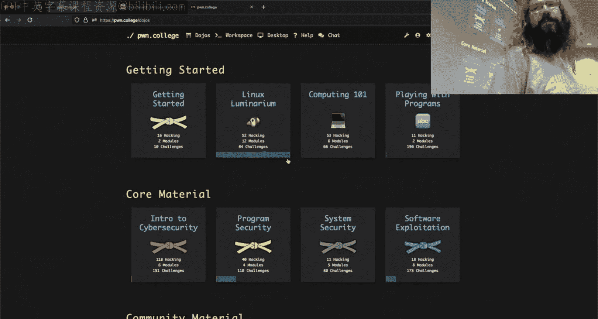

在本节课中，我们将学习沙盒（Sandboxing）和命名空间（Namespaces）的核心概念。这是实现进程隔离、构建容器（如Docker）的基础技术。我们将通过演示来理解如何创建隔离环境，以及如何利用或绕过这些隔离机制。

---

## 课程公告与后续安排 📢

我们按下了按钮，稍等片刻。看看另一边发生了什么。OBS今天能正常工作吗？抱歉我有点迟到了，课前我们闲聊了一会儿。我没有准备幻灯片，但我预先准备了一些演示内容。

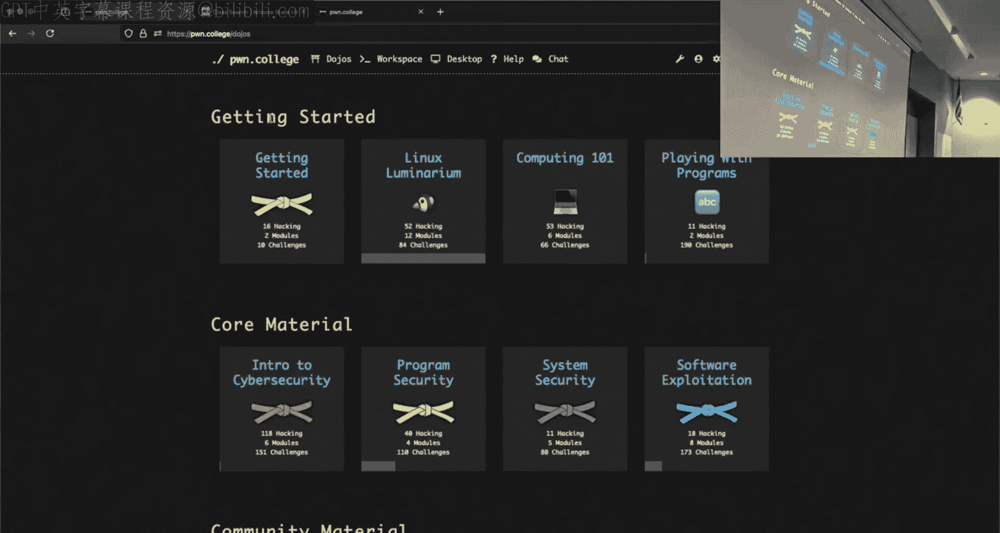

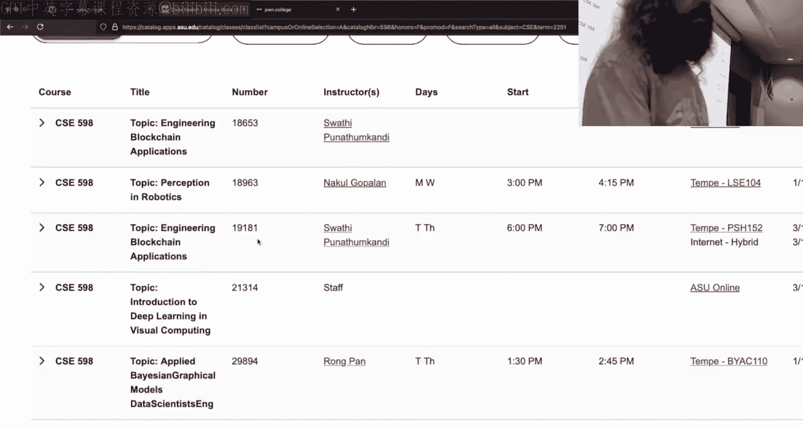

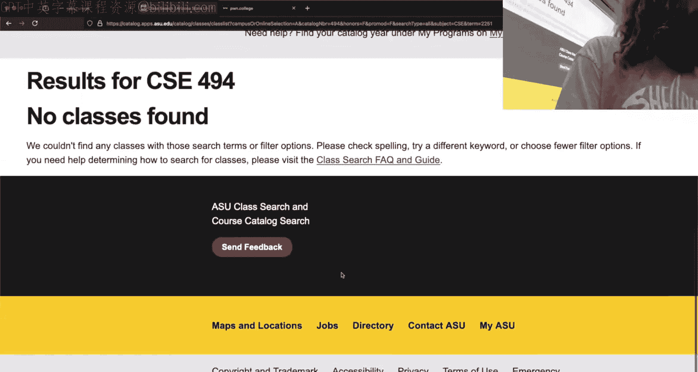

首先，确保音频正常。好的，音频没问题。

除了讨论沙盒，我唯一要宣布的是，我之前提到可能在春季开设的课程现在确实要开设了。如果你对这类内容感兴趣并想继续深入学习，可以关注CSE 598高级软件利用课程。这门课在春季开设，列为每周三小时的三学分课程。它的形式与本课程非常相似，采用翻转课堂模式，我们一起探索。这是一门研究生课程，但如果你是本科生并且需要指导老师的许可，可以联系我，我会帮你与Adam沟通解决。在这门课中，你可能会经常在屏幕上看到他。

好了，我说过我没有幻灯片。

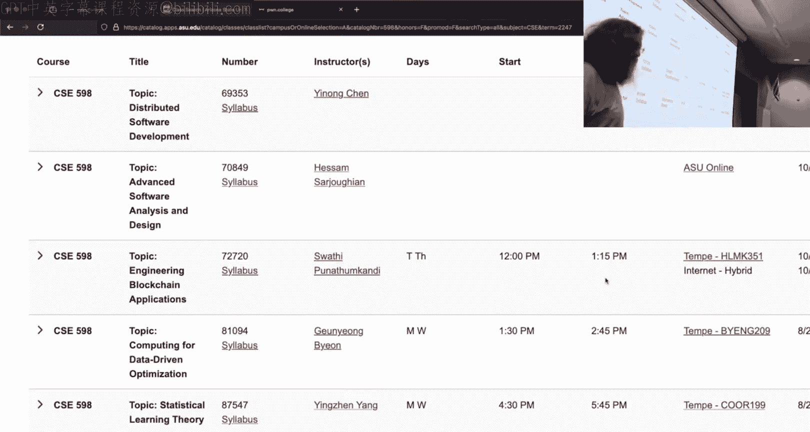

---

## 关于课程编号的说明 🏷️

有人问为什么所有课程都叫CSE 598。这是一个有趣的问题。从管理上讲，像CSE 466这样的课程有固定的课程代码，它们是大学课程设置中固定的一部分。当教师对某个特定主题特别感兴趣，想进行探索、尝试，或基于研究创建新课程时，这个过程通常包括试运行。这就像实验性的东西，可能成功，也可能失败，看看效果和学生兴趣如何。

有两个课程编号可用于此目的：CSE 494和CSE 598。CSE 494是本科水平的主题课程，用于新的、实验性的内容，可能只教一次。CSE 598是研究生水平的等效课程。对于许多网络安全课程，我们试图制定有趣且具有挑战性的课程。网络安全内容的一个普遍问题是需要大量的背景知识，你必须懂很多计算机科学知识才能开始讨论网络安全。因此，网络安全课程往往开得较晚（300或400级），然后你就毕业了。为了以合理的方式编码这些课程，对于软件利用这类主题，我们使用CSE 598这个通用主题课程编号。目前这将是它的第三次迭代，我们对它的发展方向和运作方式有了一些了解。

如果你是对此感兴趣的本科生，你应该能够选上，只需要一些文书工作。

---

## 回到沙盒主题 🔄

我们刚才在谈论沙盒。其他后勤问题，有人问下一个模块是什么。我们将进行内核相关内容。我不会更改内核的任何内容，你将得到现有的内核。但我会讨论我想添加的内容，只是不会添加涉及它们的挑战，因为如果我那样做，每次你在终端按回车都会有两秒的加载时间。

关于线程和命名空间的内容？我认为你不需要线程内容。问题：难的内核，简单的内核？这是简单的内核。你需要知道很多背景知识吗？这说得通，但我不知道你在那里具体指什么。

好的，我想我对你（Twitch）的问题回答完了。

---

## 演示：快速解决挑战 ⚡

那么问题是关于命名空间。我之前花了一点时间研究。我想完成我对第12关的解决方案。我有一个世界上最快的第12关解决方案，对吧？我现在没有了，因为我命名了所有东西为“不要pi并删除它”，这很不幸。但我有另一个，我不知道为什么我把它放在race文件夹里，但我确实放了。这是我工作的地方。这是我用C写的。这就是我的第12关解决方案有多快。不，这个实际上有点慢。因为在优化方案中，我喜欢这个我新写的，我知道我要追求的概念。但我去年的那个方案，我知道我现在为什么慢，我需要更多微调时间，真实时间是0.001秒。所以这完全可行。

额外的输出是因为我在调用write，我只是输出100字节的任意内容。但根据你如何构建侧信道，它可以非常快。如果有人好奇，这个方案没有使用任何多线程或多进程，这是挑战进程的一次启动。

所以如果我们用strace跟踪它，或者我们用strace -F -o，我们称之为out，然后运行。我的strace命令有问题，我需要sudo。sudo su，然后strace -f -o out。然后我们grep这个东西。为什么没工作？现在它根本不工作了，我做了什么？我想我硬编码了文件描述符，这 somehow 破坏了这里。真遗憾。我怎么暂停这个？好吧，你得相信我，因为我不想看源码，但fork在我的C代码里只被调用了一次。哦，我知道我能做什么了。你看到我编译它了吗？不，因为你仍然不知道我调用了fork，而且只有一个fork。好吧，有一个fork。挑战进程启动一次，其他一切都是侧信道。所以，根据你想变得多聪明，关键是你可以获得超级疯狂的速度。

如果你好奇这是如何工作的，你可以私下问我，我会展示。因为我认为这很酷。我会讨论这个技术及其工作原理。

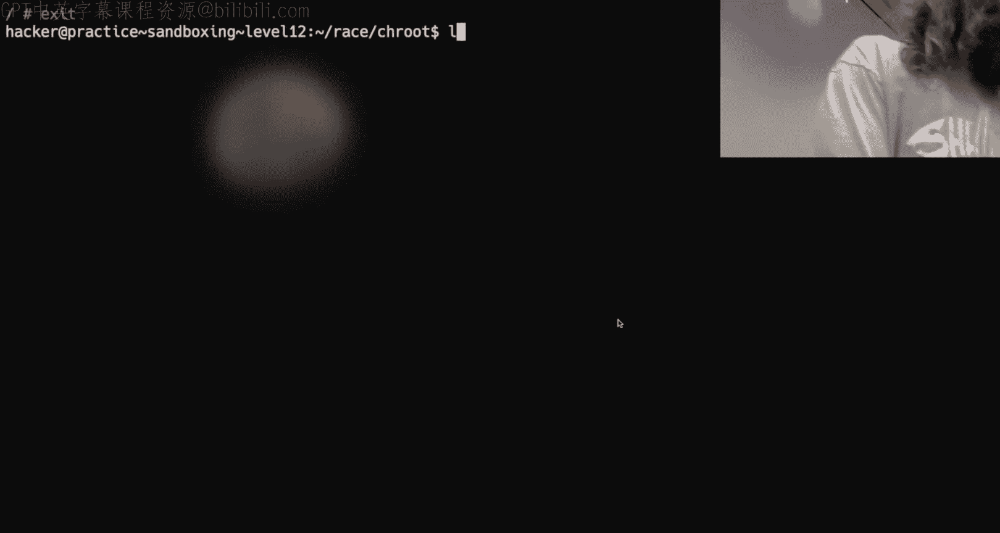

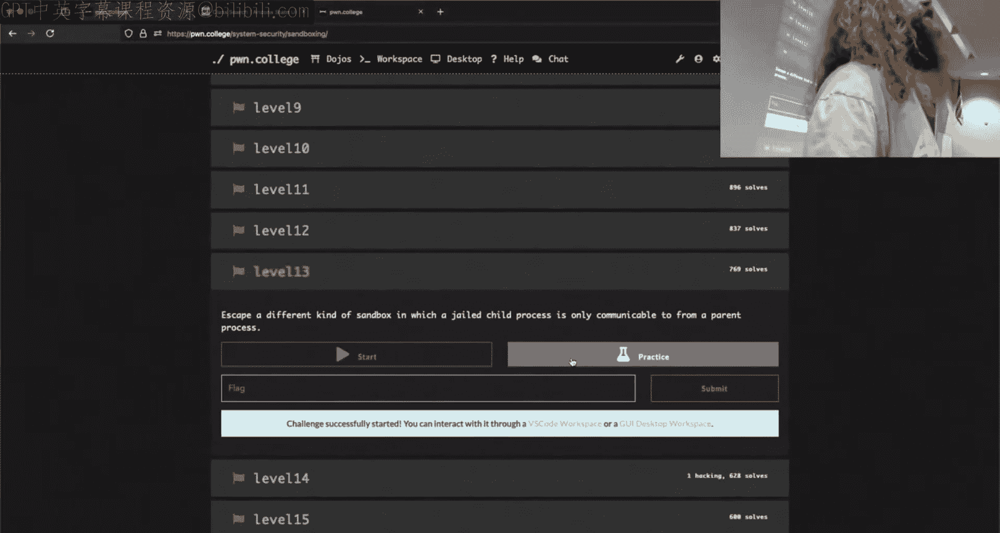

---

## 演示：构建Chroot Jail 🏰

我们还有另一个问题，对吧？昨天（感觉像昨天，但不是）我在那里尝试使用chroot，但事情就是不工作。我就像，好吧，我需要编译一个像hello world的东西，并且需要静态编译，然后Gcc不高兴，我们得到了这个，然后上半节课就偏离了轨道。

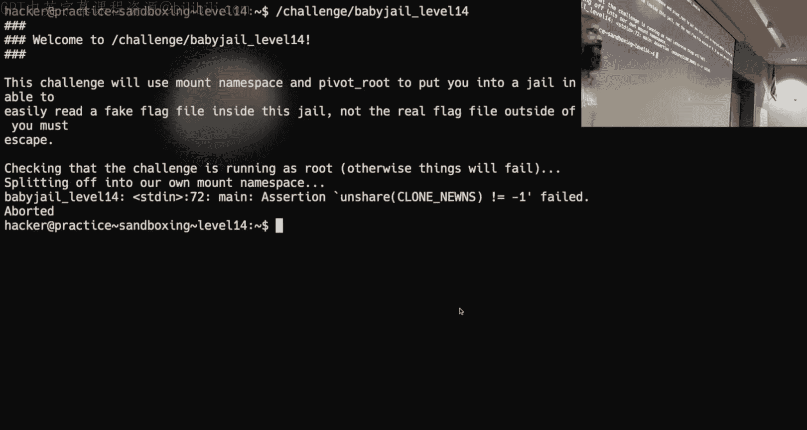

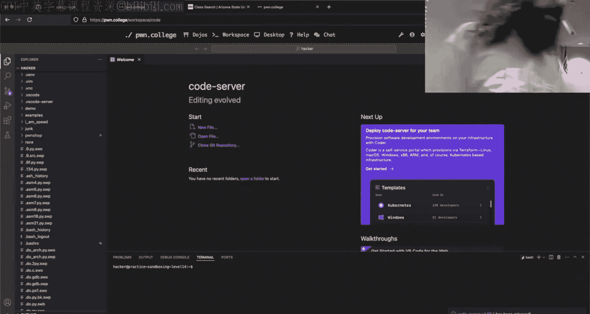

这是一个Dojo异常。看，那个编译了。在一个正常的Linux系统上，你可以做我尝试做的事情，就像使用它一样。问题是什么？是因为/bin被符号链接到/user/bin吗？答案是否定的，那里的兔子洞非常非常深，我们今天不会深入探讨。但关键是，我并没有错，这真的让我昨晚（或者说周二晚上）很困扰，我就像，为什么这不行？

所以你可以静态编译一些东西，我不需要静态编译这个。有人知道busybox是什么吗？是的，busybox是什么？busybox是一个单一二进制文件，你向它传递一个参数，它包含了你在系统上可能想要运行的大多数合理命令的精简版本。

现在，我在这里谈论busybox的原因是，我们将使用busybox制作一个看起来相当合理的chroot jail，而不是使用像/bin/bash这样的东西。

我已经编写了很多脚本，因为我知道我们会超时，如果我开始输入东西，事情会搞砸。所以我们来看看这里。

我将做一些与挑战非常相似的事情，但我在bash中做，而不是C。你也可以在Python中做同样的事情，我们在这里是语言无关的。所以我创建了/tmp/jail。我将busybox复制到该路径。然后我创建一些你可能熟悉的路径：/bin， /usr/bin， /sbin， /etc。然后我将运行那个chroot命令。所以我们将chroot到/tmp/jail，然后调用busybox --install。这做的是创建一大堆名为人们合理期望的busybox副本。

然后我们将chroot到其中并启动一个shell。所以你这样做。我现在在我的jail里。

事情表现得如人所料。我能出去吗？不能。为什么不能？我。

终端和某些东西刚刚过去了，所以你回到幻灯片。所以说法是，当我在终端上使用chroot时，它比我们使用原始进程调用时更聪明。终端chroot也在将我们的目录更改为那里，所以我实际上被困在这里了。

还有人正在研究chroot jail吗？我们的C3 jail挑战。像所有关卡，都在第13关。你在第11关。所以对于像10、11和13关的答案，但13关，我不认为它是chroot jail，所以这是个好迹象，如果你在那里，你已经在chroot内容的另一边了。

我要指出的那件事是，我周二提到的，像文件描述符这样的资源会流经。我们可以演示这一点，但如果每个人都在另一边，那就不重要了。当你到达像10、11、12关时，你做的不是像玩管道或玩文件描述符这样的玩具事情，而是做与侧信道相关的事情，这我们已经讨论过了。所以我认为你在那里状态很好，你同意吗？这只是投入工作的问题。是的，是的，好的。

---

## 命名空间挑战与虚拟机 🖥️

我们来看看。我这里有什么，开始看第13关。一个值得注意的事情，我想。哦不，13关是C3，我纠正一下。那是父子进程的那个，是的，那是它自己的恶作剧。所以第14关是第一个不是chroot jail的关卡。有人说chroot就像，我不认为chroot是相同的，chroot有很长的历史，可以追溯到BSD jails。可能比那更早，但这是我知道的最早的东西。

对于这些命名空间挑战，只是一些管理上的事情。如果我运行这个，我得到这个问题，你可能在其他地方没有注意到，因为我不认为我说过，所以除非你看到Yaun在做，否则你不会知道。为什么会发生这种情况？

我不知道，这是垃圾，对吧？这是我们的问题，我们可能应该添加一些说明。命名空间是支持Docker镜像的底层技术。你不需要知道这个，但你认为Dojo挑战环境是如何工作的？人们喜欢说它们是虚拟机，它们不是虚拟机。那是什么？Docker，是的，是的，当你SSH进入或在这里启动VS Code界面时，在Dojo上，这一切都发生在一个隔离的Docker容器中，只是呈现给你。那是你自己的Docker容器。

所以如果我们要编写挑战并让你玩转命名空间，给你这种权力。你认为让我们在你使用这些工具来防止你，比如说，把你的成绩设置为100%的同一个环境中这样做，是一个明智的想法吗？我们考虑过这一点，因此你不能在这里本地解决这些挑战。相反，你必须启动一个虚拟机。我们试图让这变得容易，所以有一个VM命令存在于你的dojo环境中。它接受一些参数，这里相关的是start、stop、connect，我也会用logs，我们需要日志。在内核模块中，我们不一定需要它们。

所以运行`vm start`，理论上，这会启动一个虚拟机。如果我们查看PS的输出，你会看到这个虚拟机。虚拟机就在这里，那是Team system。这是一个完整的虚拟机。如果我想连接到它，我建议你在其中一个窗格中启动一个tmux会话，运行`vm connect`。这个终端在虚拟机内部，这个在外面。在虚拟机内部，我可以运行这个挑战。在外面，用虚拟机，我不能grep这个作业。

关于虚拟机有什么问题吗？源代码里有检查，如果我没记错的话，它只是没有弹出来。所以可能有人向我指出了这一点，然后我 promptly 没有修复。所以在源代码中，它应该检测你是否在虚拟机中，然后通知你。但这些挑战这样做的方式是通过检查主机名。而主机名不符合这些硬编码的模式，因为这是一种检测你是否在虚拟机中的可怕方式。所以主机名被更改了，因此一些提示没有按你预期的那样出现。

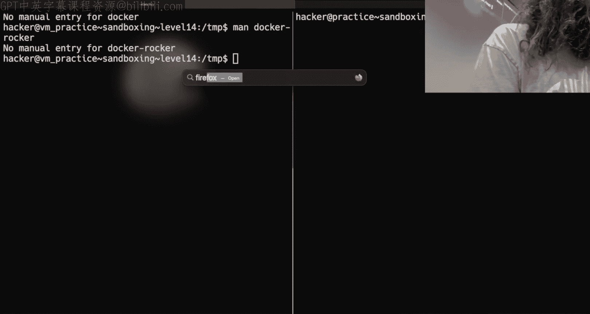

还有一件类似的事情，我现在就把它说出来。如果你查看`/opt/pwn.college/pwn.college/vm/vm`，这是那个VM命令的实现。原来它是用Python写的，所以你完全可以理解它。可能成为问题的一件事是，当你调试时，它可能会告诉你没有权限。你可以直接把这个代码复制到你的主目录，编辑它并运行。你得到了什么？那里有一个奇怪的表情。所以当我运行`vm`时，我现在在虚拟机里吗？我运行了`vm connect`，这连接我进入这个虚拟机。如果我说是哪个虚拟机，你必须通过Dojo的魔法相信我，如果我们遵循这个路径，我们会到达`/opt/pwn.college/pwn.college/vm/vm`这个文件。所以如果我把它放在我的主目录，实际上什么都没有，或者我把它放在挑战目录。如果我把它放在主目录，我现在有了这个vm函数，对吧？我可以运行这个vm。显然，我不能。所以那是个谎言，你需要做的是以root身份就地编辑这个VM代码。所以你可以在这里做的一个命令是`vm debug`，一个可能仍然存在的问题是，这里曾经有一个检查看你是否是root，而这个检查会错误地失败。但现在看起来它工作了，所以这没什么大不了的。好吧，不管怎样。

所以我们在虚拟机内部，所有的挑战都必须在虚拟机上运行。是的，或者说所有的命名空间挑战，这是因为你在虚拟机内部做的一切都是自包含的，不会影响主机，所以你可以随心所欲地搞砸，不会弄坏任何东西。你仍然可以访问你的主目录和那里的一切。所以如果我回到我的race文件夹。你想谈谈命名空间吗？我能先谈谈别的吗？

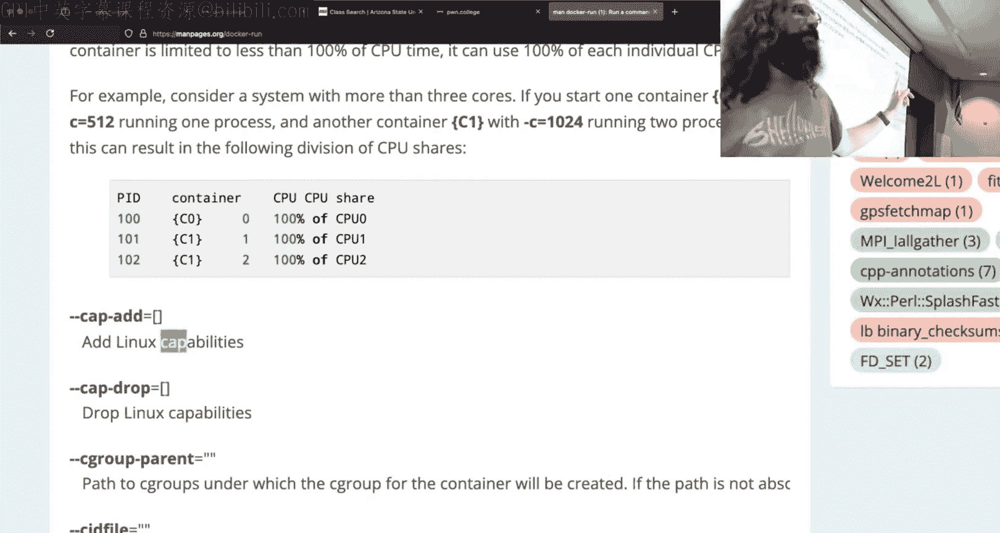

---

## 能力（Capabilities） 💪

所以Johnall谈过能力吗？我不认为这甚至与挑战相关，但它应该没问题。所以，为什么root能cat标志？嗯，你会说，嗯，因为root拥有标志，对吧？但如果我把标志chown给hacker用户呢？root还能cat标志吗？我想，答案是可以，对吧？我们喜欢认为root是这个全能的，root可以做一切事情，这有点对，也不是一个坏的思考方式。但root不是唯一可以全能的。

这种忽略权限的能力是一种能力。现在root恰好有很多能力。如果我们查看能力的手册页，你会看到有很多能力，它们规定了用户可以做的非常具体的事情。一个例子是cat某些东西或访问你通常没有权限的文件，就是这个东西，`CAP_DAC_OVERRIDE`。root恰好有这个权限。

所以如果我制作一个像这样的二进制文件，打开标志，然后我们将发送文件。这应该不行，你同意吗？让我们把a.out改名为b.out。让我们gcc do.c，实际上，我显然不会写代码。嗯。然后gcc do.c。如果我们运行这个东西，我们得到失败。嗯。这是你所期望的，因为这是由hacker用户拥有的，而我是hacker用户。

现在有一个命令，`setcap`。看看我是否记得怎么用这个，`setcap`，我想要的是`cap_dac_override`。我想让它成为。我们将把它设置在a.out上。好吧，现在这是个问题，因为我在。我不是root，如果hacker用户可以说我想要这个二进制文件覆盖并忽略文件权限，那就太傻了，对吧？所以你说，哦，我需要是root。好吧，这次它也会对我大喊大叫，因为文件系统。如果我们查看挂载方式，`/home/hacker`的挂载方式使得我们不能做这类恶作剧。

所以让我们把我的a.out移到`/tmp`，那里我们没有这样的限制。好吧，我现在的说法是，我已经授予了（我必须使用sudo），但我已经在这个二进制文件上设置了能力，使得这个二进制文件可以忽略文件权限。它是由root拥有的吗？它设置了setuid吗？好吧，让我们看看我是否做对了。它工作了。

所以实际上有这个，和能力，它们有点新，对于Linux来说，我要说它们是新的，因为Linux是，是的，一个缓慢而有条理的野兽。所以你不必是root才能拥有一个可能看起来全能的权限。一个例子是，也许我需要一个用户拥有的进程来监听一个低编号的端口。对于网络新手，我认为任何低于1024的端口号都需要root权限。我说得对吗？我想是1024。你说什么？他们改了？纽约时报头版，你突然可以做了。所以有一个能力可以分配给一个二进制文件，允许一个二进制文件这样做。同样，有一个能力可以与原始套接字交互。你有没有运行过tcpdump或wireshark？要与原始网络数据交互，通常你需要是root。但你可以是一个用户或一个进程，或者运行一个具有与原始网络数据交互能力的程序，然后你就像一个例外。所以实际上有这种更细粒度的控制，控制一个进程或用户获得什么样的提升权限，你可以玩玩这个。

现在，我要提到的最后一个。希望这个在这里。好吧，我不知道为什么我第一次没找到，是`CAP_SYS_ADMIN`，这几乎是所有事情的权限。所以当我们说为什么root能忽略标志，那是因为root是`CAP_SYS_ADMIN`，它有管理员的能力，这就是root用户所做的。

现在能力不仅可以被启用，就像我启用了我的a.out去做一些它不能做的事情，能力也可以被禁用。当我们看命名空间时，我们会看到这一点。

---

## 命名空间与Docker 🐳

所以当我们想到Docker时，有两件事真正构成了Docker的全部。Yaun提到过这个，我想。有命名空间，这是我们考虑的大部分，那就是隔离或欺骗一个运行中的进程。内核只是，你问内核，嘿，`/home/hacker`里有什么？如果你在不同的命名空间，内核说，啊，你不在名单上，我们只是要骗你。这就是命名空间，内核可以用很多不同的方式骗你。它可以骗你关于文件系统，可以骗你关于网络，可以骗你关于哪些进程在运行，等等。

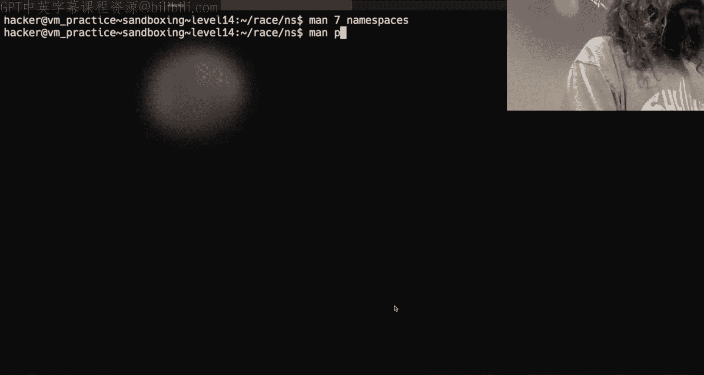

支持Docker的另一件事是能力。如果你深入研究Docker的工作原理和一些，我想看手册，`man docker`，我们这里没有docker吗？我们没有。好吧，我们会有点刺激。我现在有一个可以连接的盒子吗？是的，但我不打算做。我只是在那里自我检查了一下，因为我知道如果我查看手册页，手册页会不同。但如果你查看docker的手册页，你会看到有一个安全选项。你可以添加的东西之一是能力。所以Docker只是一个非常结构化的方式来设置和运行隔离命名空间中的进程，然后启用或禁用能力。

资源限制？抱歉，比如进程数量，进程可以访问的东西，整个系统有64个访问权限，像4个？我的理解是资源实际上不是能力，那是命名空间的东西，实际上是一个更新的命名空间的东西，你不应该能做到，但是的，Docker所做的一切要么是命名空间的巧妙运用，要么是能力的巧妙运用。我只是认为能力没有得到足够的关注，好吧？手册，docker，rocker，我喜欢它。chroot是ram docker with him docker with him docker。是的，不要，不要，不要那样做。那里只有痛苦。

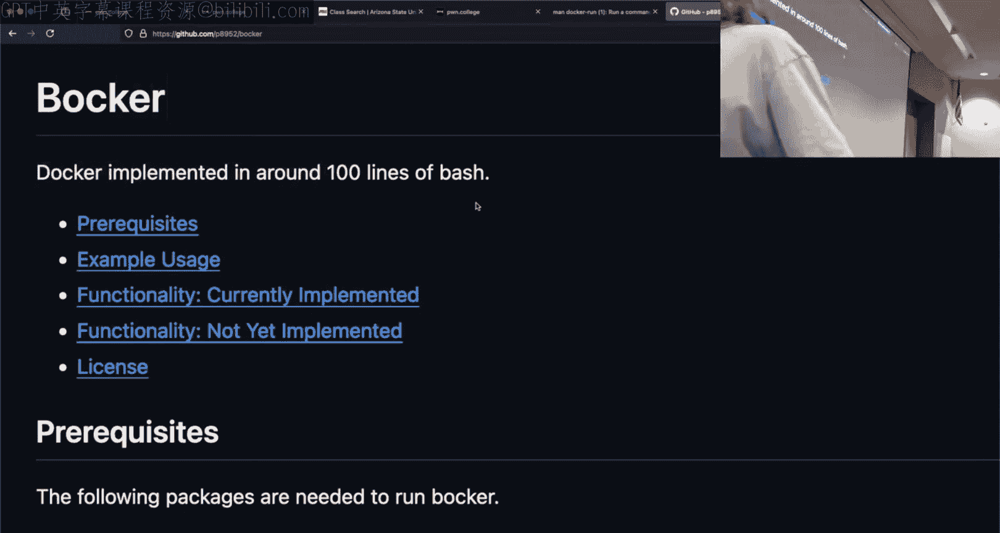

---

## 演示：创建网络命名空间 🌐

好了，现在我们可以开始命名空间的东西了。所以我在虚拟机内部。我再次使用bash，但你可以在C或Python或任何语言中做同样的事情。我在这里做的是创建一个网络命名空间。在这个上下文中，我们给我们的虚拟网络一个名字，所以我叫它demoNet。然后我执行，我希望这个接口在这个虚拟网络命名空间中启动，然后我将运行一个shell。没什么太疯狂的。那没工作，因为我没有运行sudo。

我需要更多窗口。让我们把所有东西都连接到虚拟机。你会自己掉进这个陷阱。当你不注意提示时，一个在虚拟机里，一个不在，你就会想，为什么这不行？在左手边，如果我在端口1337上监听，我没有做任何好的命名空间，对吧？我们只是在虚拟机里，然后我netcat localhost 1337，如果我说hello并按回车，会发生什么？对，我们在另一边看到了，很好，我们理解网络是什么。这是预期的。

如果我改为进入race并sudo。现在我要做同样的事情，netcat监听1337。这会到达那里吗？不是。不。因为它在自己独立的网络上。它完全与主机系统断开连接。现在，我可以。是的。打开另一个终端，它会给我一些麻烦，因为我试图做两次相同的事情，但我可以打开第二个终端。第二个进程进入同一个网络命名空间，其他一切都与主机相同，如果我在这里。我现在看到它了。对。

现在，你可以在虚拟机内部使用`vm connect`或`tmux`，但在我看来，那相当慢。所以我在那里做的一切都与netcat有关。如果我在虚拟机里。这个终端在虚拟机里。但它不在网络命名空间里。我能看到它吗？是的。好吧，抱歉，我能看到netcat吗？我想这是我的问题。是的。因为它在同一个主机里。

---

## 命名空间的层次结构与/proc文件系统 📁

现在，命名空间是分层的，这意味着如果我的主机系统想要列出所有的PID。我将看到我的命名空间中的所有PID和子命名空间中的所有PID。嗯。如果我们看看我们的好朋友`/proc`，我们见过`/proc/self/fd`，对吧？它向我们展示。在`/proc`内部有一个类似的东西，`/proc/[pid]/ns`，这是命名空间。就像文件描述符，我们通常认为它们是文件的句柄。有文件描述符是命名空间的句柄。所以如果我看。是的，这个PID是什么？334命名空间？不再是我了，所以它需要权限。我们看到什么不同了吗？我这里有什么，1835，1835，39，39，40，40。这不同吗，好吧？所以挂载命名空间不同。网络1992，那不同。

现在，这些命名空间句柄，就像文件描述符一样，你可以访问。现在。我想要什么？ns，我想`man nsenter`。我想要什么？秒。它是什么，是`setns`吗？是的。`nsenter`是终端命令。所以`setns`是一个系统调用，给定一个指向命名空间的文件描述符，允许你进入那个命名空间。所以这奇怪地类似于我们谈论chroot和文件描述符的时候。

所以逃离命名空间的一种方式是，如果 somehow 你已经持有一个指向另一个命名空间的文件描述符。你会想，嗯，我不能从我当前的命名空间内部逃到父命名空间，但如果你已经持有该资源，你可以。现在这通常与像`nsenter`这样的东西一起使用。所以如果我们再次，我现在就在主机命名空间里。我们`ps aux`并grep这里的netcat。我可以sudo `nsenter`，这是终端命令。我的目标，我想加入的进程是334，那是netcat监听端口的地方。我想加入网络命名空间，我想运行的命令是`/bin/bash`。

看起来什么都没发生，但现在我应该能够echo Hello world到localhost 1337。我是个骗子。为什么我是个骗子？哦。这里运行sudo，让我们在一个屏幕上完成所有操作。`-t`是PID，`-n`是网络。那没问题。然后我们传递命令，那应该工作。好吧，所以我们在虚拟机内部是root。我们再试一次。`nsenter -t $(ps aux | grep netcat)`，然后`-n`，`/bin/bash`。我被bash踢出来了。那让我进去了吗？netcat会。`-t`应该是`--target`的简写。嗯。哦，那工作了。好了。

我不确定为什么之前那个没工作。我想我仍然有那个netcat绑定到这个套接字，但我们看到我不必再次运行我的shell脚本，对吧？我能够只用`nsenter`在命令行上做这个。`nsenter`在做什么？嗯，它正在做我刚刚在手册页里展示的`setns`。

---

## 其他命名空间与容器技术 📦

另一件你想要或会看到的事情是`unshare`。`unshare`的行为是分离并创建一个新的命名空间。这有点像我们fork然后exec，我们可以fork然后加入一个新的命名空间。所以你的笔记本只是新的命名空间？抱歉，所以你的笔记本只是花哨的命名空间？比如，你的笔记本。虚拟网络是花哨的命名空间。那是100%正确的，完全可以，你知道，不使用那个。但是的，如今，虚拟网络是花哨的命名空间。我们这里有什么？Docker，Docker，现场演示是最好的，当它们工作时现场演示是最好的。问题是它们一半时间不工作。

好了，除了网络命名空间，还有其他命名空间。问题是，当你深入探究所有可能存在的命名空间这个兔子洞时，事情变得越来越复杂。在这个模块的挑战中，Jan的视频实际上相当不错，因为他正在复制的东西，他做命名空间的事情，然后他调用，我想是`pivot_root`。`pivot_root`是一个可怕的命令，我自己从未正确运行过，我很高兴Jan做到了。Somehow 我调用了`pivot_root`并破坏了我的文件系统，这就是为什么你没有它的视频的部分原因，因为我不想在直播中再做一次。但Jan确实在你面前现场调用了`pivot_root`，设置了命名空间，然后pivot了root，让你完全在一个容器中运行。我相信Jan有。

实际上有人看完Jan的所有视频吗？Jan提到Bocker了吗？Bocker，哦，酷。我想提到它，但我不知道我是否会抢了他的风头。所以Docker本身真的没什么疯狂的，对吧？它都只是能力和命名空间。这个Github仓库是Docker在1000行bash中的实现。它叫做Bocker。取决于谈论编写整个docker文件C。什么，就像基因，整个docker文件确实谈论那个。所以是的，就像一个docker，一个docker文件，我的意思是你见过，我假设你见过Docker文件，对吧？它只是一个文本表示。所以Docker守护进程所做的是解释这些行，然后做一些系列的能力和命名空间的事情。Docker不像是什么超级秘密技术，这就是为什么有竞争的容器技术，对吧？它们都是实现命名空间和能力来隔离进程的不同方式。就像，我的意思是，Bocker，1000行bash，来吧，那很酷，对吧？

但这些命名空间会失控，然后它们开始相互之间有代码依赖。一个例子是，当你开始进入挂载、PID、用户命名空间时。所以你可以。我直接运行bash，我要用`unshare`。记住，`unshare`是分离并创建一个新的命名空间。所以我要分离并在一个新的用户命名空间中运行bash。是的。哦看，我是root。我能cat标志吗？好。你说呢啊。白块で。我能cat这个标志吗？对。我快啲到。你です。我。

所以这就是我说事情变得奇怪时的意思，因为记住一个命名空间真的只是，我把它想象成俱乐部的短名单，就像谁被允许知道真正发生了什么，谁能进入后台。我们进入了这个用户命名空间，我们 essentially 给了内核许可来骗我们。我以任何方式提升了我的权限吗？没有，我们只是编了一个新的用户列表，当前就像，是的，当然，兄弟，你是root。好吧，但当你尝试做一些root相关的事情时，它就像，不。当我说，好吧，那么谁拥有`/home/hacker`？我。我是root，这说得通吗？不，嗯，这里发生的是，当我做这些请求时，比如，这个用户是谁？它就像，是的，你真的是hacker，但我们只是要告诉你你是root，并编造这个名单。所以当你开始尝试用命名空间做复杂的事情时，事情变得非常混乱，非常快，因为你不知道你周围有什么主机，你不知道在这种情况下你的UID是什么，我们仍然有进程，但如果你曾经运行过一个docker，我可以在我的Mac上运行一个Docker容器，我想世界不会结束。嗯。Docker。Lychman说，嘿，只有两个进程在运行。那是因为有一个PID命名空间。那决定了内核会骗你关于哪些进程在运行。傻。

当我运行`unshare`命令时，它不会改变文件系统命名空间，就像我仍然可以访问虚拟机拥有的所有东西，但我没有权限打开那些文件。代码仍然是root。是的，所以Twitch的说法是，当我进入用户命名空间时，我调用了`unshare`，我没有改变底层文件系统的任何东西，那是100%正确的，对吧？挂载命名空间代表文件系统。我想做但没完成的事情是，用挂载命名空间做一些事情，我们在那里挂载了与实际系统不同的东西，非常类似于chroot jail。我没有让它按我们想要的方式工作。但挂载命名空间只是改变了挂载的东西，所以文件系统。在开始时有root，所有附加到root的东西都只是挂载的，它可以在另一个驱动器上，可以是另一个文件夹。就像我在虚拟机内部，我可以调用mount。所以如果我进入`/home/hacker`。让我们创建一个并称之为，我不知道，clown。我们要sudo mount。root。我想把root绑定到clown。我在clown里看到了。突然，`/home/hacker/clown`通过了，这不是一个符号链接。它是一个目录，不是符号链接。我没有做我之前做的同样的恶作剧。它不让我cat标志，对吧？我在那里没有获得任何东西。当你查看mount的输出时，我们会看到。在这里的某个地方。嗯。我们已经将`/dev/root`挂载到`/home/hacker/clown`。对，所以挂载命名空间所做的就是说，好吧，现在，我挂载的所有东西都只为我，不为别人。所以如果你想改变你的文件系统，你要做的是进入一个新的挂载命名空间，然后挂载所有东西，然后调用那个可怕的`pivot_root`命令。如果你做对了，你突然就在那里了；如果你做错了，你可以重新安装Ubuntu。对。

但当我有PID命名空间时，或者不是PID，用户命名空间在这里。当我运行像`ls -l`这样的命令时，谁告诉我这个？因为，是的。就像不是ls二进制文件，实际上，你想在系统上做的几乎所有事情，我想打印东西到屏幕，我想读一个文件，我想与网络通信，我想知道磁盘上有什么，我想知道其他进程在运行。你获得这些信息的唯一方式是询问内核。所以当你允许内核说谎时，你只是SL，这就是命名空间。那个ls的用户是什么？内核知道谁是root用户，对吧？那是一个命名空间。你从我这里还得到了什么？我还有15分钟，我想我们运行了我所有准备好的东西。

---

## /proc文件系统与命名空间交互 🔗

是的，所以我不面对，当我们谈论一些如果让某人访问所有可能发生的漏洞时，我们必须真正共享文件目录。好吧，所以我已经说过了，但我们可以再说一遍。那么`/proc`是什么？我喜欢proc，但`/proc`是什么？假文件进程？是的，它是一个假文件系统。如果我们查看mount并grep proc，我们看到proc挂载在/proc上，类型是proc。Proc完全是编造的，对吧？Proc实际上并不存在。这里的一切都没有大小，一切都是零大小。显然，这个是11字节，但一般来说，一切都应该是零大小，因为这些文件实际上不存在于磁盘上的任何地方，对吧？它们只是与内核通信的一种方式。因为我们怎么与内核交谈？我们可以通过系统调用来与内核交谈，对吧？我们每次做系统调用时都在与内核交互。但有时你只是想知道，比如我打开了哪些文件描述符？我可以写一些C程序来触发一些系统调用，内核会告诉我，可能有一些方法可以做到，我不知道。另一种方法是访问这个路径，`/proc/self/fds`。这些是实际的文件描述符还是只是编造的东西？你认为它们是当前正在运行的那个吗？所以。让我看看。我还有多少时间？看看我是否能制造一些疯狂的事情发生。好吧。所以，我们将包含标准I/O。我们将有一个main。我们要打开，意味着我也需要。这个。和。我想这个，这个家伙。我们要在`/home/hacker`打开一些文件A。然后我们将从标准输入读入一些不重要的缓冲区。我想要一个字节，因为这真的只是一个占位符。然后我们将调用`sendfile`，1，FD，0，100。所以我们要打开这个文件，我们将用那个read阻塞一会儿，然后我们将把内容扔出去。希望这个顺序。嗯嗯嗯二呀。如果你实际做的话会有帮助。不，让我们做它。对。好吧。所以我们将运行那个。哦不，窗口变小了。我在虚拟机里，我在虚拟机里。`ps aux`将grep我们的a.out。我在585有这个坏小子，我想做什么。好吧，我在这里是root。我想exec。8。我想那是proc。让我们清除那个exec a。我要用bash，因为为什么不呢？`/proc/585/fd`，b。现在，如果我不能proc self fd，我不计数，我们ls它，我应该有。8现在指向那个文件。所以如果我做echo，hello，我们把它写进。8。那会从另一边出来吗？我不认为那个会，因为8指向那个，那没有 exactly 做我想要的。因为当我们在打开时，exec a它没有给出相同的文件描述符。它给了我一个指向相同目的地的符号链接，我试试，但它没有，它没有 exactly 做我想要的。让我看看`/proc/self/fd/1`。你是对的，它都是活的。它是一个符号链接。真扫兴。那怎么伤害？哦，你已经有一个15指向了。不。想想那里的操作顺序。打开后。喂，你一样。你到豆。好吧，所以我们将删除。我叫这个什么`/home/hacker/a`？它按我希望的方式工作了，只是不是我预期的。a.out。和。在这一点上。我在这里。我已经打开了。那个东西。我在那里删除了它，所以没有。`/home/hacker`。系嗯。它没有发生。所以现在我需要`ps aux` grep。拿出那个。它是什么594？我们做同样的事情，all exec。我们用12进入`/proc/594/fd/3`。大觉得。你是什么。什么起来我们可能为系统进程保留，只是做exec工作的事情。啲 all top。我在上面做了。F矛盾。应该是8 out哦，sudo，对。现在，我是root。为什么它说`ls /proc/594/fd/0,1,2`？有趣，好吧，也许我们可以直接打印Fd在场景中，所以我们展示这个。那应该在那里。全部。好吧对。

问题是关于命名空间的。好吧，我不想进入那个兔子洞。但如果我们proc self并询问。我们看那里，这些是，它可能会说Britain。符号链接，不是吗？它是一个符号链接。到这个。这是什么？对，它是某个资源。所以尽管它是一个符号链接，我们可以把它想象成好像我们有文件描述符。所以就像你可以。有吗？我们这里没有得到setns，好吧。让我们不要做文件描述符近似。让我们做一些真实的事情。我在哪里，这是在虚拟机里。那没问题。好吧。

这是它变得疯狂的方式。好吧，我们要进入race。我要进入命名空间。我要运行我的net sh。所以现在这个netcat监听1337在那个网络命名空间内部。你同意吗？所以如果我从这里netcat localhost 1337，那，哦，不清楚。好吧，是的，我有一个sudo，好吧。`netcat -l 1337`现在我不应该能够到达那里。我必须在连接中。好吧，`netcat localhost 1337`，它不去任何地方，好吧。现在，如果我改变我的do doc，我设法非常快地读了一个手册页。是的，但nsenter想要像`-t`键作为进程，对吧？我不想那样做。我想展示我实际上在使用这个在`/proc`里的东西。要使用那个文件描述符，我需要`setns`。对于那些不知道的人，你在这个手册页上看到有一行看起来不重要，但实际上很重要。你看到它说`#define _GNU_SOURCE`的地方了吗？所以你必须在你的程序中放那个，否则你将无法访问它。你可以认为它非常类似于你必须包含的东西，顺序在这里很重要，你正在做的是定义一个预编译器值或变量，你说`_GNU_SOURCE`存在，这样当头文件被包含时，它将包含这些额外的功能。如果你把`_GNU_SOURCE`放在头文件之后，你会有问题，如果你不包含它，你会有问题，但要知道那确实意味着什么。我倾向于，所以它将具体取决于，它将取决于它是什么，有些东西需要那个，有些不需要，这就是为什么你读手册页，因为否则你不知道。

好吧，我们将包含`#define _GNU_SOURCE`，这是它想要的。现在我们要说，离开这里。`ps aux` grep。Netcat。你看不到它，我遮住了，但我的P这里是10117。我们要打开`/proc/10117/ns/net`。Cch 1,0,1,1,7, N S, Nat。是的。我只是像。无法阅读像这里发生了什么，哦，你不在虚拟机里。这就是它抓住你的方式，伙计。`ls -l /proc/10117/ns/net`。是的。你在虚拟机里。你是root。哦，那是因为我弄错了PID。好吧，现在`ps aux`并grep netcat，我想要的PID实际上是629。好吧，我们要硬编码这个P，629，NS net。我们要打开它，读写。而不是做这个像read废话，我要在这个文件描述符上调用`setns`。然后它想要这个NS类型。我可能想要。`CLONE_NEWNET`。你生什么气？对。我改变，我不在乎它改变了，好吧。是的。好吧。然后我想exec。我们要在这里作弊一点。我们将有`argc`, `char *argv[]`，我们将exec任何是`argv[1]`向后的东西，`argv[1]`。我可能需要一些东西给exec，不是吗？不，那是uni标准，好吧。系。我的说法是，我将能够使用这个。我们看看我是否做对了，我将能够调用`setns`在那个运行进程的文件描述符上，以在我的C代码中加入网络命名空间。所以我使用Proc来进入那个。然后我将只是exec我指定的任何东西，它将像`/bin/bash`或一个netcat或类似的东西。让我们看看。我们可以硬编码那天。哦，那是个震惊。好吧，我们很好一个netcat，localhost，1337。哦是的，要调用`setns`，我确实需要是root，我是root，好吧。发生了什么？它有out `/bin/bash`。我netcat localhost 1337，哦。就在时间紧迫的时候。好吧，所以我不确定为什么我无法在这里写我的小包装器并调用netcat。就像我可能做了，但它没有保持标准输入标准输出一些愚蠢的东西，但当我使用我的小包装器家伙来调用`setns`在字面上暴露在Proc中的东西上时，对吧？所以。这是我的do.c在这里。这是运行的。我正在访问那个文件描述符。写入那个符号链接，我能够使用那个来改变我的网络命名空间并与这个进程通信。那解释了为什么Proc在这方面很酷吗？它非常类似于早期的C3挑战，你可以通过文件描述符泄漏东西。C3只是设置root。Proc，而且不只是为了记录，proc有更多，你可以用proc做很多很酷的事情，但这是一个立即与命名空间相关的，你可以与Proc暴露的那些文件描述符交互。那里的陷阱是。不。那里的陷阱让很多人困惑的是，你通常想尝试像写入标准输入，就像你想着哦，我要写入pro某个东西的标准输入pro某个东西的fd 0，但因为它是一个伪终端，你会得到你不能只是原始写入它，伪终端有自己的疯狂，这就是为什么我的另一个与文件描述符一起工作的演示让我惊讶，因为我不确定它会工作，确实工作了，但为什么我必须打开那个文件，因为然后我知道我写入的东西是原始文件的文件描述符，而不是指向伪终端的文件描述符。伪终端是疯狂的，如果可以的话避免它们。

---

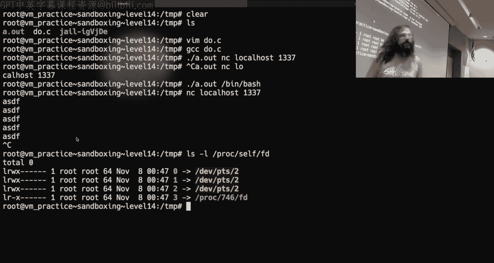

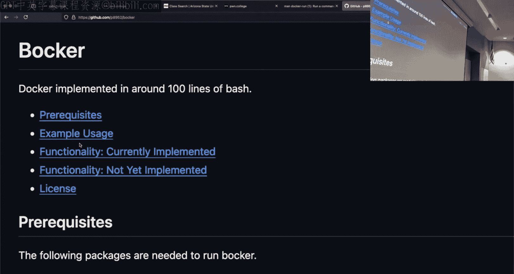

## 总结 📝

在本节课中，我们一起学习了沙盒和命名空间的核心概念。我们探讨了如何使用`chroot`创建简单的文件系统隔离，以及如何使用命名空间实现更全面的进程隔离（如网络、PID、用户命名空间）。我们还了解了能力（Capabilities）如何提供细粒度的权限控制，这是容器技术（如Docker）的基础。通过演示，我们看到了如何创建网络命名空间，如何使用`/proc`文件系统与命名空间交互，以及如何利用这些机制。这些知识