# 23：内核安全

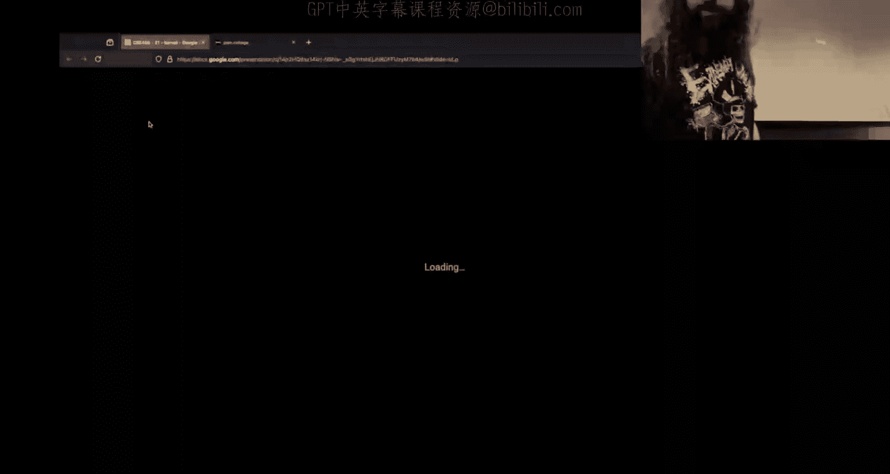

在本节课中，我们将学习内核安全的基础知识。我们将探讨用户空间与内核空间的区别、如何与内核模块交互、以及在内核环境中调试和编写代码的独特挑战。课程内容基于ASU CSE466课程的相关讲座。

---

## 概述

内核是操作系统的核心，拥有最高的系统权限。理解内核安全对于理解整个计算机系统的安全性至关重要。本节将介绍内核模块的基本概念、如何通过系统调用与内核交互，以及在内核环境下进行安全研究和漏洞利用的初步方法。

---

## 内核与用户空间

上一节我们回顾了竞态条件和沙箱逃逸模块。本节中，我们来看看操作系统的核心——内核。

在计算机系统中，最强大的实体是内核，而不是`root`用户。内核负责管理所有硬件和软件资源，并强制执行安全策略。即使用户以`root`身份运行，其权限也由内核授予和限制。

用户程序运行在**用户空间**（Ring 3），而内核运行在**内核空间**（Ring 0）。CPU通过特权级别（Rings）来隔离这两个空间，防止用户程序直接执行特权指令或访问受保护的内存区域。

从用户空间切换到内核空间主要通过**系统调用**实现。例如，当用户程序调用`write()`函数时，会触发一个软中断，CPU将上下文切换到内核模式，由内核执行实际的写操作，然后将结果和控制权返回给用户程序。

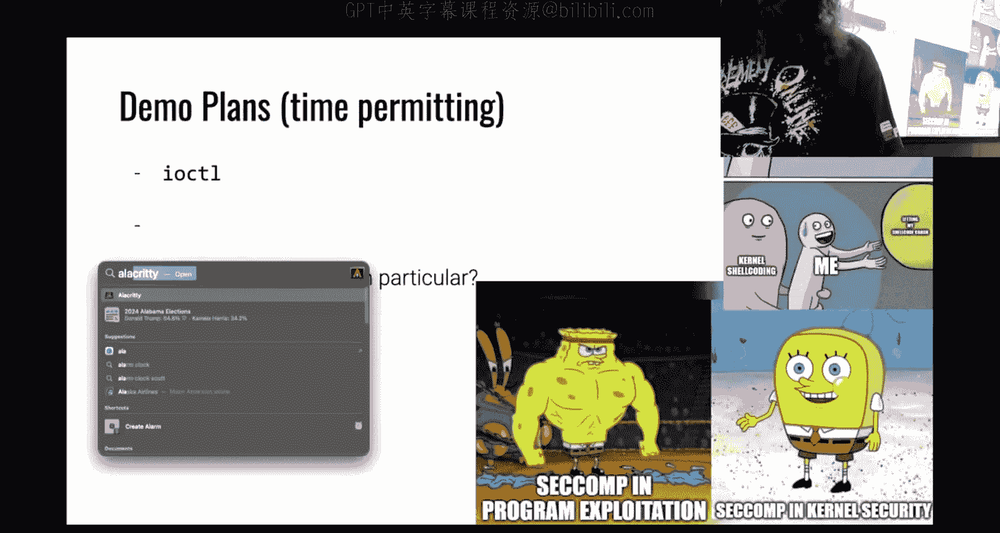

**Seccomp**（安全计算模式）是一种内核安全机制，用于限制进程可用的系统调用。其工作原理是：在进程执行系统调用（如通过`int 0x80`或`syscall`指令）时，内核的异常处理程序会检查该调用是否被允许。如果试图调用被禁止的系统调用，内核会向进程发送一个信号（如`SIGKILL`）来终止它。**关键点在于：Seccomp限制的是从用户空间发起的系统调用。如果代码已经在内核空间执行，Seccomp规则不再适用。**

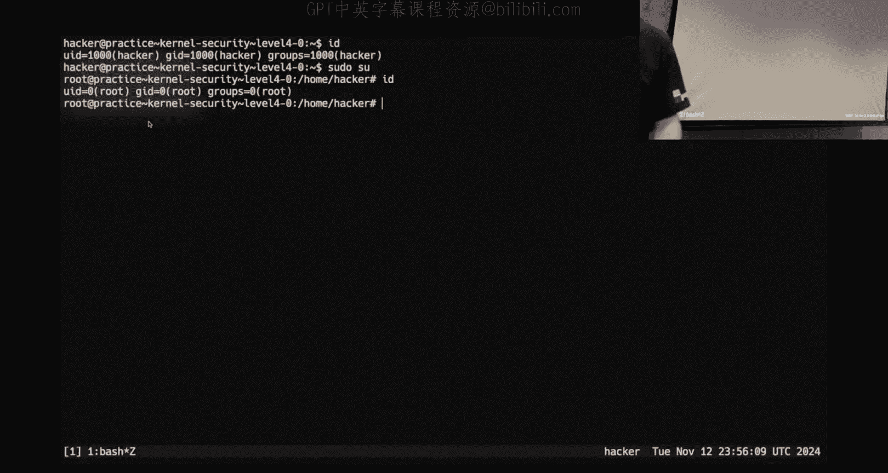


---

## 与内核模块交互

理解了内核与用户空间的基本关系后，我们来看看如何与一个具体的内核模块进行交互。

内核模块是可以在运行时加载到内核中的代码，用于扩展内核功能。它们不像普通程序那样有`main()`入口点，而是通过一系列预定义的函数（如初始化、打开、读写、关闭）与外界交互。

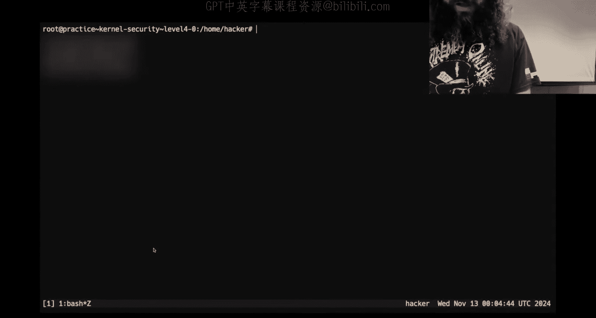

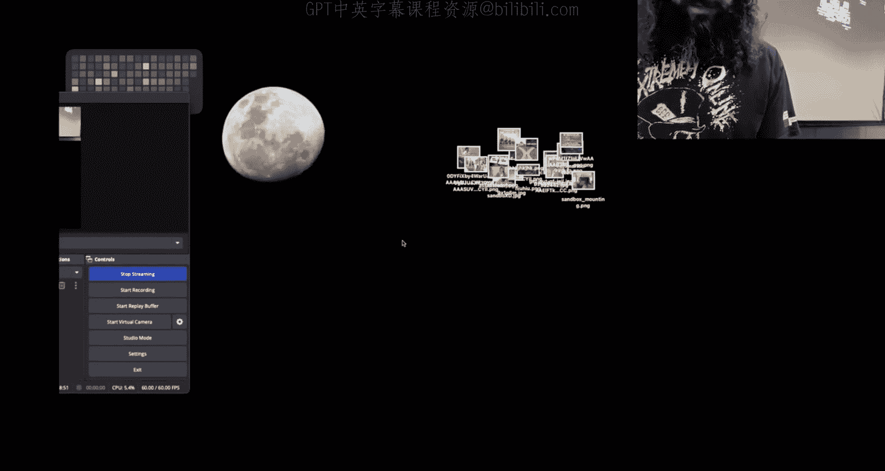

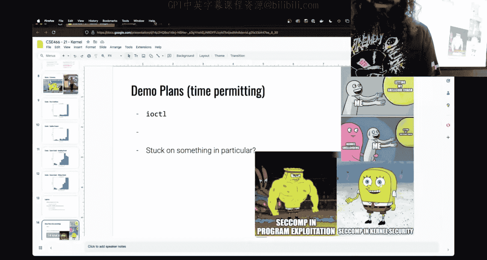


以下是一个与示例内核模块`baby_kernel_level4.ko`交互的基本步骤：


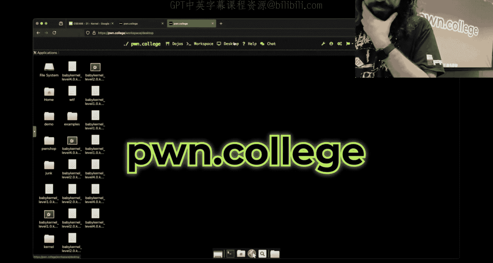

1.  **加载模块**：首先需要将模块加载到内核中。
    ```bash
    sudo insmod baby_kernel_level4.ko
    ```
    使用`dmesg`命令可以查看内核日志，确认模块加载成功及其打印的提示信息。

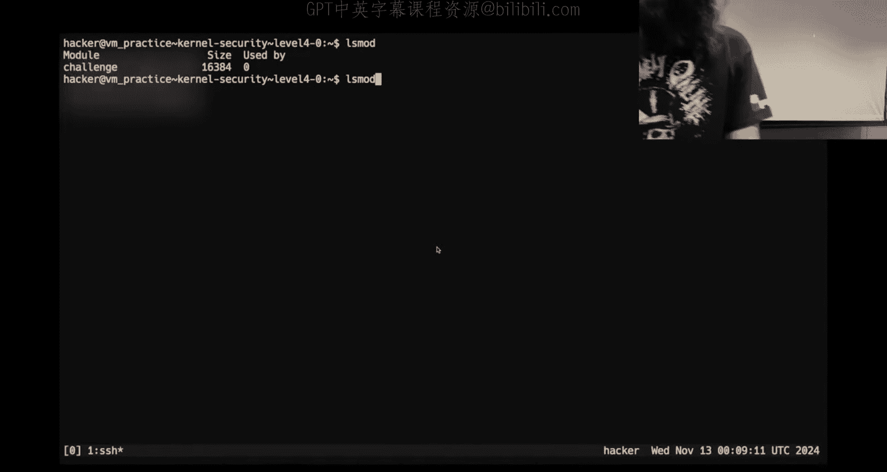

2.  **定位交互点**：内核模块通常会创建一个设备文件或`proc`文件系统条目供用户空间访问。可以使用`lsmod`查看已加载模块，或检查`/proc`目录。
    ```bash
    ls /proc/pony_college/
    ```


3.  **触发模块代码**：通过打开设备文件并调用`ioctl`函数来触发内核模块中的特定函数（如`device_ioctl`）。`ioctl`是一个“瑞士军刀”式的系统调用，其具体行为由传递给它的命令号（`cmd`）和参数决定。

---

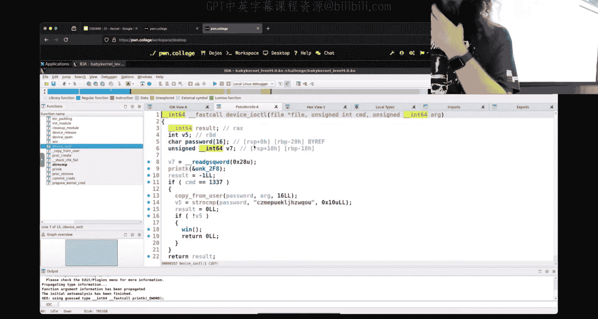

## 编写交互代码


以下是使用Python与内核模块进行`ioctl`交互的两种方法。**推荐使用第二种（`ctypes`）方法**，因为第一种方法可能因Python的高级封装而导致非预期的行为。

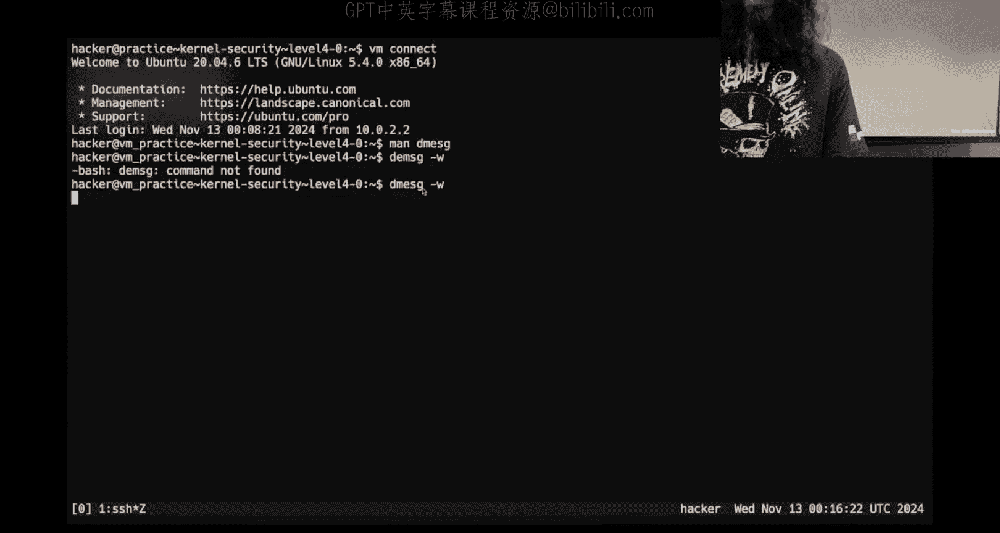

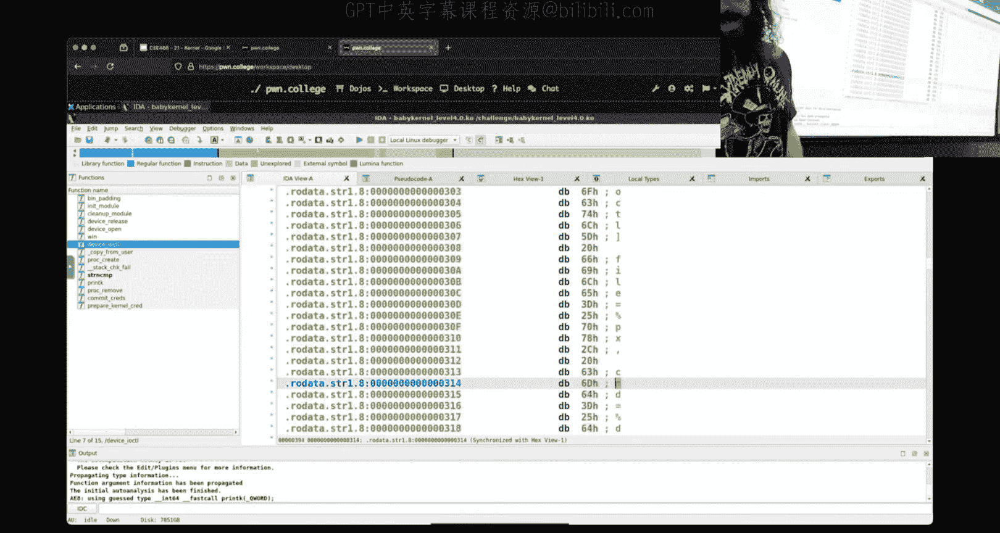

**方法一：使用Python的`fcntl.ioctl`（可能不可靠）**
```python
import fcntl
fd = open(‘/proc/pony_college/device‘, ‘r‘)
# 命令号1337，参数为字符串
fcntl.ioctl(fd, 1337, “hello world“)
```

**方法二：使用`ctypes`直接调用C库的`ioctl`（推荐）**
```python
from ctypes import *
libc = CDLL(“libc.so.6“)
fd = open(‘/proc/pony_college/device‘, ‘r‘).fileno()
cmd = 1337
buf = create_string_buffer(b“secret_password“)
libc.ioctl(fd, cmd, buf)
```
在这个例子中，内核模块的`device_ioctl`函数会使用`copy_from_user`将用户空间传递的缓冲区内容复制到内核，然后进行字符串比较。我们的目标就是传递正确的字符串。

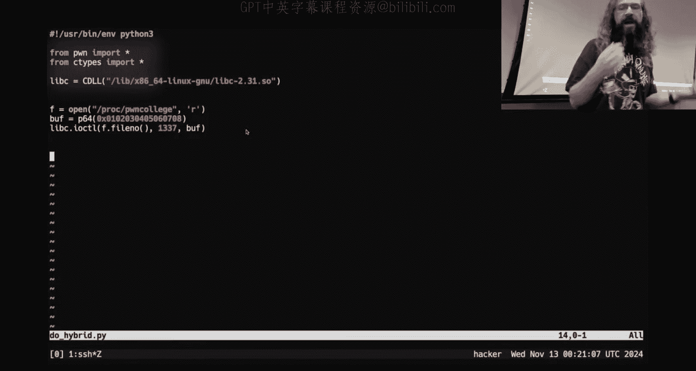

---

## 内核调试技术


当需要深入分析内核模块的行为时，调试变得至关重要。然而，内核调试与用户空间调试有很大不同。

首先，需要在一个受控的虚拟机（VM）环境中进行，因为调试操作可能导致内核崩溃。课程提供了`vm_start`和`vm_connect`脚本来启动和连接调试VM。


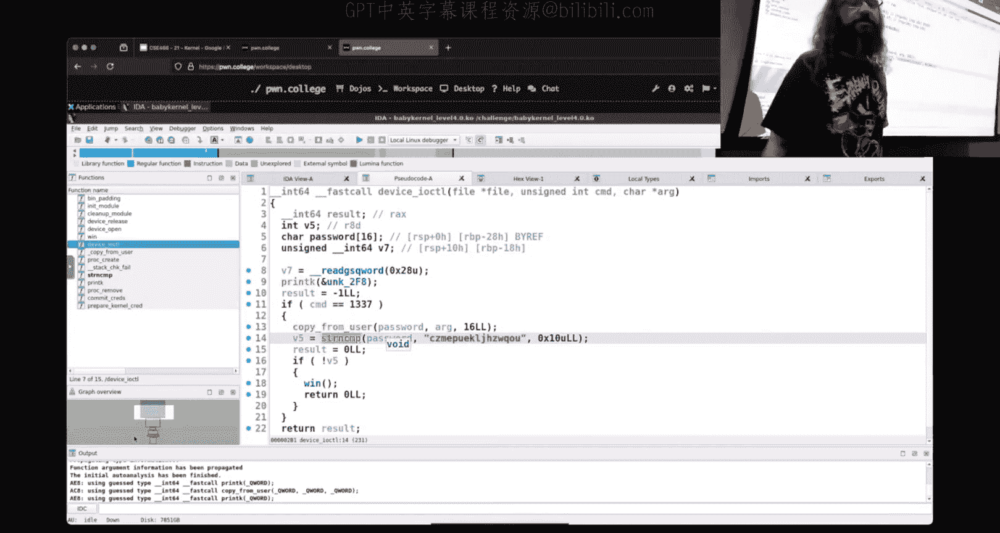

在内核中，所有用户空间的内存视图都是虚拟的。内核有一个称为`fixmap`的区域，它连续地映射了物理内存，用于访问具体的物理地址。

调试内核模块的主要挑战包括：
*   **符号缺失**：内核模块的函数符号默认不在调试器中。需要从`/proc/kallsyms`中获取其地址（前提是KASLR内核地址空间布局随机化被禁用）。
    ```bash
    sudo cat /proc/kallsyms | grep device_ioctl
    ```
*   **设置断点**：获得地址后，可以在GDB中设置断点。
    ```bash
    break *0xffffffffc1234567 # device_ioctl的地址
    ```
*   **控制执行流**：在内核中，单步执行（`si`/`ni`）需格外小心，因为内核 constantly 在不同进程/线程间进行上下文切换，很容易“跟丢”。更可靠的做法是：
    *   使用`x/40i $rip`反汇编当前指令附近代码。
    *   在关键函数（如`copy_from_user`）或目标地址设置断点。
    *   使用`continue`命令运行，触发断点后进行检查。
    *   尽量避免长时间单步执行。

---

## 内核Shellcode的差异


在用户空间，`shellcode`通常通过系统调用来执行命令（如`execve`）。在内核空间，情况则完全不同。

主要差异有：
1.  **没有系统调用**：在内核中，你不能使用`syscall`或`int 0x80`指令。相反，你可以直接调用内核中实现该功能的内部函数。例如，要执行命令，可以调用`run_cmd`这类内核函数。其地址可以从`/proc/kallsyms`中查找。
2.  **必须优雅返回**：用户空间的`shellcode`可以不顾后果地结束。但内核`shellcode`必须干净地返回到调用者，否则会导致内核崩溃（`kernel panic`）或系统锁定。你的`shellcode`在完成工作后，需要恢复栈帧并执行`ret`指令。
3.  **权限**：内核代码本身就在最高权限下运行，无需提权。

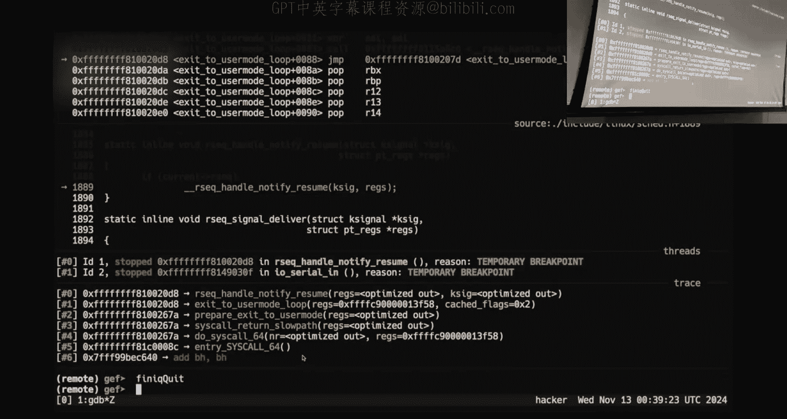


因此，内核`shellcode`看起来更像一段普通的函数调用链，末尾是妥善的返回。例如，一个调用`run_cmd(“/bin/sh“)`的`shellcode`需要：
*   将命令字符串放置到合适位置。
*   将`run_cmd`的函数地址放入寄存器（如`RAX`）。
*   `call rax`。
*   清理栈并返回。

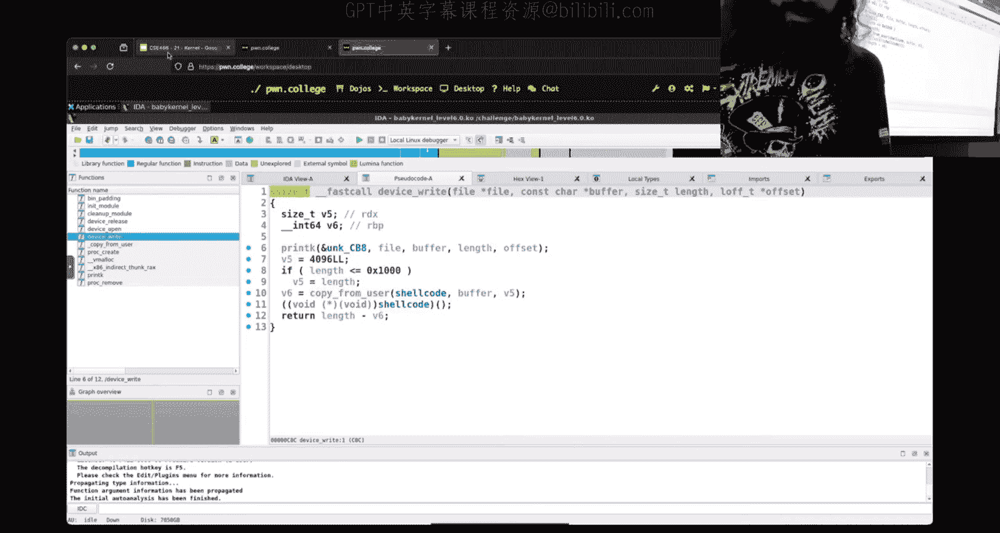

---


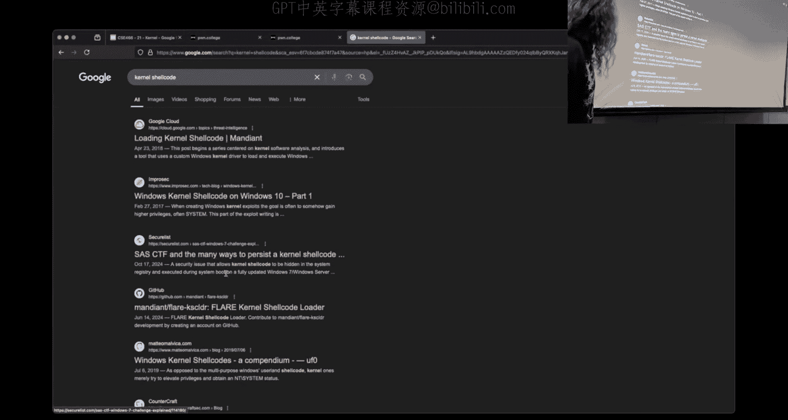

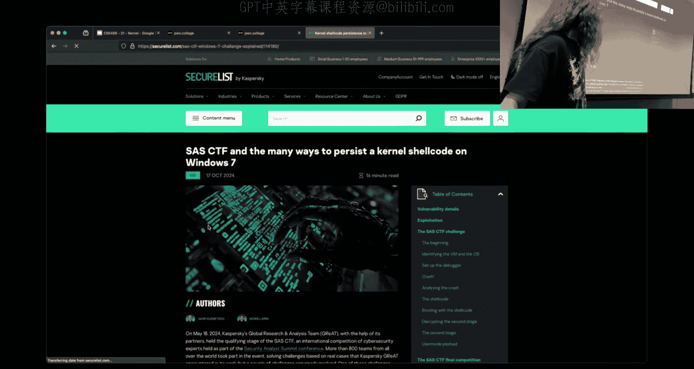

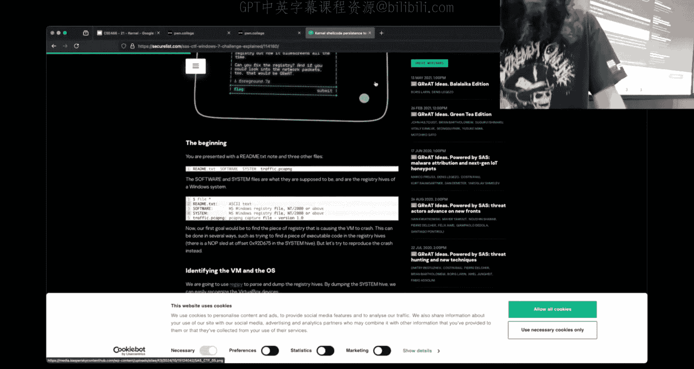


## 总结


本节课我们一起学习了内核安全的核心概念。我们理解了用户空间与内核空间的权限隔离，知道了如何通过`ioctl`与内核模块交互，并掌握了在内核环境中进行调试的基本方法。我们还探讨了内核`shellcode`与用户空间`shellcode`的关键区别，即直接调用内核函数和必须优雅返回。

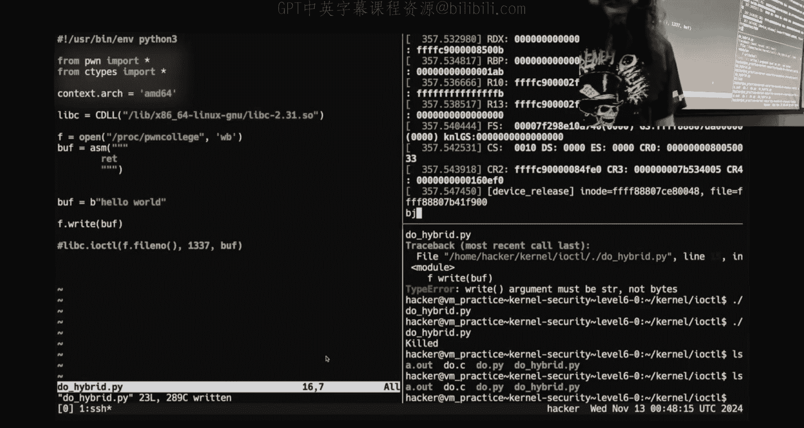

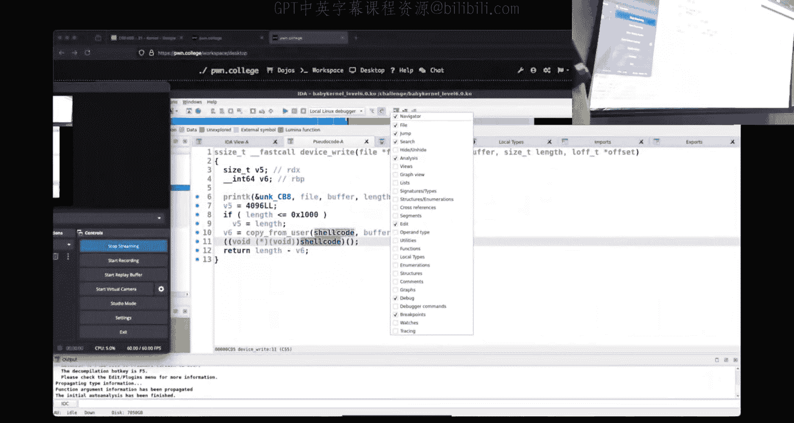

内核安全是一个复杂但至关重要的领域，它为理解整个系统的安全态势奠定了基础。在接下来的模块中，我们将利用这些知识探索更深入的内核漏洞利用技术。