# 24：内核安全


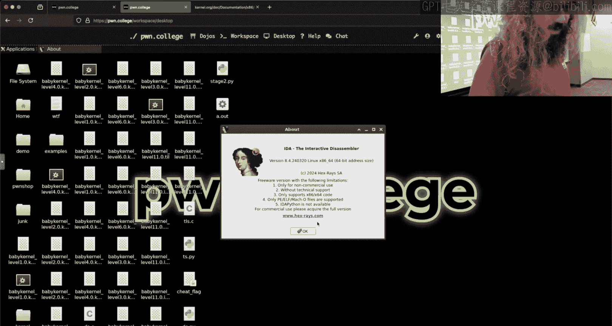


## 概述
在本节课中，我们将探讨内核安全相关的概念，特别是通过分析两个具体的挑战（Level 11 和 Level 12）来理解内核漏洞利用的基本原理。我们将学习如何通过进程内存访问、内核数据结构操作以及物理内存映射等技术来获取敏感信息。

---

## 挑战分析：Level 11

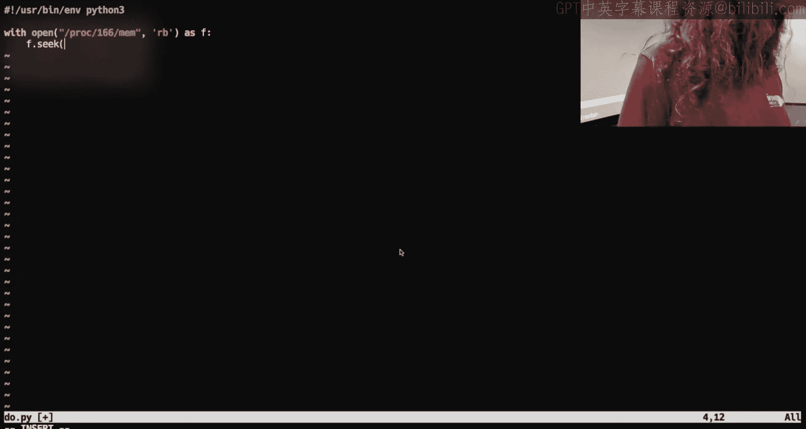

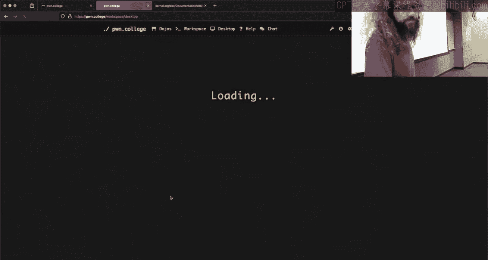


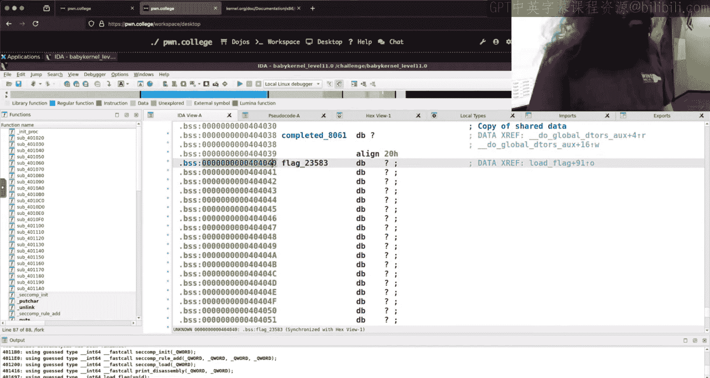

上一节我们介绍了内核安全的基本背景，本节中我们来看看 Level 11 挑战的具体内容。

该挑战执行以下操作：
1.  加载一个标志（flag）文件到内存中。
2.  随后删除（unlink）该标志文件。
3.  创建一个子进程，该子进程将标志读入内存后进入无限休眠状态。

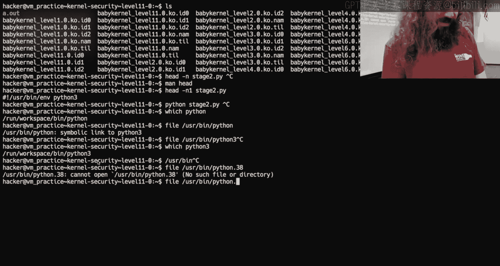

这意味着，虽然文件本身已被删除，但其内容仍保留在第一个创建的子进程的内存中。


### 利用原理
由于子进程长期存在并持有标志数据，我们可以通过访问该进程的内存来获取标志。在 Linux 系统中，可以通过 `/proc/[pid]/mem` 伪文件来访问其他进程的内存。

以下是访问进程内存的核心代码示例：
```python
with open('/proc/166/mem', 'rb') as f:
    f.seek(0x404040)  # 假设的标志内存地址
    data = f.read(40)
    print(data)
```
**注意**：此操作需要 root 权限。

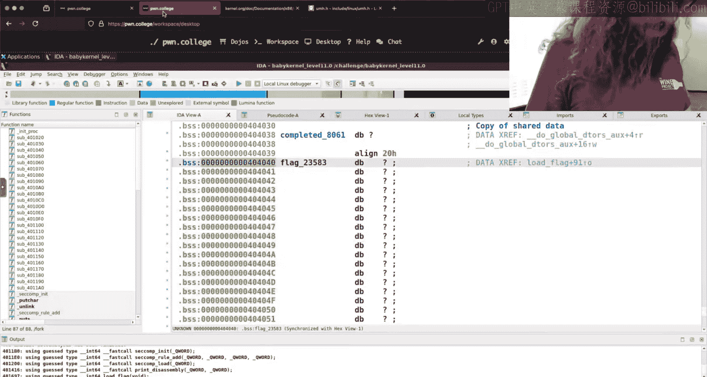

### 关键点
*   标志的地址（如 `0x404040`）可以通过静态分析（如 IDA）获得，前提是二进制文件未启用 PIE（位置无关可执行文件）。
*   无需在每次尝试失败后重启整个虚拟机或挑战，只需确保操作的是第一个（持有原始标志的）子进程。
*   在内核中通过 `run_cmd` 执行脚本时，需使用绝对路径（如 `/usr/bin/python3.8`）以避免环境变量和路径解析问题。


---


## 内核数据结构：task_struct


了解了如何从用户空间进程提取数据后，本节我们将深入内核，探索如何定位和操作关键的数据结构。

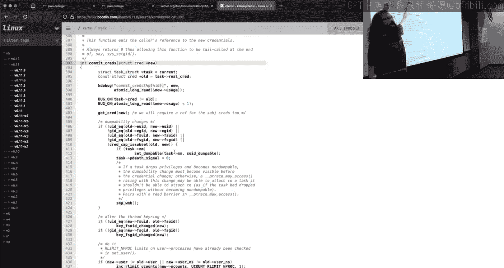

在内核中，`task_struct` 结构体代表一个进程或线程，包含其所有信息，如进程ID、凭证（credentials）和文件描述符表。

### 定位 task_struct
根据讲座内容，`task_struct` 的指针可以通过 GS 段寄存器加上一个偏移量来获取。在内核函数（如 `commit_creds`）的汇编中，可以看到类似以下指令：
```
mov %gs:0x15d00, %r12
```
这表示将 `GS` 基址加上偏移量 `0x15d00` 处的值（即 `task_struct` 地址）加载到 `R12` 寄存器。

我们可以通过调试器来验证和计算这些偏移量。


### 访问 cred 结构
`task_struct` 中包含一个指向 `cred` 结构（`struct cred`）的指针，该结构体存储了进程的权限信息（如 UID, GID）。`setuid` 等权限标志位也存储在此结构或相关的 `thread_info` 中。

通过计算 `task_struct` 基址到 `cred` 指针的偏移，我们可以在汇编代码中导航并修改这些权限值。

以下是计算偏移的示例思路：
1.  获取 `task_struct` 地址（通过 GS 寄存器）。
2.  获取 `real_cred` 指针的地址。
3.  两者相减得到偏移量。
4.  在利用代码中，使用该偏移量来定位并覆盖凭证数据。

这种方法比依赖可能不匹配的编译时常量或编写复杂的 C 模块更为可靠。

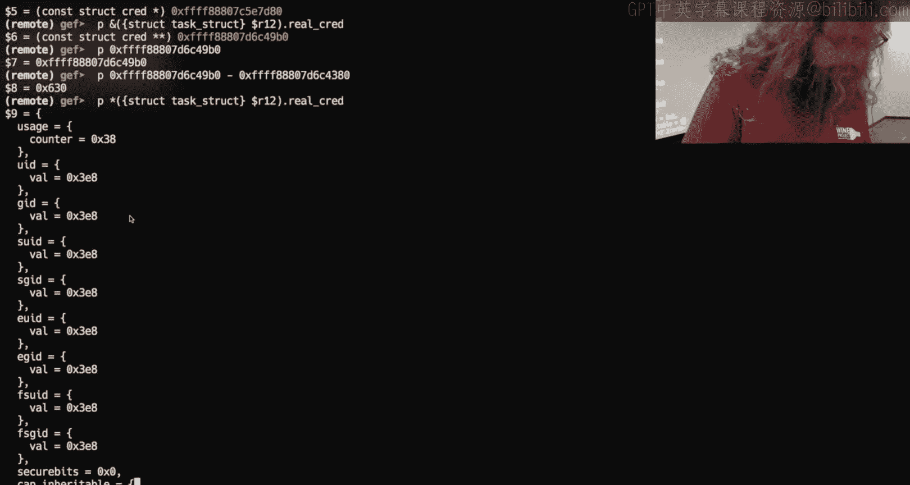

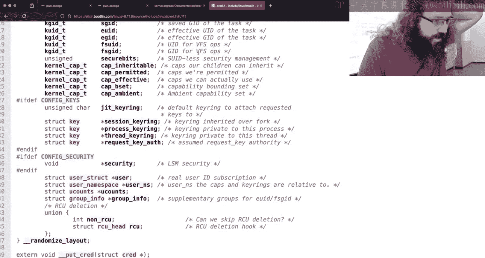


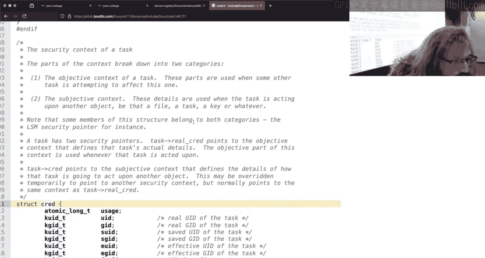


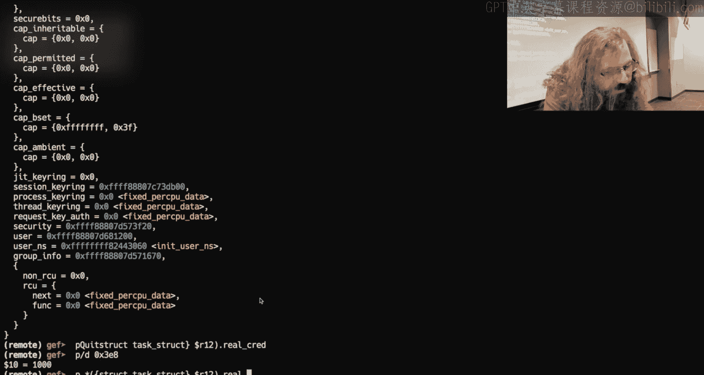


---


## 挑战升级：Level 12


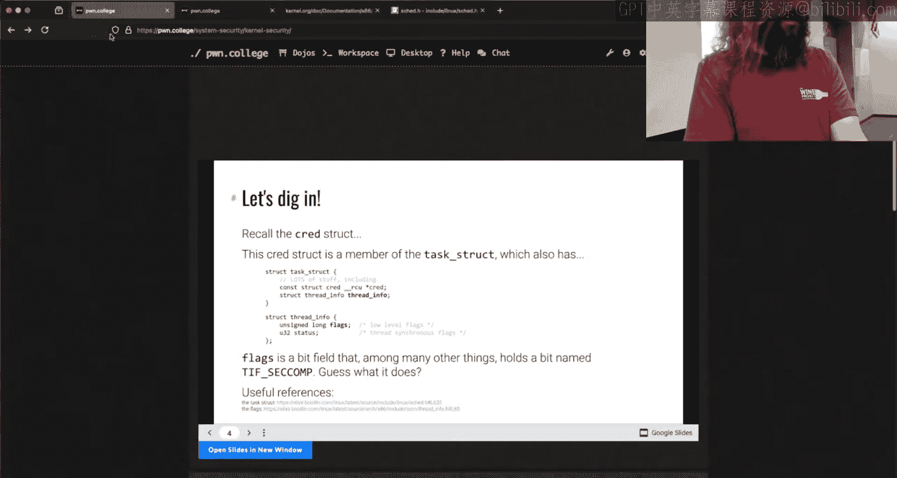

现在，我们将 Level 11 的概念提升到更高难度。Level 12 的挑战与 Level 11 类似，但关键区别在于：持有标志的子进程在读取标志后会终止。

这意味着我们无法再通过 `/proc/[pid]/mem` 来访问该进程的用户空间内存。那么，标志数据是否彻底消失了呢？

### 物理内存映射（Fizzmap）
即使进程终止，其数据所占用的物理内存页可能在一段时间内未被覆盖。Linux 内核提供了一个直接映射区域，称为 **fizzmap**，它将**所有物理内存**映射到内核空间的固定虚拟地址范围（例如，起始于 `0xffff888800000000`）。


因此，理论上我们可以扫描这片映射区域来寻找残留的标志数据。

物理地址与 fizzmap 虚拟地址的转换关系为：
```
虚拟地址 = FIZZMAP_BASE + 物理地址
```

### 挑战与策略
然而，这种方法存在挑战：
1.  **内存重用**：系统可能快速回收并重用物理内存页，导致标志数据被覆盖。
2.  **搜索效率**：扫描全部物理内存效率低下。

我们可以采用更聪明的策略：
*   **按页搜索**：内存以页（通常 4KB）为单位管理。如果知道标志在虚拟地址中的页内偏移（例如 `0x404040 & 0xFFF = 0x040`），则只需在物理内存中检查每个页的对应偏移位置，而非每个字节。
*   **减少干扰**：用 C 语言等能精细控制内存分配的语言编写利用代码，比使用 Python 等高级语言产生更少的内存分配“噪音”，提高搜索成功率。

**注意**：Level 12 的利用如果失败，通常需要重启整个挑战环境，因为标志文件已被删除且进程已终止。

---

## 总结
本节课中我们一起学习了内核安全中两个关键的数据提取技术：
1.  **通过 `/proc/[pid]/mem` 访问用户进程内存**：适用于进程持续运行并持有数据的情况（如 Level 11）。
2.  **通过 fizzmap 扫描物理内存**：适用于进程已终止但数据可能仍残留在物理内存中的情况（如 Level 12）。

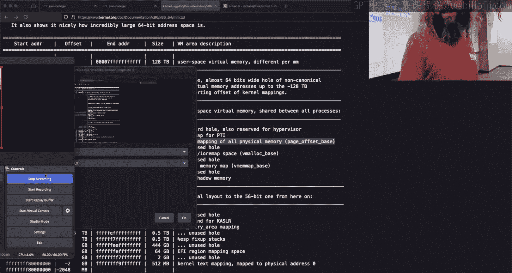

我们还深入探讨了如何在内核利用中定位和操作 `task_struct` 及 `cred` 数据结构，这是提升权限的关键。理解虚拟内存与物理内存的映射关系，以及内核如何管理进程和内存，对于成功进行内核级漏洞利用至关重要。