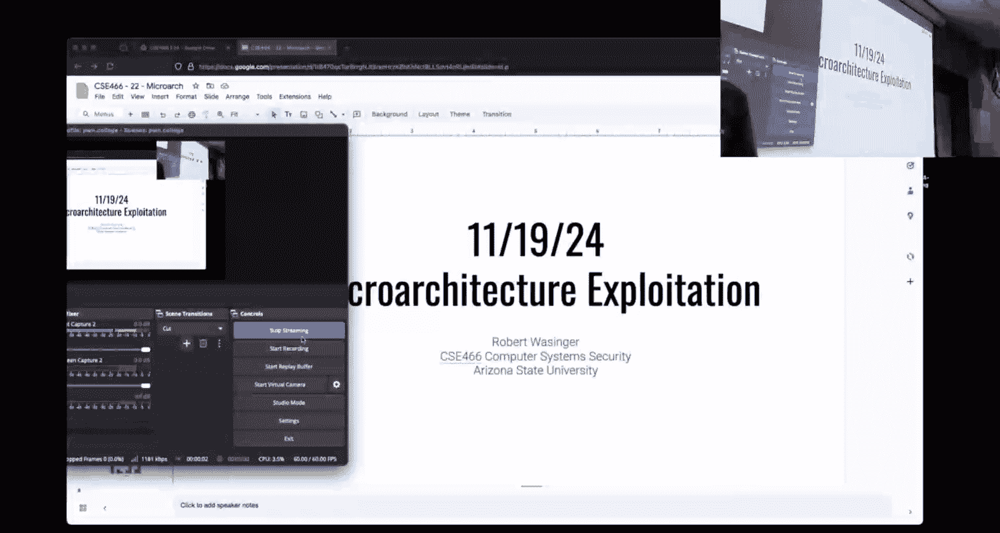
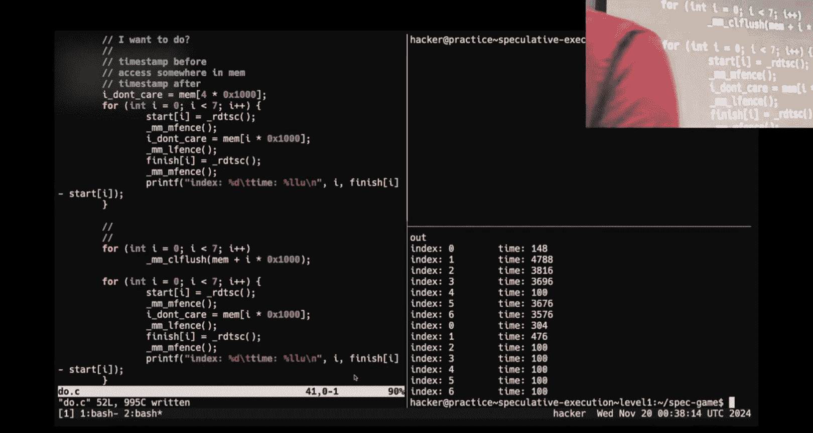
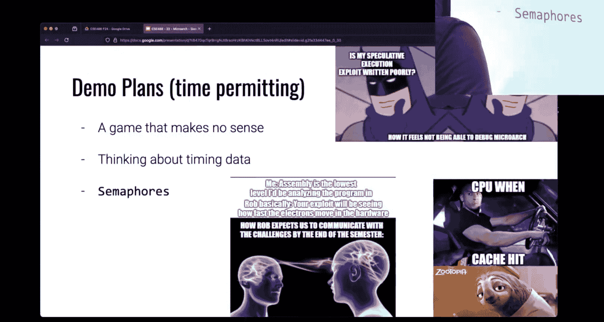
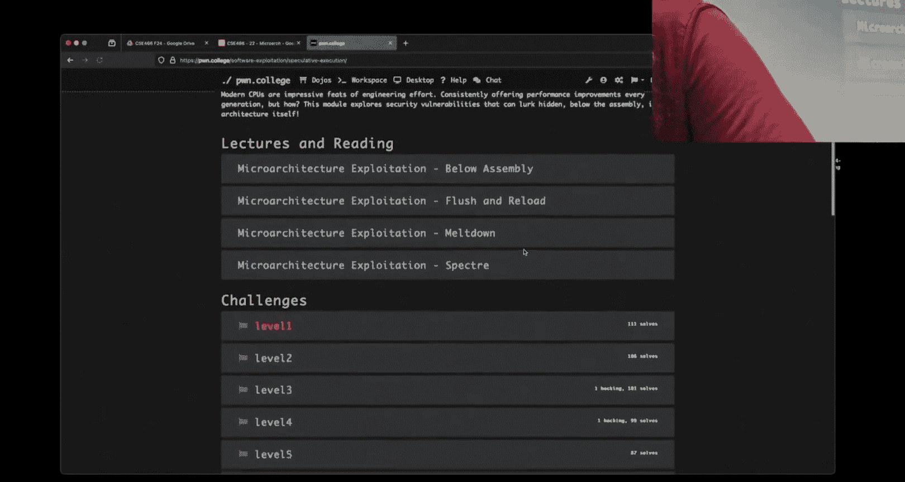
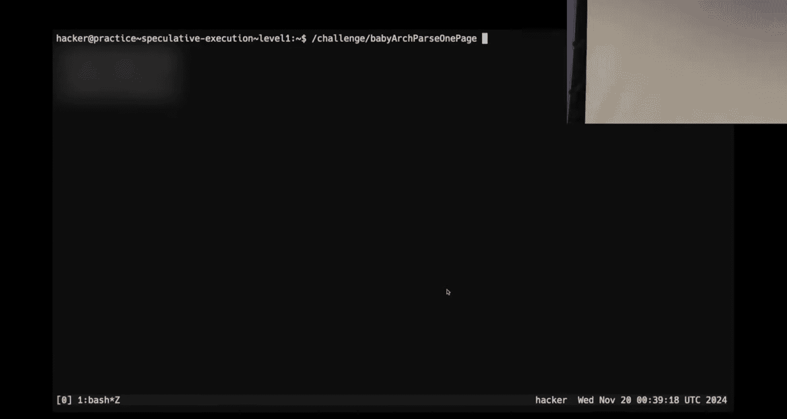
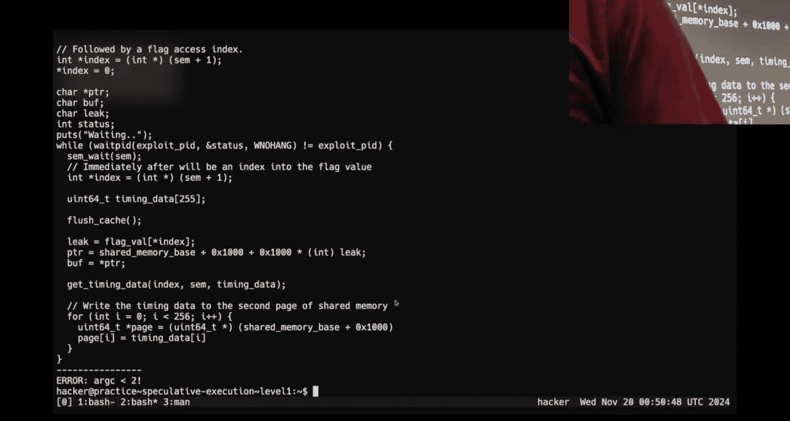
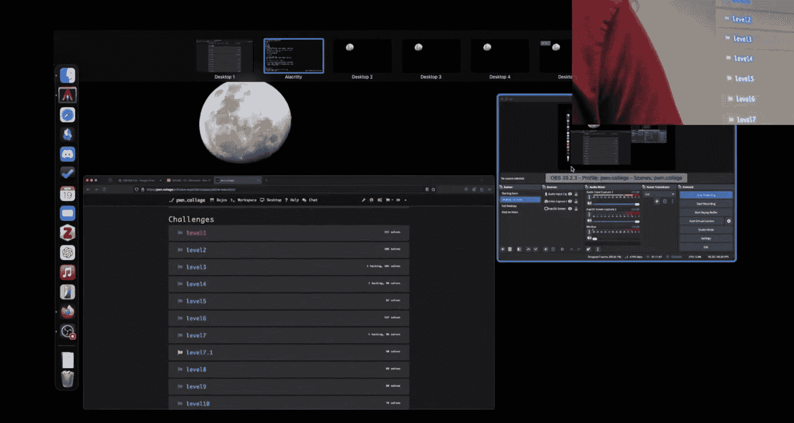

# 25：微架构利用



在本节课中，我们将要学习微架构利用（Microarchitecture Exploitation）的基础知识。这是一种通过观察和利用CPU硬件层面的特性（如缓存）来获取信息的技术，即使软件层面没有直接的通信渠道。我们将从一个有趣的演示开始，逐步理解其核心原理，并学习如何编写代码来实践这种侧信道攻击。


## 课程概述与回顾

上一周我们结束了内核安全模块的学习。那个模块的核心是利用内核权限或`run_cmd`等技巧来完成任务。希望你们已经掌握了其中的要点。

现在，我们即将进入本学期最后两个模块之一：微架构利用。很多人对这个话题津津乐道，这也是我们首次在本科课程中引入这个主题，我很好奇你们的反应。

## 微架构利用简介

微架构利用的核心思想是：**通过测量访问内存所需的时间，来推断目标数据是否存在于CPU的高速缓存（Cache）中**。由于缓存访问速度远快于主内存访问，这种时间差可以被精确测量并转化为信息泄露。


### 核心概念：CPU缓存与时间测量

现代CPU为了提升速度，在核心与主内存之间设置了多级高速缓存（L1, L2, L3 Cache）。当CPU需要读取一个内存地址的数据时：
1.  它首先检查缓存。
2.  如果数据在缓存中（缓存命中），则访问速度极快（通常几个CPU周期）。
3.  如果数据不在缓存中（缓存未命中），则需要从主内存加载，速度慢得多（可能上百个周期）。

我们的攻击就是基于测量 **`步骤2`** 和 **`步骤3`** 之间的时间差。

为了进行高精度计时，我们不能使用像`time()`这样的库函数，因为它们本身会产生内存访问，干扰测量。我们使用CPU提供的专用指令`RDTSC`（Read Time-Stamp Counter）来读取时间戳计数器。

**代码示例：使用 `RDTSC` 计时**
```c
#include <x86intrin.h>
unsigned long long start, finish;
start = __rdtsc();    // 读取开始时间戳
// ... 执行要测量的操作 ...
finish = __rdtsc();   // 读取结束时间戳
unsigned long long elapsed = finish - start; // 计算经过的周期数
```

## 演示：一个“不可能”的通信游戏

为了直观理解，我们先看一个演示。有两个程序：`game`（游戏）和`controller`（控制器）。控制器能控制游戏中的角色移动，但查看控制器代码会发现，它**从未向共享内存写入任何控制指令**，它只是读取内存并测量访问时间。

那么通信是如何发生的？
1.  游戏进程会定期访问一组特定的内存地址。
2.  控制器进程则尝试读取这组地址，并测量读取每个地址所花的时间。
3.  如果控制器发现读取某个地址特别快，说明游戏进程刚刚访问过它（因为数据已被加载到缓存中）。
4.  通过这种方式，控制器就能“猜”出游戏进程当前的状态，从而实现控制。

这个演示揭示了微架构侧信道攻击的本质：**通过观察缓存状态的变化来推断其他进程的行为**。

## 构建基础的缓存计时攻击

让我们尝试编写一个简单的程序来验证这个想法。我们的目标是：分配一块内存，然后测量读取其中不同位置所需的时间。

以下是构建攻击时需要遵循的要点和示例代码：

**代码示例：基础的缓存探测**
```c
#include <stdio.h>
#include <x86intrin.h>
#include <stdlib.h>

#define PAGE_SIZE 0x1000 // 4096字节，一页的大小

int main() {
    // 1. 分配内存，确保探测点间隔足够远（如一页），以避免CPU预取器干扰
    char *mem = malloc(PAGE_SIZE * 10);
    if (!mem) return 1;

    // 2. 我们选择探测第7个页面（索引6）的起始处
    int secret_index = 6;
    char *target = mem + (secret_index * PAGE_SIZE);

    // 3. 首先，清空我们关心的地址的缓存行
    _mm_clflush(target);

    // 4. 进行多次测量，取平均值以减少噪声
    int trials = 100;
    unsigned long long total_time = 0;

    for (int i = 0; i < trials; i++) {
        // 使用内存屏障确保指令顺序执行
        _mm_lfence();
        unsigned long long start = __rdtsc();
        _mm_lfence();

        // 访问目标内存地址
        volatile char value = *target;

        _mm_lfence();
        unsigned long long finish = __rdtsc();
        _mm_lfence();

        total_time += (finish - start);

        // 每次试验后都清空缓存，确保下次测量是从主存加载
        _mm_clflush(target);
        // 也可以加入一些随机延迟，避免规律性被CPU优化预测
        for (int j = 0; j < 100; j++) {}
    }

    unsigned long long avg_time = total_time / trials;
    printf("Average time to access target: %llu cycles\n", avg_time);

    // 5. 解释结果：如果avg_time较低（例如<100周期），可能表明在测量间隙有其他进程访问了target
    //    如果avg_time一直很高（例如>200周期），则表明没有缓存命中。

    free(mem);
    return 0;
}
```

**关键点解释：**
*   `_mm_clflush()`: 该指令将指定地址的数据从所有级别的缓存中驱逐出去。这是攻击的关键，它让我们能控制缓存的状态。
*   `_mm_lfence()`: 这是一个“加载屏障”指令。它确保在此屏障之前的所有**加载**操作都完成后，才执行之后的指令。这防止了CPU乱序执行对计时造成干扰。
*   **页面间隔**：将探测的内存地址设置为至少一页（4096字节） apart，是为了避免CPU的**硬件预取器**（Prefetcher）自动将相邻内存加载到缓存，从而干扰我们的测量。
*   **多次测量**：由于系统噪声（其他进程、中断等），单次测量不可靠。需要多次测量并分析统计结果（如平均值、中位数）。

## 课程挑战框架解析

本模块的实践挑战采用了一个特殊的框架。挑战程序会动态地将一块**共享内存**注入到你编写的攻击程序中，并提供一个**信号量**用于同步。

以下是攻击程序的基本框架：

**代码示例：挑战程序交互框架**
```c
#include <stdio.h>
#include <x86intrin.h>
#include <sys/sem.h> // 用于信号量操作

// 共享内存基地址（由挑战说明给出）
#define SHARED_MEM_BASE 0x13370000

// 根据挑战说明，共享内存的布局可能是：
// 地址 SHARED_MEM_BASE: 一个信号量 (sem_t)
// 地址 SHARED_MEM_BASE + sizeof(sem_t): 一个整数索引 (int)
// 地址 SHARED_MEM_BASE + 0x1000: 挑战程序写入计时结果的位置

int main() {
    // 1. 将共享内存地址强制转换为指针
    char *shared_base_ptr = (char *)SHARED_MEM_BASE;

    // 2. 获取信号量指针
    sem_t *semaphore = (sem_t *)shared_base_ptr;

    // 3. 获取索引指针
    int *index_ptr = (int *)(shared_base_ptr + sizeof(sem_t));

    // 4. 获取结果存储区指针（假设在基地址+0x1000处）
    unsigned long long *result_ptr = (unsigned long long *)(shared_base_ptr + 0x1000);

    // 5. 攻击循环
    for (int i = 0; i < 100; i++) {
        // a) 使用信号量等待，直到挑战程序准备好
        sem_wait(semaphore);

        // b) 执行我们的缓存计时攻击，探测 *index_ptr 指向的地址
        // ... (此处填入类似上一节的探测代码) ...
        // 假设我们测得了时间差 time_diff

        // c) 根据时间差判断缓存命中与否，从而推测出索引值或秘密信息
        // if (time_diff < THRESHOLD) { /* 缓存命中，说明挑战程序访问了某个特定地址 */ }
        // else { /* 缓存未命中 */ }

        // d) 通知挑战程序我们已完成一轮，让它继续下一轮
        sem_post(semaphore);
    }

    // 6. 读取挑战程序写入的结果并打印
    printf("Result from challenge: %llu\n", *result_ptr);

    return 0;
}
```







**框架工作流程：**
1.  **内存映射**：你的攻击程序通过硬编码地址直接访问挑战程序注入的共享内存。
2.  **同步**：通过信号量（`sem_wait`/`sem_post`）与挑战程序进行步调同步，确保你的测量与其内部操作对齐。
3.  **探测**：在同步点之间，你对共享内存中的特定地址（如`index_ptr`指向的地址）执行缓存计时攻击。
4.  **推断**：根据测量到的时间是长是短，推断出挑战程序在同步期间访问了哪个秘密地址，从而逐步泄露信息。




前几个挑战会引导你熟悉这个框架和基本的缓存计时技术。后续挑战会引入更复杂的概念，如**乱序执行**和**推测执行**（Spectre攻击的基础），这将允许你利用CPU的预测机制来访问本不该被访问的数据。

## 总结与建议

本节课我们一起学习了微架构侧信道攻击的基本原理。我们了解到：

1.  **核心原理**：通过精确测量内存访问时间，推断数据是否存在于CPU缓存中，从而泄露其他进程的信息。
2.  **关键工具**：使用`RDTSC`进行高精度计时，使用`_mm_clflush`控制缓存状态，使用`_mm_lfence`保证指令顺序。
3.  **攻击框架**：本模块的挑战通过共享内存和信号量提供了一个标准的攻击靶场。
4.  **编写建议**：强烈建议使用C语言编写攻击代码，以减少不必要的内存访问和复杂性干扰测量结果。

**给初学者的建议：**
*   **从简单开始**：先理解并运行课程提供的演示代码，确保你能观察到缓存命中与未命中的时间差异。
*   **耐心调试**：微架构攻击对环境非常敏感（系统负载、CPU型号等）。结果可能有波动，需要多次试验和设置合理的阈值。
*   **利用资源**：仔细观看课程预告的视频，阅读相关的`man`页面（如`sem_wait`），并在Discord上积极讨论。
*   **注意时机**：这类攻击在系统负载低的时候更容易成功。





微架构利用是一个深入硬件细节的领域，它揭示了现代计算机性能优化背后所隐藏的安全风险。希望你们在接下来的两周里，能享受解谜的乐趣，并深入理解软件与硬件交互的这一隐秘层面。