# 26：微架构利用

## 概述


在本节课中，我们将深入探讨微架构利用的核心概念，特别是缓存侧信道攻击和推测执行攻击（如Spectre）。我们将从基本的时序测量和缓存利用开始，逐步过渡到更复杂的推测执行场景，并讨论如何设计可靠的攻击代码以及处理时序数据的策略。

---


## 微架构利用的核心概念

上一节我们介绍了微架构利用的基本背景，本节中我们来看看构成这个模块的三个核心概念。

以下是三个相互关联但又有所区别的微架构利用概念：

1.  **缓存时序侧信道**：这是我们在周二讨论的概念。它不涉及推测执行，纯粹是利用缓存作为一致的侧信道。通过精心编写的代码测量访问时间，可以推断出系统的状态信息。其核心在于，如果受害者进程访问了共享内存的某个位置，该位置会被加载到CPU缓存中，攻击者随后测量访问同一区域的时间，更快的访问时间表明该位置最近被访问过。
    *   **核心代码逻辑**：
        ```c
        // 攻击者代码：刷新缓存并测量访问时间
        _mm_clflush(shared_memory_base + i * PAGE_SIZE); // 刷新缓存
        // 触发受害者访问（例如通过信号量）
        sem_post(&sync_sem);
        // 测量访问时间
        start = __rdtsc();
        temp = *(shared_memory_base + i * PAGE_SIZE);
        end = __rdtsc();
        time_taken = end - start;
        ```
2.  **预取器优化与预取指令**：这是一个与缓存无关的完全不同的侧信道。CPU的预取器会尝试优化代码，例如优化循环访问模式。此外，`prefetch`指令允许程序请求CPU提前获取一个虚拟内存地址。通过测量执行该指令的时间，可以推断该虚拟地址是否已映射到物理内存。
3.  **Spectre攻击**：这结合了缓存侧信道和推测执行。CPU在执行条件分支（尤其是涉及慢速操作如浮点计算时）时会进行推测执行。攻击者可以“训练”分支预测器，使其错误地推测执行本不应执行的代码路径（例如，访问越界内存）。尽管推测执行的结果最终会被丢弃，但它对缓存状态的影响会保留下来，从而通过缓存侧信道泄露信息。

---

## 缓存侧信道攻击原理详解


理解了核心概念后，我们来看看一个典型缓存侧信道攻击的具体数据流和原理。

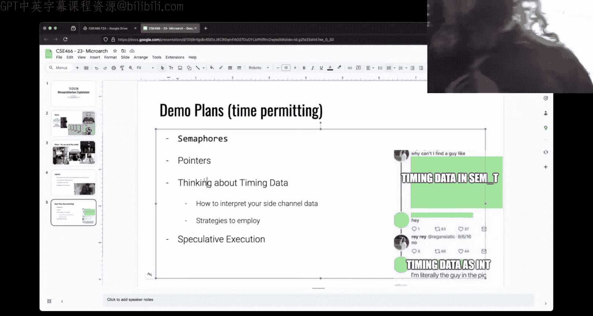


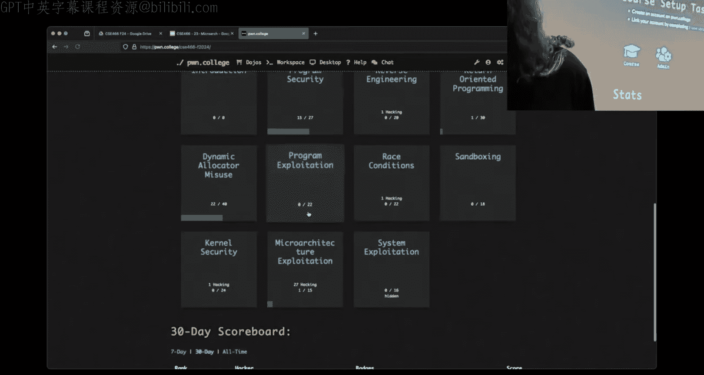

攻击的目标是泄露一个秘密值（例如标志`flag`的一个字节）。受害者程序会使用这个秘密字节作为索引，去访问一个双方共享的内存区域（称为`access_buffer`）。

攻击流程如下：

1.  **攻击者准备**：攻击者首先刷新整个`access_buffer`在缓存中的内容，确保缓存处于已知的干净状态。
2.  **触发受害者**：攻击者通过同步机制（如信号量）触发受害者程序执行。受害者程序使用秘密字节`flag[i]`作为索引，访问`access_buffer[flag[i]]`，这将把对应的内存页加载到CPU缓存中。
3.  **攻击者探测**：攻击者遍历`access_buffer`的每一个可能索引（例如0-255），并精确测量访问每个元素所需的时间。
4.  **信息推断**：访问时间显著更短的那个索引，对应的内存页就在缓存中，从而泄露了`flag[i]`的值就是该索引。

**关键点**：
*   信号量仅用于同步操作顺序（先刷新，后触发访问，再测量），其本身不包含要泄露的数据。
*   共享内存区域（`access_buffer`）的内容无关紧要，攻击者关心的是其访问模式。
*   攻击的成功依赖于精确的时序测量和可靠的同步。

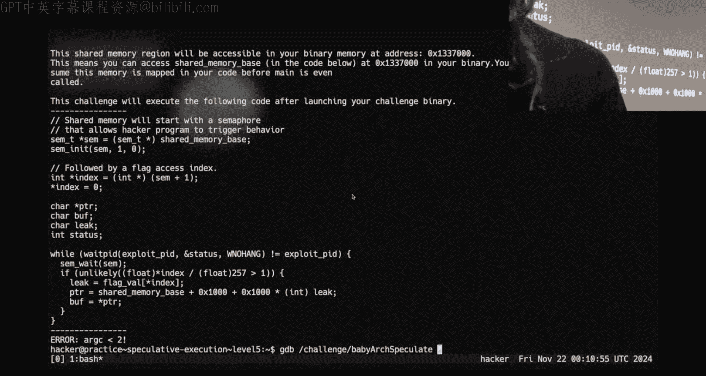

---

## 推测执行与Spectre V1

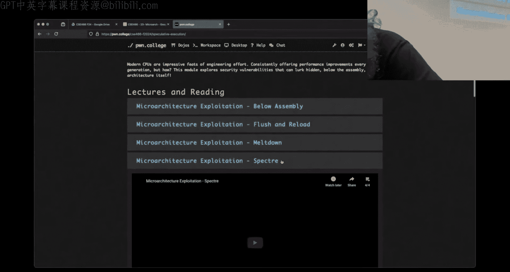

现在我们从静态的缓存侧信道进入动态的推测执行世界。本节中我们来看看Spectre V1攻击是如何利用分支预测的。

在第五关的代码中，存在一个条件分支：
```c
if (unlikely((float)index / (float)257 > 1.0)) {
    // 此代码块在正常情况下不应执行，因为它要求 index > 257
    // 而flag索引有效范围是0到某个较小值
    access(shared_memory_base + (index * PAGE_SIZE));
}
```
*   `unlikely`宏是一个给编译器的提示（现代CPU可能忽略），暗示该分支不太可能发生。
*   使用浮点除法是因为它是一个相对较慢的操作，给了CPU足够的时间在结果计算完成前进行推测执行。


**攻击步骤**：

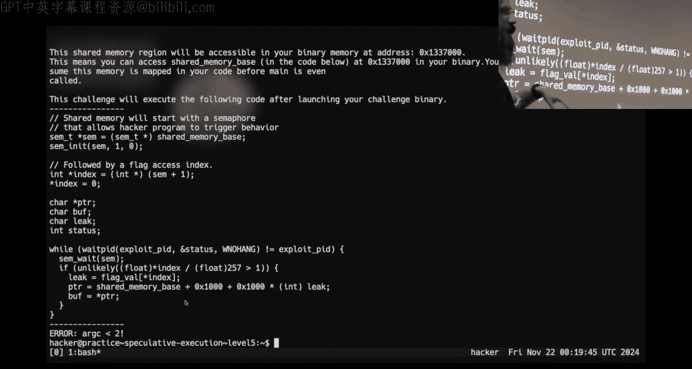


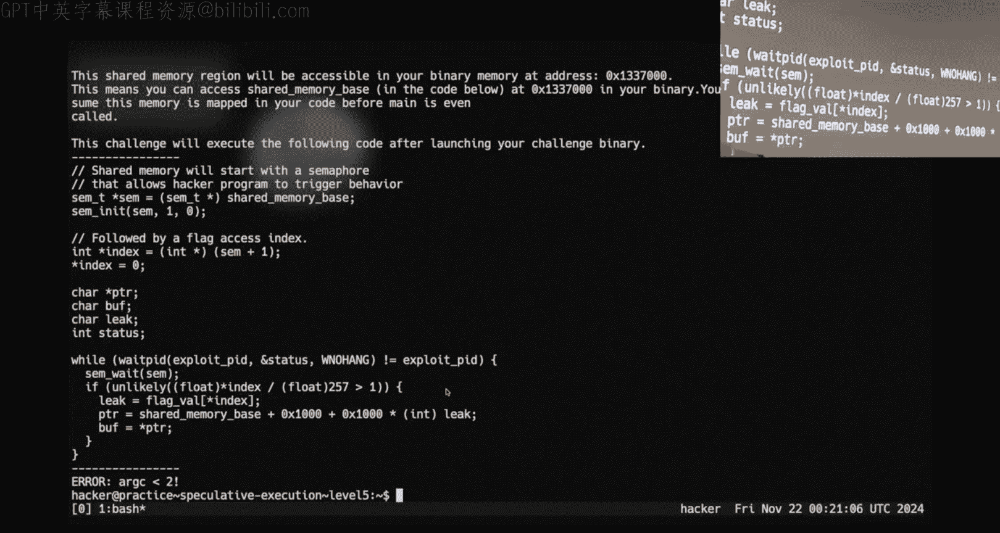

1.  **训练分支预测器**：攻击者多次以合法的、满足条件（`index > 257`）的输入调用这段代码。这会将CPU内部对应此分支地址的“两位计数器”状态机推向“强烈预测跳转”的状态。
2.  **触发推测执行**：攻击者随后提供一个不满足条件（`index`是小的有效值，如0）但希望泄露的输入。由于分支预测器已被训练为“预测跳转”，CPU在等待慢速浮点比较结果时，会**推测性地执行**`if`块内的代码，使用小的`index`去访问`shared_memory`。
3.  **缓存残留**：尽管当浮点比较结果返回、发现预测错误后，推测执行的所有架构状态都会被回滚（指令被“退休”），但对缓存状态的改变（即`shared_memory_base + (index * PAGE_SIZE)`被加载到缓存）会保留下来。
4.  **侧信道读取**：攻击者随后使用标准的缓存时序侧信道技术，探测`shared_memory`区域，发现哪个索引的访问时间变短，从而推断出在推测执行中使用的`index`值，即泄露的标志字节。

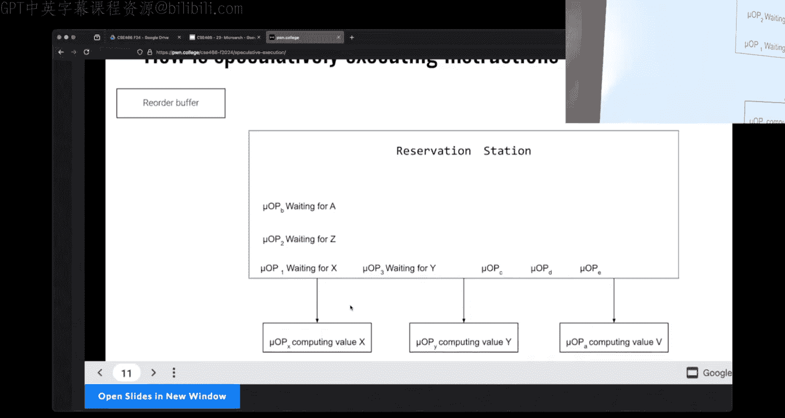


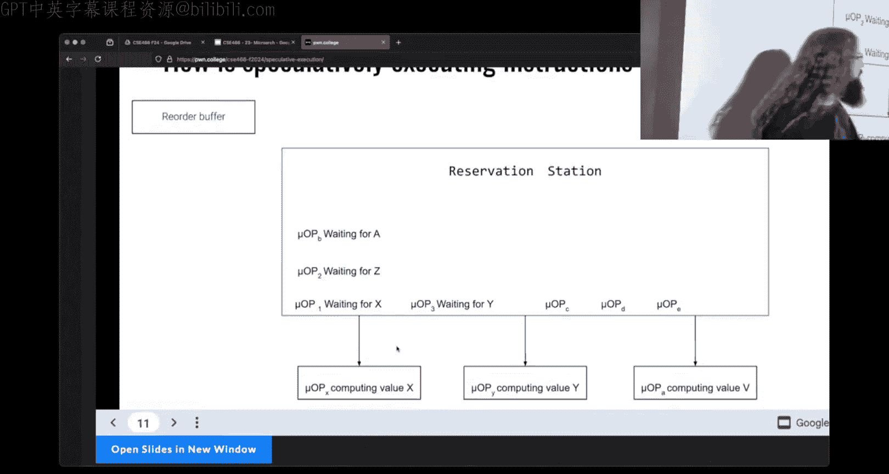

**核心挑战**：这是一个**竞态条件**。攻击者需要赢得“推测执行微操作”与“浮点比较结果返回”之间的比赛。即使训练正确，也可能因CPU繁忙度等原因导致推测未发生。因此，攻击代码必须能处理大量“失败”的尝试，并从噪声中识别出成功的信号。

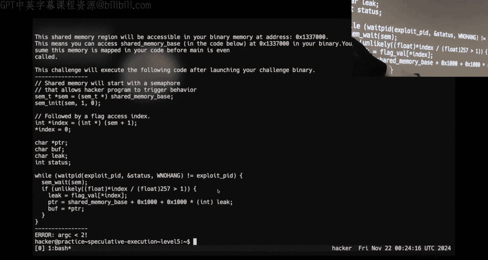

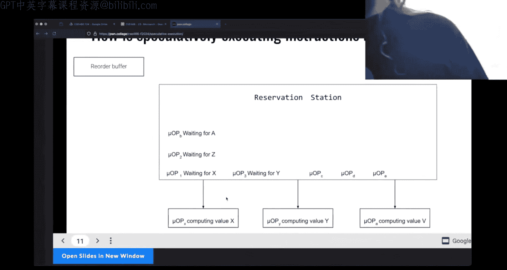

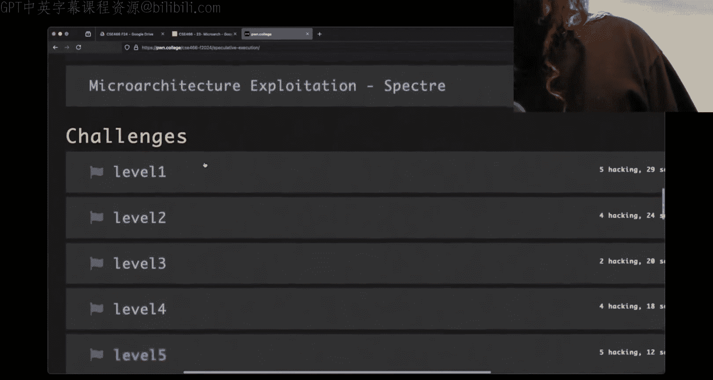

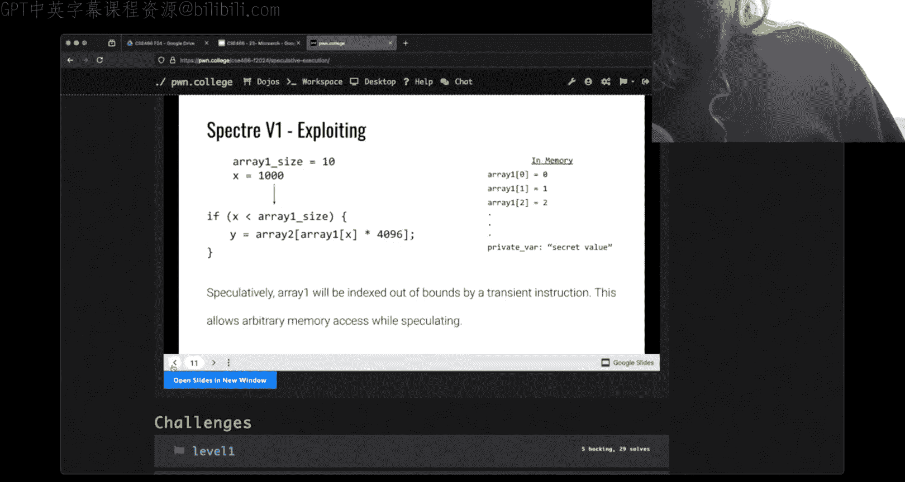


---

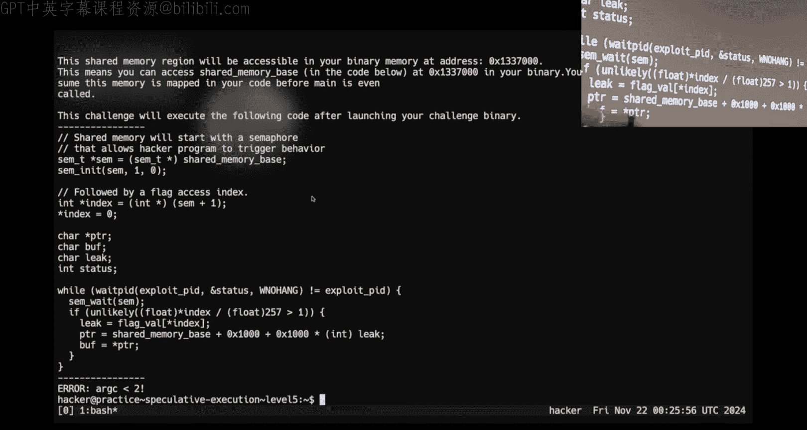

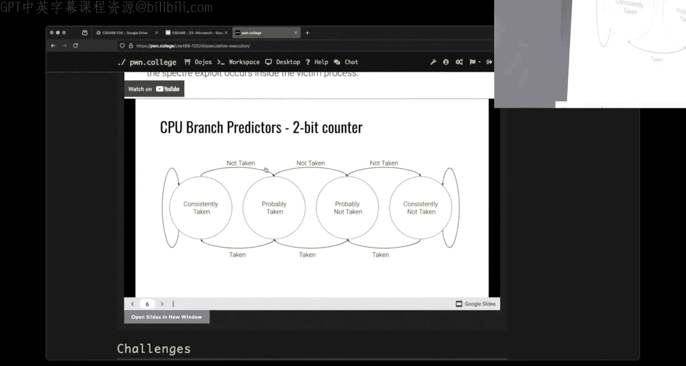

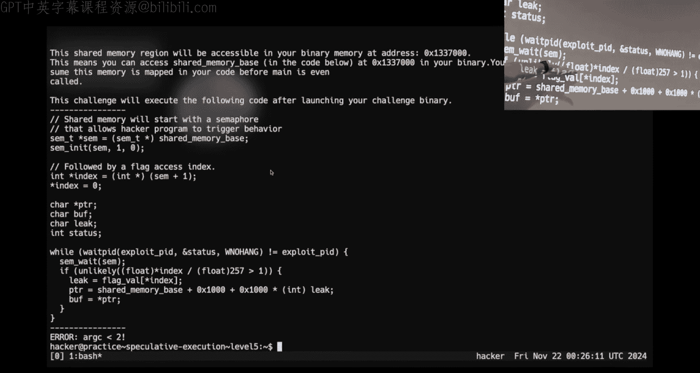

## 时序数据处理策略

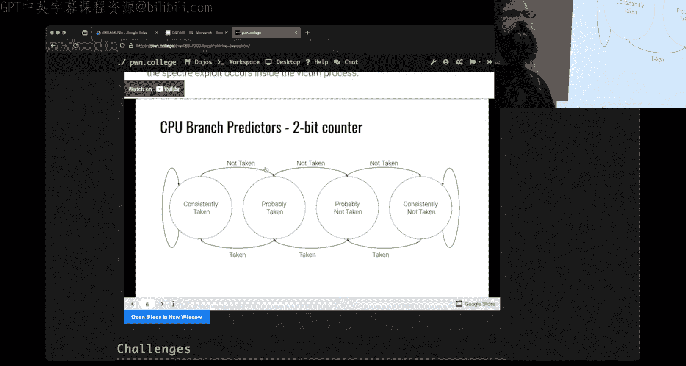


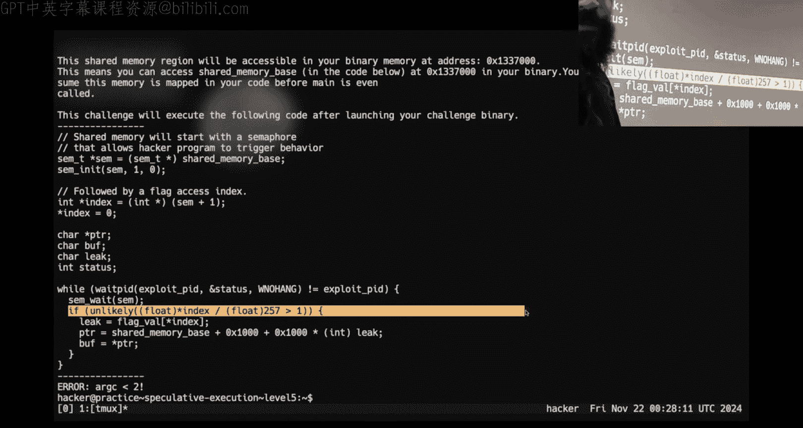

由于攻击，尤其是涉及推测执行的攻击，具有内在的不确定性，我们需要有效的策略来处理时序数据。本节中我们来看看几种常见的方法。

以下是处理缓存时序数据的几种策略：

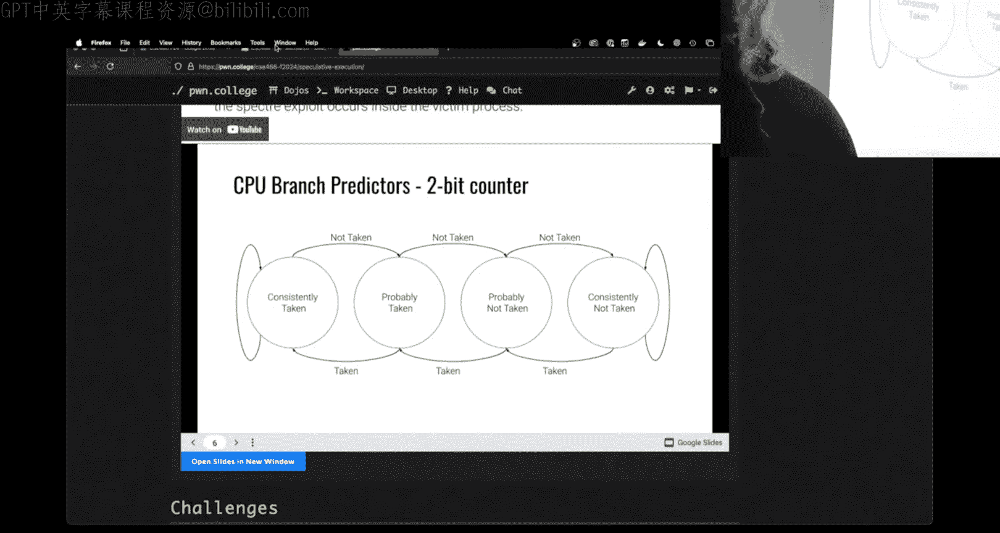

*   **多次运行与统计**：对每个要猜测的字节索引，运行攻击多次（如数百次）。记录每次运行中访问时间最短的候选字符。最后，选择出现次数最多的那个字符作为结果。这种方法在前几关（无推测）可能有效。
*   **设置时间阈值**：在涉及推测的执行中，许多运行可能因为未成功推测而导致所有访问时间都很长（“坏运行”）。可以设置一个时间阈值（例如200个CPU周期）。只有当最短访问时间低于该阈值时，才认为此次运行有效并记录结果。这样可以过滤掉大部分噪声。
    *   **如何确定阈值**：需要观察多次运行的数据。如果能看到一些运行中存在明显的“快”（如<200周期）和“慢”（如>500周期）的两组数据，阈值可以设在中间值附近。阈值可能需要根据系统负载动态调整或通过代码自动计算。
*   **动态阈值与聚类分析**：更高级的方法是让代码自动分析每次运行得到的所有时间数据。例如，先运行几次，计算所有时间的中位数或均值，然后设定一个基于此的阈值。或者寻找时间数据中的自然聚类，将快速聚类中的最小值对应的索引视为候选。

**调试技巧**：
*   如果所有访问时间都很短（如都<300周期），可能意味着缓存未被正确刷新，或者攻击者代码本身无意中将数据引入了缓存（例如，在测量循环中使用了`printf`调试，而`printf`会访问内存）。
*   如果所有访问时间都很长（如都>500周期），可能意味着受害者从未成功访问目标内存，或者同步有问题，或者缓存刷新过于频繁。
*   理解数据模式对于调试至关重要，这需要耐心和反复实验。

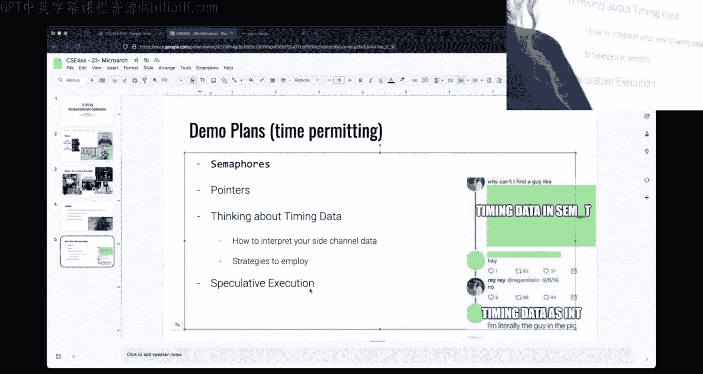

---

## 编写可靠攻击代码的注意事项

在结束之前，我们总结一些编写微架构利用代码时的实用要点。

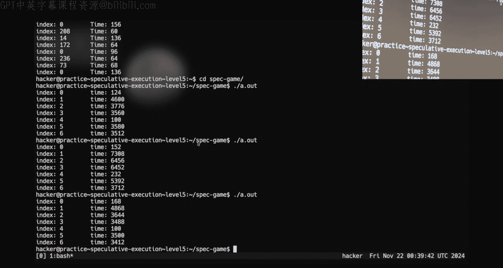

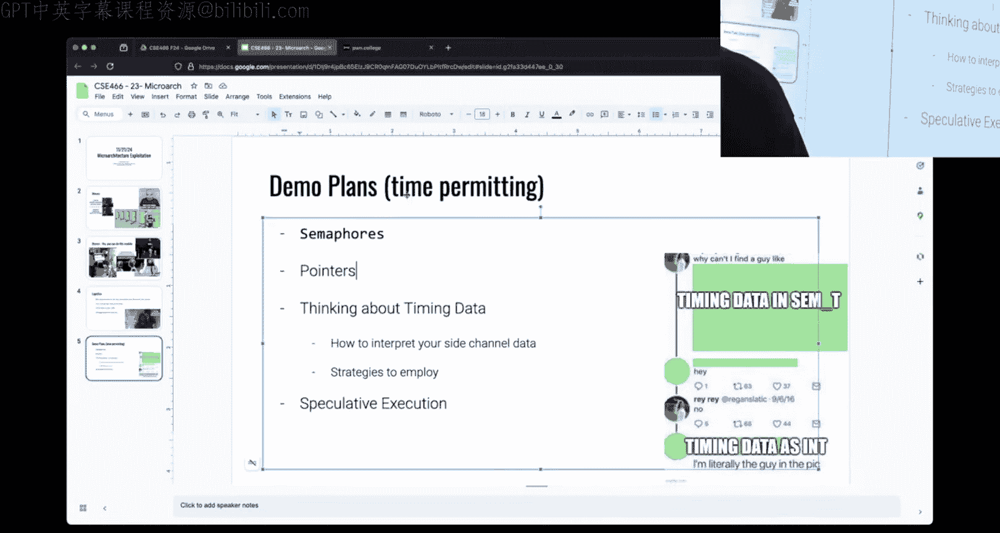


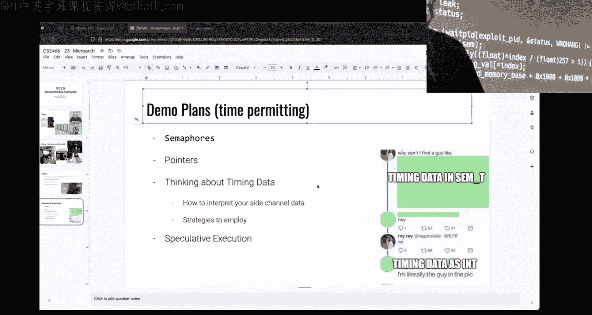


*   **避免无意缓存污染**：在攻击者代码中，尽量减少不必要的内存访问。例如，计算指针地址时，不要提前解引用。
    ```c
    // 不佳做法：解引用会污染缓存
    char *pointer = &shared_memory_base[i * PAGE_SIZE];
    // 更佳做法：仅计算地址
    char *pointer = shared_memory_base + i * PAGE_SIZE;
    ```
*   **谨慎使用调试输出**：`printf`等函数会访问内存，严重影响缓存状态。尽量使用其他方式记录调试信息，或确保调试代码不影响关键的攻击路径。
*   **理解同步机制**：正确使用信号量或其他同步原语来控制攻击者与受害者进程的执行顺序，确保“刷新-触发-测量”的序列得以维持。
*   **分支预测器训练**：对于Spectre，训练不需要成千上万次。由于简单的两位计数器状态机，通常几次（如3次）连续的正确预测就足以将预测器状态推向强预测方向。

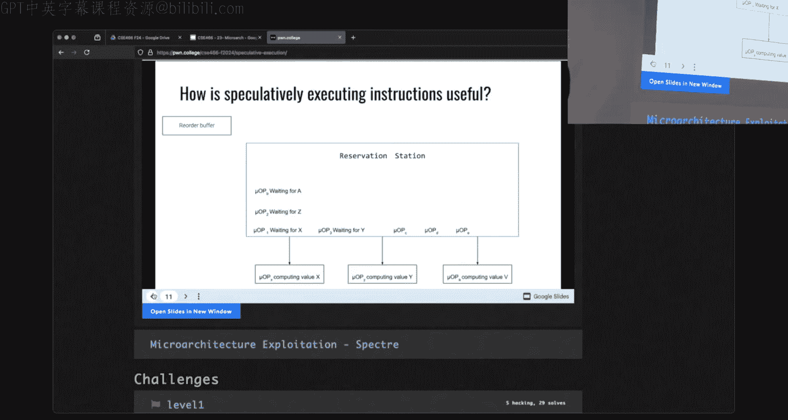

---

## 总结与后续

本节课中我们一起学习了微架构利用的核心内容。我们从基础的缓存侧信道攻击原理入手，详细分析了其数据流。然后，我们深入探讨了Spectre V1攻击，理解了它如何利用CPU的推测执行和分支预测缺陷，结合缓存侧信道来泄露信息。我们还讨论了处理时序数据的多种策略以及编写可靠攻击代码的注意事项。


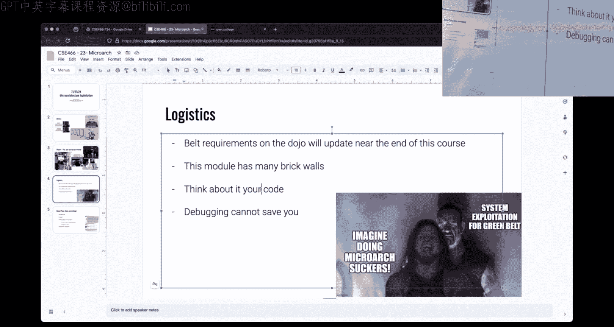


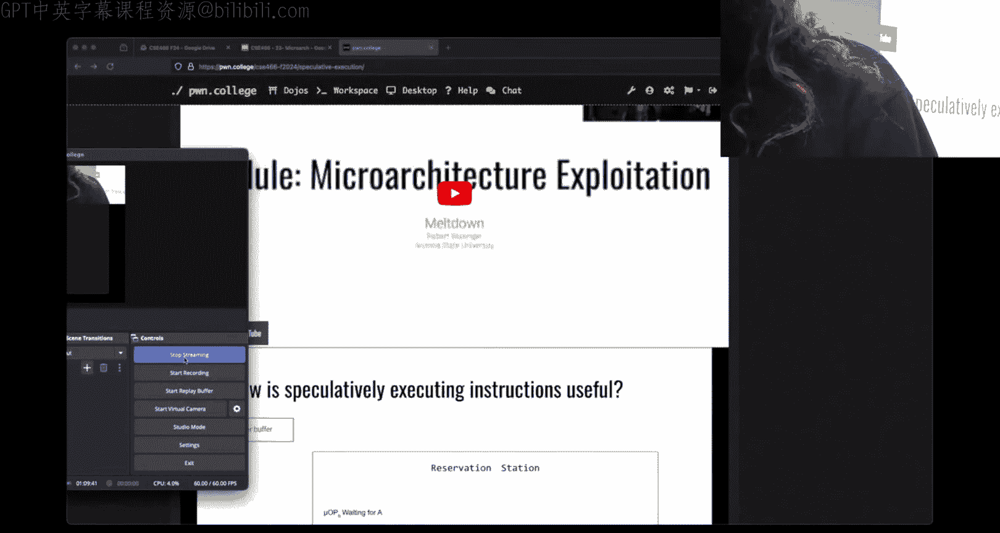

本模块的后半部分将涉及内核中的利用以及Meltdown攻击。这些挑战可能需要更多时间，请合理规划学习进度。记住，理解概念和耐心调试是攻克这些难题的关键。