# 27：微架构利用

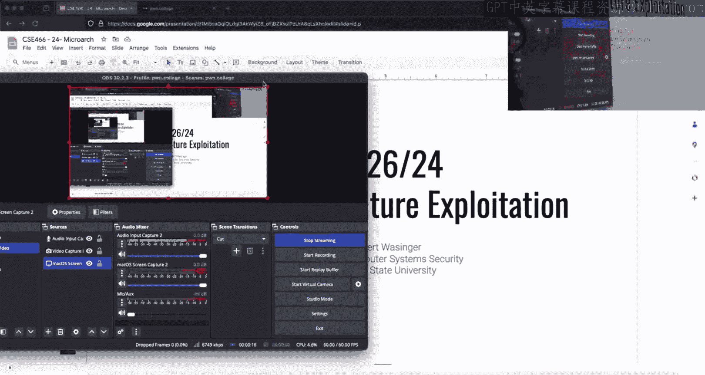

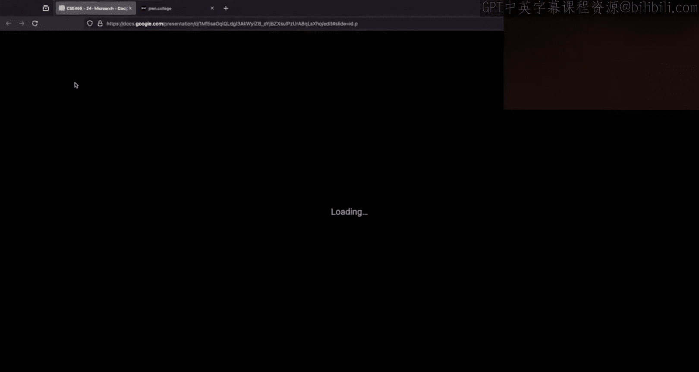

在本节课中，我们将学习微架构利用模块的核心概念，包括Spectre V1/V2攻击与Meltdown攻击的原理与区别，并了解相关挑战的解决策略。

## 课程概述与进度

今天是2024年11月26日，我们正处于微架构利用模块的中期。

从提交情况看，大家已经开始实际动手。这个模块确实名不虚传，大家既觉得有趣，也认为其逻辑清晰。GDP（推测执行）似乎能解决一切问题。

我有点惊讶这次讨论集中在第4级上，通常抱怨最多的是第5级。因为前4级实际上完全不涉及推测执行，只是需要利用CPU缓存侧信道。第5级通常被认为是本模块前半部分中最难的一关。

## 关于第5级挑战的深入探讨

第5级引入了推测执行。你会遇到这样的场景：你明白需要训练分支预测器。你执行程序，引导CPU走某条路径三次，然后做点别的。希望CPU能推测性地执行你想要的操作。

我曾在周二或周四强调过，这是一场竞赛。你可以训练分支预测器，然后执行你希望CPU执行的操作，但你仍然可能错过时机。很多人对第5级有同感。

因此，对于你想要泄露的每一个值或索引，你都需要尝试很多次，因为你可能无法每次都成功触发CPU内部的那场竞赛。

## 模块难度与策略

这可以说是本课程中最难的模块，尽管下一个模块也绝不轻松。之前积累的额外学分现在可以派上用场了，因为所有困难的内容都集中在学期末，同时你还要应对期末考试。现在是兑现额外学分的时候了。

当服务器繁忙时，执行这些微架构利用会困难得多。目前情况还算平稳，但当服务器负载高时，例如上周日365课程有截止日期，600名学生同时在运行程序，他们的代码会在你试图利用的同一CPU核心上执行，他们的内存访问会冲刷掉你放入缓存的数据。因此，在CPU负载较低时尝试这些攻击总是更好的选择。

总的来说，大家对这个模块又爱又恨。但经历它很重要：要么你成功了，感觉非常酷；要么你体会到了它的难度，并理解了其困难所在。

有些人意识到，或许兑现额外学分是更明智的选择。如果你前期没有积累额外学分，接下来的几周可能会很艰难。但如果你积累了，要在这门课拿到A会容易得多，这本身就是课程设计的一部分。

## 服务器负载与同步技巧

有人说，他们只需要等待服务器上少于50人。但请注意，Dojo网站显示的数字不能绝对化，因为我们现在是多节点部署，你看到的数字分布在多个主机上。目前大概有三个主机，所以50人并不算多。但当有300-400名学生同时运行程序时，肯定会造成干扰。

我从未推荐过使用 `usleep`，但它似乎是许多人尝试同步第1到5级挑战的普遍方法。我提到过 `sched_yield` 和 `nanosleep`。`usleep` 只是 `nanosleep` 的一个Python包装器，功能相同。但由于它是对系统调用的包装，理论上会有更多的内存访问，这可能会降低你的成功率，因为会引入更多缓存噪声，给你带来不必要的麻烦。不过，对于向我展示使用它的人，他们找到了让它工作的方法。

归根结底，你所做的是观察这些计时数据，并试图理解它们，这是整个概念的关键。

## 第6级与第7级挑战

第7级可能之前没说清楚，它是一种与之前不同类型的侧信道攻击。

第1到5级是缓存侧信道攻击。第5级是推测性侧信道攻击，本质上是在做类似Spectre V1的攻击。

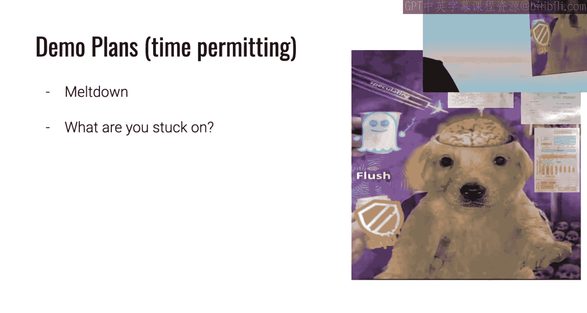

第6级只是一个小菜单，每个人基本上都是暴力破解，这让我有点难过，但现实如此。它本意是教你关于页面错误的知识，因为如果你试图推测性地访问一个没有物理内存支持的页面，你会得到错误数据。这一关的陷阱在于，你必须对所有那些页面引发页面错误，否则你从计时数据中得到的信息将是垃圾，毫无意义，因为你并没有真正访问物理内存。

但第7级要求你编写一个预取计时攻击。这与你在第4级和第5级所做的非常不同。如果你盲目地尝试应用在第4级和第5级使用的相同技术，你将会遇到段错误。

在第4级和第5级，你计时访问的是进程内映射的虚拟内存地址。而在第7级，挑战要求你找出这个映射区域在虚拟内存中的位置。因此，如果你尝试访问未映射的内容，就会发生段错误。所以你必须使用一种不同的技术，这在预备阅读材料中有涉及。

## 性能与核心绑定

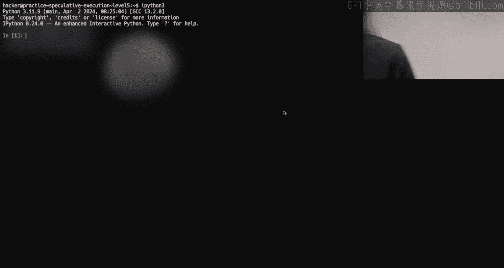

就像竞态条件一样，如果你的解决方案效率极低，你可以运行它（我记得Dojo最终会超时，最长可达6小时）。然而，对于所有这些挑战，一个合理的、优化良好的解决方案应该能在一分钟左右输出flag。

前几个关卡会随机将你的进程固定到一个CPU核心。它会固定挑战进程，然后当它派生出你的漏洞利用代码时，也会固定到同一个核心。这是为了确保所有代码都在共享同一缓存的同一个核心上运行。

对于后面的关卡，我猜是第8、9、10级左右，这些也是基于Spectre的攻击。我不认为这些挑战会自动为你固定CPU核心。所以，如果你想这样做，你应该自己处理。否则，挑战可能在一个核心上运行，而你的漏洞利用在另一个核心上运行，它们不共享缓存，测量计时将会非常糟糕，因为你测量的不是同一个缓存。

## 课程安排调整

我提到过，在假期期间，我在Discord上的可用时间会时断时续。感恩节假期期间以及下周五，我通常有办公时间，但下周五我不会举行。再下一周的周五，我会尝试在周四补一次，下周二的课上我会通知大家。下周五我肯定没空，所以如果你们有特别希望的时间，请告诉我，我们可以商量。

我意识到你们中的一些人现在处境艰难。下周是假期，但你们已经在这个模块上非常努力了。我曾说过，如果你们抱怨很多，我会考虑调整检查点截止日期。但问题是，我自己也当过学生，我知道如果我在假期前说这个，你们就不会努力工作了。所以，我宁愿承受一些抱怨。

那么，我会这样做：截至昨晚，只有大约一半的学生达到了刚过去的检查点。对于正在解决本模块挑战的学生，大多数检查点都能被完成。但这次是个例外，因为它是个困难的模块。因此，我们将移动截止日期。我希望我没打错字：本模块的截止日期将改为12月16日，也就是学期末。检查点我会给你们额外一周时间，所以它仍然会与感恩节周末冲突，但希望你们这个周末已经非常努力了，这样你们可能只需要再完成一个挑战，情况就不会太糟。你们仍然可以获得那个检查点。这对大家公平吗？我看到有人摇头说不，想要更多时间；也有人点头说是。好的，我接受。

我这样做是出于好意。如果我说得太早，你们可能会拖延。希望你们能原谅我这点善意的欺骗。

尽管如此，系统利用模块仍将按计划在本周五（感恩节假期期间）启动。我不在乎你们是否在那时完成，它的截止日期是学期末，但我们会保持一切按计划进行。

从启动时起，本课程的所有作业都应该出现在你们的成绩单中。有人在Discord上问，这是否意味着成绩页面上显示的就是你们的课程最终成绩？就我所知，答案是肯定的。

## 关于Meltdown攻击的讲解

我之前计划讲的是侧信道推测攻击，比如利用缓存。周二/周四我们讨论了很多，但没有演示。本模块中第三种微架构侧信道攻击是Meltdown。Meltdown的工作原理与Spectre类似，仍然是一种推测计时攻击，但你泄露的是跨越不同安全域的信息。

我们可以看一下这个，除非你们有特别想探讨的路径或问题？有人想了解更多关于Spectre V2的内容吗？

好的。问题是：在什么情况下我们可以使用Spectre V2？能提供一些有用的链接吗？

这就是为什么你们要在Discord上提问，这样我才能提前准备。我今天早些时候有点时间，我在想：讲Meltdown听起来不错吧？所以我从我自己的讲座视频里偷了个演示。

## Spectre V1 与 V2 的区别

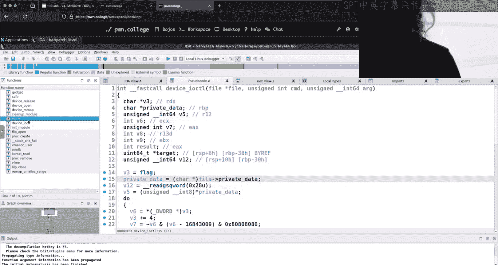

Spectre V1和V2的区别是什么？有人能告诉我吗？不是你，其他人。

你们只需要读幻灯片就行。是的，Spectre V1利用了条件分支。这就是我们有比较指令的地方，CPU必须猜测我们是否会执行这个条件跳转。这就是“训练”这个想法的来源。Spectre V1是Spectre的经典例子，大多数时候人们谈论Spectre时指的就是V1。

Spectre V2，正如有人在这里敏锐地指出的，利用了间接分支。什么是间接分支？好的，我给你们解释一下。那是一种在运行时才知道的跳转。所以，在运行时，你不知道要跳转到哪里。

Twitch上的说法是：这是一种在编译时不知道，但在运行时才知道的跳转。这是对的，这就是间接分支或间接跳转。

如果我们考虑所有使用变量的跳转，因为我们不知道变量会持有什么值，所以除非我们用那个值运行，否则我们不知道跳转是否会发生。但那个跳转可能有几个选择，它可以跳转到任何地方。例如，如果我有汇编代码并调用某个函数，我知道那个函数在哪里吗？是的。在那个位置，我还会调用其他东西吗？不会。

但如果我动态计算一个要跳转到的位置呢？这就是间接跳转。

我们可以研究一下这个挑战，因为我知道。我可以草草写点东西，或者我们可以找一个例子。是的，这里有一个间接调用。

## 分析内核模块挑战

所以让我们打开这个家伙。有人说他们现在还不明白。我问的问题有点刁钻，让它变得很难。

我们打开IDA看看。让我们往下翻。这些后面的关卡，你可能会觉得有点吓人，因为如果你注意了，这是一个内核模块。实际上它应该更容易一些。

像第1到5级，我们有共享内存和信号量，你需要用它们来触发挑战执行某些操作。这里没什么大秘密，所以我稍微剧透一点。

这些内核模块的工作方式是使用我们的老朋友 `ioctl`。你可以编写用户态代码来调用 `ioctl`，迫使内核执行某些操作。这与之前的概念非常相似，只不过之前全是用户态，使用共享内存和信号量，而现在我们使用 `ioctl` 来触发运行在内核中的行为。

这看起来有点奇怪。好吧。我在找什么？我在找一个间接调用，一个我可以触发的调用。你看过这个了吗？你知道问题大概在哪里吗？我不知道，所以我可以看看，或者你可以给我指个大概方向。

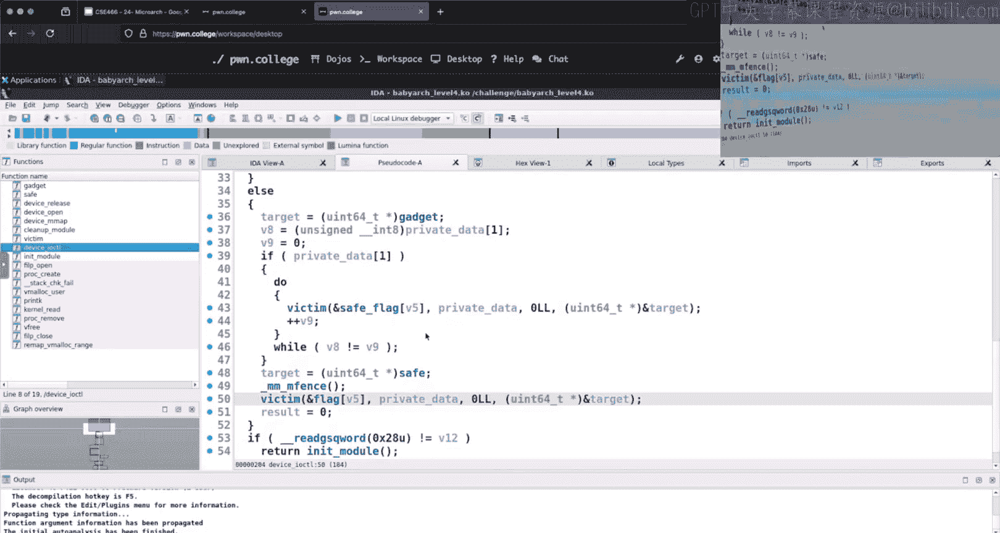

应该在某个 `else` 代码块里。在 `else` 代码块里某个地方。好的，那里有个 `-1`，但肯定需要一些逆向工程来理解这些值是如何使用的。

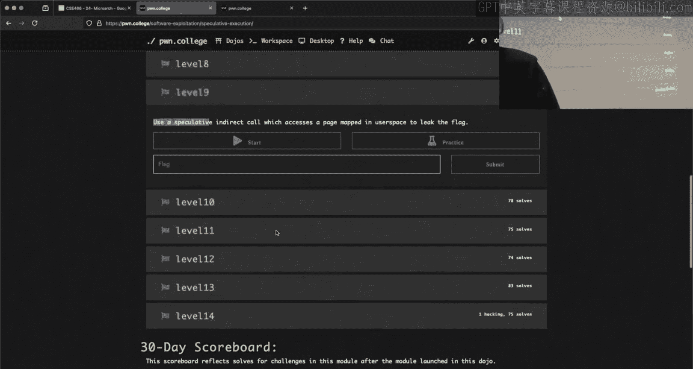

我们有私有数据。我们将对这个调用受害者函数。参数是 flag、私有数据、0，然后是目标地址，其中目标是 gadget。受害者函数是什么？返回 junk。junk 一定很重要。这里有一个对 target 的解引用。它正在调用存储在 RBX 中的指针。

IDA 让它看起来一团糟，但根据我的经验，IDA 经常这样。这个 target 是一个函数，它正以这些参数（某个地址、共享内存和输入）被调用。

## Spectre V2 的工作原理

Spectre V2 的工作原理与 Spectre V1 类似，都是训练预测器在不知道某些信息时该执行什么。但在 Spectre V1 中，你训练 CPU 在条件跳转（一个 if-else）时该怎么做。而在 Spectre V2 中，你训练的是 CPU 的不同部分。

因为这个对 target 的调用不是一个 if-else。如果 target 是 1，我们就跳转到 1。如果 target 是 1337，我们就跳转到 1337。它可以是 1338 吗？当然，为什么不行。所以这个特定的函数调用可以跳转到许多不同的地方。CPU 中有一个不同的部分来跟踪我们从这里间接跳转到了哪里，这与分支预测类似，但不是一个简单的状态机。我们仍然需要多次训练它，策略仍然是相同的：我们多次以某种方式执行它，然后改变它。

这允许我们跳转或调用到一个我们原本不应该（推测性地）以这些参数调用的函数。那么我们的问题就变成了：这个东西通常去哪里？我们想训练它去哪里？我们想实现什么？

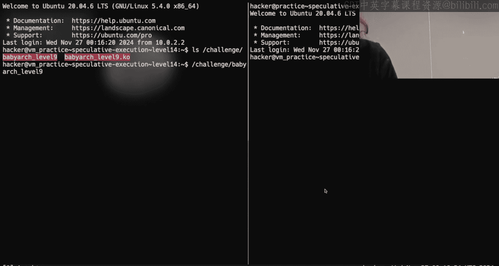

## 侧信道与缓存

好的，既然这告诉你有一个间接调用，Spectre V2 仍然涉及缓存计时侧信道吗？你说不？所以，我们具体地或推测性地跳转到一个地址。推测性地执行任何东西会在具体世界中产生影响吗？目前，我们唯一能通过推测性执行影响的是缓存。CPU 中还有其他微架构元素吗？

如果我想泄露信息，我可能想推测性地执行一些东西，然后通过计时侧信道观察到它。那么，我们在这里能做什么？让我们看看。受害者函数参数是：字符指针 adder，字符指针 shm（希望是共享内存），然后是输入。我们看到有刷新操作。这是在刷新存储那个指针的地址，以确保该指针不在缓存中。这有些道理，因为我们需要确保 CPU 不知道那里有什么，从而迫使这个 target 调用变慢。我们强制它变慢，因为存储在那里的地址不在缓存中，这只是挑战设计的一部分。

那么 target 是什么？默认情况下，target 是 gadget。我能控制 gadget 吗？很遗憾，不能。gadget 是什么？gadget 会访问共享内存，乘以一个页面大小，再乘以 adder 处的值。我们开始看到一些眉目了，我们开始看到我们在 Spectre V1 中见过的那些片段。只是现在不是一个分支在执行它，而是一个函数地址。我们需要影响的是这个调用。

那么 flag 在内存中哪里？可能在 .text 节顶部？它是一个地址。在那里。所以当加载这个内核模块时，我们打开 flag 文件，将内存从文件描述符读入这个 flag 变量。看起来我们有一个小 typo。如果你不知道的话，之前我们寄出的腰带上有一些印刷错误，现在只剩几条了。我们读入这个 flag，我们有一个 safe_flag 写着 “Po do College”。然后我们创建设备。所以 flag 和 safe_flag 在内存中是紧挨着的，认识到这一点很有趣。

## 如何影响执行

我如何影响这个东西的执行？你说你看过它。我不想坐在这里逆向整个东西。我能控制什么？我相信私有数据是我们传递给 `ioctl` 的东西。对于这些内核模块，文件中的私有数据可能只是指向一个全局变量的引用，我们可以在不同的入口点访问它。内核模块有一个入口点，设备打开会有一个文件，该文件也有私有数据。这个私有数据成员有点像我们可以访问和定义的通用全局变量。

还值得注意的是，这个内核模块，你必须 `mmap` 它。今天，如果你学会了如何 `mmap`。这与我们如何打开文件类似，你可以从用户态调用 `mmap` 来将文件映射到你的虚拟内存空间。

就像在内核模块中我们有设备读或设备写一样，这是当你对打开此内核模块返回的文件描述符调用 `mmap` 时会触发的功能。那么，添加此内核模块的方法之一是通过 `mmap` 这个文件，它将返回给你这个私有数据。

这是你拥有的另一个通信渠道。现在我知道我可以调用 `ioctl` 让这个东西做点什么，我可能不完全理解发生了什么，但我看到了一些片段。然后我可以 `mmap` 来获取对内存的访问权限，这样我就能在用户态看到内核正在与之交互的内存。

## 关于 mmap 的说明

是的，当我们在文件描述符上调用 `mmap` 时，我们在用户态获得了对该私有数据的访问权限。这就是那个内核模块正在做的事情。

`mmap` 有点像瑞士军刀函数，它做很多不同的事情。根据你的用法，其中一些参数可能只是 NULL 或 -1，表示你没有使用该功能。你可能在课程早期见过，你可以将地址设置为 NULL，设置长度，设置一些权限，比如你想要一个共享内存区域或仅为自己使用的内存区域。地址可以是一个提示。我相信我们有几个挑战是这样的：哦，1337 地址有东西，我们会把你的 shellcode 放在 0x13370000。挑战实现的方式是调用 `mmap`，第一个参数是 0x13370000，这是一个提示，表示我希望请求分配的内存区域在虚拟内存地址 0x13370000。长度是你想要多少内存，必须是页大小的倍数。你的保护权限是读、执行等。然后你的标志指示是私有、共享，是否预取等。但你还会得到最后这两个参数，它们有点奇怪。在大多数早期内容中，我们不需要使用它们。默认情况下，文件描述符可能是 -1，偏移量是 0，因为不重要。但你可以用 `mmap` 做的是，你可以传递一个标志来表示我想映射一个文件。然后你包含从该文件打开的文件描述符。这样，你就不必打开文件然后读入内存区域，你可以直接调用 `mmap`，就像说：把这个文件的所有内容直接扔到虚拟内存里。

## 内存映射与挑战设计

那么，如果我对一个文件描述符进行 `mmap`，并且我更改了映射区域的内容，我们保存到文件的内容会改变吗？如果我从内核模块 `mmap` 并更改私有数据，内核模块能看到吗？第一个问题是：它会改变磁盘上的文件吗？内存中的改变是否会反映到磁盘文件系统上？我很确定默认答案是否定的。但对于这个内核模块，我们可以打开这个东西并获得一个文件。这个内核模块对应的文件是否写入磁盘？不，所以我们第一个问题在这里其实不重要。它是否刷新到文件并不重要。

当我打开这个文件时，我们触发设备打开。如果我在内核模块内部打开，我不需要知道用户态是什么，我们可以 loosely 说，好吧，这是某种 `malloc` 函数，它分配了一堆内存，并将指针放在私有数据中。这就是我需要知道的全部。我想你可以从这里合理地推断出来。

现在，我会在那个文件上调用 `mmap` 吗？看起来它是在重新映射那个内核虚拟内存地址（位于文件指针处），然后通过 `mmap` 暴露给我们。当我查看 `mmap` 和那些标志时，我看到有许多不同的方式可以映射内存：我可以共享映射（这会在其他进程中反映），也可以私有映射（该内存只属于我）。现在，如果你的问题是：如果我写入这个内存，内核能看到吗？当然，共享内存嘛。

但你认为这个挑战会让你直接把 flag 写入共享内存然后读出来吗？如果那么简单，我们就不会在这里讨论，它也不会出现在微架构利用模块里了。因为那样你只需要知道共享内存如何工作就行了。

## 缓存侧信道的核心思想

但如果我们回想一下我周四关于缓存侧信道如何工作的长篇大论：我们取 flag 的一个字节，用它来索引到某个数组，然后读取一些东西。这就是我们在第4级和第5级让挑战做的事情。我们需要拥有，并且挑战为你注入的是共享内存，就像说，哦，发生了这个魔法。但这里没有魔法，你必须自己声明你的共享内存。那么，你猜这个巨大的映射内存区域将用于什么？我们在早期挑战中把这些巨大的共享内存区域用于什么？在这个模块里，我们用它作为通信媒介。当我们尝试从中读取并观察该内存访问需要多长时间来解决时。所以我们在这里看到了其他挑战中的所有片段。我们有一个挑战会访问的内存区域（我还没找到具体位置）。然后我们看到，如果我能把这个内存区域弄到我的用户态进程里，我就可以计时访问同一块内存，这意味着我可以观察或确定内核正在访问哪个内存区域。我们做的是同样的递增和计时：内存访问时间，内存访问时间。这就是共享内存区域如此巨大的原因。

所以真正的问题是：我如何让这个设备 `ioctl` 推测性地访问那个内存区域？通过调用设备 `ioctl`，破译其中一些内容，并弄清楚你能让它做什么。你能让它以某种方式访问那个内存区域吗？这种方式能从用户态告诉你它做了什么。

## Spectre V1 与 V2 的关键区别

Spectre V1 和 V2 之间唯一的真正区别在于你让这个东西推测性执行的机制。在 Spectre V1 中，你有一个很好的小 if：如果数字很大，我们不做；如果数字很小，我们就做。你可以直接说真，真，真，然后尝试假，它就会推测性地触发。在这里，你没有干净利落的 if-else 二元选择，你需要训练的是这个奇怪的 `call target` 东西。这是一个间接调用，跳转到一个可能访问或可能不访问某些东西的内存位置。这就是你需要训练的东西。

我是不是在替你训练？我是不是得真的读这段代码？如果私有数据是 1，哦，该死，我们要逆向整个东西了。我不想再深入了，因为我们会不小心解决它。但确实有类似 if 的东西，当我们知道一些关于我们讨论过的私有数据的信息时。一点逆向工程不会要了你的命。你现在感觉好点了吗？你可以做更多工作了。

我接受。我担心如果我走得太远，答案就会自己跳出来，然后我就得封禁这个视频，那就不妙了。好了，还有没有其他问题，不涉及我无意中告诉你们具体怎么做的问题？看起来都像吓人的东西。没关系，这就是为什么你们有额外学分。你们知道，你们不必解决它，再发几个好梗就行了。

## 关于挑战顺序的优化建议

我原本打算聊聊的是第13和14级。如果你在尝试优化以获得更简单的解决方案，值得快速看一下13和14级，然后再看10、11、12级。10、11、12级会比较难。第9级看起来有点吓人，但代码非常直接。10、11和12级让你在 Yon 85 V 中做 Spectre V1，所以现在你必须找到你需要推测性触发的那个推测性分支，找到你可以推测对抗的分支来让它发生。这是一个稍微修改过的 Yon 85 V。所以如果你熟悉 Yon 85 的工作原理，你应该能够识别这些新的代码片段或功能，这会给你一个寻找方向。

然后我们在 Yon 85 V 中有 V1 和 V2。V2 是关于改变正在执行的指针的地址。所以你想在这里应用同样的逻辑和 Yon 85 的实现。某个地方有一个你可以训练的间接调用。思考 Spectre V2 时要记住的一个重要事情是：参数保持不变。这意味着，例如，对于一个函数是 `uint64_t` 的参数，在另一个函数中可能被解释为一个指针，或者一个 `unsigned int` 在另一个函数的上下文中可能被当作 `signed int`。因为作为一个函数的参数传递的字节，被那个你推测性执行的函数误解或重新解释了。

## Meltdown 挑战介绍

我最后想聊的是 Meltdown 挑战。有人做到这里了吗？Meltdown 挑战要求你连接到虚拟机，内核模块可能也需要你连接到虚拟机。但 Meltdown 挑战，你可能也需要用数据连接。第13级，你只是试图从内核模块的内存中泄露 flag。我记得我们讨论过，或者我们有过那个任务结构的东西？我们有一个挑战，它 fork 出来，删除 flag，然后 fork 出来，然后它删除了 flag，fork 出来，那个进程死了，你必须在内存中找到它。

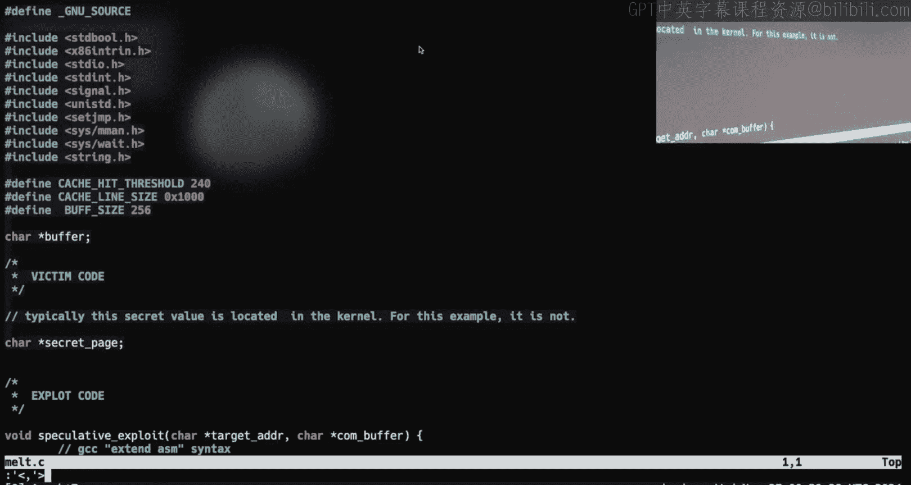

我来看看第14级，这样你们能看到。14级比13级更有趣。当我们查看挑战目录时，我们有一个内核模块和一个用户态二进制文件。当我们运行用户态二进制文件时，它甚至不打印任何东西，那太逊了。我告诉你们它做什么。它打开 flag，读取 flag，然后忙循环。这就是这个用户态进程所做的全部。

Meltdown 允许我直接访问这个进程的内存吗？我们说过 Meltdown 违反了当前的内核 supervisor 位。那么，我从麦克唐纳上校那里对内核了解多少？内核可以访问任何进程的内存。我该怎么做呢？`ioctl` 给了我一个原语，让我可以像从内核的任何地方读取字节，所以也许内核模块可以从这个进程的内存中读取 flag，然后我们用 Meltdown 从内核读回来。这是个合理的想法，但不是答案。我们还没看内核模块，我觉得对于这个传奇模块的最后一关来说，那太简单了。

## 内核模块功能分析

在内核模块里，我们有什么？设备打开，看起来很有用。它会给出 a0。在这一点上，我不太信任 IDA 对内核模块的反编译。我不信任什么？你怎么能不信任 IDA 处理内核模块？我震惊了。所以我们看到的 dmesg 信息是个好主意。我不记得是这个挑战还是另一个，但肯定有一个挑战，如果你手动查看反编译和 IDA，会有东西是空的。是的，IDA 会把它反编译成什么都没有，但如果你看汇编，实际上有东西在运行，只是 IDA 无法理解。有人说（我不知道这是否属实）Binary Ninja 在这方面做得不错。听说 Binary Ninja 和 Angr 管理得比 IDA 好得多。

所以，在这个模块中我们能做的是 dmesg 里说的：我们可以对这个东西调用设备 `ioctl`。根据我们传递给它的命令，我们将能够从用户空间复制，或者获取 PID 的 task_struct 地址。所以我可以给它 1，它会给我内核中 PID 1 的任务结构地址。那是 flag 吗？我们还能对这个东西做什么？上面还有别的东西，我跳过了。触摸一个内存地址。所以我们有能力触摸某个东西，因为这本质上只是一个内存访问。然后我们有能力获取任意进程的 task_struct。

## 利用 task_struct 进行地址转换

那么，关于 task_struct 我需要知道什么？它们很复杂，我承认。但我们在哪里能弄清楚它们是如何工作的？GDB 是一个地方。我想我在内核模块里深入讨论过 task_struct。是的，内核文档，虽然有文档。我相信它在某个地方有文档，但我找不到。但你能找到的是源代码。这是我们的 task_struct，希望我选对了，否则肯定有人会在 Discord 上指出来一年。从这里开始的某个偏移量，将是解引用虚拟内存的第一步。我添加了这个，所以有人指出，我真的应该在最后几分钟指出这一点。如果你从课程网站访问这个，我添加了延伸阅读。当我添加这个时，一个超级有用的链接是这个最后一个，这是 Secom La 这里一位研究生写的博客文章。Janan 谈到过有 CR3，然后有页表，我们做这个数学计算进入下一个页表，将虚拟内存转换为物理内存。这篇文章解释了那个内存管理单元如何工作。你可以从 task_struct 到达这个页表。

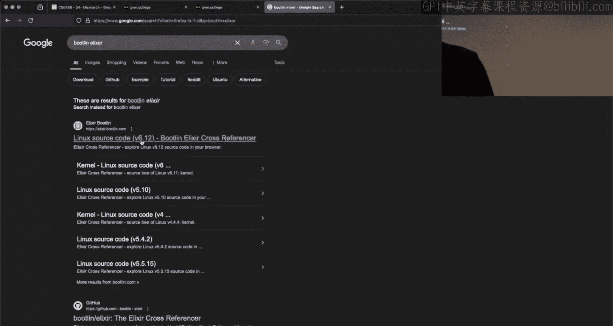

所以你的策略将是：获取 task_struct 地址，然后泄露页表，然后做一些数学计算，来获取那个持有 flag 的挑战的 PGD（页全局目录）。这将允许你将 flag 所在的虚拟地址转换为内核内的物理内存地址，然后从内核读取它。

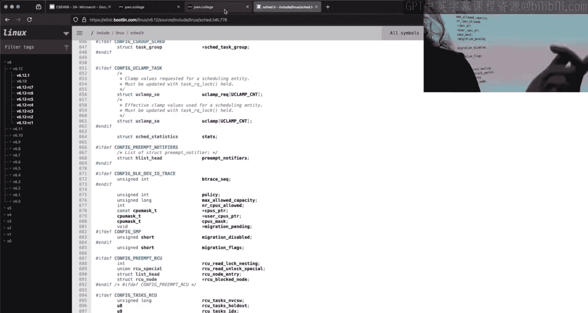

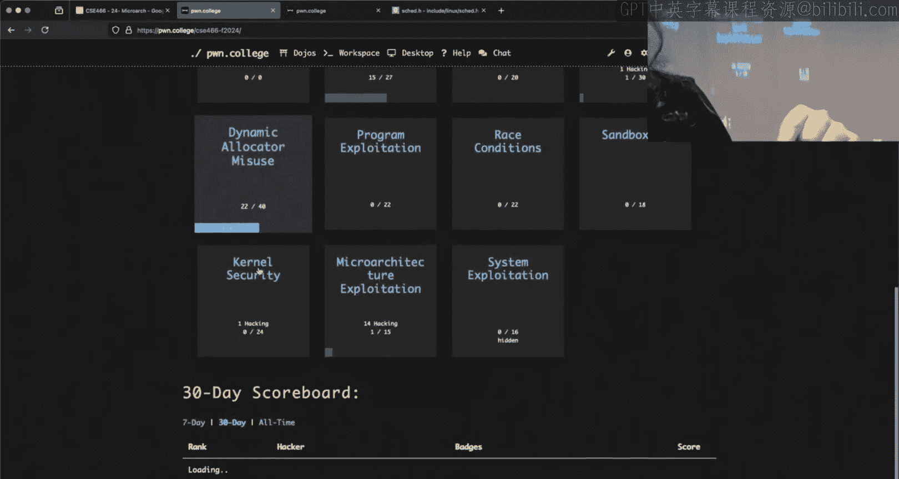

所以你必须编写 Meltdown 来利用内核，但你必须推测性地导航页表，以获取物理映射中的 flag。否则，就像你试图在内核模块中所做的那样，你从物理映射开始，然后就像，嗯，它在哪？但现在你必须推测性地、一次一个字节地做这件事。实际上，弄清楚它在物理映射上的位置工作量更小。这就是第14级的内容。30 听起来很多，但一旦你开始着手，根本没那么糟糕。第13和14级通常被认为比第11和12级更容易，有些人会说也比第10级容易。所以，如果你在尝试优化以获得更简单的解决方案，一定要看看它们。

## 课程总结

好了，就这样吧。Twitch，玩得很开心。希望大家假期愉快，希望至少对我来说，这周压力能小一点。再见，祝好运，周二见。

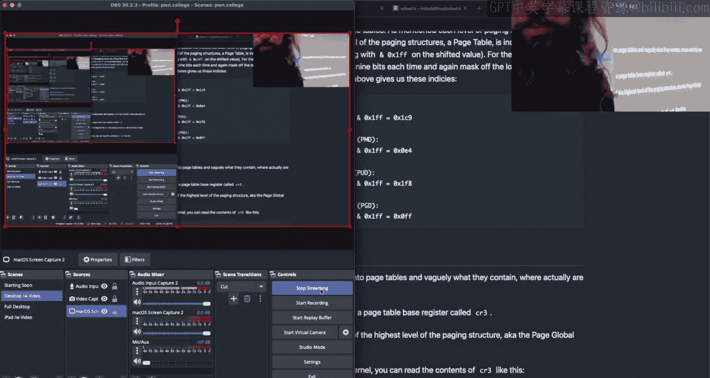

在本节课中，我们一起学习了微架构利用模块的核心，包括 Spectre V1/V2 与 Meltdown 攻击的原理差异、内核模块的交互方式（`ioctl`/`mmap`）、以及如何利用 task_struct 和页表进行虚拟到物理地址的转换以完成高难度挑战。记住，理解缓存侧信道、推测执行训练以及不同攻击所跨越的安全边界（进程内、内核-用户态）是掌握这些高级漏洞利用技术的关键。