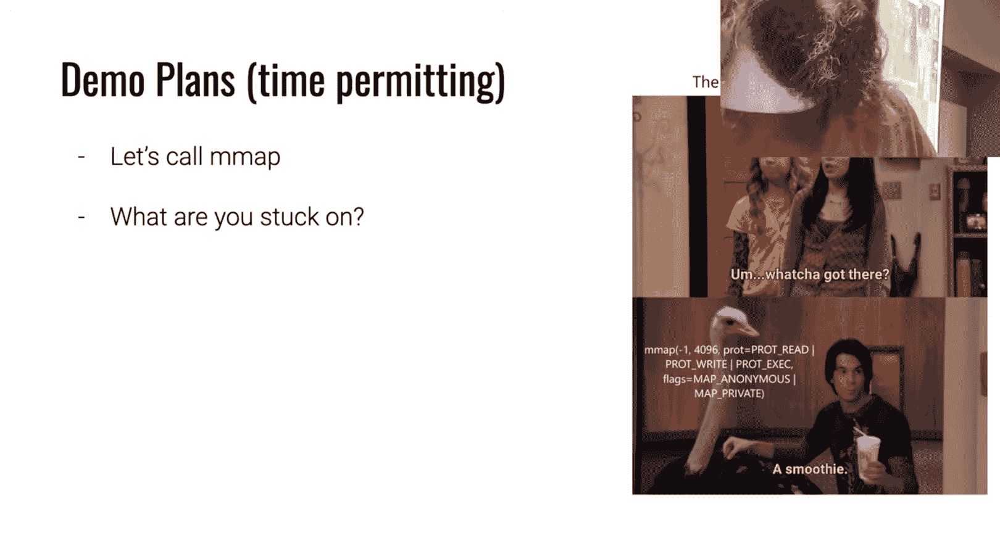
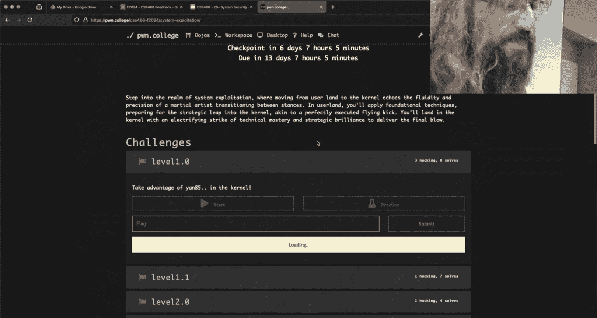
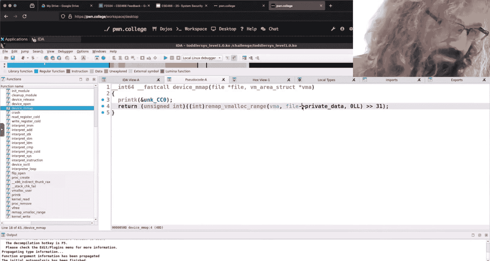
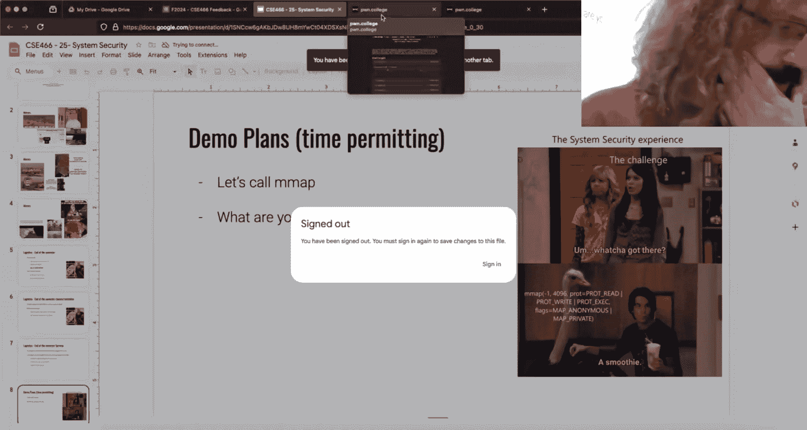
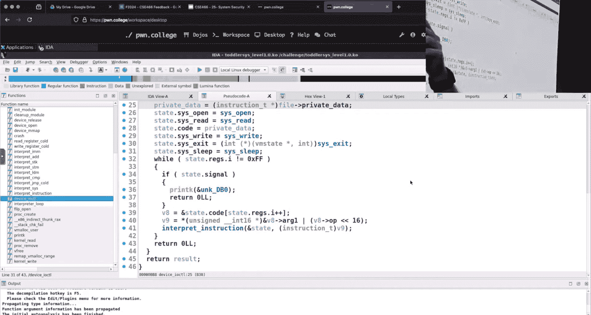

# 28：系统利用

在本节课中，我们将学习系统利用模块的核心概念，特别是如何通过编写汇编代码与内核模块交互，以及如何利用`mmap`和`ioctl`系统调用。我们将通过分析一个具体的挑战来理解这些概念。

---

## 概述

本节课我们将深入探讨系统利用模块中的一个具体挑战。该挑战涉及用户空间程序与内核模块的交互，要求我们通过编写特定的汇编代码（shellcode）来调用`mmap`和`ioctl`，从而在内核空间中执行自定义的Y86代码。我们将学习如何构建有效的payload，并理解相关的计算机架构概念。

---

## 课程内容

### 分支预测器回顾

上一节我们介绍了微架构攻击中的分支预测器。本节中我们来看看全局与局部分支预测器的区别及其在实际利用中的影响。

在微架构攻击中，训练分支预测器是关键步骤。通常，我们通过运行一个循环来“训练”CPU，使其在特定条件下进行推测执行。然而，存在两种类型的分支预测器：

*   **局部分支预测器**：基于单个内存地址处的分支历史进行预测。它通常被建模为一个**2位状态机**。
*   **全局分支预测器**：基于CPU上更大范围的模式进行预测。它可以识别不同分支指令之间的关系，从而影响推测执行的路径。

在解决挑战时，有时可以通过无限循环（如`while(1)`）来偏置全局分支预测器，从而避免在攻击代码中进行显式的训练循环，这可能会提高攻击效率。

### 课程目标与评分

本课程的目标是让大家能够理解现代系统安全漏洞的基本原理，而不是成为某个领域的专家。评分方面，所有作业均已发布，当前成绩单上的分数就是最终分数，除非你完成额外工作。通常，学生在最后一个模块不会投入过多精力，因为他们需要准备期末考试。大家应根据自己的情况合理分配时间。





对于累积性的挑战（如系统利用），它可能涉及逆向工程、Y86内核和shellcode编写。如果觉得当前模块挑战难度较大，回顾之前已发布的模块（即使只能获得一半学分）可能是更明智的时间分配策略。

### 期末安排与后勤


下周是期末考试周，教室安排会发生变化。因此，本周的复习课和助教答疑将取消。作为替代，我将在期末考试周的周二和周四的常规上课时间（下午4:30-6:30）进行两场线上直播。直播可能会在Discord进行，以便于更自由地讨论课程中的任何问题，帮助大家解决困难。

此外，学期末我们会为在CSE 365和CSE 466课程中获得腰带（belt）等级的同学举行一个授带仪式。如果你获得了腰带但不希望出现在直播中，可以私下联系我们领取。

关于课程评价调查，我将发布一个匿名的Google表单。为了鼓励反馈，填写调查的同学将获得**1%的额外学分**。你们的反馈对我改进课程非常重要。

### 挑战分析：Level 1

现在，让我们开始分析系统利用模块的第一个挑战。我们将逆向工程一个内核模块，并构建一个能与之交互的用户空间攻击程序。

首先，我们来看看这个挑战的基本逻辑：



1.  用户空间程序可以上传自定义的shellcode。
2.  内核模块会打开一个设备文件（例如`/proc/ypu`）。
3.  用户只能进行两种系统调用：`mmap`和`ioctl`。
4.  `mmap`用于将一段内存区域映射到用户空间，这段内存与内核模块的私有数据区共享。
5.  `ioctl`用于向设备发送命令。当命令号为**0x1337**时，内核会调用一个Y86代码解释器来执行映射内存区域中的代码。

我们的目标是：编写shellcode，利用`mmap`获取共享内存区域的地址，然后将我们编译好的Y86代码字节写入该区域，最后通过`ioctl`触发执行。

### 构建攻击程序



以下是构建攻击程序的关键步骤：

1.  **生成Shellcode**：我们需要用汇编编写一段代码，依次调用`mmap`和`ioctl`。我们可以使用`shellcraft`库来生成这些系统调用的汇编代码片段。
2.  **写入Y86代码**：在`mmap`调用之后，`RAX`寄存器会保存映射内存区域的地址。我们需要将编译好的Y86代码字节写入这个地址。与其手动分多次写入，不如在shellcode中编写一个循环来完成。
3.  **触发执行**：最后，调用`ioctl`，传入正确的命令号（0x1337），让内核解释并执行我们写入的Y86代码。

以下是一个概念性的Python代码框架，展示了如何组织攻击：




```python
from pwn import *

context.arch = 'amd64'
context.endian = 'little'

# 1. 生成调用 mmap 的shellcode
prot = constants.PROT_READ | constants.PROT_WRITE
flags = constants.MAP_SHARED
mmap_sc = shellcraft.mmap(0x31337, 0x1000, prot, flags, 3, 0)

# 2. 生成调用 ioctl 的shellcode (假设文件描述符也是3)
ioctl_sc = shellcraft.ioctl(3, 0x1337, 0)

# 3. 汇编我们自定义的Y86代码 (示例)
y86_code = asm_your_y86_code() # 假设这是一个返回字节串的函数

# 4. 构建完整的payload
# 首先，生成一段汇编代码，它包含：
#   a) 调用mmap
#   b) 一个循环，将y86_code的字节写入RAX指向的内存
#   c) 调用ioctl
# 这里需要手动编写或拼接这段汇编代码。

payload_asm = f'''
{mmap_sc}
/* 此处插入循环写入Y86代码的汇编 */
{ioctl_sc}
'''

payload = asm(payload_asm) + y86_code # 将Y86代码附加在shellcode之后

# 5. 将payload写入文件或直接发送给挑战程序
with open('payload.bin', 'wb') as f:
    f.write(payload)
```

**核心循环的汇编思路**：
在`mmap`调用后，`RAX`是目标地址。我们可以将Y86代码的字节串作为一个标签放在shellcode末尾，然后用一个循环将其复制到`RAX`指向的内存。

```assembly
lea rbx, [rip + y86_code_label] ; 获取Y86代码的地址
mov rcx, 0                      ; 计数器清零
mov rdx, [rbx + rcx*8]         ; 每次读取8个字节
mov [rax + rcx*8], rdx         ; 写入目标地址
inc rcx
cmp rcx, (len(y86_code) / 8)   ; 比较是否完成
jl loop_start                   ; 如果未完成，继续循环
```

通过编写这样的循环，我们可以避免手动硬编码每一个字节，使代码更健壮和可维护。这正是**利用编程技巧简化复杂任务**的体现。


---

## 总结

本节课我们一起学习了系统利用中的一个实际挑战。我们回顾了分支预测器的概念，讨论了课程评分与时间管理策略，并详细分析了如何通过逆向工程和编写混合shellcode来与内核模块交互，最终实现代码执行。关键点在于理解`mmap`和`ioctl`的用法，以及如何用高效的汇编循环将数据写入内核共享内存。