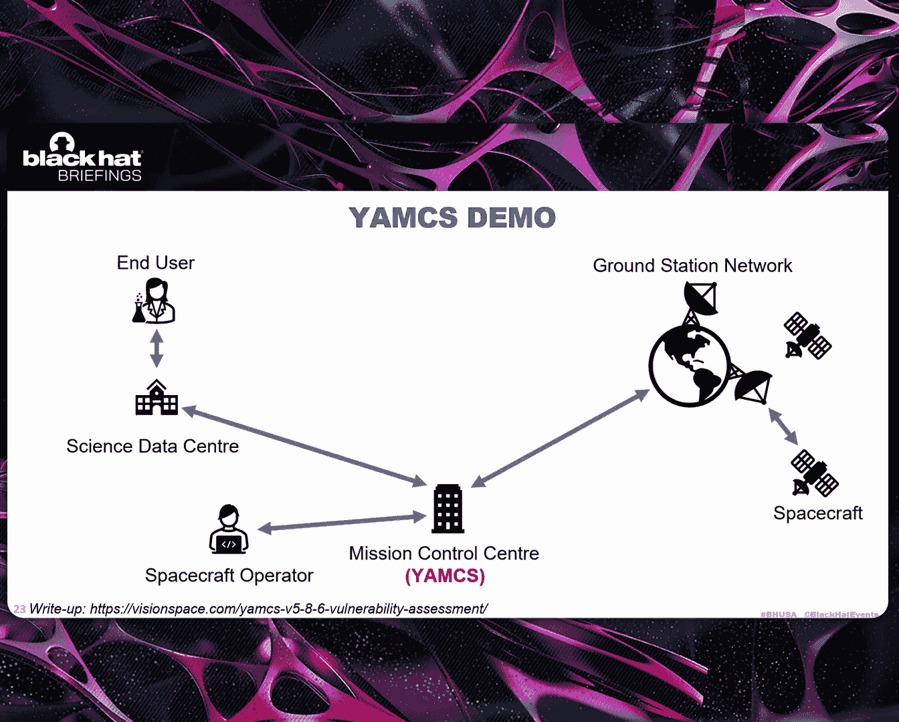
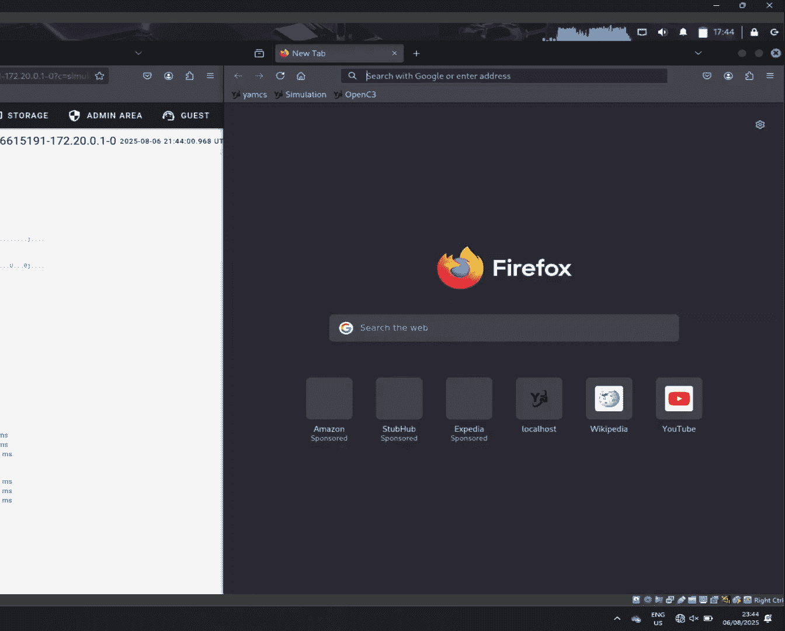
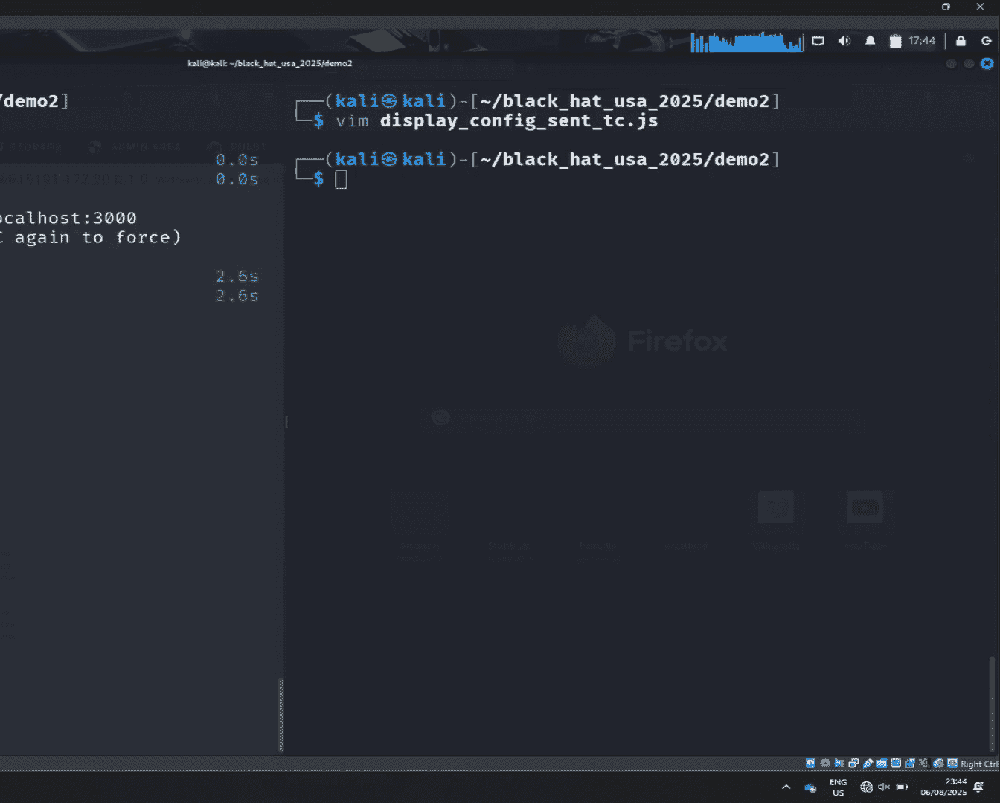
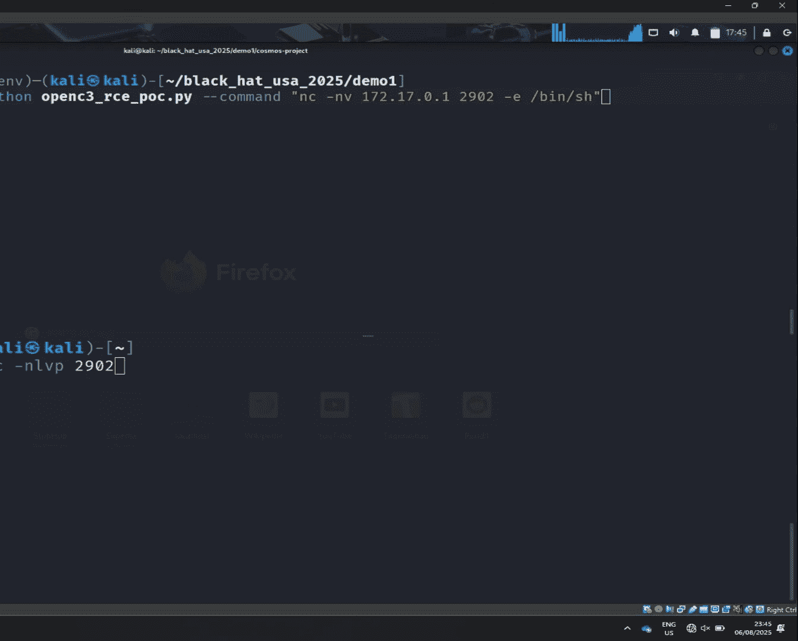
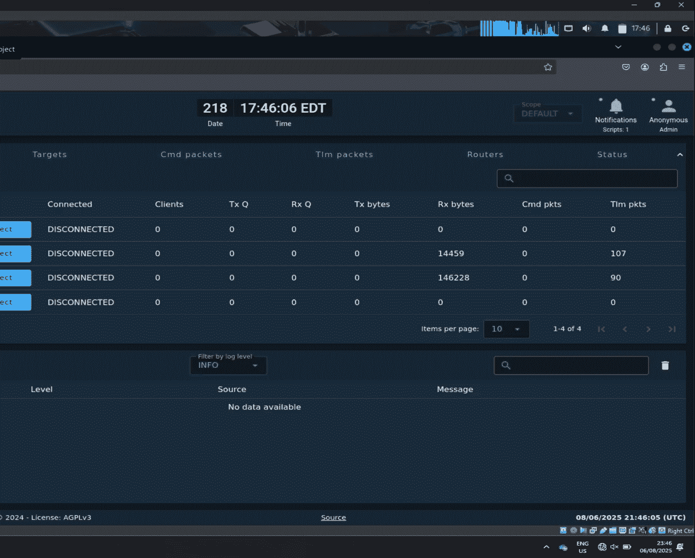
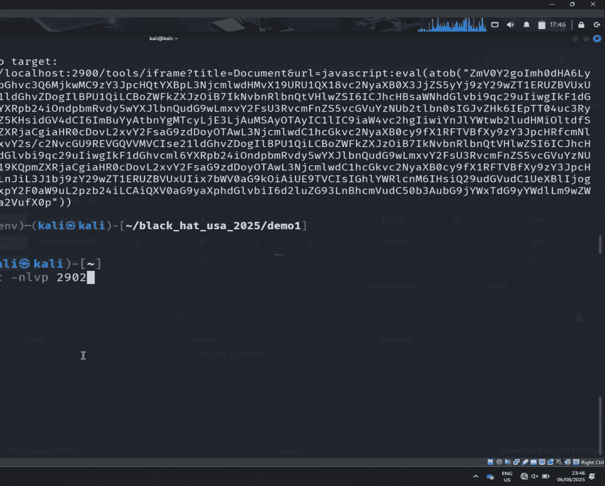
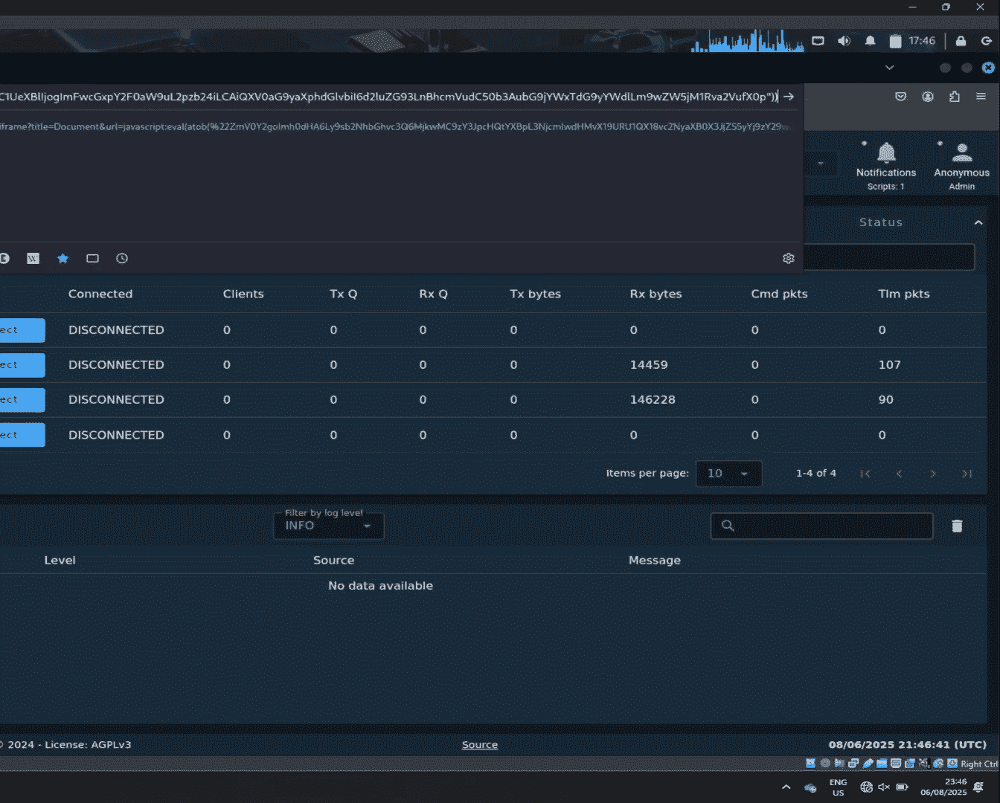
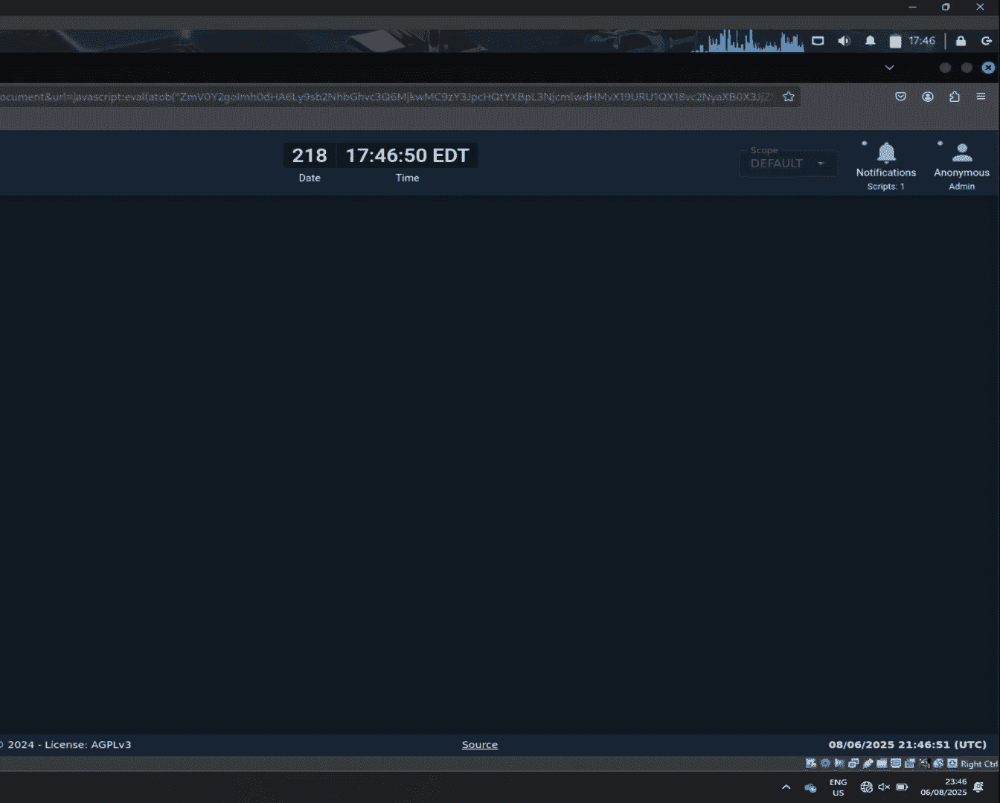

# A Collection of Vulnerabilities That Will End Your Space Mission [uLZab4pe4X0]

So yeah， thank you all for joining in when I talk about space system vulnerabilities。

 It's our first time here at Blackhead， and it has been amazing so far。

 So thank you all for joining in。😊，Quick wrote about the team。 So I'm Millan Co Staric。

 I'm currently heading the cyberse section at Vision Space。

 a small company in the space and defense industry， Im joined today by my colleague Andre。 Yeah。

 my name is Andre。 I've been working for the company since couple of years now and prior to that I used to work for the European Space Agency。

For more than a decade。Yeah， also today in the room to people without those who this wouldn't have been possible。

 So Ricardo also in the Fris row and also Aman also here today from our research team。

So why are we talking about space systems and space systems have been in the media currently quite a lot。

 And there is a reason for that。 So we saw satellite launches to the orbit。

 So usually first observation or telecommunications satellites pretty heavily during the Cold War period driven by the defense industry and then it slowed down a bit around the 2000s。

But now in recent years， there has been an explosion of a number of satellites launched into the Earth orbit。

 and this is primarily driven by commercial satellite constellations like Staling， pretty popular。

 but also one web， for example， where there's a huge number of satellites being launched。

And next to that， there is a second trend。 There is a remilitarization。 So actually。

 the defence industry。 So governments are launching more and more missions。

 again for intelligent intelligence gathering， but also for communications。And something that is。

Again， happening more and more is a dual use。 So， for example。

 Staling's terminals used on the front line in Ukraine。

Coupled with these large numbers of assets in orbit。

 This means that there is a very high a surface with very high value targets now。嗯。

So stepping stepping back a little bit， we looked at what has been done already on research in the field of space systems。

 and so we looked especially now here at Blackhead。

 and actually we found the the earliest talk we could find was satellite hacking for fun and profit。

 which is actually still very fun to watch。 So from 2009。😊。

And this continued this kind of research until like 2022， where it was focused。

 mostly on user equipment， so satellite terminals。Then 2022。

 there was a breaking point when there was the Viassad incident。

 so this was at the onset of the Russian invasion of Ukraine when the day before they actually launched a cyber attack against Viassad and turned down tens of thousands of modems of the company。

 and then the year after here on stage， there was actually a talk by the Viassad VP together with the NSA on how they did incident response on that。

And so our question our research was what was happening since and what are fields that have not been looked into too much And to explain this。

 I want to step back a little bit and explain you how a space system works。

 So on a very high level you have， of course a spacecraft So this is the most obvious part can be multiple。

 for example， in the constellation you might have dozens of hundreds or thousands of spacecrafts。

 then you have the ground segment。 So this is all the terrestrial infrastructure supporting the space mission for example here depicted by ground station antenna。

 but there is much more this is just the visible part， there are also mission control centers。

 there's science centers there's all kinds of supporting infrastructure， fiber networks and so on。

 and then there is the user segment So this is what comes out of the mission for example。

 user terminals with a stalling terminal this would belonging to the user segment but also data products that are produced by a SAR mission for example。

So an example science mission might look like this。

 so you have a couple of spacecrafts in orbit communicating over a ready frequency link with your ground station network。

And you have your emission control center linked up to that。

And then that is distributing actually data to the science data center。

 which is doing some post processing， refining the data。

 and supplying it to the end users or scientists in this case。In order to control the spacecraft。

 you need some operators， so this is not fully automated。

 you still need very much humans in the loop， so teamss 247 working on the operations of the spacecraft and especially since COVID there is a lot of remote work happening。

 so traditionally this parameter based security is no longer the case and the systems that have been built for this perimeter based security are now exposed to the internet and to new threats。

哎。So inside the mission control center， that's the heart of the mission。

 there is a lot of IT infrastructure and a lot of custom software which is developed to support the mission to automate things among this。

 for example， astrodynamic software to calculate where your satellite is where it will be。

 but also mission planning software to plan the future steps。

 what you want to do with your missions from for example。

 from inputs from the science community and then there is mission control software。

 So this is what actually the spacecraft operators will use to control the spacecraft So this is the human machine interface。

And for that， we looked into some open source software that is available， which is pretty popular。

 so there's， for example， YaMCS， which is used for a number of smaller satellite missions。

 but also currently being planned to be used for Lunar Rovers and is used for the European robotic arm on the ISS。

 there's NASA's OpenMCT， which is used to control Mars Rovers。

And we also looked into Open C 3 cosmos， which is also gaining popularity among smaller satellite missions。

On the other aspect， we looked into spacecrafts， so again， mission reuse。

 so things that don't affect just one mission that don't just affect one operator。

 but could affect multiple and here the most popular software framework is again from NASA。

 it's the core flight system or short CFS， which is for example。

 used to build a small satellite missions has I think over 20 years of legacy already。

 but it's also used to build payloads for the James Webb Space Telescope， for example。

 and is currently being qualified for human spacef for the Lunna Gateway。

Another thing we looked at is F prime。 That's a small framework also from NASA。

 which was used to control the ingenuity Mars helicopter。And I A T core。

 which is a small toolkit to build Python applications to run on the I S S for experiments。是。

So what traditionally meant， let's say， in the 80s。

 90s destroying a satellite was actually launching a rocket at it。

 and this is what many of the big space farring nations have shown。 So the US， China， Russia， India。

 they all have demonstrated that they can do this。 They have the capability to actually shoot down a satellite。

But what we found is that actually， you can have a much easier time if you combine and change some vulnerabilities you find in the software on ground or on the space segment to actually take down a space mission。

And this to be said is that water is red。 So as we said。

 a lot of this softwareer has a lot of legacy。And traditionally， it was not designed for security。

 The developer didn't have requirements to implement strict security。

 to implement zero trust into the software， to make it ready to be exposed to the Internet。

 to have someone connecting to a VPN and controlling the spacecraft。

 This was never a requirement when these guys develop the software。 So naturally。

 once you start looking into these， you will find vulnerabilities。 Also some very low hanging fruits。

And yeah， so my colleague， Andy， will now show you some of these。 Yeah。

 so what you're gonna see now are a couple of demos showing different vulnerabilities。

 different attack vectors and also different ways of exploitation of different exploitation techniques。

But in principle， what we want is to take over control of a spacecraft。

Or a system that is controlling the spacecraft。So we will start with showing a little bit about of EMC S and its functionality is it's a mission control system。

We spacecraft operator refuse to control the spacecraft。

 and it's it's vulnerable to among other things， one of the vulnerability is to is an excess。

 which actually give us。As adversaries an opportunity to dis arbitrary command to spacecraft。

So since it's an excess to pull this off， we have to fish a user with a user file。

And together with XS exploitation， we will actually be able to send a command on behalf of the user。

So what you will see on the left hand side is the Yams mission control system。

 is a standard mission control system with a bunch of functionality that any other system would have。

Like processing telemetry and displaying the telemetry， sending telecommans and so on。

And on the right hand side， for the sake of demonstration， we have created ass simulationimilation。

It's it's a spacecraft orbiting low earth orbit。And the simulation is。Much faster than real time。

 So we can actually see the results of our activities。Now。

 E M C S comes with very useful functionality， which also lets be put lets the users to define。

Say engineering values based on the raw parameter values or any other functionality within the system using JavaScript。

And actually， this is the component， which you can see on the left hand side is this is the component that is vulnerable to。

 to un exercise。And also for the purpose of the demonstration， we have defined a telecomman that。

Once it's triggered a spacecraft， it will trigger the。

Orbit transition maneuver to the medium error orbit。And so in principle。

 you will see the spacecraft moving higher to the higher orbits。So this is the command。 And we're we。

 we are not gonna send it now。 Instead， we're gonna have a look how we could send it using the excess S。

So as I mentioned before， the Y C S comes a scripting functionality。

So this is an example of a file that comes VM C S。 It doesn't really matter what it does。

 ors what matters is that。It is possible to embed a payload within H T as tag， which then。

Once the script is loaded， it actually is gonna execute。And it is not encoded。 so then we can。

 we can actually see what we are doing。 And our goal is to send。

This telecomman to the spacecraft through the API， which NN provides。So let's let's load the。

Scrt。So imagine on my user， I received the file from one of my colleagues。

It could be our internal fishing campaign。So what I'm going to do， I'm going to load the file。And。

I'm just gonna open it。So you should probably notice right now that the spacecraft started deviating from them。

From its original orbit。But it's not， it's not clear what has happened because even if you。

 if you know what exactly this code does， there is nothing suspicious in the code。 So the payload。

 which we saw before， is not visible here。 And that's because。

This particular component doesn't dis the H TM tax at all。 It is hidden。 However。

 the web browser actually executes the。Exeeccuted them。 And then therefore。

 the jascript was executed giving us the。S the telecomman to spacecraft on behalf of the user。

 And the only way for the user to know that this has happened is to either actually see。

The displaycraft moved away from the from using the telemetry or in the command history。

Where you can see now to the Commonwealth center。

So that was that was demo number one。

Let me stop it。 So I have resources for the next one。

Okay， so the next one is another mission control system， Open C 3。Among other vulnerabilities。

 it also it it is also vulnerable to an excess。But in this case。

 we will be able to take her take over the entire mission control system we will get or will attempt to get the remote code execution on it。

With one simple access。And again， because it's on excess， we focus on the on the space operators。

 as our target of， of a fishing campaign。And once the user goes to the URL of our of of， of。

 of the phishing campaign。It should give us a reverseersal buck。

To the system so。Let me start it first。

嗯。是。Just give it a second。

Okay， so open history。 this is how it looks like。It comes with similar functionalities to the previous one。

 You have a telemetry capabilities， tele the commanding capabilities。

 It also comes with a script running engine。Which will， will also take advantage of。

I'm gonna gonna go through， through the functionality。

 the exploitation of this exercise is a little bit more tricky。Because it's multi stage。

 it requires us to make multiple calls to to the API backend。

The first one is to grab the session tokens， which will then use to。To， to。

 to deploy demo Malishious script and then eventually trigger it with one of the last calls。

And so we decided to make a script that will let us that will generate the URL with our payload and the。

 the， the function which want to or of the command， command， which we want to execute。

And this is the URL。

We would fish our user with。

So I'm just gonna copy it。I'm gonna start our listener。

那对你冒证按妈。A a user that file for theion campaign。

I went to the URL。 I see my mission control system， which looks like nothing has happened， but。

啊，需要。We just got a reversal back to the system that is running mission control system。

W whichch is open C 3。So。啊。有为。Okay， so that was the second demo。Yeah。

 lets stop it and go to the next one。

可以。So next up is the this， this one is gonna be a little bit different because we are not targeting ground systems at all。

 We are gonna。We are tru。 We are going to target the us spacecraft directly。

So imagine you are a nation state， you have access to your own ground station。And mission control。

 And let's assume that you are with visibility of the spacecraft so we can actually send some data to spacecraft。

 And then also， let's assume that this spacecraft is running as an over software is running the older NASA CFS or core core flight system on software。

Yesish。So again， with the cS， we'll try to get an RRC to the spacecraft directly。

For the demonstration purposes， we're gonna get a reverse shell back。

 but that might not be practical。 You probably want to do something else。

And the way we're gonna do that is to target the with some mal data。

 We're gonna target the memory management module of the CS。Or the weaknesses of that module。So。ok对。

Start the simulation。Now， this is， this one is a little bit more advanced。It is also multi staged。

 and it's， it requires communication between ground station and the spacecraft back and forth。

Because we're gonna send some telecoms。 And then we're gonna。

 well have to leak some information from the spacecraft from the memory。嗯。

The memory management module of c S。 So the the main issue with that module was what was was that you could write or read or write memory within the memory space。

 not only of that module， but。Of the entire process。Running CS。

 And because C S is running on a Linux based operating system。

 you can imagine there is many different things you can， can do to actually abuse this witness。

What we're gonna do now is or what we decided to do in our research was to tap into the global offset table。

Grab the addresses of the functions of our interest。

And then change those addresses to what we want and then execute。 So in our research。

 we found out which based on certain telecoms， we found out which CPU instruction is gonna use is gonna be executed next or which column。

To the function is gonna basically the next。 and we are gonna replace that address of that function with the address of a function of our interest。

So because again， again， it's it's， it's a little bit complex。

 and it it requires communication back and forth。We have developed a script that will take care of the whole communication with the spacecraft。

 And in the end， it will let us execute this just for the sake of the riverers shellll。

 just for the sake of demonstration。So I'm gonna start the the listener。

So we are linking the memory addresses from Liipin。

And now we are dumping the content of the memory of spacecraft looking for the address of M C HRR function。

 because our intention is to replace that memory that address with。With the system。

 because we want to have a code execution on the spacecraft platform。

So once the telemetry comes down and we get the address in a couple of seconds。

There is another telemetry。 So okay， here we have leave the memory address。

And then with telemetry with， with telecoming， we have replaced。

 we have overri the global offset table at spacecraft。With this function。 and then eventually。

 the function was executed， giving us USL。To spacecraft。 So that was the last demo。

And a presentation over him。真实。All right， so to summarize。

 we just showed some of the vulnerabilities， but we found actually a lot more so in Open C3 cosmos and EMMCS。

 but also in open MCT。And what was especially concerning was not just that we found some XS。

 but we found actually higher critical vulnerabilities in all of these systems。

 so prototype pollution in open MCT， which which is ja based in YmCs。

 we could get arbitrary file deletion on the operating system and on cosmos。

 we could get remote code execution and actually take over the containers running the system。哎。

And the same goes on for the onboard software， so we have the coreflight system with a number of vulnerabilities。

 but also there is cryryptolib， which is actually a plugin for the coreflight system。

 which is built modular， and so this is an extension which allows you to encrypt your telemetry and commands so the data that you're exchanging with the spacecraft and also to do authentication and key management for the sessions and we found actually vulnerabilities which allow you to crash the entire onboard software with an unauthenticated telecomman that you send so basically you send a packet to the spacecraft and the entire software crashes and reboots。

which then actually causes the cryptolib if it's not properly configured to reset all its keys。

 and then you have some all zero keys on the spacecraft that you can use from that stage on。

Also F prime， we found some vulnerabilities where you can actually do remote code execution。

As well as AI T core， which was using pickle for some networking。So again。

 here we have the same game， a lot of high and critical vulnerabilities across all of these systems。

And sure enough。 So we published all of this over the past years。

And so this got some attention from other researchers as well， which is great。

 but you always just wonder why you haven't found it in the first place。嗯。

So worth to mention is especially about cryptolib， so someone else found out that how you can actually bypass the authentication mechanisms and how you can corrupt the key base on the spacecraft with using that software。

And even more， there was also some memory problems inside that library。

 which led to some high critical vulabilities on the system。So what are our final thoughts。 So。

 first of all， this was all found in open source software and the space industry is 99。

9% closed software， so。Our question is what is， what is to be found there and what we would like to see is also some more rewards for researchers。

 So we've done this on the side， but it would be nice if there would be some incentives to actually do this kind of work for the missions themselves。

I think what would be interesting would be for them to look a bit more into the security safety tradeoffs。

 because especially when you look into authentication for spacecraft and pickup mechanisms。

 because you cannot fly up to your spacecraft and recover it easily。 people are very。

 very cautious about adding too much security to their mission and there needs to be mitigation strategies for mission that's already up there。

 that cannot be properly maintained。And there need to be hard decisions made。

 What happens when you have an insecure mission and you cannot fix it。

So we think that while space is hard， space security doesn't has to be hard。

 there's a lot of traditional IT security rules and best practices which can be applied。

 but still need to be rolled out。So was that to say that water is wet。Even in space systems。Yeah。

 thank you very much for joining our session。