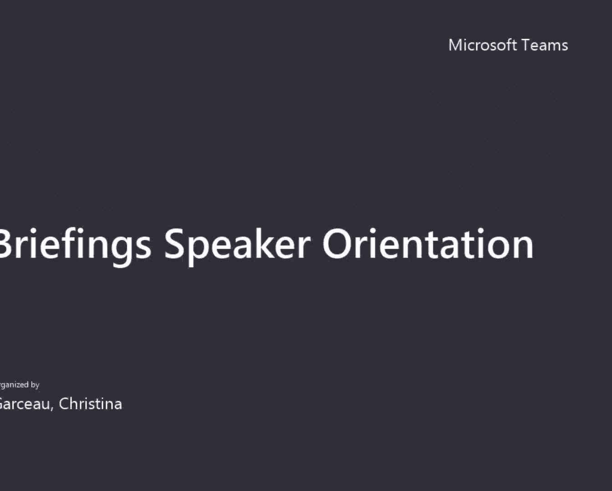
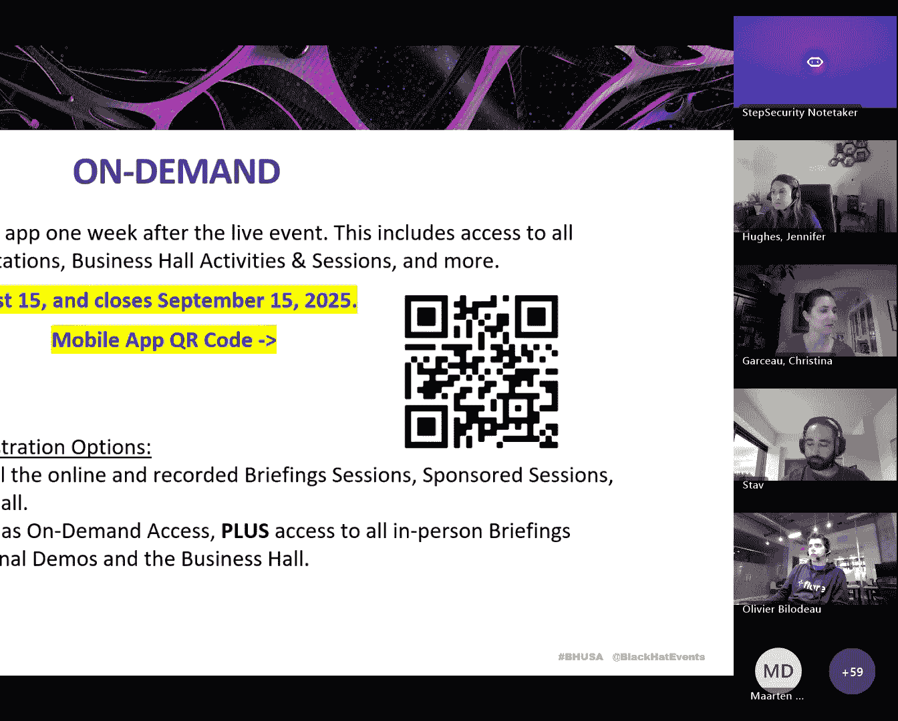
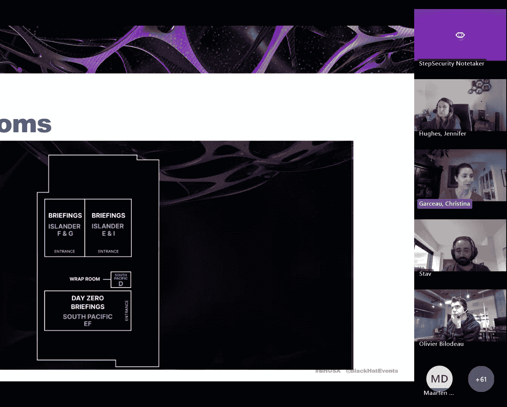
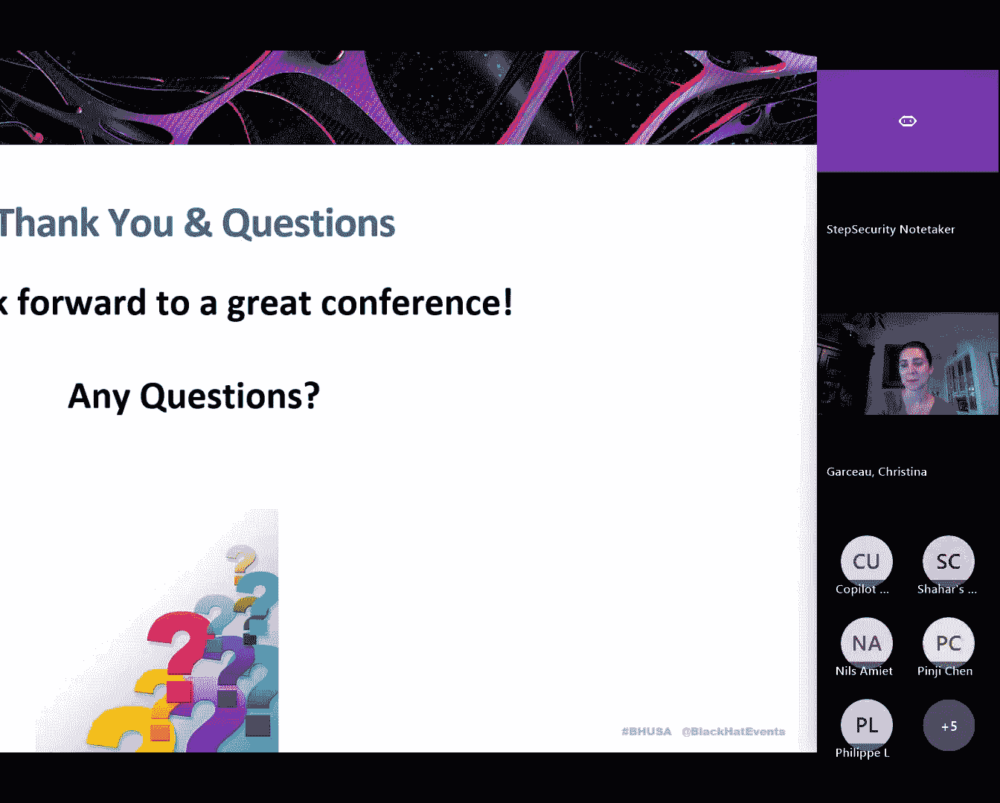

# Black Hat Briefings Speaker Orientation- Meeting Recording [ePB3TcCb3e8]

So first， we will start off by going over the virtual platform that is the mobile app。

You just go in your app store and search blackca events。

 the app is now open so you should be able to see the content in there。And you'll want to register。

 or you'll want to sign in with the email that you gave me to register for the show。

Then we will go through venue schedule， travel， badge pickup up， speaker rehearsal， speaker Center。

Our briefings， our parties and some presentation tips， and then we'll have a little short Q&A。

So once again I'm Christina and then Jen Hughes and these are our mobile numbers。

 you will want to put them in your phone because it's very important that you will let us know if you're running late for your session because we'll be searching all over for you if not。

So please put our mobile numbers into your phone， stay in touch with us and keep us updated on site。

So just a few speaking tips to start off with， we like to do what's called black hat sound bites。

 which so at the end of your session， you'll just throw in some key takeaways for the audience。

And then our presentation structure， obviously we don't want you to read directly from the monitor。

 but if English is not your first language。We'd rather you do that than struggle through the presentation。

so you want to give your audience a roadmap of what you're going to be talking about as you get started and then at the end once again we like to have the black hat sound bites。

Please make sure your font is big enough so that everyone in the back of the room can read your slides。

We will have additional screens towards the back of the room， but it's a very large room。

 please do make sure your font is readable。And then we'll go ahead and move forward。

Important your company logo is only permitted on the first slide and your last slide。

 whenever we say first slide we're not referring to your title slide。

 so it's your first slide after your title slide。And this is important because these are not sponsored sessions。

 these are editorials， so we're not here to promote our companies。So one week after the event。

 the recorded version of your session will be available in our mobile app。Once again。

 you can search that in your app store， black hatt events or you can scan this QR code on the screen。

The recordings will be available in the app for one month。

 so on September 15th the app will close you'll no longer be able to view the recorded sessions。

But you all are registered with a briefings pass， so you have all of this content available to you for one month。

So this is just a peak at what the mobile app looks like。

 you have all these tabs at the top and then you have some tabs on the bottom。

So you'll log in， you got access to it yesterday， so again use the email that you we registered you with for the conference。

If you need to make a new password or if you've never logged in before， you can select new password。

This is if you need a new password， this will be the page that you requested。

It will be a button called Send me a Mag link。Just some FAQs update your contact details whenever you go in there and your meeting availability so it's kind of like linkedIn where people might want to make a connection request this could be other speakers or just attendees that are interested in your session and want to get together and meet。

So you'll never want to turn your visibility to off。

Because that doesn't what that does is it hides your session so that people won't see your session in the app and so if you just don't want to talk to anybody don't turn your visibility off because。

That's not quite how you accomplish that。Once again， go in and update your contact details。

This is what it looks like to update your profile。So updating your profile and the app does not update your information on the web if you need to make any changes to your information on the web。

 you'll have to let me know and I can make those updates for you。

So this is very important whenever you go in， we want you to go to your profile immediately and remove your personal address because this has been transferred over from your registration。

And if anyone wants to make a connection request with you and you accept it。

 they will see your personal home address， so you probably don't want that visible。

 so go ahead and go in your profile and remove that。And once again。

 just some screenshots on how to access your profile it's in the top right corner。

 then you can hit edit。And then you can view the attendee list。

And then the meetings tab is how you will edit your availability。

And you'll be able to see meeting requests that other people send you。

This is just a slide over how to send a connection request。

Justcode to their profile and click S connection Re。And then same for the meeting。

 it's a pretty intuitive platform， but you need to review these slides to kind of get a feel for it then。

That's what they're here for and then again here's the QR code to get into the mobile app and then you can also put this link here into your browser for the web version of the app too。

So now we will go into the event venue。We are at Mandalay Bay。

Here are some links for the briefings and the track meetups。

 the business hall and all of its activities， our features， arsenal in the business hall。

 we have trainings， however your past does not cover trainings。

AndThen then we have summits on Tuesdays and your past does not cover summits either。

 but if you purchase a past to summits， then there's that information。

The track meetups are something that we started last year so this is where you go in a room and you can meet with a review board member to discuss that topic specifically they are the experts and then you'll also be surrounded by likeminded people and it's for fostering networking and connection and so we're going to have just a policy track meetup this year but there's one on each day at 1020。

On each of the briefings days， so Wednesday and Thursday。

There are currently no health and safety guidelines。

We are beyond the era of the masks unless you want to wear one， and some of us do。Airport。

 Mandelay Bay is extremely close to the airport。It's you can basically see it from there so that is great you can take an uber or you can rent a car and then there's also information for how to park at the convention center if you do rent a car。

these are just some directions over to the convention center from the hotel lobby。

And then again per speaking team we cover one room at Mandalay Bay so three nights Tuesday night Wednesday night and Thursday night and so that has all been said and done hotel confirmations go out from our housing team approximately a week before the show。

If you are having housing complications， reach out to me immediately。Now badge pickup。

 this is the very first thing you do whenever you get on site because you need this to access anything in the event。

So here's the information we have a main registration desk。

And then we have a satellite registration desk and that is in the Mandalay Bay Hotel lobby。

That one is open late， it has different hours， we'll go over that in just a sec。

But bring your QR code that is in your registration confirmation email and everybody should have one。

 if you don't have one， let me know and I'll just get you registered。But again。

 bring that QR code because you're going to scan it to get your badge and also bring a photo ID。

And then these are the hours for registration， I'll be sharing these slides。So。

You'll need to quickly take screenshots or anything unless you want to。

Because you're all going to get a hold of these after the call。

So if you indicated if you modified your registration to include a DCO badge， which you can do。

 so if you want to purchase a DCO badge as well， go into your registration email confirmation and modify it。

 click on modify registration and you can add on your DCO badge。

And you can pick those up at the Black hat event， we'll have a desk to make that a little bit easier。

So that is the information there。These are the briefings rooms。

 we have them on three different levels， level zero。

 which is the North Convention center and it doesn't say level zero anywhere in the signage on site。

 it will say North convention center。But we sometimes refer to it as level zero because it's the basement level below level one。

Level two so level one has the business hall we don't have any briefings on level one so you go up to level two and then oceanside c Oceanside D you can see the names of these rooms i'm going to show you a map too。

And then on level three， so we have level zero， North Convention Center， level two and level three。

So this is a map of the lower level。or just a map of where the black hat items are so we have two briefings rooms。

 we have a wrap room which is where you can go after your session ends for attendees who still have questions or who want to follow you over there to continue talking about your session。

And then day zero is Tuesday evening， so if you're coming in Tuesday and time for day zero。

 you'll want to come to that。

Then we'd move on to level one， no briefings on level one。

You can see the keynote is in the arena center， which you access from level one。

It's called the Miallib Ultra Arena。And then that is our business hall。

 and you can see that the main registration desk is right in front of the business hall。

And the business hall has a ton of activities， as you can see。So this is level two。

 this is the main level where most of our event is taking place as far as you guys are concerned as far as briefings。

So you can see where those room， those briefings rooms that I mentioned。

 you can see where they are indicated on this map。I can just scroll over here。

 so we have briefings in Oceanside D right over here。

 we have briefings in Oceanside A over here and in Oceanside C。Oceanside B。

This is Black Hat Boulevard， we have our dark Read news desk where podcasts will be recorded。

You can walk by those to watch。Right here is going to be this huge window space that's where we have our merchandise store。

Over here， we have then。And our speaker center is actually going to be located。Right here。

 right next to it。I'm going to need to add that to this map。

 but we will go over that in just a second。And then here is level three。

 where we have two more briefings rooms。Three more briefings rooms。

And this is what our schedule looks like in a nutshell on Wednesday， August 6。

 we'll have six blocks of sessions with nine sessions per block。

We'll have two keynotes and two main stage sessions。On Thursday， August 7th。

 there will be five blocks with nine briefings per block。

 there will be five keynotes and two main stage sessions。

And right here is the link to the schedule so you can view everything in detail。

We have a bookstore on level two these are the bookstore hours there will be various author signings happening and this is the tentative schedule for the authors that are going to be coming。

It is almost final， but it gives you an idea of the timeframes where you will see authors where you can stop by and purchase a book to get signed。

We have a mother's room， a daycare， and a prayer room。Um。It is on level three， the mother's room。

And then our prayer room is also on level three。Level three kind of is a little bit of a quieter level。

 so。The daycare， these are the hours， but you need to register ahead of time and the link is here at the bottom if you need to use that resource。

Social media for X formerly known as Twitter。You'll just do at blackhead events。

The merchandise store， as mentioned， these are the hours。It gets very， very popular in there。

AndThen we have our sustainability pledge。We go to links to try to reduce waste and you can visit this link to see our efforts there。

Okay， if you have a guest that you would like to bring to your session。

A guest what we refer to a guest is someone who will come to watch just your session and then leave the event basically we don't give them access to any other part of the event but we will get them a badge printed so that they can just run up to your room and watch your presentation and then leave afterwards they don't have to pay anything for that so that deadline has closed but we can grant some rare。

Um。We can grant some you can send me just contact me or Jen and。

We can help you if you have someone who is last minute in town that you didn't realize。

We won't turn them away。The speaker rehearsal room is in SurF A。

 this is the booking link so you can go ahead and reserve a time。

We have 30 minute blocks for you to sign up for and then on Monday of the event you can go ahead and reserve a second block if you feel like you need more time。

 but we just like to give everyone a chance to book the room it stays pretty busy in there。

It is next door to the speaker Center， which is where you will be reporting 45 minutes before your session starts and that is in SurF BC。

I'm going to drop that in the chat。45 minutes before sessions start。Report to surff。BC。

 this is the speaker center。You will be escorted by a speaker liaison to your session。

So you will come to the speaker center， our liaisons will identify you。

And then about 20 minutes before your session， they will personally walk you over to your room。

And it's very important that you report to the speaker Center 45 minutes before your session start or else we will begin texting you and looking for you。

So here is our speaker center information SurB， this is on level two。And then again。

 you'll be assigned your speaker liaison。So this is very important。

 please report to the speaker Center。45 minutes before your session starts。

then I sent a personal invitation out， but I just want to reiterate again that we have a reception on Tuesday night。

It is from it starts at five o'clock and it's going to be just in the level three window space。

And I will reiterate that information for you。Right here。There you go。

 so you will all get to meet each other at the reception Tuesday night and then you will all see each other in the speaker center on Wednesday and Thursday。

So AV equipment you will have。A laval layer mic， so it's important we get to our session room 20 minutes before start time so that our text can identify you and help you get your slides set up。

 give you your laser pointer， show you your confidence monitor。

 which is the screen on the floor that you can see when you're on the stage that no one else can see you can have your speaker notes for you or your slides for you to to view so you don't have to turn around。

So come ahead of time so that we can get you all prepped。

Oh and I I do want to reiterate we every year there is always somebody who has a hard time getting their slides to show and our AB team is always able to help them so just don't ever go into crisis mode our techs we've we've worked at the same company for several years and they're amazing。

And they're very comforting， so whatever issues you're having。They they can help you if you forgot。

 you realize you forgot a power cord or something they usually have。

All kinds of alternative cordords。This is the Wifi information。

But do not rely on that to play a video or surf the web in your during your presentation。

We do not have hard line hookups in the rooms， we need you to embed your demos or your videos into your PowerPoint presentation or bring them on a thumb drive。

Do not rely on the web browser。So the wrap rooms are where you can continue discussing your session with attendees after your session ends because we do need you to leave the room promptly when your session ends because we have another one getting set up。

So there will be aisleL mics for attendees to stand in the aisles and ask questions。

 but sometimes you know， there's still a line and you can continue those conversations in our wrap room on level zero。

 the room is going to be South Pacific D。And on level two， we have a wrap area。

 it's just kind of a large open floor space and it's outside of oceanside D。

So attendees will be asked to scan their badge as they enter the room to view your session。

 they will then be sent an evaluation and so they will rate and comment how they felt about your briefing。

And we will send you what they say。We'll send you a report of your overall score。

 how it ranks against other scores and some specific attendee comments。

Those come out usually about a month。Or two after。The event。Food and beverage。

 so breakfast is in the。Miello Ultra arena outside of the keynote room。

Lunch is going to be on level one in Bayside D， it right by the business hall。

And then we also have coffee breaks in between sessions on each of the briefings levels。Again。

 just be sure to wear your badge。So our parties and our special events。

We have day zero on Tuesday this is basically just a big networking opportunity we have various activities and people speaking in tables to visit so we we always look forward to it we'd love if you can make it。

And then directly after day zero， you can come up to level three for the speaker reception。

We'll have lighter des and drinks。And then directly after that。

 we have the VIP party at borderorder Grill no plus ones and definitely be sure to bring your badge because that is we have a capacity there so Tuesday is very busy if you fly in in time you can attend all three of these events。

And then on Wednesday， we have a booth crawl in the business hall。

 which is where different booths will have drinks and you can visit each one and then the welcome reception。

Presentation materials will be made available to attendees after your session and this is how they can access them。

 they go to your session on the web and go down to presentation slides。

Please send me your slides just as soon as they're ready because I have to read all of them and manually upload them。

So if you have them ready， just send them to me and please name them properly according to the naming convention that was specified in the email。

And make sure they are in PDF format， please。And try not to send me multiple copies if you can just because。

I might get mixed up and put the wrong copy up so if you need to make revisions。

 I would rather you wait and send me your slides later than sooner。

So go ahead and program our phone numbers into your phone here is Jen Hughes number。

I'll put mine down here。There you are。Make sure you have your laptop you're going to bring your laptop with you we're going to hook up your laptop we do not have laptops on site for you to use we might have a couple in the case of an emergency but bring your own laptop and your own equipment。

Any questions？I'm going to take a look at the chat。

In the nope I do not see any questions in the chat will we get a copy of the slides yes。

 I will send out a copy of these slides。There's a lot of information in them。Yes， j。Hey。

 I just wanted to reiterate just a couple things while we wait for questions。

 a couple things for our speaker， if you can make sure that we have your correct mobile number and if you're based outside of the US the best way to reach you Whatsapp。

 etc， there are a few things as nerveracking as being a few minutes before your session and being notified the speaker isn't there and then we find that we can't get in touch with you so if you would do us that favor and make sure we have an accurate。

Mobile number that would really help us just in case something happens and we do need to track you down and we also as Christina mentioned asked you to arrive in the speaker Center 45 minutes before the session that might feel like overkill but we do that for a very specific reason we have a lot of conference associate who will be scheduled to walk you to your room and introduce you to the AV team so we have a running schedule each speaker is assigned to a different liaison and they're actually going to walk you to your room。

At the appropriate time， as you can imagine the halls at Black hat are often very congested so it can be hard to make it quickly from one room to another so there is a method to our madness So if you would help us out and just show up in that speaker center on time and check in and then you'll also have a few moments to kind of gather your thoughts before you go on stage and it just helps us because then we know we don't have to track you down also as Christina mentioned we have an amazing AV team but it happens to probably at least one to two speakers。

 every black hat and that's that your laptop is working fine until all of a sudden you get to Vegas and it has stopped working it won't power up or it won't connect to our equipment in the room because of security settings etc we can help you but please just make sure you've got your presentation on a USB so you can quickly just hand it to the AV team and you have printed speaker。

It's that way if we if you can't work from your own laptop and we have to give you another laptop at the back of the room with the AV team。

 you're set and you won't have any stress we just want to make sure you're prepared with a plan B just on the off chance that it happens to you so those would just be my big tips that I wanted to call out。

Well said。Pdf slides that's only for what you're submitting there's a question in the chat they don't you don't have to present PDF slides。

 you just want to submit those so that attendees can't edit your content。

Later deadline for the slides， so you can submit your slides at any point。

I just can't guarantee that I'll have them up in time if you send them past the deadline I they will they will become on they will be posted for attendees to see。

You can even send them after the event and i'll post them for attendees to see we would just try to mine the deadline if you can I understand that you need to make last minute revisions and several people work that way so just send them to me whenever you can and i'll get them posted a lot of the time i'm able to get them up in time but sometimes i'm not so I just can't make that guarantee there are no age limits at the parties there are not you can be under 21。

That is fine。You can be under， you can be under 18， that is fine。They just won't let you drink。

 You could have all the food you want。😊，Okay， I did missed any questions？

And Christina and I usually hang out just for a few moments in case you had a question you didn't want to ask recorded and in front of the whole group。

 so we'll stay on if anybody has anything else to ask。Oh。

 I've got corrected on the single session past deadline you're correct， yes。

 it is you can still send me your requests。Um， on site when people start requesting this on site。

 oh no， I didn't know my grandma was in town。Those are more difficult， we can make it happen。

But just keep in mind that it is it's a strain， it's a strain on the team。So yes。

 if you need to bring a guest if someone's in town， please go ahead and submit those requests。

If you can't find the link to the form， just send me an email。Alrighty。Well， it's a huge event so。

Any questions？All questions are welcome。And thank you for coming。Thanks， everybody。See you soon。

Thank guys。Thanks。Thank you。

