# Booting into Breaches： Hunting Windows SecureBoot's Remote Attack Surfaces [p4EXzE0dvWE]

Hello， good afternoon， everyone。 Thank you for coming to my talk today。 Today。

 I'm going to talk about my Windows secureable bug count journey。

 What's make the bridge to boot into How do I found this box。

 And what should a normal user do to keep your safety。😊，I'm Andrew Youngang from cyber Kun。

 a new generation cyberspace security company that focused on software and system security。

 I've been passionate about Windows operating system for years and began my journey as a Windows security researcher four years ago。

 to that I was a versatile C T player of any type of challenge。 This is my first time speaking that。

 It's a pleasure to be presenting at this stage。 Well first with some background information such as what is What says my research apart from previous studies and Ill introduce my approach to reduce duplicate reports based on and introduce some basic knowledge to understand the vulnerabilities in both load。

 Then we dive into multiple attack surface where I found vulabil and key studies for the attack surface。

 After that， Ill tell you how I manage to set upuzz framework in environment。 and will then say。😊。

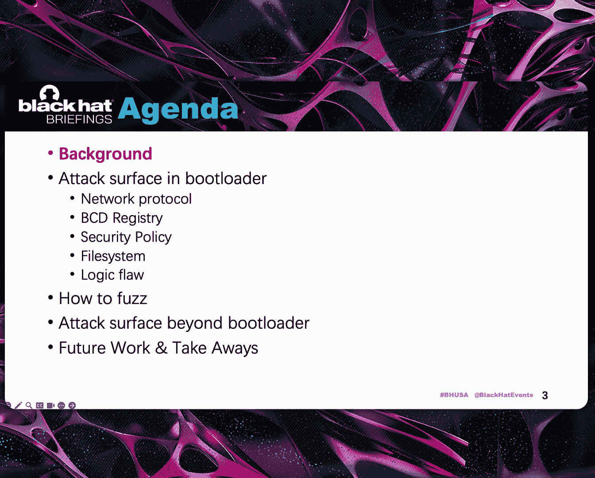

What a surface beyond the boatloader。 Finally， iss our summary and takeaway session。😊。

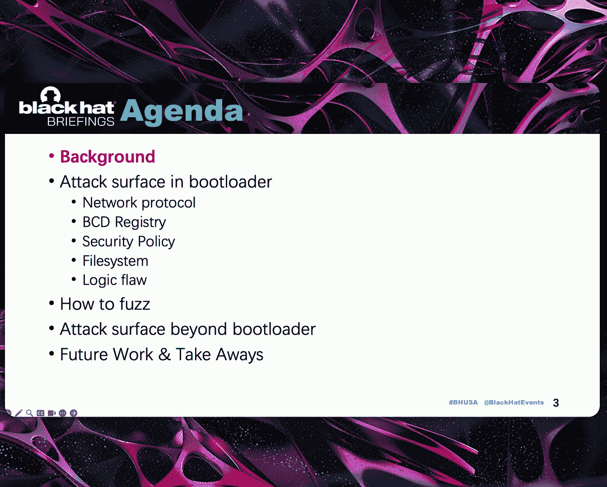

Before we dive into s technical detail， let， let me share why this research began。

A security researcher， were are instantly drawn by uncharted territories。 And with those secure boat。

 it was a perfect storm of three three factors。 The throne of unknown foundational importance and the reality factor。

 This combination made it attractive target。 A you contrast， both process itself。

 no higher security matters。😊，So secure boat， to my understanding。

 is using digital signature and th to establish a chain from trust from the hardware to O S。

 You can see it area from mobile phones lockout implementation such as ibo and late kernel various of implementation lock the device to only run the Windowss trust code。

 which often is the boat loader and operating system right by the hardware window on PC platform。

 the O S vendor is often not hardware vendor with U E F standard。

 It can bring secure boat feature into PC platform。😊，Mile。

 mobile phone is much closer to our daily life and hold up more of our privacy data。

 So you can see every mobile phone has secure boat by default。

 It's too important that if you trying to break the secure boat of mobile phone。

 it will alert you that the phone cannot be trust in Windows operating system。

 there are small features required the secure boat to be enforced recent years。😊，But to be honest。

 there are still long way to go for PC platform。 as there are too many hardware manufacturer。

 It's hard work to let every hardware manufacturer devote effort into it。Returning to our top title。

 boating into secureable bridgees。 So what makes the breaches。

 The first thing you need to know is that all my findings were still exploitable by default right now on PC platform through network。

 This is mainly because PC A 2011 third is default in U EF I standard and used by countless motherboard manufacturer and virtualization platform。

😊，It won't get expire until 2026。 its predecessor is already deployed on Windows machine through Windows update by default。

 but the PC to 2011 is not added into blacklistva because of compatibility issue。

 which Bill from M M SRC explained in last year's lack head talk。

And there's also less limitation on the U E F I blacklist bar。

 So all these conditions enable the first breaches for these window secure vulabilities to be exploited。

 the time breaches。😊，Let's give a glance at previous research on Windows secureboard。

 You can see that they primarily focus on a task service that require local or physical access to the system。

 And in past 10 years， there's only 8 C Es about Windows secureboard。

 Qui small number compared to other Windows components， right。😊，And in this only8 C E list。

 there's two famous are with its own name。 The most famous C Es are two used by black lotus。

 Boke Moware。😊，Here's a public C acknowledge list issued by M SRC to my finding。

 You can see that my finding are really large volume compared to previous research。

 and they are expable through network。 So today， I have found nearly 60% of secureable secure feature bypa in Windows operating system in last 10 years。

😊，Sometimes I look at my research and wonder， does this actually matter。 Is it making any difference。

 Then I say feedback like this。 And I remember why I keep pushing forward。 The right here is a few。😊。

Why are these vulabilities can be explored through network Here。

 I bring you an your attention to a particle named PE， the prebo exc environment。

 The PE is a standardized plant server model enabling network boot。

 unlike the9 vulabilities identified in the Pix field I talk discovered by co。

 The vulabilities found in my research are easier to exploit with their complexity。

 not very based onware vendor。😊。

So with so many secure feature bypass vulnerabilities， you must have questions。

 What are these vulabilities about M S RRC explained to me that before secure boat。

 Microsoft doesn't acknowledge vulabilities in both loader with secure boat。

 Bo loader issue can get a C V E。 So secure boat is a secure feature of Windows。

 So window vulnerabilities in secure boat secure feature bypass。 So it can be remote。

 It can be without user interaction。 It can be pro。

 It can be remote code execution or information leak， but it can be now of service。

 They don't think it's a security issue。😊，So about the impact of my finding。

 it could be used to attack most of PC with U Efi circuitboard enabled。

 regardless of the operating system running on the platform。But in real world cases。

 primarily its Linux and Windows。 Usually， these two system will need reboott quite often。

 and theres many environment leveraging disk environment， which use PFC as default option。

 That environment is under real risk by default risk。 So the attack could be bring by B Y O B。

 bring your own boatloader。😊，Here's the summary of my research result。 During research period。

 I have submitted 55 reports to M3 detailing various vulabilities identified within Microsoft cur。

 You can see from the chart that by finding method。

 theres were a total of 35 cases found by code audit and 20 cases found by fuzzing in terms of a task surfaces there were 25 cases related to BD registered processing。

16 cases related to the file system。 and 6 cases related to network protocol。

 And there are five cases happening in Windows kernel。😊，The my search。

 the first challenge I had to address was how to reduce the duplication of my submission。

 My approach was to consider this from the developer's perspective。 First， I would find the bug。

 Then I would attempt to write a father to make the discover through fundinguzz。 And finally。

 I would conduct how patching on the vability。😊。

If the hot parkinging was successful， there should be no more cases related to the same root cause。

 I would repeat these steps until no more crashes could be generated by the father。

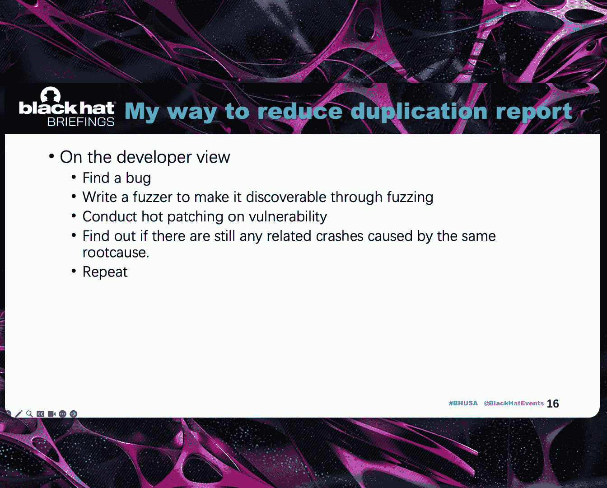

Before we dive into the attack surface， there's one k piece of knowledge。

 We should remember before we exploring future work on boatloader。 The hip management in bootloader。

 There's no page he in boot loader compare to that in Windows user line。

 that means it will not crash as soon as the O B access happen。 Instead。

 it will crash the next time the corrupt data is used。

 or when the hip management code does garbage collection。😊。

I was very surprised to find out that the hip corruption reporting function itself has a self recursive issue。

 but it's not important because the sex overflow won't make a hip O be right easier to float in theory。

Also， you need to know that the block is at least 32 in beds andied at 32 beds。

So let's go to our next session。 today， the touch surface in both loader。

We begin with an introduction to network protocol in the bootloader for my network protocol are used。

 including IPV 4 6 T S code H TP and WD S multicast。 during my research。

 I found that the protocol stack is the most secure part of theloader。

 I have only found six vulabilities in theloader protocol stack。

 This include two stack overflows in the Ploader when DPV 6 response packets1 recur calling when processing TFTP。

 One recur calling during longch self reloading and one internal underflow when processing H TP response inloader。

 Additionally， there is a denial of service vulabilities I a moderate severity and IPV6 protocol stack from this denial of service it can be said that the Microsoft bootloader IPV 6 code is not yet ready for production。

😊。

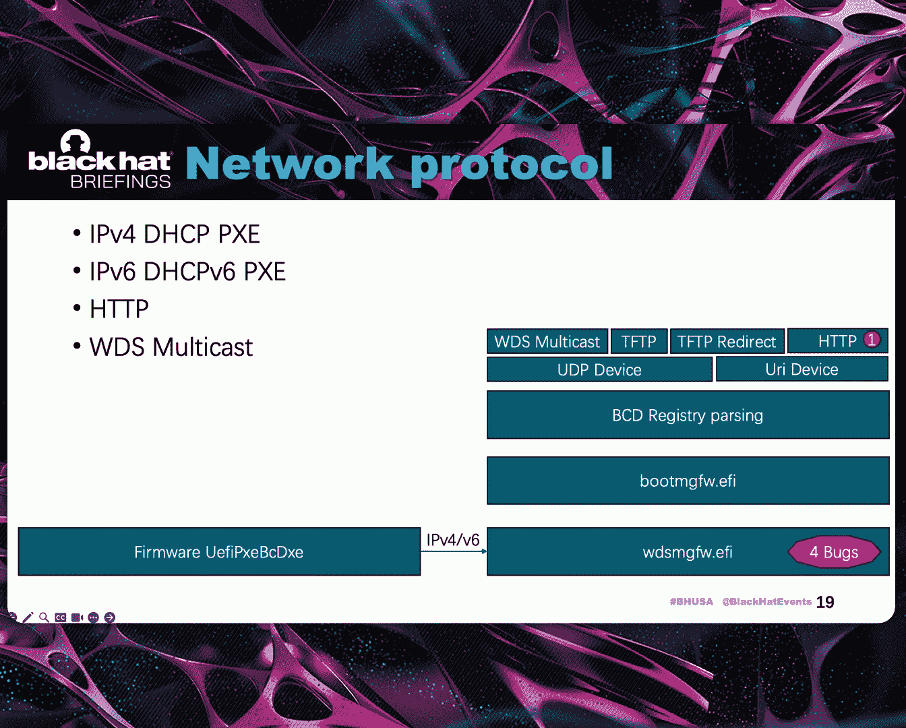

This picture shows you the IPV 4 PE both stage。 And this picture shows you the IPV 6。😊。

I have been working on implementing this drawing into Python code for a few hours。

 It is a very good starting point for research reference in the boot loader v。😊。

Before we starting looking into the actual case， we need to build an easy to reproduce environment for the research。

 Happer is definitely your good friend for vulneril。 hunting。

 as it is the only one that can generate mini dump without needing to hack the virtual machine。😊。

It also support IPV 6 PFC boating on Fware。 After 3 for documentation。

 it is easy to find a guide that shows you how to use powersha to specific IPV 6 for PFC boat selection。

😊，You can see that the mini dump generation code is in the VMWP process。

 If you want to implement a full dump or make it work in K。The same work needs to be done。

 I haven't done that because the hyper mini dump is good enough for the research。

 You can obtain a very detailed sta for the vulabilities。 along with a possible low cause analysis。

 the mini dump can be helpful in many cases， but it it usually won't work when the bonds overr only affects few beds just after hip block。

😊，You may also prepare a VM VR E S X， I environment。

 as VM VR is a leader imization in the real world。Now。

 we are going to see the real vulabilities in boat loader。

 starting from a simple stack overflow in the PC boat loader。

The root cause of these two vulnerabilities is that the function fail to detect the client server identifier lens is too large。

 While the destination array is only 16 by s。呃。It is then override the variable on the stack of parent function。

 So this is very simple case， very old school style， Yet it presenting both order for very long time。

 So I think the things we can learn from this。 is that you need to make sure you haven't miss any components when you look into a task surface。

 By the way， there's no vulnerabil only stick to PE both load before。

 So select a target that hasn't draw everyone's attention is important。

 You probably can find easy bug in it。 And there this can earn you confidence。

 And I think this is the most important thing when you do the research。😊。

Successful exploitation of these two vulabilities will allow the attacker to control IP and some other registers。

 The attacker could then initiate R O P。 We will discuss why this exploitation is so easy in the later session。

😊，We have just discussed network protocol。 And next。

 we are going to talk about BD element processing mobility。

There are two talks about BD registry in Oflow before。 So let's be brief。

 BD is a registry hub that can be allotted and added by Reg edit。During my research。

 the father had only found one relate to the restry file structure。 is O be right in this function。

 Again， it's very old school。 probably most of you know that ju from project0 has found a very large volume of registry vulabilities in Windows kernel in recent years。

 but restry in both loader is much simpler。 It does not support main features in full version of Windows registry。

 It's just a simple configuration store please。 but a dumb father still can find things in 2023。😊。

In registertry for my personal code in loader， this is amazing。

 I won't look into register person code manually。 That's too complex for my level。😊。

Those are two called BD edit， which can generate various object templates。

 It's very useful when you are planning to hunt for bus in the B D registry。😊。

The usage for BD added is not fully documented。 There are some real usage that you can only find。

 and I understand by reverse engineering the B D I code。During my research。

 I found that the BD element pages on this website are really helpful。

 You won't want to miss this material If you truly want to dive deep into researching BD element processing code in boot loader。

In the bootloader， there are a key structure called Bo environment device。

 which reflects the inner binary data of BD registry element。 through reverse engineering。

 We see that the binary format data is checked during unpacking。

But it seems like the content of banner is not fully checked。

And there's a key type for the both environment device category。 The B， L device type。

 iss a lighthouse for your research in BD element processing code。

 Remember this type by your heart and take it with you as we move forward。😊。

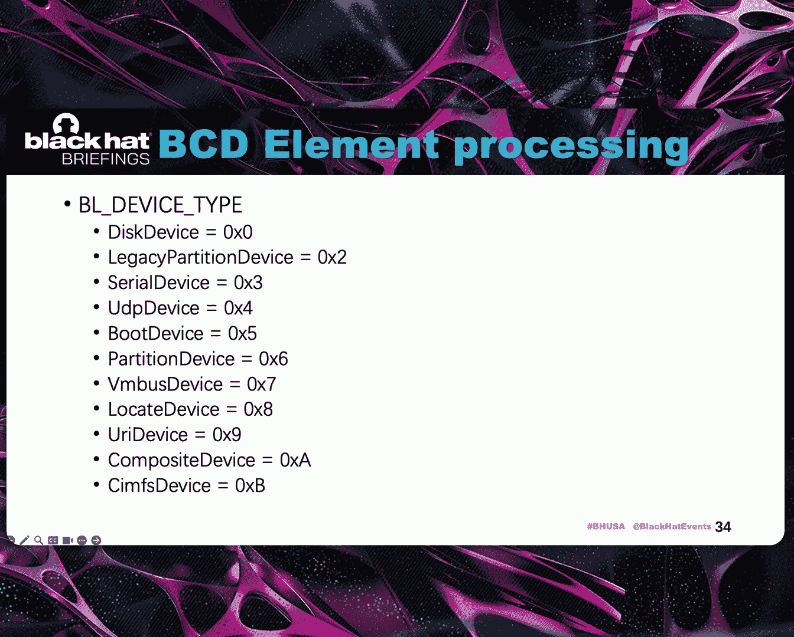

There's an amazing function while theyre processing data from BD registry。

 Why it's amazing from its name， you can see that it should be designed to eliminate eliminate the illegal device objects from attacker control data。

 However， this function itself is too valuable。 It has only had 100 lines of code。 And I。

 I have found six vulabilities in it。😊，This include two stack overflows。

 which can override the return address，1 arbitrary memory right and three hip O B right。

 So the dumb father generate the first crash in the function and I reverse the function and find another two vulnerabilities and reported to it to M at very early time of my research into both load。

 actually， at the beginning of my research into BD person。

 I don't realize that it is the standard right binary data in the half file that can be added by red edit。

 So in front of me is a do muted result。 It's a mess。

 And based on that the data you can modify it very limited。 I think about one month later。

 when I can't find more in both loader。 I realize that the data can be modified by red edit。

 I came back and to see if there's other vulabilities inside this function。

 And I found three more hip O B right in it。😊，But M SRC told me that this three report is a duplicate of an internal report。

 and that internal report gets CE2024 to 61，75 a。 In fact。

 this CE is acknowledge and fixed in April 2024。 they clarify that they have implement design level change to address them all。

 So I ask being deep。 Where does the engineering team implement this design level change。

 And I got two different function name with 88% called similarity。😊，So here's my thought。

 Maybe the engineering team has changed the function name before I report 3 half O B case。

 And when they receive three half O B reports， they can't find the function name I report anymore。

 So they explain to me that they are already fixed by a design level chain。

 but this is only my info because Im reporting this case in 2023 and the C E3 is in 2024。

 I have no idea when I was told it was duplicate。😊，From my previous introduction。

 you can see that these vulabilities are simple。 You。

 you need only to add boundary check to defend them。

 It's too simple that the engineering team won't miss it。 Here's came another idea。

 What if they don't know the three report root costs from beginning。

 So I tried the to run the O B right P O C on the patch boat loader it did trigger the vulnerabilities I report。

 It trigger the hip corruption， as you can see on the screen。😊，After reporting this to M SRC。

 I receive a and reasonable explanation for the case duplication。

 I'd like to specifically thank the M SRC star for their work through throughout this process。

 I think this the most important thing we can learn from this is that if you have large volume of vulabilities in same component。

 be very careful when the patch release。 Don't be lazy。 just try your O T O C upon the patch patch 1。

 I think if I review the I review at the time the patch release。

 Perhaps I can have more C E in the list。😊，The two BD added is only a hint and template for most of my submission。

 When you dive deeper and try to exploit more complex vities， BD added will be beyond its ability。

 Here's another example of this situation。 Its root cause is a recursive call when emulating the element。

😊，Regarding the recursive calling， theres something important you need to know。

 unlike userland recursive calling， which usually result a denial of service in usererland in the U EFI environment。

 it is highly exploitable vulnerabilities。 You should aware of E D K2 U EF I stack memory layout before you see into exploiting stack overflows into boat loader。

😊，In in the standard indicate2 memory model， the red ball memory before the U EF I stack is2 twice the size as that in hyper way in hyper from。

 although it shares the same stack size as that in U EF I standard。

 there appears to be a gap that is not rebel before the stack memory region。

 There's no guarantee that the memory before the stack memory is not rebel in U EF I definition。

 So this will change a recursive calling into a stack out of bounce right。

 and this all be right will have the ability to override the interrupt stack or some key variable in U EF I environment。

😊。

Resulting in a highly exploitable vulability。From this image。

 you can see that when a recursive calling happen in both loader。

 it finally over some key variable in the U EF I environment， causing another access violation。

 right。😊，I would appreciate your patient if you try to。

 try to exploit these P vulabilities manually to expose these vulnerabilities in standard。😊。

Memory layout， you need to include 415 device object in BD registry file。

 even in the halfway step memory model， you need to include 226 device object。In this case。

 I'd like to emphasize that the， the importance of writing a program that can help you make your life easier。

 because the BD registry itself is a registry。 You can load it and modify by the registry API on Windows。

 You can simply write a program that like this to test the crash boundary of the recursive calling。😊。

Additionally， there's another protocol issue consider here。

You can only specify the bootloader using H DV protocol by leveraging a specific BD element。

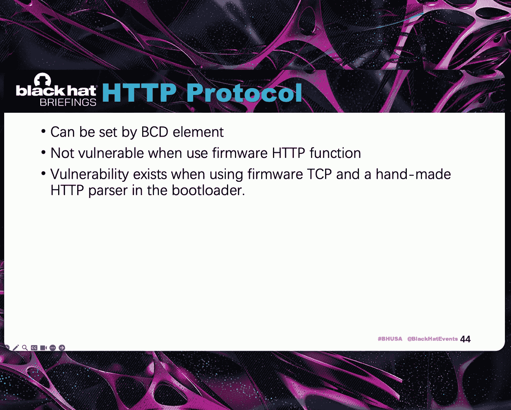

Most vulabilities are oriented around assumption that the data should be at least a certain lens。

 which is not correct。 In this case。 You need to check the attacker control data against the assumption。

Okay， we've talked too much about BD element processing。 Let's move on to security policy。

 That's a very interesting publication document for of Microsoft's presentation on U E F I Pla iPhone 2 sentence。

 which are very important。😊，As you can see from my previous side， the last sentence is incorrect。

The attack could be carried out by B O B， bringring your own boat closure attack。So the de policy。

 is related code it still exists in latest Windows loader。 It seems just like what backdo。

 which only with valid Microsoft sign policy can exploit。

 I can somehow understand why this is by design。 when you can have the ability to send everything correctly。

 Why not sign a boat loader directly。😊，The other one is the only secure feature key bypa keys I submit during my research。

 What I mean is that it is not a memory corruption。 It's logical and easy to exploit。

 This exists because the bootloader fetch fetch the boot manager P file for verification from the boot device。

 The P E file is already loaded in memory when excluding the code。

 Yet they fetch the fetch that again when the boot is initiated by P boot。

 The remote server cannot be trust。😊，As it can provide a valid image for verification and an invalid image for real run。

 the similar talkal cases did exist in other product like mobile phone。

 but it requires more restricted environment to exploit。 So everyone makes mistakes。

It's very important to see other research before you really want to take a look into similar components。

Last year， Bill from M S RRC bring us this question。

 He says file system is paradise for those who love redfauzz and asked why expose so many file system by default。

 But today， we are not going to talk top this unnecessary file system。

 We are only going to talk about very necessary system for both loader to work in modern windows。😊。

The W and N T F S and provide some funding tips for the file system。😊。

This is another magical example with name fixa in its function name。 Curly。

 we found6 R C Es in a function name with sanitizing in its name。 This time。

 I had identified five R C Es in this two function。 Both have the keyword fix in its name。 Again。

 they they are very old school and not very hard to discover。

 We really take your time looking into the correct function。😊。

These findings all begin with a dumb father for file system in both loader。

on reviewing the result list， it turns out that the father is better at finding and generating denial service case other than the memory corruption case。

 It such a painful into analysis denial of service in file system because it has too many of them。

 and the D O S case in both loader is moderate severity。 Use your time on analysis。

 The D O S is a kind of time。😊，So here Ill introduce you how to set up a files in Windows loader。

 I start my f set up with AF， L plus plus NY Y X mode， because with NY Y X mode。

 I don't need to care about the current collection。 And， yes。

 youll need a modern inter processor to run the further。😊。

This is my approach to set up further call as some few sections to hold necessary code and data for fuzzy and patch the necessary function in both loader to the fast transplant line。

😊，And about file system foring， there's one key point you should know before you really do it。

 The file system itself is a code coverage amplifier becauseing uses code code coverage basic block to calculate the code coverage。

 and to reach the same logic in code。 All rules can lead you to room。

 you will see infinity crash and time due to the same root cause。

 before you really put the correct hot patching into the boat load。

 So the fuing approach should be as follows。 First。

 you must have an overview of the file system basic idea by reverse engineering and read documentation。

 Secondly， you need to write a workable further targeting the specific file system。 Then you need。

 you must conduct hot patching on vabilities。😊，As I mentioned before， if you don't do this。

 you will see complete unique crash and hunt marked by their father。 While they are not truly unique。

 You can repeat this death until the father cannot generate anymore。

 This approach helped me find out 16 vulnerabilities in five days。

 including 5 found by audit and 11 found by5。😊，So first image is taken when I make BD file fuzzy。

The down fast ran ultra fast over 3 k per second。 And for file system4uzz， it ran much。

 much slower because it has larger inputs， sample and much complex person code。😊。

As you can see from this image， even after years of vulnerability hunting。

 this part of cold remains fragile， running a simple carbonated fuuzzing resulting in numerous crashes。

😊，And there's another tip to accelerate the reproducing of vulnerabilities。

 You can see on the graph that there are some many snapshot that I've made during my research。

 Actually， there are many stuff there are more snapshot I made。 But when the analysis is done。

 those snapshots were removed from the list。 Sapshot can really accelerate your speed of reproducing and analysis。

😊，So next， we are going to talk about how to exploit these vulabilities without information leak。

 Usually， we need an information leak to explore remote code execution。

 But there's another important question。 Why do I need an information leak to exploit vulabilities。

 You may say that there' E SLR on both manager， But what if I said that I can bypass SLR。

 as if it does not exist from start。😊。

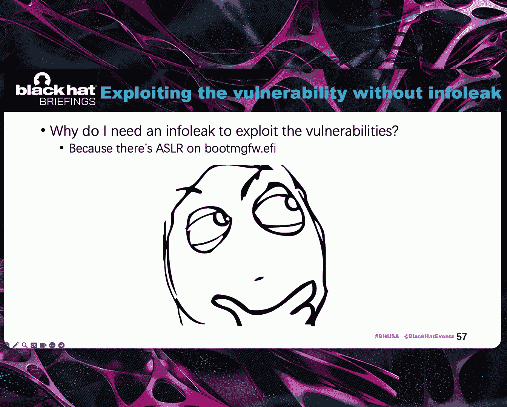

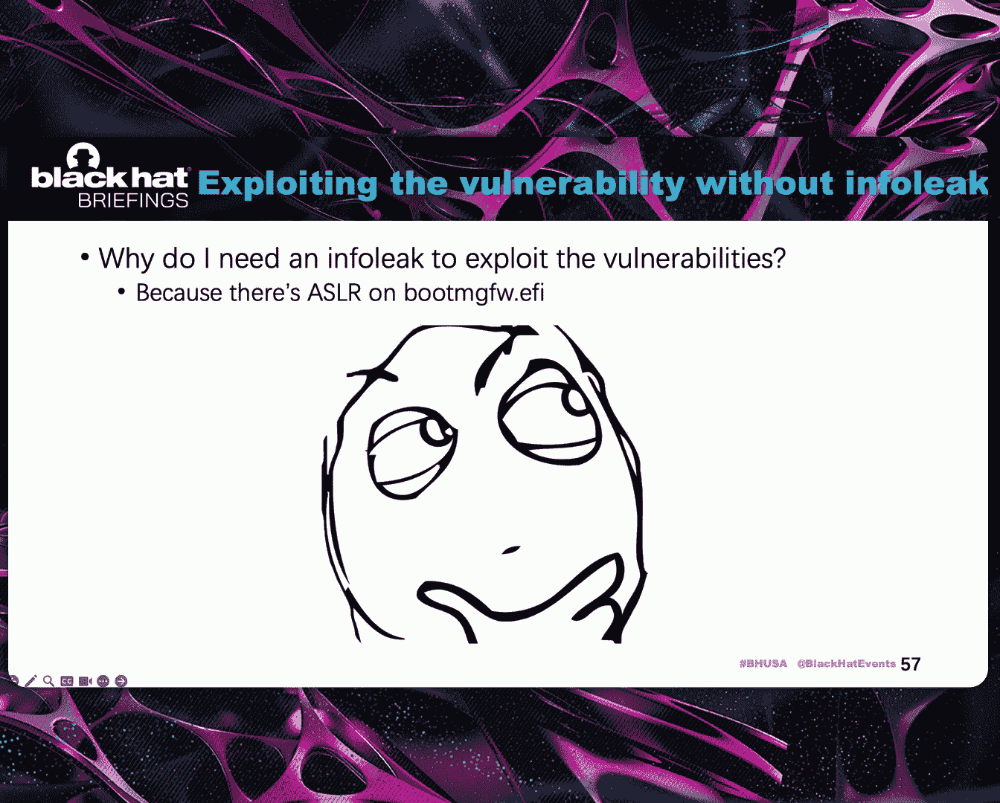

Here's a trick。 Each boat loader by Microsoft has a fixed loading base。

 The P XE boat loader is not essential。 In fact， you can provide the boat manager as a first chain to PE boat。

And the workflow works correctly。 You can see in the graph from the mini dom generated by Hyway VM that the bootloader was loaded at a fixed address。

 and you can perform specific address right and R P directly。😊。

There's no need to link the boat loader address。You can see on the graph clearly that even secure boat can protect victim from the attack because boatloader in their attack is probably signed by Microsoft。

 I'm not targeting the secure boat chain。 nearlyar all of my findings were targeting memory correction in Microsoft Boloader。

Ultimately， it can trigger remote ex execution on the victim machine。

 or it can lead to secure feature by pass after the attack attacker can exclude arbitrary shell code on the victim machine。

😊，So we've talked enough about the boatloader。 Let's see if there's anything outside the boatloader that will impact the boat security。

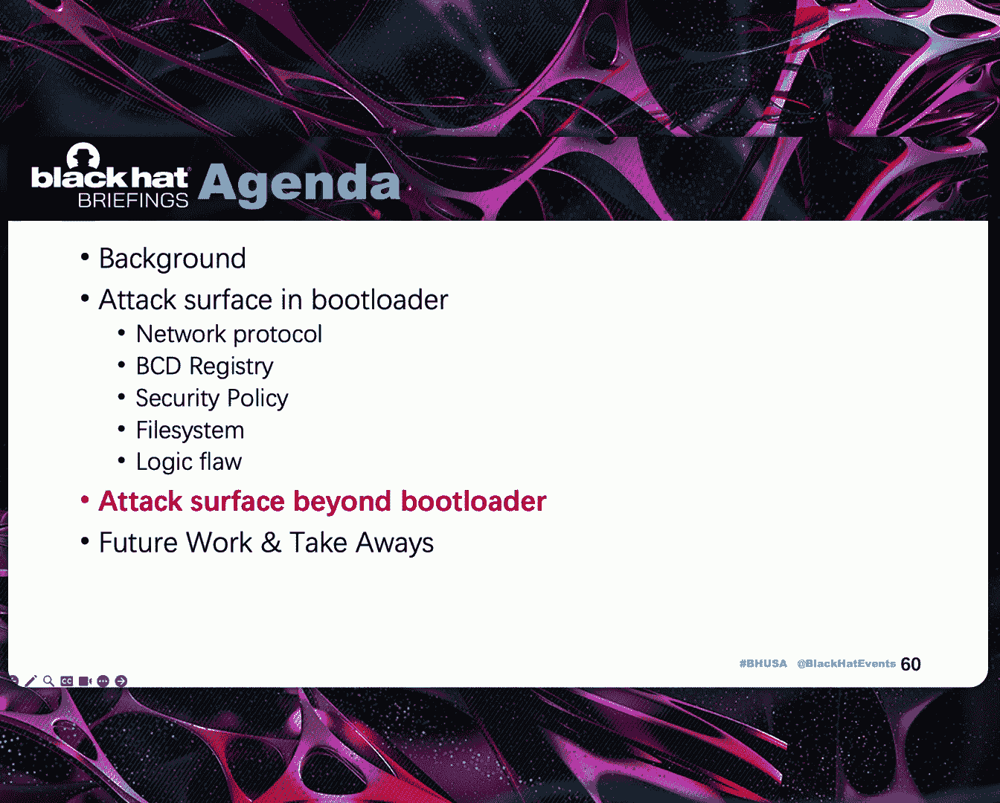

The P XE architecture problem expose complex Windows kernel and userless service code to unauthentate remote talkers。

 potentially sharing in a new area of unauthented R E attacks on Windows。

 It's just like this picture shows。😊，The windows bolt loader is just a small piece of the full secureable chain。

 Any weak point in the deep， deep underwater will render our hard work on fixing secure boat issue。

 not as fruitful as we expected。Today， we are going to introduce a new attack vector that blows the security boundary。

 Both security is responsible for verifying loaded its visible component。

 while the windows kernel ensures the correctness of subsequent configurationation and come components。

 These are talk method undermine the trust boundary。

 revealing that the architecture may not have in the potential for this configurationation person code to be target remotely。

😊，From an atroper's perspective， exploiting are RC E vulabilities in boat order during kernel initialization or post system boat achieve the same goal。

 R C E on the victims machine。Here's the word sunset。 We have a trusted binary。

 We have a default configuration。 reliable system。 We have a trusted binary。

 We have a a ti compromise configuration， a v system。😊。

So the， the configurationagation file can be embeddedbodied in the V image delivered to the victim remotely。

 This is crucial。 By controlling this configuration file。

 we can enable non default components with vulnerable rare configuration。

 potentially exposing the system to attacks。😊。

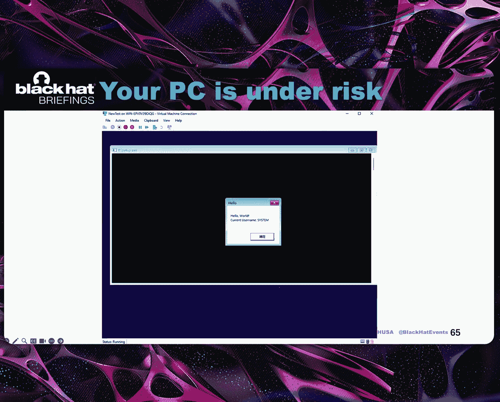

Here's a very simple example。 So you can see the golden lock on the screen。

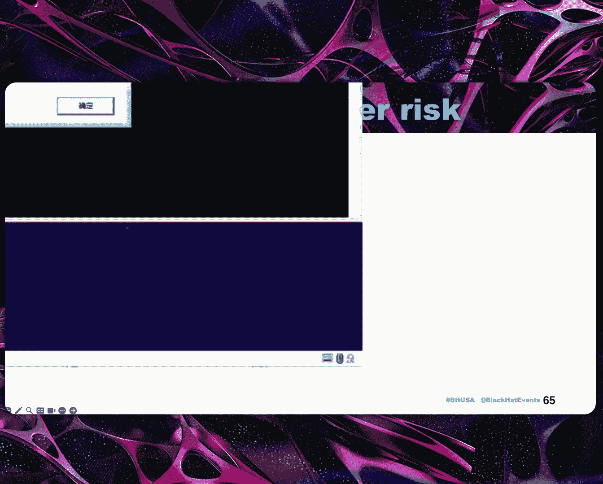

Which means secureables for this V I is enabled。It's very easy to make this attack。 Just use the WD。

 S function provided by Windows server。And a handful to named D I S M plus plus。

 to modify the ri image。

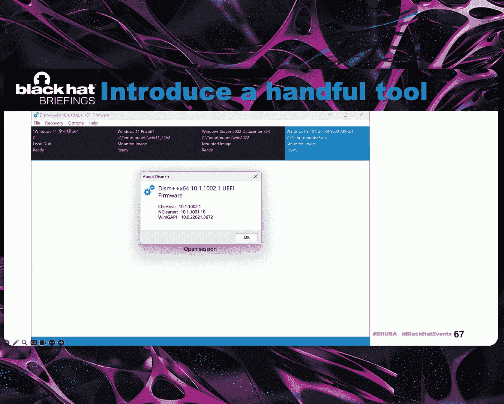

With this tool， you didn't even have to write one line of code。

 Just replace the setup excable underwi image and wait for fish to bed。

 And if you don't want to wait for fish to bite the bit。 you can exploit a remote denial of service。

 which is not too hard to find our windows in past years， I have found more than 20。

 But we are not going to talk about D O S today， were just talking about the possibility of this attack in P X environment。

 a D O S can cause victim to boat。 And if a tuer is already in the adjacent network ready for exploit this kind of bug。

 Then your PC is at real risk。😊，Now， we are looking beyond vulnerabilities hunting to the border implications of this research。

 this size from last is from last year's blackhead。

 stating that the networkable to user mode is not defensible。 Inter。

 they didn't explicitly mention how they would trade naable to kernel mode。

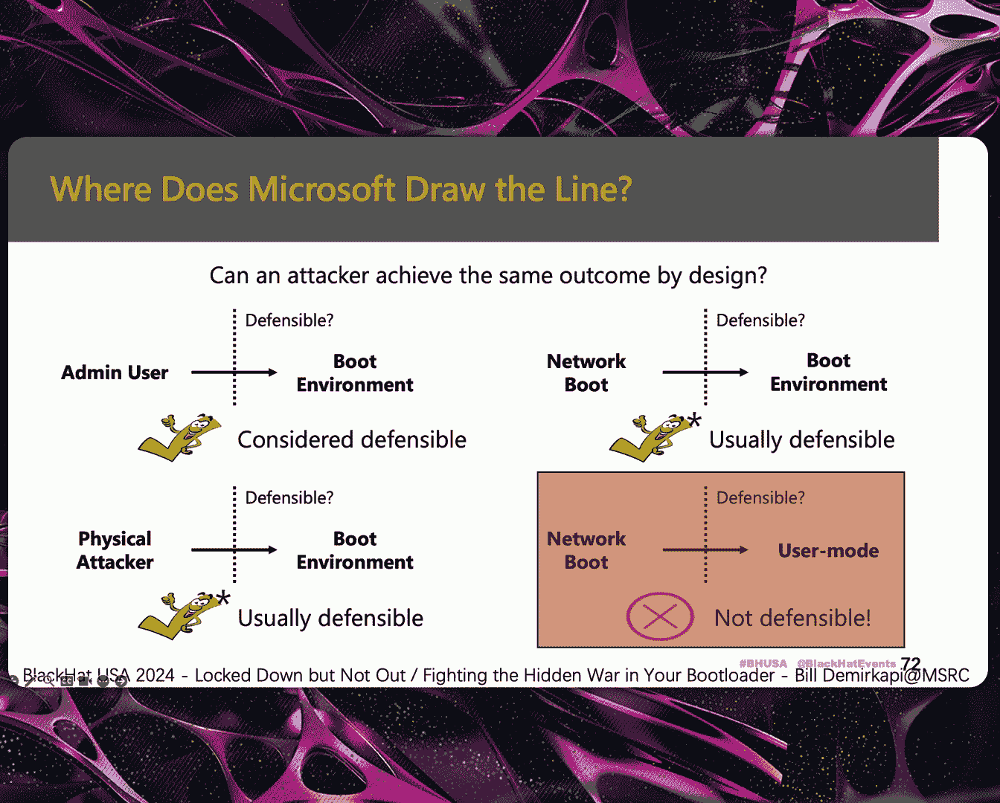

This raises question about their stance on this attack vi。

There are several ways to monitor fire rates during system Bull up， including Promo and when DBG。

 kernel debugging。With appropriate breakdown， I have identified a special file rate in one load and gets used in N task kernel。

 It physical path is in the windows directory underneath Eve。 And there's another par。

 and this is another paradise for fast flowers。😊，Before were doing that。

 we should take a look at what the file looks like。 It's that simple。 Now。

 nothing more than a no more in file。 But this file person is happened in kernel level。

 which result commonly use API for person， because in file person often happen in user space。

For my found setup， I chose to build upon excellent work of others using Vi K D Redux and my code base。

😊，It's very begin friendly for kernel programming。 The the key is to call your fuzz setup function at KD debugger initialize 0 and perform your data to the kernel Since the since the code we are。

 It's at a very early initialization stage of task kernel。

 It's not relevant to patch guard at the time which KD KDcom laws。

 there's no memory protection for the Windows kernel allowing you to hook Windows kernel as if you were in user space and even much simpler。

😊，Just load the modify KD con be to provide in KD， KD redux。and then you can begin your father。

Taking a closer look at the crash found by the father。

 What initially appeared to be non point deence turned out to be more complex。

So there's another sample。 The father only found denial of service at first。

 and I do the reverse engineering on the point where it crash。 Later。

 I found out the first Windows kernel memory corruption in my career。😊。

Another small location and O B right after the P O C file is pretty large。

 So I write a python code to generate it。😊，In practice。

 it seems like they also consider networks to kernel as indefensible。

 This become particularly interesting because the reason they gave me for closing my case is that victim user data didn't get compromised when the this attack happen。

 But the truth is the victim is executing the enzyme code at kernel level。

 I believe it's much simpler to erase all data or just do what the resumeomware do。

 do an encryption on top of the bitlogger encrypted data。😊。

Is there any necessary for the data to be leaked， We can learn from the past that this kind of attack should be enough for the bad guys。

So we are nearing our journey ends。

Let's see what can we， what we can do in the future and takeaways。

The next step should be to continue research on the boatloader on other attached surfaces。

 such as other boatloader designed to be loaded by boat manager like winl， resume or Hy Boloader。

 Additionally， the Windows kernel and user line service。😊。

It's also very interesting because I just told you that it could be exploited through the feature。😊。

So there's one more interesting thing。 It's about the second breach we are boot into。

 So PC A 2023 at 2，6，100 is identical thing right now。 But I found this theres five of my findings。

 Their fix is not shipped in PC A 2011 branch， which means even with the latest operating system patch。

 the system version before 2，6，100 is still available。😊，To these five vulnerabilities。

 This is amazing。 So you really should take a look at Microsoft K B article about this vulnerabilities。

 If you are running Windows 22，2 or before or Windows 1123 H2。

 and you didn't switch your loader to PC A 2023 manually， you are available to my findings。

 So back to my topic title， now， you know that there's two breach for us to into by default right now。

1 is PC A 2011 time breach。 this bridge make nearly every PC with U E secureable enabled Expable by default to all my findings。

1 is patch branch， which makes you exploit ball by default even if you up to update to the latest operating system patch。

😊，And the takeaways first is B I O B to achieve remote remote attacks in both order。

 and small function with same tie or fix up in this name could be very valuable。

 and recur calling could be exploitable to R E in your EF I environment and check twice after your patch is release。

 especially when you have found vulabilities in same component at a very large volume。 Don't be lazy。

 Take closer look at the code if father can generate the D US。😊。

And out of scope vulnerabilities could also be interesting in real world and take further action immediately to fix these seable vulabilities。

😊，Again， we need to bring this back side back again。 when the product line is big enough。

 youll have a lot department for different components。 And the question here is traditionally。

 theres many attack surface should not be exposed。In our attack scenario。

 theres no duty for both loader to check this configuration file。 And yet。

 there's few reason for O security team to process this attack surface that is unreachable through the common way。

 And I did provide a suggest to M SRC that to implement a simple recheck for。

Multiple WD S server exist in same network， and that should make the attacks error harder。

 And M S RRC told me it's not a security feature can be shippedd within recent update。 till now。

 I'm not seeing this mitigation be implemented in boat load。

 It seems like they still has a long way to go before the attacks error really getting resolve。😊。

And at the end， I'll provide you an online open source web page to detect secureable status。

Comp to K articles， this can give you a better view about how deeply you are impacted by my findings。

And the data， as you can see， the simple count is pretty small。

 You might want to test it for yourself。 I will keep updating the collect data on Github。

If you have any question， please find me on X。 That's all。

 And thank you for your time listening to listening to my talk。

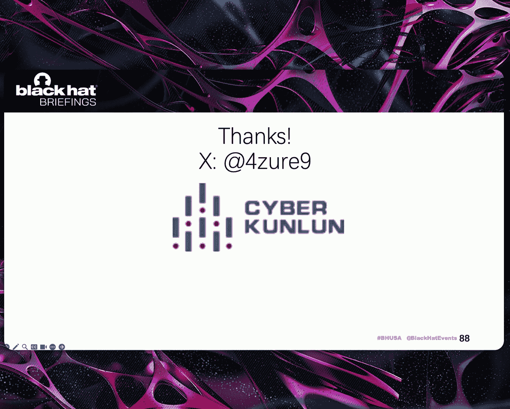

