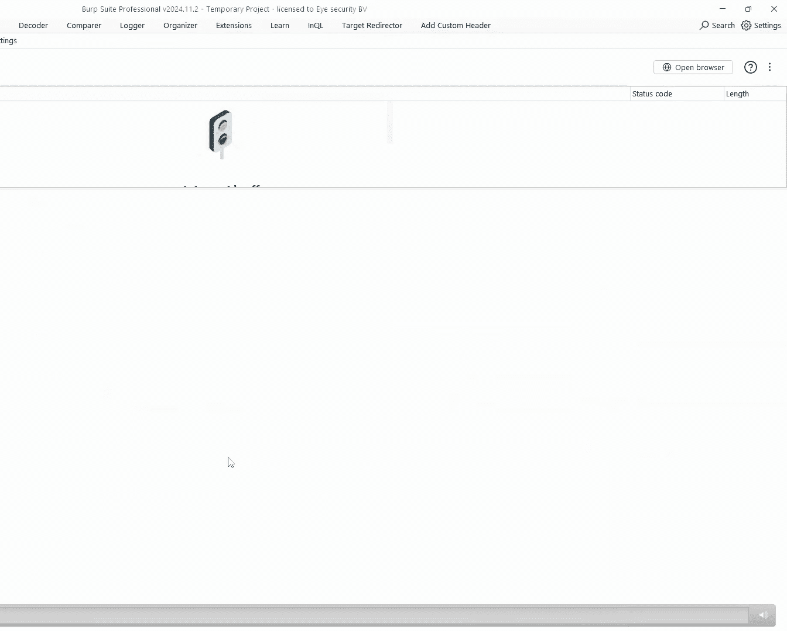
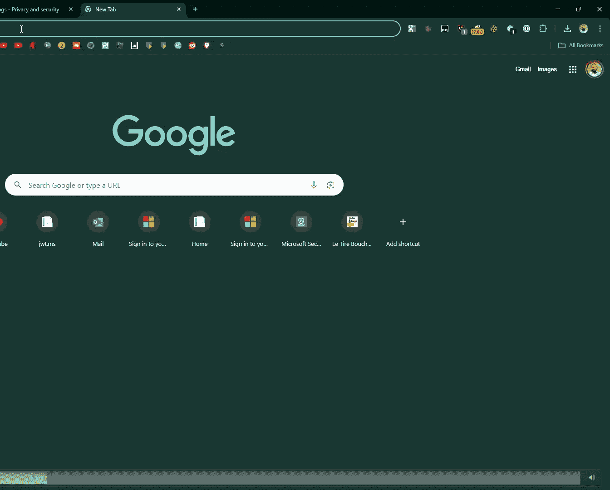

# Consent & Compromise： Abusing Entra OAuth for Fun and Access to Internal Microsoft Applications [sWV_3k-_S7Y]

Good afternoon， everybody， and welcome to my talk。 Consent and Compm app usinging Entra O for fun and access to internal Microsoft applications。

😊，My name is Feishsha Bernard。 I'm the chief hacker and cofounder of I security。

 We've existed for five years。 We started with the five of us。 Now， I have around 200 employees。

As chief hacker， that means that I get to do what I like most，100% of my time。

When I'm not setting behind the laptop， which is a rare occurrence， I must admit。

 Ill probably be somewhere outdoors or weightlifting or engaging in lengthy discussions on interior design with my lovely wife。

 who has is also enjoying her first black hat this year。😊，I am also very easily distracted。And。

After my last talk at the CC in Hamburg late last year， the top comment on YouTube said。

 I am terrified that most talks about cybersecurity vulnerabilities are just someone stumbling around having issues。

 Yeah， that definitely describes me。 This time， I wasn't even having issues。

So I was just stumbling around。You see， I needed to write some documentation and I was distracted。

 My eye fell on one of those AkaA dot M links。 You've probably all seen them somewhere pointing to some other documentation and my mind started wondering and I thought。

 what would happen if I just visit Aka dot M S。Without anything after the slash。

Turns out you end up on a login screen。And I have some intrusive thoughts， sometimes。So I thought。

 what would happen if I just logged in here with my own Microsoft account。Surely that would not work。

 right？Indeed， that would not work。You get an error message that your account does not exist in Microsoft Tenent。

And still being distracted， I was wondering if there were any interesting Aka A dot M S links that I do not know about ended up on AK A search。

 your website indexing AK A dot M S links and my IL on other dot M S domain。E and G dotta MS。

And I thought， what's that？Turns out you end up on another login screen。

You can guess what I did next。But results surprised me。

 I did not get a message that my account did not exist in Microsoft Ten。 I got a consent prompt。

And it requested my permission to sign in。So I thought。

 what would happen if I just click accept here。 Well， that did not work， but my interest was peak。

 I was intrigued。 Why did I get a consent prompt here。 What happened。And as an next reeeer。

 the first thing I did was I enumerated sub domainomains of EN G dot M S。

And ended up on rescue of E And G dot M S。AndYou might call me insane。

 but I tried for the third time， logging in。And ended up at the Microsoft Engineering hub。

A portal meant for internal micros with views only。That was a brief moment。

 I thought maybe I'm supposed to be here， like I did log in with my own account， right。

 but quickly realized that these were all internal Microsoft groups and this was not information meant for me。

I reported this to Microsoft。And not first， no， my knee jerk reaction as a red teamer was to search for the phrase password。

And what do you know， I got 130 and213252 results。Then I reported it to Microsoft。

And the question was， what happened here？ Why did I got access to an internal Microsoft application with my own Microsoft account。

 So to answer that question， we have to dive into the Microsoft。

 the enter I D identity platform and go back to the basics。So for the coming5 to 10 minutes。

 if you aren't familiar with Entra， please bear with me。 It will get more interesting。

I will touch upon some previous research done by Wiiz two years ago and presented at Blackhead 2023 and then present this new type of misconfiguration that I identified and finished with the blackhead Soundbits。

 as they're called this year。So we all know authentication authorization。

 we all know the difference between it， so I don't have to explain to you that authentication is the process that confirms that the users are who they say they are。

 Authorization is the process that validates that those users have permission to completely attempt action。

In Entra， authentication is done with an O IDC protocol。 It's done first results in an I D token。

 Authororization is done with an O O protocol。 It's done after and results in an access token。So。

This basic knowledge should probably also be very basic knowledge to developers who are developing AP dotnet applications。

 right， So what would they need to do if they want to know if a user is authenticated。 Well。

 simply put the authorized attribute in front of their controller actions。ok。Now。

 how does authorization then work？That's also the authorized attribute。Turns out。

Authentation and authorization are usually done in the same flow at eta。

This is all done at the authorization server or the Microsoft identitydent platform。

 We all know it as login do Microsoftof onlineline dot com， also called the identity provider。

This process is to make sure that you as the resource owner， can access your data。

And you're using a client and that client is requesting a bear token and with that bear token。

 you can access your data。 That client can be any type of app， single page apps， web apps， etc ce。

 These applications need to be registered at Entra to work。

That means that if I develop my own application called the I app。

 and I want that users are able to sign in there using their Microsoft account。

 that app needs to be registered at En。 and that registration is called an app registration。

E registration can be seen as the template， a template that describes what kind of permissions the app can have within the tenant and what kind of roles exist in the application。

But the actual implementation of that application is called an enterprise application or a service principle that describes the actual level of access the application has and the individual roles the users have in the application。

There are several types of token ground flows that different types of app use to obtain the tokens。

But because this vulnerability is valid for any type of application， any type of flow。

 I'm not going into much detail here that goes beyond the scope of this talk。

 So I'm only going to focus on the most common flow。

 which is a single page app that uses the authorization code flow。At the authorization code flow。

 the app has the user sign in if the service principle will does exist yet also consent to the application。

Then the user or the app gets authorization code and with this authorization code it requests an access token。

 and then with the access token， the Web API is called and data is returned in the application。

So consent， there can be user consent when it's only requesting simple permissions that are scopeed to the user or amin consent if the application needs permissions in the entire directory。

What this does is it instantsiates the application objects。

 the app registrations into service principles in the tenant。

You can force a consent prompt by going to this specific URL and entering the application ID。

 and you immediately get the application consent prompt from the from your own tenant。

You can also do this programmatically。 I don't recommend this。

 but this came in handy at this research by directly speaking to a backend API and giving consent in a loop。

 for example， to a lot of applications。After youve give a consent， you get an access token。

 everybody has seen these Con of a header payload in a signature。 These are signed by Microsoft。

 you cannot change the payload yourself。 And these access tokens contains claims。 For example。

 the audience is or the app I are often the same。 if it's a single app or if the application has other resources that it requires access to these can be different。

The issuer is important。 It's the tenant that has issued the access token。Also。

 in the tenant Id is the tenant I the user belongs to that has logged in。

The scope is the level of access the application has in the environment。

And there are a lot of claims that identify a user the Ex token belongs to。Now， in this flow。

 you probably have seen that the Microsoftoft identity platform can be reached at two URLs that are displayed here。

Well， it practice， there are actually more of them。

 This has to do with the way how these applications are registered。

 They can be registered as single tenant applications or as multi tenant applications。

 and they might allow personal Microsoft accounts。So a multi tenant application and。

Hinting at where I'm going here。Can be consented to in a different tenant than the tenants where the application is registered。

So if the resource tenant is where the resources live and the application object lives is tenant A。

 then an user from tenant B can also consent to the application When they request a token for that application and authenticate against their own tenant consent to the application。

 then the service principles initiated in their own tenant and they retrieve a token that's valid for the application in their own tenant。

So this means that an app object or an app registration object can only live in one tenant。

 But if it's a multi tenant application， the enterprise application or the service principle can live in multiple tenants。

Now。Youve， you've seen that in the flow， it describes two endpoints。

 the tenant I D endpoint or the common endpoint。 There are actually four endpoints。

 common organizations， consumers and the tenant I D。

 and the tenant I D can be either the tenant I D or the domain name or any domain name that's registered in the tenant。

And this has to do with the fact if an application is registered as a multiten application or not。

 so a multiten application that also accepts personal Microsoft accounts should use the common endpoint。

 while a single tenant application should use the tenant endpoint。In practice。

 if I just want to log into to an application in my own tenant， I can use any of these。

 and the same thing will happen， namely that I will authenticate against my own tenant。Two years ago。

 like at 2023， withiz presented a vulnerability date dubbed Bing Bang。

 and they showed that there was a vulnerability in multitenant applications。

 they showed that also using the authorization code flow and they showed that if during authentication if you replace the attacker tenant with a resource tenant in the URL where you authenticate against you were issued a token issued by the resource tenant。

 So in this case， the Microsoft tenant。And they showed that 25% of applications were vulnerable at that time。

And expose internal data。 They， I think they believe they altered big search results to show that hackers was the best soundtrack ever。

Microsoft mitigated this。 They stopped issuing access tokens if the client was not registered in the resource tenant。

 and that prevented the issue from happening。They also recommended to implement recommended authorization checks。

With recommended to reduce multitenant exposure。 And I'll show in a minute。

 while that's still a very valid recommendation。And they also recommended to require a user assignment and implement conditional access policies。

 And we'll see in a minute how that does not mitigate this vulnerability。So with all this knowledge。

The question still remained， why could I then still log into the engineering hub。

 What happened there。Turns out， the Web application redirected me to the common endpoint。

Which resulted in me authenticating against my own tenant。

 obtaining an access token valid for the application in my own tenant。

But then using that at the engineering hub， there was nowhere a validation of the issuer or the tenant I D。

 So any user assignment， conditional access policies were all applied in my own tenants。

I was authenticated。 I was authorized， but by which authority。Now。

 the Web application did not validate the issuer， Li tenantnant claim in the token。

But were they responsible to do that， they imperably implemented the correct authorization checks and the correct authentication checks。

It was probably a different team or a different person who registered the application at Entra and thought。

 well， there are probably multiple tenants where need users need access to this application。

 So I'll register it as a multi tenantant application。I thought， well。

 if this is the case at one internal Microsoft service。There might be other vulnerable services。

 right？So I started enumerating subloways of Microsoft， Microsoft。com， Azure。com， Azure。net。

 Office 365。com， etc。I ended up with a list of 102672 sub domainomains and domain names。

70 over 70000 of those resolved to an I P address。 Over 40000 of those responded to H T TPS， S。

And it turned out that over 1400 of those used En I B for authorization。

Most of them used client side redirects in slightly lesser part， used HTP redirects。

And I found 327 swagger interfaces， but I leave that to somebody else to investigate。

Interestingly enough， most of these redirected to the tenant endpoint。

 So these were probably single tenant applications， if they were。Configured correctly。

400 redirected to the common endpoint。 So these shall have been multi tenantant applications， right。

Well。I did check that。 So I pared the client I D in the URL， which is the application I D。

 I checked that for multitenancy。 You can do that at the old Azure A D graph API， the 1。

6 internal version， where you can check for the application I D。 And if it does give any result。

 it is a multiten application。 It will then also say available to other tenants is true。

Turns out there were 1 72 that were multitenant applications。But interestingly。

 enough most of those were actually used in requests to the tenant endpoint。

 So the developers probably were not aware that these were configured as multi tenant applications。

 as the tenant endpoint was only to be used for single tenant applications。

We don't have an account at the Microsoft tenant， but they are multi tenantant applications。

 So how could we log in there。Simple， just matching replays using verb and on the fly。

 replace the tenant I D of Microsoft with common。Which redirected the whole authorization flow to my own tenant。

 which allowed me to consent to the application， log into the application and obtain an access token。

But many of these applications still gave random errors。First of all。

 many of those required user assignments。Well， user assignment now also happens in my own tenant。

 So I could simply browse to the enterprise application object， click on users， assign my user role。

 for example， administrator。These roles were defined by the E object。

But instantiateated in the service principle in my own tenant。

So that meant that I now get an extra token with the upmin role as an edit claim。

The second error I ran into was that the application requested for permissions to access a resource that has been removed that is no longer available。

This happens if an application defines that it requires other resources。

 These are other application objects。And some of these applications can be defined as single tenant application。

 And then the whole consent flow doesn't work because it says， well。

 there is another application that I also need to consent to， but that's not available。

 I can't find it anywhere。This error and the next one that this application is trying to access a service that your organization lacks a service principle for。

Can simply be circumvented by creating the service principle directly。

You can do that with Powershell snippet， new Azure A service principle or new NG service principle in the Newer Gra API Powerhell。

 or you can use the graphraph API itself。And this creates a service principle without asking for consent or checking the availability of required resources。

 You then still need to do user assignment。 You also still need to consent to these individual applications that were just insiateated and as。

 as much as possible。 And most of these applications then allow you access。

So to summarize the attack steps， where first create the or identify a multitenant application。

 list the required resources， instantiate the service principles。Assign the role to the user。

 redirect tenant to common in， for example， a wet proxy。

Consent to the application and compromise the application。

Turned out that 22 of the applications I identified were vulnerable to this and exposed internal data。

 That's 12 and a half percent of the identified application， Multitenant applications。

 And I'm not even counting the ones where I did get front end access using this token。

 but did not get backend access。Some examples。This is the emergency broadcast system to broadcast a message to every Microsoft 3。

65 Umin center in the world。I did not publish any posts。

The second one was called the Ace command Center。 And I really like how it greets me。😊。

Because I was just logging in with my own account， right。

This was actually the support portal for the top tier customers of Microsoft。

 So these were Fortune 500 customers having outages。 I could see every support ticket。

 close edit support tickets， alter them， etc。I got access to the。

 the responsible AI operations platform where I could administer all kinds of large language models。

 probably the parents of Co P as well in there。The next one was redacted last minute because of a kind request by Microsoft。

 And I can imagine why， because I'll tell you， this was the risk register。

 This application contained a list， a list of risks that the Microsoft organization at that moment was facing。

There were a lot of risks in there。 I could filter by security risk。 I could filter by high severity。

 and I could filter by not yet mitigated。This gave me a complete overview of all the identified zero days in their environment。

That were not yet mitigated。I found a security intelligence platform where even the confidentiality acknowledgement had to be redacted。

It was highly confidential Everything in this application。

 because it contains all data sets of the entire Microsoft organization， like VPN logs， Cs logs。

 L up users。😊，AAD users， device history， et cea， et cea。

But there was a button request access for all of those。 So it was not immediately downloadable。

You might have noticed a button in the lower right corner。

So they implemented an AI agent in their security intelligence platform。 So I thought。

 why not ask sippy。At which URL can I find the augmentman portal to improve access' requests。

Turns out that is in myex Microsoftsoft dot com， not in the portal itself。

I also asked it where the name Shipy came from， but it didn't know， unfortunately。

It did gave me a nice drop down menu in the access requests form where I could enumerate any user in the Microsoft cloud environment。

 There were a lot of test users。And I could enumerate any service principle in the Microsoft cloud environment。

 And there were also a lot of test service principles。Somehow。

 my burb got 40 MB log file in the background being loaded， which contained。

Authorization codes of users that logged into this portal。If you're familiar with Enra。

 you know that I briefly got excited， but then realized that authorization codes can only be redeemed once。

The next one was actually a big tree of required resources because it gave me 20 applications to consent to。

And this one was the media creation service。What does it do， well。

 great things come to those who don't wait， build in the cloud today。Well， what was it building then。

Eition clients， professional。That sounds like windows， right。

It contained log files of all these builds。These log files， contain an E SD private key。What's E D。

 That is electronic software distribution。 It the volume。

 It's the volume license key that everybody uses。It could probably generate a large number of Windows keys now。

It also gave me access to the source Lookup I。Well， I can tell you that I've seen things。

 You people wouldn't believe。It also allowed me to put new tools up there。

 and this my would probably have given me RCE。 but this definitely what was the moment to report this one as well to the MSRC。

A small demo video。So in this case， I had already created the service principle。

I then put the match and replace rule in Bp。So to replace the tenant ID of Microsoft with common。

I browse to one of these internal Microsoftof applications， the empowerment center。

It redirects me to my own identity provider where I can log in with my own account。

And as simple as that。I did implement MA。You get in an application。

 and you can just use it as an administrator。 for example。

 search for any empowerment status that's active。And it will request all the backend data for you。

I identified a lot of other filterable services。 Most of them were not noteworthy。

 One of them was interesting， the hardware inventory API。

 which where I discovered that every screw when every data center had a serial number。You might ask。

 what about Somal authentication， So So authentication works differently than Oath。

 but it uses the same URL to authenticate too。The thing is that the。

 the tenant I is also in the sum request。 So you'd have to do a little more juggling on the fly because the sum request is base 64 encoded and Z Li compressed。

 So you have to uncompress decode it， change the tenant I D and then compress andcode encode it again。

I could not identify any vulnerable services， but I did not have much time to research this further。

 So more research is needed on this topic。A timeline， I submitted four cases in November 2024。

 I then was briefly distracted and submitted another 18 cases in January 2025。 And by that time。

 the Microsoft Azure Security variantant hunting team was also working in parallel to identify any vulnerable applications in their environment。

I think I was first for 17 of the 18 cases because I only got one duplicate message in the MrRC portal。

They scale up a project team。 I've spoken to a lot of people who had a bad January this year now at Blackhead。

 They told me that I。Gave them a lot of work to do。

But almost all cases were resolved within two months。You might wonder， given all these cases。

 how many book bounties did I deserve with this。How many did I earn？Absolutely nothing。

Because everything was out of scope。And I forgot to read the scope of the Microsoft Bounty program。

It turns out only customer facing applications are in scope。

 Internal Microsoft applications are out of scope。But I did get leaderboard points。

Mentioned I was third at the Q1 leader board。 I was 19th at the MVR leader board。So， I'm happy。

But one of the other comments at YouTube after my last talk at the CC said this thought makes book hunting at Microsoft look like an infinite mono glitch。

 So Feishsha hacking Microsoft was supposed to be an infinite moneyg glitch， right。😊，Well。

 I'm not done yet。One of these applications was called the Microsoft Rewards Center。

 and I could assign myself the administrator role in this center。

This gave me an application with a quite complex menu structure。

 but I found the rebate functionality where I could enter any amount， any currency。

 any Paypal identifier， hit the button， skipip risk and click payout。😊，So it turns out。

Hecking Microsoft still is an infinite monog glitch。You might wonder， is this still out there。

 I spoke to a lot of Microsoft employees in the last couple of months。

 They say they fixed it everywhere， but I had to put a disclaimer up here。

 And I can imagine why the specific methods demonstrated are no longer effective against the applications we reviewed。

 but they also address this broader。 So they now also have monitoring。

 I know because when I created these slides。 I tried one or two times。 again。

 I received an email immediately。They were unto me。

But we also realized in our own customer base that 2% of our customers also had vulnerable applications。

 We helped them remediate， but this vulnerability is still out there。

So if any of you bug hunters find a nice bug bounty with this， please send me a message。

I'll give you a thumbs up。You might also want to check if you are vulnerable if your organization is vulnerable。

 So I wrote a very small， tiny powerhell script to identify multi tenantant applications in your own environment。

 It's， it's actually your one liner， but it does give a nice table of multitenant applications in your own environment that have a readerdirect redefined。

It's at consent and compromiseroise dot com along with the blog post that is just gone live about this。

 It does give you a table like this。 What you want to do is check for any of these applications。

 if they actually require multitenancy for most of the identified multitenant application。

 It was not required。 It was just hit accidentally。But if it is required。

 ensure that the application logic does check the access tokens for the tenant I D or the issuer claim。

So to finalize this with some sound bites。When you are using Microsoft En ID for authorization。

 be sure to use multi tenantant applications only when absolutely required。

If you are using multi tenantant applications， always explicitly check the issuer or tenant of the received tokens in application logic。

And for all book bounty hunters and pen testers out there。

 be sure to check for this min misconfiguration。 It is quite common still。Thank you。😊。

