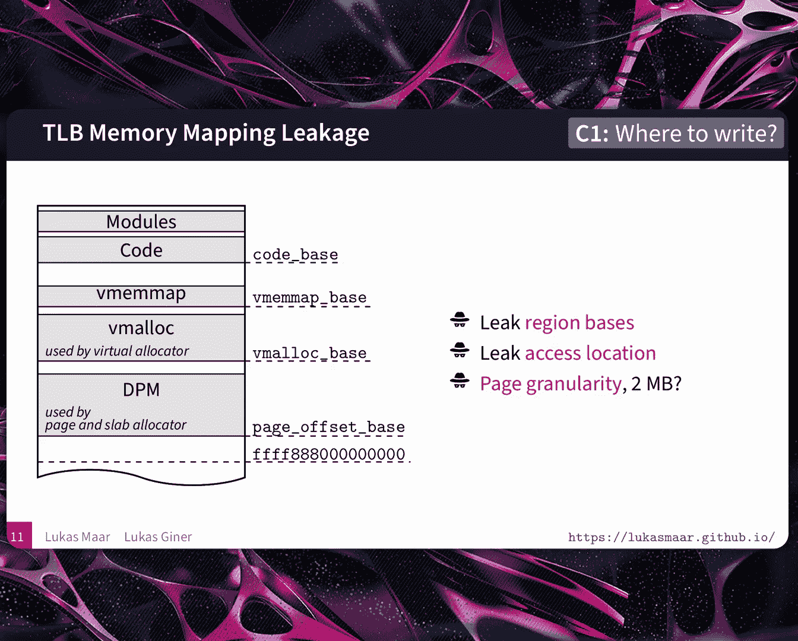
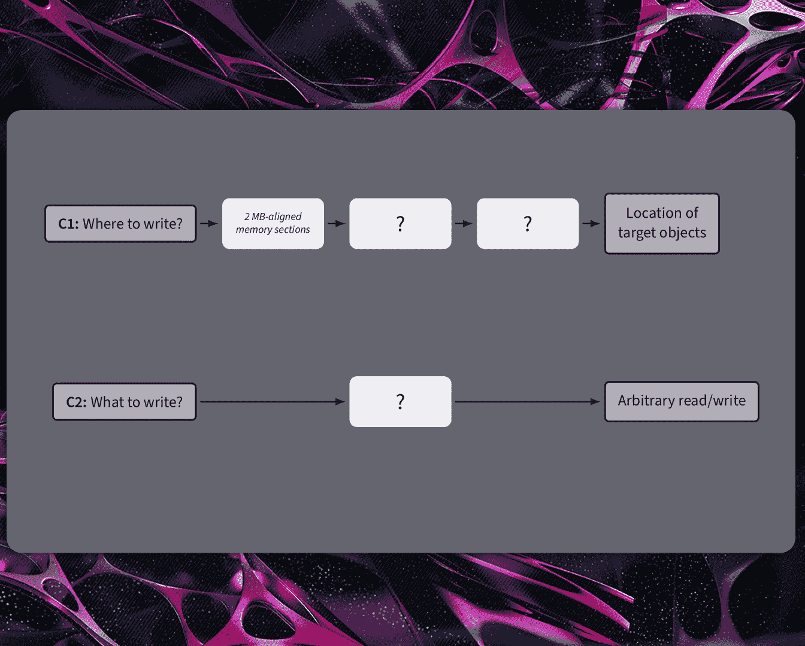
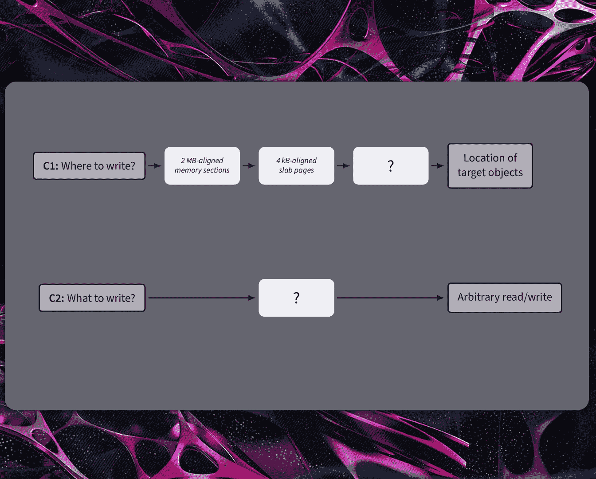
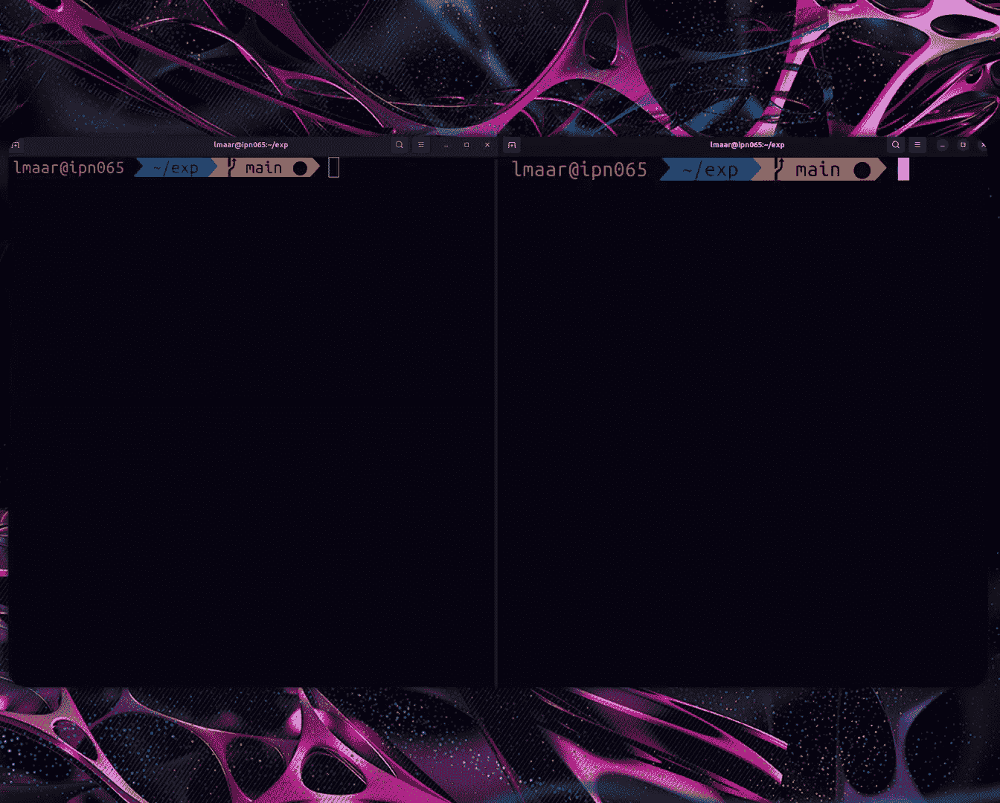
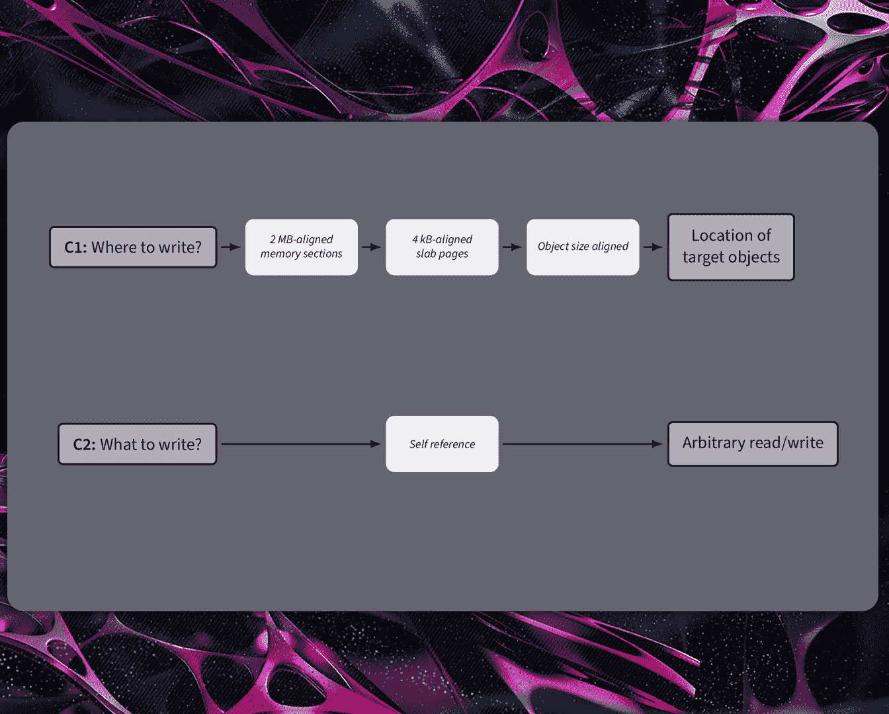
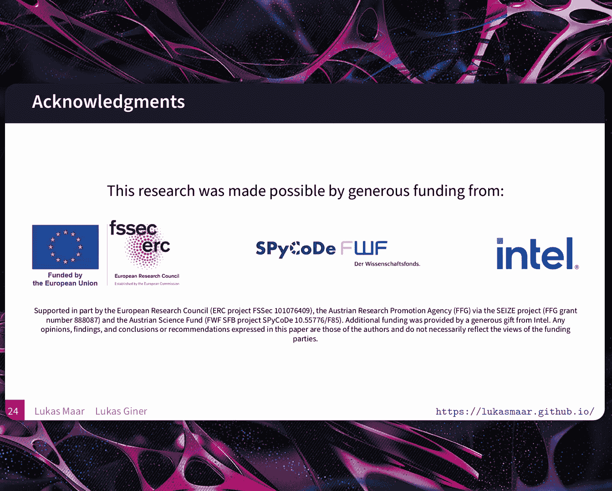
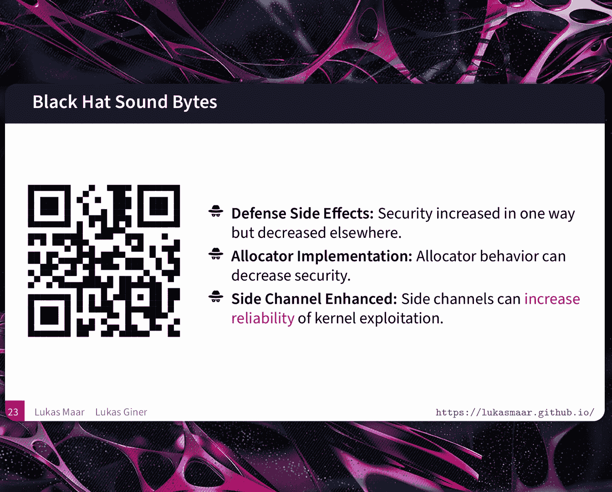

# Derandomizing the Location of Security-Critical Kernel Objects in the Linux Kernel [nOXwh8BfRDo]

Hello， everyone。 Thanks for the nice introduction。 My name is Lucas。 My name is Lucas2。

 and welcome to our talk。😊。

About TLP based location， this closer attack。 So our talk initially starts with an timing side channel on the T LP。

 The translation look aside Pa。 And then we show that exploiting aoccotta and defense behavior allows us to amplify the side channel leakage from the TLP side channel。

😊，Then we showed that using this sunshine leakage， we can perform reliable and stable kernel exploit。

😊，And lastly， we show a live dna showing both the and leakage， as well as kernel explanation。😊，Again。

 my name is Loasma。 I'm a PhD candidate at Ktz University of Technology。

 I specialize in system security， current security， science and security。😊，My name is Lukinina。

 I'm a postdoc at Gs。 I'm doing secure caches， secure cache architectures and micro architectural attacks。

Okay， before starting with our work， let's talk a little bit about the motivation of kernel exploit in kernel exploitation。

 threat actors typically start with initial code execution in an untrusted and unprivileged context。

 The goal of these threat actors is to exploit vulnerabilities to perform privilegeed escalation to wood。

 They do it by initially exploiting a vulnerability within the kernel software。

 which allows them some kind of over capability on some kernel metadata。 This， on the other hand。

 enables them a weak primitive， which returns one or multiple kernel addresses。😊。

Then in a second stage， these third actors exploit either the same or a different vulnerability to again。

 get some kind of over capability of other kernel metadata。

 This enables them some kind of white primitive。😊，Which cos current data with attacker controlled values。

Then in the next step， these threat actors typically trigger kernel events which internally use these cooperative data from the previous step for either a controlled flow hard checking attack or for data oriented attack to finally perform the wanted privilege escalation。

So this looks like it already works pretty well。 So what's the problem here。 Actually。

 there are multiple problems。 So when you exploit a vulnerability in software。

 especially in the Linux kernel， you put the system in in stable state。

 which potentially leads to exploitation failure， Another potential failure is converting the capability of a vulnerability in something of a wheat primitive requires exploitation techniques。

 which are also inherent prone to failure。 this is for tool for wheat primitive。

 as well as for what permits。So how bad is this for our attacker so。What， what might happen is I'm。

it leads to an either an immediate system crash or potentially immediate system crash。

 or it potentially crashes the system later on。 So this I just wait for a rebooter。 unfortunately。

 no， because a system crash usually leaves some kind of unwanted artifacts in the kernel。

 let's say in kernel logs which then0 potentially triggers forensic investigations from fat actor perspective。

 this is bad because now the system crashes can undermine the of kernel exploit。

 And this system crashes potentially therefore。😊，Burns valuable receiver what v pill is from the fat a best active。

 So we can， of course do better， right， Yes， let's go back to to the former example of we have the capability of overwining some kernel metadata。

 And let's imagine we have a magic want。 this matching want now allows us to convert this limited and in a lot of cases。

 solid capabilities to an hour where wheat wide primitive。

 an out where wheat wide primitive is in a Linux kernel basically got note。 Then。😊，What you can do。

 you use the our 2 we wide primitive to perform the privileged escalation attack。

 So that's a very nice magic one。 But where do we get it。 That's nice magic1。

 That's we will show it in a work。 But before we define two challenges which our work solves。

 The first is So we have this wide capability and we need to know where to。

 And the second challenge is we need to know what to。 And with the over goal。

 it should be as reliable and stable as possible。 to do so we define this vote map with both challenges on the left。

 So challenge one to with an goal of finding the location of target kernel objects with intermediate stages and on for the second challenge what to with one intermediate step they want got mode our 12 we wide primitive。

 So for the first parts， I think I have some idea。😊。

We can resolve some of those question marks。 So I've heard of disclosure attacks with TLB timing side channels。

 Do you think that could be of use。 but what's a TB。 Okay， that's a good question。

 So let's go one step back even further。 How do virtual addresses get translated into physical address。

 So for this， we first split the virtual address into 9 bit segments。

 And then we use these 9 bit each as an index into tables。

 So these five tables then successively get closer to the final translation from the virtual address to the physical address。

 So now we've translated it and we know where in physical memory our virtual address is。

 isn really slow because now we have 4，5，6 excesses only for one translation。 Yes。

 so CPU vendors for the same thing。 So this is where we get to the TLB the translation locoocyte buffer。

 This is the cache that stores recently used translations from virtual addresses。

To physical addresses And on Intel CPU， it might look something like this。 we take a virtual address。

 we take out that's called here set index 1 and2。 We ex or them。

 and we use this8 bits as an index into 256 sets in the TLB。 So this is how large TLB is 256 sets。

 and each set has six ways or in other words，6 possible translations that it can store in this set。

 And so to find if our virtual address is stored in one of these six ways。

 we just compare the attack。 that is the address。 And if it is in there。

 then we got a translation back。 we get the physical address。

 And this and only takes one to I don't know a few cycles。 So it's much， much faster。

 So but now we have a timing difference in whether this translation is cache do not cached right So there is a timing difference。

 So let's see how we can find out what that is。So this is actually pretty simple。

 We start some cycle accurate timer。 Then we do an access， a simple access。

 which necessitates this T L B involvement。And then we take the difference to a timestamp afterwards。

 and that will give us how long this access took。 but when we attack a candle and we don't we are not allowed to access kernel addresses。

 That's true。 So this would， of course fail if we did this for a kernel address。

 but there's a nice little trick。 we can use the prefetch instruction。

 So the prefetch instruction is a hint to the CPU that says please load this address into the cache for me。

 I'm gonna use it probably very soon。 And crucially this doesn't actually architecturally access this address。

 And so our program doesn't get doesn't get a fault。 if this is actually a kernel address。

 but this still does the TLB access this translation。 And so we still see the timing difference here。

And when we do this over many addresses， we can create a histogram that looks something like this。

 where we can clearly see that pages that are unmapped。

 that is pages that are cant be in a TLB at all， can be clearly distinguished from pages that are mapped。

 and within pages that are mapped。 we can easily tell the difference between hits that is pages that have recently been accessed and therefore loaded into the TLB and pages that have not been accessed so theyre not in a TLB。

Okay， but now if we have access a kernel page， it is loaded into the TLB。

 how can we remove this cache translation， right， So I think what you're getting at is if I want to remeasure an an address that I have accessed。

 then I need to get it out again。 So let's go through an example here the kernel does some kind of access and this is our TLB set and this gets loaded into the TLB。

 And so now if the attacker comes along and does their prefetch。

 it's gonna be fast And if the attacker now measures a different address they're gonna have a slow prefetch。

But this slow prefeage still loads it into the TLB。And if we were done to do this again。

 it would be fast the second time。 So we can't get any new information like this。

 And so this attack is called the eviction reload attack because we do a second step。

 We evict by filling the entire TLB set with other addresses that we have。

 And because we know this function， this Xor function。

 we can tailor our addresses to fill exactly one set。

 And now we're at the starting state again where we can do another round of measurements on the kernel。

😊，Alright， and so now that we have this， we can try to leak the region basis for the kernel memory。

 So the kernel organizes the its memory， something like this。

 where it has regions for the direct physical map， the meoc， the me map code and modules。

 and all of these have randomized offsets between them。 And so for exploitation。

 it would be nice if we know where all of these start。

 And we can find this start by using our mapped or unmapped， distinguishing primitive。😊。

And then within these maps， these regions， if the kernel doesn't access。

 we can use our access or not access primitive to find this location。And this location， of course。

 has page granularity because the TLB stores page translations。 And so for most of the kernel。

 this is going to be two mebyte pages。Is this， does this solve our challenge。

Yeah， that's this solve our challenge。 Now we， we， we have this intermediate stamp where we can leak two meby aligned kernel sections。

 but we， we want to know the exact location of target objectss。 So unfortunately not now。

 but what we do is next step is we narrow down the granularity from 2 MBby leakage to 4 kilobte leakage。

😊。

And before doing so， let's consider the the memory layout in more detail。 The three sections。

 three sections important for a lot of kernel exploitation。 The first is the VM map。

 The second is V melo on V M lock is the memory region used for very large kernel object allocations V M lock is map for kilopi mappings。

😊，Apart from。 So the VM mapping is2 me mappings。 and the first section is the DPM。

 the direct physical mapping。 the direct physical mapping is a virtual mapping of typically than di physical memory。

 it is used by the s acottta， the s ata is mostly used for kernel heap allocations of smaller size。

 So if we want to attack V melo， then were basically already one step further we already have 4 k pages。

 Exactly， if our target object is allocated with V maillo， then we can leak this 4 kB offset of the。

😊，Object， one example is a piecode for EPPF。And for the other or for other objects。

 we can use defenses。 What do you mean， use defenses。 Defs or defenses can have side effects。

 unwanted art effects， which changes the ma mappings of objects。 let's say。

 from2 MB mappings to 4 k mappings。 And we found that at least 3 defenses。

Change the mappings of objects。 And the first two are by design。 So the first is the con V map stack。

 which changes that the kernel stack is now allocated with V malllo instead of K malllo。

 which would have been allocated on a TPM。The second is the Sla virtual。

 but it does it virtualize the entire kernel heap on a 4 kilob mapping。

 So these two are straightforward。 Just enable them and target objects are now located on 4 kilob ma mappings。

 The third one is a more interesting one。 It's the enforcement of the Linux kernel of strict ma permissions。

 especially the kernel modules。 A kernel module is not allowed to be and executable。

 That's one basic defense， which we've learned a couple of years ago。😊，And。

And what this defense does is when the current loads a model to the TPM So to the physical memory。

 it sets the permissions of the model code to not wide。 However。

 if the TPM is mapped with two me pages and the model code can be as small as 4 k。

 the current needs to split up this 2 MB section to 4 k mappings。😊。

So is that what we're gonna be attacking the modules。 No， we don't attack the modelss。

 but we use the models to split at two me page into 4 kilopi pages where then our target objects are located。

 Okay， so the module is just the convenient way to break up the pages objects of interest。 Yes。

 can we do that as an unprivileged user Yes， we can do it indirectly as an unprivileged user。

 We can access kernel functionality of modules which are not yet loaded by the kernel and therefore load。

 so let's go one step back we can detect those accesses。

 How do we make the kernel access the areas of interest。 That's a good point。

 We use ciss So ciscos perform internal perform internal accesses of kernel objects and therefore loads kernel pages of4 kilopi aligned kernel address into the TLP some examples。

😊，Considering the kernel stack， we can just call an invalids call。

 this invalids call X excesses the stack and therefore loads its 4 kilob aligned kernel address into the TP。

 for the message message object。 we can use the message receive the message message object is a well known object object for kernel exploitation。

 Another well known object for kernel exploitation， is that by buffer， for P puff。

 which is simple from the file descript of this buffer by buffer。😊，And for page tables。

 we can use M product。 And so we're usually interested in one page。

 Are these Ciscos so convenient that they access exactly one page we're interested in。

 Unfortunately no all of these Ciscos accesses a lot of kernel objects。 Therefore。

 a lot of kernel pages will be loaded into the T L P。😊，Alright， so there are a lot of pages。

 How do we find the one that we are interested in。 Let's consider one example。

 The example of the message message object， As I said。

 the Cisco message we is a current responding Cis call， which accesses the message。

 and what we do we call the Cisco with the identifier of a message0。

 and we want to leak the page of message0。 what the Cisco does。

 It first access IP and S the interpoces communication namespace and loads it address to the TlP。

 Then it accesses Q0 to loads again， it kernel page to the TLP。 And lastly。

 it accesses our target object， the message0 and also loads the target。Page into the TLP。

 as we see here， the cisco creates a distinct TLP pattern where two pages， our unwanted artifacts。

 and one， the page 2 is our target page。 So therefore what we do now we perform another excess。

 Now to access the message1 object which is located on the same page also page2。

 What the ci does it again accesses IP and S it accesses Q1， and it accesses the M Sk 1。

 So creating another distinct TP pattern。 So now we have two overlapping pages here。 Yes。

 on we overlapping page2 and 6。 So therefore what we do now we call the cis with an identifier object with an object where we know it is not located on our target page in our example。

 it's the message 32 with the Q 32。😊，And what we do now is we just take the overlap between the first two。

 and then we exclude the last one。 Yes， sos it in in more detail。

 the set of pages access by the first Cisco is 2，5 and 6'm overlapping with2。

4 and 6 is 2 and 6 and excluding one，3 and 6 results in our target page where both message 0 and message 1 is located。

 So it seems pretty nice with three pages。 I this how many Cisco usually excesses。 unfortunately not。

 So in our case， or in this case， the message we access is about 900 pages on multiple TP levels。😊。

So， a lot of more。

啊。What we we have seen now， we， we are one step closer to our target of the location of the target kernel objects where we can leak these 4 kilo aligned sb pages in inform former case page 2 with the message0 and message one object on it。

😊。

And to get to the actual objects， locations。 What we do， we massage the Linux kernel aatta。😊。

AndWe massage that our target page， our target ideal page only conds attacker controlled objects。

 We do it by using a s timing side channel。 So this is how we got that page full of green message message objects before。

 Yes， so we don't know the order。 Do we know， we don't know the order。 But we don't need to。

 because we know the offsets where all of these objects are located。 then， And as we show later。

 this is sufficient for reliable and stable kernel exploitation。😊，And what we then did。

 we did a lot of evaluation of this locational Disc attacks。

 We evaluated on three Linux conversions on V 5，15， V 6，5 and V 6，8。

 We evaluated on a lot of inter CPUs， while M T CPUs and some arm CPU are also affected。😊。

We leak the following kernel objects， We leak the kernel S。

 and we leak multiple heap objects like the message message swa， credential file。

 sec file and pipe buffer， all including the page tables or locations of the page table。

 all of these are interesting targets when considering kernel exploitation。😊。

And with that， we succeeded in solving the first challenge。 So we start with where to write。

 And now we know exactly where to write。 we want to write to dis target kernel object as I shown before。

 So how do we solve the second challenge， Lucas。😊。

All right， so let's look at this。So we're academics， of course， we。

Usually interested in doing the entire end to end exploit And neither should do。

 because that's really bad。So we just give ourselves a leg up。

 We start with an exploit primitive ready made for us。 So we cheat a little bit。

 And so the one we're using here is the unlinked primitive。

 So this is an unlink implementation for a linked list in the Linux kernel that is not always implemented in a secure way。

 So this will allow us to inject two values that the kernel then writes to some location for us。😊。

So this has been used to great effect with the bad binder tech and many others。

 and we're going to convert this into a rewrite primitive。So in a little bit more detail。

 this is a linked list here。Of bind the thread objects。

 and each of them has a list head with the previous and the next pointer。

 And so if we want to have the kernel remove the middle object here。

 what the kernel then does is replace the next and previous pointer of the first and third objects with each other so that the one in the middle gets cut out。

 So this is a normal operation here。But what if we， and this is the part we where we treat a little。

 can overwrite these two pointers in the middle。 So we're gonna overwrite them with dead beef and bad coffee。

 And then what the con will do for us is write bad coffee，2D address， that beef and write that beef。

2 the address， bad coffee。And so this is a very limited primitive Where does these two cross rightss。

 And Lucas is going tell us。How we can make this into a niceup primitive。Yes。Now。

 before explaining the exploitation technique to convert the unlinked primitive to an hour to a we wide。

 let's consider the pipe buffer object， the pipe buffer object is the kernel object which stores met data for every open pipe in user space。

 It stores a page reference of the physical back page where the actual data is stored。

 It also contains a we and a wide end。😊，These pipe offerss are located on s pages of the K Mellock C T 64 cache。

Which we leaked with， which we leaked and massaged with our location， this closer attack。

 In our example， we see pipepa for0，1 and 2。Exactly in that order。

 we then use our unlinked primitive to override the page reference。

 instead of referencing the physical back page， it now references to the s page where all these metadata of the pipe buffers are located。

Then if we write to pipe for 0 allows us to overwrite the metadata of pi buffer  one。 in particular。

 what is interesting， we can overrite the page member So that physically the reference or the page reference of pipe  one。

 So what we do， we overr it with our target page。 And then perform a legal read fiscal and a legal right fiscal to pipe buffer for one。

 in order to perform the actual arbitrary read and write we can repeat this process。 again。

 write into pipe for 0 in order to change our target page something else。

 And that's basically how we create our arbitrary physical read write primitive。😊。

And with that， we succeeded in solving the second challenge from what to why。

 we overr it with a self reference in our case the pipe buffer in order to obtain the arbitrary wheat wipe primitive。

😊，Alright， and now I'd like you to put your hands together in prayer to the demo gods。

 because we're gonna do a live demo on the machine we're presenting on。

 because were so very confident in the PC that we adapted to the latest kernel version yesterday evening。

😊。

So nothing is going to go wrong。

L is going to put the exploit on the left hand side。

 and the exploit is now going to ask for the basis， which is's going to do on the right side。

 So we're now leaking the VM map and it's already done。 You can see this is pretty fast。

I'm pasting this over here。So now next it needs the direct physical map。 we're going to leak this。

Also done。And finally， the code base。And so now this is the third part is where it gets tricky。

We're using this message message primitive again that we talked about before。

 And so we're doing this massaging now didn't work this time。 Okay it's running now。

 So this should spit out an address for a page where it has massaged all of these message message objects。

Oh， it found an address that's promising。So， now， let's。That's hope it works as well。

didmarked an I。 all right。Well。Congrats。Okay， so finally， we've done our our attack， sorry。

And now we're going to look to conclude is we're going to look at mitigations so we can mitigate this fairly simply in software by isolating the kernel and the user space from each other。

 And so for this we can use functionality that's already in the Linux kernel KPTI kernel page table isolation that was introduced for the meltdown inspector attacks but it's today not really necessary anymore And so what this does is basically just unmaps all the kernel mappings。

 the upper half of the virtual memory space when we transition into user space because the user doesn really need those so this transition of course has a certain overhead and that's why it's not enabled anymore by default。

A much more interesting solution， the hardware solution like the new Intella linear address space separation that simply looks at the most significant bit of the virtual address and most that by convention。

 this is this is the kernel address and so it can stop all of these excesses way before they get to the TLB translation stage and thereby。

Prevent TL V side channels。So to conclude， we've seen that defenses can have unintended side effects。

That decreased security， they hopefully also increase somewhere else。

 But that's something to be mindful of。 and similar for the allocator。

 the implementation can also help us amplify our attack。 And finally。

 we have shown that we can put together side channel attacks with traditional current exploitation to remove some of the uncertainty and the guesswork there。

 So now we'd like to thank these nice people for giving us money。😊。

You for giving us your attention， and we have time for some questions， I think。

 So if you step up to the microphones， we'll take some questions。 Thank you。

Maybe our talk was very clear。O。Well， in that case。Thanks again。 Thanks， See you later。

