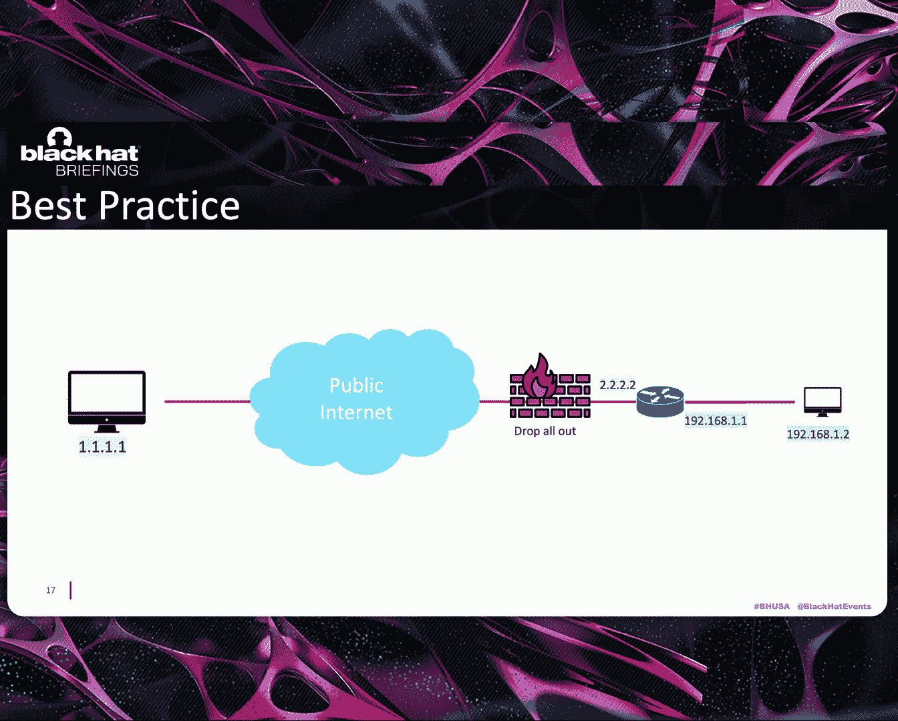
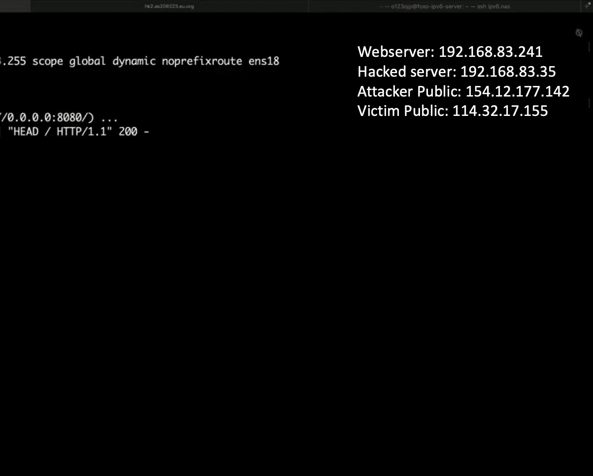
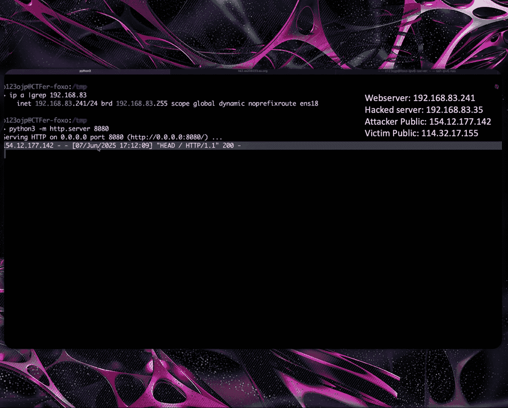
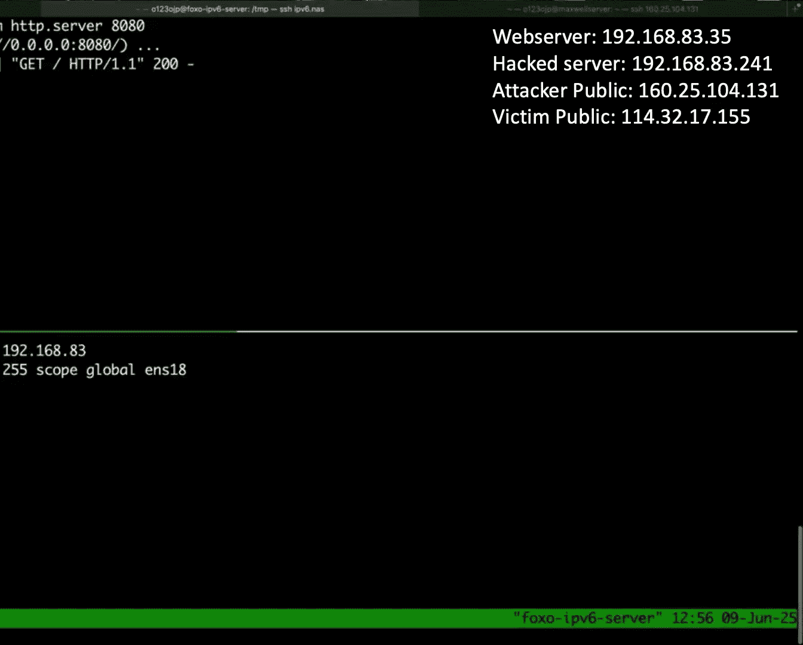
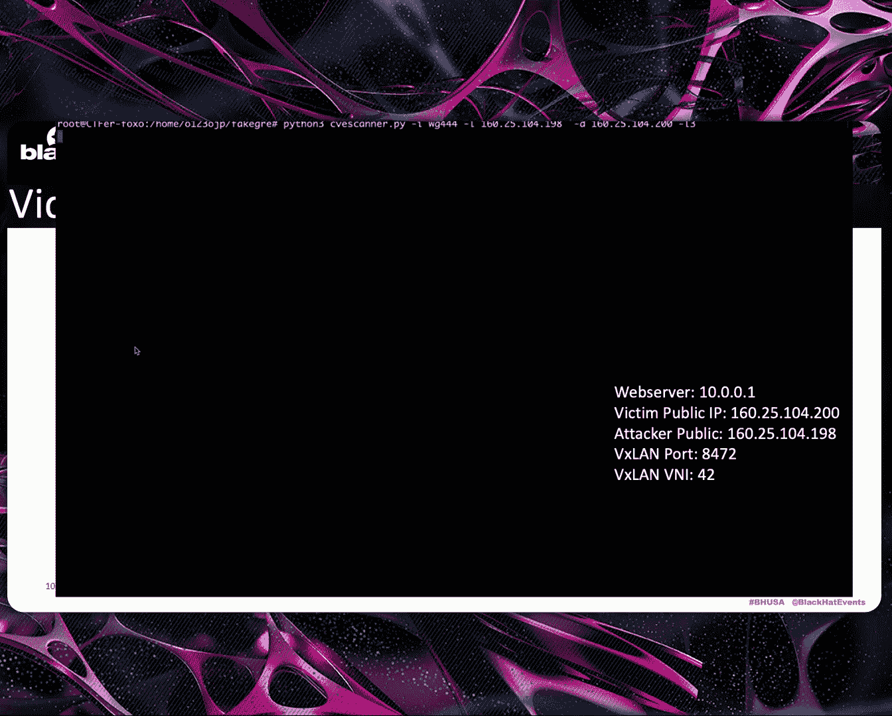

# From Spoofing to Tunneling： New Red Team's Networking Techniques for Initial Access and Evasion [terPgwzk3dc]

Hello， everyone。 I'm from。 I'm Sufo from Taiwan。 and this is my first presentation at Blackhead USA。

 So thank you， everyone from joining my session at Blackhead from Boing to Tling。

 and I'm excited to share some。😊，Ram networking techniques with with you today。

So let's take into a typical day in my I T life See my intra batch server log。

 There's a login from Frank。😊，And there's a login from Bob。And oh。

 there's an invalid login from public I P 9 do9 do99。And then how and why this。This can happen。

 This is an intra server without destination and A T。😊，So as an I T， I just bent the bad I P9 down。

 night down， night down， night。Then， oh， no。 How is that possible that someone can use a public address to a target to target our internal server。

 This is a key point that we are going to discuss in this talk。The presentation will。

Will explore ways of low level network penetrations testing through a lot virus of tunnelling protocol。

 These techniques can be used for advanced timinging exercise or can be blocked before they are abused by the Malitsia attacker in your corporate network。

Before re diving into the details， let me briefly introduce myself。So I'm Su Hao Tong from Taiwan。

 and I'm a writing trade researcher at try Michael。

And Qinhua University graduate and a former hackerser president。

 I loved experiment and playing with networks， and。😊，Network protocols。

 I started this research for fun， but it turned out that it is a great importance to general network security。

 and I'm sharing my Github account where you can find this tool or other material from this research。

😊，So this is today agenda。 First， I'll share some new rating techniques using I P sing and how we can use land for initial assets。

 Then Ill reveal the nightmare of V X land， including internal hijacking and how buggy routing protocols can lead to I P hijacking and even domain compromise。

😊，And finally， I'll wrap up with some key takeaways before moving on to the Q And A。😊，First。

 I want to talk about some source I P movie。Spothing in the wind。

We all know that even in recent year， package movinging is still possible on public networks。

 We twist on that all the address are example address and not any common common public I P。

 an aer with the I P address 2 that 2 that 2 do2 can send a DN S request with a source I P of 3 3 do 3 do 3。

And that does not belong to it。And then when the I P address， the I P package arrive，1 do1 do1。

1 dot1 do one has no way to verify whether the package is sed， a sof packet or a valid one。

 And it will send the DNAN response to the three does 3 do 3 do 3。😊。

So 3 do 3 do 3 do 3 receive a DN response with without making a request。

 This is a typical DD O S DN S amplification attack， and it still works nowadays。Next。

 I'll dive into the company's network structure。 How an I T will do block computers from assessing the public network for security purpose。

For best practice， when a packet sent from a crucial server to a public I P。

When he arrive to the firewall， the firewall will drop the packet。

However， some I T just disabled N A T。The package will still fall out to the van。

And the remote server will see that the source I P is not valid。

It will either drop the packet or respond to an unknown address。

 and the client will not receive the message。So when your code is completed， a mess。

 but it still work。So if we consider both situation together。

 what would happen if we s the source I P address on the Internet。Imagine a writing scenario。

 The attacker hack a company device dot1 do 3。 He can create a tunnel between the CNC server with the compromise device。

 After that， it can create a D N S request through the terminal with source I P is the attacker public I P。

 which is 9 down9 down9 down 9。😊，When the packet arrived， the compromise device。

 it will forward to the company Internet Laer。😊，After that。

 the router will look up its I P table roing table and forward it to the second victim。As we know。

 if there is no fire for the first second victim dot one dot 2。

 the response package will send back to the attackers through the public Internet。

Then the attacker will receive the packet， which there is no evidence that the packet is come from1 dot 3。

 The entire T CP or UDB stream only shows the social I is 9 down，9 down9。

 and the destination I is1 dot 2。So why I R is hard in typical later movement attacks。

 The attacker used the I P address of a previous compromise machine to target the next system。

This means when a alarm being triggered， an I R team could simply use never log to trace the attackers path from one compromise machine to the previous one。

😊，The I R team could find a relevant log on the previous compromised machine and identify the initial of S S point。

And then shut down the entire attack chain by state， by day。However。

 when scooping techniques involved， the source I P in the log will not be the previous compromised machine。

So the I R team will not be able to find theer path。

 They could only see a public I P is attacking their domain controller。Thus。

 the previous compromise machine would not be caught。

 even if the alarm was triggered and it can change to an another public source I to continue the attack。

Overlooking the path， the malicious package source and destination I P only shows 9 do99 and dot 1 dot2。

😊，Thus， no one will know the previous compromise machine is dot 1 dot 3。On the other hand。

 the terminal I P is H T T traffic with a source I 7 7 7 7。 If 9 down 9 down 9 is。

 the attacker can simply switch to another public I P and attack a different target。

 The I team would need to check every router for layer 2 port logs in order to identify the compromise device。

😊，Also， the source Mac address can be forged at the first hop。

And what if the ISP filter package that source I P is a private I。We can use three do3 time，3，2。

3 N A T pass through to enable temporary destination N A T。

 The attacker can send a special packet to 9 down9 down9。

 The N A T router will then create a temporary destination N A T for。😊，1 does  three port 4，4。

5 on the parkly I P port 4，4，5。 It allows the attacker to S 1 does 3 on port 4，4，9 via 9 do，9 9。

Then here's a quick demo。 We can see that that 2，4，1 has a web server at port 8080s。 Initially。

 the attacker at dot 1，4，2 could not access the initial web server via the public I P after。😊。

We create a server and standard a H do 2，3，2，3 packet from the compromise machine。

 We can receive a package from the victim router， and it gave that the destination port to connect to the。

😊，Internal web server。 Also， we can see that the Web log source I P is from a public I P rather than a private I P。

 This create a break point for the attack chain。😊。

Another method discovered by Chi Ming Cai involves smoothpoing a fake TC P sink package from the compromise device。

Which the source I P is using the next target I P address。That one does three。

 and send it to the attacker server。 The source N A T mechanism can be abused as a destination N A T to connect the internal service。

And this， this is another quick demo。 We can say like the device at does 35 have a web server running on 8080。

 Initially， the attacker at。😊。

3，1，3，1 cannot access the internal web server via public I P。 After。

 we s a think packet from the compromise machine。😊。

Using the next target I and pull as the source I and send to the attacker C2 server。We can。

 we can then use the destination port from the smoothing package to connect back to the victim router。

 The S N A T mechanism will allow us to connect to the internal web server。 Additionally。

 we can see that West server log show to show the source I P as a public I P rather than a private one。

 This also create a breakpoint in the detection。😊。

So do we can replace the C2 tunnel with an official VPM。The answer is， yes。

There are many commercial S L V PN solution that can s the source I P from the client as shown in the diagram。

 commercialci S L V P S， like those they suck that cyber 2025 may allow this behavior。😊。

On the other hand。Whether， whether open source VPN solution like Viga and open VPN are affected depends on their configuration。

So here's the initial access。 Do we have a chance to do this without a initial photo in Internet。

 Can we use any existing tunnel。The answer is， yes， again。 on the in in Internet exchange。

 Everyone in is in on the same layer to network。Attacker can set the private network range to the next hub to the router of the company you want to attack。

 Also， we can abuse existing terminal such as G R E， I P， IP or S I T。But again。

 a good firework configuration could call this to fail。

If we compromise the route at an internal exchange。

 we can force the private sub net as the next half to the victim。Company slaughter。

 we can create a connection using our own public I P as a source and a private sum as a destinationsertation。

😊，The Vi route will forward the package to its intranet subnet and respond to the attacker via the public I Ps。

On the other hand， we can abuse excess internal like G RE。G I is a state layer 3 turn on。

 It is widely used because it is easy to set up and only set setting its protocols。

 public I P and G I E interface， I P。Nowadays， there are still a lot of companies that use G R E in their product。

 like Cloud Ma Transit and its customers。They can use between I S or G RE， and I S is saferr。

AW S Trans Gaway also support your internal， but it's only used for internal network only。Also。

 security Week report that A T groups like Sotyphoon create giant tunnel to collect traffic from compromise device。

😊，Lastly are still a lot of company use G E， but we don't know。

So how does the G I E works When a package want to go through a G E。

 the kernel will pack a packet with a G I header and send it over the public Internet。

At the receiver side， the G packet is unpacked and the inner packet is forward according to。

 to the route tin table。 G R E is daies and doesn't provide encryption。

 which means it is possible for anyone can put G packet via public network。For example。

 dot one dot2 want to send a packet to dot  two dot2。Sorry。

 the packet will send to its different gateway。The gateway router will add a header to the packet。

And saying it over to the Puppy network。After the G IE packet arrive at 2。2。2。

 it will remove the G IE header and forward the inner packet， according to its routing table。

And vice versa。So how can we find a dryter， We can use all techniques。 For example。

 we can search for a netflow dashboard like Ado on Google and filter for G E traffic。 This way。

 we can obtain the I P address of both ends of theter。 Other awesome techniques can also help。😊，Next。

 we can use G IE smoothing technique to scan for existing G I。 First。

 we can create a fake G I tunnel using the command provide above。😊。

Then we can create a G I E packet with a smoothof source I P I address。 One does not belong to us。

I send it over the puppy network to the victim。 If the victim has a G I E peer conflict with the G I E package。

Soci I P， for example， oneda1 da1。It will decalsulate the inner packet and process it。

 according to its I P routing table and for the inner package。

So we can create and send many different package with different source I P address to the correct victim here。

😊，If the victim does not recognize the source I P as a known peer， it will drop the packet。

On the other hand， if the source matches one of the victim unknown peers。

The victim will accept the dry packet and forward the inner packet， according to its routing table。

For scanning purpose， we set the destination for the inner package to the victim itself。

So the victim will immediately reply the inner packet with an I ICM response。

Then we can identify the victim to our eternal peer I P address。

We encode information into ICMP aer and sequence field。

 which together can represent all 255 to the part of four possible I P。V for address。

We also create a scanner script on Github。 As you can see。

 when the G I source address matches the remote G I E P address， we can get the ICMP reply。😊。

Then we can put everything together， together get initial S。😊。

Let's imagine a scenario where where the victim 1t，1 dot1 has a dry eternal with2 dot2 dot 2。

 An attacker can forge a dry packet that appear to be sent for 2 dot2 dot 2。

The inner package in DN request sent from the provider IP3 do3 do3。To an intranet network， I P。

When the packet arrive， the victim will trust and use the dry packet because it's claimed to from2 do2 da too。

Then the victim will unpack the G packet and discover that it container DN request。

 which destination is an private network I P。 The victim will then forward the packet to the company's intranet。

 based on its routing table。When the internal DNA server receive the DNAN package。

 it will respond and send a reply through the pipeline。Network to the attacker server。Thus。

 the tiger can interact with the service on the Vs Internet， including those using TCP protocol。

We have create a demo lab。 The architecture is illustrate in the diagram。

The Web server is host on intranet IP P 1 dot2。And the server can access public I P。

 public network via S， N A T。On the other side。The router at I P to one1 can directly access the Internet server。

 Also， the router。Has a public I and G R eternal with the I P address。Wnda， w达， one。Okay。

 and initially， the attacker。At I P dot 1，4，2。Can I access the Internet with server dot1 dot2。

The attacker can create a smooth dry eternal to connect the victim router and directly send traffic to。

The inter intranet network through the fake tunnel。

 Then the attacker can directly access the and interact with the。Internet with server。

Similarly， if the layer 2 turn like G R E tab。 also， if we can lick the victim's Mac address。

 we can also exploit this in the same way。It is common to use the S， N MP protocol to obtain this。

For。TLDR summary。When a company does not configure it firewall and use Sta on encrypt turn。

 even if it's a legacy configuration， and a tiger can exploit this tunnel for initial assets on the Internet。

Next， Ill reveal a nightmare。Dal configuration are B X then。So what is B X land。

The X is a state and un inc layer to turn on。It's packed。

Lair two Internetnet frames into layers for UDP packet。

Each sum is uniquely identified by a name called VN I。

We can configurefi a V X lantern or similar to G R E by sp by giving the remote I local I。

At destination port and V N I。 However， this configure is vulnerable。

Based on the previous configuration， setting up a standard T X lamp pair is easy as usual。

How about hijacking a V X la。Yeah， here's the only different。

The only changes your local I P argument。So why does this happen。

 Does the Linux kernel do not check the source I P of B X land packet。

Why does it accept the explain package with the value V I and port。

 even if the source I P is not configured。After looking at the Linux memo。

 you will see that this is a feature another bug， but this is not secure。

 and it's turned out by default before reporting louder always could not turn off this feature。 Now。

 you can change the setting to off， but it's still on by default。

So what happen when learning is enabled in V X N。Normally。

 when a confi configurefig peer send a V XL packet。

 the the kernel will add its Mac address to the F D B， also known as forwarding database table。

Shown at the bottom on the fly。The next time a packet need to be sent to a destination Ma address that is listed in the FB table。

 the kernel pack。And send the packet to the remote location using the information from the FDB table。

Similarly， when learning more is enable， any B X then。

Packed with a valid V N I and port will be added to the SB table。Also。

 the remote I can be any I on the Internet。Thus， an attacker night， nightda， nightda， nightda。

9 can create a V X package with a Mac address。F， F， FF，F，F。

And thelin kernelel will add this Mike to the list。

Then when the kernel want to send a broadcast packet on the V X then interface。

 you will look up the FB T table and send it to the nineda 9da9， which is the attacker's address。

So what doesn't the attacker know in order to hija the V X。We know our own I。

 but we don't know the victimss I port， BN A， B，N I N or V X than in inner subnet。However。

 all this information can be obtained by a single scan。

An attacker can discover the victim IP P port and BMI by， by sending numerous packets。

Let's focus on how to determine the V X and inner subnet range first。

We can gather information by sending a single V X then packet where the both the source and destination make address are set to the broadcast address。

😊，Then when a ARP requests sent from V X La interface， they will also be sent to the attacker V X La。

Another method involves sending a never Disc protocol packet。

 When a router always receive a broadcast never Disc protocol message。

 it will respond to the broadcasting Mac address with its own I and Mac address。Thus。

 we can send numerous B X package with different BN I M po configurations。

 each contains an inner N DP packet。😊，Where both the source and destination Mac address are set to broadcast address。

When the V N I port matches the victim configuration。

 the victim device will add the attacker I P to its FB table。

Then the victim unpacks the V X land package and see that it is an NDP request。

 The victim router replies the N DP re packet and tries to send the respond to the。

Badcast Mac address。 It check to the FDB table and find the destination is 9 down，9 down，9。

 which is the attacker I I P。So the router will send a package to the attacker。

Then the attack has everything to hija the tunnel。We also create a scanner。

 We can discover the victim I P port and BNI by sending numerous packet。😊，The X has default port，4，7。

8，9， and 8，4，7，2。 And V are usually smaller than 100。 here's the scanner link。

We also create a lab for a V X lens scanner demonstration， which includes a router away router。

And a web server。As you can see， we aim to scan the target at thet 2000。

200， the scanner send numerous packet with different。D four port and different V N I。

 Then we can receive a never discover protocol reply with VN I 42 and port8，4，7，2。

 The inner summit is 10 do 0 0 do one。 Then by simply he create a V X then with the information above。

 We can directly access the V X then Internet。😊，We also scan for in V Xlan configuration worldwidewhile。

 using VNI equals 1 and D4 ports。 We found that more than 900 V X La endpoint response the scanner。

 Additionally， there are 4000 I Ps inside the V X lens subnet。 Some of these are public I P。

 which means we can potentially hi public I P。😊，Some of those are additionally。

 some endpoints replied with numerous broadcast package， Comp with the I sing techniques。

 This could potentially lead to D attack。😊，Lastly， some V excellent packages have source I that private address。

This raise a question。 Why are private address being used as a source I in on the V X packet。

I use theX in credit terminal， so I am safe。The answer is， no。

V X lens will still a set pack traffic in different interface due to the V X L behavior。

 It still can be had against skin。For T L DR， we can handjaag a V X L turn using only three pieces of。

Information， the victim's I P address， the V XM port and the VNI。There is no。

 no need to know the peer I P or the。Internal I P address。Furthermore， if you。

 if your networks set up include public I P interface and VX on any interface。

 it is highly vulnerable。So what can hackers do after hair drinking eternal。

Not only can attacker against access to the Internet。

 but they can also hi I P communications or perform and man in the middle attacks between two site。

Additionally， a attacker can target there to。Network service。

 such as exp R ADV to R C E vulnerabilities。In't that response is challenging because the source I P cannot be trust。

 Moreover， this tunnel often runs rout protocols like B GP or OSPF。 attacker can hijack I P thats。

Are not even transmission through the Latin， such as load of a come domain controller or a E X， X。

 I server。So why is a routing protocol。Its a protocol that router can exchange the router route and network information with other routers。

Routing protocol help router to learn about the network around then and to determine the best path。

For forwarding the packet， for example， router A has。1，9，2 do 1，6，8 dot 1 do 0， slash 24。

 And router C could learn the route from router B by routing protocols。😊，We often see company use E。

 X and to connect two sites with routing protocols。

But when we combine this with the learning feature， we can hija router A's I P address。😊。

Then we can announce domain controllers I P in router protocol with slash 32。😊。

Other router will receive the。And trust the route routing prefix and redirect the domain controllers traffic to the。

Attackcker， because the route is most， is smaller than slash 24。

We had summarize the potential impact of the hijaing different service， I P。

If an attacker hijack the I P of a domain controller and N T L N relateslay is possible means。S。

M B sign is disabled and or AC S E C S C， H is present。

 They can take over the entire domain if the attacker hadja the IP of V， plasma V E or any H T T， P。

 S service。😊，And the original SO certificate is on sign or not valid。

 Use may not notice the attacker then take over the account or false。Service ensure short。

 hard trackinging this service I P can lead to account takeovers， denied of service， DN S。

 head trackinging or even for when compromise。😊，And here's a bonus。

 a bad configuration in companies or S PF lead to I P hijacking。

 This attack factor has been published for years， and we actually observed it during our rating simulation。

 Yet very few people discuss about it。😊，Do you check a TC P down after you get into an intranet。

 If you see this and on the return intranet， it might be vulnerable。

Just like the exportation method described in the previous slide， If you see a hello packet。

 there is a high possibility that you can establish an OSPF connection with the router and hija the routes。

😊，For example， we can hi the domain control at4 thats 2。So let's say， here's some key take away。

Here are the key key takeaway for Bluet。 First， check order on private tunnel in your company。

Networks， if you find any， don't use them。 This is in this including protocols like G I E， II V， S。

 I T， G I， E T and the X La。These tunnel are not secure， and it can be abused by attacker。Next。

 make sure you have have a secure firewall in place。

 Your firewall should filter outbound intra traffic， especially S Y N A K packet。Also。

 check for I spoing within your Internet。Ideally， all I SP should filter outpoofing IP address。

 But in reality， it is really possible。Check if OPF is only enable on port between routeers。

 OPF should not open on unnecessary port。Monior your routing perfi for any anomalies on its back change in the routing protocols can indicate an ongoing。

😊，Track attack。Finally， set up a minimize prefi site in your router protocol， for example， s 24。😊。

Here's some take takeaways for red teamers。First， scan or use o techniques to find victims on encrypted。

Turnal， this can be an entry point into the networks。 Once you are inside the Internet。

 Check the V network set up for smoothpoing。Use source I P smoothing techniques during high risk scanning to avoid detection。

Look for OP parallel message to identify active routing protocols and potential attack paths。

Scan for means configuration via X terminal。 If you find a terminal， hija it to gain initial access。

😊，An abuse routing protocols and hadja I P for lateral movement and previous escalation。

Vtims can continue to looking for more vulnerability protocols in the future。 Remember game。

 find hack。😊，Here's a key takeaway for toolsmaker first。

Iclement and Internet I P smooth command and control tool。

Develop automation tools to test the possible of I P sing within a target Internet。Automation。

 save times。Create automation correction mechanism for mismat between I P destination and source address within the same TCP station。

 Some router will still perform S N A T。 Even the package is a server response。

I toimate the process outstanding sending it does 3 to 2。

3 package or a new TCP package to take a route N80 mechanism。

 especially for IB land filters private I P as a source address。😊。

Develop tools from auto OS PFIP headja attacks。 Finally。

 implement a more efficient G I scanner for global scanning， similar to Hu Ma scan does for TCP。😊。

So here's a Q And session。 Does anyone have questions。Then， thank you， everyone。😊。

Ill go to the wrap up room。 If anyone has question for me， we can meet at the wrap up wrap up room。

 Thank you。😊。