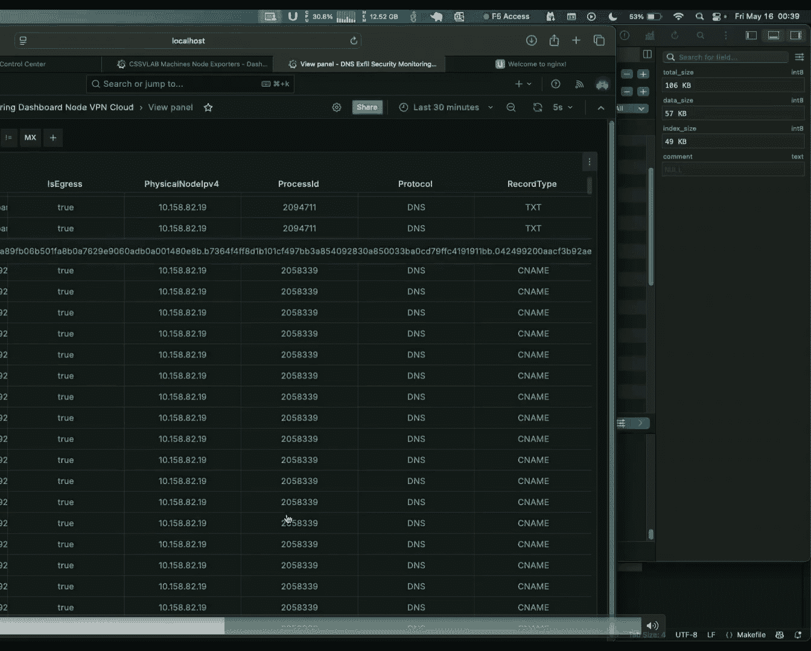
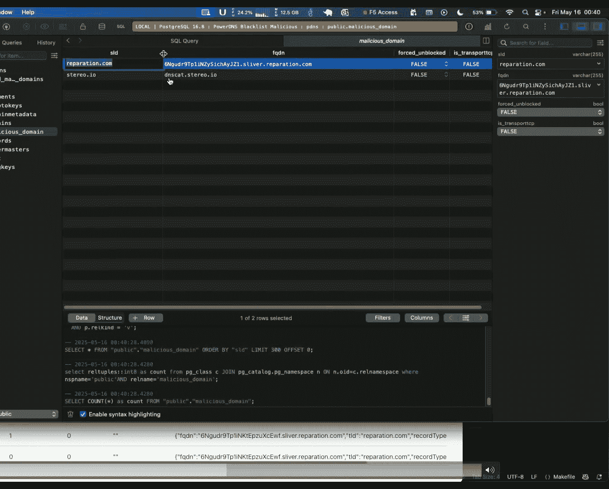

# Kernel-Enforced DNS Exfiltration Security [Yh9C1Xn_ixo]

Hi good morning so I'm here to talk about my research on hunting and disrupting DNS C2 and tunneling inside Linuxux kernel。

 the Staius process and the Staius C2 channels at scale in cloud a bit background about myself。

 my name is Weang Perez， I'm an independent researcher。

 a recent former masters graduate from University of Washington。

 my research interest focuses on Linuxux kernel security kernel hardening EBPF and its intersection with users based AI and cloud to a build endpoint security solutions that solves emerging problems。

I like to structure the talk into four main parts I'll start why DNS is a critical backdoor when it comes to command and control and why most of the advanced persistent threats prefer DNS as a communication channel when they exploit during cloud environments。

Then I will talk about some of the attack vectors and the C2 infrastructure。

 how C2 IPTs are scaling their command and control infrastructure to compromise your networks。

Existing approaches and the challenges for the emerging preventing this emerging attacks and then I'll present our research AIri kernel enforce inpoint security and a cloud deployment architecture how that can be deployed in the cloud environment so that you can come back to your remote scale C2 infrastructures a short demo of breaking down C2 DNS C2 wellknown adversary simulation framework and we conclude with keyT AAs and future direction。

Every time most of the advanced persistent heads， DNS is a preferred choice for their communication channel and that DNS is a preferred tool in their arsenal。

 This diagram shows all the advanced persistent head over the last decade if you could see all typhoon the recent Chinese power APT had DS peakening inside it and it used DNANS for expfilrating and maintaining persistent control There are other As as well like some of most famous like the co bear Russian power AP as well as the ocean loaders which is a Vietnam but government power APT All of them compromise the damages to DNS C2 and Taing or mass。

 they compromise national defense from infrastructure to hyperscales mission critical environments breach data as well as hardware credential set scale as per the unit 42 is 85% of APs leverage DNS for St command and control operations and data breaches as well Why but DNS protocol。

A major blind spot to compromise the networks。 DNS is a foundation and backbone for Internet。

 I would say's every cloud environmentlies on DNS for service discovery。

 and it's the first packet which every LS protocol sense。

 But when it comes to command and control as healthy communication channel。

 it becomes extremely damaging It's unenryptted by default and basically it has logs are rarely monitored on the firewall Firewalls always have the ports open for DNS and the most important factor is stateless and because it's majority on top of UDP can beD control from throw infrastructure。

 This is a diagram how it shows basically standard DNS deployment apology we have the local firewall and external firewall。

 both of them having DNANS boards open。The main attack vectors when consist of DNS are DNSC to DNS tunneling and raw expfiltration。

 the main purpose of all of the three are embedding embedding in exfilrating data inside subdomains of the DNS DNSC2 being the most damaging all of them being done with fileless implant in DNSC2 the attacker embed commands and the main focus here is persistence and advanced to rely in the C4 prolonged period tunneling is similar the only difference is tunneling tunnel the protocols through DNS which are blocked on the fiberwall and raw exfilration is the most simplest it's a simplest single communication it just expfiltates and the mal kills itself once a large amount of traffic is exfiltrated This diagram shows how it works it's a multit process attacker registers a domain with a C2 server once the domain is registered it generates a fileless implanted implant gets delivered on the endpoint After getting delivered it ask the remote C to infrastructure query。

Sensor DNA query is in a beening pattern。 what next command it should execute。

 So it's called as a pullinging mechanism。 The C2 server it passes through the firewall reaches the C2 server。

 the C2 server responds back and the attacker executes that the implant executes that command。

 But when it comes to it's not just excfilrating files。

 this commands are most damagings not just data breach。

 it's the next channel for delivering0 attacks。 Some of the major damaging attacks command and control can facilitate our remote code execution shall code exploits and file corruptions。

 The attackers' purpose here is not to exploitfil data about damage in point and spread laterally in the network。

 there are side channel process abuse and persistent backdoose and put forwarding and pivoting are some of the other factors and specifically when it comes to root totalize one of the A which use this。

But the attacker doesnt has a bigger headroom when it comes to amount of data it can put inside DNS DNS has some specification limit limitations when the amount of data it can be put inside the query section。

Usually DNS allows for a UP， basically。DNS allows you to have to 55 characters Max 127 labels。

 a label is anything between the dot and 63 characters is allowed per level。

 The number of questions are usually one per DNS packet because most of the DNS servers don't allow multiple questions。

😊，And this is a standard or DNS question format how it looks like it has a query name query type and query class。

 but what makes actually DNS packet contain the C2 commands and expecteded data usually attackers are trying to embed a command into the subdomomas they always try to encode and encrypt with different mechanisms some of net bio CRC hex this always adds an enpy in your query name。

Longer excessive labels。 It's an option basically for the attacker to have multiple smaller chunks of labels or or label。

 which is a longer in length。And then finally DNS is a restricted set of SI characters。

 their words doesn't make any sense。 They have non diary tokens and DGA generator style。😊。

But one thing I would say attacker just don't register when it comes to C2 attackers or ET bot networks。

 just don't register a single domain on a DNS resolver or an I provider。

They have they deploy a fleet of servers for maximizing evasion。

 This diagram shows how the C infrastructure is scale and the higher the scale。

 the more the evasion is So you could see on the right， you have all your enterprise networks。

 which can be geographically distributed across different regions。

 You have redirector fleets redirector fleets are meant for evasion。

 They are specifically but used to hide the C2 server location for L3 but it can be thought as a proxy chain。

 and the actual C2 servers are the dedicated C2 servers。

 which registered domains across different domain providers or domain registrars and so that they can have maximum evasion and they categorize themselves as a short base C2 or long base C2 based on whatever theyre beginning pack and they exhibit。

😊，DGA is domain generation algorithm is just not layer 7 mutation。

 it' is paird with IP mutation that makes them more evasive。😊。

That because one eventually they generate algorithmically thousands of domains。

 one domain called blacklisted， they have other domain for that implant to query and each domain usually also has multiple IP address so that the implant can balance itself when querying are sending DNAC to commands。

 and that makes you a static blacklist easily and there's hard coded and algorithmically generated So that's also as evasion mechanism。

 There are four main types of domain generation algorithms time based and seed based being the most easy to detect while worldlish characters are usually harder because of the solar random generators sorry se generators and the worldlish Dgs they use Some of the example are like once you get a monoonic time clock。

 you can easily detect what the next DGA will be but seed is the same ones you grab the seed。

 you can understand what's the next DG pattern it will be but world list is difficult to guess。

Moving on to existing approaches right now， there are two main existing approaches being used。

 First is semipaive analysis and second is passive analysis。 semipa analysis is less common。

 It's done with programmable software switches also which use D packet inspection as a middleware inside the switch and that query if cannot find it closes the packet to the controller。

 it replicates an SDN topology have virtualization works in the cloud but majority passive analysis used and the main factors are anly detection and traffic threat signatures and domain reputation。

 This shows an entire flow of a network in system from start to end。 you have all the endpoints。

 endpoints are sending all the sensors they have at the running at the endpoint they are sending all the aggregated DNANH data that DN data is aggregated and passed as a filter over a specific window that window then runs to a stateless analysis stateless analysis then triggers response。

 which blacklist the domain response policy zone。 It's not always the case。 but because。😊。

no it doesn't have physical access to the wire。 it aggregates it into a log aggregateggregator the same After that it generates runs stateful feature analysis and classifies a machine learning models on it and detects outliers and that's where you saw pipelines and all that triggers and outliers are blacklisted the domains are blacklisted in response policy zones and alerts that trigger and it basically tests the EDR region to start blocking that domain。

😊，The main challenges here are it is slower detection and slower response specifically with the evas nature of the evolving C2 implants because the amount of time it takes to detect something and then enforce the C2 the C2 implant has already mutated and started using a different domain。

 but if it is a zero to attack it may have already executed that command and started a child process or any other thing that that may have already executed a compromise your nodes。

Then again， its less it's kind of a proactive mechanism rather than a reactive mechanism when it comes to C2 infrastructure attacks and robust protection again domain generation and IP mutations。

And if it's a passive analysis that's rarely used， it causes latency on the traffic because traffic is been mirrored and that causes unwanted latency and dynamic threat patterns。

 C2s are not just meant for standard by patterns they are used for dynamic like they have different they use different query classes text Mx different timing St D patterns so that all the static are broken down So the proposed solution and the research。

 which I will be talking about is rather than being a proactive it should be a reactive so rather than the network hunting once the C2 activities and executed。

 let your endpoint engine hunt what's happening and that two hunting should be done inside the kernel。

Atttering 0， where no user land evasion can hide from all these C2 malicias irrespective when they are sending a packet。

bit background how it can be done in Linuxux kernel specifically it can be done using kernel models。

 but specifically done talking about EPf Ef is a modern way of reprogramming the Linuxux kernel in a safe way it is can be thought as a virtual machine running inside Linuxux kernel which allows you to inject runtime programs which get attached to the co kernel subsystems So these diagrams actually show how it works we have an Ef loader that load gets compiled and then bytecode is generated that bytecode gets injected through BPf call it goes through Ef verifier just in time compile optimizes it and then it gets attached some of the co kernel systems are like Linuxux kernel network stack kernel LSM Linuxux security models etc it the main factor here you could see is it has Ef maps and ring buffer or power events these are the factors crucial when it comes to endpoint security This gives threat intelligence to the endpoint agent in the user space what's actually happening inside the kernel So just to summarize it and the users。

Pice can actually contact that EBPF maps and read what it。

 It's a custom by pair bytecode and it CPU architecture agnostic。

Before moving deeper into the EDR agent， I would like to talk about what co kernel subsystems the UDR agent utilizes。

 starting off with a kernel network stack， which is also effort as a kernel data path。

 This shows the standard way how packets actually flow from user space downstream to the network device driver Use space system called the TCP network stack net traffic control and the network device driver This are all the hook points which allows you to inject kernel programs and some of them K probes。

 face points C groups etc。 The main of them main focus for the EDR here is Bps K probes and trace points are attached to process schedules This helps the EDR to hunt if the C to implant is forking itself and spawning child processes it should not eva the detection It should always get a parent what tied to it and also helps in process hall and other shadowing mechanisms C groups socket maps it's used for monitoring DNA socket creations and all that events Tra control utilize space。

Specifically forward。Quality of service in the kernel。

 but this specifically uses deep packet inspection Here's where it drop passessses the DNS questions inside the kernel from the SP also referred a socket kernel buffer and then it runs enhanced intelligence on top of it。

 but EBBF allows you to inject all the custom programs but the runtime integration should not compromise the integrity of the kernel and the kernel should remain the most trusted execution environment in your system and that's where LSM is used LSM is Linux security module its a mechanism which helps in order to ensure that every injected program is verified and integrity is ensuresured and it interacts with kernel keying and Linuxux security module as other components for verifying the integrity with the custom certification authority the EDR agent generates。

I'll talk about domain what I call it as kernel enforced endpoint security and an extension mechanism for DNS。

 It's an agent based endpoint security similar to your sensors running at that end point。

 but its a multilayer security starting off with the user space It has EPPF agent the agent is nothing but a loader which I talked about before which loads the BPF programs it has caches the caches usually hold at top level domains of the most world's reputed domains in the because the C2 server cannot get access to those zone files then it also holds a quantized deep learning model a model is used for data obfucation detection mechanisms and some metrics exporters is used to export all the kernel ring before metrics which the kernel is exporting。

Coming down to the user kernel layer， all those EBPF folks are injected in runtime by the ER agent which I mentioned before and your kernel is resilient now to tackle that and basically you could see all of them are contacting to the same EBPF maps the EBPF maps becomes your system stage stored for storing all the EBP information which each of the program is executing So let's to walk through how it works let's assume that implant C2 implant got infected and it started sending malicious NS packets。

 it send down a DNS query downstream to the access controller it hit the cico layer once it hits the layer the main focus of it is。

What's the process tied to this packet and go and hunt for the parent process to it and make sure that the lower layers of the kernel gets the parent process only it goes downstream and then it hits the network stack in network stack。

 what it does it does。First it does check that is this packet process coming down the packet coming down is the process blacklist state If not it does the deep packet inspection on it。

 It's not always ensure that the kernel restrictions will allow you to perform enhanced lexical analysis that's where it it basically has to option that it redirects or clone redirects the packet where packets are redirected live from the kernel to the user space the EDR agent sniffs it continuously but before doing that you could see it updated the processed tele in the maps before doing that the EDR agent in the user space continuously gets once it gets the packet。

 it knows that corresponding maps have been updated it gets the process process level information and does all the inferencing which is data offuscation detection mechanisms for randomness doing that if it found to be malicious it goes in blacklist process in the APF maps。

😊，This forces the implant to retry so the implant retries and then it again passes through it。

 but now the process is blacklist state it kind of create a trap for the implant and this makes it retry again and again but the kernel is exporting every rich elementtry to the user space and this messes up their beaening pattern if the implant is beacening then it becomesons again with a jitter or exponential back of mechanisms and eventually once everything the EDR agent collected reach behavior from that implant behavior it goes and kills it and the implant is terminated so to summarize its a continuous security enforcement loop happening between the kernel and the user space where the EDR the EBP program in the kernel is helping the user space user space is reprogramming the kernel security alert and that continuous enforcement loop continues until the implant gets terminated or it killed itself。

There are two main modes I like talk about it works。

 These modes are replicated how C real world C2 attacks C2 tools exhibits when their communication is broken down when it comes to the DNS the first mod I talk is active process security enforcement mode this is meant for endpoints which can which which one absolutely no loss no command execution but can tolerate some latency This is a bit brief detailed information So EBPF maps I'll talk about EPF maps。

 other components are the same which I mentioned before the first EPPF map actually holds the DNS query ID as the key is a hashmap and it's stored in the kernel memory and the value is the monoy monotonic time and the process information and thread information The second map holds the monotonic time and the value as a scan Why I will talk why a second map is used same process I through there the packet is sent hits then raw process it does that inference Now it redirects。

et this only works for UDP， by the way， if the DNS is transferred over UDP it redirects the packet and if it's malicious。

 it gets dropped but after the implant agent in the user space reads it it infers through its gass which whether the top level domain are already inferd runs the inference on top of it whatever the wordic is it gets make sure that the packet which came now it gets from the map the first map basically process scan time and the process information and then that information if it's malicious that telemeory visual EBp program the kernel updated is used to track the activity of that malicious implant Po doing that if it's a be in the packet has to be res and that's where it it sends the packet it authorizes the second map the second map is especially used for zero trust reinforcement because when the packet is redirected to the user space。

 the malware should not brute force itself and understand and gets the time next packet will come then secure。

😊，That should not happen So this monodonic time is system nanosecond accuracy。

 which kernel uses nonmascable interrupt safe time。

 so it has precise timing and bru force attack prevention packet is sent down back and now the kernel again verifies whether this packet coming is authorized from an authorized center and packet leaves。

And this process continues again and eventually， once enough telemetry is here。

 the implant is killed。😊，The second mode is it's not always possible to redirect a packet。

 It won't ever work for TCP will cause unwanted congestion and any redirection to a different Linuxux network namespace or a network interface raises an interrupt causing latency So it's not always feasible。

 That's where a second mode I want to talk about。 I'll talk how it works in a state diagram the C2 and tunneling starts the E it hits the traffic controller。

 the EBP program starts the packet inspection on it Now it doesn't redirects rather it loan redirects the packet that is internally kernel cloning the entire packet in the traffic controller and that packet is sent back and also expose the processed teletry Once doing that the EDR agent does a deep learning model inferencing on that clone packet post doing that if it found that like there is some malicious embedded commands inside it it keeps on tracking the excfilration and C2 tunneling attempts in user space it's done in the user space memory basically。

Once tracking everything， the implant again retries same thing happens it closes everything again it finds the event tracking in the user space is implementing eventually it found some behavioral analysis that the same implant is exhibiting multiple patterns the same process by the way it goes and updates a map the EBPF map saying that this process is potentially a malicious one and it should start the kernel should start dropping so now the kernel transfers the EPP program basically get reprograms the network stack and then eventually you could see the EPPF kernel program starts if the process is blacklisted because the implant again retryed now and the same thing the kernel program starts starving or basically starts dropping the traffic again same thing I mentioned masses up there see beening pattern but its keeps on cloning the packet so you have breach behavioral analysis implant retries same thing happens same thing is collected and eventually。

Once everything behavior is analyzed。 All the analysis， it goes and blackish the domain。

 and the implant is scale。Everything of this depends upon the accuracy because the model。

 if the model is not accurate， can eventually cause service disruption。 It can be kill benign pulse。

 So the model uses the dense neural network based data offuscation detection model。

 It first Ill talk about the features。 The Linuxux kernel features。

 These are used for deep packet inspection。 and they are nothing but limits。

 This limit specifies what is the maximum a minimum range you want and anything about that range is considered as malicious between those minimum maximum is considered as suspicious anything below is benign。

In kernel they are actually user space features the features are useful in non lexical analysis they are they are some like again the characteristics which are talked about like about query patterns and lexical measures they are the same lexical features but I want to talk about entropy here entropy specifically used with a channel entropy with the base logarithmic too because。

😊，DNS only allows S key characters as restricted， as Sky said。

I talk about the model architecture but before talking about the model architecture I like to talk about data sets it was 60 million domain data sets close to and it was synthetically generated utilizing ISPL world traffic and traffic from expedrating various files and executing different malicious commands from open source adversary simulation tools。

😊，This is used。 This represents an onx graph。 Orx is open neural network exchange。

 It's a way of serializing deep learning models。 Its meant for faster inferencing a lower memory footprint。

 And you could say its and again， it's coned because floating point arithmetic usually takes CPU cycle。

 So it it is converted to a lower precision for faster to match the speed of the EDR and the kernel processing。

😊，This it is a one input layer， three hidden layers。

 one output layer rather as an activation function sigmoid for binary classification。

But each of these modes can be worked which can safeguard your endpoint from this C2 implant。

 but C2s are like kind of a duall sided。 if you want to safeguard a cloud infrastructure the C2 implant also has to be killed as early as possible as well as your5Os and your cloud infrastructure should be secure so that this remote scaling C2 infrastructure is broken now。

 This is a standard deployment architecture I would like to talk this assumes it's only in one easy but it can scale as horizontally as required So you have all the data plane and the data plane has set off this EPPf agents deployed at the endpoint and before talking about the actual framework strategy I'll talk about a DNS topology usually looks like you have a local authorative DNS server with party with any backend it it can be provider for your cloud or it can be managed a DNS authority server can where a push case if it's done on onpre or any generic。

DB back it has forward it to a recursor， which is a resolver upstream forwarder to the upstream DNS service DNS firewall connected to a network firewall Internet gateway and forward it upstream to the actual DNS resolvers。

 whatever the upstream forwarders are， but your I and I are connected and you have all the same everything ready。

But now these EP powered agents now are running。 and let's assume if I walk through this flow。

 let's assume this agent， this one data plane node got infected with this C to server。

 it started sending malicious packet and let's assume this is the I sending。

 and this is the domain X dot com and some random thing it's asking what it can be doing command running commands doing that the implant whichever EDR agent。

 whichever mode it's running inactive or passive it it kills it but it gathers all the rich tele it exports everything in a form it streams everything collected from the kernel E ring buffers into into a message broker a message broker can be a topic it can be even a queue anything managed cloud provider service suppose post that there are set of controller node this are specifically used for dynamic domain blacklisting to combat Dgs they consume that and then。

😊，Controller servered and blacklist domain in our visit dynamically post doing that it it goes ahead and also ask the upstream DNS resolver where is this located。

 This is specifically meant for reverse hunting to analyze the redirect's nature what's the redirect IP nature how is the C2 infrastructure pulling and proxy chains are working when sending different IP first that it sends back the controller streams back all that and then each of the data plane EPF agents consumes those events and they update the malicious caches which I talked about the user space cache which is and it also injects security filters inside the kernel So your entire data plane now got safeguarded from X do co domain and there was nearly no data loss and you combat the D and even though of that implant mutates and migrates its not going survive because that domain is dynamically getting blacklist but the benefits of this is it says that dual layer defense for example if one of the endpoint is running a lower version of Linux。

Connel which German supports EP features， or it's running a different O S。

 You made the DNANS server resilient and that DNA server got reprogrammed。 So eventually。

 if other O S is， that same DNA server is going to protect your endpoints。😊，And then finally。

 the bridge telemetry is exported by the EBPF agent to your same。

 so everything is exported to the same。 so I'll show a demo right now of slaver sver or bishop f sver tool and for that demo purpose I have on premiseise infrastructure and Kafka is been used as a message broker and I have already generated and power DN is used then DNA server I already generated all the domains in in the domain DNA server and it's using word strategy So after doing that I start the sver server I show some of the attack first and then Ill start the agent so I just start the sver server and I then generated the implant I just transfer the implant it can be done through any intrusion infiltration mechanisms。

😊。

Post that the implant started running and you could see the logs here。

 all the it started querying and you could see the commands are being embedded like this on repartition dot com domain。

 Now， like once it's done I will start first with selecting the session So I'll start the session I started executing remote commands on it。

 Some of them like get you another remote commands I'm executing I'm also showcasing a port forwarding mechanism。

 So I'm for forwarding engineering server on 30 to00 port So yeah that forward that。

So it generated a large volume of dN traffic because it's a station based。

 not a beacon based implant。Hish。First。Anyways also once that is done I start a reverse shell on it and once reverse shell is started I start the endpoint agent once the EDR agent starts it injects all those EPP programs once the EPP programs are injected immediately started detecting everything and it started asking the deep learning model what should be done for it first asking it you could see it will start now the implant started getting query errors immediately because the kernel EDR agent started dropping it first so you could see there's a query error then this will again force it to retry。

啊。Yeah， so again it rerries， the behavior is captured here and you can see its 409711 is the process which is actually doing that attempts。

And eventually you once there's enough telemetry， the EDR agent goes and kill it。

 but it captured all the rich telemetry。 So you it's it's exportding right now to prometheus and explode visualized Sufaa。

 It can be any same or E Kt anyt。 So it tracks how many packets were redirected live from the kernel。

 It tracks per process level information。 like for this process for this thread it was it was expedrating four times how much time the process was alive。

 So you could see it shows the process alive time as well。😊，As well as each。

 each individual packet it was trying to send was actually seen in the dashboard with E PPF and ringingow everything exporting it in real time。

And everything got exported into Kafka this is the same thing basically and it got black domain。

 got blacklisted， as I said， R is it is party post， so it got blacklisted。

So just a metric about data response speed， how fast is this when it compares with and precision So when talking about the response speed it it is usually for acting more for 10 expration attempts the X axis shows the attempts per at and Y axis shows the time it take to respond to it and an average takes t26 microseconds for every expration C to at And this shows them actually this shows。

The F1 scope precision recall graph the precision for this model was around 99。

89% and the main focus here is to reduce the false positives soci0。

7 was a threshold kept as a binary classification anything about that is malicious。Next steps。

 These are the steps which are actually work around right now for this project。

 which is right now it work for DNS but Im currently working on for TlS finger printing where TlS can be done in two ways one is user space Tl most of the TlS systems inside the user space。

 but there are other encrypted tunnel mechanisms like viaguard and E both of them are done through core kernel components So attaching TlS finger printing mechanisms through APF can help hunting down that process correlation。

 Well this is the next advanced mode I would say， for example。

 this is useful if the implant was initially trying to send through DNS and then it started sending through Htps。

 you know the process in the AP map。 you know the deep system teletry process inside happening in the kernel So that can be correlated。

Continuous model evolution。 The model can easily get absolute with a new data obfuscation。

 If a new obfuscation comes， which looks very much similar to like normal English words in that case。

 there there's continuous learning and detection confidencebased learning approaches。

 but specifically we want to talk about G plus LM G specifically for poisoning so that the more obfuscation formats。

 the model can learn and LSTM is for behavioral analysis specifically right now the behavior is just like you have three or four continuous attempts for process go and kill it。

 but there can be behavioral analysis from the kernel B mass done through LST and R approaches and finally Ddos protection there's ghost attacks and flood also as an tactic being used So EP can be injected over the entire kernel network So it has a support for data path over the network device driver which is the very lowest layer of the network kernel stack you can have Ddos protection mechanism so that it inherently just。

😊，It becomes an endpoint security。 It becomes an endpoint security。

 Englishgress endpoint security solution as well。 So it just doesn' prevents exfileration。Key takes。

 When AI is paired with E BPF， it matures your EDR。Because EBPF helps you to reprogram the kernel。

 it helps you hunting deeper system telemetry and it eventually matches your user space ADDR with richer behavioral metrics and it can even when paired with AI the dynamic kernel reinforces which the AI can put them all can EDR agent can put makes it resilient。

Finally then talking about the DG breaking down DG kernel driven EDR and cloud 5walls So I think like it can be when if you want to break down the remote C to scale it has to be like a bottom of approach where your operating system makes the EDR mature EDR makes your same mature and that same eventually 5wall and that 5walls dynamic blacklisting for L3 and L7 filters on the 5wall makes your 5Ws intelligent and your cloud network is secured from this remote mut you C2 infrastructure irrespective they change their domains or they change their IP address still the infrastructure is protected at a scale。

And finally， this work because DNS is unencrypted and even though for example。

 DNS over TlS is one other encryption like HTps， the most preferred one or viaguard for example。

 in that scenario you need behavioral analysis it cannot be done just purely on lexical analysis on because it may rise false positives that way here also the EBP and a conal enforcement can help to mature your S the more deeper system telemetry your ER agent exposes。

 the more faster the S mature and you saw pipelines become more faster to prevent this encrypted tunnel attacks。

😊，Thank you for your attention and listening to my talk we can reach out to me through this email the framework code base is open source and can be found here as well as a white paper this is a graduate thesis being published so it can be found here if you have any questions I'm open to answer them。

😊，Thank you for your time and wisdom。