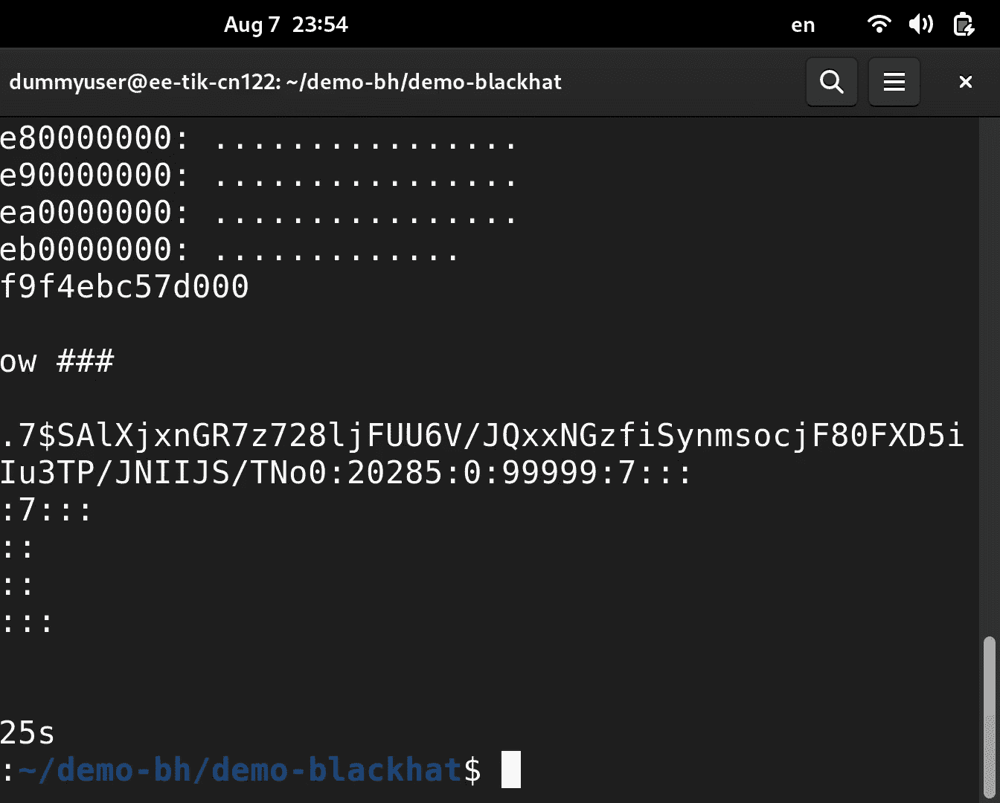

# Leaking Privileged Memory From Any Intel System Using a Microarchitectural Race Condition [ULXuhxj-WgA]

Good afternoon， Blackhead。 I hope you are doing well and welcome to our talk on Ra for privilege。

 where we leak arbitrary memory on any recent intel system using a micro architectural race condition。

😊，I'm Sandra。 I'm a second year PhD student， and I've been doing most of the analysis on this work。

 Im something about me。 I like rocks， both the ones you can climb on and the ones you that can think。

 And while I wanted to do actually， while I wanted to build defenses。

 I ended up attacking because it's a lot more fun。😊，My name is Johannes。

 and I'm a Ph D graduate from the same research group as Sandro， Commec at Zuric and。

I've been exclusively focusing on speculative execution vulnerabilities。

 including ones such as red bleed and phantom speculation， like branch type confusion and inception。

 which is also known as S， R S， O。And so we' are here to talk about a new one。 Oh。

 there another person involved as well。 But let's dis regard him。AndBefore we get into this。

 I will tell you a little story about Intel。So， back in 2017。Intel called for an emergency meeting。

 and they were calling people across the industry， from across the world to come to an in person meeting。

And it was regarding a new type of vulnerability class。

 You can even think of it as a new paradigm of exploitation that emerged。

And this kind of vulnerability class had this capability of just breaking through all kinds of security boundaries。

 such as those enforced by the execution environment。

 Also those enforced by the operating system between， for example， user and kernel。 And finally。

 also the， the security boundary between the guest and the host in the cloud。And so。

This was a little bit of a problematic situation in particular。

 because it was the vulnerability was inside the Intel processors。 In fact。

 it was inside all X 86 processors。 But Intel at the time were essentially dominating the market of client and server CPUs and。

While I wanted to get some information about what this meeting looked like， I。

 it was difficult to do so。 Maybe it was a secret meeting。 I hope not， but I fitted in。

 I filled in the the， the blanks with my own imagination。 So here's like a slightly untrue。

 untold story。It might have looked a little bit like this。 So in the corner。

 we have like the neckpeard， open source， Linux people。And then we had like。

 maybe some unknown attendee arguing to use this evil to do good rather than fixing it。

 Then we had cloud browser or vendors， CPU vendors and people from across the industry。

 And then we had Intel。 And what was this vulnerability that they were here to discuss how to mitigate。

 Well， it was specre。And this vulnerability is inside the micro architectureitect。

 and what is the micro architectureect。 Well， it's part of the CPU。 In fact。

 this is a AM D core here， but they all looked more more or less the same。 So disregard that fact。

 So here we have all the different course。 and here's one individual core。

 And what we see here is essentially the microarchitecture。

 And the key components that we need to look at here is branch target prediction or branch prediction。

 and also caches。 So we can simplify this view a little bit。 and just look at the tube like this。

 So they part of the CPU core。 And as you know， programs are executed by the CPU core。

 And as they do so， feedback is recorded in this micro architectitectural structures。

 So every time we have a branch or jumpy structure。 once we get a target。

 we cache that target in a branch target prediction structure。

 Similarlyly as many of you probably already know when we have memory operations。

 we cache the memory。In the CPU cache。 so we can later do fast lookups on it。

 And it's the same for branches now。 So now we can actually predict the branch target without waiting for the actual target to be derived in the program。

And these structures are shared across programs。 In fact， they also shared across privileged domains。

EAll privileged domains。 Also the ring-1， as it sometimes gimically is called APA。

 the virtual machine manager or the host。And it's important now that our program is not receiving information from other programs and other privileged domains。

 And of course， this is， this is not possible with memory operations because the Lvo cache the caches are tagged by the full physical address in a way or they are tagged in a way that we cannot have collisions This is。

 however， not the case for branch target predictions。

 because those are tagged or address by virtual memory address。 And that we， of course。

 have one for each individual program， one for every guest and so on。

 So here we have collisions or aliasing。 And what can happen now well。😊。

She asked like a CPU designer， what's the point。 This， this is not the problem。

 It's like actually a design choice。 A prediction is， of course。

 a prediction which means that it can go wrong。 and what're supposed to happen then， well。

We theres it's managed。 So if we have mis mis predictiondis， we get a control flow that is incorrect。

 we can discard those incorrect instructions。 However， so here we have， for example。

 illustrated like a mispredicted bunch of instructions。 However， these operations。

 although they will be discarded， they will still leave feedback into this microitectural buffers。

And so how this was exploited in the spectral attacks is by reverse first inject a prediction。

And then we， we， we prime the cache in a way so that it's set up in a known state。

 either by accessing a lot of memory or flushing a lot of memory。 if you can do that on the platform。

😊，And then we， we switch to the victim domain。 In this case， we target the system the O S kernel。

 doesn we use a cis call。 And now we're executing in the O S kernel。

 And there is probably going to be a jump here。 And if we have injected this branch target prediction from the program in the correct place。

 we can actually get a mis predictiondiction with a prediction that comes from this program。😊。

And this means that now the program can actually hijack the speculative control flow。

 So for a short time， we can execute arbitrary code within this victim domain。 and we， we。

 we target a piece of code that we refer to as a disclosure gadget。 And what this does is that it。

 it reads some memory。 And then it does a secret， dependent memory access using that secret。😊。

Thereby， we are transmitting information back to the attacker。So depending on what information read。

 we touch a different part of the cache。 And it may look very simple。 You just need， for example。

 two instructions here。 So we read， for example， from the pointer in register R into。

 into a register。 and then we use the value as as offset in another into another memory buffer。

And these， if they can be controlled by the attacker。

 which they most of the can of many of often can be。

 then we can leak arbitrary information from the system。

So what the program now does when it when it takes over control is it can check the cache for hits and misses。

 thereby the dos information about what was in what the secret or the piece of information that the privileged domain touched。

So this was a problem that they needed to solve here。

And Intel took the responsibility of coming up with a solution。 And what the first had to。

 what the first proposed was called indirect branch restricted speculation。

 And it was a best effort mitigation to deal with this problem。Because instead。

 they can just recall every single processor they made。 No， So instead。

 they had to do the best they could。 And this was not very well received by the open source community。

 In fact， you can read the mailing lists， and you can find Leno Storvald himself shouting at people that this is garbage。

 This interface is misdesigned by morronons。And。But the long term solution that we are using now is called enhanced rash restricted speculation Indirect rash restricted speculation。

And this means that we don't need to touch the software as much。 So now everyone we happy。

 All the executives were patting each other back and， and telling each other that they do a good job。

 Good meeting。😊，Made some real progress。 You know， what you do in， in person meetings。

So what is E I B S， Its， you can think of it as a knob。 And if you do。

 and if you do model specific register right to a speculation control register。You can toggle this。

 And it's like a set and forget operation。 So once it's set， you don't need to touch it again。

And what it does now is that it adds some more information to predictions。Sp information。

 whether it belongs to the hypervissor or if it belongs to the kernel。

And we refer to this as a prediction mode。😊，So thereby， this is no longer possible。 Now。

 there will be a prediction mode mismatch。 So this branch operation will not receive that prediction anymore。

 So we're all good。 But， of course， we should assess and see that this actually works the way we。

That we have been told。 So we make an experiment。 We inject the branch prediction。

 Then we set up the caches。 We prime it， and then we switch to a current module。 We just to。

 to switch to a previous mode。 We just interact with it via the aoccal interface。😊。

And here we trigger a mis predictiondiction。 and we try to transmit some information from our kernel module back to the。

 to the unprivileged domain。 And if that works， then we can say， yeah， then we have a signal。

 And then it's all good。 So， and this situation works where we are all in the same privileged domain。

 But when we add this extra piece。Of code， then stops working。And that maybe is good news。

To we were trying to disable enhance diabetesbe。 So we try we make sure that if we don't touch it at boot。

 and it still doesn't work。 So this was a bit puzzling。 The question now is like。

 is it has been like secretly turned on by firmware。

 or is it actually something that we do when we add this kernel module that breaks the experiment。

 If we don't really know whether whether it's E bear working or if it's we just screwed up somewhere。

 It could be the problem with injecting a prediction， It could be a problem with triggering it。

 maybe it depends on the previous domain， Who knows。But there was a case that was quite intriguing。

 And that was on a more recent processor。 here we found actually， occasionally a very cloudy signal。

 Once in a million， literally， we would get something that resembles a signal indicating that it worked。

😊，But even when it enable and enhanced W， it would still work。 So it didn't make us any wiser at all。

 And at that time， I felt like a bit fed up with all of this。

 And Sandra just started out as a new PhD student and what you do then is that you just take all your work。

 dump it on his desk， and just ask the question like what is going on。 Yeah。

 so I was just starting out with my PhD。 And I was looking for a first project。

 Johannes gave me this cool thing that at the time we were not sure whether it was maybe a hallucination or whether it was actually something real。

 So let's quickly look at what he gave me。 He gave me this experiment。

 where you first tried to inject something into the predictor， then you prepared the caches。

 then you go to the kernel。 You trigger the mis predictiondiction。

 You try to transmit something that you can then measure to actually know whether your attack or your experiment worked。

 And at this point， I had like two options。 I could either find out what is going on。

 Ex it and make the signal strong，😊，point it was really weak or I could build an attack because when you have an attack。

 you know something is wrong， whether you fully understand it or not， right。

 But I had absolutely no clue what was going on here。

 So I was trying different things and whenever I touched anything， it would break。

 and nothing would give me a more reliable signal， and what I do at this point when I was getting really desperate after over a month is I create hundreds of experiments like literally hundreds of experiments that have tiny changes between them and then I see if the output changes and suddenly we we got one experiment where we actually get a strong signal。

 which means somehow our injection is now working。 and this didn't make any sense for me at the time because what I did here is I moved the preparation of the caches into the kernel。

 which is absolutely nothing to do with the branch predictor。

 right these are two different components。 So I was no wiser。

 but at least we had an experiment that showed them much stronger signal。 So I did the second。

Desperation play you can do in this situation， which is turn everything into handwritten assembly to reduce noise that might be interfering。

 right， And what I noticed at this point is that there's a ci call involved here。

 Now that it kind of obvious， right， He said， we're using Iocal。 This is a system call。 Of course。

 there's a involved there。 And it never kind of trigger the reaction in us because the system call is also not supposed to have anything to do with branch prediction。

 right， And but it is one of the very few things that changes between those two experiments。

 So we thought， well， maybe， for a unknownknow reason。

 this system call has something to do with our experiments。

 And I started to just bam cis calls everywhere。 In fact， I just get P Ids wherever I could。

And it turns out this somehow makes the original experiment work。

So this is how you get a strong signal。Yeah， and that made no sense。 But at this point。

 we were wondering， okay， what if a system called somehow connects with a branch target injection and makes it work again。

 despite intel mitigation。And how we would test this is we started inserting a delay between our branch training and the system call。

 because if， if there's a change， depending on the delay。

 we know there is a connection between the two。 and we can actually plot this nicely， we have。

 we have to successfully rate and the delay。 we just use not instructions。

 and you can extremely clearly see that the injection works。 if the delay is very short。

 And if the delay gets long enough， the injection will break。But what could cost this， Why。

 why would this be happening， Because we still don't know why a system call has anything to do with branch prediction。

And we found an explanation that we try to verify with different experiments。

 and they show that this might be the explanation。 But， of course。

 we don't get Intel's hardware description， right， So we cannot fully verify this。

 But this is what we think is happening。 So when you're executing a branch and it is training the branch predictionor。

 we usually just show this nicearrow and po there's a prediction there。

 But that's actually what happens in hardware because the hardware actually needs to collect information and and make this prediction store this prediction somewhere。

 So what we found out is happening on Intel processors is there can be quite a long delay。

 And we imagine this like a factory or something where you have an assembly line。

 So this prediction is started when you execute the branch。

 But it first needs to collect information about the target。

 maybe it has to collect information about the branch type or it has to find an eviction candidate in the branch prediction data structure where it can actually store this prediction。

 So this can take quite a long time on。😊，Until it is finally inserted into this predictor。Now。

 at this point， you might start wondering， well， what could happen if we change the privilege while this prediction is still inside this queue。

So this is what we think the system call is doing here。

 So we switch privilege to the operating system while the prediction is inside the queue and the processor。

 either it doesn't track the privilege from the start or maybe it， maybe there's a switch in wires。

 But for some reason， they now take the privilege we are currently in and store it in the branch target predictor。

 And this is how you can inject a prediction。😊，Now， you might be wondering now， well。

 Intel has built this very nice secure feature， right。

 And could it really be this easy to get around it。😊，And what we think Intel was doing here， right。

 it was trying to prevent us from injecting a target。 And， in fact， it is really this easy。

 If you put a system called right after training the branch predictor， you break Intel Yeah， I B， R。

 S。 So this is how you break it。However， this is not all， right。

 because there's a lot of other steps involved that you can see here。

And another step I would like to look at is at the triggering step。

 because you actually need to convince the victim to use your prediction， which in some cases。

 is actually nontrivi。 And it really explain the observations Johannes has made earlier。

So when we look at the processor， we don't just have a single predictor。

 We actually have multiple predictors that try to make more accurate prediction predictions。

 So we have one that is instruction pointer based。 We have one that is history based and the history based predictor is more accurate。

 which is why it takes higher precedent。 So the CPU will use the history based predictor whenever it can。

 And unfortunately， turns out this one was not vulnerable to the attack we were building。😊。

Only the lower precede predictor was vulnerable。 And this creates an interesting challenge because now we have to convince the CPU to use the lower precede predictor。

And this is actually the reason why initially， we didn't see any signal on the older processors because they were。

 whenever the prediction injection actually worked， they were still using the， the。

 the other predictor。However， on the newer processors， there's a new feature。

 So branch history injection was a previous attack that attacks the history based predictor。

 and Intel built the mitigation。 It's called B H ID S。 It。

 it stands for BH I disable in supervisor mode。 So it mitigates the attack in supervisor mode。

 And it was not documented what this feature is actually doing。 So we analyzed it。

 And it turns out what Intel does is it simply disables this predictor。 So it just turns it off。😊。

And we found this was kind of funny because this means that a mitigation to a previous attack actually makes our attack really easy。

😊，Okay， so we've looked at all these steps。 and now let's build an attack out of it。😊。

How do you do this， Let's quickly look if our system is still available。Yeah， we're still connected。

So what we want to do is we want to have a user space program attack the operating system。

 And how do we do this， How do we show this， It has become kind of a a tradition in this field that we would do it by leaking E TC shadow because an unprivileged user doesn't have access to this file。

 It stores password hashes on Linux。 What do we need produce， We need local code execution。

 which you might say is a big us， but it's not actually that big of an us， because you have browsers。

 where you have local code execution， or you might have something like a shared continuous integration runner or some function as a service systems use this kind of model。

 And we also need to know the kernel image， which you do on any standard operating system， right。

 Uundtu using the standard kernel。 You can just download it。😊。

How does an attack work inside the kernel， What we want to happen。

 We want some indirect branch instruction to go to a disclosure gadget and then load some secret and encode code it into shared memory。

 right， we've seen this earlier when Johannes explained it。 What do we need to do for this。

 We need to analyze the kernel。 We need to search for an indirect branch。

 We need to search for a disclosure gadget。 And then we need to search for them again。

 because kernel address space layout randomization will put it anywhere in memory。

 not anywhere in memory， sorry， it will put it in a random location in a randomized one。

 And then we also need to find the secret in memory and some shared memory where we can actually leak it through。

😊，Alright， how do we do this At first， First， we have to analyze the kernel。

 We look for something like this。 It's a call to a function pointer。

 which compiles into into an indirect call。 We found it in the key control system called。 There's。

 loads of others。 But in this one， we control two registers。

 the buffer and the buffer length in this case。😊，Then we need a disclosure catch it。

 It looks something like this。 You probably won't find it literally like this in the kernel。

 but there is， there can be something that that is compiled to assembly that does the same thing。

 So we wanted to load the first the first register value。

 And then we want to add it to the second one and load from that one。

This are the instructions that Johannes showed you earlier。This is easy。

 You can just scan the kernel for these things。 We also publish the scanners。Alright。

 now we also have to find all these things in memory right that I told you。

 And these are quite a lot of other steps。 What do we do now， We use the tool I showed you earlier。

 So what this tool allows us to do is it allows us to inject the branch prediction into the kernel and then have the kernel execute essentially arbitrary kernel code for us。

 And we can use this like a hammer and turn all the other problems using group first into nails。

 whether it's a reasonable choice or not， and we will do this now， just to show that we can。😊，So。

 for example， when we are looking for all the gadgets inside the kernel。

 the call and the disclosure gadget， we can just hit places where the kernel might be and look for collisions in the branch predictor。

 I cannot go into detail here because we don't have the time。 But if you want to know more。

 you can ask us later or you can read the paper。😊，Alright， so we know where the kernel is now。

 And this gives the location of our ga is here。 Then we need to find the shared memory。

 which we will use to actually leak data。 This one we do by just hitting group first again。

 all the locations in memory where it could be。 And once we get a signal。

 we know we have found our share memory。 And the same thing， essentially， we do for the secret。

 So in this case， we leak E T C shadow， right， it starts with a known string。

 So E T C shadow on a botu if you set a password will always start with these characters。

 So we can just search all the pages where the secret might be located and look for these characters。

 And once we found the secret， we can leak it using the same strategy using our tool that now is able to leak data。

😊，Cool， so there's been a lot of theory。 Let's look at the real attack。

 So this is running on a research server。 So let's hope the SS H connection doesn't。

Domy， this shows some configuration。So， for example， it shows that we are on a 13 gen whos。

13 gen Intel processor。 This is Retor Lake。 It uses the newest Ubutu L T S。 This kernel is now old。

 It was the newest one at the time where we did this research。 It has enabled the mitigations。

 And we don't have access to the pe file and we also don't have pseudo right。 And then we can。😊。

Run our attack。And let's hope it works。And this is ETC shadow。

 or at least the start of it with the root password。开始。It might have gone a bit quick， but in in。

 in the essence， these are the steps， right， we play break currently as large。

 and we search for the reload buffer， and we search for the ETC shadow。 And then we。

 So we've seen now。

A case where unpre es information from the O West kernel。

 But this is just one secured the boundary out of many。And， and this is the CPU。

 There is a fact that it doesn't really care about what。APri boundary that we' are talking about。 So。

 yeah， this one， we can compromise。 But also if we wanted to。

 we could also target the host if we are in a guest context。

 And this is probably the more scarier variant。 And we talk a little bit about this in the current in the paper。

 Theres also a recent blog post by Google bugg hunters that show that this is quite practical。

And it came out today， actually。 So。 And also， when we switch between virtual machines。

 So switching VCbu， there's another barrier， a security barrier that' called an indirect branch prediction barrier and。

Guess what？ This one is also broken。 So it simply is the case that while before this。

 if we have new predictions coming in， while this branch prediction barrier is executing。

 those predictions will be added afterwards。 So that breaks IBPB as well。And now。

We traced back how far we could find this vulnerability。

 So we originally found it on these ones that had in silicone mitigation about this other vulnerability branch history injection。

 But once we figured out how to target the vulnerable brancht predictor。 guess what。

 then we could go further back。 We could go all the way back。 In fact。

 to the first CPU that had in this in silicone mitigation against Specter。

And for those that didn't have it， well， they still had the IBTB operation。 And oh， by the way。

 processors that were not launched yet turned out also to be vulnerable。

 So that sucked for Intel and。Also， those that were even older that didn't even have this E IBRS feature。

 They were also vulnerable。 We could see that by looking at I P， P B。

And we just traced back to the oldest one that we had in our lab。 and it also has delayed updates。

 but doesn't have any in silicon mitigation。 So yeah。Now， the question is。

 what should we do about this。And。We， we collaborated a little bit with Intel。

 which means basically Intel gives us a black box and ask us to check whether our。

 whether our POC still works。 This black box is known as microcode。 We don't know what it does。

 but we tested it， and。Yeah， it fixes the vulnerability。 Well， it fixes our po。

 But because it's my record， because it's all encrypted， we cannot verify exactly what it does。

 Maybe there is a way to make it work again。 Who knows。so诶。Yeah， so with this， we conclude。

 we found a race condition that we demonstrated to you。

 and it undermines the long trusted E I B S mitigation。 and actually also the IBPB mitigation。

And the second one we want to con thing we want to conclude with is this whole spec thing is a kind of cat and mouse game。

 It's been going on since 2018， at least we keep finding new things。

 And we think it's not too late for people to jump on the wagon because this is not going to be over very soon。

 And it is somewhat reminiscent of all the memory exploitation vulnerabilities we've seen towards the end of the 19 hundreds。

And lastly， we think we have to access the assess these black box mitigations that hardware vendors provide to us because we start to see more and more software。

 like vulnerabilities in them。 These are vulnerabilities like type confusions。

 There's race conditions。 and there's uninitialized structures。

 which you all have seen in software before， right。Yeah， so with this， we are through with our talk。

 Here's a cure code。 If you want to know more about it。 It leads to our website。

 There's some information about this whole research。 There's our paper。

 There's a link to the Github where we publish all the artifacts for this。

 And I will also upload the exploit we've show shown today because it's 10 times faster and the one we did originally。

 because we wanted to look cool on blackhead。😊，嗯。Yeah， so with this， we are at the end。

 If you have any questions， we have one and a half minutes left to ask questions。 Otherwise。

 you can come to us afterwards。Thank you。Quick question。

 Yesterday was actually the 40th anniversary of the Intel 386 being released。 That's a while ago。

 It's probably been about 30 some odd years since the Pentium Pro came out and they started doing the sore branch prediction logic。

Is it time to just kind of look at the M1s or other chips and so forth。

 It may not have these problems。 or is this just gonna be something that's gonna to hit everything。

 Oh， it is hitting everything。 Don't worry about that。

 there are papers on Apple M1s and ultimately all processors need to speculate in order to efficiently use the execution unit and use all the resources in the core。

 So this is something that is necessary to have performance processes。

 So we have the similar issues there too。 It's a little bit more scattered when it comes to arm because they have every all the licensees doing their own mitigation。

 which could be which could be a problematic thing， but makes it little bit more work to assess。

 but yes， we have the same issues there。 not these particular ones， but yes。Great。

 I think we have to wrap it up time wise， but we'd love to talk to you， I guess， off stage。Cool。

 thank you very much。 And have a nice off evening。😊。

