# No VPN Needed？ Cryptographic Attacks Against the OPC UA Protocol [OtTiz0Xvyw0]

Thanks for the introduction。 Thank you all for coming。 My name is Tomte Fortz。

 I work for Bureau of Ferita Cybersecurity as a penester and security specialist。

 and I'm going to talk about OPC U A。 First， I'll give a brief outline about what this protocol actually is。

 talk about the cryptography being used within a protocol and to vulnerabilities that I found and how they can be exploited。

 followed by some conclusions。😊。

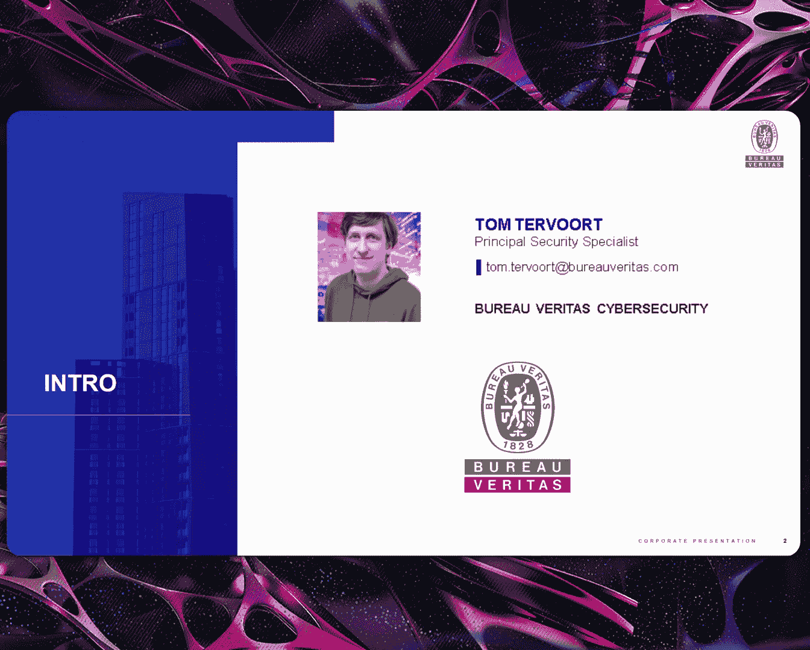

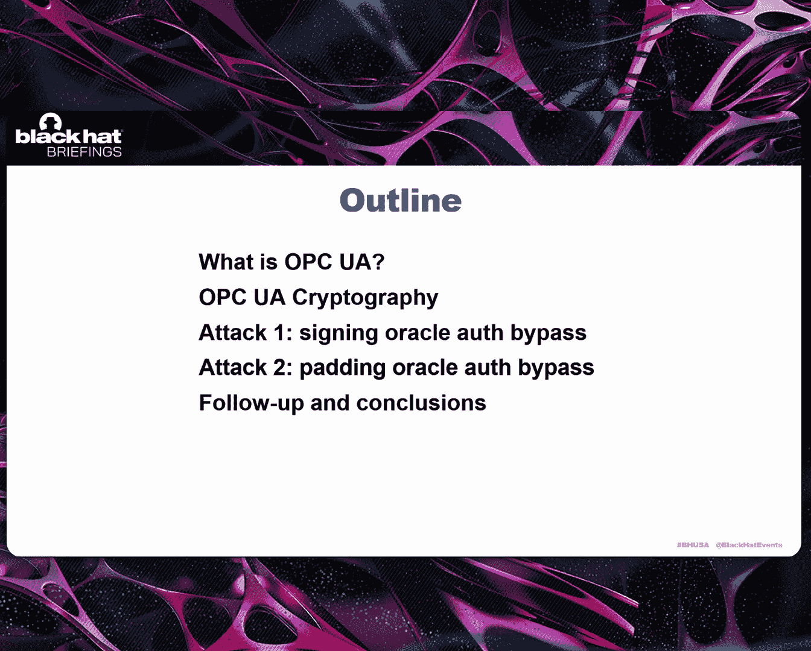

So OPC UA is a general communication protocol for industrial automation。

 It's used in all kinds of industries， for all kinds of purposes to make ICS SCar systems。

 PLCs and so on communicate with each other and unlike a lot of other protocols in this space。

 it's not proprietary but an open standardized protocol that is supported by multiple vendornders。

 it can interoperate and it's also not based on half a century old serial protocol。

 what I personally found really interesting about it is that it has security features。

And thanks to these security features， transport encryption and authentication。

 the protocol is kind of known by a lot of users of it that you can actually expose it across trust boundaries。

 unlike a lot of other OT protocols that you really want to keep in separate off network segments。

Especially if you have like things in the fields， let's say a windmill somewhere that you want to control centrally or monitor from a central location。

 it can be very convenient to be able to set up a connection to it over the internet， for example。

And due to OPC U's security features and encryption features。

 it's even popularly used in a variety of use cases without having to set up a VPN。

 And that's seen as a big advantage of this protocol。

So that led me to take a look at how this cryptographic protocol actually works。 and in general。

 it's based in on two different layers， the communication layer or the secure channel layer that' is responsible for setting up transport encryption and for me for client and server for authentication。

 which is basically the device authentication， which is what you would typically use when you have in automated system connecting。

Then there's the session layer or the application layer。

 which takes care of user authentication and authorization。

 which is generally used when you have somebody， for example using an HMI is directly interacting with the system entering a pause somewhere and you can use both authentication methods neither。

 you can turn encryption off or on， you can also use the mode that just uses a cryptographic integrity protection but not actual encryption。

And when you do use the client that for authentication features。

 the trust model is based on certificates， typically。In many implementations。

 when a client connects to a surf， the first time the connection will be rejected because the certificate is untrusted and then an administrator on the server side can look at a list of rejected certificates and indicates that they actually do want to trust the certificates。

 So kind of a pretty pragmatic trust on first use solution。

 But there's also different setups based on P Is or just full preconfiguration available as well。

So this first layer， this secure channel layer， starts off with a pretty typical cryptographic handshake。

The the client knows in at phone what the certificate of the surf is， which included public key。

 It knows what kind of cryptographic suites， its support。

 This is either preconfigured or obtained through a discovery protocol that's out of the scope of this talk。

 And then the client will open up the connection by generating a random non value signing it with its own private key and encrypting it with the public key of the surf。

It sends this to the surf and the surfer also responds with a signed and encrypted message containing its own Nos。

 both Nouns values are then fed to a key derivation function。

 and both sides can derive a symmetric session key for the follow up communication。

The protocol supports a variety of different so called security policies。

 which is a set of low level ciphers to use during these protocols。In practice。

 the ones that are currently implemented the most are all basically variations So RA and AE S。

After this first secure channel， Handshake。EThe client that serve will move on to establish a session。

 which is required every time， even when you don't use user authentication。In this protocol。

 the previously derived keys are used to encrypt every single message and also authenticate them using a pretty standard AS CBC and HMAC construction。

The clients will generate a random challenge value。And sent it to the server。

 The server will prove its identity by signing this challenge and then generating a new challenge that the client has to sign。

 client signs That challenge。 and then authentication is complete。 optionally。

 the client can also add authentication information from an end user using a variety of means。

And then if this all succeeds， both sides know， okay。

 this particular session that uses this particular session key has been authenticated。

But's noteworthy about this from a performance perspective。

 this the the combinationmination of these two steps is not a very efficient protocol because both sides they do three expensive R A decrypt or sign operations。

 while if you want mutual authentication and key exchange based on R A。

 you really only need to do that once。 But， of course。

 the fact that this is a bit ineffient doesn't mean that a protocol is insecure。

 And having these multiple layers may actually make it more difficult to attack。

So something that' caught my eye about this second step of the protocol。

 the session Handshake you just saw is that the way that the client and the server sent each other's challenges is done by taking that value。

 concatenating it with the other site certificate value and then signing that but that method is basically exactly the same for both directions。

 They don't include any context metadata that says this is a message intended originated from the server intended for the client or going from the client to the server and that is a little bit problematic。

 because there's many use cases in OC U where a system can act as both the client and a server and there they generally use the exact same certificates。

 So you can use the same public key to sign messages going in either direction。

 But these messages are structured in exactly the same way。

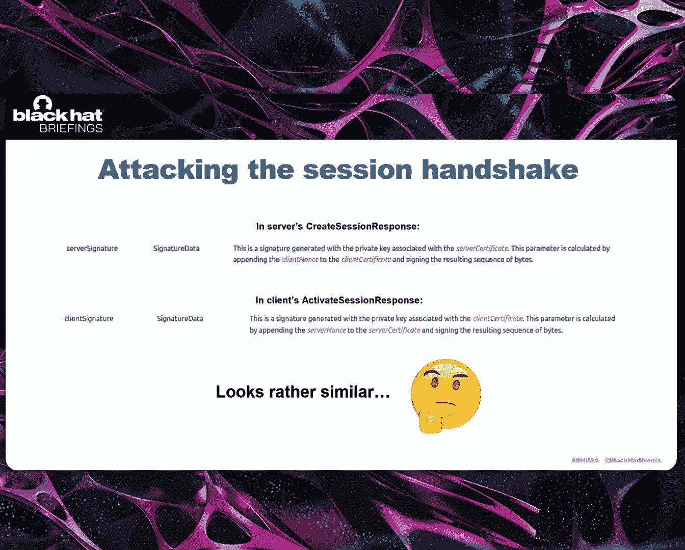

So in theory， that opens up a potential signing oracle attack where you can basically swap these types of messages around。

And trick one and trick a surf to sign something different than it actually should be signing。

 So the first theoretical attack I came up with was a relay attack where you have two different serverers that thrust each other surf A and surf B and how the attack would work。

 The attacker connects to surf A。 And it says my identity is surf B。 It takes the certificates。

 it has discovered from surf B， and provides a a challenge。

 the server surfer A signs it and then provides its own challenge that the attacker then has to sign。

 But instead of signing it themselves， which they can't do because they don't know the private key。

 They then set up a connection to surf B。😊。

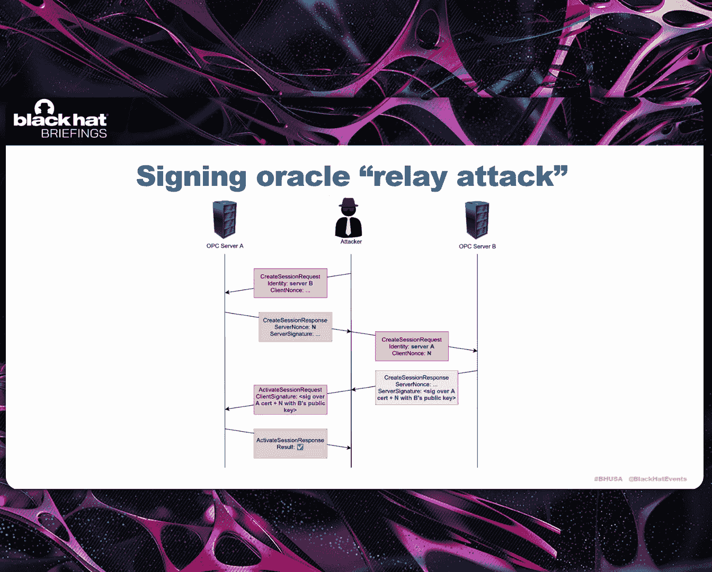

Copy over the challenge that they got from Surer A。

 and they ask surfer B to sign that challenge where the attacker pretends to be surfer A as in a client's role instead of a surfer role。

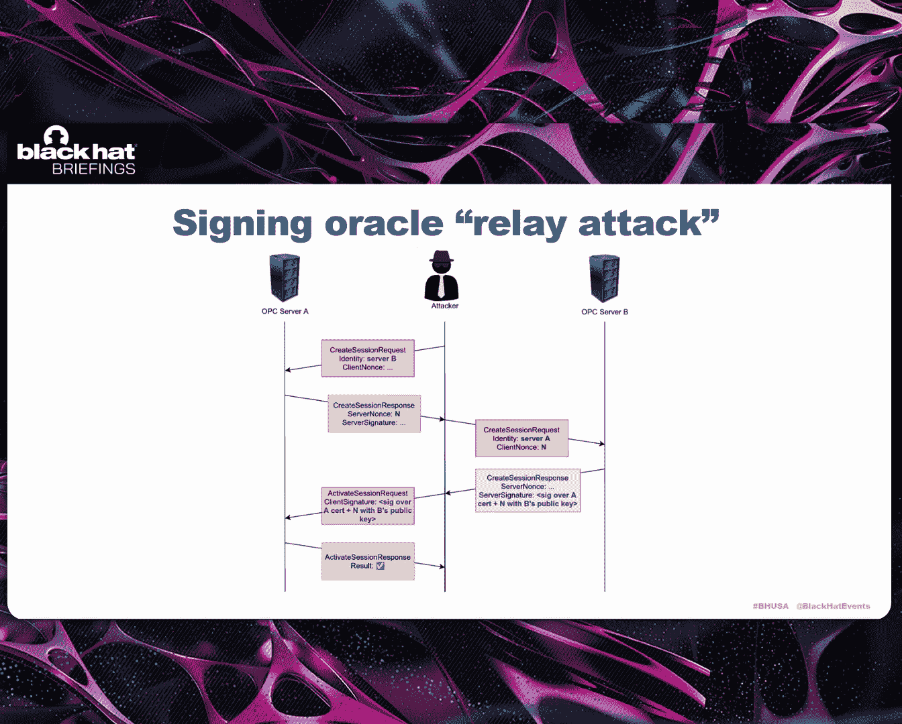

Surfer B will provide this value。 once they've done that。

 the attacker cuts off the connection with Sur for B plugs that value into the message to Sur A。

 and they should have bypass this authentication step。

But actually， you can you really don't even need two surfs because in many implementations。

 by default， a server thrusts its own certificates。

And then you can just do basically the same thing， but do it with the exact same surf。

 So the attacker tries to log into surf A and pretends to be surf A。

 which is surprisingly actually allowed。 They then that set up a second connection to the same server。

 Let it sign its own challenge。

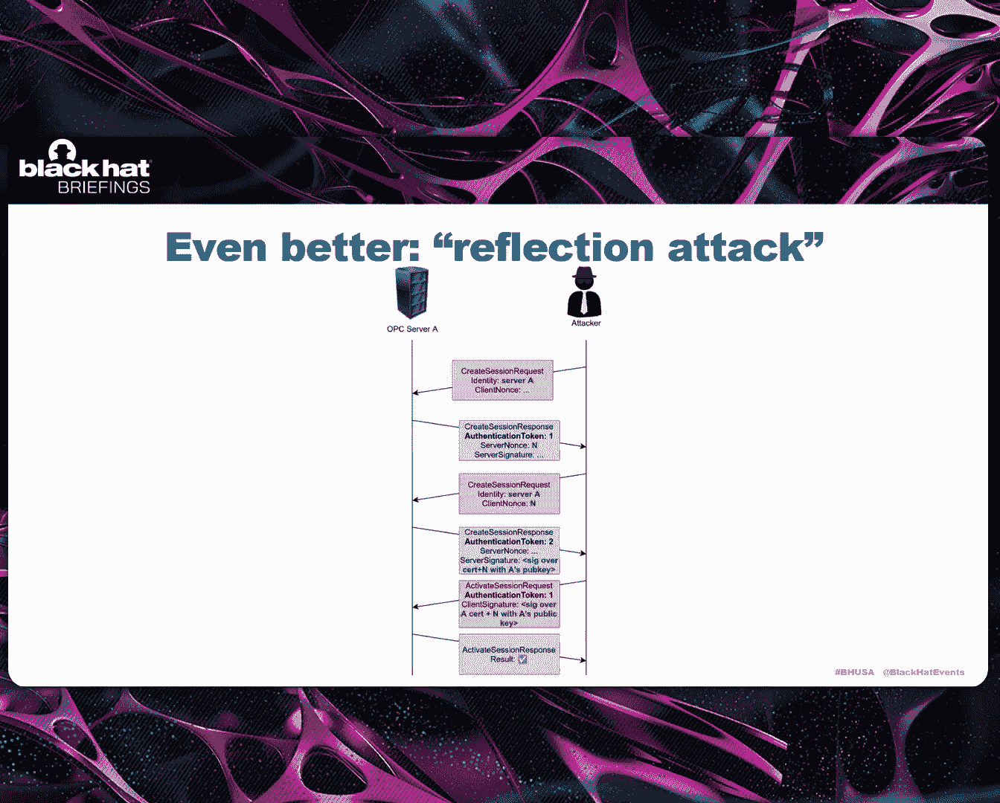

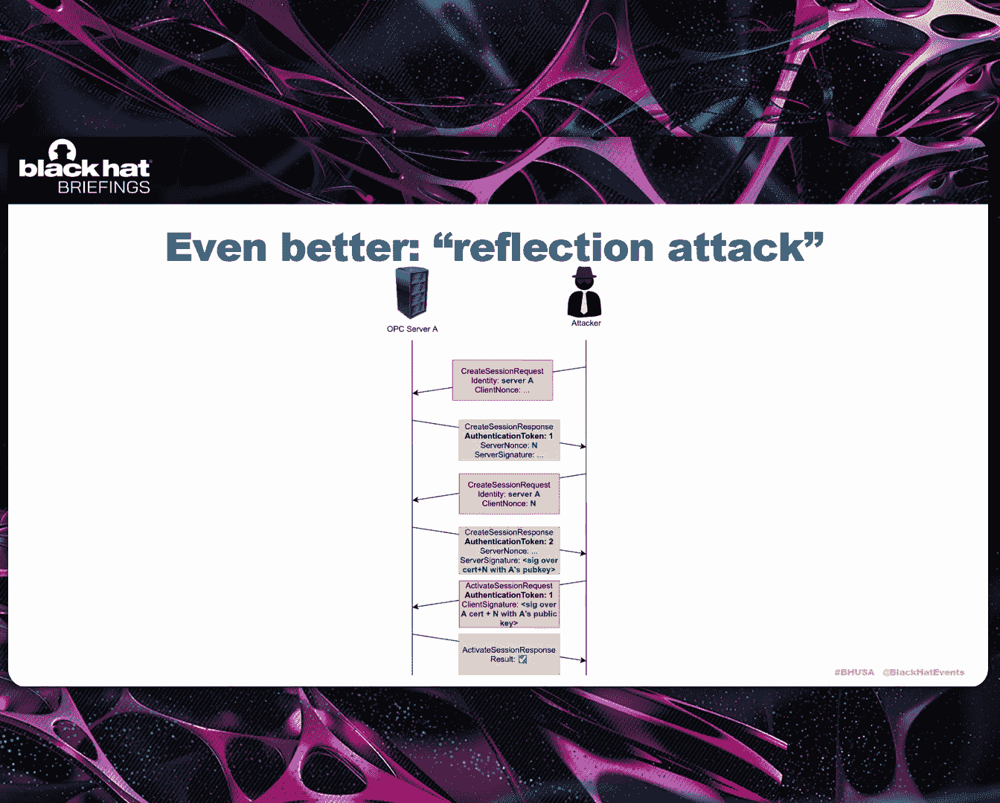

EC off that second connection。 proceed with the first one。

 and they have bypassed this whole session authentication step。

But this is where these redundant R S A operations come in。

 We may have technically bypassed the authentication protocol in this second layer。

 but we still have this first layer， the secure channel where we need to decrypt something with our own private key。

 and we need to sign something with our private key。

 But the attacker in this circumstance doesnt have the private key。

 So shouldn't be able to do this operation。 So they shouldn't be able to derive a correct symmetric key。

 So they they can't even make a valid message that can could be used in this protocol。

 So how do we bypass this。

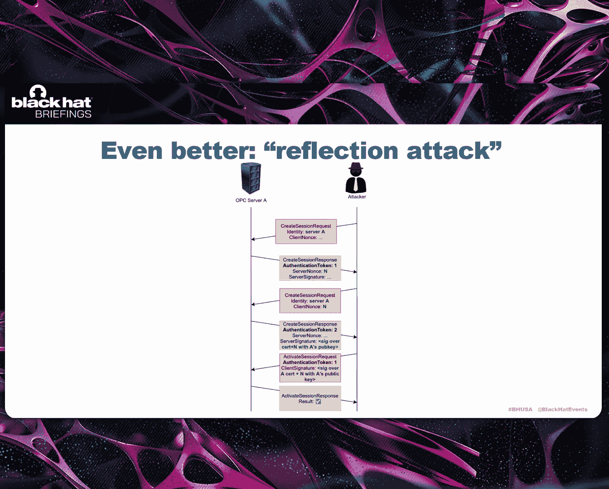

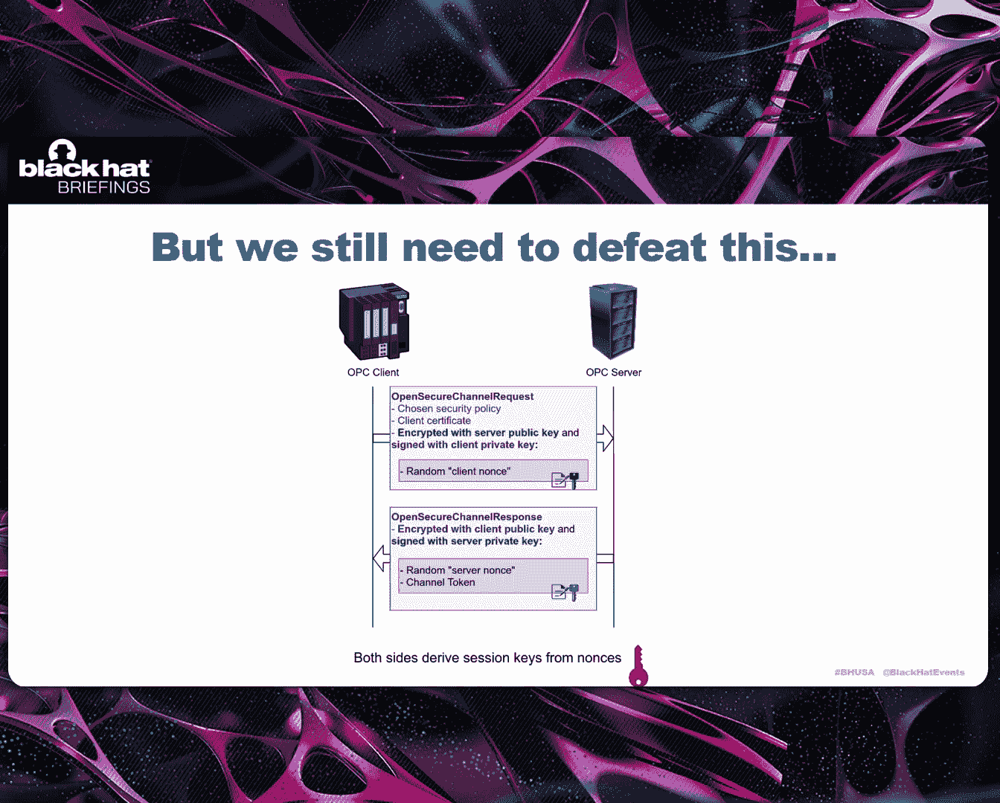

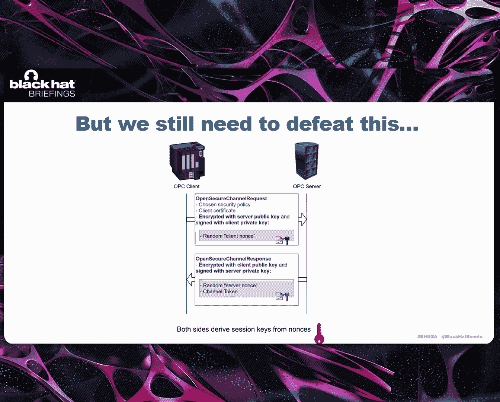

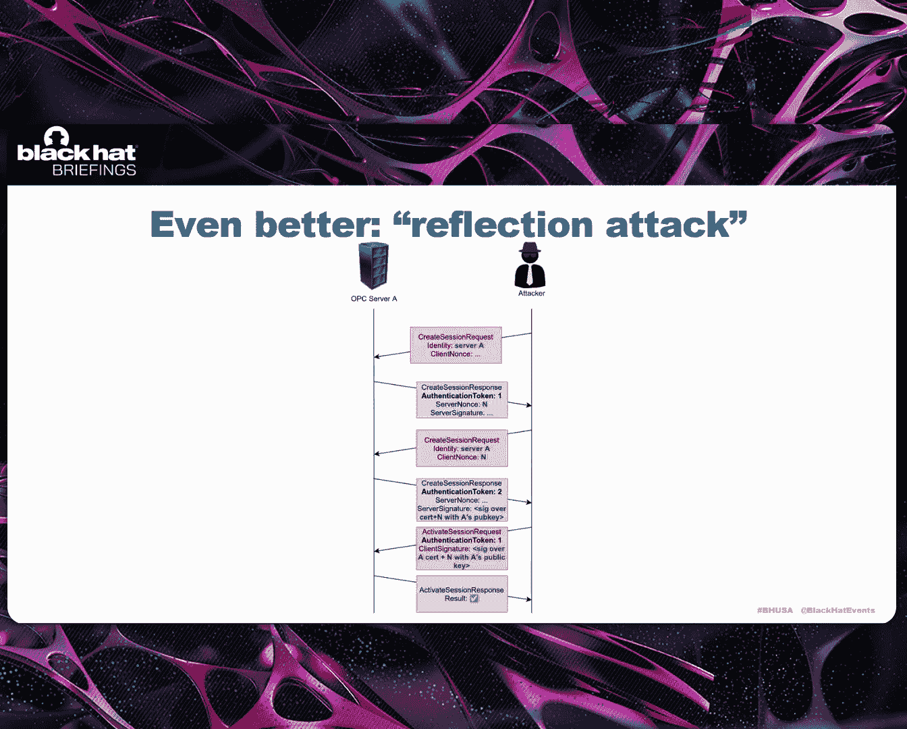

It turns out that there's a relatively simple way to bypass this。

 And it is by using a variation of the protocol。 By default。

 O C U A is a binary protocol used directly over TCP。

 But there is an optional variation that tunnelled over server authenticated H T P， S。

And because HPS already offers transport encryption， the protocol designer said， okay， well。

 now we can actually skip this handshake because the whole TL S layer will take care of that。

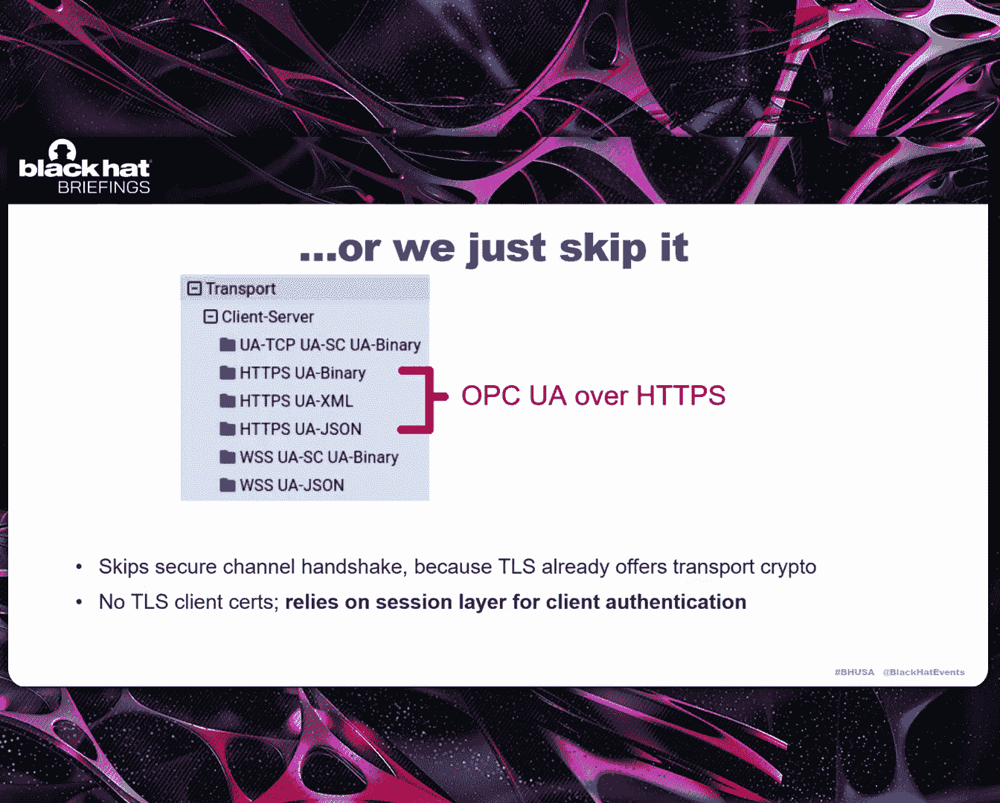

However， the problem with that is that this handshake implicitly already authenticates the client because the client has to do stuff with a private key。

 But when you have server authenticated H TPS S， the the server authenticates itself。

 but the client does not。

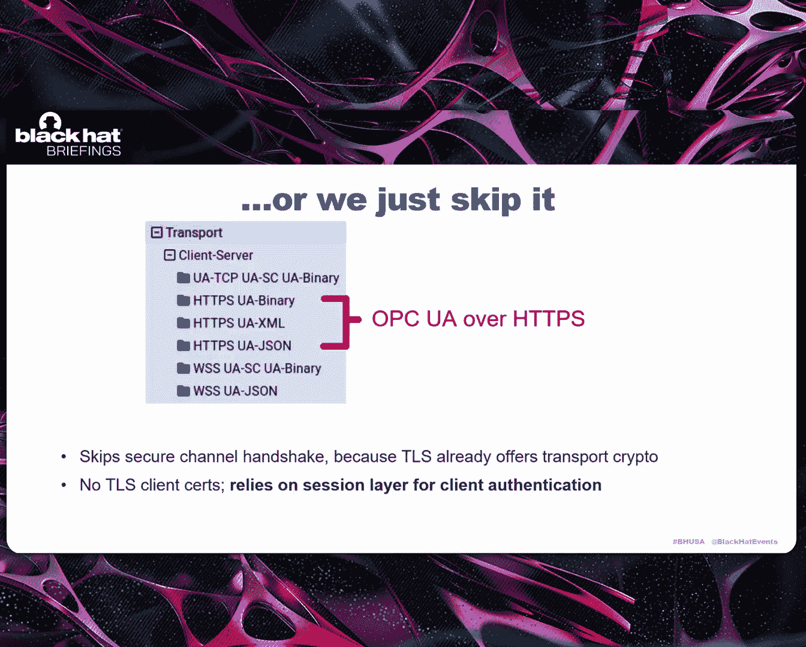

So when you use OC U A over H TPS， you're completely reliant on this session layer authentication。

 And that's exactly what we've just bypassed。 So I implemented this attack for this protocol variation made a tool。

 and it totally worked。 you can you just give it an H TPS enabled OPC server。

 and the tool will immediately bypass altercation by doing a reflection attack。

 Or if you have two servers doing a relay attack。 and the server will spill all its secrets。

 basically gives you complete access。

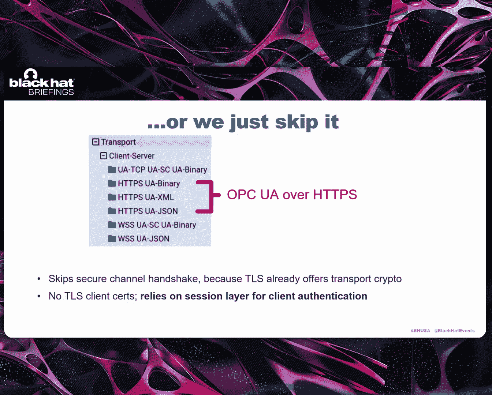

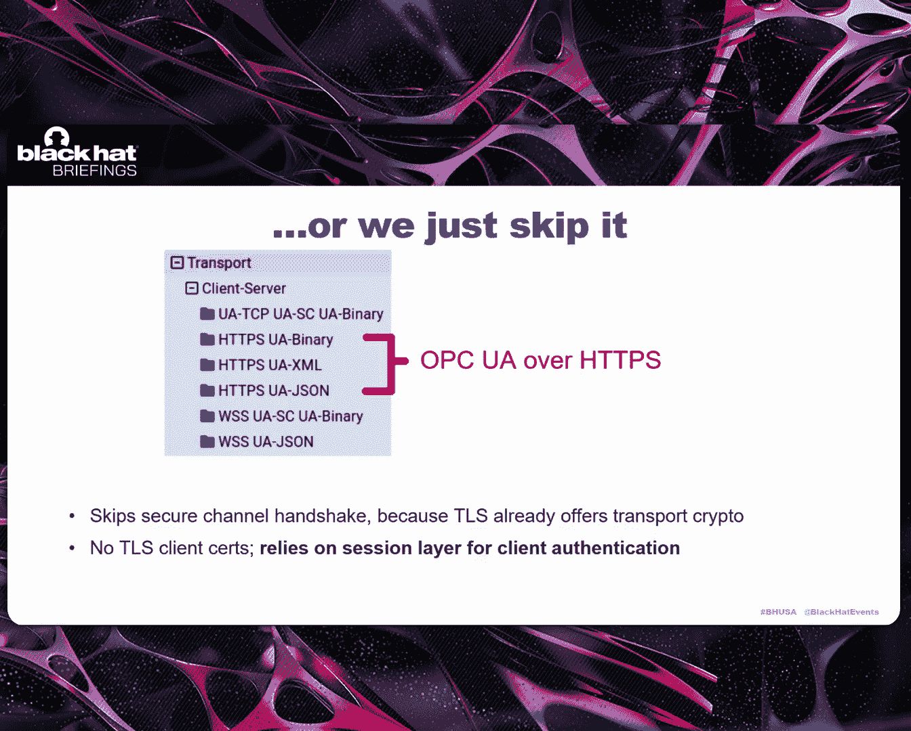

呃。Now， this is already would be pretty severe if it were not for the fact that not really many users in practice actually use this H TPS protocol variation。

 There's very little adoption of this protocol。 It's relatively new。

 Most people just use the TCP variant， of course， there's a number of implementations that actually open up the HPS S version of the protocol by default。

 And if you don't file all of that port， This attack will still be relevant。

 even if it's never used in practice。 but still the impact is pretty limited because the HPS S variant is simply not used a lot。

 So what would be a lot more interesting， is to attack the more common variant and go after OPC UA over TCP。

And。My approach there was to take to take advantage of one of the supported Cypher suiteites。

 which is based on RA using the PC S Vvo padding scheme。

 which has basically been definitively broken by Daniel Black and Backer back in 1998。

 But for some reason， a lot of protocol designers since didn't get the memo and still kept using this particular RA padding scheme。

 So it may be worthwhile to see if we can actually exploit this these wellknow vulnerabilities in the context of OPC U A。

Only problem though， this spell scheme or at least the Cypherpress fee that uses this spell scheme has been deprecated by the OPC Foundation。

 and implementers are recommended to still implement support for it。

 but they turn it off by defaults。So yeah， what would be the point in trying to attack a deprecated feature。

 Well， most a lot of implementations don't really follow this notice and turn it on by default anyway。

 Also， there's a lot there can be users that use a configuration that was set up before this deprecation and probably not many vendors are going to issue a patch that will break previous configurations。

 So then they will still support a cipher。Also very interesting is that there's a variety of implementations that do not offer this method by default。

 but when it is explicitly disabled， they will only check that it's disabled after they have already tried to decrypt a message using the protocol。

 so I tried to send this encrypted message using this vulnerable scheme。Serfer tries to decrypt it。

 And then decides like， oh， wait。 Actually， I'm not supposed to use this。

 I'm going to block the connection。 But at this point， they already did a decryption。

 which already enables the attack。And also interesting is that if you even have one single surfer that supports this protocol。

 you can actually use the attack to target other systems that may never use it and may have turned it off because they or use a more secure RA pdding scheme。

So a quick， very simplified primer on Blackenbaer's attack on say encryption is basically just modular exponentialonation of a large integer。

And the whole point of RA padding is to turn a sequence of bytes。 your message into a large integer。

 And the way this scheme does it is by preing a 0 byte， a 2 byte， bunch of random bys，0。

 And then your actual data to make sure you get a very big number。

 and you don't just have something like the number one in your message that will stay the same if you exponentiate it。

And then after the surfer decrypts it， it checks this padding and removes this padding to get the original message。

And if you're an attacker and you can see that the surfer fails to remove this padding。

 The surfer gives like an error or something that indicates padding has failed。

 This gives you a little bit of information about the message that your cphertext represents。

Because if patting fails， it apparently does not conform to this format。 If it does not fail ill。

 it must match this format， which implies that。This number that's encrypted must be apparently greater than a number that starts with 02。

 but smaller than a number that starts with 03。So if you have a secret encrypted RA value that you don't know。

 you can take advantage of homomorphic properties of RA to basically multiply known values with the ciphertext and get like as a result。

 the multiplication of the secret and the value that you choose and by picking a lot of specifically chosen values and observing is the okay or is it not okay every time you get like a result that says theing is valid a little bit of information is leaked and when you do this in a clever way。

 you can eventually slowly bit by bit， decrypt the entire message just narrow it down after about like a million queries。

 which is why this attack is also sometimes known as the million message attack。

So how would we use this against OC U A， Well， there's two different operations that we need to bypass involving an RA private key。

 There is signing of the initial message and there is once you've done that。

 you still need to decrypt the message。 you get back to get a nonsense thats in there。 Well。

 decryption is straightforward， but you can also use black andbarers attack to spoof signatures because RA signing is basically just boils down to RA decryption of a has value。

 you can use the exact same technique more or less to spoof signatures。

 So what you would do is you would start doing doing this black andbacker attack until you've spoofed a signature on some message。

 including some nonsup picked you sent out this message。 you get back an encrypted response。

 then do the attack again to decrypt that response。

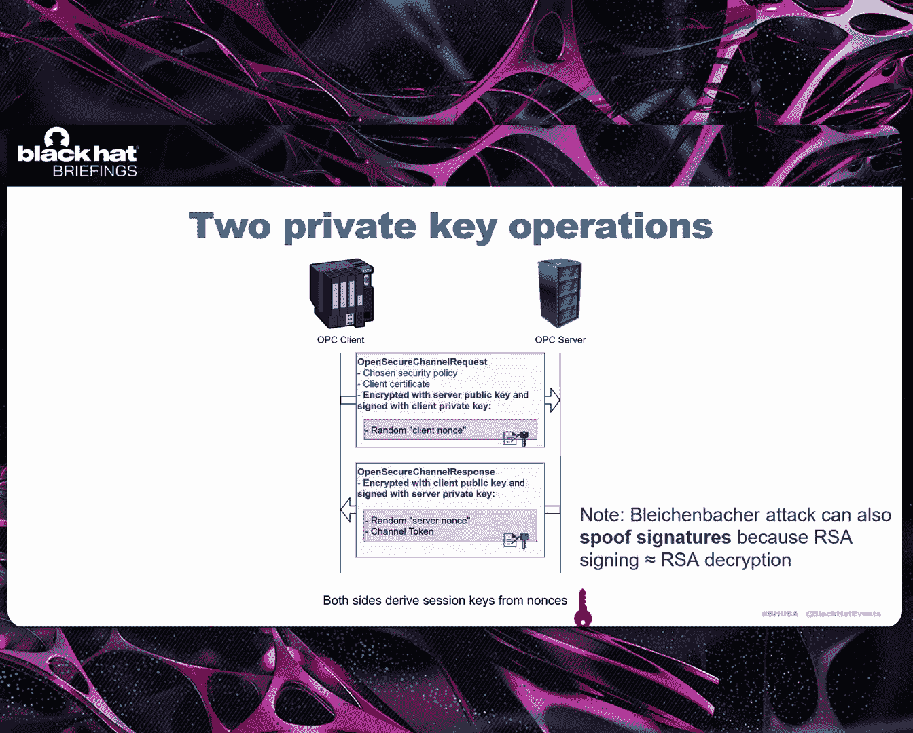

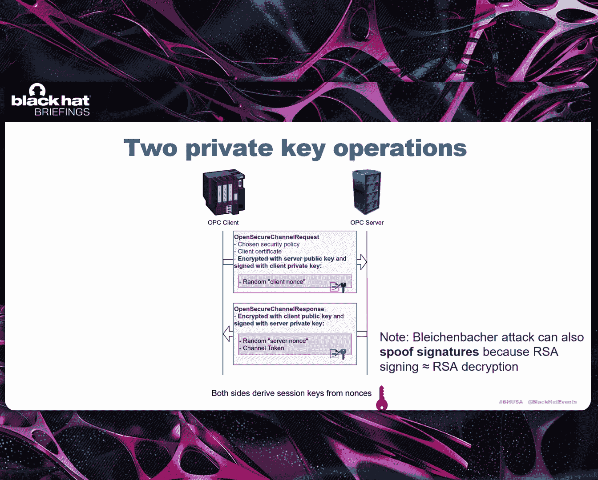

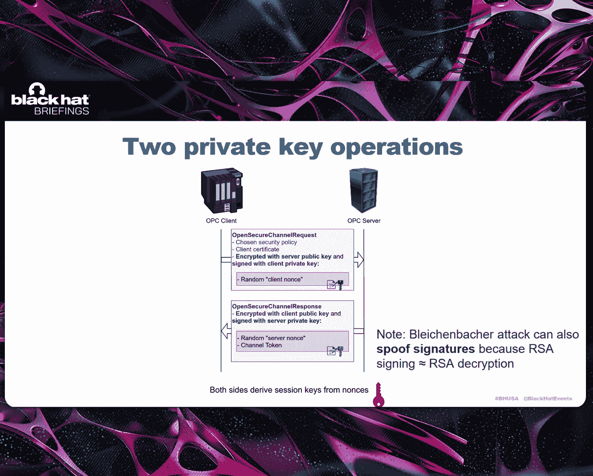

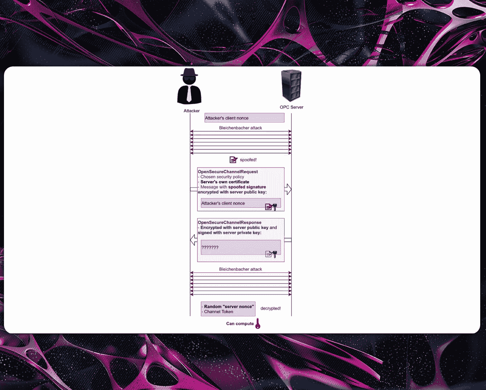

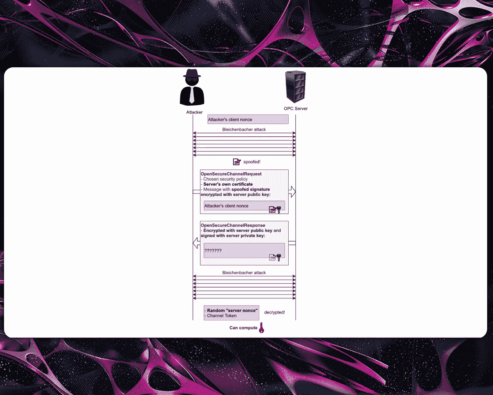

This first stage， once you've spoof one signature， you yeah。

 you can just keep reusing that signature。 So you only really have to do that first step once。

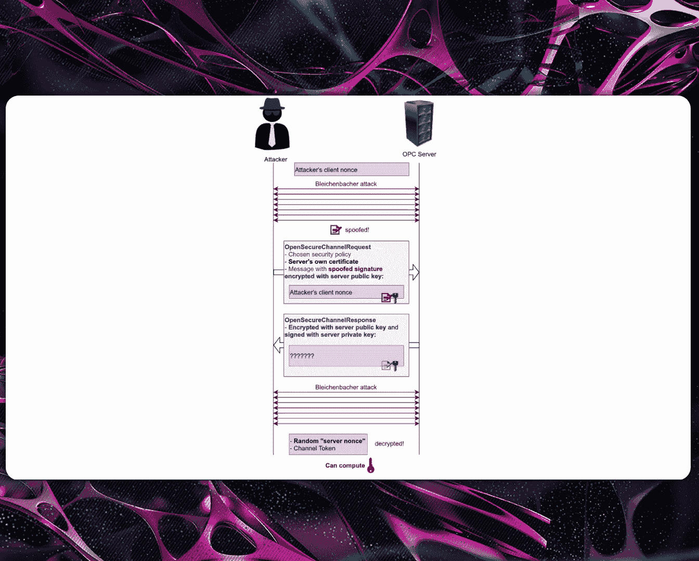

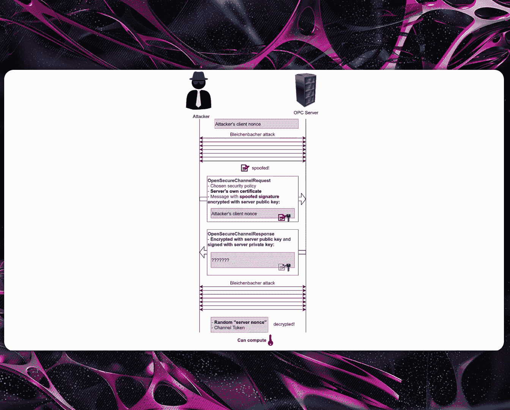

The second step is a little bit trickier because while you're doing the attack。

 you do have to keep your original connection open because the moment that connection closes。

 the nonsense are no longer valid and no longer useful。

 So how you do that in practice is basically just keep sending TCP keep life messages on one connection to keep that one open and you use different connections to do the Bckenba attack。

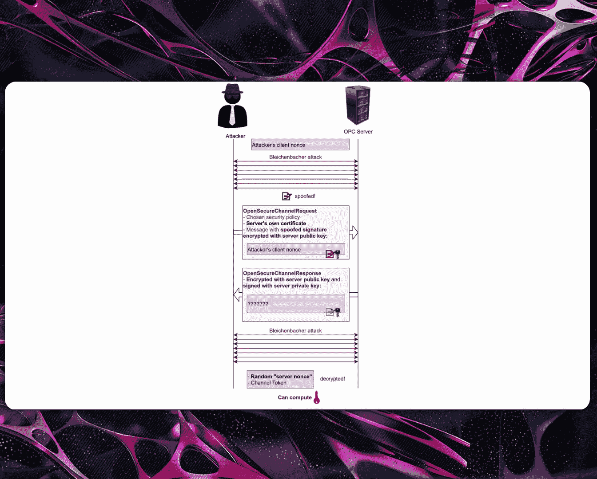

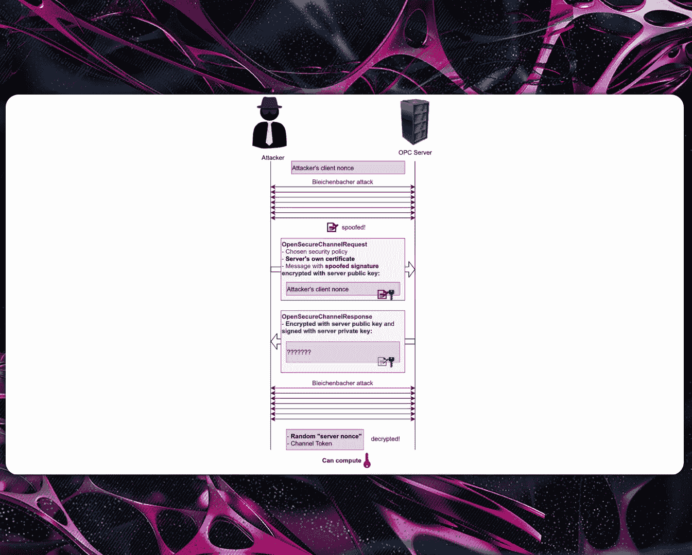

And of course， to make this work in practice， you still need a petting oracle。

 You need a way to distinguish validt patting from invalid padding。 for some implementations。

 this is very easy because they simply give a different error message。 If the padding is wrong。

 you can see a certain a certain type of error code。

 a certain type of string occurring in the error message。 And if the padding is right。

 this is somewhat difference。 And then you can distinguish the two cases。

 and you can basically implement these standard attack。 without too much trouble。But unfortunately。

 most implementations that I tested show exactly identical error messages。

 regardless if the patting check faileds or whether the padding passed。 But after unpatting。

 the message was invalid because the signature was invalid。 So the typical。

 the other way you could exploit this attack。Is by exploiting a timing based side channel。

 basically try to take advantage of try to time the difference between correct padding and incorrect padding。

And that is something that actually at first sounded very hard to me and probably very impractical。

 or at least something that would involve like making sure you don't have too much network jitter。

 do a do a lot lots of more extra tests to take a long time。

 You do some use statistical techniques to filter out false positives。

 It just sounds very hard to do a timing attack like this。

But it's good to keep in mind that not all timing attacks are heart。

 If you have the traditional sequL injection that includes a sleep statement。

 that's a very easy timing attack because it's， you just the timing difference is you。

 you can influence them you can make them really big。

 and you can kind of do something similar in the OC U A protocol because the way they do R A encryption。

Use is a little bit of a strange structure。 It's kind of RA operating in a kind of ECB modes。

 you know， from block ciphers。Where if the message is too long to fit into a single RSA block。

 which in practice it always is because the message also includes a signature that's the same size。

 so it's usually two blocks in size， they just split up these message blocks and encrypt every block individually。

This is really not how you should be using R SA。 This is a very strange structure that even though it it it will have very different properties than if you use ECB for block ciphers。

 you actually could use this mechanism with R A to encrypt your penguin pictures。

 but you do open up a lot of theoretical， like chosen ciphert attacks。 But what。

 what's the property about the scheme that I could abuse。Is that you can take well。

 one of these guesses for your black andbaer attack and just repeat this cipher text that you make to do the attack with and repeat it 100 times。

Then you sent this long message to the surf。 The surf。 if the padding of your gas is wrong。

 the surf tries to decpt the first message， sees the padding is wrong， throws an exception。

 stops processing。But if the padding of the first message is correct。

 it will proceed to decrypt the second block， well you're repeating the same block。

 so it will also be correct， so it will decrypt all these 100 blocks in order say decryption is a very expensive operation。

And then only after these 100 decryptions， it will notice the message is wrong， and it will fail。

And this results in a pretty sizable timing difference。

 you can actually tweak a little bit how long you want to make the messages。

 It depends a bit on for how what their message limit is。 and of course。

 if your messages are shorter， you can carry out your attack a little bit faster。 but in this case。

 for example， you can see your repeat the shy for text 100 times your the order of magnitude of the timing differences is like intense of seconds。

This is a really big timing difference。 And to take advantage of this。

 I really didn't have to do any fancy statistical methods other than if I see something that takes a little longer。

 maybe repeat a few times to without false positives， but it is really。

 really easy to actually time this。So I just took the the standard black embale attack instead of looking the differences between error messages。

I will do some relatively simple timing。I would if the。

 the the timing would be short under a certain threshold。

 which actually happens for by far the majority of the cases。

 because during the black and Baer attack， by far， the majority of your messages have invalid padding。

Then I know， okay， I'm going to assume petting is in vets。

 but if processing certainly takes a lot longer， I'm going to consider this to be vt padding and return that to the implementation of the algorithm and say。

 okay padding is correct in this case。And this sounds like it would be a very slow attack。

 But because like 99% of the messages that you're sending are actually the fast case。

 And it's only those relatively rare cases with correct betting that take long timing。

 This attack really is not that much slower than using the errorb or call surprisingly enough。

So I put all of this in my tool， and I added a nice little progress bar with a spinning spinning bar in it and numbers that keep going higher that you can stare at while the tool is doing his work。

 so。😊，Well， after a few seconds， the the number is slowly going up。

 It's going up a little bit further。 And then the tool has paused the first phase。

 It has successfully sed the signature。 So it stores this signature in a file。

 So if the second phase fails， you can reuse it。 And then it just tries to it sends the message with a s signature。

 gets a reply， keeps the connection open， and then it tries to do this the attack again to decrypt the message it received back from the server。

And it works。I could point this at a surf， and I could bypass the client authentication step once again。

 And in this example， as you can see， with a little stopwatch， it only took 15 minutes。

 not to be fair。 This is a relatively fast case。 This was an implementation a pretty efficient implementation written in C。

 So this was a bit faster than other implementations。 the other implementations。

 I tested this attack would take like around like 30 minutes。

 maybe in hour worst case was like two hours。 and of course。

 it wast bit in a lab setup up with not too much network although I also tried it by just hosting a VM It was still in the same country。

 but in general， the attack would actually work。 Sometimes it just a little bit slower than otherwise。

 And for the attacker。 well， if you're tech takes 15 minutes， two hours doesn't really matter。

 It's a difference between having to take a coffee during the attack or maybe going out for lunch。

And。From the defender's perspective， what I also found is that this attack。

 it kind of takes place in the very first step of the handshake and a lot of surfs。

 they don't actually lock any cryptographic failures in this phase。

 So if you would go take a look at your look。 this was not always the case I I had one implementation。

 but all look would be filled up with all kinds of weird errors。

 which may draw some attention or fill up the look。 But in most cases。

 the attack was practically invisible。 You didn't see anything about it on the on the other hand。

 So yeah， if you're an attacker， you probably won't mind taking a little time for this。So this does。

 of course， still depend on like the peculiarities of individual implementations。

 These are protocol flaws。 But if it works or not， does depend on a few details and on the configurations。

What I found， I tested 7 different O PCC U A implementations。 Two of them were not vulnerable at all。

 Two boat attacks， but five of them there were。And of those five。

 four out of those five were vulnerable to either one or the other attack in their default configuration。

 So if you would use the default secure configuration that uses a client authentication。

 you would be vulnerable。All of this does assume that your setup only uses the client server for authentication mechanism。

 If you have user authentication， If you have a password in there。

 my attacks are not gonna help you guessing the password。 So if。

 if you just use password authentication， these attacks are not relevant。

 But if you use the certificate based authentication， which is a sensible setup。

 if you have like an automated system setting up this connection。

 then this could potentially result in an authentication bypass。And well。

 if I I picked these7 implementations because that's where I could get like a lab setup working in a reasonable time and they didn't require like expensive hardware or software licenses。

 but there's many more implementations。 And if five out of7 in this sample were vulnerable。

 you can probably extrapolate that and say that a lot more other implementations would be vulnerable to this same attack。

 And I after the disclosure， I saw like several notices from like codeis and a particular a lot of Simenens products like the WinCC surf that implemented like patches for these vulnerabilities and even gave them relatively high CS score So from that I assumed that they were probably vulnerable in common configurations as well。

So， well， you I I found some protocol box。 Well， sort of it depends a little protocol box that behave a little bit differently per implementation。

 That sounds， of course， like a complete pain to disclose。

 having to go to all these different vendors。 and there's all these other vendors out there I didn't even test。

 But luckily， there's the OPC foundation。 that's like curates the standards。

 And they basically have like their are members basically encompass almost all the implementers of the protocol。

 They have all all these vendors already coming together in this foundation。

And they actually have like a very nice system where our security vulnerabilities can be disclosed directly to the foundation instead of having to go to like process to like seens and so on。

1 by one。 So I disclose to them。They replied basically in like one hour and invited me over in a in a covid foundation members on the very same day。

 So that's a very nice false response。 That's a little bit differently than what I'm used to。

 And they basically did all the hard work of coordinating these vulnerabilities to all these different vendors。

 getting all these different vendors to well， first what you actually do about these kinds of tricky key issues and getting them to implement patches in on a relatively short time frame。

 which is really impressive and really my compliments to the foundation for doing this。😊。

A number of Cs were issued。 What can be a little bit confusing is that some vendors。

 they use their own CE or some use the existing CE。 But depending on the software product。

 they actually have different CS S scores， whether they use one or the other。

 So that's something to pay attention to。And the types of fixes that they used Well some simply included like。

 okay， we just nobody uses the HPS feature。 We're just gonna completely turn it off and make it inaccessible。

 Some include like workarounds to make the padding oracle attack impossible and also altering the documentation or like warnings in the software。

 Hey， please don't use this RA method or changing like the defaults It kind of depends it changes from vendor to vendor how this was solved。

 and it's pretty important if if you run like O U and use client authentication。

 that you check your vendor documentationation and advisories to see if you need to do anything about this。

嗯。If you don't use certificate， the certificate based authentication or you don't rely on it。

 you probably don't have to worry about this。If you do and you're not really sure if your friend has completely mitigated the issue。

 you can probably fix the issues by turning off the HPS feature and turning off the legacy RSA cipher but there are still implementations for this was not enough because they would still try to decrypt something with the legacy RA padding even though it was turned off。

 So that's also by the exploitation and testing tool available publicly you can find it here and it will also be published in the white paper that's on the blackhead website that you can use to evaluate your OPC surf and see after you applied patches。

 for example， if it's still vulnerable to these attacks and test of the attacks work in practice if you want。

I only tested it against7 the seven different implementations I listed before。

 but I'm pretty confident that since it worked on the the seven different implementations。

 it should probably work on others as well。 although the error based betting oracle attack may not work because it's the way error messages differ per implementation Yeah。

 could be different than I expected them to be。So what we can we learn from this。 Well， in general。

 designing cryptographic protocols is hard。 You may be using secure building blocks like A S Hm R A。

 But if you but putting them together in the right way in a protocol is very tricky。

 And there are all kinds of tools that can help you with this like formal methods。

 but it really is specialized job， And it's hard to get right。

 which is well evidenced here by these kinds of subtle protocol flaws that where the way that messages are signed。

 the order in which they are signed opens up like a pretty severe vulnerability。

Also always good to keep noticing that Black andbaker's attack still works in practice。

 It was possible against E， L S for a long time。 It was possible against Jason Webbb tokens。

People just keep。Implementing P C one patting。 and I would really call on all protocol designers。

 or please stop doing this。 Just consider this as completely broken。

 Don't think youre in your use case special or not v。

 this attack is even though it may be called a million messages attack。 Well。

 I just showed an example of where I pull it off in 15 minutes。

 that's really not as impractical as hard as it may sound to be。 And yeah， because yeah。

 you kind of so like some design flaws in a protocol like well these vulnerabilities。

 these inefficiencies， there's some really the old way they used RA。 based on this。

 I personally didn't find other vulnerabilities。 although I didn't explore all faces of this yet。

 I don't think we can rule out that similar vulnerabilities like this will crop up in the future。

 So that's something that we should probably take it into account that these kinds of crypto flaws may may crop up again。

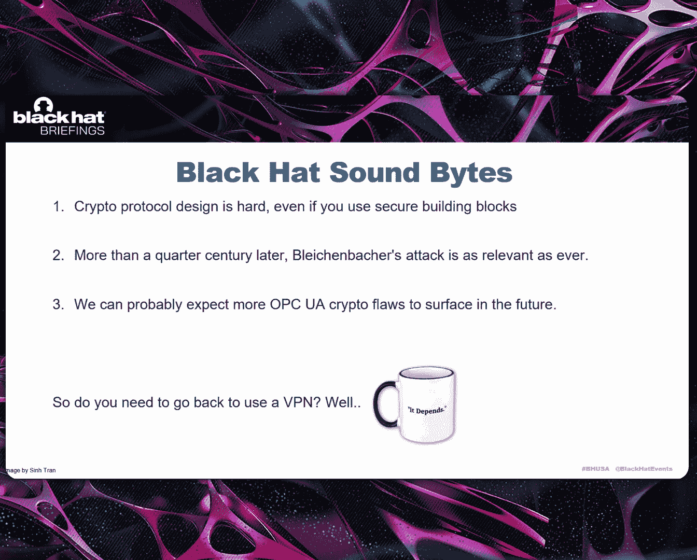

So does that mean that we cannot expose this across a trust boundary anymore。

 Do we always need to tunnel OC U A over V P S。I mean， I probably wouldn't go that far。

 It depends a bit on your threat model。 I would definitely recommend if you have internet exposed surfs to also use IP allow listing。

 So if you would actually have like authenticcation bypass or a pre odd vulnerability that also have been there have been plenty of examples of those in the past you really don't want to expose that to everyone directly。

 So at the very use IP allow listing then you're probably good at most use cases as long as you can rapidly patch your surf when one of these vulnerabilities pops up if you're in a situation where you can't do frequent patching or you really want a higher level of certainty。

 then maybe it is indeed a good idea to still talk along for VPNs。

 but it will kind of depend on your individual threat model。

And， yeah， that was my talk。 We still have about four and a half minutes left。 I see。

 If anyone would like to ask some questions， you can move to the microphones here or you can join me to the rep area around the corner here。

 And yeah， thank you all for attending。😊，I have a question。

 but I'm sort of slightly biased because the systems I've seen are sort of mines in the middle of Africa。

And that also critical to our cobalt supplier and so yeah。Do you think， and like sort of those。

 as much as those C VE are going to be published and updated， they're not going update their systems。

 So you've got sort of part of our critical supply lines。

That are basically under the control of very small infosect teams。

 and that are not like it's one of the big problems with， in general， control systems。

Do you think like there needs to be more work towards sort of。

Potentially moving these control systems to more sort of centralized。

 like if you expose a vulnerability in the Nvidia GPU docker loader， then like all the vendors。

 they just sort of update their packages and so on。

 But like this doesn't happen in this critical physical infrastructure there。

 So I was wondering if you have had thoughts about like。Does there need to be more regulation。

 Does there need to be like， what is the solution to ensure the sort of critically understaffed people that are maintaining all of these things really are not reading these C。

Yeah， this is a very common problem in this whole space。 Yeah。

 there's probably not gonna be an easy solution。 in practice。 What happens。

 You throw it all like on your network segmentation， because we， we can't patch these systems。

 We can't follow all these， these rapid changes。 We just try to reduce our exposure so that novatecker will be able to reach us and be in a position to exploit anything。

 yeah， the unfortunate situation is that yeah， a lot of control systems。

 they indeed people don't have the the resources or budgets to do things like rapid patching or actually doing so far too risky for operations。

And and yeah， then really what you've got left is just trying to reduce that texture us trying to focus on physical access controls。

 network segmentation， using those VPNs if you really need to operate like something remotely and that's kind of your best be。

 it's kind of assume if my attacker has like a network level van points to reach this device we are just going to assume that we can be breached in that case。

 which is。Often no， also the case in practice。 And then we're going。 yeah。

 And then we have to build our controls kind of around that。

 And only if we want to use like the security features of OPC that's really more appropriate if you're in a context where you can do rapid patching where you can do where you can operate more as like a well。

 more like more typical modern I T firm than then the the traditional way of approaching like these control systems But yeah。

 I would， I would say I would indeed say thats this is in practice， this is pretty tricky。😊，I mean。

 you could scan the Internet and you can sort of find critical vulnerabilities。

 And you can say actually， given your I T infrastructure it's legal for you to run your water plant like that。

 don't put it on the Internet。 Yeah， So think yeah。

 much as we can't do it there would be ways of implementing Yes。

 absolutely from like would be like a very straightforward but the important requirement would be well don't put this on the Internet。

 Yeah， appropriate controls in place app。 Yeah， exactly。 And if you don't have it。

 you need other controls。 Yeah。I， I don't know if we still have time。 I 10 seconds。

 If you looked into the implementation of the O AE P schemes in terms of manger's attack。Like。

Rs A with the other betting scheme。Did you look into attacking those， for example， with me。 Yes。

 so what， of course， O AE P itself。 Well， it's it's。

Is basically secure enough against like petting oracle like attacks。

 but because they use it in this weird like ECP like structure in theory that opens up like kind of chosen cipher text attacks where you can I have like a message I don't know。

 but I like append like the message that I encrypt myself so I can like mix up my chosen plain text with the unknown secret plain text and try to or change the length of my message and try to somehow it into revealing its contents。

 I could actually not get that to work in practice because the messages were like science and all the implementations I tested would validate that signature in a way that I didn't really reveal any other information about the message。

 So that really didn't get any further than theory but maybe in some implementations attacks text like these may actually be possible。

 but I could not get that to work anywhere。Thanks， and I think the time has run out。

 So if anyone else' has questions， you can join me to the rep area。 Thank you。😊。

