# P1：01 - GCP中的横向移动和权限提升；受损害的组织 - 坤坤武特 - BV1g5411K7fe

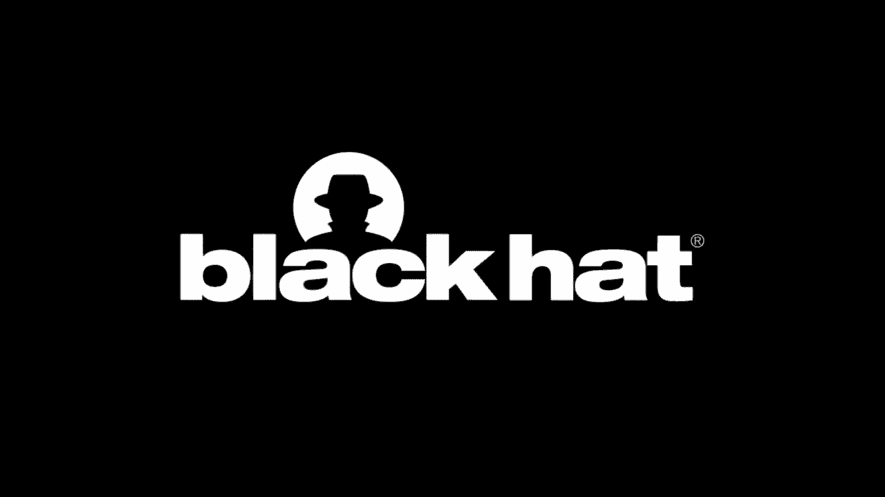

## 概述

在本节课中，我们将学习GCP中的横向移动和权限提升技术，以及如何利用这些技术攻击受损害的组织。

## 横向移动和权限提升

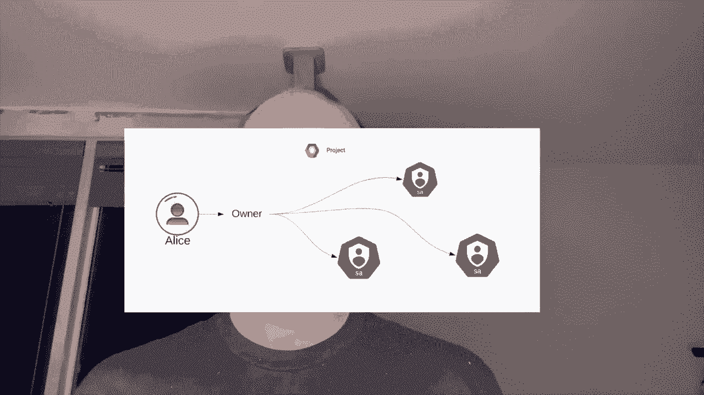

### 横向移动

横向移动是指攻击者在获得对某个资源的访问权限后，尝试获取对其他资源的访问权限。在GCP中，横向移动可以通过以下方式实现：

* **服务账户和服务API**：攻击者可以使用服务账户和云API在GCP环境中进行横向移动。
* **Kubernetes集群**：在多租户Kubernetes环境中，攻击者可以通过控制节点服务账户来获取对其他资源的访问权限。

### 权限提升

权限提升是指攻击者通过某种方式获取比其原始权限更高的权限。在GCP中，权限提升可以通过以下方式实现：

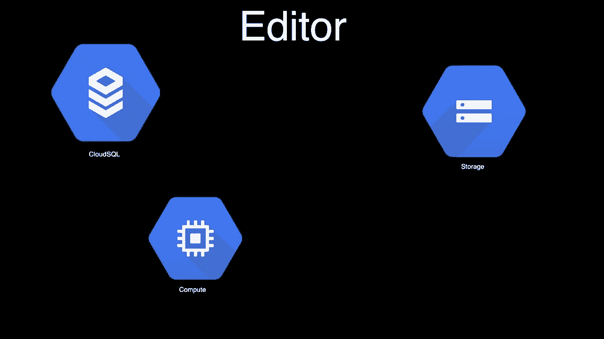

* **默认服务账户**：GCP中的默认服务账户具有项目编辑权限，攻击者可以利用这一点进行权限提升。
* **跨项目角色绑定**：攻击者可以通过跨项目角色绑定来获取对其他项目的访问权限。

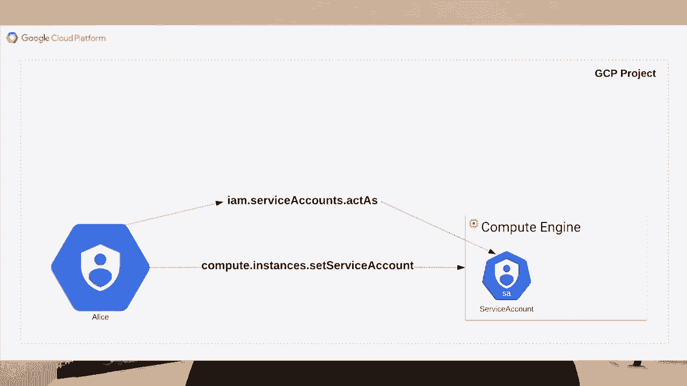

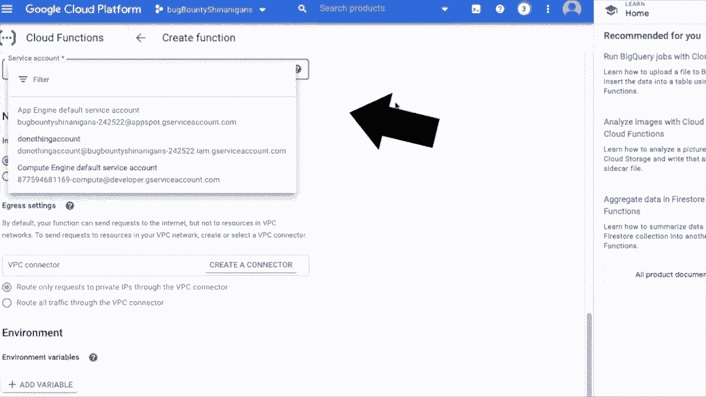

## GCP IAM架构

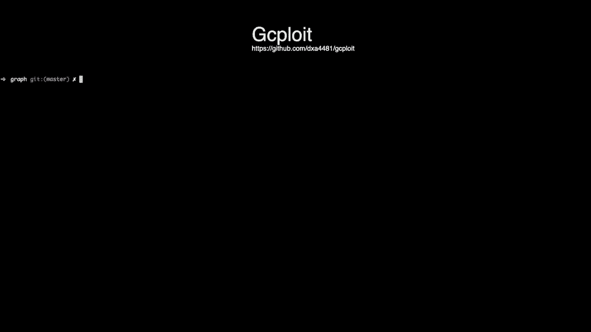

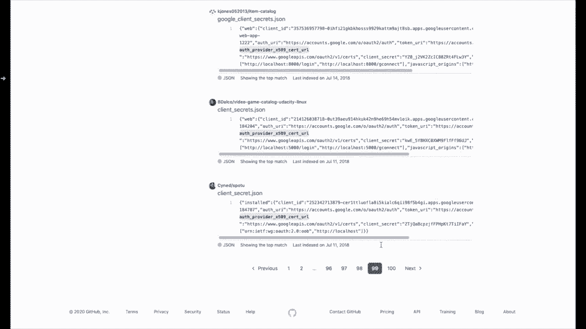

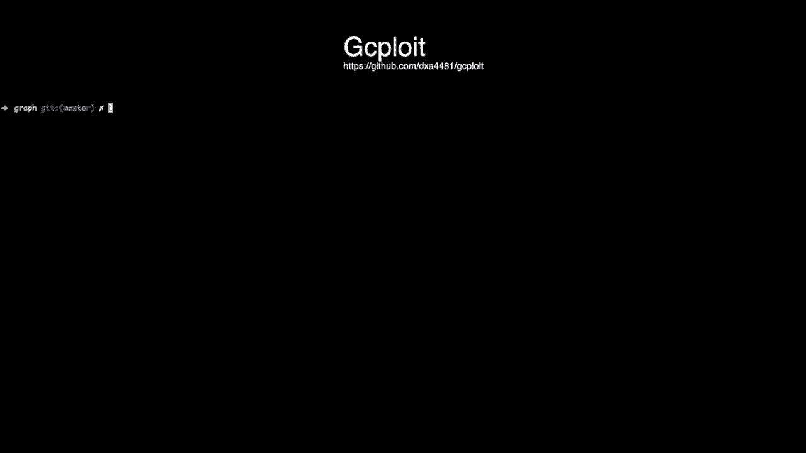

GCP IAM (Identity and Access Management) 架构允许您控制对GCP资源的访问。以下是GCP IAM架构的几个关键概念：

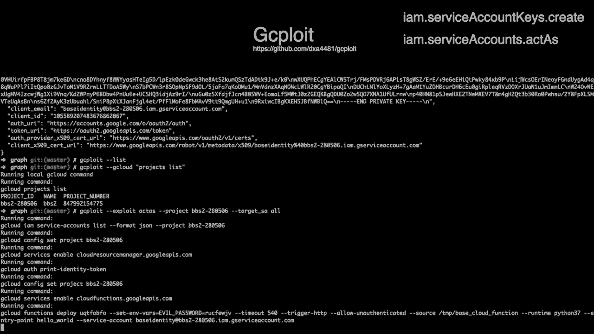

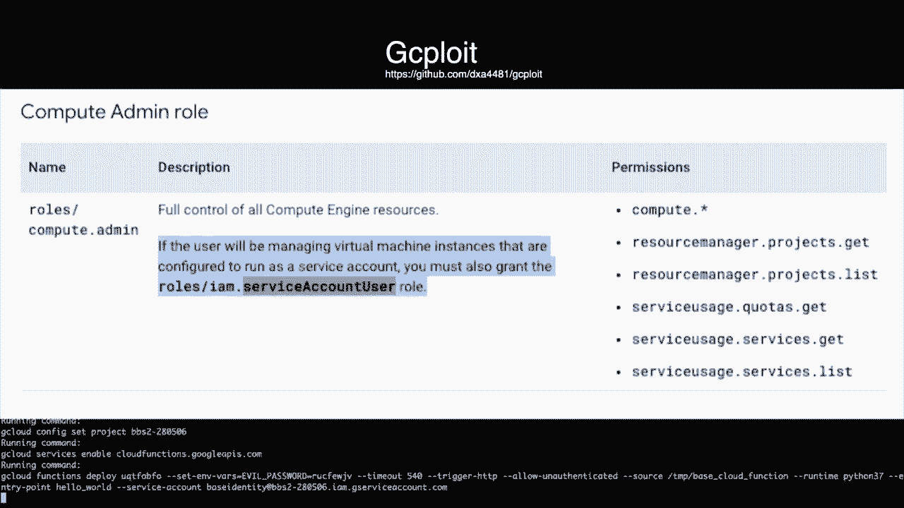

* **组织**：组织是GCP资源的基本容器，它包含项目、文件夹和账户。
* **项目**：项目是GCP资源的基本单元，例如存储桶、虚拟机和数据库。
* **角色**：角色定义了用户或服务账户可以执行的操作。
* **策略**：策略定义了哪些用户或服务账户可以执行哪些操作。

## 横向移动示例

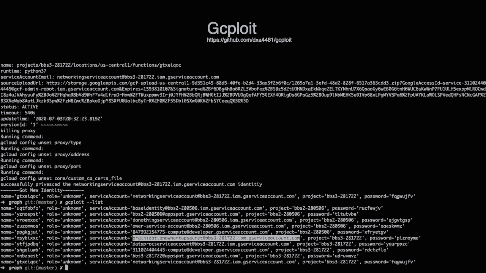

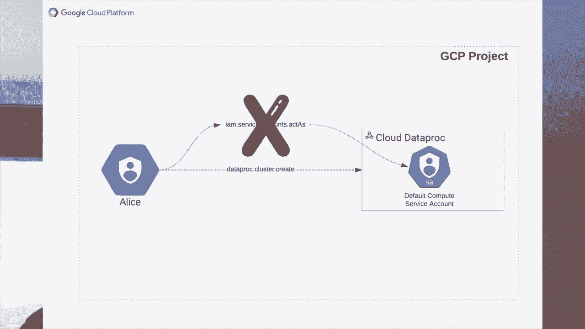

以下是一个横向移动的示例：

1. 攻击者通过OAuth钓鱼攻击获得了对某个项目的访问权限。
2. 攻击者使用G-SPLUT工具获取了该项目的所有服务账户的访问权限。
3. 攻击者发现其中一个服务账户具有项目所有者权限，并利用该权限获取了对整个组织的访问权限。

## 权限提升示例

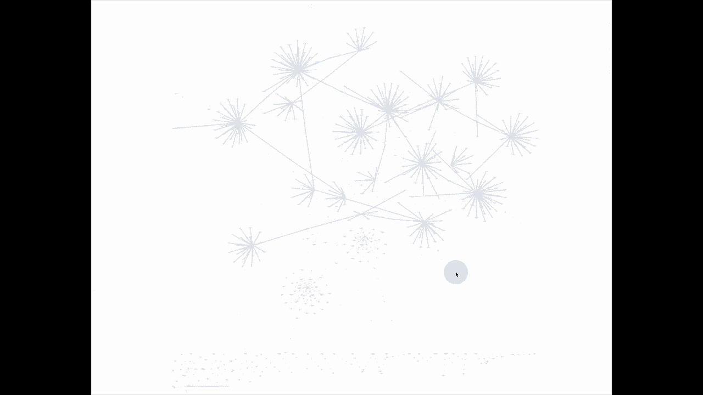

以下是一个权限提升的示例：

1. 攻击者通过默认服务账户获得了对某个项目的访问权限。
2. 攻击者使用G-SPLUT工具获取了该项目的所有服务账户的访问权限。
3. 攻击者发现其中一个服务账户具有项目编辑权限，并利用该权限获取了对整个项目的访问权限。

## 总结

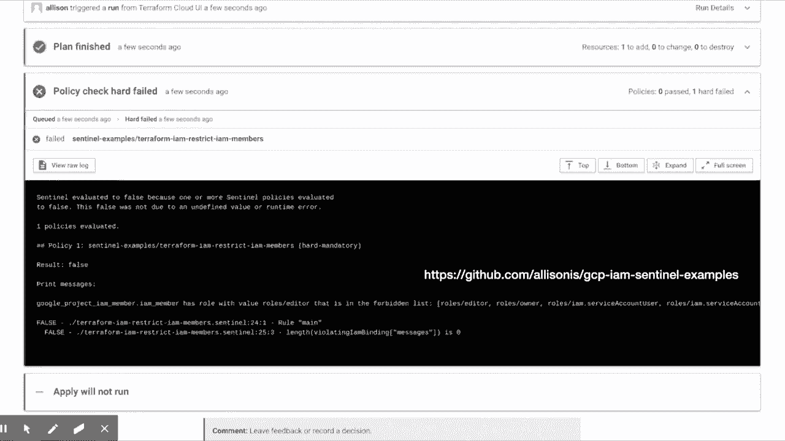

在本节课中，我们学习了GCP中的横向移动和权限提升技术，以及如何利用这些技术攻击受损害的组织。我们还介绍了GCP IAM架构和几个关键概念，例如组织、项目、角色和策略。最后，我们通过示例展示了如何使用这些技术进行横向移动和权限提升。