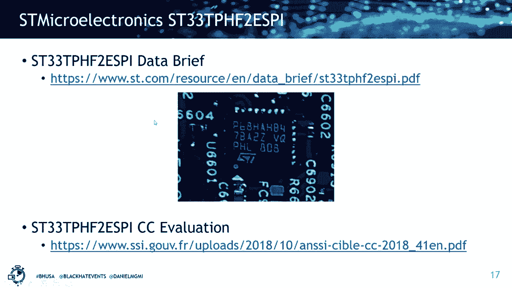
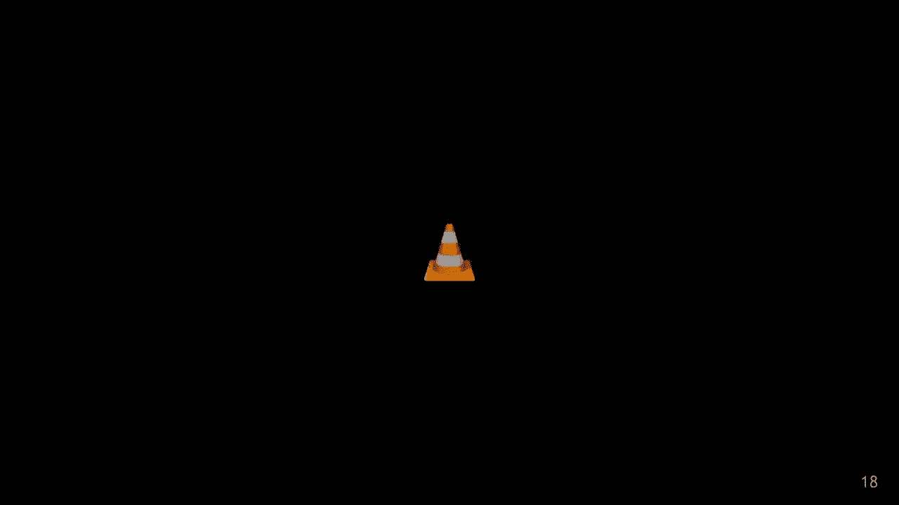
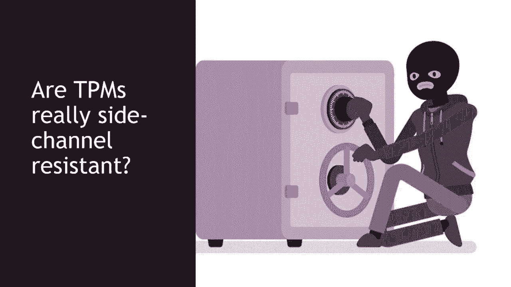
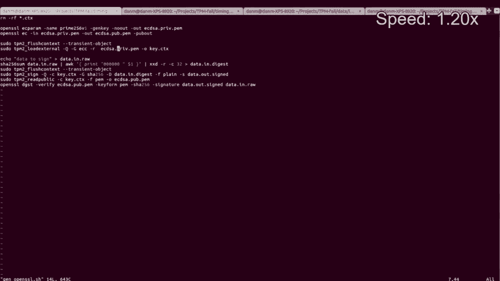
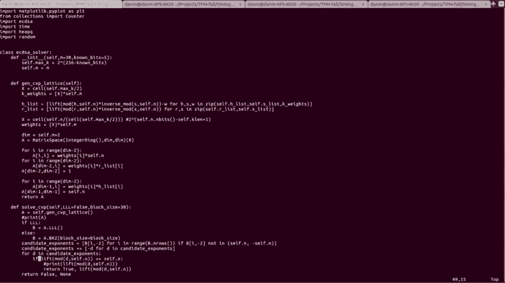

# P10：10 - Remote Timing Attacks on TPMs, AKA TPM-Fail - 坤坤武特 - BV1g5411K7fe


## 概述

在本节课中，我们将学习远程定时攻击TPM（可信平台模块）的相关知识，这种攻击被称为TPM-Fail。我们将探讨TPM的漏洞以及如何利用这些漏洞泄露加密密钥。

## 1. TPM简介

**公式**：TPM = 安全元素 + 标准功能 + 防御物理攻击

TPM是一种安全元素，它支持标准功能，并能够抵御物理攻击，如篡改和侧信道攻击。它通常用于存储加密密钥和重要资产，以确保即使操作系统或云服务提供商被入侵，也无法访问这些信息。




## 2. TPM的漏洞






**公式**：Vulnerability = Timing Attack + Cryptographic Key Leak

研究人员发现，TPM设备存在定时攻击漏洞，攻击者可以利用这些漏洞泄露加密密钥。例如，Intel的FTPM和ST微电子的TPM设备都存在此类漏洞。

## 3. 定时攻击




**公式**：Timing Attack = Timing Difference + Cryptographic Key Leak


定时攻击利用了TPM设备在执行加密操作时的时间差异。攻击者可以通过测量这些时间差异来推断出加密密钥。

## 4. 攻击方法


**代码**：

```python
# 生成CDSA密钥
key = generate_cdsa_key()

# 程序TPM设备
program_tpm_device(key)


# 测量签名操作的时间
timing = measure_signature_time()



# 分析时间数据
leakage = analyze_timing_data(timing)
```

攻击者可以使用脚本生成CDSA密钥，并使用TPM设备进行签名操作。然后，他们可以测量签名操作的时间，并分析这些时间数据以推断出加密密钥。


## 5. 攻击示例

**代码**：

```python
# 收集签名和对应的时间数据
signatures = collect_signatures_and_timing()

# 过滤具有偏置的签名
filtered_signatures = filter_biased_signatures(signatures)

# 使用格基攻击恢复私钥
private_key = recover_private_key(filtered_signatures)
```

攻击者可以收集签名和对应的时间数据，并使用格基攻击恢复私钥。

## 6. 总结

本节课中，我们学习了远程定时攻击TPM的相关知识。我们了解到TPM设备存在漏洞，攻击者可以利用这些漏洞泄露加密密钥。我们还学习了如何使用定时攻击和格基攻击来恢复私钥。

**本节课中我们一起学习了**：

* TPM简介
* TPM的漏洞
* 定时攻击
* 攻击方法
* 攻击示例