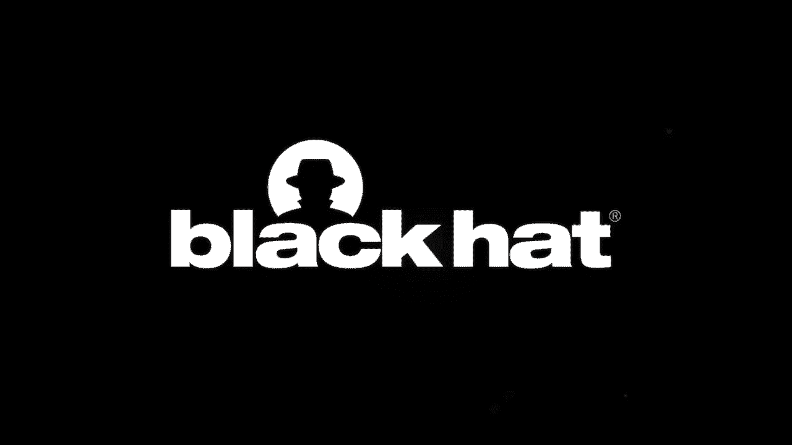

# P11：11 - 十年鼠疫：面向所有人的定制中国Linux Rootkits - 坤坤武特 - BV1g5411K7fe

感谢大家的参与。

这是“十年鼠疫：面向所有人的定制中国Linux Rootkits”。我是Kevin LaVellie。

Blackberry威胁情报部总监。现在我知道我今天穿得像律师，而且有人告诉我看起来像律师。

但我不是。所以请务必注意这里的小字，由真正的律师撰写的。

并理解我今天是在为自己说话，而不是为我的雇主说话。在我继续之前。

我想说几句感谢的话。首先，感谢Black Hat评审委员会。

感谢邀请我演讲。感谢Blackberry的现任领导。

感谢你们继续给我们提供像这样进行研究的机会。感谢Anthony Freed。

感谢你把它带出大门。感谢Silence研究部门过去的领导。

我在那里开始，特别是John Miller、Ryan Smith、Tom Wabishevitz。

以及Jeff Tang和当前的应用研究团队成员。

感谢你们的鼓励、指导和支持。最后。

感谢与我一起进行这项研究的人，但他希望保持匿名。

研究或行为，你应得到最大的感谢。一个非常好的队友。

考虑到威胁情报是一个团队努力，这一点非常重要。谢谢，伙计。你知道。

这种团队方法在安全研究方面值得在这里停留片刻。

因为无论我在职业生涯中走到哪里，我都发现，由。

不同思维方式的人组成的团队会进行更好的调查，并取得更好的成果。

这当然也是我在纽约市度过的时光的真实情况，在那里我监督着一个调查。

队伍，这是全国最大的独立和民间警察监督机构，一项似乎相当及时的追求。

调查性新闻也是一项团队努力。

在我担任Blackberry威胁情报部总监之前，我在60分钟里担任过这个角色。

向我的前同事、自由职业摄影师Chris Albert致敬，他正在拍摄这个。

谢谢，兄弟。现在，别担心。

这次演讲不会持续60分钟。它只会持续一半那么长。在时间结束之前。

所有在家观看的人都应该对为什么我所有的新闻工作时间都在摄像机后面度过。

有更深的理解。好的，Chris，回来，伙计。

没有人想看到那个。你知道，威胁情报和调查性新闻可能比你想象的更有共同之处。

冒着陷入另一个演讲轨道的风险。

我只想指出三个重要的重叠领域，因为这可能会帮助我们今天。

首先，两者都专注于寻找隐藏的真相，强调隐藏。其次。

只有在人们关注它们的时候，它们才能发挥作用。也就是说。

当它们产生有趣的叙述时，这些叙述能够解释一个复杂的、晦涩的、通常令人厌烦的细节网络。

这就是我现在要做的。我将提出一些关键问题，这些问题激励了我们，并带你们一起踏上寻找答案的旅程。

现在，剧透警告，不是每个问题都有答案。

但与其浪费时间解释你已经知道的事情，比如rootkits和后门是如何工作的，

这让我觉得就像掀开引擎盖看发动机一样。

我将尝试传授一些我认为更有价值的东西。不。

这不是一份给你的威胁情报的IOCs列表，尽管如果这是你来的原因，我可以帮你。

相反。

我希望你能留下一些具体的例子，说明如何更批判性地思考我们如何进行恶意软件分析。

我将尝试向你展示如何在研究过程中识别你自己的认知偏差。

简而言之，我将向你展示如何质疑你的发现，以及如何质疑。

你的思考。现在，做这两件事应该有助于使我们都创建的总体情报产品更好、更有意义。

好的，让我们从第一个问题开始。

我们为什么都在这里。也就是说，我们到底发现了什么？好吧，首先。

我们发现了很多Linux恶意软件，这些恶意软件已经默默无闻地存在了很长时间。

我们开始做的是我认为在今天的InfoSec社区中并不总是发生的事情。

那就是过于专注于新事物和下一件事。也就是说，我们回顾过去。

想象一下，你坐下来检查一些旧的APT活动，然后发现了一个以前从未见过的后门。

然后想象一下，你拉紧这个线索，发现了一个rootkit，然后。

砰！一整堆Linux恶意软件。它是动态编译的，可以根据目标进行定制。

然后后来，想象一下，你发现这种恶意软件正在被一个由五个不同组织分享的分裂细胞使用。

这些组织分别被你作为不同的中国APT进行跟踪。

但是当你深入了解时，你会发现它们实际上只是原始。

WinNTI组的衍生物，这里用引号。其中包括这些五个中的原始Kaspersky实验室定义的WinNTI组的残余。

就像它现在所做的那样。但还有像青铜联盟这样的组织。

一些人可能更熟悉它，称为APT27或Emissary Panda，一个名为Pass-CV的组织。

微软称之为lead，我们跟踪为CASPER，以及一个新兴的组织。

我们跟踪为Win Linux分裂细胞。现在，我将在稍后回到那个混乱的。

用引号引用的WinNTI归属声明，但现在。

让我们回到Linux工具集的内容。好吧，我们