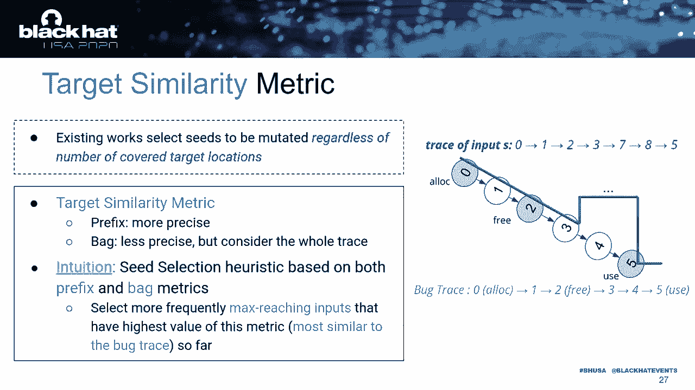

# P12：12 - 关于定向模糊测试和Use-After-Free - 如何找到复杂且静默的漏洞 - 坤坤武特 - BV1g5411K7fe

## 概述

在本节课中，我们将学习定向模糊测试和Use-After-Free（UAF）漏洞。我们将探讨定向模糊测试的概念，以及如何利用它来发现复杂且静默的UAF漏洞。

## 定向模糊测试

定向模糊测试是一种针对特定目标的模糊测试方法。与传统的模糊测试不同，定向模糊测试的目标是达到特定的目标，例如修复测试或漏洞复现。

**公式**：

定向模糊测试 = 模糊测试 + 目标

## Use-After-Free（UAF）漏洞

UAF是一种内存漏洞，当程序在释放内存后仍然访问该内存时会发生。UAF漏洞可能导致数据损坏、信息泄露、服务中断等安全问题。

**公式**：

UAF漏洞 = 释放内存 + 访问已释放内存

## 定向模糊测试在UAF漏洞中的应用

由于UAF漏洞的复杂性和静默性，传统的模糊测试方法很难发现它们。因此，我们需要使用定向模糊测试来发现UAF漏洞。

**以下是定向模糊测试在UAF漏洞中的应用**：

1. **静态分析**：分析程序代码，识别潜在的UAF漏洞。
2. **动态分析**：运行程序，监控内存访问，发现UAF漏洞。
3. **定向模糊测试**：针对UAF漏洞进行定向模糊测试，生成特定的输入数据，触发UAF漏洞。

## UAF定向模糊测试框架

为了提高UAF定向模糊测试的效率和准确性，我们提出了一种名为UAF的定向模糊测试框架。

**UAF框架的主要特点**：

1. **静态预计算**：在二进制级别快速进行静态预计算。
2. **新的输入指标**：引导模糊测试器在运行时关注目标。
3. **预过滤**：选择覆盖目标的基本块的概率较高的输入，并预过滤可能触发崩溃的输入。
4. **基于相似度的选择**：根据相似度选择输入，并评估输入的可靠性。

## UAF框架的应用

UAF框架可以应用于以下场景：

1. **UAF漏洞复现**：利用UAF框架复现UAF漏洞，帮助研究人员理解漏洞的原理。
2. **修复测试**：利用UAF框架测试修复后的程序，确保修复方案的有效性。
3. **漏洞挖掘**：利用UAF框架挖掘新的UAF漏洞。

## 总结

本节课中，我们学习了定向模糊测试和UAF漏洞。通过学习UAF定向模糊测试框架，我们可以更有效地发现和修复UAF漏洞。希望这节课的内容能够帮助您更好地理解UAF漏洞和定向模糊测试。