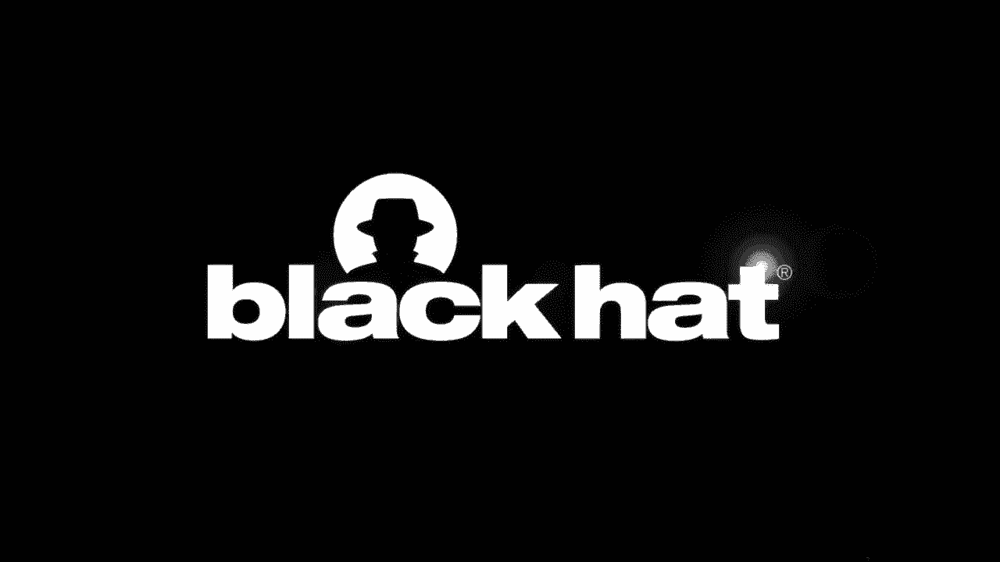
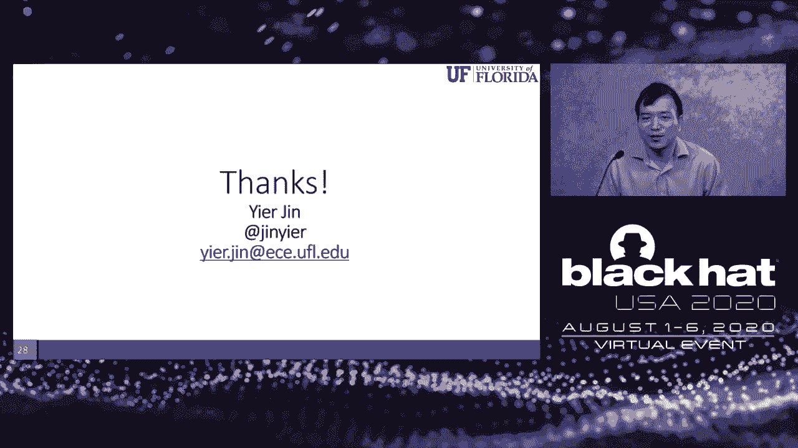

# P13：13 - CloudLeak - DNN Model Extractions from Commercial MLaaS Platforms - 坤坤武特 - BV1g5411K7fe



## 概述

在本节课中，我们将学习如何从商业机器学习即服务（MLaaS）平台中提取深度神经网络（DNN）模型。我们将探讨攻击方法、防御策略以及该领域的研究现状。

## 讲师介绍

* **Eir Jin**：佛罗里达大学副教授，物联网团队教授。
* **Hong Kong Yi**：佛罗里达大学访问博士生，研究方向为机器学习安全。
* **Zong Yi Ho**：台湾清华大学计算机科学系教授，台湾科技部AI创新计划项目负责人。

## 背景知识

* **深度神经网络（DNN）**：一种具有多层非线性变换的神经网络，在图像识别、语音识别等领域取得了巨大成功。
* **机器学习即服务（MLaaS）**：一种将机器学习模型作为服务提供的模式，用户无需自己训练模型即可使用。
* **模型提取攻击**：从MLaaS平台中提取模型，用于其他目的。

## 攻击方法

1. **生成低置信度对抗样本**：利用对抗样本生成方法，生成与边界附近的样本，这些样本具有较低的置信度。
2. **查询MLaaS模型**：使用生成的对抗样本查询MLaaS模型，获取其分类结果。
3. **训练本地模型**：使用查询结果和现有模型库，训练本地模型，使其与MLaaS模型的行为相似。

## 防御策略

* **识别输入**：检测异常输入，例如对抗样本。
* **限制查询次数**：限制用户查询模型的次数，以降低攻击成本。

## 实验结果

* 使用微软服务中的交通和花卉分类模型，仅查询几百次即可达到76%的准确率。
* 使用基于特征的攻击方法，可以提取参数数量约为2亿的DNN模型，仅需要3000次查询。

## 总结

本节课介绍了从商业MLaaS平台中提取DNN模型的方法，并探讨了防御策略。该研究有助于提高人们对AI安全的认识，并为构建更安全的AI系统提供参考。

## 代码示例




```python
# 生成对抗样本
def generate_adversarial_example(image, model):
    # ... (代码实现)

# 查询MLaaS模型
def query_mlaaS_model(adversarial_example):
    # ... (代码实现)

# 训练本地模型
def train_local_model(adversarial_examples, model):
    # ... (代码实现)
```