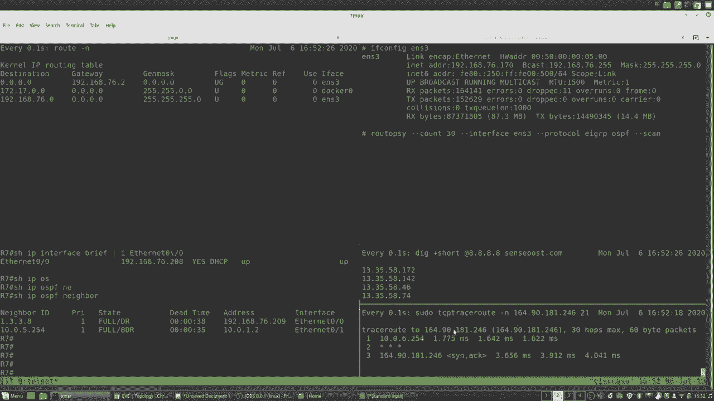
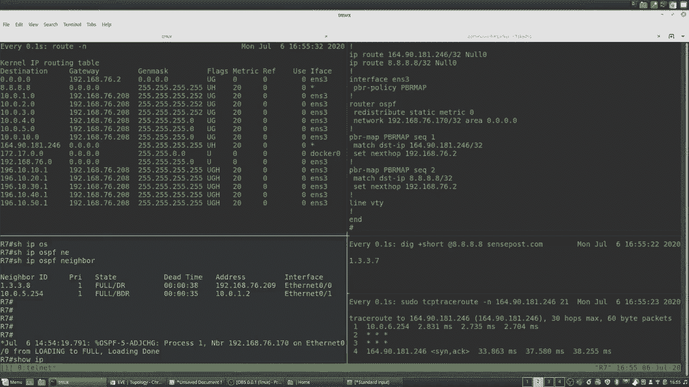
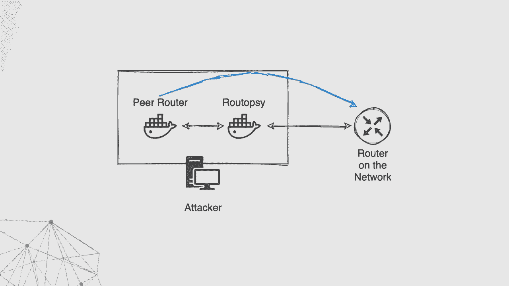
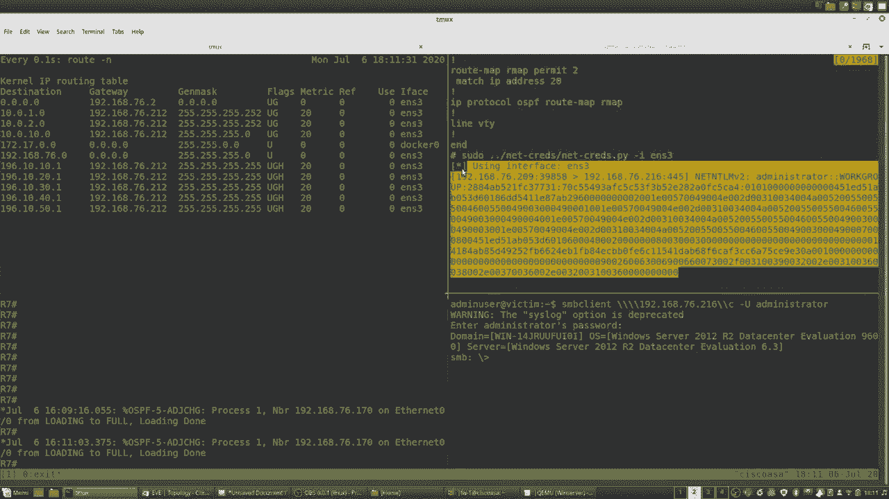
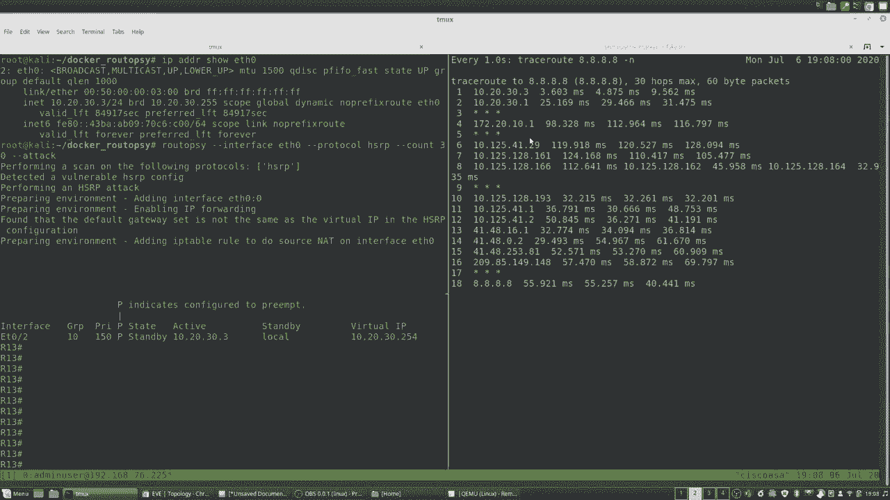
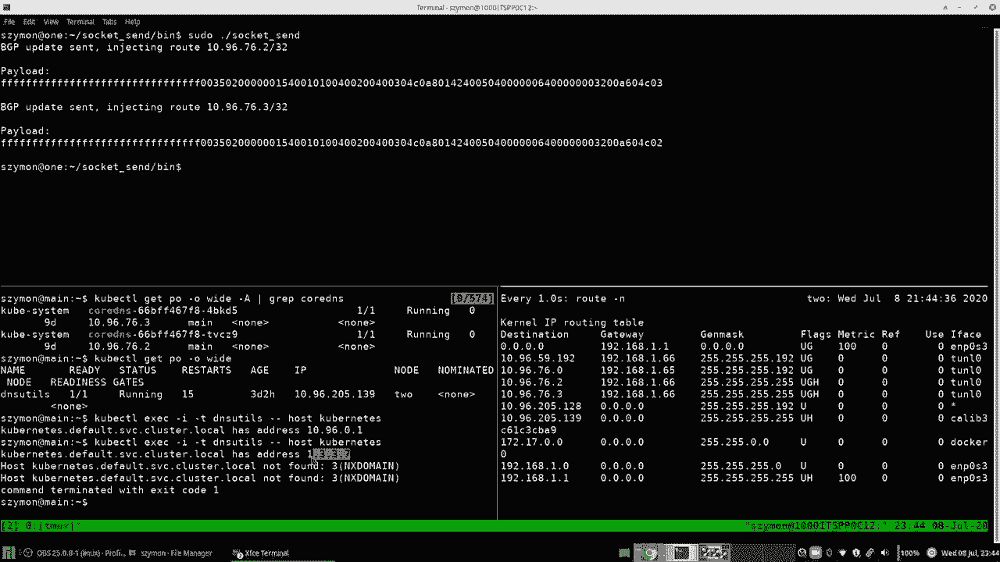

# P14：14 - Routopsy - 现代路由协议漏洞分析与利用 - 坤坤武特 - BV1g5411K7fe

大家好，欢迎来到我们的讲座“Rutopsy”，我们将讨论现代路由协议。

本讲座将涵盖漏洞分析和利用。我是Shramun Jukovsky。在那之前，我一直在企业网络中黑客攻击了三年。我是南非比勒陀利亚大学的学生，我喜欢应用安全和编写代码。你可以在Twitter上找到我 @thegoatformer。大家好，我叫Tyran Kemp。

我大约有四年的网络和网络安全经验。我正在朝着三年渗透测试经验的目标努力，我的Twitter是TKMPax。我并不真正了解Twitter是如何工作的，或者任何应用程序，我享受黑客攻击。我和Simon都是内部安全分析师，我们都是Sensepost团队的一员，我们想成为你的邻居。我们的意思是，我们想向你展示如何使用Wireshark等工具识别一些酷炫的漏洞。我们的初步尝试是在这些易受攻击的协议上执行这些利用。这些漏洞的影响是什么，以及我们在攻击这些协议时面临的一些挑战。最后，我们的工具包试图解决这些挑战。因此，我们在一些渗透测试中进行了尝试，并且经常看到这些动态路由协议和第一跳冗余协议被用于用户网络空间。因此，我们的工具包希望包括大量与网络相关的攻击，但到目前为止，我们专注于这两类。它们在可以操纵流量流的方式上相似，但首先了解动态路由协议在多个网络之间路由流量，而第一跳冗余协议则更像是一种高可用性机制。因此，会有很多缩写和术语，就像字母汤一样。请尽量跟上我们。一些FHRPs，一些稳定性DRPs可能会让人困惑，但在DRP堆栈中，我们将关注EIGRP和OSPF，然后在FHRP堆栈中，我们将关注HSRP。那么，我们为什么要这样做呢？就像我说的，通过多次渗透测试，我们看到了这些事物被用于不同的网络。我们没有在特定的拓扑结构中找到这些漏洞，也没有绑定到特定的行业。我们在许多不同的企业网络中看到了它们，在ISP，在银行，在小型网络中，我们真的到处都看到了它们。此外，这些动态路由协议正在被用于Kubernetes。Kubernetes使用容器网络接口，通常称为CNI。例如，有一个名为Romana的CNI，它使用OSPF，还有一个名为Calico的CNI，它使用BGP。因此，我们将简要介绍DRP和FHRP的目的，但在我们这样做之前，让我们解释一下静态路由的概念。

**静态路由**

如果我们想从10网络路由到14网络，我们需要添加从路由器A到路由器A和从路由器B到路由器C的路由，然后还需要处理写入部分。因此，我们需要添加从路由器C到路由器B和从路由器B到路由器A的路由。仅解释静态路由之间的三个小路由就相当繁琐。现在，想象一下你自己在一个大型企业网络中，有100个路由器和1000个不同的网络，现在你需要配置这些静态路由，如幻灯片上所示的蓝色箭头所示，然后你已经需要处理一些高可用性，所以你需要配置具有不同度量值和优先级的额外静态路由，以确保你可以有故障转移或高可用性。这不是一个可扩展的解决方案，这就是为什么我们有动态路由协议。因此，而不是配置这些静态路由，你可以在你的路由器上配置像OSPF或ER，DRP等协议，它将成为其相邻路由器的邻居，并且相邻的概念是我们将在整个讲座中引用的。因此，一旦你在路由器上配置了这些协议，它将自动共享网络信息，并且如果链路中断，它还将处理自动故障转移。至于第一跳冗余协议，有一个逻辑组在活动组和备用组之间，为这个逻辑组分配了一个虚拟MAC地址。如果活动设备发生故障转移，那么虚拟MAC地址将由新的活动指定路由器响应。因此，可能会有网络故障，但对用户和流量来说是透明的，并且流量流就像预期的那样。那么，Simon，你想要向我们展示在哪里可以找到这些漏洞，或者如何查找它们吗？

**查找漏洞**

是的，那么我们如何查找它呢？好吧，让我们打开一个数据包捕获，例如Wireshark，如果我们查看我们捕获的第一个数据包，它是一个EIGRP问候数据包，对吧？因此，当我们收到这些数据包时，有一些字段我们需要注意，因为如果我们想与路由器建立邻居或执行攻击，我们需要这些相同的值。在EIGRP的情况下，我们首先要注意的是自治系统编号。在这种情况下，它是100，因此我们必须将