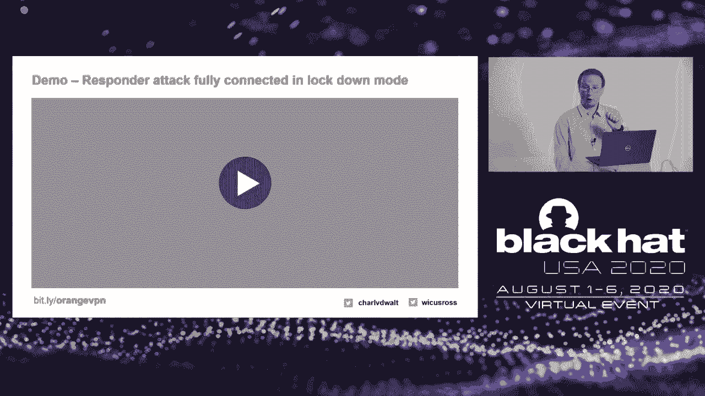

# P17：17 - Virtually Private Networks - 坤坤武特 - BV1g5411K7fe

## 概述

在本节课中，我们将探讨虚拟专用网络（VPN）技术及其在保护用户免受恶意Wi-Fi接入点攻击方面的作用。我们将分析VPN如何提供网络和安全等效性，并讨论在现实世界场景中可能遇到的特定威胁。

## VPN技术概述

VPN是一种加密技术，允许用户通过公共网络（如互联网）安全地连接到私有网络。它通过创建加密隧道来保护数据传输，防止数据泄露和中间人攻击。

**公式**：


```
VPN = 加密隧道 + 安全协议
```

## VPN在恶意Wi-Fi接入点攻击中的作用

恶意Wi-Fi接入点（如具有诱捕门户的接入点）可能被用于窃取用户数据或执行恶意活动。VPN可以帮助保护用户免受以下威胁：

* **嗅探**：防止攻击者窃取网络流量中的敏感信息。
* **DNS篡改**：防止攻击者篡改DNS响应，导致用户连接到恶意网站。
* **钓鱼攻击**：防止攻击者利用钓鱼网站窃取用户凭据。
* **中间人攻击**：防止攻击者拦截和篡改用户与网络之间的通信。

## 研究方法

研究人员创建了一个标准测试环境，模拟恶意Wi-Fi接入点攻击，并测试了不同VPN产品在以下场景中的表现：

* **诱捕门户状态**：用户无法访问互联网，只能与诱捕门户交互。
* **在线状态**：用户可以访问互联网，但可能处于恶意Wi-Fi接入点攻击的风险中。

## 研究结果



研究结果表明，VPN在保护用户免受恶意Wi-Fi接入点攻击方面存在局限性。以下是一些关键发现：

* **标准模式**：VPN在标准模式下提供的保护有限，尤其是在诱捕门户状态下。
* **锁定模式**：启用锁定模式可以显著提高VPN的保护能力，但仍存在一些无法缓解的威胁。
* **不同供应商**：不同供应商的VPN产品在保护能力方面存在差异。

## 结论

VPN是保护用户免受恶意Wi-Fi接入点攻击的重要工具，但需要与其他安全措施结合使用。以下是一些最佳实践：

* **启用锁定模式**：确保VPN在锁定模式下运行，以提供最大程度的保护。
* **控制DNS**：确保DNS配置正确，防止DNS篡改攻击。
* **避免分隧道**：使用全隧道模式，确保所有流量都通过VPN加密。
* **定期更新VPN软件**：确保VPN软件保持最新，以防止已知漏洞。

## 总结


在本节课中，我们一起学习了VPN技术及其在保护用户免受恶意Wi-Fi接入点攻击方面的作用。我们讨论了VPN如何提供网络和安全等效性，并分析了在现实世界场景中可能遇到的特定威胁。希望您对本节课的内容有所收获。