# P18：18 - Plundervolt - Flipping Bits from Software without Rowhammer - 坤坤武特 - BV1g5411K7fe


## 概述


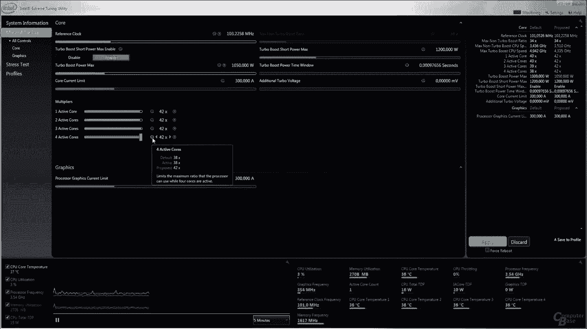

在本节课中，我们将学习Plundervolt攻击，这是一种无需Rowhammer即可从软件中翻转位的技术。

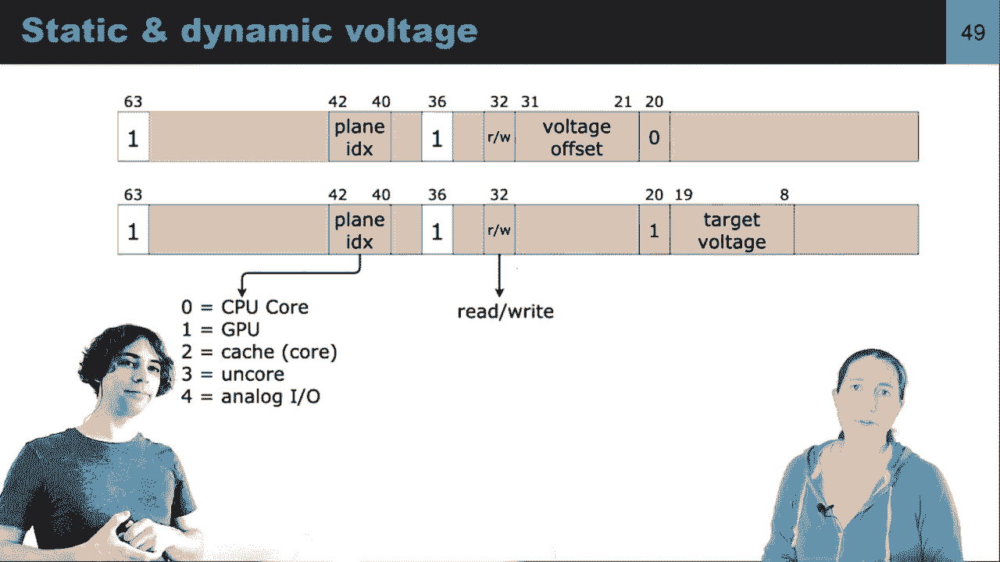


## Rowhammer攻击

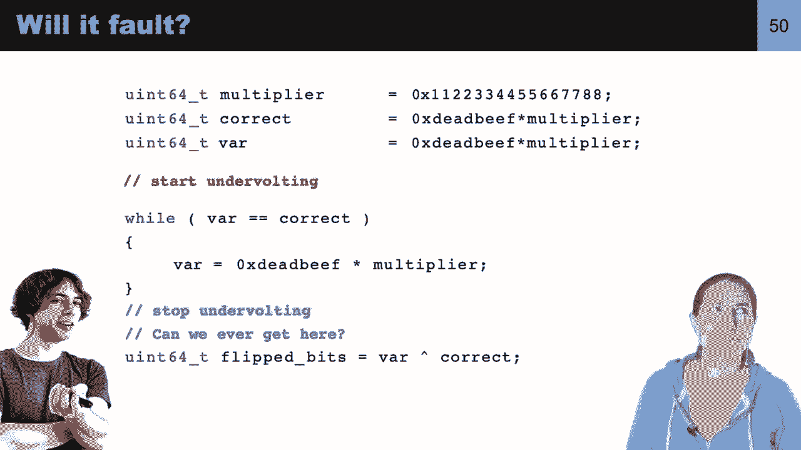


Rowhammer攻击是一种利用DRAM行缓冲器刷新机制来翻转位的技术。通过访问特定行，可以放电不仅读取并复制到行缓冲区的单元格，还可以放电附近的单元格，从而造成位翻转。


## Plundervolt攻击

Plundervolt攻击是一种无需Rowhammer即可从软件中翻转位的技术。它利用了动态电压和频率缩放（DVFS）技术，通过修改内存映射寄存器来改变硬件的电压。

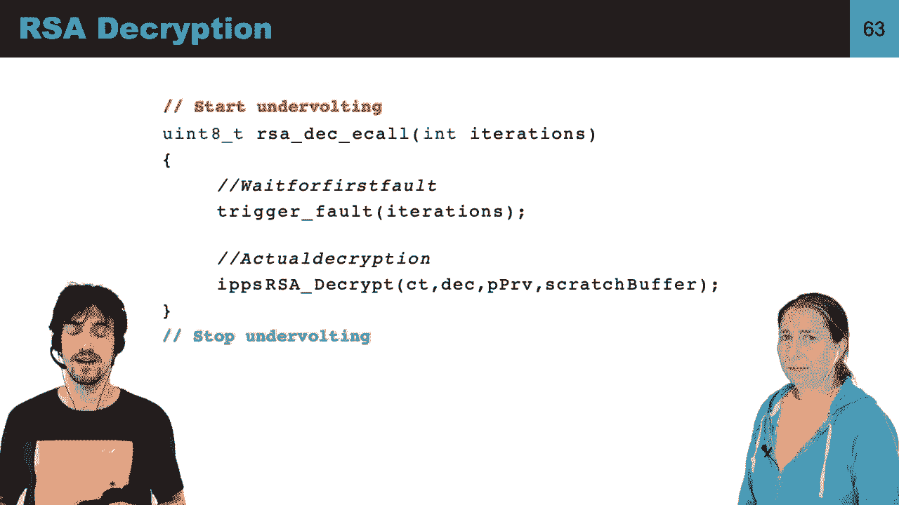

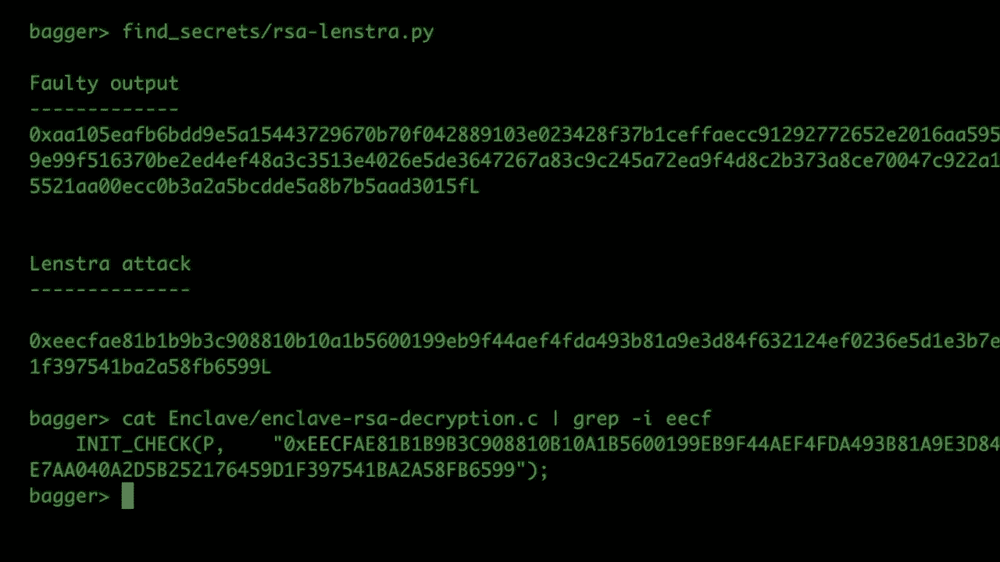


## 实现Plundervolt攻击

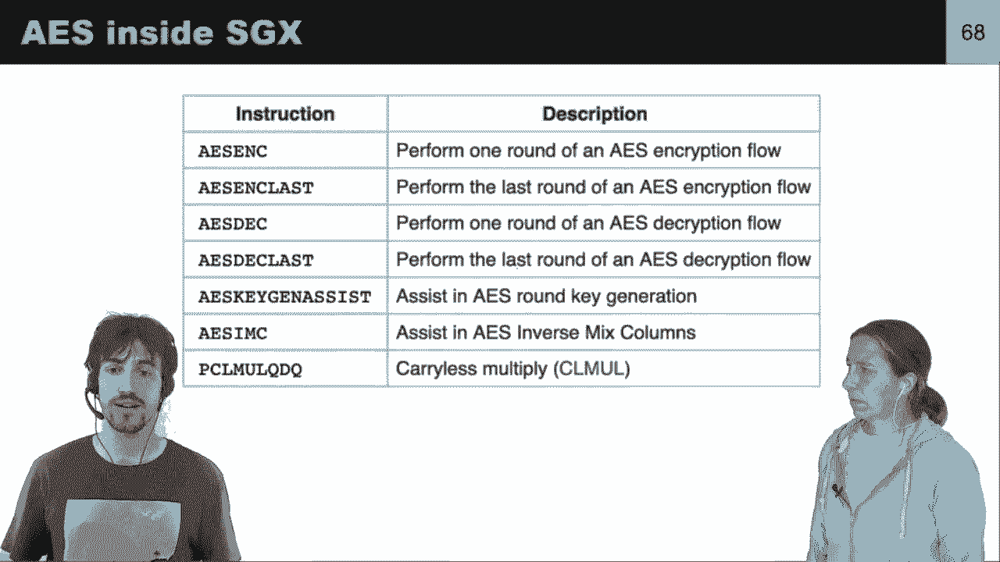


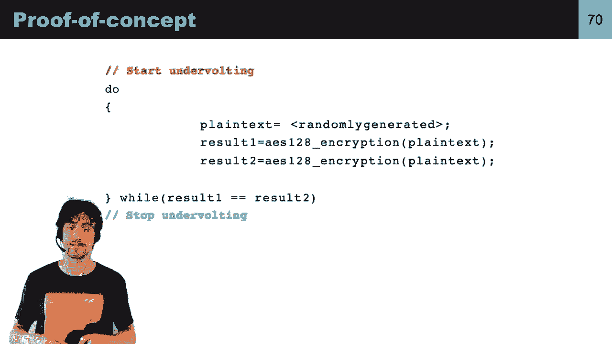

以下是使用C代码实现Plundervolt攻击的示例：


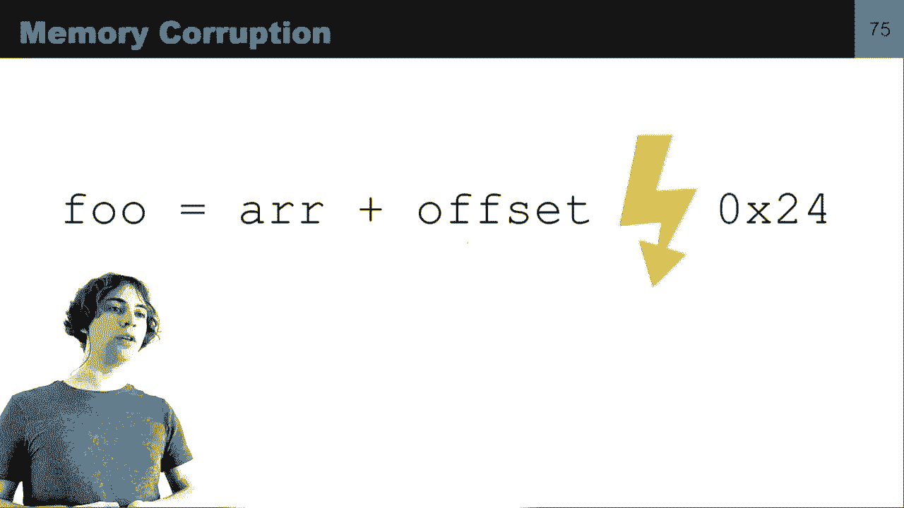

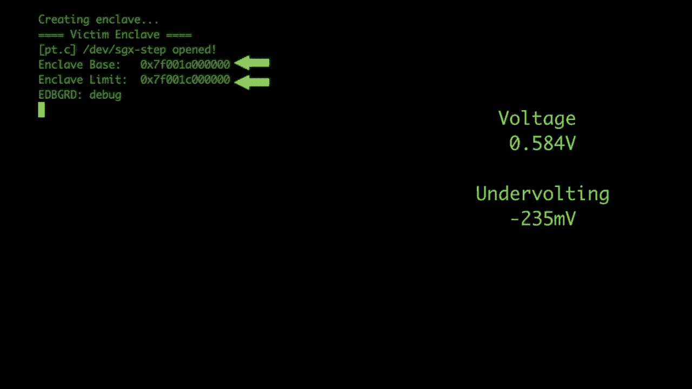

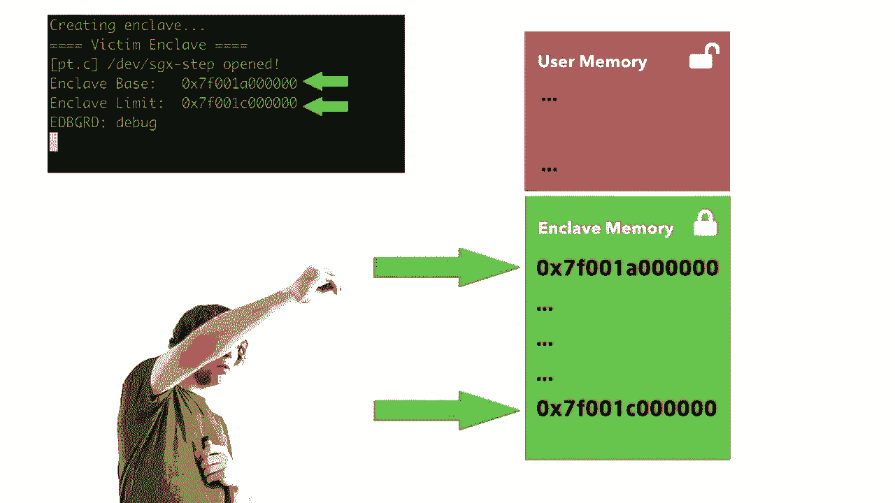

```c
#include <stdio.h>
#include <stdint.h>
#include <unistd.h>


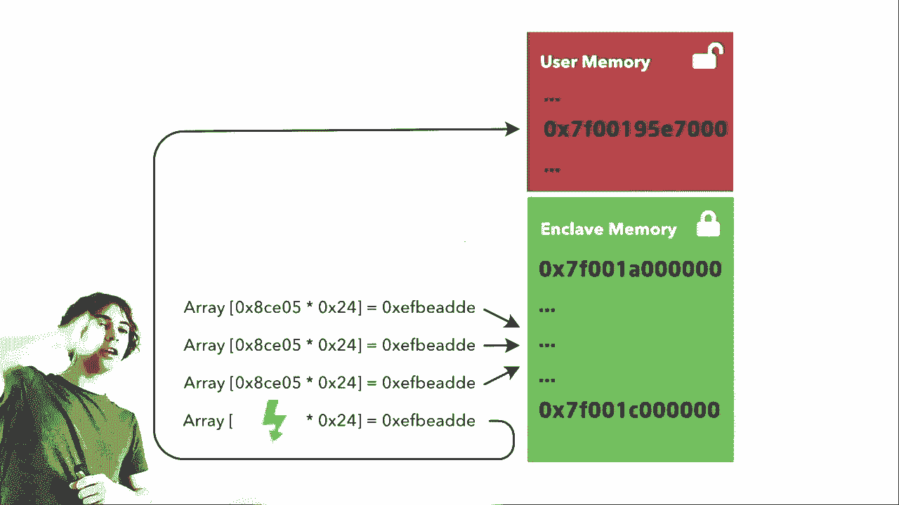


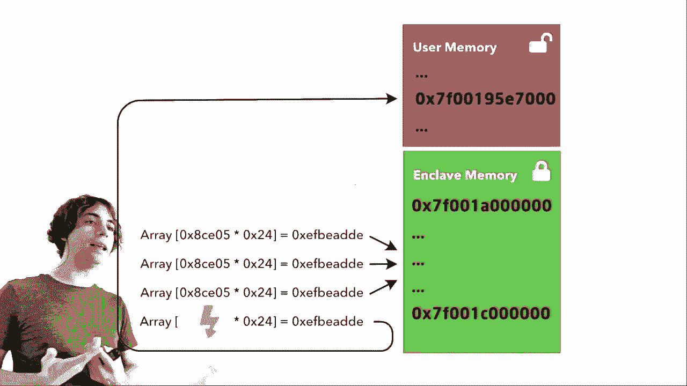


int main() {
    // 设置频率为1 GHz
    // ...

    // 加载MSR驱动程序
    // ...

    // 修改电压
    // ...

    // 执行操作并检查故障
    // ...

    return 0;
}
```


## Plundervolt攻击的应用

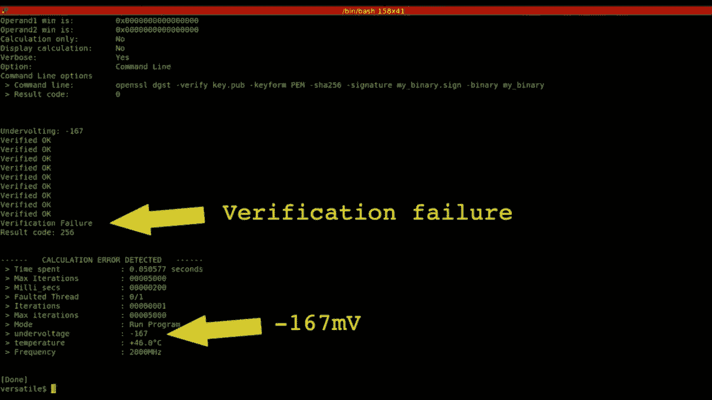


Plundervolt攻击可以用于以下场景：

* **破解加密算法**：例如，通过注入故障来破解RSA和AES加密算法。
* **读取受保护的数据**：例如，通过注入故障来读取SGX enclave中的秘密数据。
* **导致程序崩溃**：例如，通过注入故障来导致程序崩溃。

## 总结

本节课中，我们学习了Plundervolt攻击，这是一种无需Rowhammer即可从软件中翻转位的技术。Plundervolt攻击可以用于多种场景，包括破解加密算法、读取受保护的数据和导致程序崩溃。