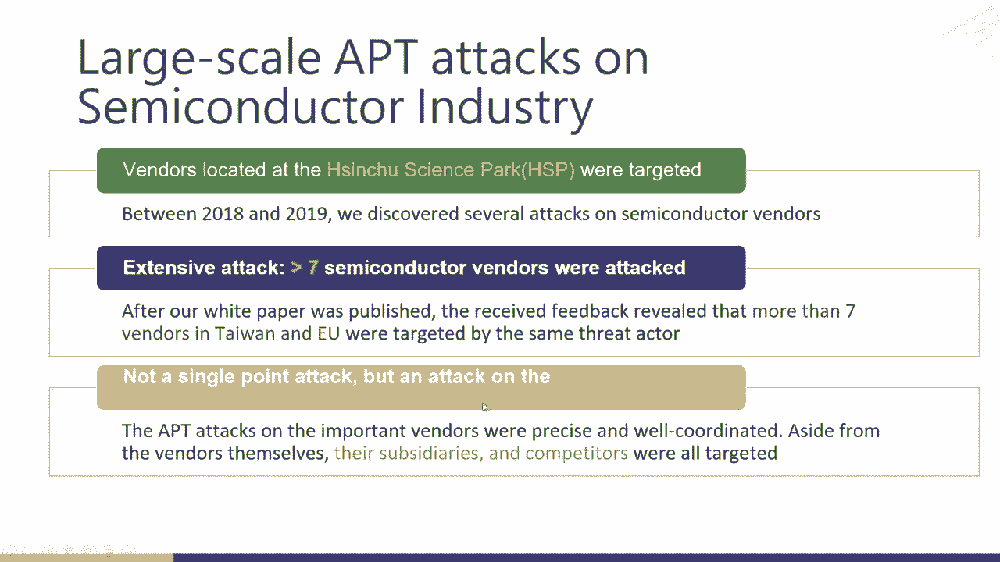
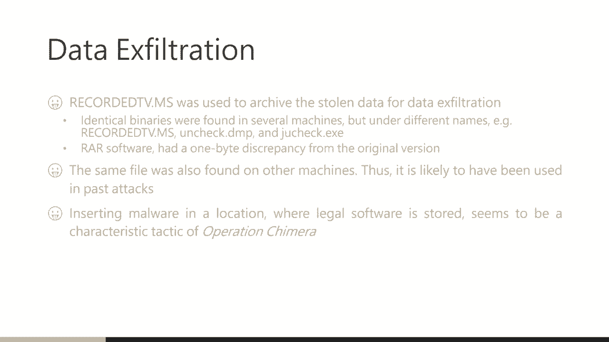
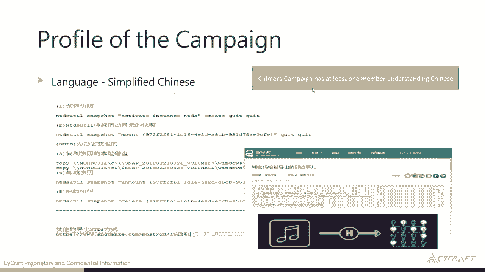
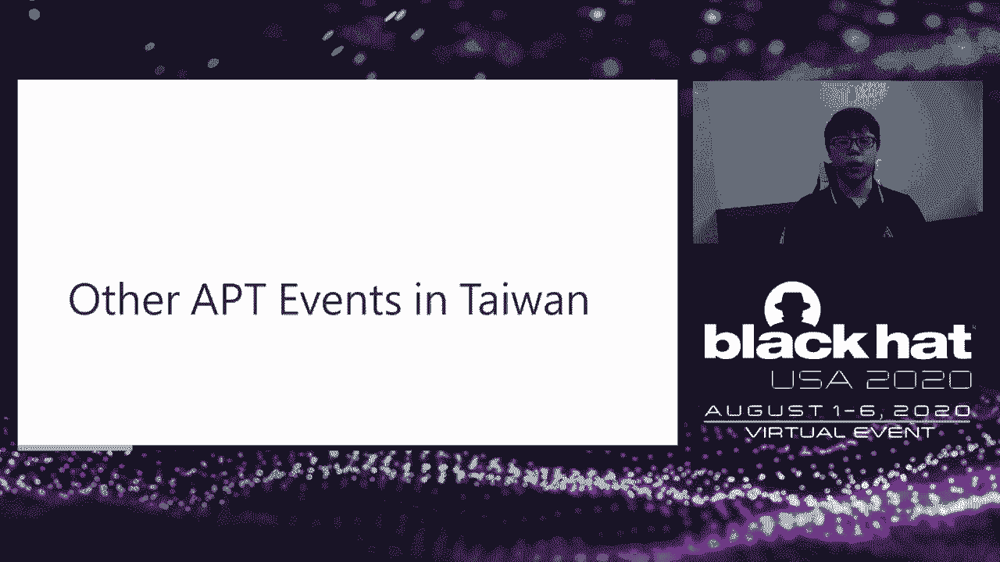
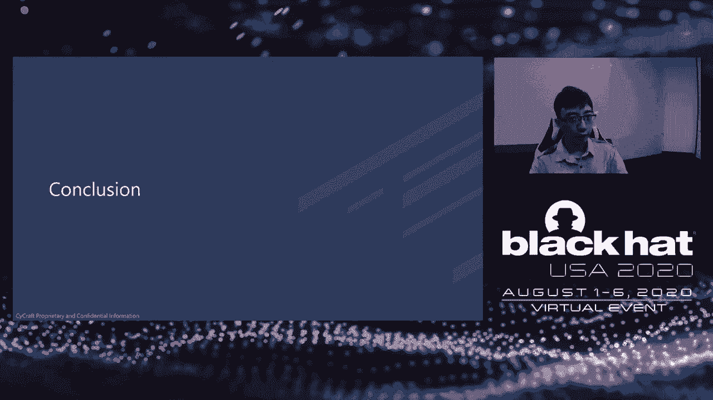

# P19：19 - Operation Chimera - APT Operation Targets Semiconductor Vendors - 坤坤武特 - BV1g5411K7fe

 Hello everyone。

 I'm Zong Han-chan。 I'm happy to continue to share our research。 Operation Kimela。

 APT Operation Target's Seven Contata vendors。 My college， Indilin， Shanda Zhang。

 and I will show the APD group called Kimela， which is， discovered in 2018 and 2019。

 Let's briefly introduce ourselves。 I'm CK Chan。 I'm a senior researcher at Site Correct。

 First in university， studied for my PhD degree， I played a CTF and founded a CTF of Kitten。

 Code and BootFox。 And we joined the deaf count finals。 It's 2016 and 2018。

 And currently I just retired。 I also met the report at the HICOM and HIV。

 So I'm an active member in the security community。 In Taiwan community。

 I also joined a CO2 which is the best health group in Taiwan。 My partner， Shanda Zhang。

 who is a security researcher at Site Correct。 And he also found a local type HICOM group called UCCU HECRS。

 And Indilin is also a security researcher at Site Correct。 And he is a reverse engineer， hubbeast。

 and learning how to reverse from his high school， and playing CTF。

 He also presents a lot of research in HICOM and RUCCOM。 Our company， Site Correct。

 is a star company in Taiwan。 And now we have a branch in Singapore and Japan。

 While focused on using AI to solve the security problem， currently we have three products。

 The sensor， which is used for the 3 hunting and the security or FTE investigator， always。

 use this system to do an FTE investigate。 And the cyber total， a three intelligence platform。

 So today our research has a lot of help from these three products。

 Our company also joined the MITRE-AT-TNCK variation in this year and compete with top vendors。

 in the world and get a nice result。 If you are interested in a lot。

 you can come to see our blog in this UI。 So let's start today's talk。 So this is today's online。

 We will give the introduction first to give an overview about Taiwan's semiconductor。

 ecosystem and to illustrate the three-actor cumula。

 And then we will move to cast study to understand the activities of the HACER。 Next。

 we will go deeper to three-actors digital standard， which shows how to reverse and the。

 technical used by malware。 We will also show other incidents in Taiwan， which may relate to cumula。

 In the end， we will make a brief conclusion to give a takeaway to the audience。

 As Taiwan has a special political position， we encounter a lot of cyber attack every year。 In 2018。

 we have a TSMC ransomware。 The TSMC is one of the largest enterprises in semiconductor industry in Taiwan or even。

 in the world。 And he is be hit by a monocry and hold down their pipeline for two days and cost them。

 170 million。 In this year， Kaspersky has discovered the shadow hammer。

 which is a supply chain attack， to ASUS。 And in this year， in May， we have a CPC。

 a tech-fired co-lock ransomware。 The CPC is an energy sector and has a lot of gas station。

 So when this attack happens， a lot of gas station is of service。

 So it's a serious attack to a critical infrastructure。 Among them。

 the semiconductor is mostly catch our eyes。 Even so Taiwan is a very small country。

 We have taken an important role in the semiconductor landscape。

 With our government paid a lot of resources to develop this industry， we have established。

 ourselves as a leading player in the semiconductor industry。 And we have some well-known leaders。

 including TSMC and MTK。 So in 2018 and 2019， forced the market sharing and the welfare capacity we are in the leading。

 ship in the world。 According to the Taiwan News report。

 we are launched and fast-growing semiconductor equipment， maker。

 which make a revenue about 12 billion。 So once an attack to this vendor will have a very serious impact。

 First， because this vendor takes a lot of part to Taiwan's economy。

 So an attack to this vendor like TSMC will make a serious impact to Taiwan's economy。

 And it will also affect the entire global supply chain。 In this report。

 we mostly focus on IT security。 Compared to the OT security， for example。

 bank production line hold down will immediately， show the damage。 The attack to the IT， for example。

 still intelligent property， will not show the damage immediately。 However。

 it will have a long-term and serious impact to the enterprise。

 So we should take care of both OT and IT security。 Because our company， Site Correct。

 is a Taiwan local security company。 So we have a very high visibility in the semiconductor industry in Taiwan。

 And between 2018 and 2019， we have discovered several attacks to these vendors。

 And the victims are mostly located at Xinjiang's Park。

 Xinjiang's Park is a century of Taiwan high-tech industry， and especially for semiconductor vendors。

 We have first published this report this year about April。 And as we published our report。

 we received a lot of feedback from other security researchers， a lot of vendors， and our friends。

 Which revealed that， in fact， there are more than seven vendors in Taiwan and Europe were。

 also being attacked by an actor。 So we will say this attack is very intensive。

 The attacker has ability to launch a large-scale attack to many vendors at the same time。

 Since APD group is not choose their victim randomly。

 And they choose their victim precisely and very well-coding。 Aside from the vendor themselves。

 a attacker also attacks their subsidiaries and competitors。

 So let's show the trend up from the old time or only attack the enterprise itself， which。

 is a single-point attack。 And currently we move to the supply chain attack。 And from now。

 in this case， all we see is the attack on an entire industry survey。

 And in all of these techniques， the tactics were similar。

 So we believe that this attack is conduct by the same director。 And their target is， of course。

 the same conduct of vendors。 The more they use is the merge by a different open-source tool and commercial tool。

 like， a dumper， mimikas， and coaster。 So let's try with nameless actor， Kimela。

 Just like Kimela is merged from a different animal， this attack much different more and。

 more customer code to make their own mower。 In order to avoid attribution。

 their tech uses C2 hosted in public cloud， like Google IP， engine and Azure。

 The goal of the attacker is different from the other tech who want to steal the critical。

 information， the user information。 In this attack， the director focuses on steel document。

 source code， and SDK of chip-related， projects。 So we can see the motivation of the attacker is to steal the intelligent property。

 So we start our investigation during 2018 and 2019。

 And we take the investigation in more than three vendors and analyze more than 30，000， points。

 Today， we will show three cast studies from three vendors。

 And we find these three vendors as cast study。 The first reason is because they are all taking a living global position in their own。

 makish segment。 And the other reason is that because we get into investigation at a different type point。

 So the analytical perspective of the tech campaign was different。

 For a company who is our long-term partner， so we regularly monitor their activities。

 which allow us to have more detail about attacker's activities。

 And also we can train them to the root cause。 So in this case study。

 we want to show you the activities that attacker do and how to， track to the root cause。

 For a big company， it's a one-time IR service。 So when we get into investigation。

 the tech is already being done for a long time。 So we cannot recover anything back。 However。

 we can highlight the three actors long-term activities and discover what kind。

 of data was leaked and stolen by the attacker， which can help us to understand the attacker's。

 mission and motivation。 And the C company is also our long-term partner。 And at different points。

 there's security and very high security at BRT。 So they can help us to deeply investigate and get a lot of feedback from them。

 So this gives us more information and helps us to profile the two actors。 So next。

 we will show the case study and turn to the jump to introduce and explain each。

 of the three case study。 So in this case， I will introduce two case study in this session。

 So let's start。 And before we start the case study。

 I just want to mention all the every machine and， username are the identified， not original name。

 So the first company we want to use， we call A company A case study。

 And in the case study A， we use our long-term partner and we discover and establish a。

 data in a facial time。 And we found there's a 50 endpoint and a six-user combo compromise。

 And the right hand side is our investigation grade， which is error-generated。

 It tells us what endpoint has been compromised and the compromise endpoint when the straight。

 head let's move on to this endpoint。 And then the first malware we found in this environment is a cobalt strike beacon and the。

 cobalt strike beacon per tank has a group date。 And then we found this file in the tumor sheet。

 but they are same malware but they have different， hash。

 So the straight head has customized their vector for different endpoint。

 So we can find any file hash match in the file total。 Just like previous mentioned。

 the user vector has a group update。 So they also choose the Google Card platform as their city communication。

 But there's an interesting point。 The first day， the first cobalt strike beacon。

 they use the Google Card platform。 For the second day， they get a new endpoint。

 They deploy the new cobalt strike beacon。 They change the hosting server。

 They choose another one call service for the city communication。 But let's spend straight head。

 In our point of view， the straight head is a group。 So there's a multiple attack in the group。

 So everyone has to prefer call service so they change the call service。

 And we found it a two remote execution tool in the environment which is the schedule task。

 and the WNIC。 The straight head uses a cell test to use a copy file and the execution of a vector。

 And then they use the WNIC to check the target endpoint hash internet connection。

 So why they just choose one of them to do the little movement？

 First the WNIC can get SDDR information so these can get output information to check the status。

 And they can use catch credential in the environment。 So they use the WNIC to do this kind of goal。

 And we're finding that the schedule task and the WNIC。

 So we can draw a simple investigation code like this。 So there's one server called server logon。

 Has a user schedule task and the WNIC data movement to this three endpoint。

 And then this three memory one of them is a domain console。

 So we find there is a server logon has a remote is QIR tool called land domain control data。

 So what data they call is the rigidity and the system and the system NGDS。dit file。

 So one to collect is two file is because a straight file can get the windows AD information。

 The NGDS。dit can store the incorrect windows AD user name as well as email or come something。

 like this。 So they collect the file。 But the list still need a declaration key。

 So the declaration key is stored in the windows registry tree。

 So that's why they will need to collect two file。 And they use WNIC and pretend as a finding as a recording the image which is a feature。

 file name。 So based on finding and our error expectation tells the answer and declare user schedule。

 test deploy a book update to the server logon。 So we trust back into a big player。

 So I'm going to tell us before the schedule test execution six minutes ago that there's。

 a RDP logon successfully from IP1。 So we think it is a possibility is a highly root cause of this attack。

 And we notice after the RDP logon they use this user come to do a system recognizance。

 and do the schedule test to report remote deploy the malware。

 So we notice the SWEA has a data is for situation for some file like the recognizant result。

 And they use one byte modify IEL file and the renaming as the data file name like a recording。

 midi MSS JU track。 And we found this file hash in multiple cache study。

 So we think it is a same SWEA and the best on the previous technique and the file the。

 ring IELG file less store。 So we see a signature tactical operation key mirror。

 And then we trust back the RDP IP。 So we notice there is an unscan host and which is VPN server。

 So VPN server also can be compromised。 So VPN cannot be the last time for your defense。

 And above our first cache study and the second cache study is becoming and just like previous。

 mentioned becoming is IR service coming in。

 We're doing IR service for this coming in。 So just to review the status is becoming has been compromised for a long time。

 And due to the way have friends becoming and the C coming has a busy conversion with the， becoming。

 So due to the business conversion so they have some network interactive。

 So C coming is the recovery the sun security anomaly activities from becoming。

 So they introduce to the investigation。 So when I do when we do a IR service we summarize the time here and starting 2018 to 2019。

 And we found in big study you found the thread user partial but still saying that user partial。

 is killed the cobalt strike be cobalt strike speaking and the microwave cobalt strike backdoor。

 to XBC host。 But this most important thing is we find in the partial cobalt strike be gone in the 10。

 point but then include two domain console is a very serious。

 And just like previous I mean here tag the thread use the cloud service to do the to。

 do the to communication so they use a Google car platform in this time they also use the。

 Microsoft angel cloud service。 So based on the previous because becoming has been serious hacked。

 So it's a very difficult to manually the investigation so the following screenshot is。

 our AI generate cyber situation wave so it tells the other endpoint the endpoint has。

 been compromised and this endpoint has conation to the something on manager we which we didn't。

 scan so it's tell our IRT can do some investigation on this endpoint to check the compromise， scope。

 So starting the 2018 November Australia has get in the environment and the starting they。

 come back quarterly best to collate new data they want。

 So every co they will come back to here to get some new file。

 So they probably need to do some report to the boss or their buyer。

 Until 2019 November the Australia deploy one new weapon before that the straight of the。

 compromise go didn't get extended。 So until 2019 November the deploy a new malware and the 2019 December they extended the compromise。

 scope。 So which means the previous employee malware has a has a some it's work for them。

 So based on our of investigation we found we made a photo of the big data so following。

 the straight at the targeting is very clearly the straight at the core the raw portal map。

 the back of the workspace and then should be as detailed information and just their target。

 is about the semi-conductor intelligence property。

 So we assume there's a business file or state sponsor attack some country won't benefit。

 a certain industry。 But which one we are not sure but we face sure is a tackling tense is still in the intelligence。

 property。

 So I will move on to the we will turn to the our colleagues CK will introduce a cast RDC， so CK。

 Okay thanks for John and next I will continue to our cast RDC company and company C is our。

 long term partner and have a very high security skill。

 There is a principle in our company that when we conduct our investigation we will try to。

 minimize the data in files that we needed from the victim's environment。

 This is for protection to victims privacy and confidential。

 So if the blue team in Logan in a victim organization has a very skillful they can help us to get。

 deeper。 So in this case of when we finish our first investigation we turn the result land and the。

 blue team help us to file more to profile the directors。

 So following experience of this case there is a requirement not even though the security。

 service are also seen。 Your blue team must have a very high skill so that you can interact with the also spenders。

 Okay in this case we first find a more we call it three in one cloud storage tool I use。

 a G drive drop box and one drive to upload the still file and there has just this here。

 and when we discover it this one has no recording BT。

 And because this use this more use the web S API to transfer file so it's able to bypass。

 level 7 firewall。 We also have discovered the other cloud storage tool that use the open load。

 And because we have monitored some command used by the hacker and in this command we can。

 find authentication token and upload the file pass so we can find some file upload by a， hacker。

 And also we find some file in a lot in a victim environment that is possible to be lived by。

 a hacker。 And one of the files like that so this file is like a cheat sheet of the director and。

 then we follow the trick to explore the NTDs。 So in fact we also monitor the similar activities and follow the link here we can find a very。

 famous security forest in China。 So this can give us some hint about the campaign so we can guess what the campaign has at least。

 one member understanding Chinese。

 And we also make a profile about active time of the actor。

 So we find that they are most active in a September in 2019 and their working hour is。

 from morning 830 to night 830。 From this type period we can guess the attacker's time zone is located in UTC+8。

 And their working day is Monday to Friday and most busy in Wednesday。

 And sometime if some event or submission is needed they may also work at Saturday。

 So from this information we can guess not to 10 it's at the same time zone to Taiwan。

 So with the help of the blue team of our partner we have more information more profile about。

 this campaign。 So next we will go deeper about three actors digital arsenal and indie will show you the。

 more and the technical use by this more。 Okay so that's your turn indie。

 Hi I'm indie reverse engineer from from side craft。

 Now I'm going to introduce actress digital arsenal。

 We have observed four main tools they used to carry out the attack。

 The first we are going to talk about is cobalt strike beacon。

 Cobalt strike is a commercial red team operation framework。

 They use cobalt strike beacon as their primary backdoor in these inclusions。

 For the persistency they overwrite Google Chrome update utility with their cobalt strike， beacon。

 This there is no any new autorone entry was created so it will lower the chance to be， caught。

 We found the this backdoor on several company so we link the intuition events together。

 Our project detected some suspicious memory block。

 The interesting part is that it is a P file and also a show code。

 Cobalt strike beacon and metal splot it meter preacher both use this technique the hybrid， payload。

 This technique is to embed show code into the P file header。

 The p e magic and I'm header m z could be decoded as valid instructions and the least。

 instructions will work fine in most of context。 So you can ignore these instructions and a pan show code after it。

 The show code will locate its address and it's killed the reflective loader to load。

 p e image in memory。 Cobalt strike uses a special strategy to inject payload into other process。

 First cobalt strike will spawn a new process or choose a target process。

 Then inject the show code into the target process。 We call it stage。

 The real payload will be transferred through nimpy and executed by a stage。 The stage。

 this strategy will bypass some sandbox or emulation based scanning。 Here is a wing RER。

 It is a popular conventional convergence of wear。 It was used in this operation。 The actual use RER。

exe to compress and encrypt the files they stole。 They try to enbegate and emulate the program with a 16 file pack。

 The reason why we mention this file is this file is different from the original one。

 We grab this old version of wing RER and compare it with the one hacker used。

 We found the different parts were located in code section and such patch may lead the。

 program to crash。 We have two hypotheses。 First is the actual change the byte intentionally to make file hash different。

 So head hash based detection will not find its file is RER。

 If your organization do not use wing RER the file may be detected and trigger some investigation。

 Second hypothesis。 It is just a bit flip during copy。

 Charged by the age of file it is highly possible at that time。

 We are going to talk about the most interesting more wear used in this operation。

 The Skeleton Key We found a unique or wear that made with two open source， hacking tools。

 Dumpert and Mimikaz。 I believe everyone here has heard about Mimikaz。

 It is a well-known hacking tool to dump credentials from memory。

 But it has more capability like bypass group policy and spawn common light prompt task。

 manager or registry editor。 Maybe you don't know Dumpert。

 It was made by a security company called Alt Black。

 It is a proof of concept program to use direct system code on Windows。

 Unlike Linux we can't directly use system code in shell code because Windows system。

 code numbers changed from release to release。 The only stable interface is four functions from shared libraries。

 That is why Windows， Shoko， must rely on them and always begins with locating functions。

 in memory by traversed P。E。B。 Loader data and PE structures。 So how do Dumpert doing it？ First。

 it uses RTL get_version to determine which version of windows you are using and。

 select different embedded system code functions depending on it。 After that。

 you can bypass any user's base hook and doing anything you want without trigger。

 or alert or get blocked。 For the one who don't know what Skeleton Key is。

 Skeleton Key is an A/B/T malware discovered by Dell Secureworks in 2015。

 It will implant a backdoor password to domain controller in an active directory/directory。

 environment。 Then a attacker can authenticate as any user they want with a backdoor password。

 But the user must be a accepted valid user。 Meanwhile， original password was not affected。

 Any other run password still will be rejected。 So how does Skeleton Key do it？

 It will alter the v authentication flow by hooking some curtour functions in L/SaaS。exe。

 Although original Skeleton Key malware was never released publicly， other of Mimica to。

 still make his own implementation。 Skeleton Key is a very powerful weapon against active directory because you don't need to。

 dump the mid credentials for lateral movement。 If you use a administrator credential to access and point in a domain。

 you may trigger a lot， of alerts。 But if you're looking， but if you're looking with normal users。

 the situation will be different。 It will leave only nearly no clue。

 Only bunches of Logan Success event。 And most administrator or investigator will ignore a normal user Logan event easily。

 And Skeleton Key cannot be removed with our reboot。

 It will be painful to reboot a domain controller because you may break your organization's。

 daily routine。 We also observed some other APD attack that was used in modified versions of Mimica against。

 Taiwan government agencies。 Next， we are going to introduce the new finding after the white paper published。

 We found Windy Bactoral was used in this operation。 At the first time。

 judged by Comenlight event log and the program usage， we thought that， was a network probing tool。

 But after detailed analysis， we found that it is actually a windy backdoor because of。

 the magic number used by the windy backdoor's protocol。

 So that was our finding about Operation Chimera。 Now I'm going to share some recent APT events in Taiwan。

 As we mentioned at the beginning， Taiwan's National Gasoline Company was hit by a new。

 ransomware called Codelog。 It was based on an open source ransomware called EDA2。

 The Investigation Bureau found that COBOL strike and some suspicious activity in their domain。

 controller。 They say this event was related to the windy group。 Also。

 we had monitored several attacks against Taiwan government agencies using skeleton。

 key but with different backdoor password。 They use a modified version of mimikots。

 executed in memory only。 We think skeleton key might be a new trend in the near future。 Now。

 CK will make a conclusion for us about this talk。

 In the end， let me quickly give some conclusion。 Here is some takeaway。 In this talk。

 we discussed a large-scale APT tag targeting semi-conductor vendors。

 And there are more than seven vendors are compromised。 And these vendors are in Taiwan and Europe。

 The taker has a precisely text。 They are not only targeting leading semi-conductor vendors but also attacking their subsidiaries。

 partners and competitors。 Even from other APT groups。

 their goal is to steal intelligent properties like document。

 source code and SDK which will make a long-term impact to the big 15 enterprise。 From this motivate。

 we may guess that taker is a business competitor or a stance sponsor。

 to enhance their semi-conductor industry。 We have five-sounds in the appendix。

 So if you want to find some IOC， you can reference to the appendix in this slide。

 And from the technical part， the taker widely utilizes open source tools and general tools。

 So it's hard to make the execution。 And I also like to merge different kinds of malware to make their own malware。

 In the two-shurcast study， they're AD and VPN uncompromised。

 So which tool that enterprise should consider the resilience of their IT system and avoid。

 to rely on single security service？ We also discovered a taker user's current key which is rarely used but very powerful。

 weapon for the taker。 And which makes it？ Adverser is looking like a normal user to achieve the persistent and defence invasion。

 So in the end， I would like to say that no system is safe so we need to regularly do。

 the threat hunting and shorten the mean type of detect and mean type of response。

 And thank you for your listening and we will call for your questions。 [BLANK_AUDIO]。

