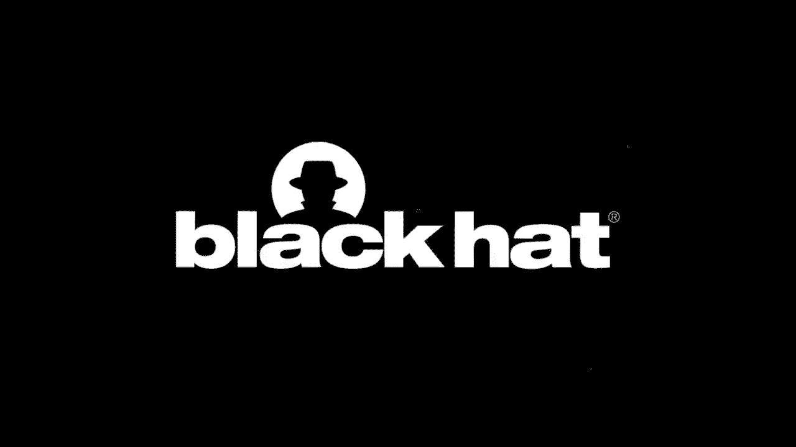

# 课程 P19：19 - 奇美拉行动 - 针对半导体供应商的APT行动 🎯

## 概述

在本节课中，我们将学习一个名为“奇美拉行动”的高级持续性威胁活动。该活动在2018年至2019年间被发现，主要针对全球，特别是台湾地区的半导体供应商。我们将从台湾半导体生态系统的背景介绍开始，逐步深入分析攻击者的战术、技术和过程，并通过三个具体的案例分析，揭示攻击活动的全貌。最后，我们将总结攻击者的动机、使用的技术工具，并探讨相关的防御启示。

---

## 台湾半导体生态系统与面临的威胁

台湾虽然地域不大，但在全球半导体产业中扮演着至关重要的角色。在政府的大力支持下，台湾已发展成为半导体行业的领导者，拥有台积电、联发科等知名企业。根据报告，台湾是快速增长的半导体设备制造商，年营收约120亿美元。

正因为其重要性，台湾的半导体产业也成为了网络攻击的重点目标。例如，2018年台积电遭遇勒索软件攻击，导致生产线停工两天，损失高达1.7亿美元。同年，卡巴斯基发现了针对华硕的供应链攻击“暗影锤”。今年五月，台湾中油公司也遭到了名为“Codelog”的勒索软件攻击。

这些攻击中，针对半导体产业的攻击尤其引人注目。对这类供应商的攻击不仅会严重影响台湾经济，还会波及全球供应链。本报告主要关注IT安全，与直接影响生产线的OT安全攻击不同，窃取知识产权等IT攻击虽然不会立即显现损害，但会对企业造成长期且严重的影响。

---

## 奇美拉行动概述

我们的公司“赛克 Craft”是一家台湾本土安全公司，对台湾半导体产业有很高的能见度。在2018年至2019年间，我们发现了多起针对该行业供应商的攻击，受害者大多位于新竹科学园区。

我们最初在今年四月发布了相关报告，随后收到了来自其他安全研究员、供应商和朋友的反馈，揭示出实际上在台湾和欧洲有超过七家供应商遭到了同一攻击者的侵害。这表明攻击者有能力同时发起大规模、精准的攻击。

攻击者不仅针对供应商本身，还攻击其子公司和竞争对手。攻击趋势已从早期的单点攻击，发展到供应链攻击，乃至如今我们看到针对整个行业生态系的攻击。

这些攻击所使用的战术技术非常相似，我们相信它们由同一个攻击组织发起。攻击者融合了不同的开源工具和商业工具，如Dumpert、Mimikatz和Cobalt Strike，就像神话中的奇美拉由不同动物融合而成一样。为了规避归因，他们使用谷歌云、Azure等公有云服务托管C2服务器。

攻击者的目标与其他窃取关键用户信息的团伙不同，他们专注于窃取与芯片项目相关的文档、源代码和SDK。这表明其动机是窃取知识产权。

---

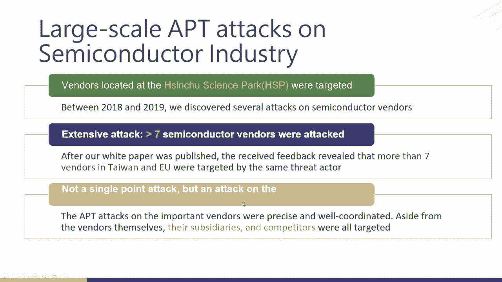

## 调查方法与案例选择

我们的调查始于2018年至2019年，覆盖了超过三家供应商，分析了超过30,000个数据点。今天，我们将展示来自三家供应商的案例研究。

我们选择这三家公司作为案例的原因如下：
*   **行业地位**：它们都在各自的细分市场占据全球领先地位。
*   **调查时间点不同**：这使我们能从不同角度分析攻击活动。
*   **合作关系深度**：与我们的长期合作程度不同，这影响了我们获取信息的深度和视角。

以下是每个案例的简要介绍：

*   **A公司案例**：我们的长期合作伙伴，使我们能够实时发现并建立攻击时间线，详细追踪攻击者活动并溯源。
*   **B公司案例**：一次性的应急响应服务。当我们介入时，攻击已持续很长时间，无法完全恢复，但可以揭示攻击者的长期活动和数据窃取情况，帮助我们理解其任务和动机。
*   **C公司案例**：同样是长期合作伙伴，且其安全团队技能高超。这帮助我们进行了更深入的调查，获得了更多反馈，从而能更全面地刻画攻击者画像。

接下来，我们将详细介绍A公司和B公司的案例，然后由同事CK介绍C公司案例。

---

## 案例研究 A：实时监测与追踪

在A公司的案例中，由于是长期合作伙伴，我们得以在攻击发生时实时建立数据时间线。我们发现共有50个终端和6个用户账户被入侵。

我们发现的第一个恶意软件是Cobalt Strike Beacon。有趣的是，攻击者为其使用了Google云平台进行C2通信。但在第二天攻击新终端时，他们更换了C2服务器，使用了另一项云服务。这表明攻击组织内部可能有多个攻击者，各自偏好不同的服务。

我们在环境中还发现了两种远程执行工具：计划任务和WMIC。
*   攻击者使用计划任务来复制文件和执行载荷。
*   他们使用WMIC来检查目标终端的网络连接状态、获取系统信息以及窃取凭据。

基于这些发现，我们可以绘制出简单的攻击链：一台名为“server_logon”的服务器，通过计划任务和WMIC，横向移动到三个终端，其中一个是域控制器。

攻击者从域控制器窃取了`registry`和`NTDS.dit`文件。前者包含Windows活动目录信息，后者存储了用户凭证。要解密`NTDS.dit`，还需要存储在Windows注册表中的启动密钥，因此需要收集这两个文件。

我们通过回溯发现，在计划任务执行的6分钟前，有一个来自IP1的成功RDP登录。我们认为这很可能是此次攻击的根源。攻击者使用该用户账户进行系统侦察，然后部署计划任务来远程安装恶意软件。

我们还注意到攻击者使用了一个字节修改的`.LNK`文件，并将其重命名为类似`recording.midi`的数据文件名。这个文件哈希在多个案例研究中都出现过，我们认为它是同一个攻击组织的标志性战术。

回溯RDP IP地址，我们发现了一个未扫描的主机，它是一台VPN服务器。这表明VPN服务器也可能被攻陷，VPN不能作为防御的最后一道防线。

---

## 案例研究 B：长期入侵与影响评估

B公司的案例是一次应急响应服务。当我们介入时，该公司已被入侵很长时间。由于B公司与C公司有业务往来，C公司从网络交互中发现了来自B公司的异常活动，从而引入了调查。

我们总结了攻击时间线，从2018年持续到2019年。我们发现攻击者使用了与A公司案例中类似的云服务进行C2通信。

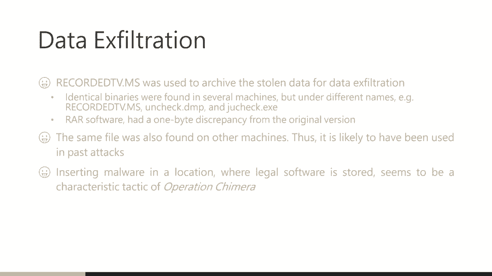

由于B公司被严重入侵，手动调查非常困难。下图是我们的AI生成的网络态势图，它显示了哪些终端被入侵，以及它们与未扫描管理器的连接，指导我们的IRT团队进行调查。

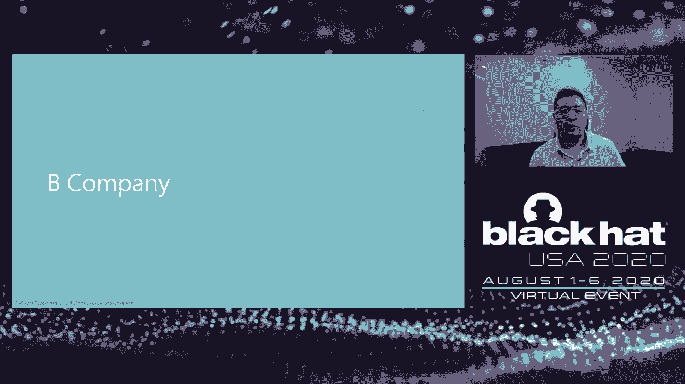

攻击者于2018年11月首次进入环境，之后每季度返回一次以收集新数据，可能是为了向其上級或买家汇报。直到2019年11月，他们部署了新的恶意软件，并在12月扩大了入侵范围。这表明之前的恶意软件一直有效工作。

基于调查，我们绘制了B公司数据窃取的概况图。攻击者的目标非常明确：核心门户、后端工作区以及芯片的详细设计信息。他们的目标始终是半导体知识产权。

我们推测这可能是商业竞争对手或国家资助的攻击，旨在使某个国家或地区的特定产业受益。虽然不确定具体是谁，但我们可以肯定攻击者的核心动机是窃取知识产权。

---

## 案例研究 C：高技能蓝队协作与攻击者画像

接下来由CK介绍C公司的案例。

C公司是我们的长期合作伙伴，拥有非常高的安全技能。我们公司有一个原则：进行调查时，会尽量减少从受害者环境所需的数据文件，以保护受害者的隐私和机密。因此，如果受害组织的蓝队技能高超，他们可以帮助我们进行更深入的调查。

在这个案例中，当我们完成初步调查并提交结果后，C公司的蓝队帮助我们发现了更多信息，从而更全面地刻画了攻击者。

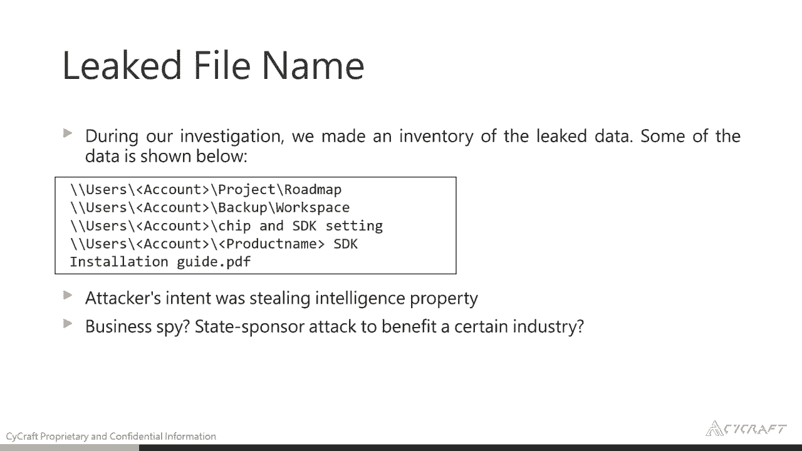

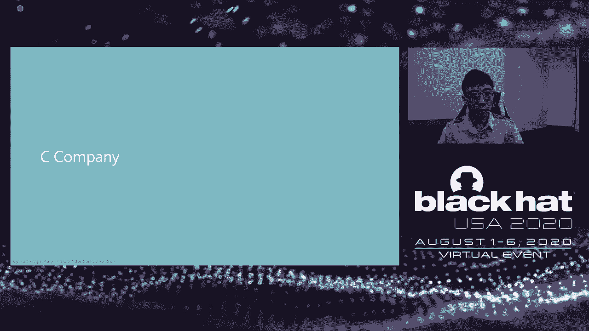

我们首先发现了一个“三合一”云存储工具，它使用Google Drive、Dropbox和OneDrive来上传窃取的文件。这个工具没有在VT上留下记录，并且它使用Web API传输文件，能够绕过第7层防火墙。

我们还发现了另一个使用Openload的云存储工具。通过监控攻击者使用的命令，我们找到了身份验证令牌和文件上传路径，从而发现了一些被攻击者上传的文件。

此外，我们在受害者环境中发现了一些可能被攻击者遗留的文件。其中一个文件像是攻击者的“备忘单”。我们按照其中的技巧尝试转储NTDS，结果发现了一个指向中国某著名安全论坛的链接。这暗示该攻击活动中至少有一名成员懂中文。

我们还分析了攻击者的活跃时间画像：
*   他们在2019年9月最为活跃。
*   工作时间是早上8:30到晚上8:30（UTC+8）。
*   工作日是周一到周五，周三最忙。
*   有时为了完成任务，周六也会工作。

这些信息表明，攻击者的时区与台湾相同（UTC+8）。

得益于合作伙伴蓝队的帮助，我们获得了更多关于此次攻击活动的信息和画像。

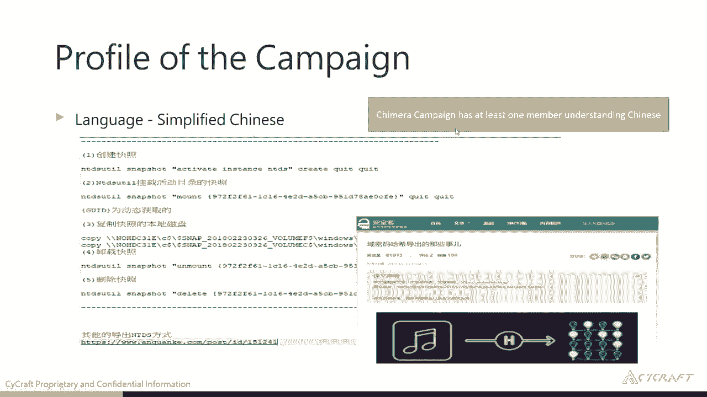

---

## 攻击者的数字武器库

接下来由Indie深入介绍攻击者使用的恶意软件和技术。

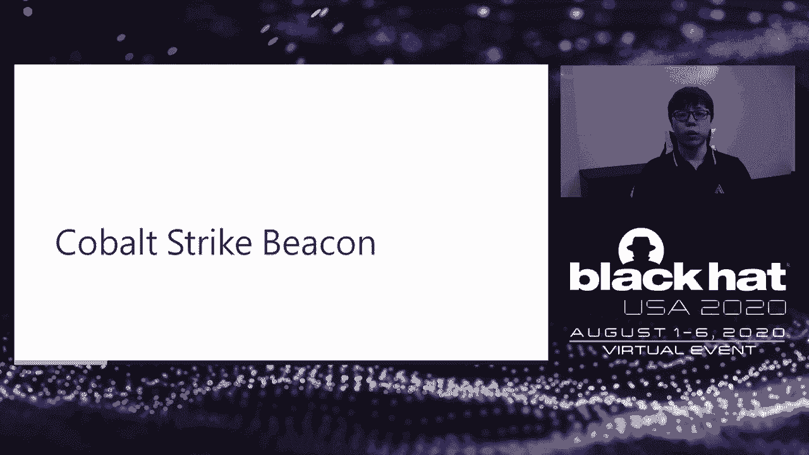

我们观察到攻击者主要使用了四类工具来实施攻击。

**1. Cobalt Strike Beacon**
Cobalt Strike是一个商业红队操作框架，攻击者将其作为主要的后门。为了实现持久化，他们用Cobalt Strike Beacon覆盖了Google Chrome的更新程序，这样就不会创建新的自启动项，降低了被发现的概率。

我们发现这个后门出现在多家公司，从而将这些入侵事件联系起来。我们的产品检测到了一些可疑的内存块，有趣的是，它既是PE文件，也包含Shellcode。Cobalt Strike Beacon和Metasploit的Meterpreter都使用了这种“混合载荷”技术，即将Shellcode嵌入PE文件头。PE魔数“MZ”可以被解码为有效的指令，后续的Shellcode会定位自身地址并调用反射式加载器来加载内存中的PE映像。

Cobalt Strike使用特殊策略将载荷注入其他进程：首先生成新进程或选择目标进程，然后将Shellcode（称为Stage）注入目标进程，真正的载荷通过命名管道传输并由Stage执行。这种策略可以绕过一些基于沙箱或仿真的扫描。

**2. WinRAR**
这是一个流行的文件压缩工具，在此次行动中被用来压缩和加密窃取的文件。攻击者尝试用一个16位的文件打包程序来混淆和伪装这个程序。我们抓取了旧版本的WinRAR与攻击者使用的版本进行比较，发现差异部分位于代码区段。这种补丁可能导致程序崩溃。我们有两种假设：一是攻击者故意修改字节以使文件哈希不同，从而规避基于哈希的检测；二是这可能只是文件复制过程中的比特翻转。考虑到文件年代，后者的可能性较高。

**3. 骨架密钥**
我们发现了本次行动中使用的一个独特恶意软件，它由两个开源黑客工具Dumpert和Mimikatz融合而成。
*   **Mimikatz**：广为人知的凭据转储工具。
*   **Dumpert**：由安全公司Outflank开发的概念验证程序，用于在Windows上直接调用系统调用。与Linux不同，Windows系统调用号随版本变化，唯一稳定的接口是共享库中的函数。因此，Windows Shellcode必须通过遍历PEB加载器数据和PE结构来定位内存中的函数。Dumpert首先使用`RtlGetVersion`确定Windows版本，然后根据版本选择不同的嵌入式系统调用函数，从而可以绕过任何用户态钩子，在不触发警报的情况下执行操作。

**骨架密钥**是戴尔Secureworks在2015年发现的一款APT恶意软件。它会在活动目录环境中的域控制器上植入一个后门密码。之后，攻击者可以使用此后门密码以任何有效用户的身份进行认证，而原始密码不受影响。其原理是通过钩住`lsass.exe`中的一些关键函数来改变身份验证流程。

虽然原始的骨架密钥恶意软件从未公开，但Mimikatz的作者实现了自己的版本。骨架密钥是针对活动目录的强大武器，因为攻击者无需转储哈希即可进行横向移动。使用管理员凭据可能会触发大量警报，而使用普通用户身份则几乎不留痕迹，只有大量的登录成功事件，很容易被管理员或调查员忽略。此外，骨架密钥无法通过重启移除，而重启域控制器可能会破坏组织的日常运营，因此非常棘手。

我们还观察到其他一些针对台湾政府机构的APT攻击使用了修改版的Mimikatz。

**4. 新发现：WinDeploy 后门**
在白皮书发布后，我们有了新发现：此次行动中使用了WinDeploy后门。最初，根据命令行事件日志和程序使用情况，我们以为这是一个网络探测工具。但经过详细分析，我们根据其协议使用的魔数，确认它实际上是一个WinDeploy后门。

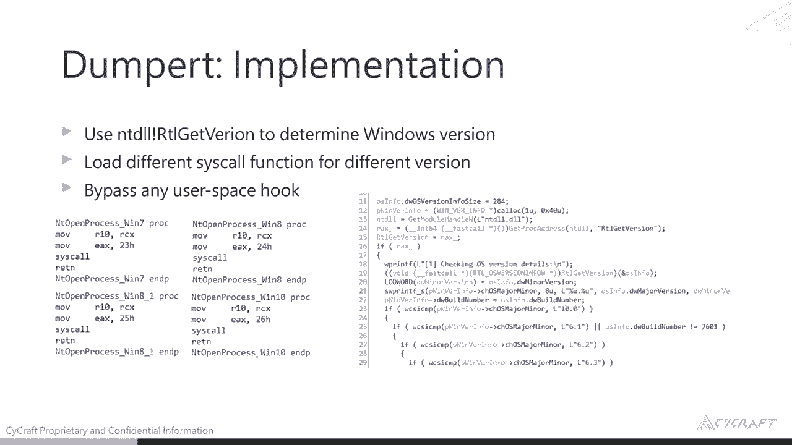

---

## 台湾近期其他APT事件

正如开头提到的，台湾中油公司遭受了基于开源勒索软件EDA2的新勒索软件“Codelog”攻击。调查局在其域控制器中发现了Cobalt Strike和一些可疑活动，他们认为此事件与WinDeploy组织有关。

此外，我们监控到多起针对台湾政府机构的攻击使用了骨架密钥，但后门密码不同。他们使用了仅在内存中执行的修改版Mimikatz。我们认为骨架密钥可能在不久的将来成为一种新趋势。

---

## 总结与启示

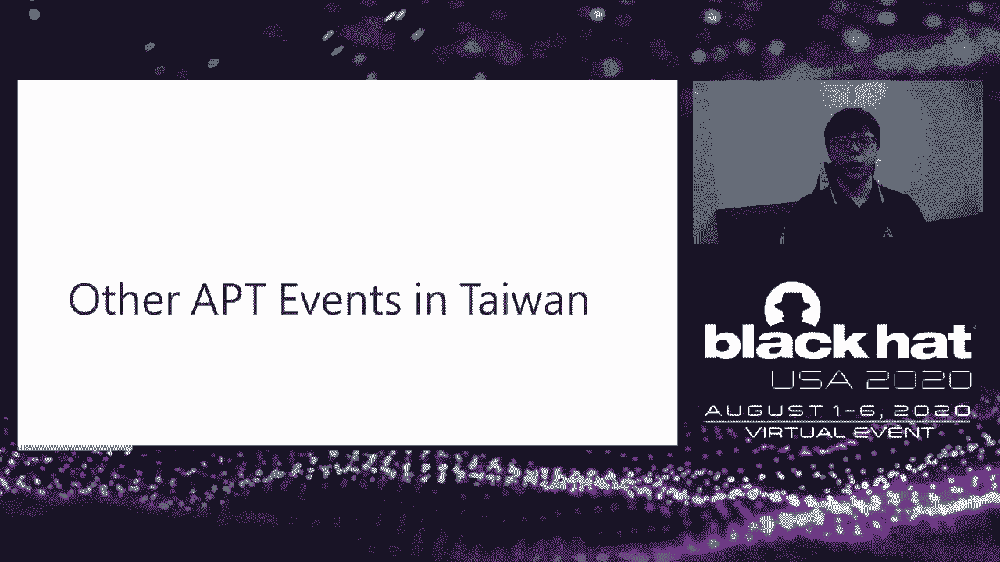

最后，让我们快速总结一些要点。

在本课程中，我们讨论了一场针对半导体供应商的大规模APT攻击，超过七家位于台湾和欧洲的供应商被入侵。攻击者目标精准，不仅针对领先的半导体供应商，还攻击其子公司、合作伙伴和竞争对手。

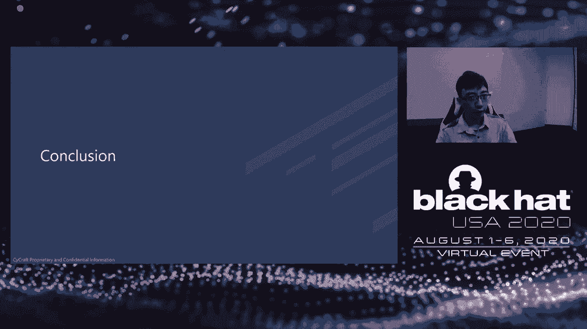

攻击者的目标是窃取文档、源代码和SDK等知识产权，这将对受害企业造成长期影响。基于此动机，我们猜测攻击者可能是商业竞争对手或国家资助方，旨在提升其半导体产业实力。

从技术层面看，攻击者广泛利用开源工具和通用工具，并喜欢融合不同类型的恶意软件来制造自己的工具，这使得归因变得困难。

在两个案例研究中，活动目录和VPN都被攻陷。因此，企业应考虑其IT系统的弹性，避免依赖单一的安全服务。

我们还发现攻击者使用了骨架密钥，这是一种虽不常用但非常强大的武器，能使攻击者像普通用户一样活动，实现持久化和防御规避。

最后，我想说没有系统是绝对安全的。我们需要定期进行威胁狩猎，并缩短平均检测时间和平均响应时间。

感谢大家的聆听。