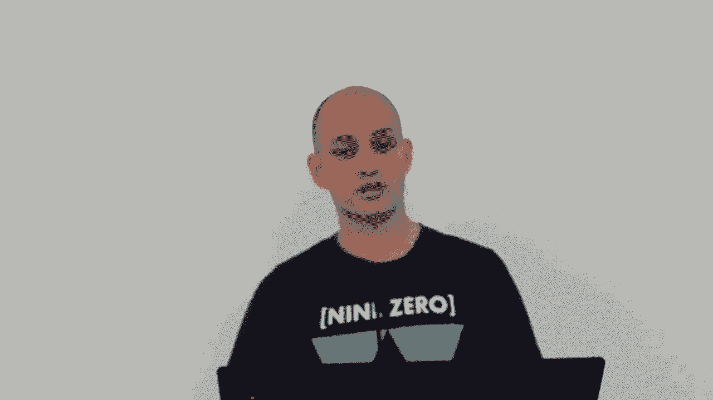
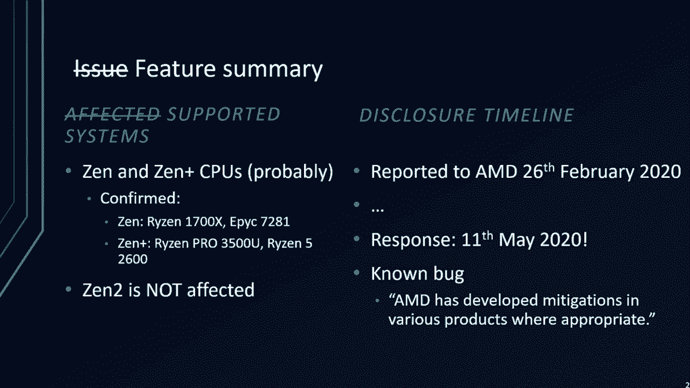
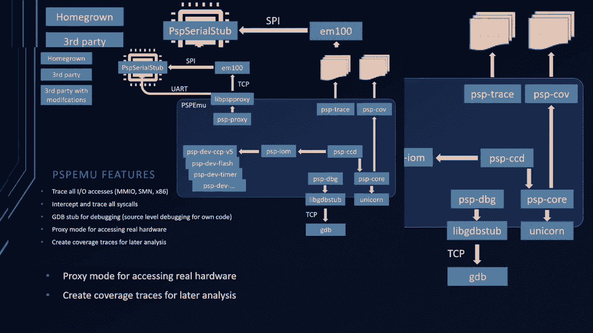

# P2：02 - All You Ever Wanted to Know about the AMD Platform Security Processor and w - 坤坤武特 - BV1g5411K7fe

## 概述

在本节课中，我们将学习AMD平台安全处理器（PSP）及其安全功能。我们将深入了解PSP的架构、启动过程、硬件组件以及如何使用模拟器进行分析。

## AMD平台安全处理器（PSP）

### 核心概念

**PSP** 是一个基于ARM Cortex-F5的安全处理器，集成在X86 SLC中。它负责保护整个X86 SLC，并运行特权软件。

### 启动过程

1. **PSP启动**：PSP在x86核心启动之前启动。
2. **片上引导加载程序**：片上引导加载程序是第一个启动的组件，它加载并验证片外引导加载程序。
3. **片外引导加载程序**：片外引导加载程序初始化系统，并加载各种应用程序。
4. **安全启动**：PSP将UFI镜像加载到DRIM，并释放x86核心。

### 硬件组件

1. **ARM Cortex-F5**：PSP的核心处理器。
2. **SRIM**：片上RAM，用于存储和执行代码。
3. **ROM引导加载程序**：固定内存位置的引导加载程序。
4. **MMIO区域**：包含各种设备，如iCRE控制器、Chimer加密加速器和x86和SMN槽控制器。
5. **系统管理网络（SMN）**：另一个32位地址空间，包含各种设备。
6. **加密加速器**：PSP的加密协处理器，支持各种算法。

## 模拟器

### 核心概念

**PCB MU** 是一个用于模拟AMD PSP的模拟器。

### 模拟过程

1. **获取固件**：从UEFI镜像中提取PSP固件。
2. **模拟启动过程**：模拟PSP的启动过程，包括加载和验证引导加载程序。
3. **模拟硬件组件**：模拟PSP的硬件组件，如MMIO区域和SMN。
4. **分析固件**：分析固件代码，查找安全漏洞。

## 总结

本节课中，我们学习了AMD平台安全处理器（PSP）及其安全功能。我们了解了PSP的架构、启动过程、硬件组件以及如何使用模拟器进行分析。希望这节课能帮助您更好地了解PSP及其在系统安全中的作用。