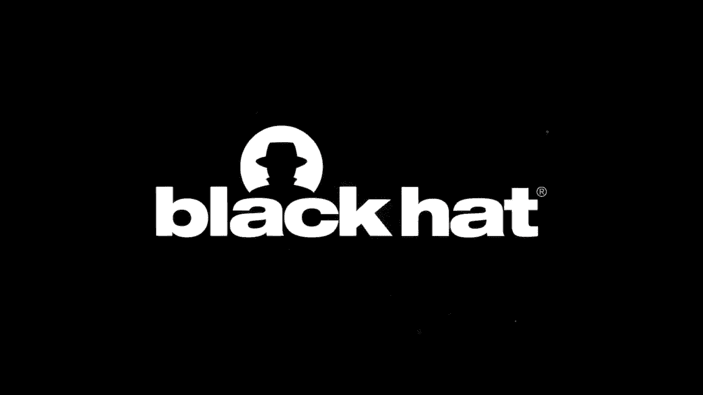
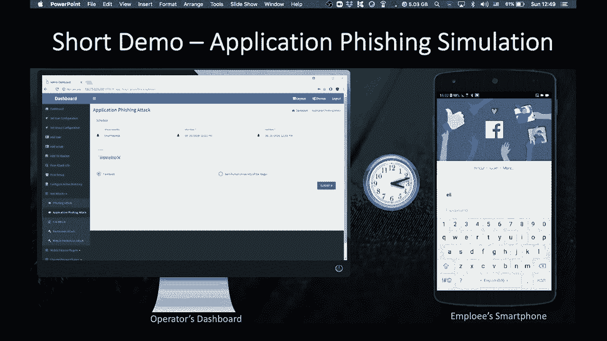

# P20：20 - 评估和修补网络安全中人为因素的框架 - 坤坤武特 - BV1g5411K7fe

[音乐]

> 嘿，大家好。我叫Ron，是内盖夫本古里安大学网络安全研究中心的首席研究经理。我的研究小组专注于利用AI进行网络安全。

我的今天演讲基于我们最近在网络安全中人为因素领域的活动。

近年来，社会工程攻击已经发生了变化。具体来说，社会工程攻击远远超出了钓鱼攻击。其他攻击向量，例如利用人为因素漏洞的密码破解、通过下载攻击的权限滥用和证书操纵。此外，社会工程攻击不再局限于某些部分。近年来，我们注意到常见的社交工程攻击向量在智能手机和社交媒体中都有变体。例如，通过利用权限机制来获取敏感权限，或者通过利用Facebook帖子和信息来发起钓鱼攻击。

在分析了多个社交工程攻击研究和它们在不同平台上的实施后，我们得出一个主要结论：用户减轻不同类型攻击所需的技能并不一定相同。换句话说，一个用户可能拥有减轻一种攻击所需的技能，同时却缺少减轻另一种攻击所需的技能。因此，我们认为，用户的网络安全意识不能通过一个统一的衡量标准来准确测量，这个标准不能区分不同的攻击向量。

尽管发生了这些变化，但大多数现有解决方案并没有区分不同类型的攻击和平台。现有解决方案可以分为两类——评估工具和缓解工具。

评估工具是用于识别易受攻击用户的方法。这些方法包括自我报告措施，如访谈、调查和问卷，以及攻击模拟。缓解工具是用于提高用户安全意识的方法，例如培训研讨会或可以用来通过防止利用人为因素漏洞来减少攻击面的方法，例如电子邮件保护工具或浏览器隔离。

然而，现有解决方案存在一些局限性。例如，问卷和调查基于用户的自我报告行为，需要主题的积极参与和协作。这些方法往往非常主观、有偏见，并且消耗大量人力资源。因此，它们的可扩展性较低，不能持续进行。攻击模拟测量特定事件期间主题的即时行为，并且大多局限于钓鱼。这些方法对环境和情境因素非常敏感，因此可能非常具有偏见。此外，它们不能用于连续评估用户的信息安全意识。

除此之外，由于大多数模拟都是基于钓鱼攻击，因此它们不能用于评估用户的攻击向量。

除了这些，安全意识培训研讨会通常使用视频、游戏和海报在受控的培训环境中进行。培训研讨会的问题在于，用户在研讨会中的行为并不一定反映用户在自然环境中的行为。此外，雇主强迫员工参加研讨会导致用户对培训过程的参与度较低。此外，雇主强迫员工参加研讨会导致用户对培训过程的参与度较低。

用于减少攻击面的方法，如人为保护和浏览器隔离，可以防止特定的利用技术。然而，它们没有修补漏洞。此外，这些方法大多局限于特定环境，例如用户的工作环境。当漏洞未修补时，攻击者可以使用其他未涵盖的利用技术来利用漏洞。此外，大多数对策不能用于在其他环境中保护用户，例如在家工作时。

为了解决这些局限性，我们开发了Safemind。

Safemind是一个用于持续和客观评估用户对特定类型社交工程攻击的弹性的自动化框架。

在研究的早期阶段，我们定义了三个关键成功因素。

第一个是了解要测量什么。具体来说，安全意识用户的准则是什么？以及不同准则在减轻不同类型攻击中的重要性如何？

第二个关键成功因素是了解如何评估这些准则。最后一个成功因素是了解如何进行持久的行为改变。

在本演讲中，我将重点介绍前两个关键成功因素。

为了定义安全意识用户的准则，我们系统地探索了社交工程攻击案例研究，并确定了被攻击者破坏的技术。接下来，我们列举了可以用来保护这些技术的安全对策，并确定了被攻击者利用的人为因素漏洞。

基于这些漏洞，我们制定了用户减轻攻击所需的准则。这一程序的结果是超过30个安全意识用户的准则。

在制定准则之后，需要估计不同准则在减轻不同类型社交工程攻击中的重要性。为了解决这个问题，我们开发了一个基于专家的准则排名程序，该程序根据不同的攻击对准则进行排名。

该程序基于一种称为层次分析法（AHP）的知名技术，它使我们能够将排名时间缩短到几分钟而不是几小时。

我们让17位安全专家使用我们的方法对准则进行排名。在这里，您可以看到为四种不同的攻击创建的有限模型——基于密码的攻击、基于应用的攻击、钓鱼攻击和中间攻击。

如您所见，这些模型相当不同，准则的重要性在不同模型中的分布也不同。

在这里，您可以看到为中间攻击和钓鱼攻击创建的不同模型，与浏览器技术相关。

如您所见，对于钓鱼攻击，主导准则是不通过HTTP发送敏感信息，也不在未经验证的网站上插入私人信息。相比之下，对于中间攻击，主导准则不同。例如，从设备中删除未知证书，不批准未知证书。

在了解要测量什么之后，我们现在可以专注于第二个关键成功因素。

了解如何持续和客观地测量这些准则。

我们开发了三种互补的解决方案——端点解决方案、基于网络的解决方案和攻击模拟框架。

端点解决方案包括智能手机和PC的代理。它们从设备收集多个传感器数据，包括安装的应用程序、它们的权限、来源和评分、邮件活动、安全设置、密码管理、社交网络活动等等。

使用这些传感器，我们创建了一个与不同准则相关的用户配置文件。端点解决方案可以推导出非常准确的用户配置文件。然而，它们稍微有些侵入性，需要预先安装。

我们希望将评估推进一步，并通过被动地推导出用户的配置文件。为此，我们开发了基于网络的解决方案，该解决方案仅通过分析其网络流量来推导用户的配置文件。

为了评估准则，我们利用了常见的技术，例如域分类、数据包检查和应用层协议的评估。此外，我们还开发了一个攻击模拟框架。

在这个框架中，我们实现了20种攻击变体，包括移动和PC的权限滥用、证书警报、宏病毒和恶意PDF文档，以及通过电子邮件、短信甚至Facebook帖子进行的钓鱼攻击。

以下是攻击模拟框架的简短演示。在左侧，我们可以看到操作员仪表板，可以用来配置攻击。在右侧，我们可以看到接收通知的员工智能手机，通知称您的Facebook会话已过期。当用户点击通知时，会显示钓鱼网页。

为了评估，我们进行了一项实验，涉及160名参与者，他们安装了该框架，持续了七周。我们对用户进行了四种不同的攻击模拟——钓鱼、垃圾邮件、权限滥用和证书操纵。除了端点和网络解决方案之外，我们还使用了传统的安全问卷作为基线。

在图一的上图中，我们将主题分为三个安全意识水平——低、中、高。这种分类是基于框架得出的分数。

然后我们计算了每个安全意识水平减轻攻击模拟的成功率。结果表明，被归类为高意识且使用端点和基于网络的解决方案（由紫色和蓝色条表示）的用户更有可能减轻攻击，与被归类为低意识的用户相比。

在下面的图二中，我们分析了高分辨率的分数。使用移动平均。如您所见，用户减轻攻击的成功率与使用端点和基于网络的解决方案得出的分数非常相关。换句话说，得分较高的用户更有可能减轻攻击，而得分较低的用户更有可能失败。

评估的主要结论是，主题的自我报告行为与他们的实际行为存在显著差异。相比之下，从端点和基于网络的解决方案收集的数据得出的安全意识分数与减轻社交工程攻击的通常成功率高度相关。

非常感谢。感谢大家今天以虚拟方式参加我的演讲。我想提到一些由与会者提出的问题。

所以，Fernando提出的第一问题是，如何平衡攻击的现实方面与个人在员工角色之外的隐私需求？

所以我会区分研究中的两种不同情况或两种不同的场景。

在第一种场景中，我们收集所有原始数据，以便进行研究，以便了解我们需要分析哪些准则，并将其包含在后来反映安全意识和减轻不同类型攻击能力的分数中。

收集所有原始数据的原因是我们无法事先知道确切的措施以及如何分析所有数据，以及如何创建可以后来用于计算分数的特征。

然而，在最终将在员工手机或PC上运行的系统中，我们只能使用汇总数据或提取设备上的特征，并将汇总数据发送到雇主系统以创建评估。这样，我们可以创建一个不透露用户私人属性的配置文件。

Fernando提出的第二个问题是关于研究中参与者的人口统计信息。

在本研究中，我们使用了以色列两所大学的未毕业和毕业学生。他们的年龄在20到35岁之间。他们来自不同的系。因此，他们对安全的知识不同。

如果您想了解关于研究中参与者的所有人口统计属性，请参阅我们发表的论文，您将获得所有信息。

我们还分析了不同人口统计属性对用户安全意识的影响。

这是在会议期间提出的两个问题。让我看看我是否错过了演讲开始时的任何内容。

所以，我们将非常感谢任何同行评审论文。如我之前所说，我们发表了两个学术论文。

一个论文介绍了计算分数的理论背景和理论方面，特别是如何计算不同类型攻击的分数，以及如何列举安全意识用户的所有准则。

最近在CHI上发表的第二篇论文讨论了测量和实验。

所以，我将在聊天中放入这两篇论文的链接，以便我们可以深入了解这项研究。

我们还获得了一项专利批准，该专利描述了整个框架和持续分析用户行为以衡量其对社交工程攻击的鲁棒性的想法。

让我们看看是否有其他问题。感谢所有参与会议的人。真的很高兴听到这一点。所以我看到没有其他问题被观众提出。所以我想我们现在可以结束了。非常感谢你们所有人参加这次会议。