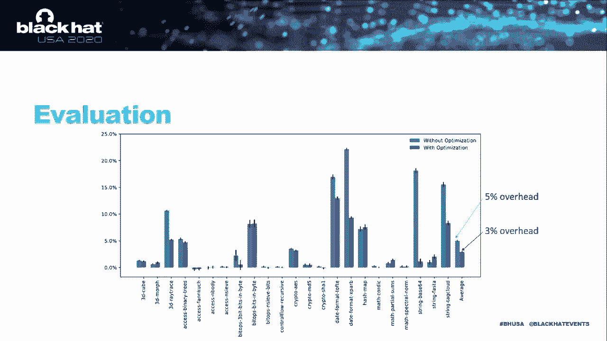

# P21：21 - NoJITsu - Locking Down JavaScript Engines - 坤坤武特 - BV1g5411K7fe

## 概述

在本节课中，我们将学习如何锁定JavaScript引擎，以防止潜在的攻击。我们将探讨JavaScript引擎的安全性问题和攻击方法，并介绍一种名为NoJITsu的防御机制。

## JavaScript引擎的安全性

JavaScript引擎通常使用C或C++等不安全的语言编写，因此可能存在漏洞。JavaScript引擎自动运行嵌入网页中的脚本，这使得攻击者可以注入恶意代码并触发漏洞来利用受害者的机器。

## 攻击方法

### G-spraying攻击

G-spraying攻击是一种著名的JavaScript引擎攻击，攻击者将恶意代码编码在脚本中的大量常量中。攻击者可以触发漏洞并改变程序计数器，从而在沙盒中注入任意恶意代码。

### G-code注入和代码重用攻击

攻击者可以利用JavaScript引擎的线程能力进行更高级的攻击，例如G-code注入和代码重用攻击。

## NoJITsu防御机制

NoJITsu是一种防御机制，旨在保护JavaScript引擎免受攻击。它通过以下方式实现：

### 发现新的攻击因素

NoJITsu发现了一种新的攻击因素，即字节码到预攻击。

### 提出防御机制

NoJITsu提出了新的防御机制来保护JavaScript引擎。这些防御技术追求全面防御，以击败字节码到预攻击、G-code注入和代码重用攻击。

### 解释器执行

NoJITsu解释器执行时，脚本首先由字节码编译器编译，生成字节码对象表和JavaScript对象。字节码是一系列字节码指令，由解释器逐个执行。

### 攻击策略

NoJITsu使用多种攻击策略，其中一种策略是利用函数代码例程运行任意系统代码。

### 防御策略

NoJITsu使用新的_dju防御机制来保护JavaScript引擎。该机制通过细粒度内存访问控制来保护所有目标数据，包括字节码对象表、JavaScript对象、jdior和jdcode。

### 内存保护键

NoJITsu使用内存保护键来控制内存块的保护。每个内存块都分配了多达15种特定的NPK键，与关联的权限相关。

### 动态分析

NoJITsu使用动态分析来自动查找所有涉及JavaScript对象的写指令位置。它使用app VM对每个写指令进行代码注入，并检查是否违反了权限。

### 覆盖分析

NoJITsu使用JavaScript测试开关来评估其防御机制是否有效。它发现即使使用少量测试开关，也可以找到所有访问器函数。

## 总结

本节课中，我们一起学习了如何锁定JavaScript引擎以防止潜在的攻击。我们探讨了JavaScript引擎的安全性问题和攻击方法，并介绍了NoJITsu防御机制。