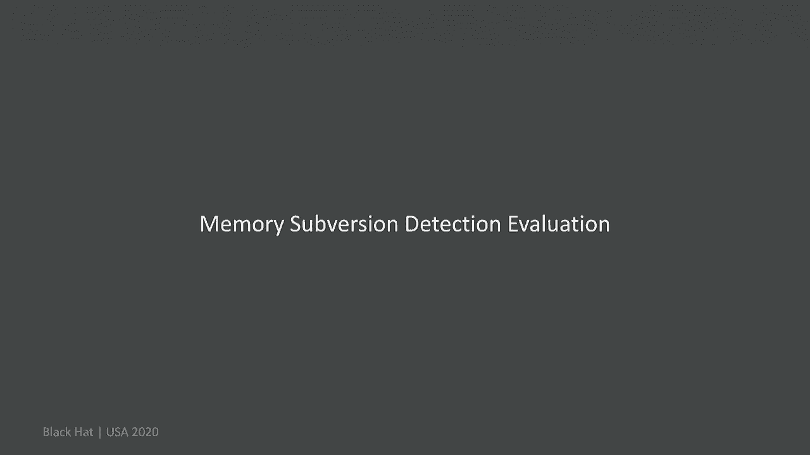
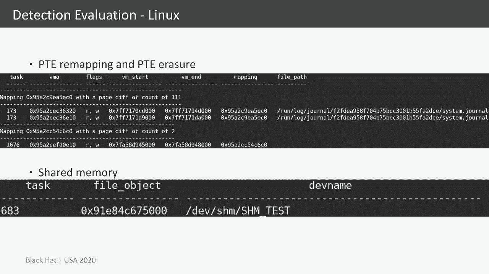
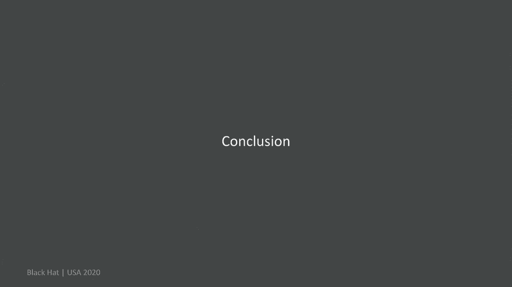

# P22：22 - Hiding Process Memory via Anti-Forensic Techniques - 坤坤武特 - BV1g5411K7fe

 Hello everybody， this is Frank Bloch and you are watching Hiding Process Memory via。

 anti-forensics techniques。 This talk is based on the research that I've done together with Ralph Poloutka。

 Patrick， Reichtenberg， our dominant sleep hiker from the University of Erlang-Nunberg。

 So this was a cooperation between the ENW research and the University of Erlang-Nunberg。

 To the agenda， we will start with a short introduction， some technical background。

 Then dive into the subversion techniques。 They are three of them。

 Then we talk a little bit about challenges and some considerations。 After that。

 we will have a look at the evaluation， so we have evaluated our techniques with member。

 forensics and life forensics techniques。 After that。

 we will talk about and have a look at detection approaches， evaluate those two。

 and at the end some conclusion。 There are some related work that I wanted to mention also to give you an idea of what。

 this is about and what is different from them。 The first great research that I want to mention is Shadowwalker by Sherry Sparks and Jamie。

 Butler。 What they basically did was changing the mapping between virtual and physical memory。

 By that， any subsequent access to a virtual address would not end up anymore at the actual。

 physical content for that virtual address。 We are doing something similar。

 but there are three major differences between those two， approaches。 On the one hand。

 Shadowwalker only focused on the current space。 It required a hook in the page forehand line in order to work and the third difference is。

 that it does not work anymore on current CPUs， so sadly or luckily。

 The second related work that I wanted to mention is Gargoyle by Josh Lospinoso。

 He concentrated on the process address space， similar to our approaches。

 His approach does not hide the actual memory content， but he changed the characteristics。

 of the injected code， in this case the executable state。 By that。

 tries to hide from the detection tools。 Our approach is here in this case different。

 We are solely interested in hiding the actual memory content， so we do not change characteristics。

 The memory is still executable， for example， in some cases， but the actual memory content。

 behind it is hidden。 Let's talk a little bit about some technical backgrounds。

 The process address space contains different data， executables， dlls， shadelibraries or。

 heap stack data whatsoever。 On all those memory areas are described by what we will call in this context memory error。

 structures。 So， MES structures。 On Windows those are which addresses cryptos。

 on Linux those are which are memory areas。 And as you can see。

 one thing that both those types have in common， both those structures。

 have in common is a start and an end pointer。 So， you can see here that the start address points to the beginning of the memory area。

 and the end pointer to the end。 And normally every memory in the which address space of a process is described by at least。

 one or ideally by one memory error structure。 So， the second part that we are going to talk a little bit about is the path of the。

 paging structures。 So， the process of translating a virtual address to a physical page frame。

 The relevant part for us here in this case is just a page table。 So。

 at the end of the translation process， we will end up for a virtual address on a specific， PTE。

 a page table entry。 This one contains a pointer to the actual page frame that contains the memory for this。

 virtual address。 And the virtual address also has a page offset into this page frame where the actual byte。

 is that byte is located where this address points to。 And yeah， exactly。

 This is something that we are going to tamper with。

 Also to mention right here now is that on both operating systems， on Windows and Linux。

 there are some reverse mappings。 So on Windows there's the page frame number database and on the Linux the page structures。

 And those are more or less the physical point of view on the memory but we will dig a little。

 deeper into those two types a little later。 And the third part is shared memory。

 So the idea of shared memory is to just share data between different processes。

 And the relevant part for us here to mention is that shared memory as this by in contrast。

 to private memory is still accessible if the shared memory has been unmapped。

 So if it's not part of any process for example anymore， not mapped in any virtual address， space。

 it can still be resident in the physical memory and can still be remapped as long as。

 at least one process has a handle to the shared memory。 So that's something to keep in mind。

 And there are different ways to create shared memory on Windows there's especially this。

 API sequence。 On Linux there are at least three different ways to create shared memory that we had to。

 look at and we will see later。 Okay， let's start with our subversion techniques。

 In general we are trying to hide process memory with those。

 Those techniques can be used independently or can also be combined。

 In our scenarios for example an attacker that injected code into another process and now。

 wants to hide this memory or he wants to hide memory that is in his own process space。

 So the first technique is what we will call MAS remapping。

 So the idea was to do this technique is because that many tools detection tools depend on。

 the information provided by those structures。 So you rely on those and this is why we wanted to remap some of the information so to change。

 the information in order to hide our malicious memory。

 One thing to note here is that this technique will require kernel level privileges so this。

 is something to keep in mind。 So we are here right now at the beginning with our malicious memory and we are now trying。

 to hide it by just simply changing those pointers here。

 So we can now see here the effect so what we did is we placed some benign data in the beginning。

 which is not malicious in any way and we are changing the pointers in that way that the。

 malicious memory which is placed right after is not described or not contained in this area。

 So they are not described by the VM and VM start。 They are not in this range。

 So there is no MAS structure anymore at this point of time that is including this memory。

 area right here but still it can still be accessed especially by the CPU executed because。

 the CPU doesn't care about the MAS structures。 It only is interested or uses the PTEs in order to do the translation and to access the memory。

 and those are still related and are still there。 So this works after this modification fine。

 One advantage of this technique in regards to the other tools that we will see right。

 now is that it is not necessary to revert this modification in order for the malicious。

 code to execute。 So the second technique also requires kernel privileges in order to work and it also requires。

 restoration so it is necessary to all the time unhide and re-hide the memory in order for。

 it to work。 And we will talk about two different flavors of the technique so we are calling them PT。

 sub-wersions and we have the PTE ring me a ping and the PTE erasure and the beginning。

 in both cases the same so we have here our malicious page and we have a benign page with。

 data that is not malicious at all。 And our goal now is to remap in the first technique to remap this virtual address to。

 this benign data by simply changing the P of N。 So there is a field and this PTE that points。

 to the physical page and we are just changing this value so that this virtual address does。

 it from this point on point to the benign data down here。

 This page here has no PTE that points to it is not mapped in any virtual address and hence。

 can't be accessed simply by enumerating or accessing virtual addresses anymore。

 The second technique is what we call PTE erasure so in this case we are nullifying so we are。

 erasing the PTE just putting zeros in there so there is also in this case no more reference。

 to this malicious page it is not mapped in any virtual address space anymore and any。

 access to this which address will end up in no memory which is not a problem per se because。

 this can be for valid reasons the case for example if the page has not yet been accessed。

 then this would be look the same so it's not suspicious by itself if there is a which。

 address that points to a PTE that is zero。 And the third technique that we want to talk about is shared memory separation so the idea。

 here is now to use shared memory in order to hide our malicious content and it is not。

 so not to mention I want to mention that it is not necessary to share memory between。

 poses shared memory can also use solely by one process and this is also the way we are。

 using it our even process does use this memory more or less like private memory but with the。

 advantages that come with shared memory from the takers point of view so what the attacker。

 does is he creates a shared memory segment puts his malicious code in there and then in。

 the first step unmaps it so it is not visible anymore and then after that any time he wants。

 to use it he will remap it and again and again one major advantage of this technique。

 is that it doesn't require any current privileges so it can be used with solely user with solely。

 standard user privileges。 So the attack process after we have set it up is more or less like this as soon as the。

 evil process wants to execute or access the malicious data it shortly unmaps it into its。

 memory space executed or reads data from it and then unmaps it again and by that we successfully。

 hide from most of the tools or from nearly every detection tool that we evaluated by simply。

 with this simply trick。 So why is that this memory can't be detected by any of the tools。

 that we will see later。 Let's dig a little bit into the details so with the un-mapping what happens in the background。

 is that the page type entries for this shared memory are zeroed so they are not pointing。

 anymore to the malicious pages but there must be still some reference to it because it is。

 possible to remit those pages so there must be some kind of reference to them。 This reference。

 is more or less hidden behind this memory handle that's the process keeps in order for。

 the pages not to be erased。 In the case of Windows this memory handle is a section object。

 so a pointer to a section object and this section object this section structure is located。

 in the kernel address space。 So if you are following the section structure we are getting。

 to a control area field this one points to the control area structure which is more or。

 less pointing to the file if there is a file related to this memory area and right after。

 that more interestingly for us is a sub section structure or there can be multiple ones and。

 those are pointing to the so called prototype PTs and this is the interesting part for us。

 because those prototype PTs contain the actual pointer to the malicious pages。 So the reason。

 why we don't find this malicious memory also if we scan the kernel address space is that。

 the pages are not mapped into the kernel address space so those prototype PTs are not part of。

 the page tables for the kernel address for the kernel so they are not mapped into the。

 kernel address space but only those prototype PTs itself are part of the virtual address。

 space of the kernel so it's just data lying in there those PTs they are not part of the。

 page tables itself from for the kernel and that means that those pages are not mapped。

 into the address space and hence the memory content can't be found when searching the。

 virtual address space。 Okay so we look at the evaluation we implemented our techniques for。

 windows and Linux and tested those in multiple VMs for windows and Linux in both cases on。

 x64 architectures and this is the those are the results for the memory for a point of view。

 we used multiple plugins we used Yara scan plugins we used recall and volatility for all。

 those plugins and what you can see for Yara scan for example is that volatility Yara scan。

 was not able to detect any of our hidden malicious content but recall did the reason is that recall。

 does a raw search so it doesn't rely on any virtual address structures which address translation。

 structures and only searches a raw memory and by that he finds our hidden code but obviously。

 this only works if we know upfront what we are searching for so it doesn't work as a generic。

 method。 We also had a look at some dumping plugins so we dumped the memory content of。

 the processes and only in the case of the MAS remapping and only with volatility we were。

 able to find our malicious code in there with the other tools and other plugins it was not。

 the case and also we did find our malicious code by if we have accessed it directly so。

 if we used to recall our volatility the interactive shell and did the reach for the visual address。

 in this case also it was possible to detect the malicious memory but only in the case again。

 for MAS remapping and a third time again with PTE NAM we were also able to find our injector。

 code for MAS remapping but besides that in all other cases our malicious code was not found。

 by any of those plugins。 In some cases there were some indicators that could maybe give。

 you a hint about something fishy going on but the actual memory content was only detected。

 in those cases that I mentioned earlier。 So from a life forensics point of view it gets。

 a little bit worse。 On the one hand we also used the tools Yara and scanned all the processes。

 None of our hidden memory has been detected by Yara。 We were able to detect our malicious。

 content in the case of MAS remapping again with the debugger but only on Windows so with。

 the wind debug tool we were able to find our malicious content by searching and also by。

 directly accessing the widget addresses but besides that none of those approaches were。

 able to find our hidden malicious code。 We tried dumping the process address space with。

 debug with GDB within debug also used process explorer on G core but our malicious content。

 wasn't in those dumps but at least in some cases there were errors pointing out that some。

 of the addresses seem to be something wrong with them so there were some indicators but。

 the actual memory content was only detected in those two cases for MAS remapping and not。

 in the other cases。 And also to mention the shared memory scenario with sham get on Linux。

 was not at all in any case in any way detected by any of those plugins or tools。

 Okay let's talk about some challenges and considerations some things that you have to。

 consider when you're implementing and using those techniques。 On the one hand as mentioned。

 earlier for PTE subversions and shared memory we need still some control code that has to。

 be somewhere so this could be detected in order to unhide and re-hide the memory。 We。

 did also lock our memory in order to prevent any interferences from page swapping and also。

 to prevent any side effects we are doing we are undoing all our modifications right before。

 the process exits。 Also especially on Linux there are some fields that you want to have。

 a look at and might in some cases have to that you might have to adjust in order to prevent。

 side effects especially if you're not undoing your modifications then there are some counters。

 that you might have a look at and might have to adjust in order to prevent any problems。

 Okay let's talk a little bit about a problem on Windows with the standard PFE memory mapping。

 so if we are doing the PFE memory mapping as explained earlier this will lead to crashes。

 especially if we for example scan the process of Yara then a pretty reliable crashes after。

 the PFE memory mapping so we came up with a little workaround in this case。 This is an。

 initial situation so the PTE points to a malicious memory and what we now do in order to prevent。

 the detection is to in the first step to erase it to erase it similar to the PTE erasure but。

 we added some additional steps so what we then do after that we are doing a read access。

 to this virtual address which will lead to the creation of a new page because the operating。

 system will think there has not yet been created any page for this virtual address so。

 we are creating it。 That means that after that we have two pages which relate correspond。

 to this PTE and after that we are simply switching between those two pages in order to hide and。

 unhide our malicious memory and by that we are preventing the process from crashing if。

 Yara scans it。 There is still some issue left with this approach。 At blue screens as soon。

 as the process exits we have not yet identified what exactly is the problem with that so this。

 is something to be done and will be hopefully fixed in the next few weeks or months。 So let's。

 talk about memory subversion detection。 First MAS remapping detection what we are using。

 here are the paging structures we are enumerating all the page tables and x and mining the page。

 table entries。 Each page table entry corresponds to a virtual address and by x and mining the。

 page table entry we know which virtual addresses are currently valid so they are referencing。

 page frames that are currently mapped and we can use this information to check whether。

 or not they are virtual addresses which are not described by a VM area structure but are， valid。

 So in this case we have those two virtual addresses which seem to reference valid page。

 frames so there is actual memory content behind them but they are not part of any MAS structure。

 so that is something suspicious which we allowed them。 Now the PTE subversion detection on windows。

 it is on Linux different story so we are splitting this detection in two parts。 On windows we。

 now have here the initial situation so the MAS PTE points currently still to the MAS page。

 and in this case here now we have also the physical point of view on the memory the PIF。

 and database which we mentioned earlier briefly。 This is just an array of MMPF instructs which。

 are indexed by the PIFN number。 So the PIFN here points at the one hand to the page to。

 the page frame and to a MMPF instruct over here。 Each MMPF instructs for valid page also。

 points back to the PTE that belongs to it so we have here a kind of loop that points back。

 and forth。 So we are now doing the PTE remapping so we are changing the PIFN value the pointers。

 get modified so we are now pointing at the B9 page down here and we are also referencing。

 another MMPF instruct。 So that means we have a broken loop we have a valid loop down here。

 because this MMPF instructs belongs to a valid page the B9 page has already there and we。

 have a valid loop here but we have also the pointer from over here which does not point。

 back over here so this is something that we can detect on。 Also by enumerating all the。

 MMPF instructs we will encounter this one here which points to this PTE but the PTE does。

 not point back so this is also something that we can detect。

 The third part here is the PIFN number so by enumerating all the PTEs and collecting all。

 the page frame numbers we can detect duplicates and by that the PTE remapping。 This only works。

 for shared memory for private memory。 With shared memory this does not work because with。

 shared memory it is quite common that multiple PTEs point to the same page frame to the same。

 page frame。 Also this detection here does not work with shared memory because for shared。

 memory those MMPF ends don't point to this PTE but to the prototype PTE so we don't have。

 this loop that we can detect on。 So this detection here only works with private memory， on windows。

 The detection we will now see for a few seconds on Linux does work also with， shared memory。

 Okay now the last slide for windows in this case we see now modified PTE。

 remapping because the original one as I said crashes when Yara is for example scanning， the process。

 So this is the situation the detection is more or less the same the only。

 the situation is a bit different。 So we can see now here we have our PIFN value which points。

 at the second page which has been created for this PTE so they also created MMPF ends。

 to point back to this PTE so this loop here is fine it points back and forth well at least。

 so there's nothing suspicious here but there are two things to mention over here。 At one。

 hand we have again an MMPF end struct which points to this PTE but this PTE doesn't point。

 back and also we have two MMPF end structs which point to the same PTE。 So those are two。

 characteristics that we can detect on。 Okay let's now look at Linux。 The physical at the。

 point of view on the physical memory on Linux is other page structures so there are several。

 page structures which are more or less also indexed by the page frame number and by enumerating。

 those we can collect pages which belong page structures which belong together and also。

 physical pages by that。 This is done by looking at the mapping object that is referenced by。

 those page structures。 This mapping object is also referenced by the VM error structures。

 so by this mapping we can correlate pages with their corresponding VM error structures。

 The thing to mention over here there can be multiple MMPs per VM error structure。 At。

 one hand a mapping can be referenced by the F MMPs so this is the case for files that are。

 mapped and also in this case there can additionally be the end on VMA chain pointing to MMPs there。

 can be multiple ones。 This is especially the case when forking and when using copy and。

 write protections and then getting private copies being created those are then referenced。

 by those MMPs so there can be multiple ones。 Just something that we have to keep in mind。

 when investigating this issue that we have to collect all of them。 Behind those MMPs is。

 in this case for the N and VMA chain are N on VMA structs and for the F MMPs it's an address。

 based struct but this detail doesn't really matter for us。 The only thing that we are。

 interested in is the object itself which we can use to correlate the page structures。

 with the VM error structures so the fields of those MMPs are not really interesting to。

 us just the object itself。 Okay now let's have a look at the other side so when we are。

 now enumerating the which addresses for VM error struct we can resolve them to the page。

 frame number and by that gets the corresponding page structure and again we can correct them。

 based on the mapping and in this case we have three which addresses with the three page structures。

 which belong to this mapping which also corresponds to the mapping for this VM error structure。

 If we are now looking at our attacks in this case the PT erasure the initial situation is。

 that we have the analysis page over here which is still referenced。 Now we are erasing the。

 PTE the pointer goes away and when we are enumerating the which addresses we now only。

 get two pages because this one doesn't belong to any page structure anymore because it doesn't。

 have a corresponding P of N。 So when we are collecting those for this VM area for the。

 which addresses we only get two pages for this mapping or with this mapping。 If we on the other。

 hand enumerating all the PTE structures collecting them based on their mapping and then looking。

 for each VM error struct for their corresponding mapping and the pages we will see that we will。

 end up with three pages page structures。 So we can clearly see a diff two on the left。

 side three on the right side and then something suspicious which we alert them。 So in the。

 last step is our shared memory subversion detection it's more or less the same on Linux。

 and Windows and we are basically just enumerating all the shared memory handles and looking for。

 those which are currently not mapped into the richer address base and alert on them。

 On Windows we are additionally checking for the executable permission so we are only。

 alerting on executable memory because there would otherwise be a lot of false positives。

 On Linux we are not checking for the executable state because it's not a reliable way to detect。

 this kind of memory and hence we also have some false positives on Linux which we will。

 see later。 Okay， let's now talk about the evaluation of our detection approaches。 We use。

 the same environment as for the memory subversion evaluation。 Additionally for the false positive。

 evaluation we started several browsers office applications and also PDF documents and this。

 will the results of that we will see a little bit later。 Okay， here are some examples for。

 detection on Windows。 In the first case we have an output of our recall plugin for the。

 standard PfN remapping so not our modified version so what would look like in the output。

 if we would use the standard version and also for the PTE erasure。 So the first two entries。

 here are an output for the PfN remapping so we can see here in the 。PfN column that we。

 have a true for the first two entries so there we can see also here in the PfN column that。

 there's in fact the same PfN value for those two entries and what we also can see is a true。

 value for the PTE pointer div which means that the PTE with its PfN points to a certain。

 MMPF instruct but MMPF instruct does some point back。 So we have a div over here and this also。

 means that the second entry is the malicious one or most probably the malicious one because。

 it has the value true in this case and the third entry is an example for the PTE erasure。

 we have in the column 0 PTE a true we can also see that the PTE value is actually 0 and this。

 means that we have a PmN PfN struct identified which is valid and points to a PTE which however。

 has a PTE value of 0 which shouldn't be the case and this is something that is detected， over here。

 And the second example is an example output for MAS remapping so in this case we。

 have in the column orphaned page a true value for those two which addresses which means that。

 they are currently valid but not described by any MAS。 Here are some examples for the。

 evaluation on Linux。 First PTE remapping so here we can see output essentially two MMPs。

 that have been identified by our plugins。 The first case is in false positive so we have。

 in the system D journal process we have some MMPs that are reported here but it is not。

 an attack so it's no subversion technique that has been the result for this so on Linux。

 we have quite some false positives in some cases but the second output is in fact a result。

 of our PTE subversion attack so we have two pages which are not referenced by the。

 rigid addresses but are part of the page structures so this is detected over here。

 And the last output here is an example for shared memory on Linux in this case so we。

 have a shared memory handle which is currently not mapped in any process or not in this process。

 so this is reported。 Okay now let's have a look at false positives first Windows regarding。

 MAS remapping and there have been some false positives in the context of chromium so there。

 were pages which are not described by any MAS structure which is interesting and we are。

 planning to have a closer look at regarding PTE subversions there are no false positives。

 at the moment known at least we didn't find any in our test environments and regarding。

 shared memory subversion there can be false positives。 Obviously if the end process has。

 a shared memory handle but does not have this memory mapped into its address space but in。

 our test environment we did not encounter any shared memory segment that is executable or。

 not mapped at the moment。 With Linux MAS remapping is not implemented yet so we can't make any。

 statements there。 PTE subversion on Linux there were quite some false positives especially。

 for the Firefox and for the system the journal process so this is something that we are trying。

 to optimize in the next time so hopefully we will come up with a solution for that and。

 regarding the shared memory subversion in our test cases also again with the Firefox we。

 had quite some false positives 40 shared memory segments that we are reporting about again。

 so that's also something where we might be able hopefully in the future to improve the。

 output。 Okay let's come to the conclusion here we can see a simple short comparison of。

 the techniques from a takers point of view we already mentioned all the advantages and。

 disadvantages so it's just for the documentation。 To conclude with this research and with this。

 talk we introduced three novel subversion techniques which are able to hide memory from。

 memory on life forensics on Windows and Linux。 We are releasing with this talk also some proof。

 of concept implementations for both operating systems that implement our subversion techniques。

 and our plugins the recall and volatility plugins that we've implemented which are applying。

 the detection approaches which we have described in this talk and those are all referenced in。

 the next slides where you can grab them。 Some limitations we still have the issue for the。

 subversion with the blue screen and windows with our PTE subversions so it's something。

 that we need to fix。 Also the detection approaches for the PTE subversions on windows can be。

 circumvented by shared memory by the usage of shared memory so there's something that。

 we have in the future to have a closer look at。 Also there were quite some false positives。

 with windows with Linux with the detections so that's something that's not ideal at the， moment。

 Also an additional problem with Linux there can be page instances so page structure。

 instances that have no corresponding mapping and by that it's not possible for us at the。

 moment to detect those pages in regards to subversion techniques and also again on Linux。

 our PTE subversion detection implementation is at the moment quite time consuming。 The main。

 reason is that we have not yet implemented the MS remapping detection because the same。

 approach for that is also used to speed up the PTE subversion so as soon as we have implemented。

 that also the PTE subversion detection should be faster but at the moment it's quite slow。

 Okay some words to future work。 One thing that we want to have a closer look at is different。

 ways for mapping shared memory especially using subfuse and by that maybe kick-off。

 circumranting our detection approaches。 Also we want to resolve the windows crash obviously。

 and we are also wanting to have a closer look at the new Windows 10 memory combining feature。

 so this might be something that interferes with our detection and subversion techniques and we。

 should have a closer look at and last but least manipulating everything that we've used for。

 detection so far。 So the MMP Fence structures， PTE structures， MAMM， messing with those might be。

 interesting to look at in order to prevent the detection from being successful。 So with that。

 thank you for your attention。 If there are any questions hopefully we have some time for them。

 Here are the resources so all the links to all the proof concept implementations and plugins。

 and with that are there any questions。

 Okay hello everybody I hope you can hear me fine。 I'm not sure if it's working right now because my。

 screen freaks here。 Now I see there's a movement。 Yeah hello。

 Yeah I started to talk but I'm not sure if everybody can hear me maybe in the chat someone can tell me。

 if you hear me fine。 Yeah but do they hear me because I don't see any reactions in the chat。 Okay。

 Yeah。 Hello so if there are any questions feel free to do it in the chat。

 Otherwise thank you for your attention。 I hope you enjoy the talk and the rest of the conference。

 Ah yeah okay now。 Yeah thank you。 I see now that you can hear me a little bit later chat so I was not sure。

 Okay thank you very much。 I don't see any questions right now。 Then yeah feel free to contact me。

 There's some cutting information in the guitar page。 Feel free to email me。

 My LinkedIn handle should also be in my profile so yeah if there are any further。

 questions later on feel free to question and pretty questions somewhere in the all my words。

 Otherwise yeah enjoy the rest of the conference。 See you。 you too thank you。

