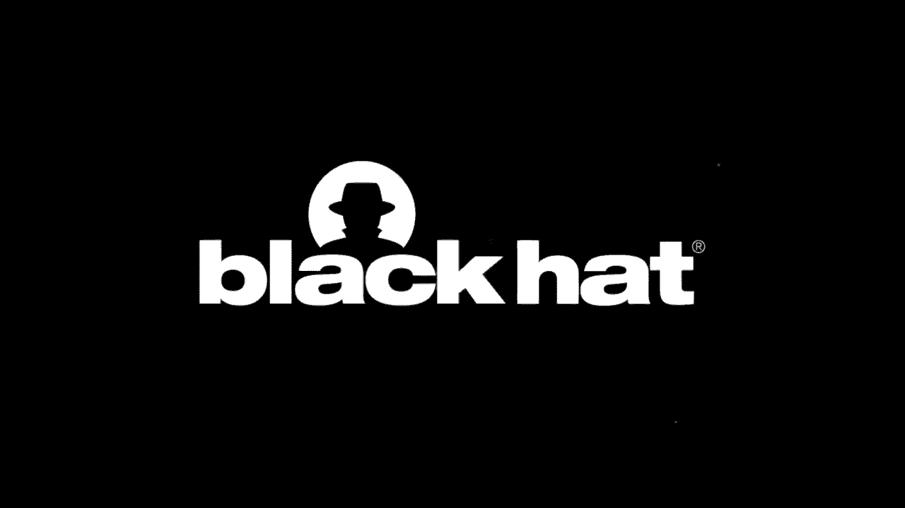

# P22：22 - 通过反取证技术隐藏进程内存 - 坤坤武特 - BV1g5411K7fe

大家好，我是Frank Bloch，你现在正在观看通过反取证技术隐藏进程内存。

本次演讲基于我与Ralph Poloutka、Patrick Reichtenberg以及Erlang-Nunberg大学的睡眠探险家合作的研究。

本次演讲是ENW研究与Erlang-Nunberg大学合作的结果。

**议程**：

1. **简介和背景**：我们将简要介绍本次演讲的主题，并回顾一些技术背景知识。
2. **篡改技术**：我们将介绍三种篡改技术，并解释其原理和实现方式。
3. **挑战和考虑因素**：我们将讨论使用这些技术时需要考虑的一些挑战和问题。
4. **评估**：我们将评估这些技术在实际场景中的效果，并与其他取证技术进行比较。
5. **检测方法**：我们将介绍一些检测这些篡改技术的方法，并评估其有效性。
6. **结论**：我们将总结本次演讲的主要内容，并展望未来的研究方向。

## 1. 简介和背景

进程地址空间包含不同的数据，例如可执行文件、DLL、共享库或堆栈数据。这些内存区域由所谓的内存错误结构（MES）描述。在Windows中，这些结构被称为页表，而在Linux中，它们被称为内存区域。

**核心概念**：

* **进程地址空间**：进程可访问的虚拟地址空间。
* **内存错误结构（MES）**：描述内存区域的元数据结构。
* **页表**：将虚拟地址映射到物理页帧的数据结构。

## 2. 篡改技术

我们介绍了三种篡改技术：

1. **MAS重映射**：通过修改MAS结构来隐藏恶意内存。
2. **PTE篡改**：通过修改PTE来隐藏恶意内存。
3. **共享内存分离**：通过使用共享内存来隐藏恶意内存。

**核心概念**：

* **MAS重映射**：`MES remapping`
* **PTE篡改**：`PTE subversions`
* **共享内存分离**：`shared memory separation`

## 3. 挑战和考虑因素

使用这些技术时需要考虑以下挑战：

* **需要内核权限**：某些技术需要内核权限才能执行。
* **控制代码**：需要一些控制代码来管理内存的隐藏和恢复。
* **副作用**：需要考虑可能出现的副作用，例如内存损坏或系统崩溃。

## 4. 评估

我们评估了这些技术在Windows和Linux上的效果，并与其他取证技术进行了比较。结果表明，这些技术可以有效地隐藏恶意内存，但同时也存在一些局限性。

## 5. 检测方法

我们介绍了以下检测这些篡改技术的方法：

* **MAS重映射检测**：通过分析页表来检测MAS结构的变化。
* **PTE篡改检测**：通过分析PTE和MMPF指令来检测PTE篡改。
* **共享内存分离检测**：通过分析共享内存句柄来检测未映射的共享内存。

## 6. 结论

本节课中，我们学习了如何通过反取证技术隐藏进程内存。我们介绍了三种篡改技术，并讨论了其原理、实现方式、挑战和评估结果。我们还介绍了检测这些篡改技术的方法。

**总结**：

* 我们介绍了三种篡改技术：MAS重映射、PTE篡改和共享内存分离。
* 我们讨论了使用这些技术时需要考虑的一些挑战和问题。
* 我们评估了这些技术在实际场景中的效果，并与其他取证技术进行了比较。
* 我们介绍了检测这些篡改技术的方法。

希望本节课的内容能够帮助你更好地理解如何隐藏进程内存以及如何检测这些篡改技术。