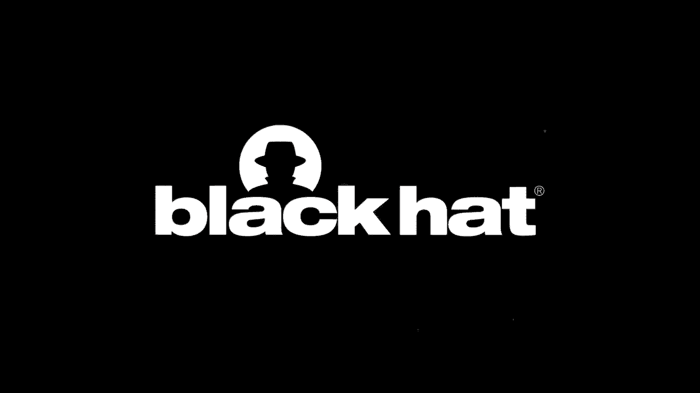
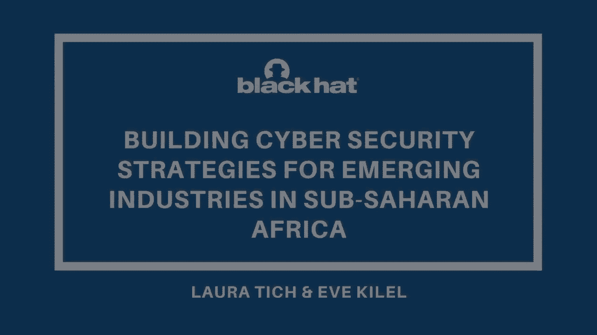
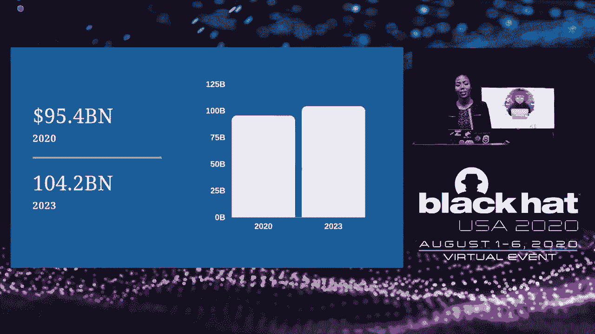

# P24：24 - 建立撒哈拉以南非洲新兴产业的网络安全策略 🌍

## 概述

在本节课中，我们将探讨如何为撒哈拉以南非洲新兴产业建立网络安全策略。我们将分析该地区的威胁格局、常用技术、经济影响以及过去成功案例，并提出改进建议。

## 威胁格局

以下是撒哈拉以南非洲地区常见的网络安全威胁：

* **政府与银行部门**：82%的移动货币渗透率导致新的ATM安装，引发新的威胁或攻击。
* **社会工程学**：例如“萨卡瓦男孩”或“著名雅虎男孩”，通过操纵人们提供敏感信息和金钱。
* **中间人攻击**：攻击者通过发送钓鱼链接，诱骗用户泄露敏感信息。
* **内部欺诈**：银行或移动服务提供商的员工与外部攻击者合作，窃取资金。
* **政府机构**：例如肯尼亚，2019年有19个政府网站被黑客攻击。

## 常用技术

以下是撒哈拉以南非洲地区常用的技术：

* **移动货币**：例如M-Pesa，在肯尼亚拥有超过3000万用户。
* **云计算**：中小企业广泛采用，便于使用。
* **区块链和大数据**：引入新的威胁和漏洞，需要更强大的网络安全框架。

## 经济影响

以下是撒哈拉以南非洲地区网络犯罪的经济影响：

* **南非**：每年损失约5.73亿美元。
* **尼日利亚**：每年损失5亿美元。
* **肯尼亚**：每年损失3600万美元。

## 过去成功案例

以下是撒哈拉以南非洲地区网络安全领域的成功案例：

* **社区**：例如Shehaks、AfrikHackCon和KCSFA等社区，提供培训并提高网络安全意识。
* **本地支持**：例如e-Crane创新中心，提供导师培训和机会。
* **协作**：例如Courts与肯尼亚和索马里社区的合作。
* **会议**：例如肯尼亚的“保护”会议和尼日利亚的Niger-Seqon会议。
* **本地工具**：例如Miraframe Oak和OWASP Top 10漏洞扫描器。
* **监管机构**：例如东非地区的中央银行，提供监管指南。

## 改进建议

以下是改进撒哈拉以南非洲地区网络安全策略的建议：

* **更多对话**：与政府、教育机构、专家和政策制定者进行对话，共同发展网络安全产业。
* **更多研发**：投资于数据、工具和解决方案的研发。
* **支持本地人才**：鼓励组织支持本地人才，并邀请他们参与安全测试。
* **教育**：教育机构应将网络安全纳入课程，并更新课程内容以包括最新技术。
* **更便宜的解决方案**：为不同组织提供更可靠、有效且易于获取的解决方案。

## 总结

在本节课中，我们一起学习了撒哈拉以南非洲地区的网络安全格局、常用技术、经济影响以及过去成功案例。我们提出了改进建议，以帮助该地区建立更强大的网络安全策略。