# P25：25 - 工业协议网关分析 - 坤坤武特 - BV1g5411K7fe

大家好，欢迎来到关于道斯特协议网关及其分析的讲座。

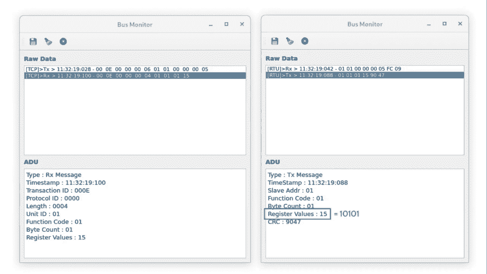

我叫Marco Balduzzi，我在Tramico Research工作，这是我和Charles Ryan、Ryanair以及Trent的Philip以及独立研究员Luke O'Connor之间的联合工作。

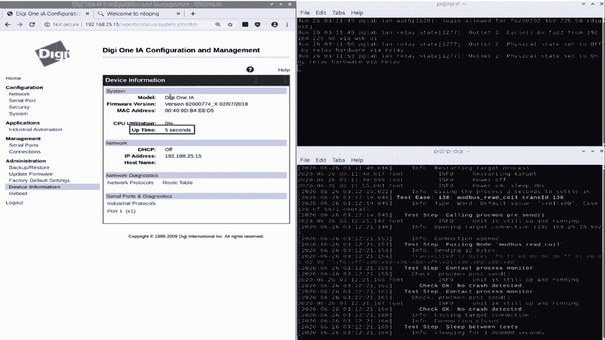

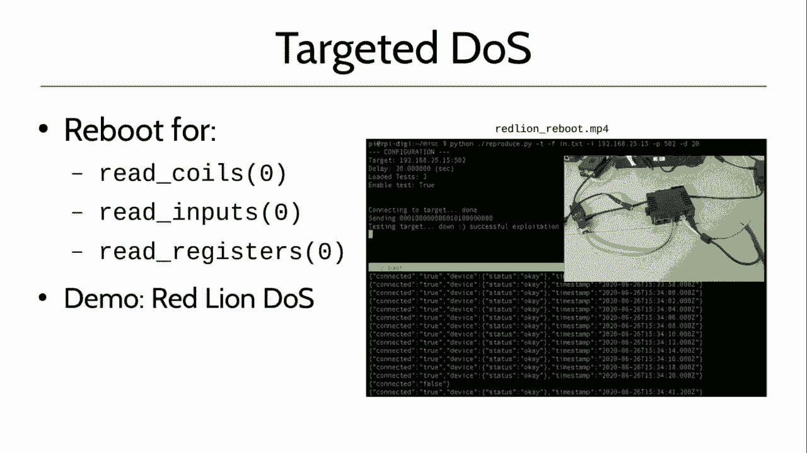

今天我们要讨论的是已经在市场上存在多年的协议网关，它们在智能制造中被广泛使用，并且在IT和OT集成中扮演着非常重要的角色。这是因为智能制造计划非常复杂。例如，它们可能具有不同的网络层。例如，在顶部有一个企业层，其中包含公司的业务逻辑，包括云和存储在互联网上的数据。在中间有一个控制网络，例如运行控制生产服务器的服务器，然后是下方的馈电网络，这是较低的网络。您有像PNC这样的设备以及Twitter、Mueller等等。所有这些网络都必须进行通信，并且每个网络都依赖于不同的协议。有许多不同的协议彼此非常相似。例如，profinet、ether、cat等等。但是您需要某种东西，您需要某种可以将这些协议连接起来并使所有这些真正可互操作的东西。不，使所有这些像彼此交谈一样。这就是协议网关发挥作用的地方，并且它们发挥着非常重要的作用。

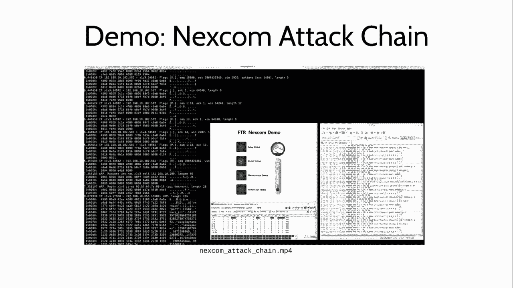

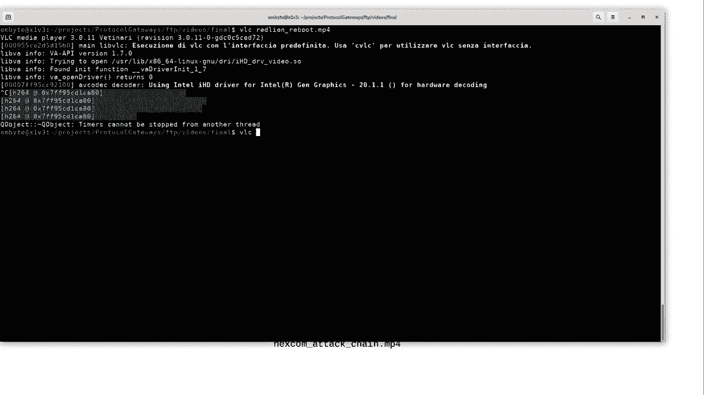

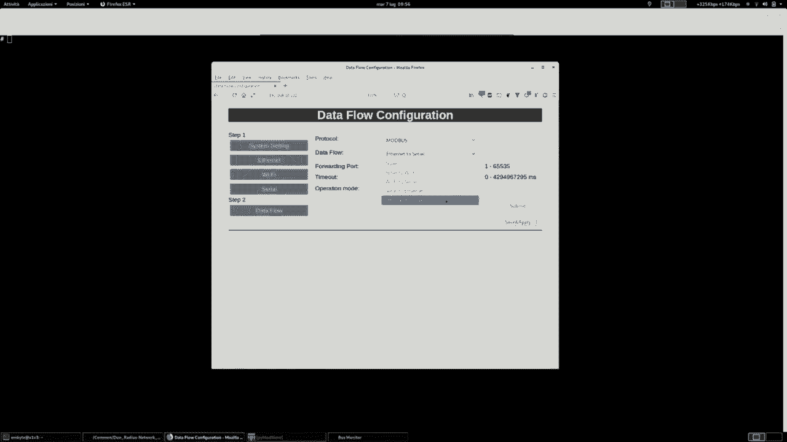

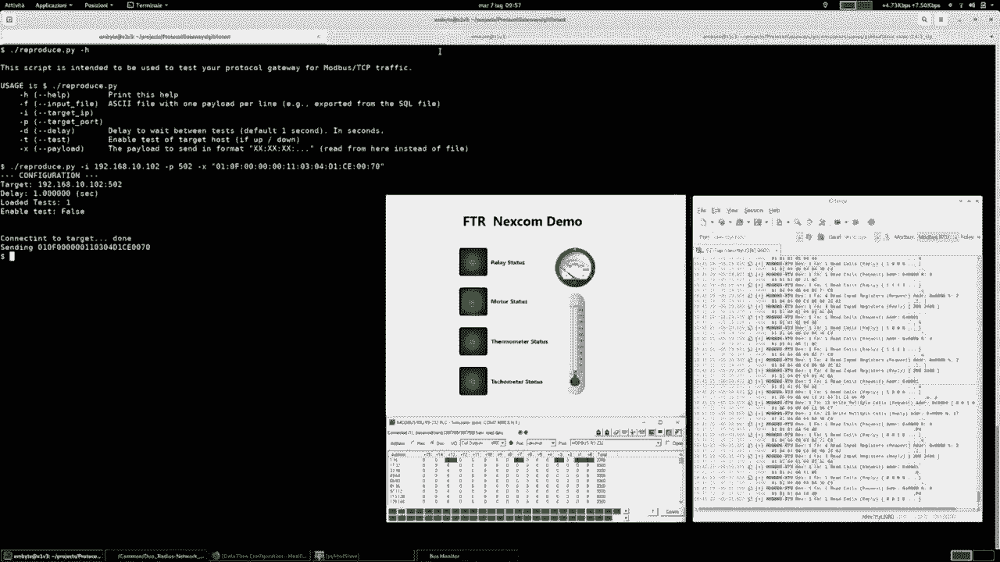

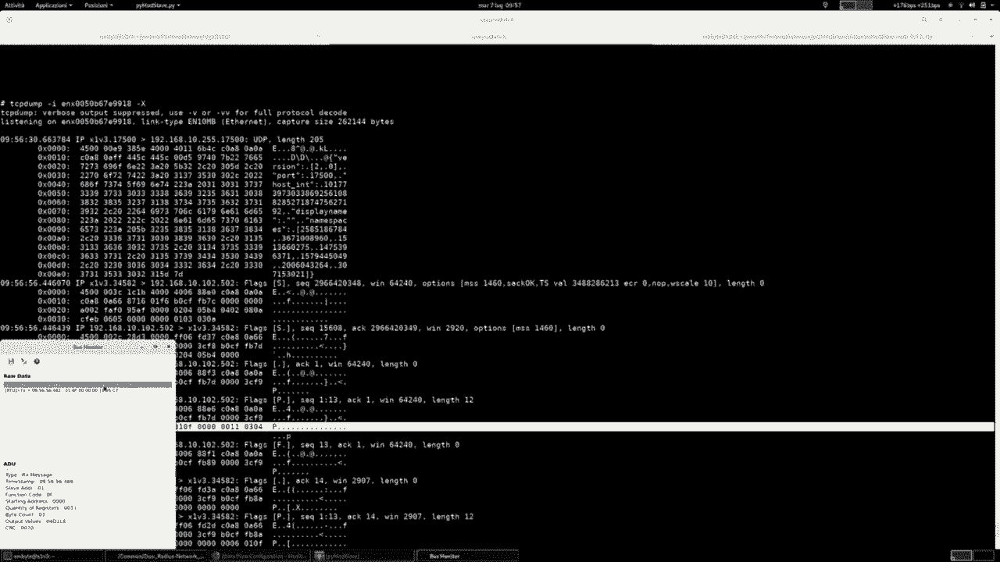

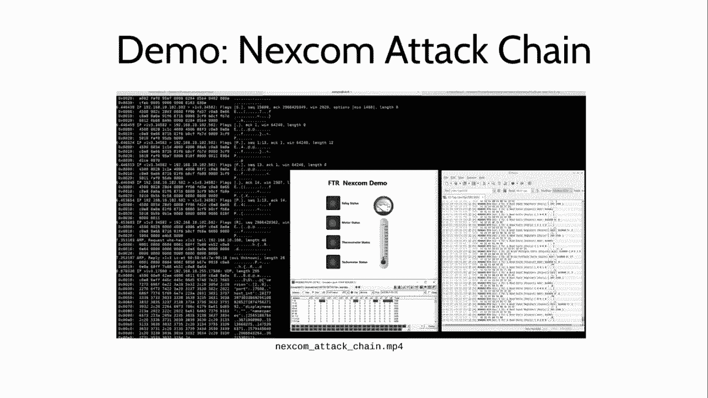

所以，如您在屏幕上所见，这是一个示例，实际上我手里有一个网关。它大约有10厘米长，不是很大，但有不同的接口。网关基本上执行的操作是翻译不同的协议，以便您理解协议的语义，它分解协议，并根据您收到的入站流量采取适当的操作。因此，您可以将互联网接口连接到无线接口，接口连接到串行接口，以及连接到互联网。屏幕上的典型安装就是这样。

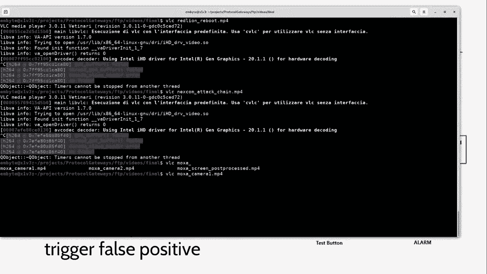

因此，您有一个网络，屏幕顶部的绿色网络可能运行TCP/IP，这可能是正常的控制网络，因此您可以在橙色红色上有一个控制网络，这是一个现场网络，在控制网络上有一个HMI，例如主节点，因此该节点可以采取行动，例如根据从PLC读取的温度配置继电器，等等。假设您在绿色网络上有一个主节点，它必须与橙色网络上的从节点通信。那么这里会发生什么，例如TCP/MODBUS TCP节点在这种情况下我必须与MODBUS RTU节点通信。为了能够这样做，您需要像协议网关这样的设备来处理这两个网络之间的翻译，并且可以同时说MODBUS TCP和MODBUS RTU。

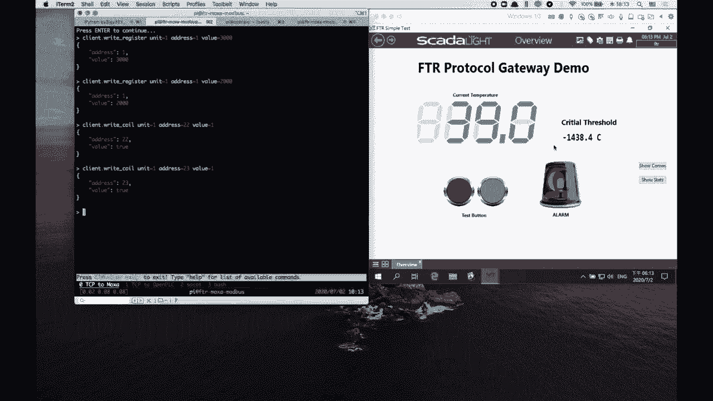

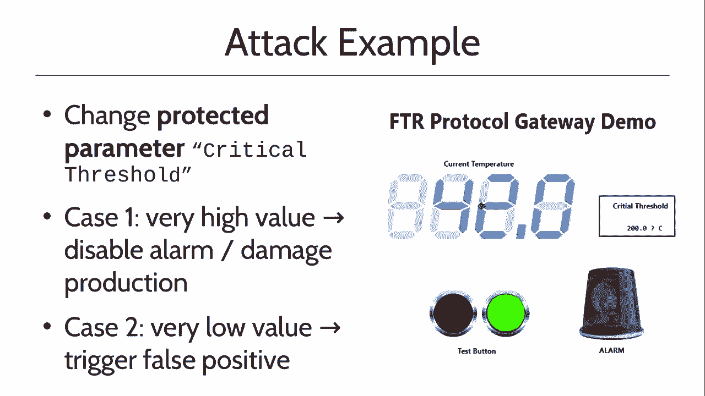

这是一个典型安装，并且这是非常常见的，您有在旧式网络上运行的设备，例如串行，并且您必须将此旧式网络桥接并使其进入您的IT环境。请注意，通常还有一个ACS防火墙，这是一种机制，可以防止并阻止例如HMI写入不允许写入的寄存器，因为它们受到保护。因此，在我的例子中，仅允许读取请求。因此，作为这些协议网关的结果，它们有点便宜，对许多人来说只是更好的硬件，因此他们不会给予太多重视。这意味着您知道也许只执行次要任务。我的意思是，我们不是像工业机器人那样建造东西，所以我们看不到它们在做什么具体的事情，但这绝对不是真的。我的意思是，它们在网络上扮演着非常重要的角色，尤其是在您来到网络时，它们是工业网络的核心。如果这些设备出现问题，这不会很糟糕，而且实际上它们运行着一个完整的系统，因此它们可能具有类似实时操作系统这样的介质，因此有很多功能。所以它们并不像您想的那样简单。

因此，结果是，这些设备往往被忽视或根本不索引，就像公司资产一样。这是因为它们可能没有进行适当的修补，它们可能没有被监控，它们可能被混淆，等等。因此，这就是我们进行这项研究的原因。我们的目标真正地了解这些设备的翻译能力方面的问题，这些问题如何影响现实世界中的工厂或生产。我们以与过去不同的方式这样做，例如，如果您看一下2018年托马斯的研究项目，他表明这些设备可能具有重大的漏洞，但您知道我们并不感兴趣的是这些漏洞会破坏设备，而是如您所说，查看翻译，现在了解协议是如何转换为另一个协议的，并在技术层上进行这种分析，我们并不太感兴趣的是针对特定供应商进行指责，而是了解不同的供应商如何实现这种翻译，以及可能会出错什么。

我们还决定专注于Modbus，因为它在流行的协议中广泛使用，并且它广泛涵盖了控制网络和现场网络。

总的来说，我们考虑了五家供应商的五种产品，它们在以下方面非常相似：它们都有至少互联网和串行接口，说Modbus，并且它们在全球范围内广泛分布。这两个主要产品有两个主要类别，这里很重要的一点是要指出，其中一些是实时网关，这意味着它们执行一对一的翻译，