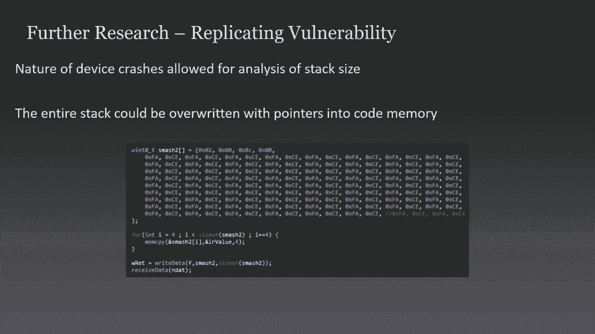
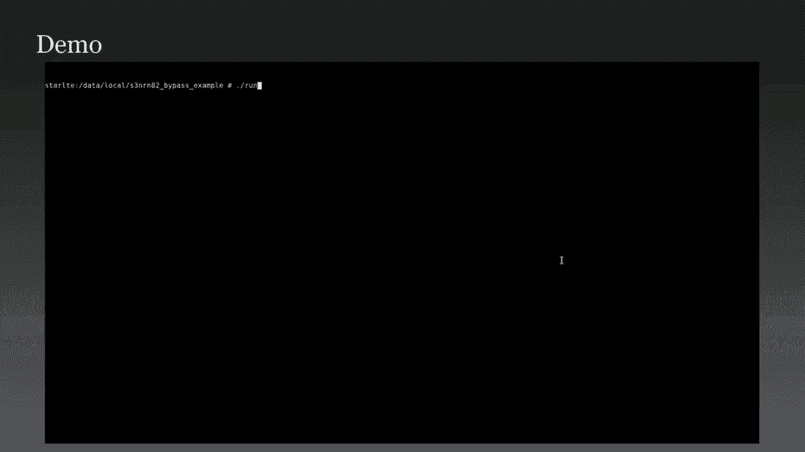
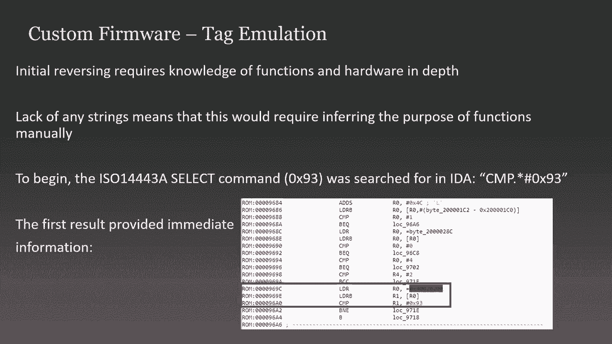

# P27：27 - Beyond Root - Custom Firmware for Embedded Mobile Chipsets - 坤坤武特 - BV1g5411K7fe

## 概述

在本节课中，我们将学习如何为嵌入式移动芯片组编写自定义固件。我们将探讨如何修改操作系统，以及如何修改硬件功能，特别是针对移动设备。

## 1. 项目背景

**公式**： 项目背景 = 修改操作系统 + 修改硬件功能

**代码**： 
```python
project_background = modify_os + modify_hardware
```

我修改了几个手机，发现虽然我可以修改操作系统的某些方面，但我无法以任何有意义的方式修改它们的硬件功能。

## 2. NFC攻击工具

**公式**： NFC攻击工具 = 修改内核 + 修改配置

**代码**：
```python
nfc_attack_tool = modify_kernel + modify_configuration
```

通过修改内核，使其实现所有所需的USB功能模块，而不是仅针对Android的静态模块，可以实现类似gadget F-S的功能，从而通过用户空间应用程序模拟任何类型的USB设备。

## 3. NFC功能

**公式**： NFC功能 = 读取 + 支付 + 通信

**代码**：
```python
nfc_function = read + payment + communication
```

在Android上，即使具有root访问权限，也仅限于通用读取、移动支付、通信和主机卡通信。

## 4. Samsung S6的NFC芯片

**公式**： Samsung S6的NFC芯片 = Samsung半导体 + S3FW R和5

**代码**：
```python
samsung_s6_nfc_chip = samsung_semiconductor + s3fw_r_and_5
```

该芯片具有更新固件安全性的能力，并存在于2014年和2015年制造的Samsung S6和Samsung Note 4设备中。

## 5. NFC通信协议

**公式**： NFC通信协议 = 组ID + 操作ID + 链接 + 负载

**代码**：
```python
nfc_communication_protocol = group_id + operation_id + link + payload
```

该协议使用组ID、操作ID、链接和负载来配置某些设置或从设备中读取某些数据，以配置特定的NFC功能。



## 6. 固件更新协议



**公式**： 固件更新协议 = 命令类型 + 命令 + 负载大小

**代码**：
```python
firmware_update_protocol = command_type + command + payload_size
```

该协议由命令类型（通常为0、1或2）、基于正在执行哪些固件更新方面的命令以及2字节的负载大小组成。

## 7. 固件更新工具

**公式**： 固件更新工具 = 日志记录 + 命令重放

**代码**：
```python
firmware_update_tool = logging + command_replay
```

通过重放您已记录的命令的顺序，可以轻松实现固件更新，无需了解协议的工作方式，只要可以以与之前相同的顺序发送命令即可。

## 8. 隐藏引导加载程序命令

**公式**： 隐藏引导加载程序命令 = 错误返回 + 命令状态



**代码**：
```python
hidden_bootloader_command = error_return + command_state
```

通过查看芯片在发送某些命令时返回的错误，可以轻松识别隐藏的引导加载程序命令。

## 9. 模拟引导加载程序

**公式**： 模拟引导加载程序 = Unicorn引擎 + 硬件模拟

**代码**：
```python
simulate_bootloader = unicorn_engine + hardware_simulation
```

使用Unicorn引擎，可以模拟不同的固件类型，以评估其工作方式并运行在您使用的架构上可能无法运行的功能。

## 10. NFC芯片组

**公式**： NFC芯片组 = S3N或N74 + S3N或N81 + S3N或N82 + SCN82AB

**代码**：
```python
nfc_chipset = s3n_or_n74 + s3n_or_n81 + s3n_or_n82 + scn82ab
```

这些芯片组在现代Samsung手机中使用，例如Samsung S9、Samsung S8和Samsung S10。

## 11. 自定义固件

**公式**： 自定义固件 = 修改内核 + 修改配置

**代码**：
```python
custom_firmware = modify_kernel + modify_configuration
```

通过修改内核和配置，可以修改固件以实现所需的功能。

## 总结

在本节课中，我们一起学习了如何为嵌入式移动芯片组编写自定义固件。我们探讨了如何修改操作系统和硬件功能，以及如何使用自定义固件来扩展手机的功能。