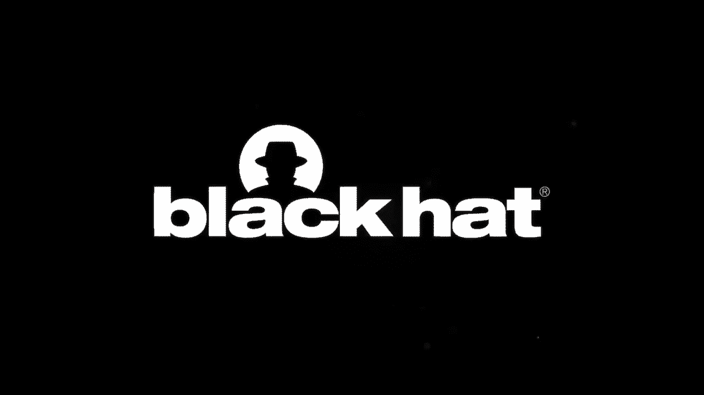

# P28：28 - Superman Powered by Kryptonite - Turn the Adversarial Attack into Your Defense Weapon - 坤坤武特 - BV1g5411K7fe

## 概述

在本节课中，我们将学习如何利用对抗样本来防御黑客的AI攻击工具。我们将介绍两种解决方案：持久对抗扰动和捕获反转补丁以及儿童捕获求解器。

## 第一部分：持久对抗扰动

### 背景

如今，黑客利用AI技术作为他们的超级力量。为了防御这些AI武器，我们可以利用AI的弱点。

### 挑战

1. **图像处理**：对抗样本需要抵抗图像处理技术，如滤波器。
2. **未知模型**：我们不知道黑客使用的模型类型，因此需要针对多种模型。
3. **效率**：捕获服务每天有很高的需求，因此生成对抗样本需要快速。

### 解决方案

1. **抵抗图像处理的对抗扰动**：将噪声集中在特定区域，使其更难被图像处理技术消除。
2. **训练过程**：在每一轮训练中应用图像处理，以确保对抗样本能够抵抗这些技术。

### 评估

通过在图像滤波器上测试，我们发现我们的解决方案不仅能够误导图像求解器，而且能够抵抗图像处理技术。

## 第二部分：捕获反转补丁和儿童捕获求解器

### 背景

为了提高效率，我们可以使用单个通用捕获补丁来处理所有图像。

### 解决方案

1. **捕获补丁**：通过最大化预期期望函数来生成捕获补丁，使其在所有图像上都预测相同的标签。
2. **儿童捕获求解器**：生成儿童捕获求解器，以吸引黑客使用我们的求解器。

### 评估

我们的捕获补丁在不同数字组合下都取得了很高的成功率。

## 总结

在本节课中，我们一起学习了如何利用对抗样本来防御黑客的AI攻击工具。我们介绍了两种解决方案：持久对抗扰动和捕获反转补丁以及儿童捕获求解器。这些方法可以帮助我们更好地保护我们的系统免受AI攻击。