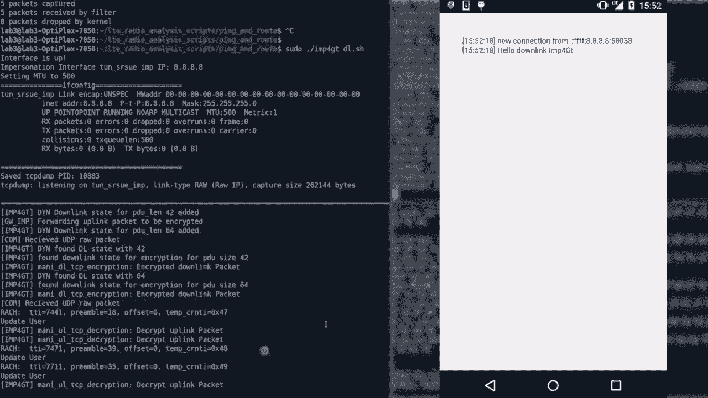
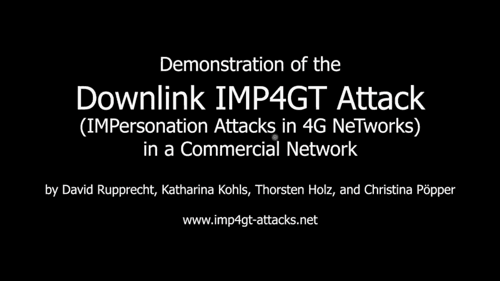

# P3：03 - IMP4GT - IMPersonation Attacks in 4G NeTworks - 坤坤武特 - BV1g5411K7fe

## 概述

在本节课中，我们将学习4G网络中的身份欺骗攻击（IMP4GT）。我们将了解攻击原理、攻击向量以及攻击的影响。

## LTE网络背景

### LTE网络架构

LTE网络由多个实体组成，包括手机、基站、核心网等。手机通过IP网络与基站连接，并通过防火墙与互联网隔离。

### 安全目标

LTE网络的安全目标包括：

* **相互认证**：确保与正确的服务提供商通信，并确保服务提供商知道你是正确的用户。
* **流量机密性**：确保被动攻击者无法窃听电话通话或互联网连接。
* **身份和位置机密性**：确保攻击者无法仅通过接近你就能知道你是谁，也无法知道你的位置。

### 安全措施

LTE网络使用以下安全措施：

* **基于SIM卡的共享密钥**：用于建立安全连接。
* **认证和密钥协商协议**：用于相互认证。
* **流加密**：用于加密数据包。
* **完整性保护**：用于确保数据包的完整性。

## RTI攻击

### 攻击目标

RTI攻击的目标是窃取凭证，例如登录凭证。

### 攻击向量

攻击者利用用户平面数据缺少完整性保护，通过中间人攻击将DNS请求重定向到恶意DNS服务器。

### 攻击过程

1. 攻击者将DNS请求重定向到恶意DNS服务器。
2. 恶意DNS服务器返回伪造的DNS响应。
3. 攻击者捕获伪造的DNS响应，并使用它来访问受保护的网站。

## IMP4GT攻击

### 攻击目标

IMP4GT攻击的目标是欺骗网络，例如欺骗服务提供商或欺骗用户。

### 攻击向量

攻击者利用用户平面数据缺少完整性保护，并结合反射攻击来构建加密和解密预言机。

### 攻击过程

1. 攻击者发送数据包到目标服务器，并捕获响应。
2. 攻击者使用捕获的响应来构建新的数据包，并将其发送到目标服务器。
3. 攻击者捕获目标服务器的响应，并将其发送到解密服务器。
4. 攻击者使用解密服务器获取目标服务器的响应。

## 攻击影响

IMP4GT攻击对服务提供商、执法机构和用户都有影响：

* **服务提供商**：可能导致过度计费和自动计费问题。
* **执法机构**：可能导致错误的调查结果。
* **用户**：可能导致隐私泄露和跟踪攻击。

## 缓解措施

为了缓解IMP4GT攻击，建议：

* 在用户平面实施强制完整性保护。
* 在5G网络中启用完整性保护。

## 总结

在本节课中，我们学习了4G网络中的身份欺骗攻击（IMP4GT）。我们了解了攻击原理、攻击向量以及攻击的影响。我们还讨论了缓解措施。