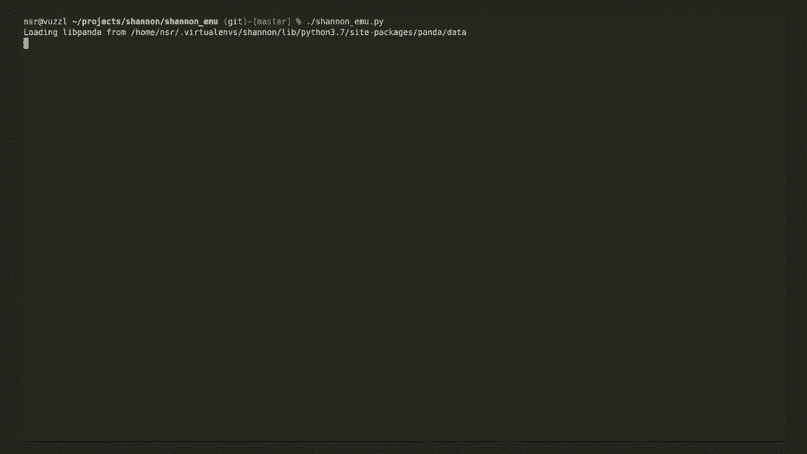
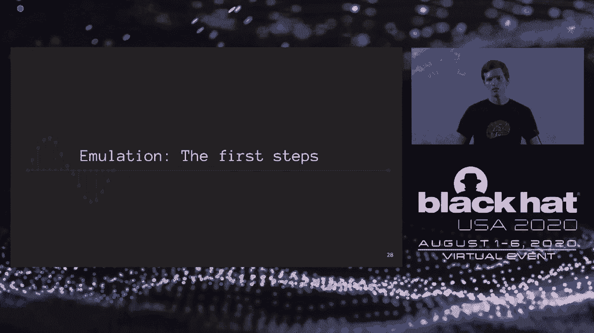
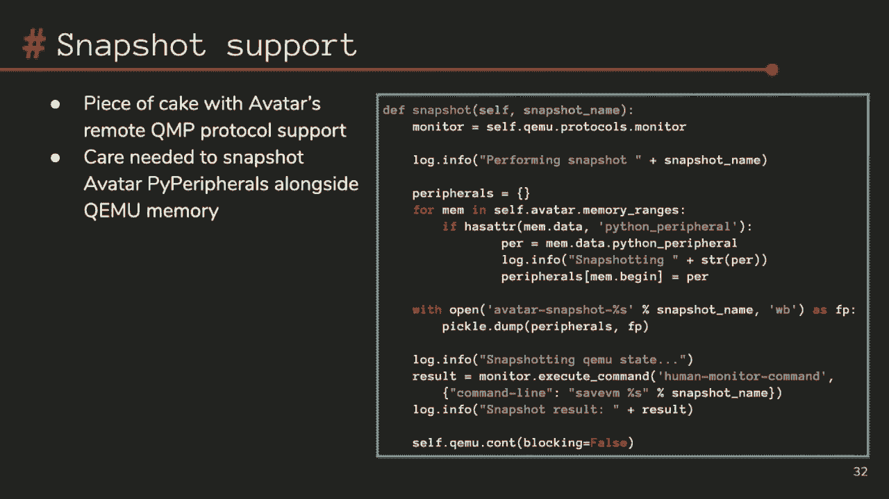
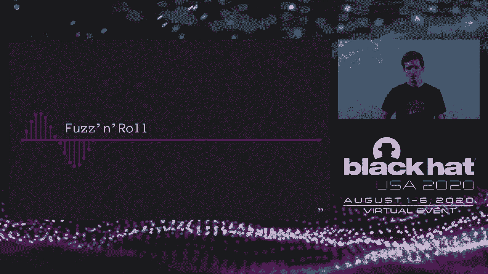
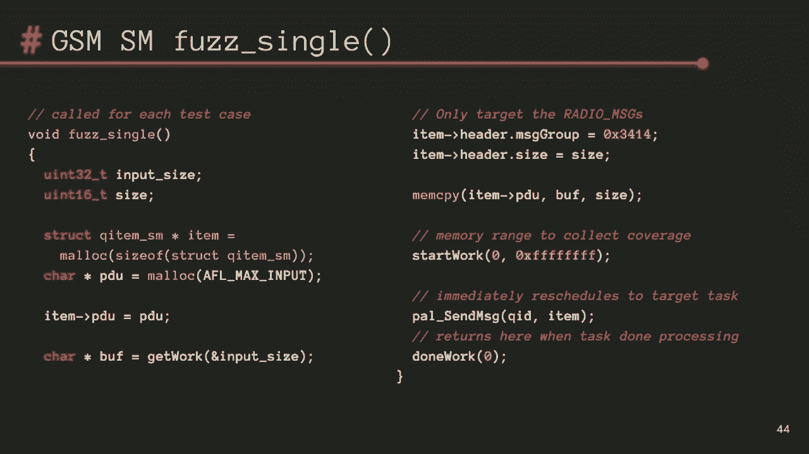

# P30：30 - Emulating Samsung's Baseband for Security Testing - 坤坤武特 - BV1g5411K7fe

 [MUSIC]。

 Okay。 Well， thanks so much everybody for joining me to my talk。

 I'm happy to present work we've been working on for the last year on emulating Samsung Space Band。

 Before we get to into it， a little bit about me， I'm Grant Hernandez。

 I'm a recent PhD graduate from the University of Florida。

 And I work primarily on Android security and firmware analysis。

 And I just joined Qualcomm's product security team working on their modem。 My co-author。

 Marius Mench， PhD graduate from Eurocom， he's a postdoc at FUSEC。

 and he works on building tooling for better dynamic analysis of embed systems。 Unfortunately。

 he can't be here today， but please just imagine he's standing right next to me because he was as integral to this work as I was。

 So， let's talk a little bit about our agenda today。 So。

 I'm going to start with a little bit of a motivation as to why we decide to look at basebands。

 And to do that， we're going to actually go over some previous baseband work。 Initially。

 we'll talk about how I started doing baseband vulnerability research and where it fell short。

 And then we'll jump right into reverse engineering and the baseband firmware。

 how we built a baseband emulator， and then how we actually used our emulator to FUS via AFL。

 allowing us to find end days and zero days。 Finally。

 we actually demonstrate that the things we find in our emulator actually work over the air and then we'll conclude。

 So， before we get really deep into the weeds， let's make sure everyone's on the same page。

 And I want everyone to know what a baseband processor is。

 It's effectively a dedicated device that is implementing the 2-5G cellular protocols。

 This pretty much allows you to walk outside of your house without a Wi-Fi connection and be able to get data。

 calls， SMS， and the like。 And it really is the phone part of your smartphone。 So。

 the vendors below implement their own version of the baseband processor based off of the cellular protocols。

 These basebands run embedded firmware and they usually leverage a real-time operating system to schedule tasks and maintain their real-time deadlines。

 And it's important to note that basebands are separate CPUs from the application processor found on mobile phones。

 whether it's Android or iOS。 And this is likely due to their performance requirements。 So。

 why basebands？ Well， basebands have a lot of attack surface。 As I said。

 they support the 2-5G protocols which are really complicated。

 Some of the things you can find on basebands include custom DSPs， ASM1 encoders。

 possibly auto-generated or written by hand， custom IP stacks， voice and audio codecs。

 X5 and 9 parsing， DNS parsing， and a ton more。 The more you look， the more you find。

 Some things are really obscure and unique to sell here。

 Some things are things you'd only expect to find on a desktop。

 And another reason is that baseband attacks can be devastating。 So。

 imagine being able to compromise a baseband。 At this point， if you're running code on a baseband。

 you can intercept calls， SMS， and all the data， independent of the operating system。

 And even if you're feeling really bold， you can try and escalate to the application processor itself for the compromising the phone。

 So， it's an important attack vector to consider。 Today。

 we'll be focusing on Samsung's Shannen baseband。 This baseband is present on Samsung's smartphones with the X and its chipset。

 effectively non-US phones， because the US phones use Qualcomm's chipset instead。 It implements 2。3。

5G protocols， and it uses an ARM Cortex-R to maintain its real-time properties。

 And it's an interesting vulnerability research target。

 It's been shown that there are over-the-air attacks that can be launched against the baseband itself。

 And it's also been shown that there are less than stellar exploit mitigations on the application than compared to the application processor。

 There's been three talks that are really good on Shannen exploitation， the Breaking Band Talk。

 the Walk with Shannen， which went over a pwned-on vulnerability in great detail。

 And even more recently， how to actually design a baseband debugger on device。 So， in this case。

 we'll be doing our debugging in our virtual environment。 There is other baseband work too。

 but as you can see by the dates and the years， not as much as you would expect。

 given the importance of it on our mobile devices today。 It's something that's in everyone's pocket。

 but really， there hasn't been， in my opinion， enough focus on the impact of exploits and memory corruptions in basebands。

 The fact that I can put most of the top work on one slide should tell you that。

 And that's where really our work comes in。 We developed a tool called Shannen EE。

 It's an emulation environment for the Shannen baseband。

 And what it does is it executes firmware directly， so no pre-processing。

 such as a static analysis tool is required。 You don't need a physical device。

 and it's a scalable to as many cores as you have available。

 It is able to cold boot a baseband and brings up most RTOS tasks。

 Some of the core features include a Python API for prototyping peripherals and anything else you can come up with。

 ModKit and C-based FFI for extending and exploring the baseband。 Integrated coverage。

 guided fuzzing， Vafol， GDB for triage， and support for multiple SOC versions。 So all in all。

 this gives us a really good platform， and I'm going to show it to you right off the bat。

 So all you really need to do is run our Shannen wrapper。

 at which point there's a config file which will be loaded。

 and it will tell which baseband firmware we're going to target。

 It will initialize the baseband emulator。 It will apply hooks， you can introspect。

 it will boot the bootloader， jump straight to the main file。

 These are the log messages coming from the non-volatile memory initialization。

 It will just continue booting and it will start initializing tasks。

 And you can at that point start fuzzing or start exploring the baseband memory， craft your exploits。

 and the like。 So it's a real dynamic analysis platform for basebands， which to my knowledge。

 there hasn't been one publicly released。

 But how did we get here？ I think the journey of how we actually got this tool to work is more interesting than the tool itself。

 And I'm going to tell you how we actually achieved this。

 So it actually started last year around May and honestly probably a little before that。

 I had started to do kind of a discussion of what I could do to actually do baseband analysis。

 Was I going to go static？ Was I going to go dynamic？ I had seen a lot of static work。

 but I ended up trying to do baseband fuzzing over the air。

 I didn't have any experience with SDR or Celier， but I had a lot of reversing and exploitation knowledge under my belt。

 So how hard could it be， right？ Well， Celier protocol standards are pretty much acronym soup。

 which makes things really hard to get into。 I spent a whole lot of time wrestling with the physical aspects because I'm not a signal analysis person。

 Base stations getting them set up and then debugging why my phone wasn't working was a big headache。

 But finally after reading and trying things out， I was able to get a test set up with a 2G base station and 2G and implemented the GSM and GPRS。

 Data protocols。 I added a really dead simple bit flipper to the layer two to layer one code。

 so I would flip all packets leaving the baseband。 I then connected a mix of phones to the network。

 I use an ADB logcat monitor to see if I can find crashes。 And I found crashes， which is really cool。

 but then I now realized the main issue with this approach。

 I couldn't understand why they had crashed。 I was just flipping packets randomly and not to mention that the phones themselves weren't giving me the required debugging output to actually figure out what was happening。

 let alone the impact of what I just found。 On the right here。

 you can see a phone crash I got on a Samsung phone and this is all it told me。 It mentions， oh。

 there's a memory guard corruption， which sounds really promising。 It's a heap overflow。

 But it has this thing a little symbol。 It's like the word root。 Looking more into that。

 and honestly， I should have probably listened to comps cures。

 They don't recommend OTA fuzzing for more than just the fact that you can't get debugging output on basebands。

 It's just not a good approach。 Looking more into the debugging side of things。

 I found that there are root checks within the baseband code itself。

 Pretty much if your phone's been unlocked or rooted in a way that I guess is not using an exploit。

 the modem will no longer give you the debugging output that you would expect。

 So we're kind of stuck to get modem dumps when you root， but rooting suppresses modem logs。

 So how do we actually find let alone debug these memory corruptions in a scalable way？

 The anti-debug makes this difficult。 We probably need some off-the-shelf exploits to bypass these things silently。

 Manual engineering is an option， but basebands are huge。 This doesn't really scale too well。

 And on the link there you can visit offline is kind of a demonstration of how much is really going on in a baseband。

 So from a vulnerability research perspective， the GDB coverage guided fuzzer and snapshotting。

 So at this point， it seems like the most viable approach was to drop the over there fuzzing and jump straight into emulation。

 To do that， we started by reversing the firmware。 And this started by getting the firmware from a publicly available source。

 We bought a research phone， the Samsung S10。 We targeted this specific firmware。

 And we also had a launch of other firmware lying around which we use this kind of flow chart to categorize。

 Pretty much it's just the zip file tar files within it。

 We pick one tar file which has the modem code on tar it。 We have modem。bin and modem debug。bin。

 There had been talk that actually these files were encrypted。 We didn't see that。

 None of our images were encrypted。 We were able to just throw it into GEDRA and get started。

 This format， the table of contents format， I'll show in the next slide。

 It's been well reverse engineered already。 So it's a pretty simple format。

 The modem that bin file has a header。 This header has a name， file offset， load address， size。

 CRC and entry ID。 And then this header is replicated for every entry within the TOC format。

 But for our purposes we were really only interested into these two sections。

 the boot and main sections。 Starting with the boot， we seeked forward into the file。

 defined as start points。 And looking into the actual code。

 we started to notice a very obvious pattern。 If you've done armor reverse engineering。

 the conditional flag is set。 So this pretty much means the code is not encrypted and we can just throw it into GEDRA and get started。

 Further， this assembling confirmed these are the exception vectors。

 At which point we can then jump straight into the reset exception handler and get started。

 Doing some reverse engineering disassembling and naming， we realized that the boot letters using UR。

 Which is really cool。 Something we are going to emulate later on to be able to get this output or pretty much liberate this output from the baseband。

 And we also noted two boot modes， the dump and the regular boot mode。

 And in order to do emulation to be able to bring up this firmware in our Shannon EE system。

 we need to know who's signaling these boot modes and what boot modes are possible。

 So that brought us to a side quest into the Samsung kernel。 Thankfully， because of the GPL。

 this is available publicly， I'd mirror to hear at this link。

 But effectively there's the modem driver within the code。 We looked at it and two files stood out。

 The modem I/O device file， which is actually the I/O control handlers for the modem driver。

 And this allows for read and write。 And then this link device memory file。

 which actually contains structs on the shared memory regions between the application processor and cellular processor。

 Looking more into the I/O controls， there's something called CBD or the cellular boot daemon。

 This communicates with the dev node via I/O controls。 And it actually will boot the modem up。

 It will do this by first resetting it， setting up security， setting it to on， booting on download。

 which means it upload the code， and then boot off。 The security request is actually interesting。

 I'd like to talk about that at another time， but that pretty much enables secure boot for the modem。

 Looking more into this shared link device memory file。

 we found a structure that's packed and is referenced in the actual I/O memory reference。

 What this really means is actually going to be used for DMA and IPC。

 There are commands and there's this magic field。 This magic field actually matched the numbers here actually matched what we saw in the baseband boot loader。

 which means we can now actually map this same memory region in our emulator to be able to signal to the boot loader how we would like it to boot and allow us to explore the baseband and continue booting forward。

 As a side note， there's other buffers， the format and the raw TX and RX buffs。

 Those are actually receiving commands from the Samsung radio interface layer。

 That's actually something we'd like to explore further because that is really the IPC between the Linux kernel and the baseband itself。

 With this reverse engineering out of the way， we actually had this nice block tag that we can make to help us understand how everything is organized and to make sure that we're on the same page。

 So far we'd looked at these portions。 We had looked at the modem interface。

 which is the host interface and the IPC cross core， and we'd also seen that there is UR。

 But there's a lot more to look at。 We need the tasks that are specific to the cellular technologies。

 We need the other peripherals， and that brings us to our next step。 At this point。

 we could actually start writing emulation code。

 But first we need to pick our weapons。 And for that we chose Avatar 2。

 which uses KIMU as a target underneath。 A little bit about Avatar 2。

 It's actually a Python framework that orchestrates other frameworks。

 and it allows you to interoperate between them。 It allows you to define Python based peripheral definitions for easy prototyping。

 which I really liked because I allowed me to work fast and I have to worry about compiling C over and over again。

 And it had a really nice interface to KIMU， such as GDB and it's a monitor protocol。

 So a really good thing to choose。 And the first thing I did was I wrote a peripheral for the boot UR。

 It was really simple。 On the right you see this peripheral definition。 There are two functions。

 the read and write functions， which are called if KIMU will access a memory address within the memory range that is defined on the left。

 That's simple and we're able to liberate the initial boot messages to help us debug our peripheral definitions from that point forward。

 And here's an initial video of actually booting once we had done the UR。

 So you'll notice in the bottom left there's some kind of debugging output showing us what's being done。

 And you notice this is actually the UR coming out now。 But look how slow it is。

 It's pretty much slower than a 56K modem at this point， which is okay。 It's a good first start。

 but we definitely need to do better。 So that's why we started going even further。

 And the first thing I did after seeing this was implementing snapshots。

 which ended up being a piece of cake with avatars frameworks because of how it allowed you to remotely control KIMU。

 We could just send the command to do a snapshot。 The only caveat is because we had Python and C based peripherals。

 we need to make sure we snapshot it both。 So we just pretty much the code you see here is exactly what we use to snapshot the Python peripherals at the same time as the ones in KIMU。

 And taking a step back， this is what we have so far， the first incarnation of Shannon EE。

 We have avatar 2， we have our UR peripheral， we have the file parser for the mode of images。

 We've been using GDB hooks up until now。 And KIMU is our target and everything is being done over IPC。

 But this is where the problem is。 Actually， because this IPC is cross process and we're needing a lot of hooks and a lot of remote memory reads。

 these become the primary bottleneck。 And we needed a way to actually solve this。

 But I spent a whole lot more time hacking on this， trying to figure out。

 trying to improve the speed。 And I kind of hit a dead end。 I was like， you know。

 something's wrong here。 Maybe we need to take a different approach。

 So this is when I brought on board Marius。 Who better to bring on than the lead developer of avatar 2？

 So with him and his knowledge， he suggested we actually move to a different approach。

 We actually instead of using KIMU， let's use Panda。

 So we ported the rest of what we had done to Panda。 Panda is just a fork of KIMU from 2013 or so。

 And what it offers in addition to KIMU is a plug in infrastructure。

 callbacks during KIMU's run time state， and record and replay。

 And it's already integrated in avatar 2's， I guess， framework。

 So the main issue is it still has the performance issues that we're dealing with。

 It's still a separate process。 But that's when we discovered Pi Panda。

 It's pretty much a library based import of KIMU or Panda。

 You can literally import Panda and that means you're now a thread within your process。

 So no more IPC， you get a single Python interpreter with FFI to Panda's C functions。

 So you can do extremely fast native hooks， which allowed me to replace all the GDB hooks with Panda hooks。

 And we got a huge speed up doing this。 There， the IPC was pretty much just a mutex waking up another thread now。

 which is a big speed up。 And on the right， you see our block diagram of how things have changed。

 It's not all integrated together and we can get higher performance and we don't need multiple Python interpreters on either end。

 This is when we really start getting into the weeds of emulating peripherals。

 And we hit this function called pal in it one。 It's a huge monolith that pretty much boots the modem。

 Once you've gotten past the bootloader， you've gone into the main image。

 you hit this function which brings up all the heap objects， the non volatile items， the timers。

 DSPs and all the tasks。 So to kind of turn through this， we iteratively emulated the peripherals。

 We watched for crash strings or infinite loops。 We used memory mapped IO monitoring to see which peripherals need more modeling。

 And it was really an iterative cycle。 We also used some kind of simple。

 a cyclic bit pattern to like kind of fuzz our way through some peripherals that we were able to get us past any checks。

 And after doing all this， we had partially emulated the power management IC， the clock peripheral。

 a very， very small amount of the DSP， not the actual， just enough to the communication。

 the SOC driver， the Samsung IPC peripheral， the slash server memory。

 the timer and the generic interrupt controller。 So we could boot and we could bring tasks up and we hit the banner。

 We had seen this banner in the static analysis and we're like， if we can get to this banner。

 we'll be in really good shape。 And we reached it。 And this was about， I think， March。

 So it had been， I brought Marius on board in January and then in March。

 so things really kicked off and we're really cooking with gas now。 So at this point。

 we had started to get tasks running and we were like， okay， let's start doing fuzzing。

 So we started to port Triforce AFL to our system。 Triforce AFL is a patch set on top of AFL。

 It's originally developed in 2017 and what it does differently is it allows you to do system level fuzzing。

 So Shannon EE is a system level emulator， meaning it has a software MMU and it invokes AFL from within the guest via hyper calls。

 And we combined this patch set with some AFL plus plus additions because it has some really good patches。

 which means we got better coverage collection and a persistent mode。

 And this allowed us to do fuzzing within using something called the AFL task。

 So to get an AFL task running in the baseband， we used our modkit。

 We wrote a modkit that allowed us to inject custom tasks into the emulator baseband playing very nice with all the APIs that exist。

 We were able to write these in C and we had dynamic simple resolution for a nice C-like FFI。

 This was done across version as well， so you wouldn't have to change our harness for different for。

 let's say， 2017 firmware image to a 2019 firmware image。 It would be seamless。

 And the diagram below shows you kind of how the AFL tasks integrated。 It has a couple of steps。

 It will set up the fuzz case test case。 It'll start the fork server。 It will receive data from AFL。

 It'll start the work collecting coverage。 It will do the single fuzz test case and then it'll call done and repeat。

 So now we actually needed the target tasks。 So we integrated AFL within the RTOS itself。

 which means we could use the APIs that the RTOS tasks themselves already used。

 And this was an important thing that we chose to do because it allowed us to avoid rehosting。

 I guess， and carving out portions of the baseband to get our fuzz harness on the table。

 And our fuzz harness to work， we could just play nice with the messaging。

 And we reverse engineered the message and cues that were used to send data between tasks。

 And we would just call send message to target a task。

 The right is the header of the cue items that would be sent。 Very simple。 Source， destination cues。

 a size and a message ID。 So our foot， as an example。

 here is the GSM session management in the GPRS fuzzing harness。 This is 2。5G/2G。

 This is what the data connections on their very early 2G's would use。

 On the left is the cue item that's specific to the SM task。

 And on the right is the setup function for the task。

 This is important because we had to do an initial packet to send to the SM task。

 which would initialize it to the point where it would then be ready to receive radio messages。

 And it's important to note that our approach is skipping layers 2 and 1。

 It's jumping straight to layer 3， which saves us a lot of time with peripheral emulation。

 Here's the actual fuzz single。 What it really does is very much the same。

 It will allocate a message cue item。 It will allocate a PDU。 It will get the work from AFL。

 It will copy it in， set the size， set the radio message ID， which will be reverse engineered。

 Start collecting coverage。 Send the message。 And this is an important part。

 It actually will send the message from task to the AFL task。 And then it will。

 the RTAAS will reschedule directly towards a task。

 And we did this by actually setting the priority of our AFL task to the lowest possible。

 And then finally once that message is in processing or any sub-messages that return。

 it will call it "done work" and do it all over again。

 So here's a video of it in action。 It's just as how you would normally use AFL and you can call it directly on the Shannon EE。

 It will spin up the fork server from a snapshot so we don't have to wait for the whole thing to boot up。

 We can snapshot right before the AFL task is ready to run and the baseband is quite yes。

 Waiting for events。 It will load the initial corpus， start collecting coverage， and boom。

 it will start fuzzing。 And our exec speed is pretty high because we've set a pretty high persistent mode number。

 This does come at the expense of variable test cases， so you don't have to use it。

 but if you want to really turn through things fast， you can go ahead and do that。

 And now let's talk about the bugs we found。 So before we jump straight into Oday's stuff。

 we wanted to make sure that we had built a tool that actually worked on real， to find real bugs。

 not just kind of fake false positive bugs。 So we decided to rediscover an end day and we actually went off of Amat's talk。

 which was targeting a Galaxy， I believe， S10 or S7。

 And we were then able to build a harness for the same subsistence defuzz。

 So the GSM and GPS radio packet handlers。 And more specifically。

 we built harnesses for call control， CC， mobility management， and session management。

 These are all something you could read in the standards of GSM。 We set a file to the task。

 set up the fuzzer， and boom， we're able to actually rediscover the PDP network except crash from O'wok with Shannen Talk。

 So this gave us a lot of motivation and we had pretty much done some ground truth testing on our emulator。

 Now defined new things。 Once again， our target was GS7 and GPS because hey。

 if we find something here， this is the lowest hanging fruit。 Why not look at LTE or 3G or even 5G？

 I mean， at the end of the day， if we try to compromise a baseband。

 you're going to go for the easiest target。 2G is that target。

 And it is still implemented in pretty much every baseband today。

 You can do a fake base session attack trivially。 There's no mutual authentication。

 so it's easy to craft any message you like。 Our coverage got in fuzzing。

 We had some blank initial seeds and we were able to debug coverage using Panda， exporting coverage。

 and Geejur's Dragon Dance。 We didn't run even for that long。 30 CPU cores across five days。

 which further demonstrates the scalability。 And we were discovered two end days。

 the one from before and the one I'll talk about next， and one zero day。

 which we're in disclosure with Samsung about right now。 And given the success of GSM。

 the fact that this is 30 years old at this point， we're still finding things at say。

 LTE and above is definitely next on our list。 So let's talk about the other end day we found。

 which we're which we're pointing the call of death。 It's pretty much an。

 I believe a previously unknown overflow， at least publicly。

 in the call set up packets using targeting this field called the bear capability。

 This is something you can look up in the standards。

 but effectively it comes in when you're receiving a call。

 This packet was incorrectly parsed by the baseband when the call is incoming。

 and it's a heat based buffer overflow， which we seem to have a fair amount of control over。

 And we did confirm that this vulnerability is no longer on newer firmwares。

 Balance checking has been added and it's pretty explicit that they were fixing this。

 whether it was from a report or an internal audit we don't know。

 But the fact is we found it and we were able to use Shannon the triage it。

 As you can see at the top here， our a file task sent the message to the target task。

 which is the CC task。 The CC task was scheduled in。 It then received the setup message。

 which is noted as a radio message。 It entered the code function and finally later on after some SNPs。

 you can see the length， which is pretty large for the bear。 It should be maybe only a couple bites。

 and then it crashes with a palmem guard corruption。

 If you remember we had seen on in the very beginning。

 we'd seen the palmem guard corruption in the phone screen。

 but now we can actually see why this is happening and the back trace to do it。

 But logs aren't always enough， so that's why we actually have the ability to use GDB。

 So we have the register R2， which is set to 30， 30， 30， 30， and we have this comparison。

 which is comparing R2 against all A's。 This is actually the static heap cookie。

 This check is going to fail， and you can see the payload here。

 The reason it's going to fail is because this is our payload AFL generated。

 Everything that's not ASCII zero is the message header， enough to reach the bear。

 and the rest is the bear。 So that's pretty much being copied straight into a heap buffer that is clearly too small。

 So to even further have confidence that what we built is going to work in the real world。

 we replicated what we found over the air。 Our experimental setup included a blade RF。

 which is about $420， a base station， a BTS， which we modified with our X-Plate payload。

 We literally just copied it in verbatim， maybe cut off the header， the very initial header。

 and that was it。 We targeted the S10 and S7 error testing。

 and we used SIM cards from OsmoCon to help the phone get an easy connection。

 And shout out to Tyler Tucker， who is an author on this paper on his work。

 who pretty much spearheaded this and made sure that， you know。

 I didn't have to go through the hell of getting this set up again。

 So he suffered for what you're about to see。 And here's the demo。

 So the phone on the left and the phone on the right are both connected to the fake base station。

 The call on the left is calling the phone on the right。 You can pick it up。 And it will go through。

 but the phone on the right won't have the call working。 For some reason you can get another call。

 whether you decline or answer。 At this point it's too late。

 The signal bars disappear and that little X comes in， which means the baseband is crashed。

 At this point it's a pretty cool thing we can do。 And to even further confirm。

 we use logcat to get the logs。 But as you can see， this is all you can see in the logs。

 You actually can't see anything else。 So without Shannon and E。

 it would be really tough to debug why this happened。 So let's wrap things up。

 There are a lot of remaining challenges and I think future work for this。 For instance。

 doing fuzzing for cellular/tailored fuzzing would be really cool to get better code coverage。

 We ignore the physical layer， so what aren't we missing by supporting it？ I mean。

 DSPs are a tax surface too。 And honestly， I think I would love to see this。

 a holistic analysis of baseband attack surface。 What has been covered and what still remains？

 Some key takeaways。 We really need scalable tools to keep up with all the cellular protocols。

 especially 5G， which is on the horizon。 If we can barely do 2G。

 how on earth are we going to keep up with the rest of the 5 and beyond Gs？ Building an emulator。

 even with undocumented hardware， can be done。 We can bring this methodology to other basebands and I think we should。

 And honestly， we have to end link basebands。 We need the right introspection level。

 especially to do memory corruption debugging。 And over there testing。

 I think what we've shown is just not going to do it。 With that， we have some releases。

 We'll be releasing the top link has all of our reverse engineering tools and code， GEDRA。

 loaders and so forth， some firmware samples， an on-device log parser for the BTL format。

 And Shannon EE will be released at a later date after disclosures in some further QA。

 But you can watch that repository and you should be able to get an email when we do our first push。

 With that， I have to thank all the sponsors and people who funded this work， NSF， SRC， NWO。

 and Air Force and Navy。 Without their contribution and support， this work wouldn't have happened。

 With that， I hope you enjoyed the talk and I would be happy to take any of your questions。 Okay。

 Well， thanks everybody for attending this talk。 I'm sorry for the buffering issues。

 but if you manage to catch some parts of the talk， we are here to answer any of your questions。

 And yeah， here's Marius。 So， yeah， hi。 I know， unfortunately。

 the logistics of the talk didn't let us kind of get together due to， you know。

 there being an ocean between us。 But at least I'm now also here to answer question of yours and to the technical problems。

 video on demand for this talk will be available at a later point in time， so you can rewatch this。

 Yeah， just the parts you missed。 And of course， you can also reach out to us later on the swap card platform and ask questions and private later on。

 But we will also answer question right here。 We had one already coming in。

 which we inlined already in the chat， but still let's repeat it already。

 Did we have access to the source when we started the project？ Grant。 No， we did not。

 I know there had been a leaked source for， I think， Media Tech， I believe。

 But we did not have that in this case。 So we had to really just start reverse engineering from the very beginning。

 So that definitely complicated matters， but also it's more realistic in terms of， well。

 I guess if you're an actual kind of vulnerability researcher。

 sources kind of luxury you don't normally have so。 There's another question coming in。

 Roughly how long until Shanny E's release date。 So right now we're in disclosure with Samsung。

 We still need a QA of the code。 I don't really have an estimate because the disclosure process could take longer than it usually takes longer than you think。

 That's all I can really say。 And we are eager to release。 So we want to push the source。 No。

 as soon as possible。 Right。 The sources will be in your hands at some point。

 We're not intending to keep for ourselves。 Yeah， I didn't really catch this in the very beginning。

 I didn't say enough， but I mean me， Marius and all the other people on the first slide were very important towards this work。

 So although Marius wasn't presenting， I mean， make sure everyone understands that this work wouldn't have happened without everyone working behind this。

 Yeah， it was a team effort。 For sure。 Another question came in。

 Do the bucks tend to group to what crash or fail or remote access？ Well， I guess。

 I guess it depends。 I mean， that's kind of like a question of how。

 Of like what your threat model is because in our case， we assume you have a fake base station。

 You can get a phone to connect to the face。 And you can send arbitrary messages， at least via 2G。

 So it's hard to say where the bugs are。 If you happen， if we knew where the bugs were。

 I think we would have had a lot more to talk about。

 but that's what this tool allows you to do is to find bugs。 Yeah。 For instance。

 the end day we showcased was in that scenario， a heat based buffer workflow。

 which is potentially level to full chain， we would call execution exploit。 We did not do this。

 We did not attempt it as far as it was。 Yeah， far enough to get to the crash。 Yeah。

 And there are no heap， like the heat metadata is fairly straightforward and there's no。

 there's like a static heat cookie， so there aren't really a whole lot of mitigations there。

 One other question， I saw you use the Blader of X40。 Yeah， there is a very good reason why。

 There's a blog post I just posted on my Twitter about how to set up a cellular test bed。

 And I explained why we use the X40。 We couldn't get the XA4 to work on YATE BTS。 So， yeah。

 we would have liked to use it and we did try and it just didn't work。

 So check out the blog post on my Twitter that will let you get set up with the cellular test bed yourself and you'll see kind of the pain made they go through to do that。

 Okay， another question would come in。 Is the moment processor equipped with custom peripherals or standard arm？

 So they're the answer。 So， we spent a lot of time with us engineering custom peripherals and trying to figure out what they do because sometimes even standard peripherals as timers。

 which you would expect following the standard arm definition of time as well。

 We are a little bit different and hands needed a lot of additional reverse engineering kept us busy for quite a while。

 Plus， so these are just the standard peripherals， but then there are also those crazy basement specific peripherals。

 For instance， a digital signal processor is a full peripheral on its own。 With its own code。

 With its own code。 But also with its own interfaces map to the basement processor and map to all ranges。

 Yeah， so we didn't really touch that too much because we tried to avoid layer one as much as possible。

 Because that is its own can of worms。 We didn't want to go there。

 but it could be something we look into later。 Do you want to take the next one？ Yeah。

 so how extensible is emulator to the basement of the Qualcomm for example。 So basically。

 the Qualcomm baseband uses a completely different instruction set architecture。

 And we focused our full efforts on an arm based course。 And the tooling we use like Panda， Kimo。

 Avata and so on， do not foresee really support for hexagon yet。 It may change in the future。

 who knows， but at the moment， extensibility to Qualcomm based basements is out of scope。

 When it comes to other arm based。 What？ Or MIPS based。 Yeah， I think。 Yeah， yeah， arm or MIPS based。

 I mean， general， the way how we started this project and how we were centenating and they really be focused on air test primitives and air test tasks。

 I think this should be transferable to other baseband processors as well。 But the tool itself。

 Shenanie is definitely focused on Shenan based basements。 Yeah。

 so there's a question here about the if there's a white paper available。

 The time constraints of getting the top prepared didn't really let us give you a good white paper。

 but we are releasing the tools we used to do reverse engineering and some of like kind of the knowledge there。

 We hope to add more in the future like going forward。 So check out the link I just posted in chat。

 That's what we have for now。 Well， if there are any more questions。

 feel free to reach out to us on Twitter， email or however you'd like to reach out to us and we'll be happy to answer more questions offline。

 But we're about out of time， so we'll sign off。 Thanks again for attending and yeah， see you around。

 Yep， thank you so much。 Bye。 See ya。 See ya。