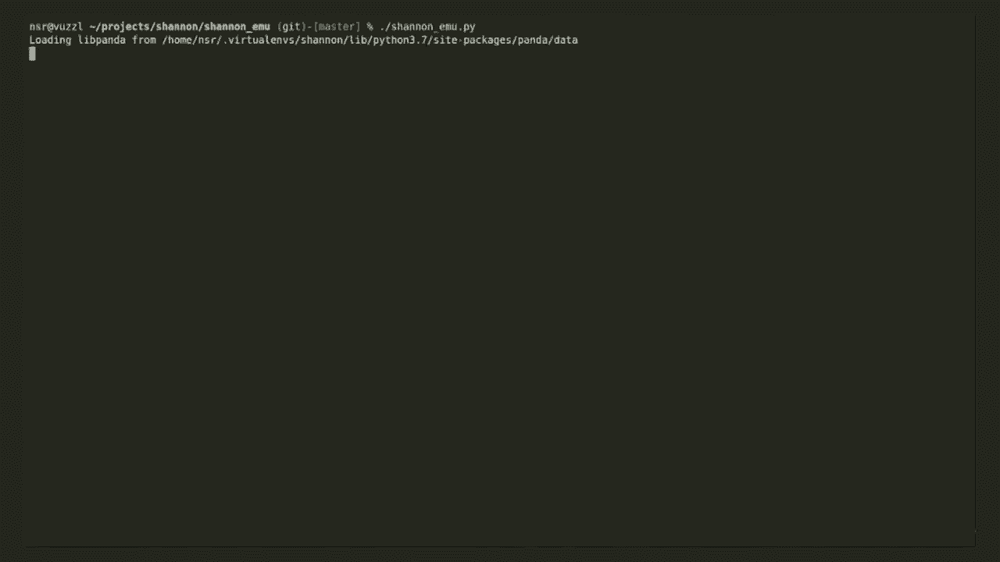
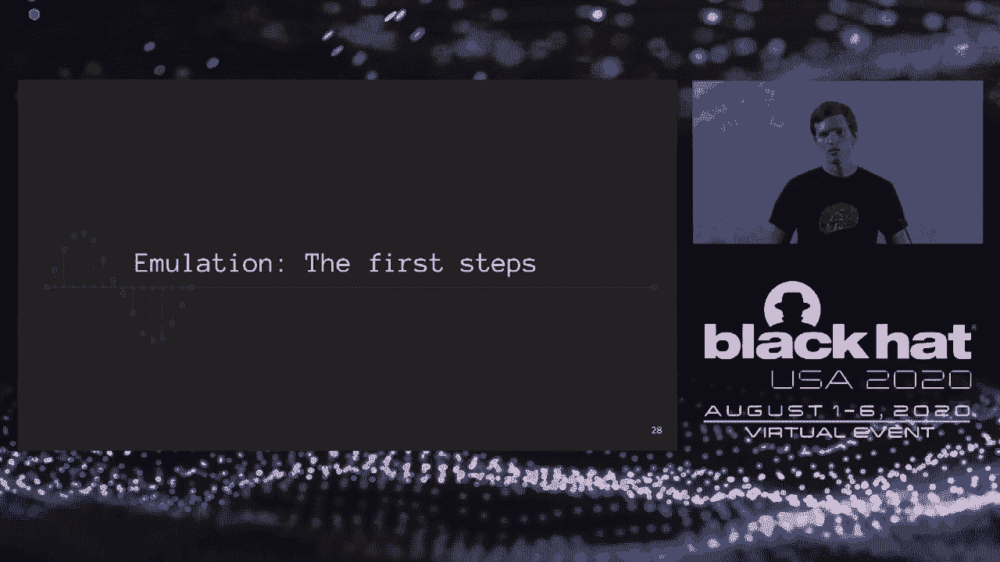
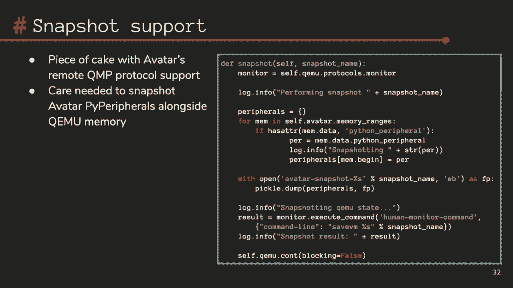
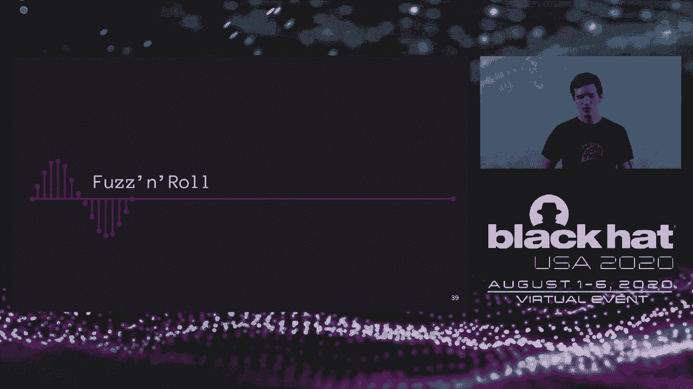
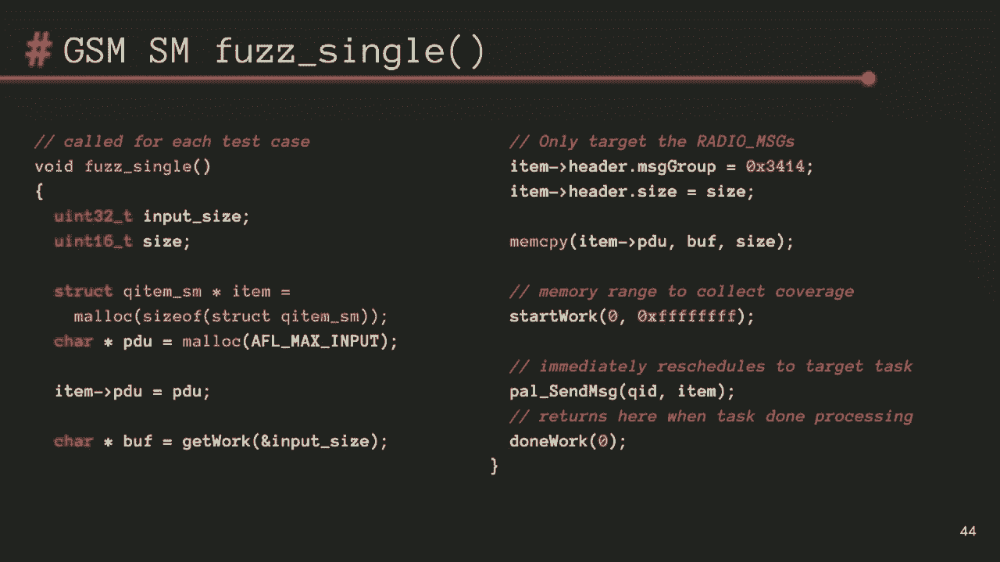
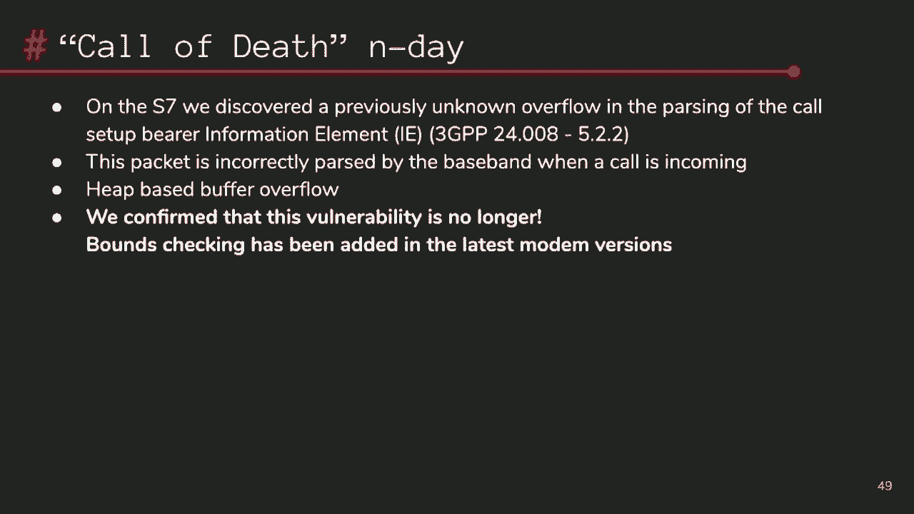
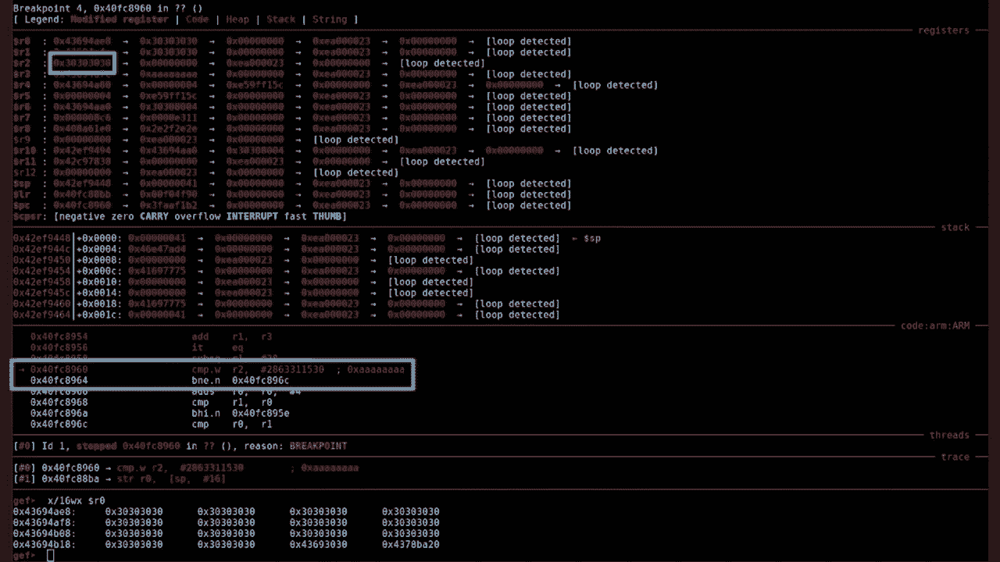

# P30：30 - Emulating Samsung's Baseband for Security Testing - 坤坤武特 - BV1g5411K7fe

## 概述

在本节课中，我们将学习如何模拟三星的基带进行安全测试。我们将了解基带的重要性、基带模拟器的构建以及如何使用模拟器发现安全漏洞。

## 基带介绍

**基带处理器**是执行2-5G蜂窝协议的专用设备。它允许您在没有Wi-Fi连接的情况下，在户外接收数据、通话、短信等。基带是智能手机的重要组成部分。

## 基带的重要性

基带具有许多攻击面，包括：

* **复杂的协议**：支持2-5G协议，这些协议非常复杂。
* **多种组件**：包括自定义DSP、ASM1编码器、自定义IP堆栈、语音和音频编解码器、X5和9解析、DNS解析等。
* **潜在的危害**：基带攻击可能具有破坏性，可以拦截通话、短信和数据，甚至可以尝试攻击应用处理器。

## 三星Shannen基带

本节课将重点关注三星Shannen基带，它存在于三星X系列智能手机中。它实现了2.3.5G协议，并使用ARM Cortex-R来维护其实时属性。

## Shannen EE模拟器

Shannen EE是一个用于Shannen基带的模拟环境。它可以直接执行固件，无需预处理，例如静态分析工具。它不需要物理设备，并且可以扩展到您拥有的任何核心数。

## 模拟器构建过程

1. **逆向工程固件**：从公开来源获取固件，并使用GEDRA进行逆向工程。
2. **选择工具**：选择Avatar 2作为Python框架，并使用KIMU作为底层目标。
3. **编写外围设备**：编写外围设备代码，例如启动UR。
4. **实现快照功能**：使用Avatar 2框架实现快照功能。
5. **使用Panda**：将KIMU迁移到Panda，以提高性能。
6. **模拟外围设备**：模拟外围设备，例如电源管理IC、时钟外围设备、DSP、SOC驱动程序等。
7. **集成AFL**：将AFL集成到RTOS中，并使用ModKit注入自定义任务。

## 发现漏洞

使用Shannen EE模拟器，研究人员发现了以下漏洞：

* **PDP网络异常崩溃**：通过重新发现Owok在Shannen Talk中提到的漏洞。
* **呼叫设置数据包溢出**：在呼叫设置数据包中使用BEAR能力字段，导致基带崩溃。

## 总结

本节课介绍了如何模拟三星的基带进行安全测试。我们学习了基带的重要性、基带模拟器的构建以及如何使用模拟器发现安全漏洞。Shannen EE模拟器为研究人员提供了一个强大的工具，可以用于发现基带中的安全漏洞。