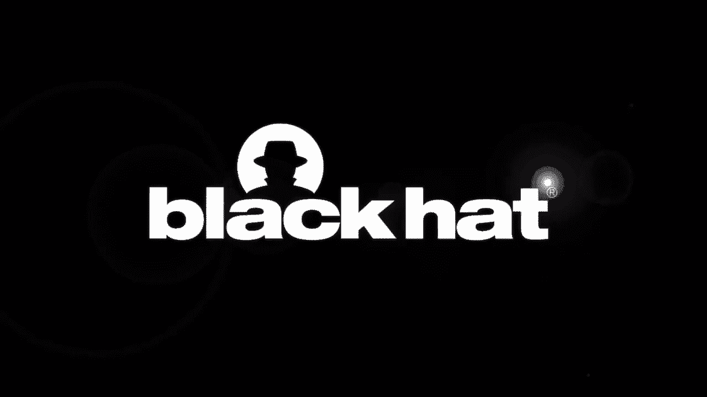
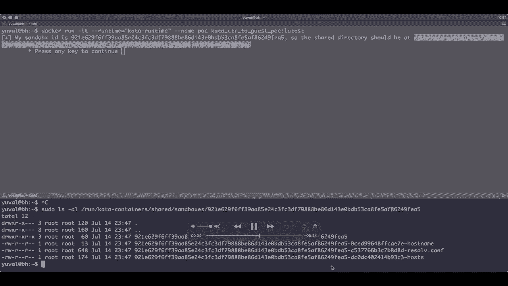
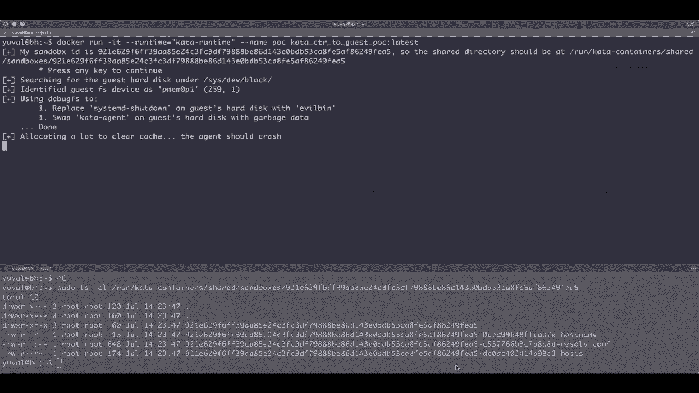
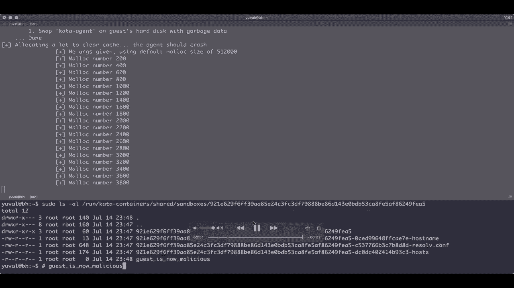
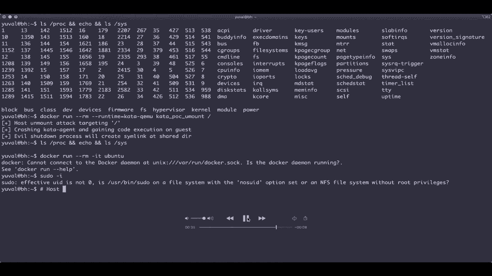
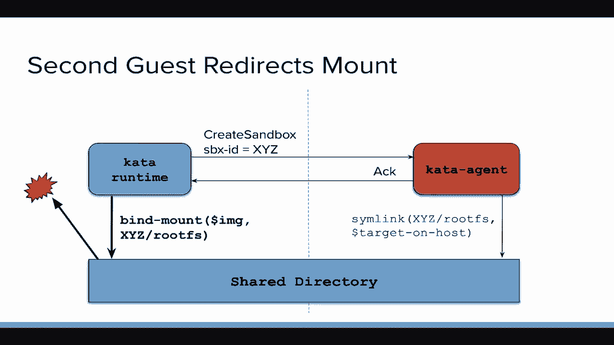
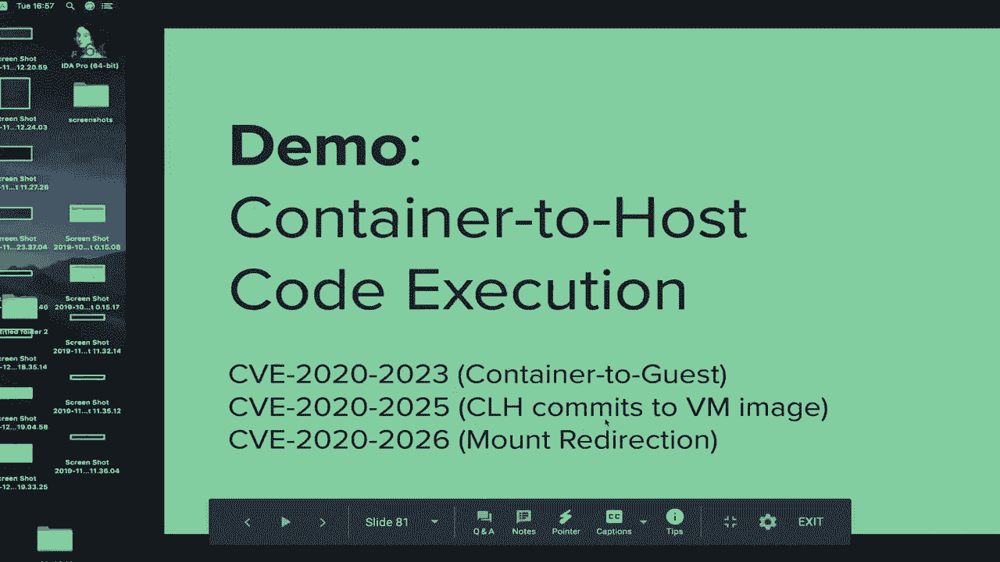

# P32：33 - Escaping Virtualized Containers - 坤坤武特 - BV1g5411K7fe

## 概述

在本节课中，我们将学习如何从虚拟化容器中逃逸。我们将探讨容器安全、Cata Containers 以及如何通过逃逸沙盒来学习容器安全。

## 容器和容器安全

### 容器

容器不是轻量级虚拟机。它们是受限制的进程，运行在单独的文件系统上。容器是 Linux 进程，通过应用一些隔离原语来运行。

**公式**：容器 = 进程 + 隔离原语

### 容器安全

容器安全的关键在于隔离和限制。命名空间定义了进程或容器可以看到的内容。能力是 Linux 中的特权。控制组（Cgroups）用于资源隔离和限制容器对主机资源的访问。

**公式**：容器安全 = 隔离 + 限制

## Cata Containers

Cata Containers 是一种用于运行虚拟化容器的沙盒解决方案。它将每个容器运行在虚拟机内部，从而提供两层隔离。

**公式**：Cata Containers = 容器 + 虚拟机

## 逃逸沙盒

### 逃逸容器

要逃逸容器，我们需要找到与 Cata Containers 设置相关的本地问题。我们注意到 Cata Containers 丢弃了几个 Cgroups，这可能导致容器对底层系统设备有更多访问权限。

**公式**：逃逸容器 = 利用设备访问漏洞

### 逃逸虚拟机

要逃逸虚拟机，我们可以利用共享目录中的漏洞。恶意容器可以修改共享目录中的文件，从而影响主机上的应用程序。

**公式**：逃逸虚拟机 = 利用共享目录漏洞

## 总结

在本节课中，我们一起学习了如何从虚拟化容器中逃逸。我们探讨了容器安全、Cata Containers 以及如何通过逃逸沙盒来学习容器安全。

**本节课中我们一起学习了**：

* 容器和容器安全
* Cata Containers
* 逃逸沙盒
* 容器安全最佳实践