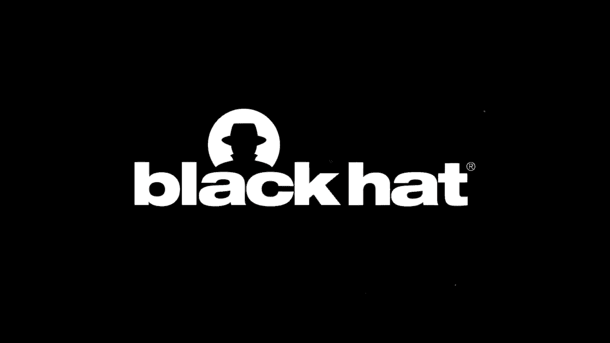

# P33：34 - Ruling StarCraft Game Spitefully -- Exploiting the Blind Spot of AI-Powered - 坤坤武特 - BV1g5411K7fe

## 教程：利用AI游戏盲点攻击星际争霸游戏

### 概述

在本节课中，我们将学习如何攻击由人工智能（AI）驱动的游戏模式，特别是以星际争霸II为例。

### 深度强化学习（DRL）简介

**深度学习（DL）**已成为最热门的机器学习技术。近年来，它主导了许多监督学习和无监督学习领域。在安全领域，它也优于传统方法，在恶意软件检测和包含检测方面表现出色。

**强化学习（RL）**是一种更强大的学习技术，可以处理更复杂的任务。最近，研究人员将IL与DL相结合，开发了不同的DIL技术。这些技术在许多决策任务中表现出非凡的性能，例如机器人控制、自动驾驶汽车、金融和商业管理。

**深度强化学习（DRL）**在游戏中，通过DIL学习的代理也可以成为专业或甚至一流的玩家。例如，DeepMind的AlphaGo和AlphaZero，以及连续速度的一流围棋人类玩家。最近，新闻显示，除了目标游戏外，DIL代理还可以成为不同类型扑克游戏（如德州扑克）的专业扑克游戏玩家。

### 训练游戏代理

**深度强化学习（DRL）**通常将代理建模为深度神经网络，称为策略网络。该网络将观察作为输入，并将相应的动作作为输出。

**策略梯度方法**用于解决网络参数。DRL算法通常使用另一个网络来近似价值函数。在算法的每次迭代中，它首先通过最小化近似误差来更新价值函数网络。然后，它们将策略网络更新为最大化价值函数。

### 攻击DRL游戏代理

**现有攻击**可以总结为两类：基于扰动的攻击和对抗性老化攻击。

**基于扰动的攻击**通过扰动观察或直接扰动策略网络的输出动作来强制策略网络输出一系列次优动作。

**对抗性老化攻击**更实用，因为它不需要攻击者入侵游戏系统，任何玩家都可以自由地与大师代理玩游戏。

### 我们的攻击方法

我们的攻击方法与之前介绍的对抗性攻击类似。为了克服现有攻击的局限性，我们提出了新的设计。

**目标**是训练一个代理，不仅能够最大化其奖励，还能够防止其对手同时收集更多奖励。换句话说，我们希望对抗性代理学会如何干扰或干扰其对手。

**具体方法**：

1. **直接改变对抗性学习目标**：不仅最大化自己的奖励，还同时最小化对手的奖励。
2. **让对抗性代理采取偏离受害者下一步动作的动作**。

### 评估结果

我们在一些静态游戏中评估了我们的攻击，并展示了我们的有趣发现。

**结论**：

1. 攻击者可以训练一个对抗性代理来击败AI游戏中的游戏代理。
2. 通过干扰受害者动作，对抗性代理可以利用受害者和游戏规则的漏洞，从而更有效地击败受害者。
3. 对抗性重训练并不总是成功。我们可能需要更先进的技术来保护游戏代理和大师代理。

### 总结

在本节课中，我们一起学习了如何攻击由人工智能（AI）驱动的游戏模式，特别是以星际争霸II为例。我们介绍了深度强化学习（DRL）的基本概念，以及如何训练和攻击DRL游戏代理。我们还讨论了我们的攻击方法，并展示了其在静态游戏中的评估结果。