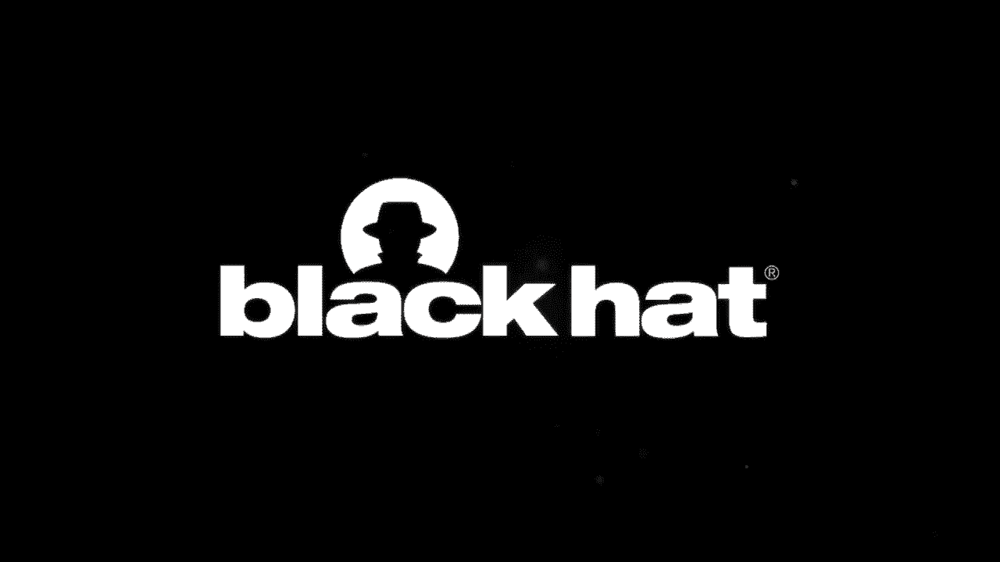
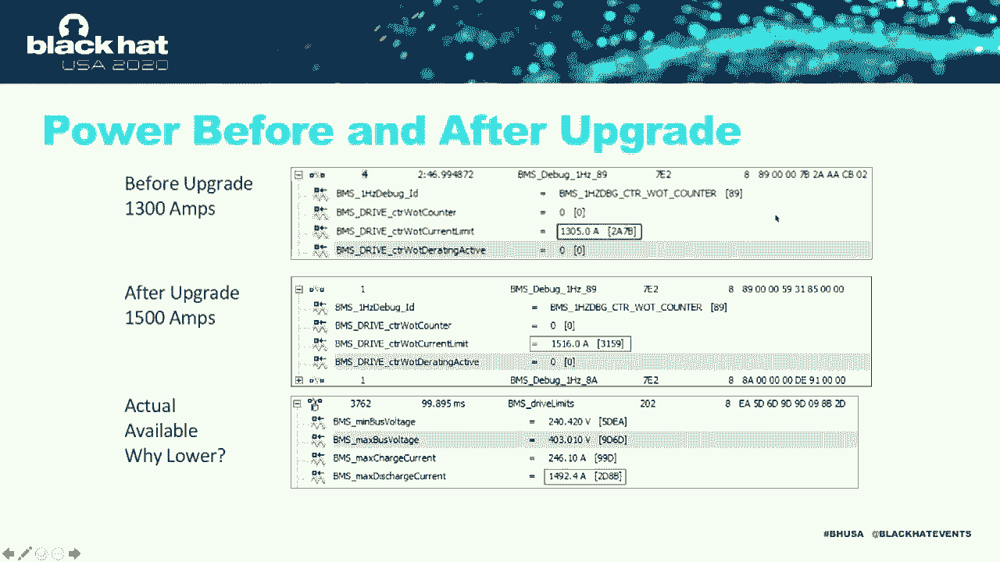

# P35：36 - 增强特斯拉电池管理系统以提升可用功率 - 坤坤武特 - BV1g5411K7fe

## 概述

在本节课中，我们将学习如何逆向工程特斯拉电池管理系统（BMS）以提升可用功率。我们将探讨BMS的架构、硬件和固件更改，以及如何通过修改BMS来提高特斯拉Model S的性能。

## BMS架构

特斯拉Model S的BMS是车辆性能的关键因素。以下是BMS的主要组件：

* **中央信息显示屏（CID）**：CID是黑客连接到车辆的中央点。
* **网关**：网关位于CID和车辆各个CAN总线之间，是一个安全组件。
* **动力总成CAN总线**：动力总成CAN总线包含BMS、驱动逆变器、充电单元和其他控制动力总成的元素。
* **电池管理系统（BMS）**：BMS是BMS的核心，负责监控和控制电池的充电和放电。
* **电池**：电池是BMS的能源来源。

## 硬件更改

为了提高Model S的性能，我们需要进行以下硬件更改：

* **更换接触器**：更换接触器以允许更大的电流通过电池。
* **更换熔断器**：更换熔断器以允许更大的电流通过电池。
* **修改分流器**：修改分流器以允许更大的电流通过电池。

## 固件更改

为了提高Model S的性能，我们需要进行以下固件更改：

* **更新BMS固件**：更新BMS固件以允许更大的电流通过电池。
* **更新网关固件**：更新网关固件以允许更大的电流通过电池。

## 工具和软件

为了进行逆向工程，我们需要以下工具和软件：

* **Python**：用于解密和反编译固件文件。
* **Uncompile6**：用于将Python代码反编译为源代码。
* **VehicleSpy**：用于分析CAN总线数据。
* **DBC文件**：用于定义CAN总线信号。
* **ODX文件**：用于定义诊断服务。

## 升级过程

以下是升级过程：

1. **准备车辆**：确保车辆电量低，并准备好所需的工具和材料。
2. **解压电池**：将电池从车辆中取出。
3. **进行硬件更改**：更换接触器、熔断器和修改分流器。
4. **更新固件**：更新BMS和网关固件。
5. **重新安装电池**：将电池重新安装到车辆中。
6. **测试车辆**：测试车辆以确保一切正常。

## 总结

在本节课中，我们一起学习了如何逆向工程特斯拉电池管理系统以提升可用功率。我们探讨了BMS的架构、硬件和固件更改，以及如何通过修改BMS来提高特斯拉Model S的性能。希望您对本节课的内容感到满意。