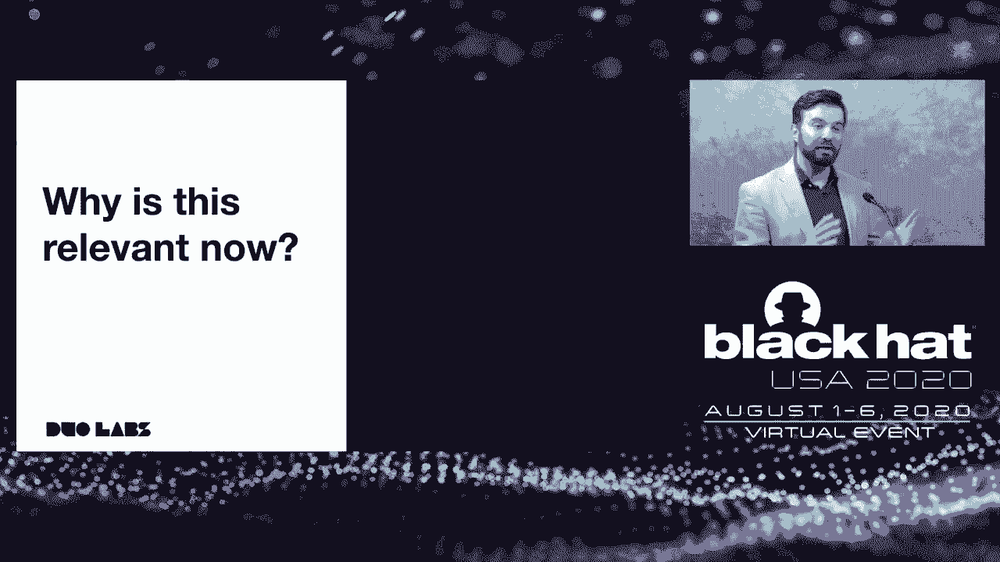
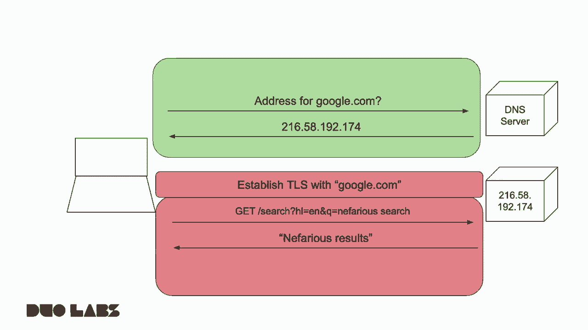
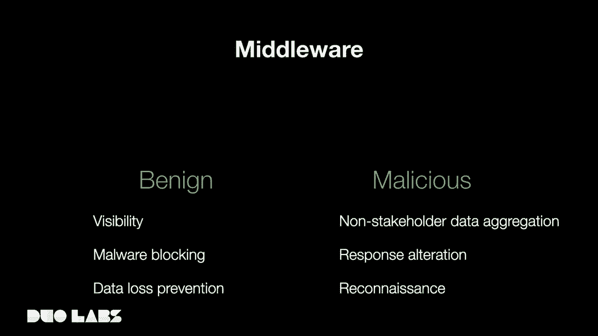
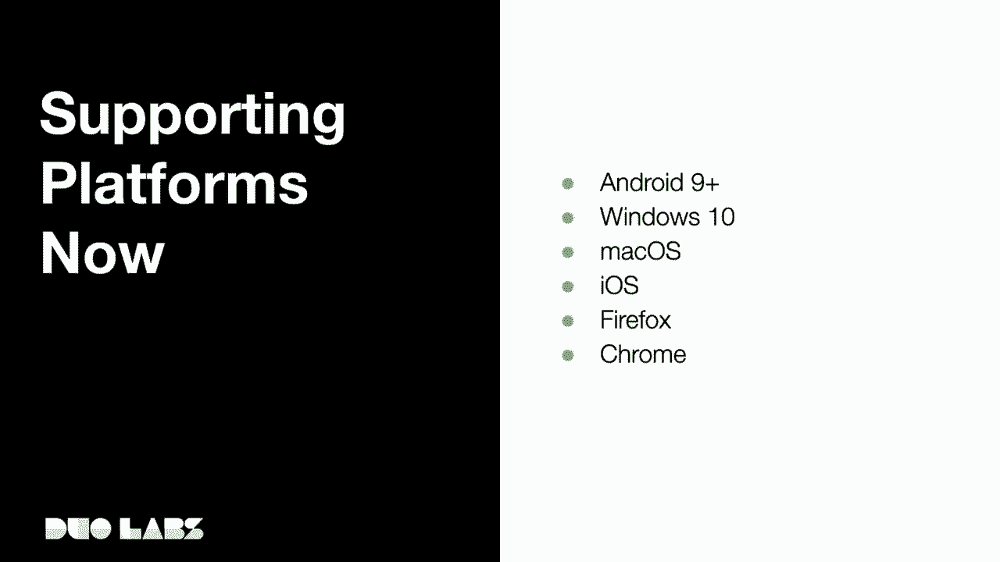

# P36：37 - Needing the DoH - The Ongoing Encryption and Centralization of DNS - 坤坤武特 - BV1g5411K7fe

 Hello。

 My name is Eldridge Alexander。 I'm going to be speaking to you today about the ongoing encryption and centralization。

 of DNS。 I currently work for Duo Security in a section called Duo Labs。

 So before I dive in to the ongoing encryption and centralization of DNS， I want to talk。

 about how we got from there to here。 Why this is a relevant topic today。

 So Paul Macapetris and John Post will create a DNS in 1983。

 This was made in an effort to replace the previous way of communicating host names across。

 the internet， which was distributing a hosts。txt file to every host on the internet。

 As the internet grew， this became unwieldy and cumbersome。

 So these two engineers wanted a way for people to be able to access hosts by name instead。

 of IP address without having to distribute a hosts。txt file across the entire internet。

 So they created DNS。 And in the beginning and up until very recently， it was unencrypted。

 And even today， the vast majority of it is unencrypted。 So why？

 Any new protocols or systems that we start working on today， it's generally something。

 that is considered very early on。 How are we going to secure this or how are we going to encrypt this？

 And the reason was， multi-fold， in the early days of the internet， security was not as。

 much of a major concern。 There were less hosts。 There were less complex threats。

 There were less actors on the internet。 Not only that， but as you can see from Dr。

 Maca Petras' quote here， "A distributed system， was already an uphill battle。

 convincing people to adopt it across the entire internet。"。

 So making it more easily adoptable was a crucial point of the creation of DNS。

 So why is this relevant now？ DNS was created in 1983， now 37 years later。

 Why is DNS encryption a relevant topic？ HTTP was invented in '89。

 started rolling out in the early '90s， and we started encrypting， HTTP into HTTPS much。

 much earlier。 So why has it taken us 37 years to go from an unencrypted to an encrypted protocol if。

 it's something that we need to do？ So this is where I'm going to start diving into some of the history of why this became。

 a relevant point of conversation。 So first I want to break down a simple web request from an average consumer。

 So this is a picture that you might see in the web in the early '90s。

 It's a diagram of what might happen on the web in the early '90s。

 So first the end point sends a DNS query to a DNS server。

 The DNS server responds with the IP address。 The end point then sends its HTTP get request to the web server by IP address。

 which then， gets the response。 So everything in the green box is sent in the clear。

 In the early '90s DNS was as it is today， by and large， unencrypted， and HTTP was just， HTTP。

 HTTP was not really on the scene yet。 So everything was in the clear。 A middleware。

 whether human or robot， malicious or benign， sitting in between the end point。

 and either of those servers would be able to read everything that crossed the connection。

 So this was one of the things that started out being widely adoptable， this being the， web in HTTP。

 started out being widely adoptable and adopted by people across the entire internet。 Not only that。

 but the web started absorbing other protocols into itself。

 So while other protocols still might exist， generally most people will access those protocols。

 through a web interface。 So a couple of examples are our email。

 Even though a lot of the email protocols still exist and a lot of email communication。

 still happens through protocols like SMTP， POP， things like that。

 Most end users today are going to be receiving and writing emails through a web client， even。

 if the back end of that web client is communicating using something other than HTTP。

 Chat communication protocols， XNPP， which is great， started being accessible through web。

 interfaces， whether through an aggregator like Mibo or through a particular provider's。

 implementation， such as Google Chat。 Transferring files。

 that's something that the protocol isn't even quite as relevant anymore。

 HTTP is still around and it's still used， but many people for transferring files to friends。

 and family and colleagues are using online data sharing tools such as Google Drive or， Dropbox。

 Even today， more and more protocols are being moved to the web。

 Video conferencing tends to happen if not always in web RTC tends to be broadly supported。

 across the major video chat platforms。 And even other protocols that do not have a web equivalent are quite often wrapped in。

 web sockets depending on implementation。 So in the beginning， we have this new protocol of HTTP。

 It's sent in the clear， the same as the DNS query。

 And it's so successful in the internet world that it starts absorbing other protocols into， itself。

 So let's fast forward to 2015 to 2020。 This is Google's transparency report。

 So you can see in the last five years， depending on platform， people have gone from accessing。

 sites from a little under 50% to over 90% on average accessing sites in HTTPS。

 So most things have been absorbed， most communications across the internet have been absorbed into。

 HTTP and HTTP has mostly shifted to HTTPS。 So again， these are broad trends。

 They're not indicative of everything happening on the internet， but broadly， this is a good。

 picture of what an average end point or an average user is going to be doing。

 So let's jump forward a little bit。 We've got this early 90s picture of a DNS request and then an HTTP request。

 As HTTP starts shifting to HTTPS， this is no longer all sent in the clear。 DNS stays in the clear。

 but HTTP shifts to an encrypted model。 So anyone sitting in the middle。

 human or robot is not able to intercept data aggregate or。

 manipulate the data passing in the HTTP connection to the web server。

 So this was one of the first things to go dark， so to speak。 And then some other things happened。

 One of the first was reverse proxies and cloud computing became more popular for delivering。

 services。 So in this example， the destination IP address was actually a pretty useful piece of information。

 If a person was sending a packet to an IP address， even if the contents of the packet。

 were encrypted， the IP address itself was a pretty useful bit of information。

 If the IP block was owned by， for example， Stanford University， you could probably make。

 a decent assumption that the person was going to a site owned or operated by Stanford University。

 As more and more sites and services moved to either cloud computing， for example， digital， ocean。

 rack space， Google cloud， Microsoft Azure， Amazon Web Services， or they used those， services or not。

 but protected them by CDN networks such as CloudFlare or Fastly。

 The amount of IP block owners that people were actually accessing became very narrow。

 Almost no matter what site folks are going to on the internet， they are going to be going。

 to an IP block owned by one of these small number of providers。

 Even if the end server is not actually hosted on those providers， for example， my personal。

 website hosted on a Raspberry Pi is out of my home， but the IP address you'll be hitting。

 is CloudFlare。 That's the reverse proxy in this diagram。 The web server is running on my home IP。

 but the only IP address you'll see is the one， owned by CloudFlare。

 So not a particularly useful piece of information， because while I could be going to my site。

 you can't see the contents。 I could very well be going to one of the many other properties behind those reverse proxies。

 So the IP address became less of a useful piece of information。

 The contents of HTTP was opaque to any middleware。

 The connection to the end web server is probably encrypted。 It is in the case of my site。

 but it doesn't really matter because the middleware is sitting。

 between the endpoint and the reverse proxy， not the reverse proxy and the web server， at。

 least for the purposes of this example。 So the reverse proxy is not just going to one site。

 it's going to many， many sites now。 So the IP address is no longer useful dated together。

 at least not extremely so in most， situations。 Now I want to go back a bit and correct a minor thing that I said earlier and explain。

 it a little bit more， because the IP address was actually useful information in the early。

 days of the internet and the early days of the web。

 The fact that someone knew the hostname was not that you were trying to go to was not。

 a particularly egregious oversharing of information。

 because there was a close to one to one mapping， between IP addresses and hosts in the early days of the web。

 So the TLS handshake that is used to establish the HTTPS connection sends the hostname， for。

 example， Google。com in the clear using a SNI， a server name indication。

 So this is sent in the clear before the HTTPS tunnel is established。

 So while the IP address was useful， this was not really a huge problem because you could。

 derive that data fairly accurately anyway by gathering data around the IP address。 Today。

 with the reverse proxies making that data particularly useless， the fact that it。

 is sent in the clear in the TLS handshake in SNI is actually a problem because it's。

 sharing data that is not easily inferble from any other place in the HTTP connection。 So TLS 1。

2 and predecessors do send this in the clear TLS 1。3， which is starting to see。

 wider and wider adoption is replacing this with an encrypted version。

 So the entire HTTPS connection， including the hostname sent in the handshake for TLS， is。

 now something that is completely opaque to middleware。

 So looking at middleware through the years， these are the things that it particularly found， useful。

 And again， middleware meaning human or robot malicious or benign could infer data about。

 you or manipulate data going to your end point by intercepting the DNS query， the destination。

 IP address， the contents of the HTTP connection itself or the SNI in the TLS handshake header。

 That was at the beginning of the web。 Today， most of this is going away or has gone。

 So the DNS query is the last relevant piece of information and establishing a web connection。

 that actually tells where the user is going。

 So why is DNS relevant now？ Why is DNS encryption relevant now 37 years later？

 It's basically the only thing left in establishing a web connection that is unencrypted and still。

 shares relevant information， namely the destination host。

 Now I want to take a small side tangent and talk about middleware。 I've been saying middleware。

 human or robot， benign or malicious。 This has been a continuous discussion point with my colleagues and my team and my friends。

 What is the concept of a benign middleware？ This was something that I personally struggled to really wrap my head around as a privacy。

 and security enthusiast。 I thought that， okay， hey， if you're going from A to B。

 then you should go from A to B， and nobody in the middle should be able to intercept it。

 I was trying to figure out what reconciliation or what reason there might be to have a proxy。

 that was actually a good reason to have it。 So I spoke with my friend Jordan Wright。

 who is my colleague and he gave me some really， good examples to contrast with the malicious examples that I had seen in my career。

 So these are pretty well one-to-one maps。 It's the same technologies being used for benign and malicious purposes。

 So the first one is visibility。 If you have a large corporate network or organizational network。

 you need to do effective， defense， be able to see what your endpoints are doing。

 what your users are doing。 Not just visibility， but if you're able to manipulate the traffic itself DNS or otherwise。

 malware blocking is a huge opportunity for middleware to be useful to organizations。 Not only that。

 but data loss prevention。 If you're able to monitor， establish。

 and even prevent in some cases DNS queries from， being responded to or being responded to accurately。

 then you were able to prevent data loss in， a lot of scenarios that you might not otherwise be able to。

 So now the equivalent technologies on the malicious side are non-stakeholder data aggregation。

 So what's visibility in an organization monitoring the DNS of their enterprise devices， accessing。

 enterprise networks with enterprise data for an end consumer using their laptop to access。

 consumer sites on the internet， that data aggregation is providing visibility， but it。

 is not providing any benefit to the stakeholder of either the content provider or the end user。

 Malware blocking is effectively just lying about DNS responses used to DNS request for。

 a hostname that is known to present malware to its users。

 Your enterprise middleware will lie and say the actual address of this site is 0。0。0。0 or。

 redirect you in some other mechanism to a non-malware site that can communicate with you。

 Response alteration in malicious ways can mean a few different things。

 The most common example is if you were on some internet providers and you go to a page。

 that does not have a DNS record or you attempt to go to one， what should happen according。

 to the standards and specifications is you should receive no response from your DNS server。

 or a non-resolvable response that your browser can then use to show this page is unavailable。

 What often happens is your return to response that redirects you to a page full of ads that。

 financially support the internet provider that you're already paying。

 So that is something that I personally would consider malicious。

 Not only that but reconnaissance if you're just sitting in the middle gathering data in， middleware。

 you can use that to launching more targeted attack as you learn more about， your targets。

 So the differences between benign and malicious are certainly somewhat opinionated。

 There are some people that will hold the opinion that any interception between points A and。

 B is inherently malicious because it's breaking the guarantees of encryption from one place。

 to another。 There are some people that say all of it is benign because it's on behest of the network。

 operator。 Most people I think come to some understanding approximately what I'm showing here which。

 is that some of these have benign purposes， some have malicious。

 So now I want to jump back to DNS so we know that in the last 37 years DNS has been broadly。

 unencrypted but it is now becoming a more relevant talking point because it is one of。

 the most relevant points to gather and manipulate data benignly or maliciously within points。

 So I want to talk about the new standards that are being proposed and adopted across the。

 industry today。 I put DNS crypt on here。 This is one that is a pretty good standard。

 The team has done really great work in making it but it's not one that I personally am seeing。

 broad adoption across multiple vendors in the industry in point or DNS server wise。

 So I wanted to highlight it here because it's pretty cool but it's not one that I'm going。

 to be spending a lot of time on today。 So I want to talk about DNS over TLS， DOT and DNS over HTTPS。

 DOH。 These are the ones that I'm seeing have broad adoption in the industry。

 So the old concerns of DNS are what I've highlighted about middleware。

 Now that we are encrypting it we are presenting new concerns because we have both this malicious。

 and this benign middleware and this benign middleware is affected。 So what are these DNS concerns？

 Well the first one is centralization， the second reduced visibility and the third DNS， in layer 7。

 That's the most unprecedented one that I want to spend a little time on。

 But first let's dive into centralization。 Now this is in my view a pragmatic reality of changing such a fundamental protocol on。

 the internet。 It's not something that's necessarily inherent to DOH or DOT。

 So as providers start enabling and supporting DOH and DOT because there's such a focus。

 on privacy and security in and outside the industry right now providers supporting these。

 new encrypted protocols are able to get a lot of sway and get a lot of support from end， users。

 So while there are lots and lots of DNS systems and servers out there that's the point of。

 a distributed system only a few providers in the early days of DOH and DOT were providing。

 encrypted DNS。 Really Google Cloudflare and Quad9 were some of the earliest to support these encrypted。

 protocols。 So out of the thousands of DNS servers on the internet if you wanted to use encrypted。

 DNS you were mostly relegated to a handful of providers。

 Now in my opinion they did fairly good things around privacy and security but it was a。

 centralization of what had previously been a distributed system or at least a centralization。

 for those that wanted to use encryption。 So this was more pragmatic reality not something inherently a problem with DOH and DOT but the。

 centralization of a distributed system is certainly seen as a problem by many but myself。

 certainly included。 So another concern is reduced visibility and this is something that applies mostly to。

 the benign middleware I was speaking about a few minutes ago。

 The ability of end users to send their DNS requests over DOT or DOH prevented the ability。

 for enterprises to monitor their DNS requests。 It prevented DNS redirection which is a really useful feature for places that are deploying。

 for instance IoT devices。 A common feature in network firewalls and other network security devices is the ability。

 to take an outgoing DNS request that for example is using a hard coded DNS destination and。

 redirect it to your corporately owned DNS server and send that response back to the。

 device transparently to the device。 So if you have a handful of IoT devices that are using their manufacturer's DNS server for。

 whatever reason and you want to block certain requests they're sending if the DNS is unencrypted。

 you can of course still do that even if they're sending their requests to a DNS server that。

 is not owned by you。 Also DNS is a control plane if you're attempting to block malware or restrict DNS queries that。

 respond with domains that you know to be bad then you can no longer do that if the DNS。

 is leaving your network in an encrypted fashion。 Now there are a couple of other mechanisms you could do in a lot of times if there's。

 a protocol that's providing problems with you you can just block the ports of that protocol。

 that will of course not stop someone from changing ports but it will stop the vast majority。

 of end users。 DOH makes this particularly problematic because you can't really block an HTTPS connection。

 wholesale nor could you probably effectively block an HTTPS connection to some of the most。

 major providers like Cloudflare and Google as blocking HTTPS connections to those destinations。

 would provide a lot of pain for many things other than DOH。

 And then the third major concern I want to talk about and this is the one that I personally。

 am most concerned about of the three is moving to the application layer。

 So as DOH and DOT has become more broadly adopted across the industry in privacy and。

 security circles it has not been as broadly adopted by the plethora of DNS servers that。

 are out there。 So slow inroads at operating system levels excuse me it's also not been broadly adopted。

 by operating systems such as Mac OS Windows。 So vendors that are very concerned about their end users privacy and have a consumer。

 centric world view and the most potent example here is Firefox caused these application developers。

 to bring in their DNS resolution from the operating system into the application itself。

 Now that's a tough trade off to make in my opinion for something that is consumer focused。

 on the current landscape it did make a decent amount of sense and was an okay trade off。

 There were new laws in various countries past that meant that providers intercepting DNS。

 queries were able to aggregate and sell personalized data。

 So for an organization that is mostly concerned with end consumers and mostly concerned with。

 protecting the privacy of those consumers if the operating system was not going to enable。

 this new privacy protecting measure then bringing it into the application layer was a compromise。

 that made sense。 However this does mean that the DNS server issued by the DHCP server is not going to。

 be respected by the application。 So this is a problem for all of the aforementioned reasons as well as making a new point where。

 data can leave the network or DOH can leave the network particularly possibly transparently。

 to network operators。 So while this was a major privacy win for consumers in my opinion this was a security loss for network。

 operators that were trying to operate but nine middleware。 So what are the next steps？

 What are the next steps that we can take as an industry to address these concerns get。

 the benefits of adding encryption to a very important protocol on the internet while minimizing。

 the problems and the concerns with that as much as possible。

 One of the first is just integrating more operating system support and more provider support across。

 the entire industry。 This will mitigate centralization directly。

 Again centralization is a pragmatic reality so if more and more systems and services are。

 supporting it centralization will no longer be a concern。

 Reduced visibility will be another one if your end points support dot and doh natively。

 and your middleware and services support dot and doh natively then reduced visibility。

 won't be a problem because you'll have visibility in the same places that you use to。

 What these two will not directly mitigate is the pulling of DNS into the application， layer。

 However it will disincentivize browser vendors and other software vendors from pulling it。

 into the application layer at least with such a pingonated defaults as they can rely on。

 other pieces in the stack to do what they consider to be the right decision。

 So to that end I'm going to be demoing my software that I'm calling Vimes and so I'm。

 going to drop into a demo here first to just give an explanation what this is meant to。

 do is unlike some of the DNS and encryption proxies that exist on the market today that。

 send to those centralized providers this tool will look at the DNS server that your system。

 is using by default almost always on an endpoint because you have received that from a DHCP， lease。

 It will test it to see if it supports DNS encryption and then opportunistically upgrade。

 your DNS connection but still use the DNS server that your system is wanting to use。

 So I'm going to jump into the video here。 So first off I'll draw your attention to this is a pretty simple and not super flashy demo。

 which is I think good if you're having flashy demos around DNS something's probably horribly， wrong。

 So this little green bubble here is where we're going to focus on it's going to change， colors。

 Let's have a look。 So you can see here that I'm connected to the Xfinity Wi-Fi hotspot and so I'm using。

 Comcast's DNS server。 It's 75。75。75。75。 Now I'm going to go to oh sorry about that。

 So I'll go ahead and explain what the next part is going to be。

 So I'm on Xfinity Wi-Fi and I'm going to go to 1。1。1。1/help which is CloudFlare's DNS。

 status page for how you're connected to their DNS。 And so when you show that here。

 I'll pause the video here you can see that it's showing， that I am not connected to CloudFlare's 1。

1。1 DNS service and I'm also not using encryption， to their service because I'm not connected to it at all。

 So you can see that the Vimes icon in the system tray there is red indicating that I。

 am not using a DNS server that supports DNS encryption。

 I should also make a side note and say that at the time the video is recorded that was。

 the case by the time you're watching this video I believe Comcast will actually support。

 DNS encryption due to a recent announcement。 But let's jump back in here。

 I'm going to switch to my Eldridge guest network which issues 1。1。1。1 as the DNS server via。

 DHCP lease。 So what's going to happen is Vimes is going to let the Wi-Fi connection happen and then。

 run a test and you'll see that Vimes has shifted to a yellow indicator。

 What this means is that you're using a DNS server that supports DOT or DOH but your operating。

 system is not taking advantage of that which is the case as I mentioned earlier pretty。

 much every operating system on the market today。 Desktop ones。

 So what we'll do is we'll refresh this status page and you can see that we are connected， to 1。1。1。

1 but still not using any of the encrypted protocols。

 So now what you can do is just click the Vimes icon that is going to do a couple of things。

 to enable encrypted DNS which I'll dive into in a second here but we'll refresh this page。

 again and you can see that the Vimes icon is turned green to show that we are using encrypted， DNS。

 We are connected still to 1。1。1。1 so we are using the DNS server issued by the DHCP lease。

 but we are using DNS over TLS。 So what Vimes is doing in the background there is it's spinning up a core DNS server。

 locally on the machine。 Core DNS is a pretty efficient DNS system written in GoLang used in Kubernetes so it's。

 spinning that up and redirecting all DNS queries to it which is then wrapping in DNS over TLS。

 and sending to the original destination TLS DNS server。 Cool。

 And that will be open sourced later today if not already by the time you are watching， this video。

 So I want to list a few updates that have happened since I submitted and prepared this。

 talk。 So when I submitted this talk about two months ago if I'm remembering correctly the only。

 platforms that natively supported DOT or DOH was Android 9 and above which was a minority。

 of the install base of Android。 In the last I believe four weeks support or announced support has happened for all of。

 these things。 So Android 9， Windows 10， Mac OS， iOS， Firefox and Chrome。

 So while Vimes will be useful until these move their native implementations to stable。

 and it will be useful for places that can't necessarily upgrade to the latest versions。

 And in the coming months you will be able to do this natively in your operating system。

 rather than relying on an add-on。 Also I did want to highlight this is not a comprehensive list but other tools。

 services， and systems in the industry that are supporting DNS over TLS and DNS over HTTPS。

 Coral has been supporting DOH for a while now。 Comcast and Cox have now announced that they are going to support either DOH。

 DOT or both。 Hurricane Electric， Cisco Umbrella， Core DNS which is what I'm using in Vimes and Quad。

 9 are supporting DOH and DOT。

 So let's wrap up and kind of hit my conclusions here。

 So DOT and DOH remove some of the concerns around malicious middleware， added some concerns。

 around benign middleware。 These new concerns are not necessarily entirely new but they're a move of where this functionality。

 where this benign monitoring and manipulation has to happen since it can't happen transparently。

 in the middle anymore。 And the benefits in my opinion of DOT and DOH can be realized without sacrificing the control。

 that benign middleware operators have as long as the legacy approaches are modified and adapted。

 So that was the ongoing encryption and centralization of DNS。 Again。

 I'm Eldridge Alexander with DOH security and so I am now going to take questions。

 This is video me and Live Me will be taking the questions so video me handing off to Live。

 Me and take it away。 Thanks， video me。 So I'm going to go through the chat here。

 Feel free to post some more questions as they occur to you but I'm going to go through。

 several of our even posted。 So first from Jim Reed。

 what challenges does DOH mean for ISPs and enterprises that currently， provide DNS services？

 What could or should be done about that？ So I saw you posted that earlier in the talk so I hope I touched on it a bit but the challenges。

 I see primarily for ISPs and enterprises are those using DNS as a control plane being。

 unable to gain visibility or apply security policies using DNS as a control plane。

 Unless they get all of their endpoints to use encrypted DNS protocols as well as upgrade。

 all of their servers。 If both the endpoints and the servers are using new encrypted DNS then the challenges are。

 pretty much non-existent for the enterprises。 But become very minimal for the enterprises。 ISPs。

 Kind of the same deal if the ISP is supporting encrypted DNS and the user endpoints are then。

 same deal。 The problem you're going to run into here is if ISPs are running for instance interception。

 or security policies on plain text DNS that's going to a DNS server that's not provided。

 by the ISP but the ISP can sit in the middle and change that。

 I haven't really seen that in the wild。 The closest I've seen is if you're on AT&T U-verse and you go to what site doesn't exist instead。

 of them returning back a DNS no record exists there that will redirect you to an AT&T ad site。

 So as long as both the endpoints and servers are supported I'm not seeing a whole lot of。

 challenges for enterprises that want support it。 The challenges of course as I think you touched on a later question as applications like Firefox。

 and even Chrome start to support it natively that DNS might be happening that they're not。

 even aware of because it's going over DOH。 So I'll go through the other questions but I'll touch on that in a second here。

 Next question also from Jim。 What's the privacy when for users of all their DNS queries that's probably a bit too productive？

 My hope and one of the reasons I wanted to talk about some of this stuff here is the。

 centralization is not an inherent property of DOH or DOT。 It's not even really a practical reality。

 It's just a bunch of big providers Google quad nine cloud flare supporting the early。

 on and so anyone wanting to use encrypted DNS was centralized on those providers。

 As the protocols become more supportive and as I mentioned in my update slide it's being。

 supported by Windows and the insider right now and Apple announced it for the next versions。

 of Mac OS and iOS Comcast and Cox are announcing it。

 Curl and other open source tools are starting to support it。

 We're hopefully going to see greater dispersion so that we'll end up with something very similar。

 to the original distributed system just with point to point encryption。

 So but yeah you're absolutely correct。 If that doesn't play out like I'm anticipating if it really does state that only a few servers。

 and only a few service providers are supporting this then yeah we absolutely will not have。

 a inherent privacy win。 Obviously there's the potential for a privacy win if we have a bunch of these distributed。

 systems that are behaving viciously when moved to a few central providers that are behaving。

 but I'm late but that is more optimistic than I'm willing to commit to。

 So from James Kennedy I hope I'm saying that right。

 What about aggregation and manipulation by the DOTD which providers effective monopolies？

 I think that's a similar question there are lots of advantages in having distributed servers。

 and so I think if we end up with the reality of just a few providers that have manipulated。

 the environment by supporting DOTDOT early that's going to be problematic。

 Like I said I think Google and Cloudflare and Quad9 have been doing a good job so far。

 but I think you don't want to concentrate power to the handful of a few service providers。

 in what's an inherently distributed system。 So yeah absolutely if we start to consolidate more and more of those service providers that's。

 a problem。 I don't think that having a plurality of D&S requests on the network is a problem as long。

 as there are enough alternatives out there and those alternative support encryption。

 The thing that I think would be very bad is if your options are either using unencrypted。

 service that allegedly protects your privacy or using a encrypted service that probably。

 doesn't because then you're going to get into all of the privacy concerns around okay maybe。

 the D&S provider you're using is fine but it's unencrypted and you're sending your connections。

 to your Comcast or AT&T or another provider that so now you're expanding your attack service。

 your privacy attack service。 Let's see Gregory has standard internet protocols been updated to allow for encrypted D&S。

 I don't know that I quite understand your question there sorry you want to provide clarity。

 a little bit I'll try and speak to it。 By standard internet protocols yeah I'm sorry I'm not sure if you're speaking to like TCP。

 or UDP they both of course one thing I didn't really touch on the talk is D&S was primarily。

 over UDP unless the response was too big。 DoT and DOHR are inherently mostly TCP based protocols。

 Of course it's conceivable that DOH would eventually move to quick which is a UDP based。

 protocol since HTTP3 is going to be over quick but that's sorry I'm going off on a tangent。

 so yeah but it's all the actual query itself is going to go over either TCP or UDP and the。

 upper level protocol is going to be either TLS or HTTPS so yeah and then of course any。

 other application in the stack is just going to get the response as it would normally so。

 yes as I think the answer to your question but if I want to provide clarity I'll pick。

 that up as I go down the list here。 From Narendra how is the PKI working with HTTPS TLS with doing the initial connection to DNS。

 server without the host name for the certificate。 So you do need to provide a hosting when you're configuring those for the first time。

 There's some options of course for major providers you'll be able to reconcile the IP address。

 back to the host relatively easily。 If you are configuring the list of providers then yeah you actually will have to configure。

 the host name manually which you'll see if you configure either DOT and Android 9+ or。

 if you configure DOH in Firefox you'll see you have to put a host name。

 DOH looks likely to bring about the consolidation sorry from Jim again DOH looks likely to bring。

 about the consolidation and aggregation of DNS servers into a few number of players chosen。

 by browser vendors and killer apps why do you seem to disagree with that opinion is。

 the centralization healthy for both user privacy choice and market competition。

 It's absolutely not healthy but I do disagree with that opinion。

 I think that it had an early consolidation effect because there are so few people on。

 the market that supported it and there were so few people on the market that supported。

 it because it didn't work on Windows， Mac， Android unless you were on version 9+ which。

 was a small or iOS so I think as operating systems start supporting you'll start to see。

 vendors and providers and less major DNS providers provide it。

 I've got I'm scrolling through about 45 seconds left。

 Alright I am coming up on time and I don't think I can speak to any of these questions。

 effectively in 20 seconds I will stick around the chat for a few minutes afterwards and try。

 and speak to them as best I can feel free to follow them there。

 I also have open DMs on Twitter or feel free to reach out to me at eldridgeaduo。com or， gift@sisco。

com。 [ Silence ]。