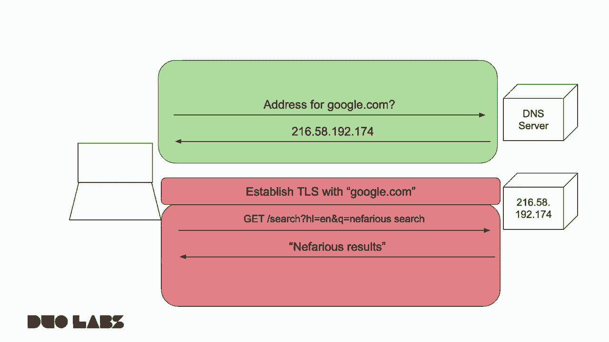
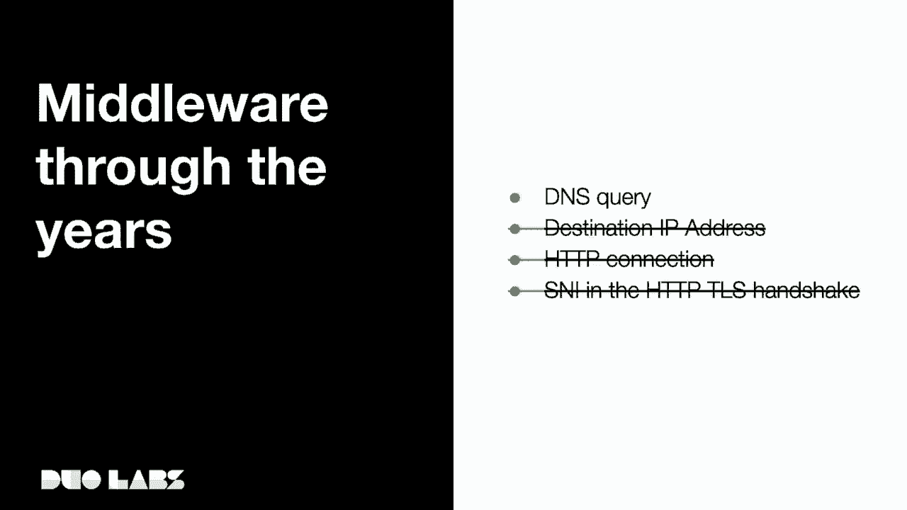
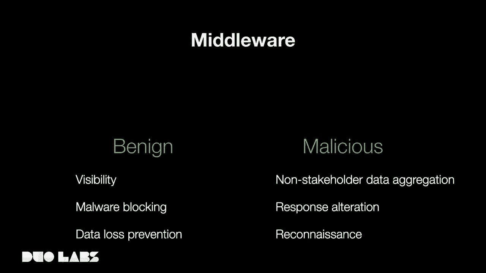
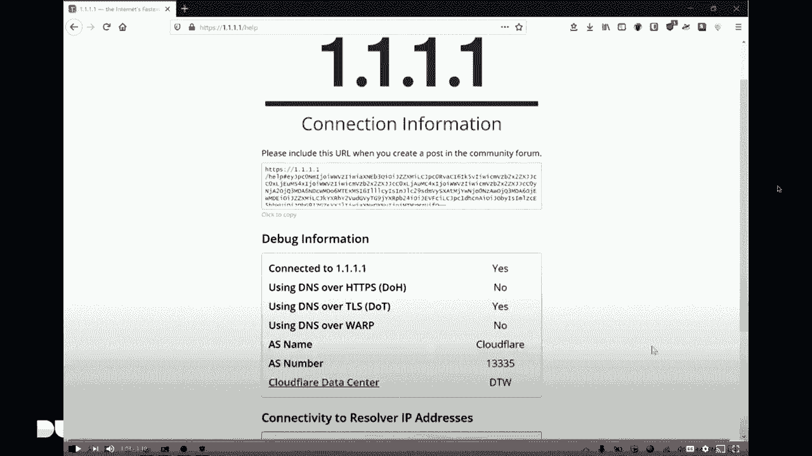

# P36：37 - 需要DNS加密 - DNS的持续加密和集中化 - 坤坤武特 - BV1g5411K7fe

## 概述

在本节课中，我们将探讨DNS的持续加密和集中化问题。我们将了解DNS的历史、加密的重要性以及当前面临的挑战。

## DNS的历史

在1983年，Paul Macapetris和John Post创建了DNS，以替代之前在互联网上通过分发hosts.txt文件来通信主机名的做法。随着互联网的快速发展，这种方法变得难以管理。

## 加密的重要性

随着互联网的发展，安全问题变得越来越重要。然而，DNS在很长的一段时间内都是未加密的，这使得中间人攻击成为可能。随着HTTP逐渐转向HTTPS，加密变得越来越重要。

## DNS加密的挑战

尽管DNS加密变得越来越重要，但仍然存在一些挑战：

* **集中化**：随着越来越多的服务提供商支持加密DNS，集中化成为一个问题。
* **可见性降低**：加密DNS使得企业难以监控其DNS请求。
* **DNS进入应用层**：一些浏览器和应用程序将DNS解析从操作系统转移到应用层，这可能导致安全问题。

## 解决方案

为了解决这些问题，我们可以采取以下措施：

* **增加操作系统和提供商的支持**：这将有助于减少集中化。
* **使用Vimes等工具**：这些工具可以帮助用户启用加密DNS。
* **改进PKI**：这将有助于解决证书问题。

## 总结

在本节课中，我们一起学习了DNS的持续加密和集中化问题。我们了解了DNS的历史、加密的重要性以及当前面临的挑战。通过采取适当的措施，我们可以确保DNS的安全性和可靠性。