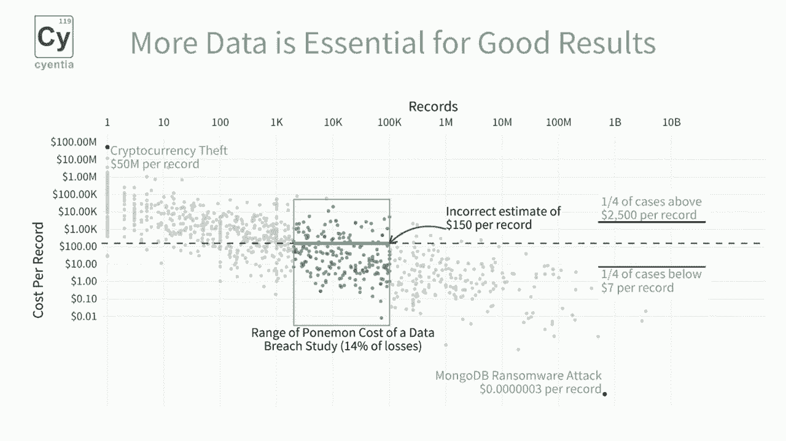
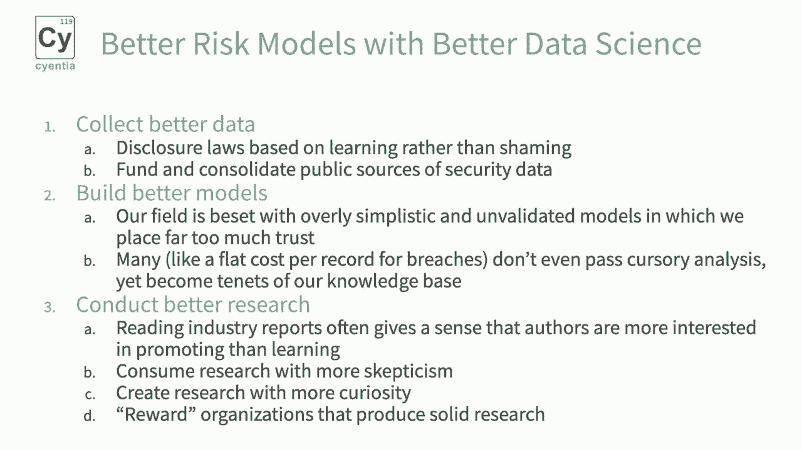

# P37：38 - 政策影响下的错误网络安全风险模型及其修复方法 - 坤坤武特 - BV1g5411K7fe

## 概述

在本节课中，我们将探讨错误网络安全风险模型的政策影响以及如何修复它们。

## 错误风险模型的例子

以下是两个关于错误风险模型的例子：

1. **小公司遭受网络攻击后六个月内倒闭的比例高达60%**。 这个数据可能被高估，因为实际数据显示，虽然小公司在遭受网络攻击后可能会遭受不成比例的影响，但并没有证据表明60%的小公司会在遭受攻击后倒闭。
2. **云配置错误导致公司损失近5万亿美元**。 这个数据可能被高估，因为实际数据显示，使用每条记录150美元的成本来估计损失是不准确的。

## 修复方法

为了修复这些错误的风险模型，我们可以采取以下步骤：

1. **收集更好的数据**： 通过建立类似于国家交通安全委员会的机构来调查网络事故，并从实际事故和接近事故中学习。
2. **建立更好的模型**： 使用更复杂的数据科学方法来建立更准确的风险模型。
3. **进行更好的研究**： 鼓励公司进行更多基于学习的研究，并奖励那些生产高质量研究的企业。

## 总结

本节课中，我们探讨了错误网络安全风险模型的政策影响以及如何修复它们。通过收集更好的数据、建立更好的模型和进行更好的研究，我们可以创建更准确的风险模型，从而做出更好的政策决策。