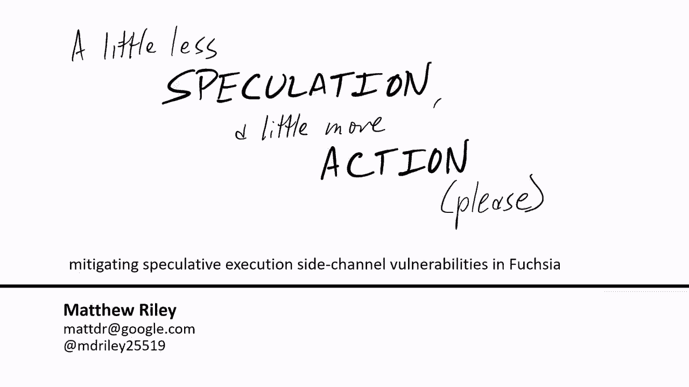

# P38：39 - A Little Less Speculation, a Little More Action - Deep Dive into Fuchsia's - 坤坤武特 - BV1g5411K7fe

## 概述

在本节课中，我们将深入了解Fuchsia操作系统如何缓解推测执行旁路漏洞。我们将探讨各种漏洞及其修复方法，并介绍SafeSide项目，该项目旨在帮助操作系统开发者构建和维护可靠的缓解措施。

## Fuchsia操作系统简介

Fuchsia是一个由Google开发的新开源操作系统，它运行在64位x86和ARM架构上，并基于名为Zircon的微内核。Zircon的驱动程序作为用户空间进程运行，而不是在内核模式下。除了基于进程的多任务处理外，Zircon还实现了一个虚拟机管理程序，以利用硬件虚拟化运行虚拟机。

## CPU概念

CPU的职责是管理一些架构状态，例如寄存器和内存的内容，并根据一系列指令更新该状态。一些指令很慢，例如需要访问RAM的内存访问。为了隐藏这种延迟，CPU会提前读取，并将大量即将执行的指令放入重排序缓冲区。CPU会确定这些在途指令之间的依赖关系，并安排它们在输入准备好后立即运行。已执行完成的指令将逐个退役，将其更改提交回架构状态。

## 推测执行和旁路漏洞

推测执行是一种优化技术，它允许CPU在分支预测的基础上提前执行指令。然而，这种技术也引入了旁路漏洞，即系统无意中泄露信息，因为其核心抽象之外的细节。

## Meltdown攻击

Meltdown攻击允许用户进程导致CPU执行对内核内存的推测性加载，然后通过缓存旁路泄露该值，以便用户进程可以读取。这打破了用户和内核模式之间的边界。

## Rett to spec攻击

Rett to spec攻击使用返回栈缓冲区（RSB），这是一个记住函数调用来源的预测器，以便在遇到返回时执行。当发生上下文切换时，RSB可能会变得不平衡，这可能导致攻击者利用该漏洞。

## Spectre Variant 2攻击

Spectre Variant 2攻击利用间接分支预测器，允许攻击者将推测执行引导到内核中的任意地址，从而泄露内存。

## L1 Terminal Fault (L1TF)攻击

L1TF攻击利用地址转换过程中的漏洞，允许攻击者访问L1数据缓存中的数据，从而泄露敏感信息。

## Microarchitectural Data Sampling (MDS)攻击

MDS攻击利用CPU内部不同临时缓冲区中的漏洞，允许攻击者访问敏感信息。

## Spectre Variant 1攻击

Spectre Variant 1攻击针对分支预测本身，允许攻击者利用分支预测器的行为来泄露敏感信息。

## SafeSide项目

SafeSide是一个开源项目，旨在帮助操作系统开发者构建和维护可靠的缓解措施。它提供了一套程序，用于演示微架构行为，并可用于测试旁路缓解措施。

## 总结

在本节课中，我们了解了Fuchsia操作系统如何缓解推测执行旁路漏洞。我们探讨了各种漏洞及其修复方法，并介绍了SafeSide项目，该项目旨在帮助操作系统开发者构建和维护可靠的缓解措施。