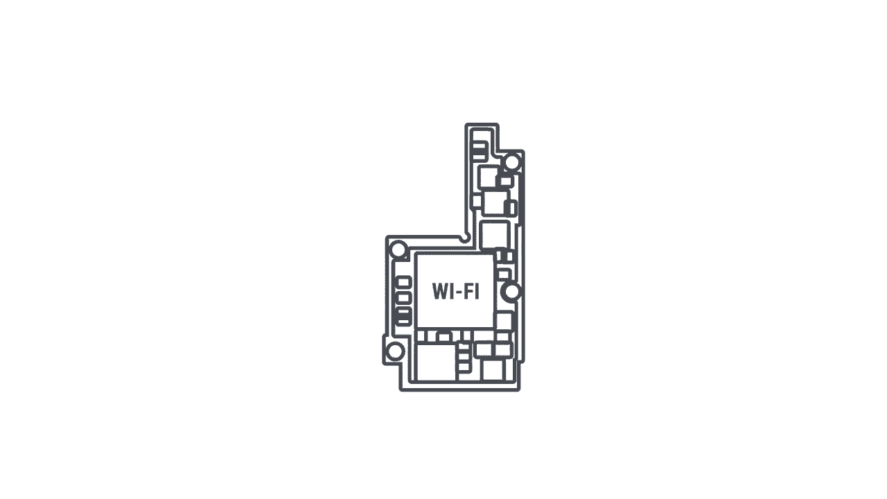
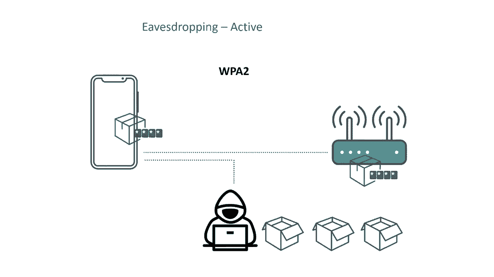
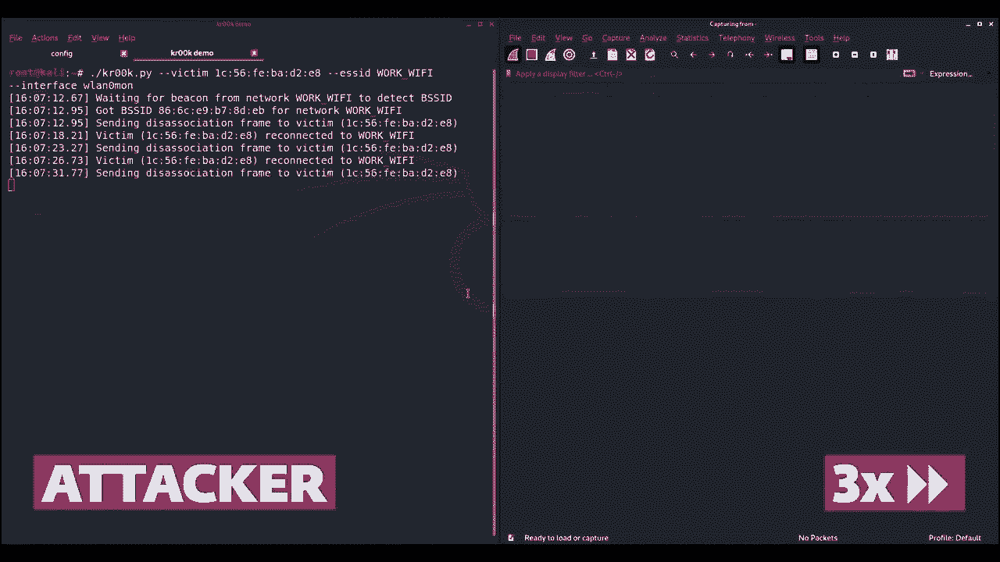
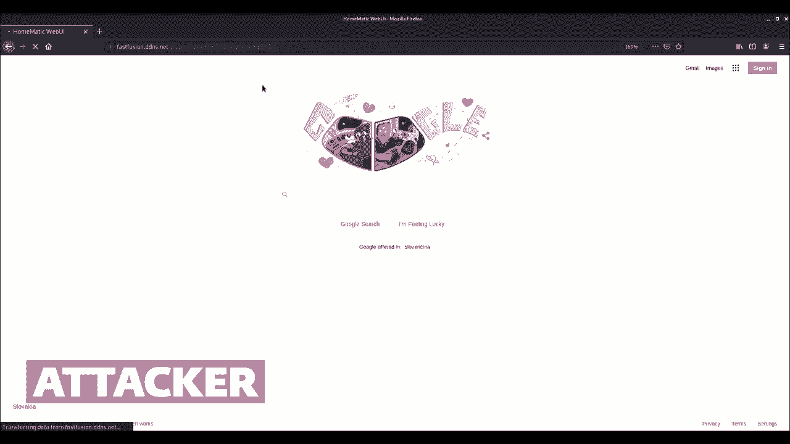
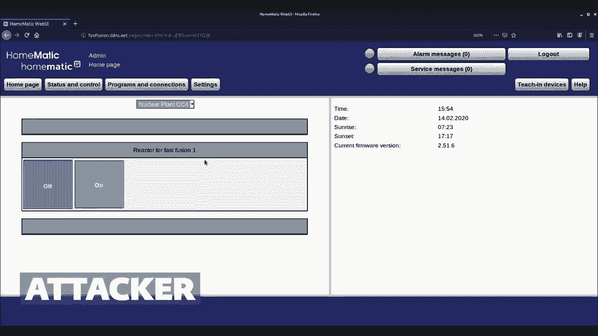
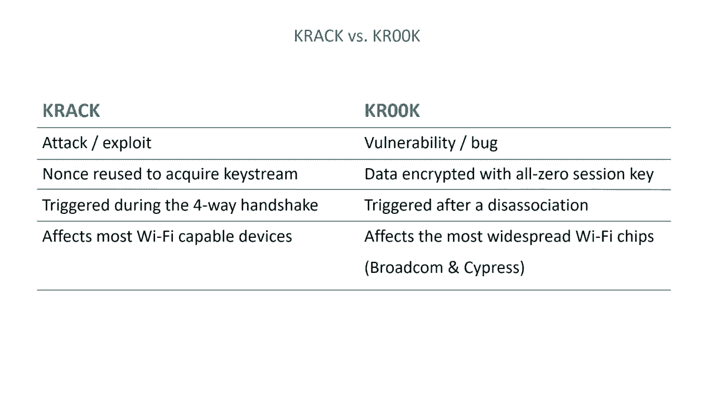
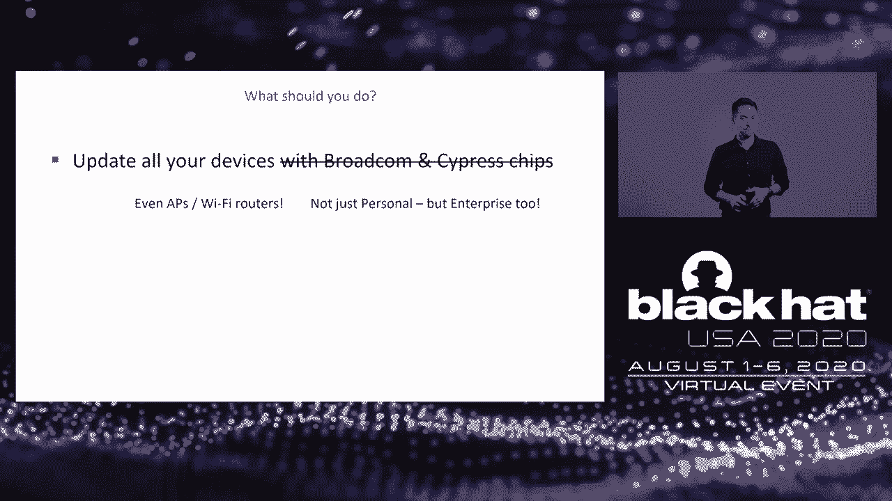

# P39：40 - Kr00k - 严重漏洞影响数十亿Wi-Fi设备加密 - 坤坤武特 - BV1g5411K7fe

## 概述
在本节课中，我们将学习Kr00k漏洞，这是一个严重的安全漏洞，影响了数十亿Wi-Fi设备的加密。

## 1. 受影响的用户
**Do we have any iPhone or MacBook users listening? What about Samsung Galaxy， Amazon Echo or Raspberry Pi users?**

## 2. Kr00k漏洞简介
**Now what if I told you that anyone could break into your encrypted Wi-Fi communication?**

Kr00k漏洞允许攻击者破解WPA2加密的Wi-Fi通信，即使没有TLS在应用层。

## 3. ESET的研究
**That was the discovery of ESET's IoT research team that's dedicated to finding vulnerabilities in popular devices used at home and in the enterprise.**

ESET的研究团队发现了这个漏洞，并进行了深入研究。

## 4. Wi-Fi安全基础
**Now before we get into the specifics of the vulnerability and its impact, let's quickly go over some Wi-Fi security basics which are needed to understand how Kr00k works.**

### 4.1 Wi-Fi连接和断开连接
**The first thing that happens when you connect your device to an access point is called the association, basically a connection.**

### 4.2 前向握手机会
**The fore-way handshake establishes secure wireless communication.**

### 4.3 WPA2加密
**Now I'm going to simplify the scheme. not going into the details of counter mode and, CBC Mac. Here we have some plaintext data that we are going to transmit and needs to be encrypted.**

## 5. Kr00k漏洞详解
**What is CRC, aka CVE 2019 15126? This is a typical Wi-Fi connection between a device and an access point secured by the WPA2 protocol.**

### 5.1 攻击过程
**The crook vulnerability breaks that. Here's an example of how an attacker could exploit the bug.**

### 5.2 漏洞原因
**Well to answer that, let's rewind and take a closer look under the hood of that vulnerable device.**

## 6. 漏洞影响
**So how much data can you decrypt after one disassociation? Well, the transit buffer has a memory space of 32 kilobytes.**

### 6.1 信息收集
**And it really depends on the timing. So what can an attack do with this vulnerability? Well, there are two ways an adversary can eavesdrop on these frames. A passive one and an active one.**

### 6.2 攻击场景
**Let's do the math. Since this issue concerns many Wi-Fi chips, somewhere where there are many of these mobile devices in one place like a workspace for example, there should be a lot of them where, they are vulnerable.**

## 7. 漏洞利用
**So let's do the math. Since this issue concerns many Wi-Fi chips, somewhere where there are many of these mobile devices in one place like a workspace for example, there should be a lot of them where, they are vulnerable.**

### 7.1 漏洞利用示例
**Now let's switch over to the perspective of the attacker. So the attacker has prepared his script for invoking crook.**

### 7.2 漏洞利用结果
**As you can see some packets were captured and we're letting the script run so it's running continuously so we're continuing to capture more packets.**

## 8. 漏洞修复
**Now I'm going to go back in time and explain how our research started but more importantly, the connections to previous work.**

### 8.1 漏洞修复建议
**The obvious advice that arose from our initial crook discovery was make sure that all of your devices with Broadcom or Cypress chips are running the latest software versions.**

### 8.2 漏洞修复方法
**And it goes for access points in Wi-Fi routers too because as Stable talked about crook affects those too. And it also affects WPA2 enterprise.**

## 9. 总结
**For more technical details on the crook vulnerability check out our research paper. For up-to-date information frequently asked questions, the script that we used in the demo, and links to vendor advisories go to this webpage we created dedicated to crook.**

本节课中，我们一起学习了Kr00k漏洞，这是一个严重的安全漏洞，影响了数十亿Wi-Fi设备的加密。我们了解了漏洞的原理、影响和修复方法。希望这节课的内容能够帮助大家更好地了解这个漏洞，并采取相应的防护措施。