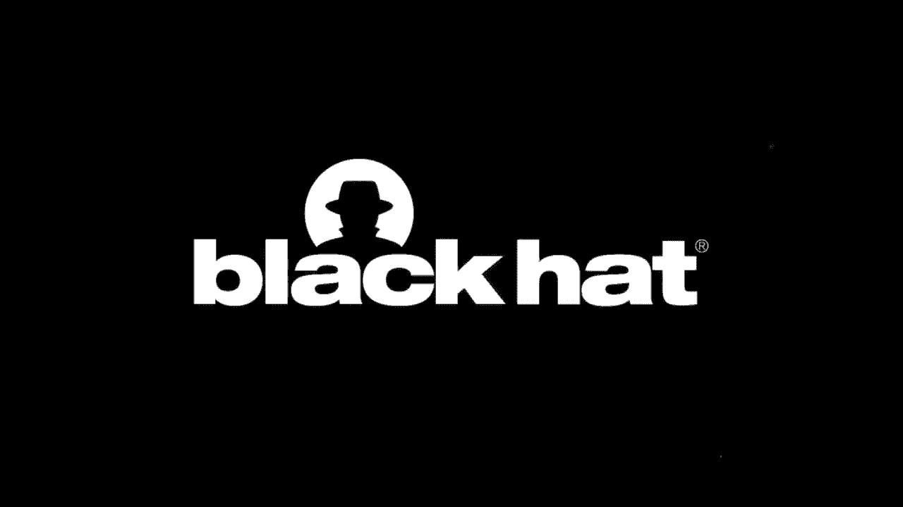

# P4：04 - 为选举供应商构建有效的漏洞披露计划 - 坤坤武特 - BV1g5411K7fe

[音乐]

>> 大家好，我是Chris Vilashin。我是选举系统与软件公司系统安全副总裁兼首席信息安全官。欢迎来到Black Hat，今天我们将讨论如何为选举供应商和黑客构建有效的漏洞披露计划。我和Mark Kerr一起，他是CINAC的首席技术官。ESNS、CINAC和CINAC正在共同努力提高选举安全性。您将听到我们与安全研究人员之间的合作和关系，他们将测试选举技术，提高公众对选举的意识和信任。关于我的简要信息。我曾在华盛顿特区的卫生与公众服务部工作。VA，还有一些其他工作，然后在美利坚合众国海军服役20多年。所有职位都关注网络安全和网络基础设施的安全性。

>> 大家好，我是Mark Kerr。我是CINAC的联合创始人兼首席技术官。CINAC是众包安全领域的领导者。我们招募、保留和审查全球安全研究人员的社区，并将他们带到我们的软件平台上，以发现我们客户的应用程序和基础设施中的可利用漏洞。在此之前，我在国家安全局从事实际的键盘利用操作，并担任分析师。您会意识到，您能带来什么样的团队来解决问题，以及您对任务的专注程度。这次演讲旨在提高公众对我们如何提高选举系统安全性的认识。作为我们民主制度中最神圣的方面，这非常重要，我很自豪能与ESNS一起就如何使选举更好，以及安全供应商、安全研究社区、选举供应商以及联邦政府、地方政府之间的关系进行讨论，以使我们的选举尽可能安全。

>> 在此之前，我还曾在国防部信息系统局工作。在那个角色中，作为系统工程师，您开始意识到一切都是相互关联的。一切都是相互连接和交织在一起的，我们必须采取全面的方法来保护我们的基础设施。下一页。选举安全状况肯定在改善，尤其是在与安全研究人员的关系方面。如果您回顾一下2000年代初，我们经历了2000年佛罗里达州总统选举，我们遇到了一些悬挂选票的问题。这导致我们从物理选票转向更多电子方法来计数和统计我们的选票。这导致了选举援助委员会的成立。多年来，我们看到越来越多的电子投票越来越普遍。您可以在网上投票，可以通过在线注册和选民注册数据库通过邮件投票。所有这些都正在进入互联网时代。然而，这个时间表旨在表明，这一切都是交织在一起的。投票基础设施的演变以及政府与安全研究社区的关系都是交织在一起的。我们正在关注过去20年的情况，但特别是在2016年，联邦政府启动了“黑客五角大楼”计划，开始与安全研究人员合作，在关键基础设施和防御系统上工作，利用众包方式利用人才来发现对手可能发现的漏洞，但我们试图提前发现这些漏洞。如果我们将此应用于我们的选举基础设施，它也被指定为关键基础设施，DHS在应对2018年和2016年俄罗斯干预选举后，因此，我们看到安全研究社区和负责管理我们选举基础设施的政府机构之间有一种完美的匹配。我们试图推进并改善这种合作，因为它可以非常有价值。您可以看到，安全供应商实际上正在站起来，为各州提供免费服务。微软在2019年对选举卫士启动了漏洞赏金计划。SINAC和CloudFlare为各州提供免费服务，我们将在稍后详细介绍。ITISAC开始认识到，这对于公众来说是一个如此重要的问题，我们必须有答案，即我们如何考虑选举安全来制定漏洞披露计划，以及我们如何将供应商关系和那些在外做出色工作的研究人员整合到一个更全面的解决方案中。这导致了DARPA的介入，真正推动了计算机安全领域的艺术状态，我们将讨论这一点，因为它与选民注册系统高度集成，并保护这些关键基础设施。然后我们将讨论ESNS合作以及ESNS正在做些什么来真正改善与安全研究人员的关系。总的来说，由于公众对选举安全的压力以及投票系统成为我们对手的主要目标，这已经发生了巨大的改善。这是不应该被忽视的，我很高兴看到它在改善。

>> 现在考虑到所有这些，我想谈谈众包安全实际上是什么。

有很多术语在流传，我想在深入探讨实际含义之前确保我们处于同一水平。

一般来说，您从所谓的漏洞披露计划开始，这是外部安全研究人员向供应商、政府报告漏洞的基本政策和程序，这是“看到问题就说出来”的等同物。您看到问题就报告它。然后我们演进到开放漏洞赏金模式，研究人员因其发现而获得报酬。他们因发现而获得报酬，这使我们能够稍微激励一下这项研究，但控制力较少。如果您需要一个非常关注特定用例或您有不愿意将其放在外部互联网上的敏感系统，您可能会转向下一个模式，即仅限邀请的漏洞赏金，这使我们能够私下选择具有特定技能的研究人员群体，并激励他们针对特定攻击因素进行攻击，这些因素特别有趣。也许是我们威胁建模中出现的，我们知道对手专注于这些因素。这是五角大楼和其他政府机构在关键基础设施上主要使用的方法。然后这种模式演变成更全面的提供，我喜欢称之为管理众包渗透测试。渗透测试传统上是由顾问领导的方法，顾问进来并运行清单，并将其与各种合规标准进行比较，无论是NIST 853还是PCI。这很好，但这个模型还集成了开放漏洞发现，我们能够激励研究人员发现有趣且可利用的漏洞。然后我们还将其集成到这个模型中，包括自动化扫描。自动化漏洞扫描肯定有它的地方，将开放量发现、自动化扫描和以合规性驱动的清单方法结合起来，使这个模型非常不同，更全面。此外，您还添加了分析、可审计性和可追踪性，以及严格的参与规则，以获得最全面的矩阵团队方法进行渗透测试。

>> 谢谢Mark。我为ESNS在建立内部漏洞披露计划、传达该计划的可用性以及与研究人员合作方面取得的进展感到自豪。这种合作正在发挥作用，我很高兴与您分享四个快速示例，说明研究人员如何不等待实施政策。他们正在积极解决选举安全问题。我还想指出，各州级别的众包渗透测试正在发挥作用。科罗拉多州正在与CINAC合作，使用众包渗透测试作为其网络安全计划的关键部分。我引用科罗拉多州州务卿首席信息官Trevor Timmons的话，CINAC正在取得进展，并与各州合作，特别是为了改善州选举系统的选举安全态势。我的第一个例子是思杰NetScaler，在2020年12月和1月广泛宣传。一位名叫Jack Cable的研究人员，他是Hack the Pentagon和其他重要倡议中众所周知、备受尊敬的一部分，联系ESNS，提醒我们思杰NetScaler VPN潜在漏洞存在恶意软件。我们与Jack合作，确定漏洞和涉及的设备，并确保漏洞和缓解补丁到位并经过测试。Jack在与ESNS沟通方面非常有效和专业。他帮助我们了解漏洞、其严重性，解释了他如何找到该漏洞，然后与我们合作减轻它。

>> 第二个例子来自两位专业研究人员Kevin Scogland和Tony Adams。Kevin和Tony大约工作了一年，使用您可以在幻灯片中看到的方法定义方法扫描互联网，以扫描具有特定响应的端口22和443，这些响应可以识别可能被选举官员用于通信非官方结果的防火墙，因为这些设备在没有适当的安全控制或配置错误的情况下可能容易受到外部威胁行为者的滥用。我们与Kevin和Tony合作，他们也向EII SAC、客户和DHS报告了这些问题，我们与该小组合作，确保并帮助我们的客户解决这些漏洞。

>> 第三个例子也来自Kevin Scogland和Tony Adams。他们出色地审查了选举技术供应商提交给EAC的文档，以期待认证事件。Kevin和Tony审查了这些文档，发现某些型号的Zebra QR码扫描仪出厂时，在使用配置条码时可能存在漏洞。这些是特殊的制造商专用条码，扫描仪可以扫描它们以执行管理功能。Kevin和Tony提醒我们这个问题，我们共同努力审查我们的Zebra扫描仪实现，以确保我们的实现不会容易受到这种漏洞的影响，并且我们实际上使用了Kevin关于如何处理此建议的建议。因此，我感谢Kevin和Tony对与技术制造商合作采取积极主动的方法，以确保我们尽可能安全。

>> 我的最后一个例子来自一名高中生Hunter Osmera。Hunter正在审查选民查看应用程序网站，并发现如果他在