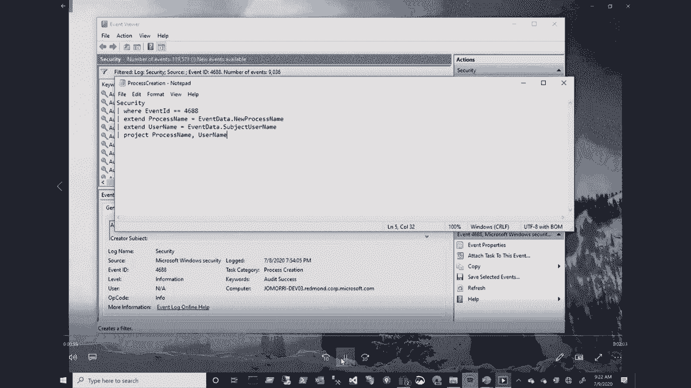
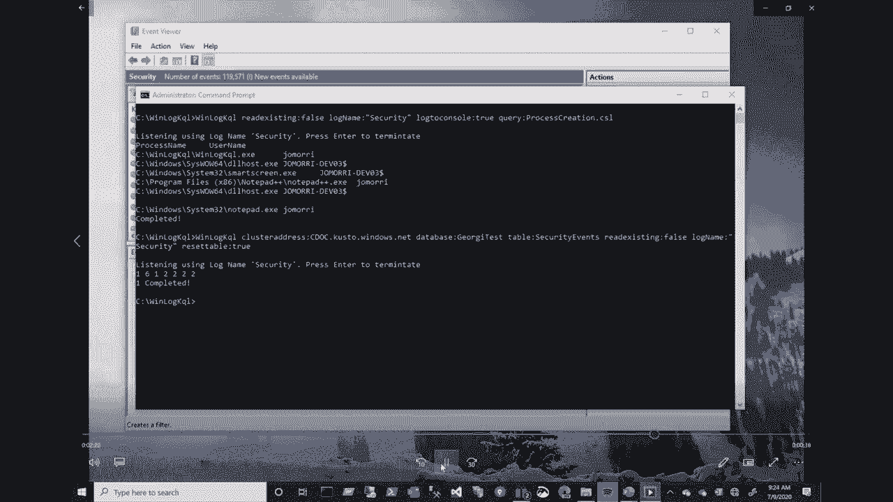
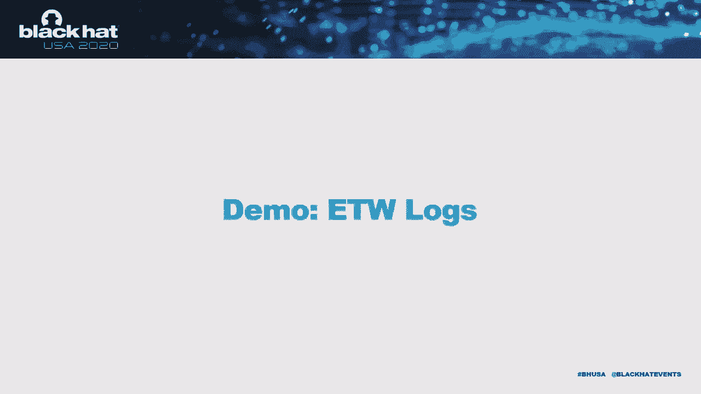
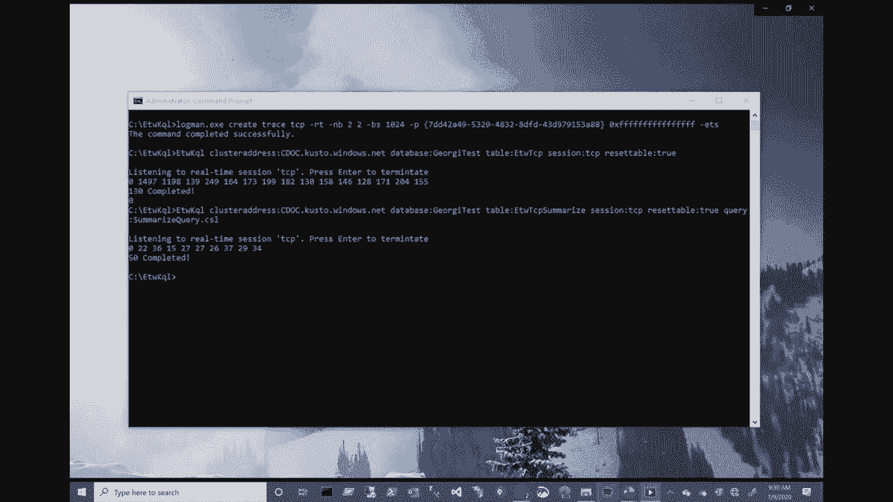

# P40：41 - Experimenting with Real-Time Event Feeds - 坤坤武特 - BV1g5411K7fe

## 概述

在本节课中，我们将学习如何使用实时事件流分析工具来提高安全运营中心（SOC）的日志分析效率。

## 工具现状

当前，SOC中用于日志分析的工具有以下特点：



* **复杂且效率低下**：现有的日志分析工具功能复杂，操作繁琐，难以高效处理大量数据。
* **数据收集困难**：需要收集操作系统日志、应用程序日志和大量跟踪数据，且需要选择具体的事件进行上传。
* **事件记录有限**：可用的实时事件流中，只有一小部分被记录在机器日志中，且只有更少的事件被SOC用于问题识别。

## 实时查询



为了解决上述问题，我们可以采用实时查询的方法：


* **实时数据流**：将所有数据作为实时事件流进行处理。
* **动态过滤**：在事件流到达磁盘之前进行动态过滤，仅存储所需的相关数据。
* **数据展示**：将相关数据以控制台、逗号分隔文件或JSON格式展示。

## KQL查询语言



我们使用KQL（Kusto Query Language）作为查询机制的语言，它具有以下特点：

* **简洁易用**：KQL语法简洁，易于理解和应用。
* **实时查询**：可以应用于实时事件流和记录在日志文件中的事件。
* **数据库兼容**：可以与任何数据库兼容，包括Kusto。

## 示例：读取Windows日志

以下是一个使用KQL查询Windows日志的示例：




```kusto
let processName = "notepad.exe";
processName | where processName == processName
```

该查询将返回所有名为“notepad.exe”的进程创建事件。

## 示例：上传数据到Kusto

以下是一个将所有安全事件上传到Kusto的示例：

```kusto
SecurityEvents
```

该查询将返回所有安全事件及其属性。

## 示例：ETW日志

以下是一个使用ETW KQL工具收集ETW事件的示例：

```kusto
let logmanSessionName = "ETWSession";
ETWLogs(logmanSessionName)
```

该查询将返回所有与指定日志管理会话相关的ETW事件。

## 总结

本节课中，我们学习了如何使用实时事件流分析工具来提高SOC的日志分析效率。通过使用实时查询和KQL查询语言，我们可以更有效地处理大量数据，并快速识别潜在的安全威胁。