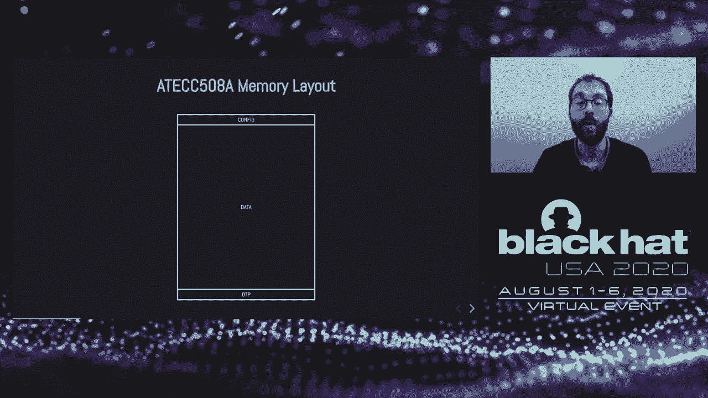
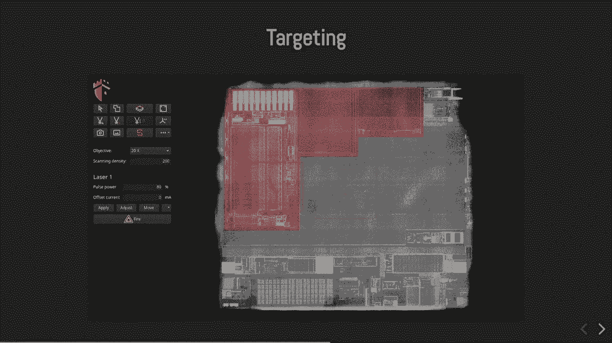

# P41：42 - Black-Box Laser Fault Injection on a Secure Memory - 坤坤武特 - BV1g5411K7fe

 Hello， my name is Olivier and I will present a laser-fault injection performed on a secure。

 noise。 I will show how we managed to bypass a security feature in a complete black box approach。

 I am part of the laser engine team， which is the security hub of the Azure， the hardware。

 wallet manufacturer and blockchain service provider。

 Our team is dedicated in software and hardware security evaluation of blockchain and IoT devices。

 Today we can find different solutions for storing secrets in embedded systems。

 Most of the time microcontrollers are used。 The sensitive information is directly stored inside the flash memory of the chip。

 which， can then be unlocked by burning some security fuses。

 This is a very convenient and local solution， however， it is usually not very secure， as。

 most microcontrollers cannot withstand hardware attacks。 This is the case， for example。

 of the STM-32 devices which are vulnerable to local/litch， attacks。 As we saw。

 we have many publications last year。 Secure elements are a much better solution。

 Those are security-dedicated circuits， which embed confirmations against hardware attacks。

 Those circuits are evaluated by laboratories to get security certification。

 Her code is reviewed and many tests are performed， such as fault injection or side-channel analysis。

 The goal is to verify the circuit can resist to a well-equipped and expert attacker。 Unfortunately。

 access to those devices is very limited because of non-disclosure agreements， you have to sign。

 And most of the time， it is not possible to develop native code for those very close platforms。

 Therefore， we can find a third circuit category which are the secure memories， such as the。

 AT-ECC508 form microchip。 The circuit target IoT applications were easily accessible and we can buy them from any wrestlers。

 and in small quantities。 We wanted to know more about the circuit and assess its security level。

 We studied this secure memory in a real application which is called Cardwalid。

 This is a hardware wallet for securing big coins and send the transactions for the blockchain。

 We studied the version 2， which is now deprecated， as only the version 3 is sold today。 Hopefully。

 the stator wallet revision is not vulnerable to the attack I will describe next。

 This wallet embeds the STM32 L4 microcontroller for the IPGAT TIFF software。

 It manages the USB communication， the keypad， the screen and runs the cryptographic algorithms。

 for signing the transactions。 Signing the transaction requires the knowledge of a private key which is called Vecid。

 Here， Vecid is not stored inside the microcontroller but in the secure memory which is connected。

 to it。 Access to Vecid is protected by authentication based on a pink code。

 So what are the perks of using an AT-ECC508？ To begin with， the software attack surface is reduced。

 The chip has little memory and exposes a limited set of commands。

 The firmware of Vecid is also a normal。 It is a manufacturer of IP and remains secret。 Hence。

 finding software vulnerabilities is difficult and must be done in a black box， approach。 Then。

 the Vecid embeds hardware security countermeasures。

 There are voltage glitch sensors and also a top metal shield which prevents attackers。

 from probing the internal signals of Vecid。 Using microscopic needles。 Finally。

 the clock of a processor is generated internally to prevent classic clock d-ching attacks。

 All those countermeasures are mentioned in the microchip documentation and we spent some。

 time checking their implemented。 We tested the chip behavior against glitches and we also observed the top metal shield after。

 the keypad chip on the phone side。 The software and documented countermeasures may exist but when reading the data sheet。

 we didn't find any reference to lights and so on and so we believed this chip would be。

 vulnerable to laser fault injection。 So here comes the laser。 This is a current test bench。

 We have a device under test。 Plugged onto our scaffold evaluation platform。

 This board sends the command to the circuit， reads the responses and generates accurate。

 signals for triggering the laser。 We used one laser source which sends light pulses through an optical fever。

 done to the， microscope objective lens to get a very thin laser beam。

 The microscope is mounted on a motorized stage which is controlled by the computer to automate。

 testing。 You have to know the silicon is transparent to infrared light。

 This is what allows us capturing the nice pictures of circuits from backside as we can。

 see on the right。 Also， circuits are very sensitive to light。

 Lighting a logic gate creates parisitic currents in the transistor and can modify the output。

 of the gate。 If we do this during the execution of the program。

 we can then introduce computation errors， corrupt， data or instruction codes。

 Laser fault injection is a very powerful and efficient technique。

 On the right of the slide we have pictures of two different circuits。

 The top one comes from a secure element and we can see small white rectum girls around。

 the logic gates。 Those are laser light sensors that are based on photodiodes and laser neurons when light。

 is detected。 The sensitivity level of the sensors is much lower than the required energy to inject a。

 fault。 The bottom picture comes from the AT-ECC 508 and we cannot see such patterns。 Therefore。

 it confirms there might not be any hard work on two measures against fault injection。

 It gets laser light fault injection。 So what is the plan？ Firstly。

 we have to identify the sensitive assets and find the attack path to retreat them。

 Here we are in a black box approach and we absolutely don't know how the firmware works。

 We have to make assumptions and imagine a fault which will disrupt the circuit to bypass， security。

 To help this， we will try to collect information which will help us to create an attack scenario。

 We will analyze the power consumption of the chip and overlook a T-T internal structure。 Finally。

 we run a testing campaign。 This is not the most difficult part of the job but for sure it is the longest one。

 It can take many days and require patience。 I am now going to detail the memory layout of the secure memory。

 The ePROM memory is divided into three areas which are the configuration， the data and。

 the one time programmable area。 We will focus only on the configuration and data。

 The data area is split into 16 files。 Each file or data slot is really small and as a fixed size。

 the first 8 data slots have， 36 bytes， the last 7 of 72 bytes and there is one bigger data slot in the middle。

 Each data slot has a specific configuration which is defined in the configuration area。

 of the memory。 The configuration describes the access rights of each data slot。

 It is set during chip insetization and then locked permanently with a special command。

 There is no possible factory reset once the chip has been configured。 In the Kolkard-wallet case。

 there are three interesting data slots highlighted in green， here。

 The first one is the Pering tree which is a random secret shared between the microcontroller。

 and the secure memory。 It is unique to each wallet and prevents attackers from swapping the microcontroller with another。

 one in an EVL-MADE scenario。 Then there is the PIN-1 data slot。

 It stores the ash of the user code mixed with the Pering keys。 Finally。

 the seed is stored inside the seed-1 data slot which is accessible only after。

 proving knowledge of the PIN-1 ash data slot through an authentication。

 So if an attacker manages to retrieve the content of the Pering key and PIN-1 ash data， slot。

 then he will be able to authenticate， get the seed and get all the lit coins。

 The second memory provides the hidden memory command for accessing the data slots。

 This command is very simple。 It takes the data slot number， a size and an offset。

 We can read either 4 or 32 bytes。 If access is granted to the data slot。

 the secret will respond with the content of the， data slot。 If access is denied。

 it will only return a single byte error code。 This is the configuration of the PIN-1 data slot。

 If we look closely， we can see two interesting settings。

 The first one is the E-secret flag which is enabled。 When this flag is set。

 the secure memory prevents reading the content of the data slot。

 It will remain secret and this data slot can only be used for authentication。

 Then we have the uncrit-read flag。 When this setting is enabled。

 the content of the data slot is returned uncrit when reading， the data slot。 As here。

 the data slot is marked as "is-grid"。 We can think the uncrit-read flag is not relevant at all。

 But if we manage to get access to the data slot with a fault injection， then we will。

 be happy to get it in plaintext and not uncrit it with an unknown key。

 So a first idea here is to flip the E-secret flag from "yes" to "no"。

 The security here relies only on a single bit which obviously does not sound very good。

 So how can we do this？ We are still in a black box approach and we don't know how the firmware works。

 We can only support it。 Here I wrote a very basic hypothetical code where I suppose the firmware will try to fetch。

 the data slot configuration from a print memory。 Then it will test the E-secret flag to decide if access is granted or denied。

 When access is granted， the firmware will fetch the content of the data slot in the， e-brand memory。

 uncrit it if the uncrit-read flag is set and then return the result。 If the data slot is secret。

 which is the case for the pairing key and the pin-1 hash data， slots。

 the other branch of the code is executed and an error code is returned instead。

 This thing we can try is faulting the if test here by replacing a branch instruction with。

 an op to change the execution flow。 The problem is， once again。

 we are in a black box and we don't know when the instructions， are executed。

 We don't know when we should fire the laser and if we don't shoot at the right time， many。

 things can happen。 As an example， if we shoot too late。

 the secret may not respond at all and the script， will raise the time out there。

 And from the outside， as we don't have any debugger， it's very hard to understand what。

 really happens。 If we shoot too early and modify the data slot number when the configuration is fetched。

 the firmware may by chance test access to a data slot based on the configuration of。

 a notarized data slot。 In this case， we would be lucky and retrieve the scripts。 The thing is。

 we will not really know why the attack worked。 Did we faulted what we wanted？

 Or is this a lucky side effect？ No， no， no， no， no。

 The first big question is， when should we precisely inject the fault？ To answer this question。

 we'll have a look at the power trace of the circuit。

 Here is a little schematic with a secure memory under test here， accepting commands and sending。

 the responses on the I squared C bus。 Then all the electrical current of the chip goes through a measurement resistor which。

 converts the current into a measurable voltage。 As we try to observe a very small signal。

 we need a amplifier to boost it before measuring， it with a oscilloscope。

 The power consumption of a circuit is highly correlated to its processor activities and。

 by recording it， we can collect some important clues。

 Here is a power trace example captured by a oscilloscope during the execution of the。

 read memory command on a granted data slot。 The error trace is the data signal of the I squared C bus。

 It conveys all the bits of the read memory command。

 The blue trace is the current electrical current of the circuit。

 As soon as all the bits of the read memory command have been sent， the processing starts。

 and the circuit requires more energy。 This is reflected by your arise in the power consumption。

 Once the processing is over， the current returns to an idle level。

 The response here is not visible in the read memory trace just because the chip is laid。

 on the bus and the response is fetched much later。

 If we repeat this experiment when trying to read a single data slot， we can observe the。

 processing stops earlier。 This is logical and it matches our previous code hypothesis。

 We've used two traces， we know when processing starts， we know when it stops， so we can already。

 define a cost time frame for the laser pulse。 But this is not precise enough yet。 To go further。

 we can average the traces to reduce the noise and there compare them in， detail。 Here is the result。

 The read trace corresponds to the linear access and the read trace corresponds to the。

 current access。 We can see at the beginning of the processing the two traces perfectly match。

 This means the execution flow is exactly the same in both cases。

 Then at a particular time the traces start to be very different because the execution paths。

 are not the same anymore。 This is probably the time when the E-secret flag is tested。

 the time of our hypothetical， conditional march。 If we continue looking at the granted access trace。

 we can observe after divergence a pattern， repeated eight times。 This looks like a loop。

 When injecting faults during this loop， we got faulty data output when reading the data， slot。

 This way we demonstrated this loop corresponds to the transfer of data slot from a print memory。

 to a ram buffer， maybe the I squared C buffer。 We saw that 32 bytes are copied by four byte words。

 And as we can expect， this data transfer does not occur in the DNA trace。 So with all those clues。

 we can objecting a fault near a divergent time， would bypass。

 the security and grant a success to the data slot。 Next big question。

 where should I physically lead the chip with a laser？

 Let's see how the AT-ECC fiber circuit is made and how we prepare it for laser fault， injection。

 Here is a drawing of a second package and if we add the package epoxy， we can see the。

 silicon inside， which is glued to the copper lead ring。

 Then there are bonding wires in copper or gold， which connects the inputs and outputs。

 of the die to the package pins。 As I said at the beginning of the presentation。

 the AT-ECC fiber 8 has a top metal shield。 This is usually one armor tracks covering all the surface of a chip to add what's underneath。

 So if we try to eliminate the chip on the front side， all the light will be blocked by。

 the shield and won't reach the transistors and we won't be able to inject an E-folt。 Instead。

 we will eliminate the chip from the other side。 For this。

 we will decapsulate the chip from the back side。 This can be done using a precise milling machine with a small diamond tool。

 The package is milled until the lead ring is visible， where process can last about half， an hour。

 require care and cleaning。 Once the lead ring is visible。

 it can be lifted off and removed using a scalpel。 Finally。

 the glue paste is removed gently using a small tool。

 Here is a real picture of a circuit decabade for backside access。 As I said previously。

 silicon is transparent to infinite light and if we turn on the camera， of the microscope。

 we can see through the silicon。 To get the scale， the die of the ETCC508 is 1。5 mm wide。

 which is smaller。 With the camera， we can then capture high resolution pictures of the chip。

 This reveals the internal structure of the circuit and us targeting the interesting areas。

 On the bottom of the chip， we can find analog circuitry。

 Shooting there is usually not very efficient， so we didn't investigate the scenario。 On the top。

 we can discover some memories and in particular， we have a e-brand memory， on the top left。

 which stores all the configuration and the data。 We then have a ROM memory on this right and this memory probably stores the firmware binary。

 of the circuit。 Finally， we have a RAM memory and the rest of the circuit is made of interconnected rigid。

 gates， which belongs to the processor and the peripheral ones。

 Knowing what each gate does is very difficult and it would require many months of reverse。

 engineering as we don't have access to the manufacturer design files。

 I said the laser beam is very thin thanks to the microscope objectives。

 It's actually the size represented on this slide by the red dot。

 It's easy to understand that scanning all the chips of us to find potential vulnerabilities。

 can be very long and reducing the such space to the most interesting areas is crucial。

 To target specific areas of the chip， we developed the dedicated navigation software。

 Most of the time we target memories first because it usually gives good results。

 Memories are very sensitive to fault injection and as they carry the program data or the instruction。

 code， there's a good chance we get very critical faults if the memories are not protected。

 Once the scanning zones have been defined， we can run the testing script。

 The software will automatically move the laser beam to a new position for each test。

 The laser beam displacement follows a random marching algorithm which allows editing dynamically。

 the search space during the testing campaign and also stop or resume it at any time。

 Before starting the testing campaign， we loaded non data into the data slot we wanted to retrieve。

 Research to define a stop condition in case of success。 Then for each test。

 the laser shooting time is configured。 The laser beam is moved to the next scanning position。

 The circuit is powered and done。 An initialization sequence is sent。

 the laser is activated and then the read memory command。

 is sent with the laser shoot at the same time。 Laser is deactivated and the response is read out。

 Then the circuit is powered off， which is necessary in case the firmware is in a bad。

 state or when the analog circuitry goes crazy which is known as the latchup effect and can。

 be destructive if not stopped。 Finally， the result and the testing parameters are all logged into a database。

 We'll see right after that logging the experiment properly is very important。

 During the testing campaign， about one test or second is performed。

 A lot of faults are injected and many different things happen。

 The chip can crash and not respond to the command so we get a timeout in the script。

 We can get a positive response from the chip but with unexpected data。 For example。

 the test number 4 returns some kind of either with a lot of foreign zeros。

 This is not what we expected and we clearly don't know what this is。

 A lot of times we got random looking data。 Sometimes we got undocumented records or successes without a needed auto。

 You don't really know what will happen during testing before training and it's very important。

 to write reliable testing script to catch and log all possible weird behavior。

 Even checking the CRC values can help。 We run a very long testing campaign which lasted many days。

 We usually stop when you get a success or when you get bored。 And after a long run and 300。

000 tests we got bored。 We logged more than 1000 responses from the chip with data but unfortunately none of those。

 matches the preloaded data we set at the beginning。 And so we were pretty excited。 However。

 we add the feeling we were close to succeeding and we decided to investigate。

 our results to understand what was happening。

 We sorted all the results with data in the top 20s。

 We can see that some of the returned data were received a lot of time。

 As the chip is powered off and powered on for each test this cannot be random data and。

 it's obviously stored somewhere in the chip。 We just don't know what this is and as it looks random we thought it might be encrypted。

 We then plotted the data what data was received all the time which is represented by this， figure。

 The x-axis corresponds to the experiment number and the received data are sorted on the y-axis。

 For instance， if we look at the first line the data starting with a712 we can see it has。

 been received many times during the first 100，000 tests。 Until a certain time。

 After that we never got this result anymore。 We finally understood something unexpected happened。

 We think at this time the content of our data slot has been overwritten by accident probably。

 because of the fault。 This seems to have happened many times during the world testing campaign。

 We believe the generate key command of the etcc had been triggered probably with a fault。

 by accident during the command dispatcher。 This would explain the randomness of the new data in the slots。

 We also observed some data seem to be related in pairs。

 If you remember the configuration of the data slot， maybe we faulted the encrypted flag。

 in some cases。 So we get both plaintext and encrypted data from the slot。

 So this looks like very good news we believe we may have successfully read the secret data。

 slot but we weren't lucky enough to retrieve the content before overwriting it。

 So it's not a win yet and we need to improve this setup。

 As a new challenge we wanted to do it without losing the data。

 Using the log files we identified optimal attack parameters。

 The goal is to increase the success rate as much as possible and reduce the risks of。

 data of the rat。 Then we then decapsulated the secret and reverse secret。

 reloaded on data and started the experiment， again with the new attack parameters。 And we won。

 In less than two minutes we managed to extract the correct data without operating it。

 We are now able to read both the pairing secret and the pin one ash data slots as we share。

 the same configuration。 Those two data slots allows us performing a successful authentication to access the seed。

 and get all the bitcoins。 Despite the complexity and cost of this attack it can really pay off。

 Some people can protect big amounts of bitcoins in other wallets and there's no possible drawback。

 after theft。 We've been many times asked if we kill chip before managing to do this attack。

 Bonswerk is yes of course。 We destroyed about 10 circuits doing our work which is not that much since the samples are。

 chip and easily accessible。 However， each time you kill a chip you have to decapsulate another one which takes time。

 and quickly gets boring。 We killed some chip when trying to configure them since the configuration of the secure。

 memory can only be set once。 Any mistake is really painful。

 We also killed circuits during decapsulation especially when we tried silicon grinding and。

 polishing to reduce the day thickness and get more light when it's hurting the sample。

 Also we destroyed many chips due to bad data of a right in the impromptu memory。

 Usually resulting in another lead configuration which gets rejected during circuit cell tests。

 As distractions are oddly predictable it's difficult to take actions for preventing them。

 We saw that the chip is minimal to laser fault injection。

 There are many mitigations which could be implemented to ensure better security。

 The software can be improved while adding the project。

 A typical countermeasure is double checking all the sensitive operations so the attacker。

 has to perform the attack twice which is much more difficult especially when the success。

 rate is low。 Also， we saw that the E-cigarette flag is uncoded using only one lead。

 A way to then what constraints might be much more difficult to correct to a correct value。

 I told you， open full it is to break a chip and prepare replacement samples。 To me。

 the best countermeasure is implementing the kill chip。

 If the program detects an error during its execution it can take actions to destroy itself。

 permanently。 By using its own firmware for instance。

 With such behavior an attacker may quickly give up。

 There are also hardware mitigations which can be added。 The most efficient are laser light sensors。

 You get caught 99% of the time and it's very difficult to second bend。

 Noise can be added to the power consumption to make its power trace analysis much harder。

 The CPU clock can be randomized which adds noise to the power trace and also reduces the。

 success rate of the attacks。 Because the correct shooting time is never the same。

 Just imagine switching arrows at a random moving target and you get the ID。

 The memories can be protected with error detection codes so any corrected data transfer can be。

 detected。 Each of the software and other countermeasure may be defeated by a skilled attacker。

 But when there are multiple of those together it becomes very hard to act the chip。

 And if any countermeasure triggers a kill chip then it's extremely difficult。

 And actually this is what secure elements do。 But it's not that easy to improve the security of a chip。

 Implementing correctly the countermeasure is hard and if not done correctly security can。

 even get worse。 Furthermore， a very mitigation has a cost。

 It also has an impact on performance and power。 The countermeasure can also be pattern protected which can be a real problem for a chip manufacturer。

 And fortunately security is expensive。

 Finally， some last words about our work。 We presented a difficult attack which require very expensive equipment。

 The cost of our test bench， including the laser station， the oscilloscope and all the。

 instruments is about 200，000 dollars。 However， it might be possible to reproduce this attack with cheaper equipment。

 In this case， the success rate may be lower but the attack might still be rewarding。 And after all。

 I've seen brilliant people with much more equipment in the Engage Venice。

 The vulnerability I've presented affects a very specific data slot configuration。

 This is not a generic attack as opposed to what's been done with microcontrollers where。

 all the memory can be retrieved。 This is not the case here and in particular we didn't manage to read cryptographic keys。

 from the data slots which are only different by the secure memory。 However。

 we demonstrated the circuit at some weaknesses against laser foot injection and。

 some may find attack paths to break over functionalities。

 We believe this circuit really lacks some countermeasures。 Finally， the AT-ECC 5。

8 has been deprecated by microchip。 It can be now replaced by the backward compatible AT-ECC 6。

08 which should be more secure。 You can click on the red button to see the video。

 Thanks for watching this presentation and feel free to ask questions。

 Hi everyone， thanks for watching。 It's now time for Q&A。 I hope you enjoyed my presentation。

 I got only one question。 I'm not sure about the rel question。

 If the question is this backdoor inserted in a superchain attack， the answer is no。

 All the devices are affected by this vulnerability depending on the configuration。

 So if an AT-ECC 5。8 has a data slot with the E-secret flag and is not used for an electric。

 curve key， then it will be vulnerable to this attack。

 This is more like a weakness of the circuit and it's not a backdoor or a simply chain， attack。

 I don't know if you have more questions。 As you could see， visibility is out to patch。

 We had a long disclosure time with microchip。 And they actually made the circuit deprecated now so you can buy the next revision which。

 should be more secure。 So thanks for the feedback on the chat。 I appreciate it。

 I hope you enjoyed it。 Okay， another question。 Does the laser permanently affect the chip or only during operation？

 Can it change memory of transistor state？ Basically the fault injectants are transient use。

 You can flip or correct the data for a very short amount of time。

 This is why this is very powerful and you can make very charrogyical faults。 However。

 you can have dominant effects depending on the direction of the chip。 For instance。

 if you trigger some memory right in a random address， you may bridge the chip。

 or have a weird behavior。 Do you have planes to analyze the other secure memories？ Actually。

 we are looking at the 608 but we didn't plan yet looking at other secure memories。

 As you may understand， it takes a lot of time。 We had a few months of work for this but maybe we can have a look at other memories。

 How many chips do you need to complete the laser fault injection？

 We broke less than 10 chips so it's not a lot。 And now if we want to reproduce the attack only one chip is enough。

 What semiconductor geometries are susceptible to the laser fault injection attack you demonstrated？

 As I said， the memories are really susceptible to laser fault injection。

 Then basically everything that is a transistor can be defaulted。

 But you have to spend a lot of time scanning the area of the circuit to find efficient faults。

 We have heard that there is a TECC 508B version but may address this。 Is this true？

 I don't really know。 I know my chip worked on patching the device。 I don't know the state here。

 I can't answer this really。 But if they make this silicon they will make improvements。

 One last question。 Why did you decap from the bottom rather than the top？

 It's mainly because of the top metal shield which shadows all the light you can inject。

 from the top。 You can't reach the transistor with the photons and you don't have this problem on the backside。

 Would something similar work on the BGA package？ BGA package might be a problem if you can't access the backside。

 But usually it will take more time。 But you can always remove the bolts and try to remove the pins if you don't have much。

 pins。 That is the laser wavelength influence the success rate。 I don't know。

 I have only one wavelength。 Thanks for your feedback and your questions。 I hope you enjoyed。

 Don't hesitate to share the presentation or to tell people to have a look at it。 Thanks。

 [BLANK_AUDIO]。