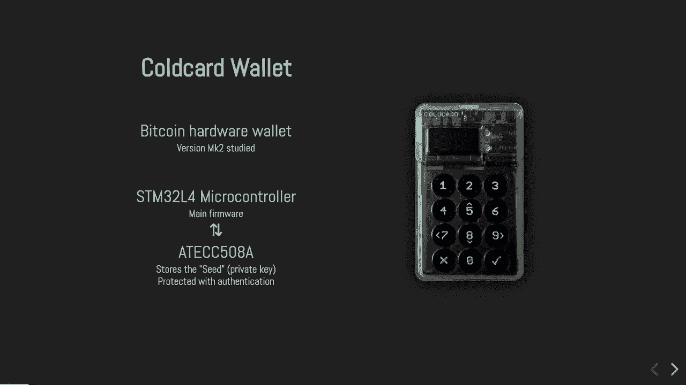
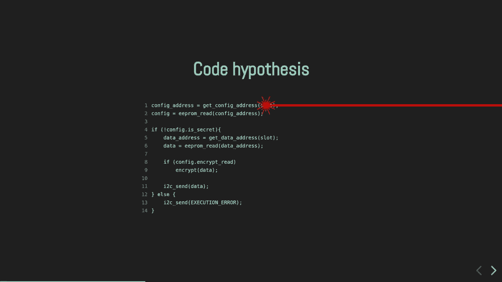
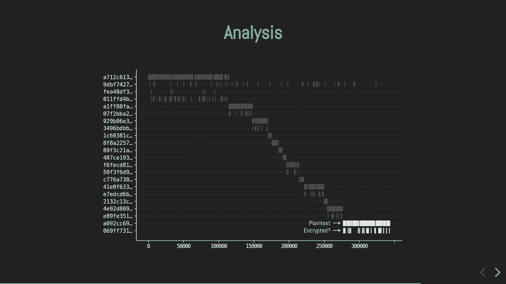
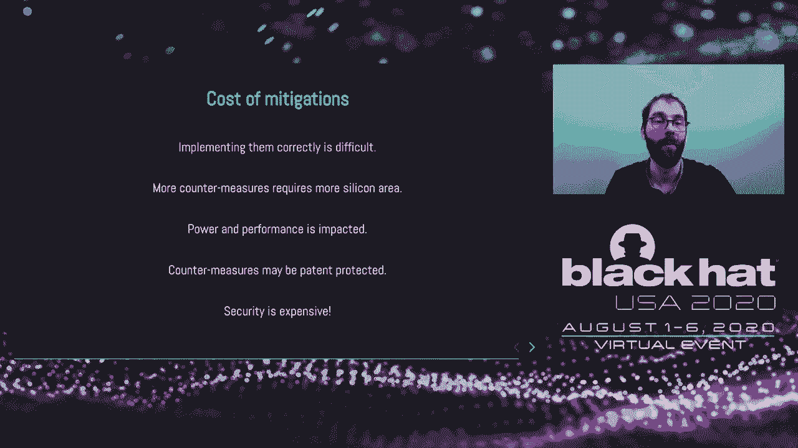

# P41：42 - Black-Box Laser Fault Injection on a Secure Memory 🧐

## 概述

在本节课中，我们将学习如何对安全内存进行黑盒激光故障注入攻击。我们将了解攻击过程、所需工具、攻击原理以及如何提高安全性。

## 黑盒激光故障注入攻击

### 攻击目标

攻击目标是AT-ECC508安全内存，该内存用于存储敏感信息，如私钥和交易数据。

### 攻击原理

攻击者通过激光故障注入技术，在安全内存中引入计算错误，从而获取敏感信息。

### 攻击步骤

1. **识别敏感资产和攻击路径**：分析安全内存的内存布局和配置，确定攻击路径。
2. **收集信息**：分析芯片功耗和内部结构，为攻击场景提供线索。
3. **注入故障**：在合适的时机和位置注入故障，导致计算错误。
4. **读取数据**：分析返回的数据，提取敏感信息。

## 攻击工具

### 激光测试台

激光测试台用于发送激光脉冲，触发故障。

### 显微镜

显微镜用于观察芯片内部结构，确定攻击位置。

### 信号分析仪

信号分析仪用于分析芯片功耗和内部结构。

## 攻击案例

### Cardwalid硬件钱包

Cardwalid硬件钱包使用AT-ECC508安全内存存储私钥和交易数据。攻击者通过激光故障注入技术，成功读取了私钥和交易数据。

### 攻击结果

攻击者成功读取了私钥和交易数据，但未成功提取私钥内容。

## 提高安全性

### 软件层面

1. **双重检查敏感操作**：确保攻击者需要执行多次攻击才能成功。
2. **实现“杀芯片”功能**：检测到错误时，芯片自动销毁自身。

### 硬件层面

1. **激光光传感器**：检测激光注入攻击。
2. **增加功耗噪声**：使功耗分析更困难。
3. **随机化CPU时钟**：增加攻击难度。

## 总结

本节课中，我们学习了黑盒激光故障注入攻击的原理、工具和案例。我们还讨论了如何提高安全性。希望这节课能帮助您更好地了解安全内存的攻击和防御方法。